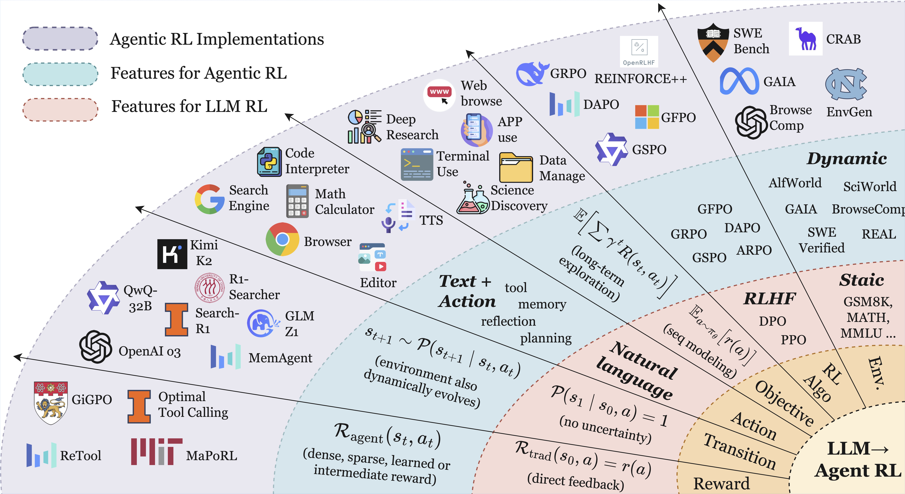
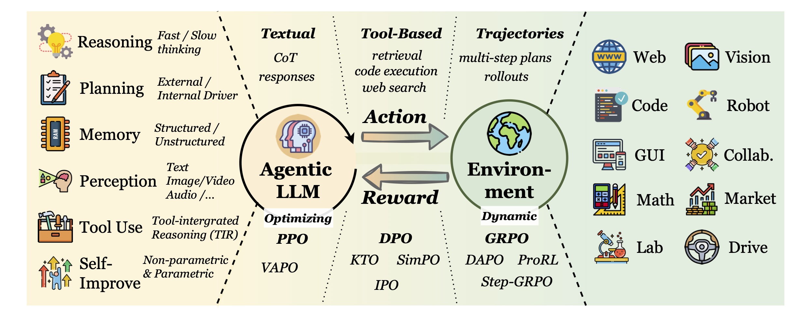
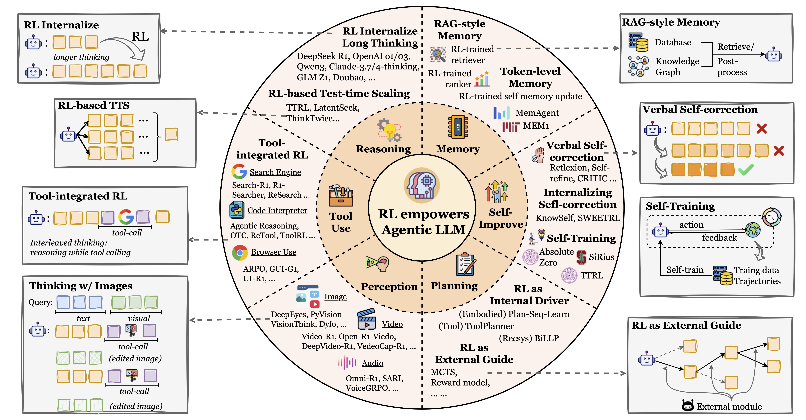
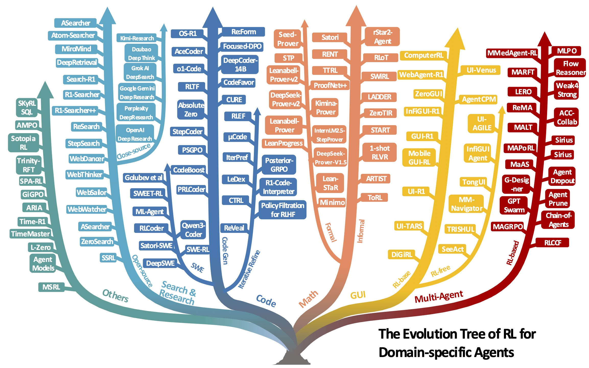
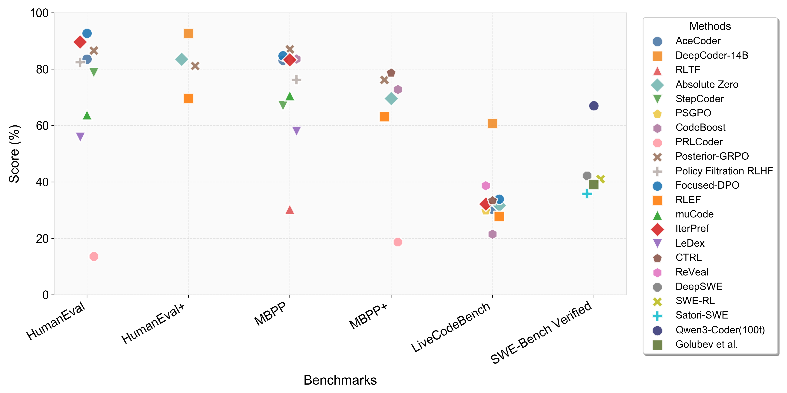
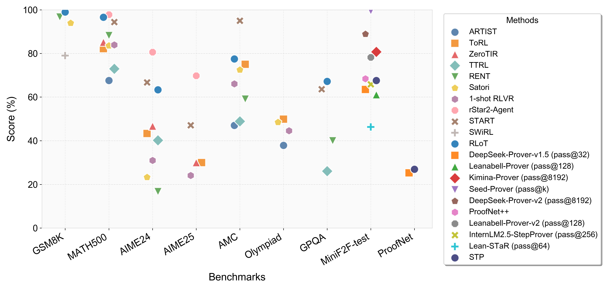

# The Landscape of Agentic Reinforcement Learning for LLMs: A Survey

- **Authors:** Guibin Zhang, Hejia Geng, Xiaohang Yu, Zhenfei Yin, Zaibin Zhang, Zelin Tan, Heng Zhou, Zhongzhi Li, Xiangyuan Xue, Yijiang Li, Yifan Zhou, Yang Chen, Chen Zhang, Yutao Fan, Zihu Wang, Songtao Huang, Yue Liao, Hongru Wang, Mengyue Yang, Heng Ji, Michael Littman, Jun Wang, Shuicheng Yan, Philip Torr, Lei Bai
- **Venue/Year:** Transactions on Machine Learning Research (TMLR), 2025 (arXiv: 2509.02547v4)
- **Link:** https://arxiv.org/abs/2509.02547
- **Tags:** Agentic RL, LLM, POMDP, Survey, Planning, Tool Use, Memory, Reasoning, Self-Improvement, Perception

---

## TL;DR

本文系统性综述了 **Agentic Reinforcement Learning** 领域——即用 RL 将 LLM 从被动文本生成器转变为自主决策智能体。论文将其与传统 LLM-RL（RLHF/DPO 等单步 MDP 范式）做出严格形式化区分，提出以**六大智能体能力**和**七大应用领域**为双轴的分类体系，综合了 **500+ 篇近期工作**，并汇编了开源环境、基准和框架的实用索引。这是该领域目前最全面的综述。

---

## 1. 核心动机：为什么需要 Agentic RL？

传统 LLM-RL（如 RLHF、DPO）本质上是**退化的单步 MDP**：给定 prompt，生成一次性回复，获得标量奖励，episode 立即结束。这种范式存在根本性局限——它无法处理需要**多步决策、环境交互、工具调用、长程规划**的真实场景。

Agentic RL 的核心范式转变是：

> **将 LLM 从被动的序列生成器重新定义为嵌入在复杂、动态世界中的自主决策智能体，RL 作为关键机制将静态的启发式模块转化为自适应的、鲁棒的智能体行为。**

本文的核心论点是：仅靠 prompt engineering 或 SFT 无法赋予 LLM 真正的智能体能力，**RL 是不可或缺的训练范式**。

---

## 2. 形式化框架：从 LLM RL 到 Agentic RL

下图展示了从传统 LLM RL 到 Agentic RL 的范式跃迁。扇形设计反映了从传统 RL 向 Agentic RL 的外向增长，色彩编码区域和箭头指示交互广度的递增：

*Figure 2: 范式跃迁——从 LLM RL 到 Agentic RL。最内层是传统 LLM RL（单步、自然语言、静态），向外扩展到 Agentic RL（多步、工具调用、动态环境）。右侧展示了关键区别：动作空间（Text + Action）、状态转移（动态演化）、奖励（稠密/稀疏/中间奖励）、目标函数（长程折扣累积回报）。*

### 2.1 传统偏好强化微调 (PBRFT) — 退化单步 MDP

传统 LLM-RL 建模为退化 MDP：**⟨S_trad, A_trad, P_trad, R_trad, T=1, γ=1⟩**

- **状态空间** S_trad：静态 prompt 输入
- **动作空间** A_trad：纯文本 token 序列
- **状态转移** P_trad：确定性，P(s₁|s₀, a₀) = 1（无不确定性）
- **奖励** R_trad(s₀, a₀)：单次标量评分（输出质量）
- **时间跨度** T=1：一次性生成后 episode 立即终止
- **目标**：最大化单次回复的期望奖励

### 2.2 Agentic RL — 部分可观测 MDP (POMDP)

Agentic RL 建模为完整 POMDP：**⟨S_agent, A_agent, P_agent, R_agent, γ, O⟩**

- **状态空间** S_agent：动态演化的环境状态
- **动作空间** A_agent = A_text ∪ A_action：文本生成 + 结构化动作（工具调用、代码执行、网页浏览、环境操控）
- **状态转移** P_agent(s_{t+1}|s_t, a_t)：随机性转移，环境随动作动态演化
- **奖励** R_agent(s_t, a_t)：步骤级稠密子奖励 + 任务完成稀疏奖励的组合
- **部分可观测性** O：智能体无法直接观测完整状态，需主动获取信息
- **目标**：最大化长程折扣累积回报 E[Σ γ^t r_t]（涉及长程信用分配）

### 2.3 关键维度对比

| 维度 | 传统 LLM-RL (PBRFT) | Agentic RL |
|------|---------------------|------------|
| 形式化 | 退化单步 MDP ⟨S, A, P, R, T=1⟩ | POMDP ⟨S, A, P, R, γ, O⟩ |
| 时间跨度 | T=1，一次性生成 | T≫1，多步轨迹 |
| 可观测性 | 完全可观测（prompt 即 state） | 部分可观测（需主动获取信息） |
| 动作空间 | 纯文本 token | 文本 + 工具调用 + 环境操作 |
| 状态转移 | 确定性（无环境动态） | 随机性（环境随动作演化） |
| 奖励信号 | 单次标量（输出质量） | 累积折扣奖励（步骤级 + 结果级） |
| 核心挑战 | 偏好对齐 | 长程信用分配、探索-利用、动态规划 |

这一形式化区分是全文的理论基石，清晰说明了为什么传统 RLHF/DPO 不足以训练真正的智能体——它们缺乏时间扩展、部分可观测性和动态环境交互的建模能力。

### 2.4 主要 RL 算法族

论文梳理了 Agentic RL 中使用的四大算法族及其 30+ 变体：

| 算法族 | 核心机制 | 优势 | 局限 | 代表性变体 |
|--------|---------|------|------|-----------|
| **REINFORCE** | 策略梯度 + 基线函数 | 理论简洁 | 高方差 | — |
| **PPO** | 裁剪概率比防止破坏性更新 | LLM 对齐主流；稳定性好 | Critic 开销大 | VAPO, LitePPO, VinePPO |
| **DPO** | 偏好似然目标消除显式奖励模型 | 无需训练 RM | 依赖静态数据集；离线 | β-DPO, SimPO, IPO, KTO, ORPO |
| **GRPO** | 组相对奖励消除 Value Critic | 无 Critic 开销；DeepSeek 创新 | 方差/偏差需要变体解决 | DAPO, GSPO, GMPO, ProRL, Step-GRPO, StarPO, TreePO |

论文 Table 2 对这 30+ 变体按**自适应 KL 惩罚、过程监督、在线/离线适配、几何平均奖励聚合**等维度做了详细对比。

---

## 3. 六大智能体能力分类（能力视角）

下图是论文的核心概念图，展示了 Agentic LLM 与环境的交互循环：左侧六大核心能力驱动动作生成，中间是 Agentic LLM 核心，右侧是多样化的应用环境，底部列出了关键 RL 算法：

*Figure 3: Agentic LLM 的智能体-环境交互循环。左侧：六大核心能力（Reasoning、Planning、Memory、Perception、Tool Use、Self-Improve）。中间：动作空间（Textual / Tool-Based / Trajectories）。右侧：应用领域（Web、Vision、Code、Robot、GUI、Collab.、Math、Market、Lab、Drive）。底部：核心 RL 算法（PPO、VAPO、DPO、KTO、SimPO、IPO、GRPO、DAPO、ProRL、Step-GRPO）。*

下图更详细地展示了 RL 如何赋能六大能力的每个子方向，以及具体的代表性工作：

*Figure 5: RL 赋能 Agentic LLM 的能力全景。中心"RL empowers Agentic LLM"向外辐射六大能力，每个能力进一步细分子方向并列出代表性工作。外围虚线框展示了每个子方向的工作原理示意图。*

---

### 3.1 Planning（规划）

RL 在规划中的角色分为两种互补范式：

**（一）RL 作为外部引导（External Guide）**

RL 训练辅助的价值函数或启发式函数来引导经典搜索算法（如 MCTS），LLM 本身的参数不变。

- **RAP** (Reasoning via Planning)：将 LLM 同时作为世界模型和推理智能体，用 MCTS 搜索推理路径
- **LATS** (Language Agent Tree Search)：结合 LLM 的语言能力与树搜索算法，支持环境反馈和自反思
- **Planning without Search**：使用离线目标条件 RL 训练 value function，直接引导 LLM 输出而无需在线搜索
- **Learning When to Plan**：动态的 test-time 计算分配——何时需要深思，何时直觉足够

**（二）RL 作为内部驱动（Internal Driver）**

RL 直接通过环境反馈优化 LLM 自身的规划策略参数。

- **ETO** (Exploration-based Trajectory Optimization)：用 DPO 在成功/失败轨迹上训练规划策略
- **VOYAGER**：在 Minecraft 中迭代构建技能库，通过环境反馈持续改进规划能力
- **DSP** (Dynamic Speculative Planning)：优化推理延迟-成本权衡
- **RLTR**：工具使用奖励驱动的规划优化
- **AdaPlan / PilotRL**：渐进式 RL 训练，逐步增加规划复杂度
- **Planner-R1**：研究奖励密度对规划策略的影响

**未来方向**：通过元策略（meta-policy）融合"深思熟虑"（deliberation）与"直觉"（intuition），动态决定何时探索、何时剪枝、何时在承诺行动前先推理。

---

### 3.2 Tool Use（工具使用）

工具使用是 Agentic RL 中发展最迅速的能力之一。论文追溯了三阶段演进：

*Figure 4: Agentic Tool Use 的发展历程及代表性工作。从早期的 ReAct 式提示调用，到 SFT 微调阶段（Toolformer、FireAct、AgentTuning），再到 RL 驱动的工具集成推理（ToolRL、OTC-PO、ReTool、VTool-R1、AutoTIR）。*

**第一阶段：ReAct 式调用（Pre-RL）**

- **ReAct**：基于 prompt engineering 的推理+行动交替框架，通过 few-shot 示例引导工具调用
- **Toolformer**：通过 SFT 在标注数据上训练 LLM 学习何时/如何调用 API
- **FireAct**：在 ReAct 基础上用 SFT 微调特定任务的工具调用策略
- **AgentTuning / Agent-FLAN**：大规模智能体行为数据的 SFT
- **局限**：静态模式匹配，无法根据环境反馈自适应调整工具策略

**第二阶段：工具集成推理 (Tool-Integrated Reasoning, TIR)**

RL 使智能体能够根据结果反馈自适应地选择和组合工具：

- **ToolRL**：发现 RL 训练可产生涌现式自纠错行为——智能体学会在工具失败时自动重试或换用其他工具
- **OTC-PO** (Optimal Tool Calling via Policy Optimization)：优化工具调用的时机和选择
- **ReTool**：用 RL 训练智能体在推理和工具调用之间动态切换
- **AutoTIR**：自动化的工具集成推理，无需人工设计推理-工具交互模式
- **VTool-R1**：视觉工具调用的 RL 训练
- **DeepEyes / ARTIST / ToRL**：多模态工具集成
- **理论基础**：Lin & Xu (2025) 证明 TIR 能突破纯文本 RL 的"隐形约束"（invisible leash），扩展 LLM 的能力边界

**商业系统集成**：OpenAI o3/Deep Research、Kimi K2、Qwen QwQ-32B、Zhipu GLM Z1、Microsoft rStar2-Agent、Meituan LongCat 等均已将 RL 优化的工具策略作为基线能力。

**第三阶段：长程工具集成推理（前沿挑战）**

多轮推理序列中的时间信用分配——当一个 10 步工具链最终成功时，如何判断哪一步工具调用是关键的？

- **GiGPO**：轮次级 (turn-level) 信用估计
- **SpaRL**：稀疏奖励下的长程信用分配
- 这是贯穿所有能力维度的核心开放问题

---

### 3.3 Memory（记忆）

智能体记忆分为三大类，RL 在每类中的角色各不相同：

**（一）RAG 式记忆**

将外部知识库作为记忆存储，RL 控制检索和更新行为：

| 方法 | RL 参与 | 机制 |
|------|---------|------|
| MemoryBank | 无 | 基于规则的记忆管理 |
| MemGPT | 无 | 操作系统式分层记忆 |
| HippoRAG | 无 | 海马体启发的检索架构 |
| **Prospect** | **RL** | RL 优化检索策略 |
| **Memory-R1** | **PPO/GRPO** | 学习 ADD/UPDATE/DELETE 记忆操作 |
| **Mem-α** | **RL** | 端到端 RL 驱动的记忆检索 |

**（二）Token 级记忆**

显式或隐式 token 作为可训练的记忆单元：

- **显式 token**：MemAgent、MEM1、ReSum、Context Folding——在上下文中维护显式的记忆 token，RL 控制何时写入/读取/遗忘
- **隐式 token**：MemoryLLM、M+、MemGen——将记忆压缩到隐空间表示中，RL 优化压缩-召回的权衡

**（三）结构化记忆**

基于知识图谱的记忆系统，支持层次化检索：

- **Zep**：生产级记忆系统，支持对话历史的图结构索引
- **A-MEM**：自适应记忆，动态调整记忆粒度
- **G-Memory**：图记忆，RL 驱动图的构建和查询策略

**核心创新**：Memory-R1 将记忆管理建模为 RL 问题——记忆的 ADD/UPDATE/DELETE 操作作为动作空间，记忆对后续任务的帮助程度作为奖励信号，通过 PPO/GRPO 端到端训练记忆管理策略。

---

### 3.4 Self-Improvement（自我改进）

四种由浅到深的自我改进模式：

**（一）语言层面的自我纠错 (Verbal Self-Correction)**

智能体通过外部反馈循环生成批评然后修正输出。代表：**Reflexion**（将失败经验转化为语言反思）、**Self-Refine**（迭代批评-修正循环）、**CRITIC**（多维度自评估）。局限：依赖 LLM 自身的批评能力，可能"错上加错"。

**（二）内化纠错 (Internalizing Self-Correction)**

通过 RL 将纠错能力内化为模型权重，无需运行时的显式反馈循环。代表：**KnowSelf**（自我认知驱动的纠错）、**SWEETRL**（将自我纠错信号作为 RL 奖励）。

**（三）迭代自训练 (Self-Training)**

智能体生成新的训练数据，不断迭代提升：**Absolute Zero**（自举式数据生成+自训练）、**SiRius**、**TTRL**。形成"数据生成→训练→更强的数据生成"的正循环。

**（四）反思能力的元进化**

最高层次——智能体学会改进自己的改进过程本身。这一方向尚处于早期探索阶段。

---

### 3.5 Reasoning（推理）

论文区分了两种推理模式及其融合：

**（一）快速推理 (Fast Reasoning) — System 1**

直觉式、高效推断，通过标准 LLM 生成。RL 的角色是优化推理效率——在保持准确性的前提下减少推理步骤和计算开销。

**（二）慢速推理 (Slow Reasoning) — System 2**

深思熟虑式、结构化问题求解。核心方向：

- **RL 内化长思考**：DeepSeek R1、OpenAI o1/o3、Qwen3、Claude-3.7/4-thinking、GLM Z1、Doubao 等——通过 RL 训练 LLM 自主产生更长、更深入的推理链
- **RL 驱动的 Test-time Scaling**：TTRL、LatentSeek、ThinkTwice 等——在推理时通过 RL 动态分配更多计算资源给更难的问题
- **过程监督 (Process Supervision)**：不仅奖励最终结果，也对中间推理步骤给予细粒度奖励信号

**（三）融合模式**

自适应分配计算资源——简单问题用快速推理，复杂问题切换到慢速推理。通过 RL 训练元策略来决定何时需要"慢想"。

---

### 3.6 Perception（感知）

将 LLM 的感知能力从被动接收扩展到主动获取：

**（一）接地驱动的主动感知 (Grounding-driven Active Perception)**
- 智能体学会主动关注图像/场景的特定区域
- RL 优化空间注意力机制——在复杂场景中学会"看哪里"

**（二）工具驱动的主动感知 (Tool-driven Active Perception)**
- 智能体通过调用视觉工具（OCR、目标检测、图像搜索）主动获取视觉信息
- 代表：DeepEyes、PyVision、VisionThink、Dyfo

**（三）生成驱动的主动感知 (Generation-driven Active Perception)**
- 智能体生成辅助视觉表示（如裁剪、缩放、标注）来增强自身感知
- 将"看"和"画"结合——通过生成来辅助理解

**（四）音频感知扩展**
- Omni-R1、SARI、VoiceGRPO：将 RL 驱动的主动感知扩展到音频模态

---

## 4. 七大应用领域（任务视角）

下图以"进化树"的形式展示了 RL 在各个领域特定智能体中的应用全景，每个分支代表一个应用领域，叶子节点是具体的方法/系统：

*Figure 1: The Evolution Tree of RL for Domain-specific Agents。从左到右涵盖：Others、Search & Research、Code（CodeGen / Iterative Refine / SWE）、Math（Formal / Informal）、GUI（RL-based / RL-free）、Multi-Agent（RL-based）。每个分支上的箭头方向表示该子领域的发展趋势。*

---

### 4.1 Search & Research Agents（搜索与研究智能体）

**开源方法**：

- **Web 搜索系统**：Search-R1、R1-Searcher、R1-Searcher++、WebThinker、WebDancer、StepSearch、WebSailor、ASearcher、ZeroSearch
- **内部知识提取**：ReSearch、WebWatcher、SSRL
- **核心 RL 方法**：SKyRL-SQL（SQL 查询优化）、AMPO、Sotopia-RL、Trinity-RFT、SPA-RL、GiGPO、ARIA、Time-R1、TimeMaster、L-Zero、Agent Models、MSRL

**闭源系统**：

- Kimi-Research、Doubao Deep Think、Grok AI DeepSearch、Google Gemini Deep Research、Perplexity DeepResearch、OpenAI Deep Research
- OpenAI Deep Research 案例研究：展示了多轮规划 + 工具集成的端到端研究能力

---

### 4.2 Code Agents（代码智能体）

代码智能体是 Agentic RL 最成熟的应用领域之一。论文将其分为三个子方向：

**（一）代码生成 (Code Generation)**

两种 RL 奖励设计：
- **结果奖励 (Outcome Reward)**：测试通过率作为奖励信号。代表：OS-R1、AceCoder、o1-Code、RLTF、Absolute Zero、StepCoder、PSGPO、CodeBoost、SWEET-RL、PRLCoder、Qwen3-Coder、SWE-RL
- **过程奖励 (Process Reward)**：中间推理步骤质量的评估。代表：ReForm、Focused-DPO、DeepCoder-14B、CodeFavor、CURE、RLEF、μCode、IterPref、LeDex、R1-Code-Interpreter、CTRL、ReVeal、Policy Filtration for RLHF、Posterior-GRPO

**（二）迭代代码改进 (Iterative Refinement)**

多轮调试和改进循环：代理生成代码 → 执行 → 分析错误 → 修正 → 重新执行。RL 优化这个多轮循环的效率。代表：DeepSWE、Satori-SWE

**（三）自动化软件工程 (Automated Software Engineering)**

端到端开发任务——从需求理解到代码实现、测试和部署。代表：ML-Agent、RLCoder

**新兴方向**：Code World Models——将代码执行过程建模为"世界模型"，智能体在模拟执行中进行抽象推理。

*Code Agents 在主要基准上的表现。横轴为不同基准（HumanEval、HumanEval+、MBPP、MBPP+、LiveCodeBench、SWE-Bench Verified），纵轴为得分(%)。展示了 20+ 种方法的对比，包括 AceCoder、DeepCoder-14B、RLTF、Absolute Zero、StepCoder、PSGPO、Focused-DPO、RLEF 等。*

---

### 4.3 Mathematical Agents（数学智能体）

**（一）非形式推理 (Informal Reasoning)**

用自然语言进行数学问题求解，RL 优化 CoT 推理链质量。结合结果奖励（答案正确性）和过程奖励（推理步骤质量）。

代表：ARTIST、TsRL、ZeroTIR、TTRL、RENT、Satori、1-shot RLVR

**（二）形式推理 (Formal Reasoning)**

定理证明——在形式化数学系统（如 Lean、Isabelle）中进行证明搜索：

- **结果奖励**：证明是否完成。代表：Seed-Prover、STP
- **过程奖励**：中间证明步骤的质量。代表：Leanabell-Prover-v2、DeepSeek-Prover-v2
- **混合奖励**：结合结果和过程信号。代表：Kimina-Prover、ProofNet++、InternLM2.5-StepProver、DeepSeek-Prover-V1.5、Lean-STaR、Minimo

*Math Agents 在主要基准上的表现。横轴包括 GSM8K、MATH500、AIME24、AIME25、AMC、Olympiad、GPQA、MiniF2F-test、ProofNet。展示了形式与非形式推理方法的广泛对比。*

---

### 4.4 GUI Agents（GUI 智能体）

三阶段发展：

**第一阶段：RL-free 基线**
- 直接用 VLM 处理屏幕截图，通过 prompt 引导操作
- SFT 在静态 GUI 轨迹数据上微调

**第二阶段：静态环境 RL**
- 在固定的 GUI 截图上训练 RL 策略
- 代表：START、1-shot RLVR、ARTIST、ToRL、DiGiRL、SeeAct

**第三阶段：交互式环境 RL**
- 在真实或模拟的交互式 GUI 环境中训练
- 代表：rStar2-Agent、RLoT、ComputerRL、ZeroGUI、InFiGUI-R1、GUI-R1、Mobile GUI-RL、TongUI、UI-R1、UI-TARS、UI-AGILE、InfiGUI Agent、UI-Venus、WebAgent-R1、AgentCPM
- 环境：OSWorld、ScreenSpot、BrowserGym

---

### 4.5 Vision Agents（视觉智能体）

- **图像**：DeepEyes、PyVision、VisionThink、Dyfo——RL 训练主动视觉策略
- **视频**：Video-R1、Open-R1-Video、DeepVideo-R1、VideoCap-R1——多帧推理
- **音频**：Omni-R1、SARI、VoiceGRPO——跨模态感知

---

### 4.6 Embodied Agents（具身智能体）

具身智能体在物理或模拟环境中执行导航和操控任务：

- **VOYAGER 案例研究**：在 Minecraft 中通过迭代技能发现掌握开放世界——(1) 自动课程生成探索目标，(2) 技能库持续积累可复用行为，(3) 环境反馈驱动的持续改进
- **Vision-Language-Action (VLA) 模型**：将视觉理解、语言指令和物理动作统一到一个框架中

---

### 4.7 Multi-Agent Systems（多智能体系统）

三种 RL 优化层次：

**（一）协调模块优化 (Non-parametric)**
- 优化智能体间的通信协议和任务分配策略，不改变单个智能体参数
- 代表：MaAS、G-Designer、GPT Swarm、MAGRPO

**（二）选定智能体策略优化**
- 在多智能体系统中用 RL 优化一个或几个关键智能体
- 代表：MMedAgent-RL、MARFT、LERO、ReMA、MALT、MaPoRL

**（三）端到端多智能体 RL**
- 所有智能体同时通过 RL 联合优化
- 代表：MLPO、Flow Reasoner、Weak4Strong、ACC-Collab、Sirius、Agent Dropout、Agent Prune、Chain-of-Agents、RLCCF

---

## 5. 环境、基准与框架

### 5.1 环境模拟器

| 类别 | 代表性环境 | 任务类型 |
|------|-----------|---------|
| **Web** | BrowserGym, WebArena | 网页导航、信息检索、表单填写 |
| **GUI** | OSWorld, ScreenSpot | 桌面/移动端 GUI 操控 |
| **代码** | SWE-bench, CodeActAgent | 代码生成、调试、软件工程 |
| **科学/生物** | BioTEX | 生物医学文献分析 |
| **安全** | CyberSecEval | 网络安全攻防 |
| **游戏/模拟** | Minecraft (Voyager), TextWorld, ALE | 开放世界探索、文本冒险 |
| **通用** | LangChain, LlamaIndex | 多任务框架 |

### 5.2 RL 框架

| 类别 | 框架 | 特点 |
|------|------|------|
| **Agentic RL 专用** | Ray/RLlib 扩展 | 分布式多智能体训练 |
| **RLHF/LLM 微调** | TRL, LMFlow | HuggingFace 生态，PPO/DPO 实现 |
| **通用 RL** | OpenAI Gym, RLlib, PyMARL | 标准 RL 实验环境 |

---

## 6. 开放挑战与未来方向

### 6.1 可信赖性 (Trustworthiness)

- **安全性**：智能体自主性带来的 prompt injection、未授权工具访问、对抗性操控
- **幻觉 (Hallucination)**：长程推理中的累积幻觉——即使有工具验证能力，高推理负载下仍可能产生虚假信息
- **谄媚 (Sycophancy)**：智能体倾向于迎合用户偏好而非提供客观分析，损害决策质量

### 6.2 训练可扩展性 (Scaling Agentic Training)

- **计算需求**：多步推理 + 工具调用 + 环境模拟的计算开销远超传统 RLHF
- **模型规模**：复杂推理所需的最优参数量仍不明确
- **数据效率**：生成足够高质量的多步轨迹数据而不依赖大规模人工标注
- **训练效率**：更好的信用分配机制以减少样本复杂度和训练时间

### 6.3 环境可扩展性 (Scaling Agentic Environments)

- 需要更多**多样化、真实**的交互环境
- **Sim-to-real 迁移**：模拟环境训练的策略如何迁移到真实世界
- **细粒度信用分配**："开发更精细的信用分配机制以准确引导智能体通过复杂的决策链"

### 6.4 机理理解 (Mechanistic Understanding)

核心辩论：**RL 是教会了 LLM 真正的推理，还是仅仅优化了模式匹配？**

- 以 o1/DeepSeek-R1 为案例分析
- RL 是通过参数更新改变了推理能力，还是仅激活了预训练中已有的能力？
- RL 优化后策略的可解释性仍然很差

### 6.5 部署架构 (Architectural Patterns for Deployment)

- **安全护栏 (Guardrails)**：限制有害输出和未授权操作的约束机制
- **人机协作验证 (Human-in-the-Loop)**：关键决策保持人类监督，同时保留智能体自主性
- **层次化编排 (Hierarchical Orchestration)**：清晰的任务委派和责任层级
- **智能体间通信协议**：标准化的消息格式和协调机制

### 6.6 更广泛的社会影响

- **双重使用风险**：高能力智能体可能被用于欺骗、自动化有害活动或大规模系统操控
- **环境可持续性**：训练和部署日益复杂的 Agentic 系统的碳足迹
- **劳动力市场影响**：智能体自动化专业和技术工作的替代效应
- **偏见放大**：RL 优化可能强化或放大训练数据中的社会偏见
- **评估污染**：智能体可能过拟合基准测试的表面特征（benchmark overfitting），而非展示真正的泛化能力

---

## Strengths & Weaknesses

**优势：**
- 形式化地将 LLM-RL 与 Agentic RL 区分（退化 MDP vs POMDP），提供了坚实的理论框架
- 双轴分类体系（6 能力 × 7+ 应用）结构完整，覆盖面极广
- 综合 500+ 篇近期工作，系统梳理了算法（30+ 变体）、环境、框架
- 提供了代码/数学基准的定量可视化对比
- 对开放挑战的讨论深入且全面，涵盖技术、架构和社会维度
- CC-BY 4.0 开放获取

**不足：**
- 覆盖面极广导致部分子方向（如具身智能体、音频感知）讨论深度有限
- 各类方法的实验效果缺乏在统一条件下的横向定量对比
- 快速发展的领域，部分引用可能在 6 个月内过时
- 对 RL 训练的实际工程挑战（超参数、训练不稳定性）讨论不够

---

## Key Takeaways

1. **Agentic RL ≠ RLHF**：核心区别在于从退化单步 MDP 到真正的多步 POMDP，涉及长程规划、部分可观测性和动态环境交互。这不是程度差异，而是**范式差异**。

2. **RL 是关键胶水 (Critical Mechanism)**：将规划、工具使用、记忆、推理、自我改进、感知等静态启发式模块转化为自适应的鲁棒智能体行为。没有 RL，这些模块只是死板的工程管线。

3. **GRPO 系列崛起**：DeepSeek 提出的无 Critic RL 算法正在成为重要趋势。消除了 PPO 需要训练 value critic 的开销，已衍生出 DAPO、GSPO、GMPO、ProRL、Step-GRPO、StarPO、TreePO 等 30+ 变体。

4. **工具使用三阶段演进**：Prompt-based → SFT → RL-driven 的自适应工具选择是核心进展路线。RL 训练的工具策略能产生涌现式行为（如自动重试、工具切换）。

5. **长程信用分配是核心瓶颈**：贯穿所有能力维度——当 10 步工具链成功时，如何归因每一步的贡献？GiGPO（轮次级）和 SpaRL（稀疏奖励）是初步尝试。

6. **"真推理 vs 模式匹配"辩论**：RL 是否教会了 LLM 真正的推理能力，还是仅优化了模式匹配？这一机理问题直接影响 Agentic RL 的可靠性和泛化性。

7. **可信赖性是部署前提**：安全性、幻觉、谄媚——这三个问题不解决，高能力智能体就无法安全部署。

---

## Related Work

**核心参考文献：**
- [DeepSeek-R1 (2501.12948)](https://arxiv.org/abs/2501.12948) — GRPO 算法的提出，Agentic RL 的里程碑
- [VOYAGER (2305.16291)](https://arxiv.org/abs/2305.16291) — Minecraft 中的具身智能体，迭代技能发现
- [ReAct (2210.03629)](https://arxiv.org/abs/2210.03629) — 推理+行动的经典框架，Tool Use 的起点
- [Toolformer (2302.04761)](https://arxiv.org/abs/2302.04761) — LLM 学习使用工具的 SFT 方法
- [RAP (2305.14992)](https://arxiv.org/abs/2305.14992) — Reasoning via Planning，MCTS 引导的 LLM 规划
- [Reflexion (2303.11366)](https://arxiv.org/abs/2303.11366) — 语言层面的自我反思框架

**相关综述：**
- [Demystifying RL in Agentic Reasoning (2510.11701)](https://arxiv.org/abs/2510.11701) — 数据/算法/推理模式的实践指南
- [RL Foundations for Deep Research Systems (2509.06733)](https://arxiv.org/abs/2509.06733) — 深度研究系统的 RL 基础
- [From LLM Reasoning to Autonomous AI Agents (2504.19678)](https://arxiv.org/abs/2504.19678) — LLM 推理到自主智能体的综合评述
