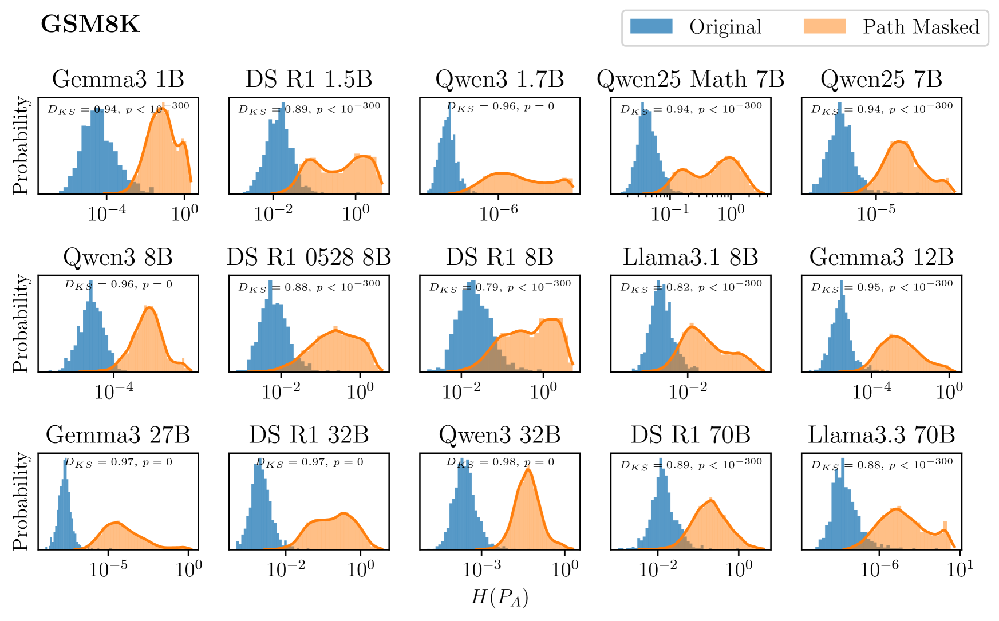
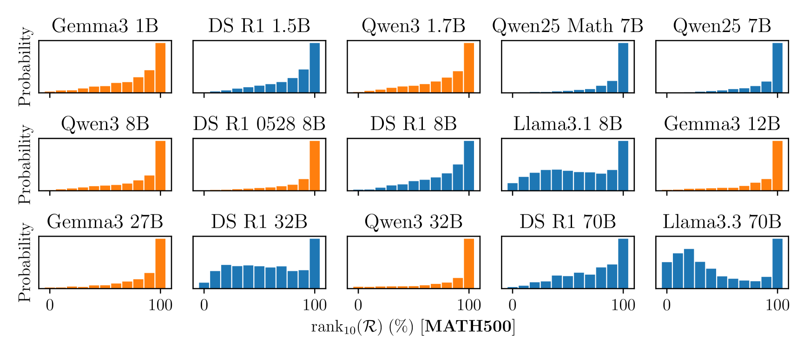
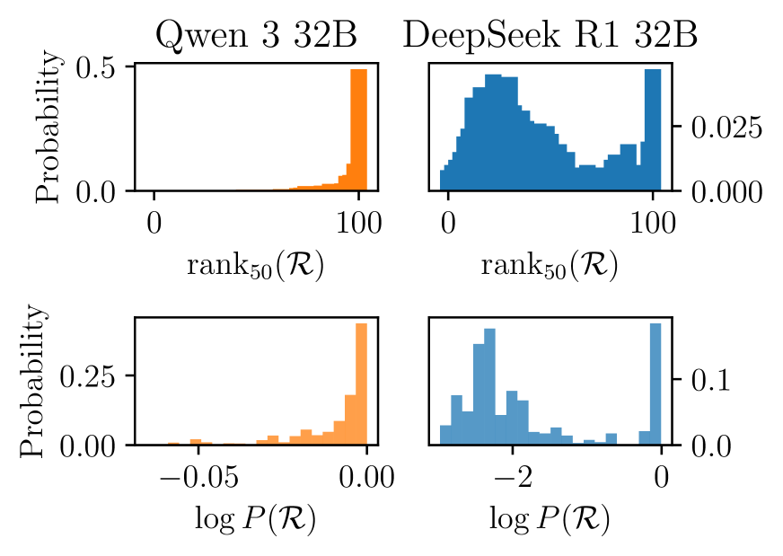
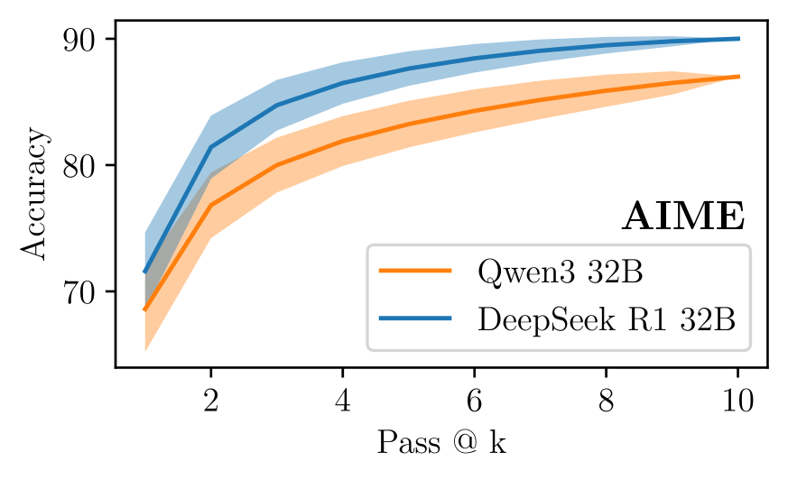

# KisMATH: Do LLMs Have Knowledge of Implicit Structures in Mathematical Reasoning?

- **Authors**: Soumadeep Saha, Akshay Chaturvedi, Saptarshi Saha, Utpal Garain, Nicholas Asher
- **Affiliation**: ISI Kolkata + IRIT Toulouse
- **Venue/Year**: arXiv 2025-07-15 (preprint)
- **Link**: https://arxiv.org/abs/2507.11408
- **HF Paper**: https://huggingface.co/papers/2507.11408
- **Tags**: #cot #causal-analysis #mechanistic-interpretability #math-reasoning #rlvr #llm-reasoning

## TL;DR

提出 **Causal CoT Graph (CCG)** — 一种从 LLM 数学推理轨迹中自动抽取的因果有向无环图，节点是数学表达式，边表示细粒度因果依赖。基于 1671 道 GSM8K/MATH500/AIME 题构建 KisMATH 数据集，用 attention suppression 在 15 个开源 LLM (1B–70B) 上做图对齐干预，证明：(i) CCG 中的推理节点是答案的真**因果中介**（推理的必要条件）；(ii) LLM 内部确实"偏爱"CCG 抽出的路径，即模型隐式实现了类似 CCG 的结构。

## Motivation

CoT 提示能显著提升 LLM 推理性能，但**机制至今没有共识**。学界分裂为两派：

- **真推理派**：CoT 把复杂问题分解成子问题，逐步求解再组合（OpenAI o1、DeepSeek-R1 的官方叙事）。
- **近似检索派**（Kambhampati 等）：CoT 只是从隐式知识里"凑答案"。证据：
  - 训练数据中 50% 的数字随机替换，性能几乎不变（Li et al. 2025）
  - In-context 示例扰动几乎不影响输出（Wang et al. 2023）
  - 用"虚假奖励"做 RLVR 居然还能提升（Shao et al. 2025）
  - CoT 不能为最终答案提供 faithful 解释（Lanham et al. 2023; Barez et al. 2025）

之前研究的局限：手工标注因果图规模太小（Tan 2023: 27 题；Bogdan et al. 2025: 10 题），且依赖随机扰动而非图对齐干预。

本文要回答：**CoT 的中间 token 是否真的是答案的因果中介？模型是否内化了某种推理结构？**

## Method

### 1. CCG 构造算法（Algorithm 1）

给定 (问题 Q, 推理轨迹 R, 答案 A)：

1. **抽取节点**：用 SymPy 从 Q、R、A 中抽取所有数学表达式（数字、LaTeX 公式等），保证非重叠并按出现顺序排序
2. **反向扩展**：从答案节点 `â` 出发，反向匹配 — 找到所有"包含/贡献于" `â` 的表达式（"match" = 解析树共享节点；例如 `4` 匹配 `4+5`，因为 4 是和的成分）
3. **递归向前**：每找到一个匹配就作为新查询，向其之前的 context 继续递归（保证 DAG 无环）
4. **剪枝**：删除无法回溯到任何问题节点的死路
5. **反转所有边**，得到 Q → R → A 的有向无环因果图

### 2. R-paths（Reasoning Paths）

从 CCG 中抽取 **从问题节点到答案节点的最长简单路径** 作为模型实际走过的推理链代理：

$$\mathcal{R} = [\hat{q}_\alpha \to \hat{r}_{i_1} \to \hat{r}_{i_2} \to \ldots \to \hat{r}_{i_\mu} \to \hat{a}]$$

GSM8K 取 top-5 最长路径，MATH500/AIME 取 top-10。

### 3. KisMATH 数据集

| 来源 | 样本数 | 难度 | CoT 生成方 |
|---|---|---|---|
| GSM8K | 983 | 小学算术 | OpenAI o3 (5-shot) |
| MATH500 | 384 | 竞赛预备 | OpenAI o3 (5-shot) |
| AIME (1983-2024) | 304 | 奥数级 | OpenAI o3 (5-shot) |
| **总计** | **1,671** | 每题含 9-40 推理节点、6-10 跳推理 |  |

仅保留答案正确的样本；几何题被过滤（SymPy 解析困难）。

### 4. 因果中介框架

借用 Paul et al. (2024) 的视角，把推理过程建模为概率图模型：
- **直接效应 (DE)**：Q 不经过 R 直接影响 A
- **间接效应 (IE)**：Q 通过 R 影响 A

**判据**：如果 IE ≈ 0，那么 CoT 就是装饰品，模型并未推理。

### 5. 干预手段：Attention Suppression

把指定 token 对**所有后续位置、所有层、所有头**的注意力流切断（置零），模拟"如果这些 token 没出现"的反事实。优于随机扰动，因为信息传递路径被精确控制。

### 6. 评估的 15 个模型

涵盖 1B-70B：
- **Gemma 3**: 1B / 12B / 27B
- **Qwen 3**: 1.7B / 8B / 32B
- **DeepSeek R1 (distill)**: 1.5B / 8B / 32B / 70B / 0528-8B
- **Llama**: 3.1 8B / 3.3 70B
- **Qwen 2.5**: 7B / 7B-Math

总计算量约 3000 GPU-hours (4×A100) + $50 API。

## Results

### 实验 1：CCG 推理节点是中介 ✅

屏蔽 CCG 中所有推理节点的 token，测量答案首 token 熵 `H(P_A)` 的变化（Table 2）：

| 模型 | GSM8K 原始熵 | 屏蔽后熵 | KS 距离 |
|---|---|---|---|
| DeepSeek R1 1.5B | 0.02 | 3.58 | 1.00 |
| Llama 3.1 8B | 3e-3 | 3.23 | 0.99 |
| Qwen2.5 7B Math | 0.08 | 3.30 | 0.99 |
| DeepSeek R1 32B | 6e-3 | 2.73 | 0.99 |
| Llama 3.3 70B | 2e-4 | 0.91 | 0.97 |
| DeepSeek R1 70B | 0.02 | 3.92 | 0.99 |

所有模型答案熵显著上升（**p < 10⁻¹²**）。**结论**：CoT 推理节点是答案的真因果中介，"推理"的必要条件被满足。

### 实验 2：R-paths 承载因果效应 ✅

只屏蔽 R-path 上的节点（不屏蔽问题节点）：

答案熵显著上升（**p < 10⁻³⁰⁰**），KS 距离很大。**说明 CCG 抽出的最长路径正是模型依赖的关键路径。**

### 实验 3：模型内化了 CCG 结构 ✅

定义 R-path 概率：

$$P(\mathcal{R}) = \prod_{\delta=1}^{\mu} P(\hat{r}_{i_\delta} | x_{<T_\delta})$$

把它和 M 个**随机路径**（从推理段随机抽相同数量 token 构造）比较，看 R-path 排在第几百分位：

$$\text{rank}_M(\mathcal{R}) = \frac{1}{M}\sum_{\kappa=1}^{M} \mathbb{I}[P(\mathcal{R}) > P(\tilde{\mathcal{R}}_\kappa)]$$

**惊人发现**：所有模型在 100 百分位都有显著 spike — R-path 上的 token 转移概率几乎总是高于随机路径。**模型内部确实"偏爱"CCG 抽出的路径。**

### 最有意思的发现：两种 LLM "气质"

排名分布呈两种形态：

| 模式 | 形态 | 代表模型 | 含义 |
|---|---|---|---|
| **指数型** | 几乎都顶着 100 %-ile | Qwen3 32B | 几乎所有 R-path 都是高概率转移，"窄而确定" |
| **钟形** | 部分 R-path 落在中段 | DeepSeek R1 32B | 有少量低概率（高熵）"分叉点"，"宽而探索" |

**关键统计量**（AIME 上）：

| 指标 | DeepSeek R1 32B（钟形） | Qwen3 32B（指数型） |
|---|---|---|
| log P(ℛ) 均值 | -1.7603 | -0.0098 |
| log P(ℛ) 方差 | 0.9217 | 0.0002 |

**Pass@k 性能差距**：

- k=1: Qwen3 32B **68.6% ± 3.4** vs DeepSeek R1 32B **71.6% ± 3.0**（接近）
- k=10: Qwen3 32B **87%** vs DeepSeek R1 32B **90%**（钟形模型反超并扩大领先）

### 关键解释

- 高熵"分叉 token"对应**合法歧义**：变量命名、子问题顺序、不同解法 — 模型保留这种不确定性才能做有效探索
- **DeepSeek R1 32B**（蒸馏自 R1 671B）保留了多样性 → 钟形 → pass@k 增长更快
- **Qwen3 32B**（RLVR 训练）把分布压窄了 → 指数型 → 单次采样略优、但探索能力被损害
- 与 Wang et al. (2025) "高熵少数 token 是 RL 关键" 和 Yue et al. (2025) "RL 没引入新能力，只是重新分配概率" 的发现一致

## Strengths & Weaknesses

### Strengths

- **大规模实证**：1671 题 vs 之前同类工作 ~30 题，可统计推断
- **细粒度因果图**：数学表达式级别（不是整段轨迹原子化处理）
- **图对齐干预**：比随机扰动更有解释力，p 值都到 10⁻³⁰⁰ 量级
- **跨模型比较**：15 个开源模型 + 不同后训练范式，揭示了"分布形态"这个新维度
- **算法可扩展**：相比 Bogdan et al. 的 rollout sampling 计算上可承受

### Weaknesses

- **领域限制**：只覆盖数学推理；代码、规划、常识能否外推待验
- **解析依赖**：CCG 构造依赖 SymPy 表达式解析，**几何题被过滤**
- **匹配定义偏机械**：解析树共享节点；语义等价但形式不同的推理步可能漏掉
- **CoT 由 o3 生成**：被分析的 15 个模型用来"复述"这条轨迹，严格说测的是"开源模型如何处理 o3 风格的轨迹"，不是它们自然产物
- **GSM8K 标注问题**：作者发现 ~2% 样本有错误（11 题答案错，9 题题目歧义）— 暗示通用基准的标注质量值得审视

## Key Takeaways

1. **CoT 不是装饰品（至少在数学领域）**：图对齐 attention suppression 给出了迄今最强的实证 — 中间推理 token 是答案的真因果中介。
2. **模型内化了类 CCG 的结构**：R-path token 转移概率系统性高于随机路径，说明 LLM 的偏好与符号化因果图对齐。
3. **"分布形态" 是新的诊断维度**：通过 R-path rank 分布是钟形还是指数型，可以快速判断模型属于"探索型"还是"确定型"。
4. **RLVR 的代价**：把 base model 的分布压窄能在 pass@1 上微涨，但损失 pass@k 天花板 — 与 Yue et al. 2025 共振，对当下的 RL 后训练 pipeline 是个警告。
5. **新工具 KisMATH**：未来研究可以用它做更多控制性图对齐干预（节点级替换、子图剪除等）来研究 LLM 推理的内部机制。

## Related Work

> 完整的主题综述见独立笔记 [CoT 机制 / 因果解释性 / RLVR 代价 Mini-Survey](../research-notes/2026-05-08-cot-mechanism-mini-survey.md)。本节给出 KisMATH 在三大研究主题中的定位。

### 主题 1：CoT 机制论辩 — 真推理 vs 装饰品

| 论文 | 立场 | 关键证据 | KisMATH 的回应 |
|---|---|---|---|
| **Wei et al. 2022** "Chain-of-thought prompting" | 真推理 | CoT 提示能显著提升复杂任务表现 | 起点 — 但只证明"有效"不证明"机制" |
| **Lanham et al. 2023** "Measuring Faithfulness" | 怀疑 | 扰动 CoT 时，模型有时几乎无变化；越大越不忠实 | KisMATH 的 attention suppression 是更强干预，证明数学领域是 faithful 的 |
| **Li et al. 2025** "Structure not content" (Sky-T1) | 怀疑 | SFT 时把答案改错（保留推理结构），AIME 只掉 3.2% | 说明**结构信息**很重要；KisMATH 抽出的 CCG 正是这种结构 |
| **Stechly et al. 2025** "Reasonless tokens" | 强怀疑 | 从头训 transformer 用 corrupted traces 居然 OOD 更好 | 与 KisMATH 似乎矛盾；但他们用 toy 任务，KisMATH 用真实 LLM + 数学，可能反映 base model 已有结构 |
| **KisMATH (本文)** | 偏真推理 | 表达式级图对齐干预，p<10⁻³⁰⁰ | 把"真推理"的判据从行为层面提到因果层面 |

**整体观察**：争论的焦点正在从"CoT 有没有用"转移到"哪种 CoT 信息有用" — 内容、结构、还是高熵分叉点。KisMATH 站在"结构有用"一侧，且用因果工具给出最强证据。

### 主题 2：因果与解释性方法学

KisMATH 处于"因果图分析 CoT"这条线的当前最前沿：

| 工作 | 粒度 | 规模 | 干预方式 |
|---|---|---|---|
| Tan 2023 "Causal abstraction" | 节点级 (手工) | 27 题 (GSM8K) | 节点替换 |
| Lanham et al. 2023 | 整段 CoT | 多任务行为分析 | 段落级扰动/释义 |
| Paul et al. 2024 "Making reasoning matter" | 整段 CoT (原子中介) | DE/IE 框架理论 | 训练时优化 |
| Bogdan et al. 2025 "Thought Anchors" | 句子级 (3 种方法) | 10 题人工标注 | rollout sampling / attention 聚合 / attention suppression |
| Lee et al. 2025 "ReasoningFlow" | 句子级（带语义边） | 30 题 | 标注分析 |
| **KisMATH (本文)** | **表达式级 (自动化)** | **1671 题** | **Attention suppression on graph-aligned subsets** |

**关键方法学贡献**：
1. **自动化 + 大规模**：把因果图研究从"几十题手工"推进到"千题级自动化"，让统计推断成为可能
2. **图对齐干预**：相比随机扰动，沿 CCG 路径的干预可以分离 DE 与 IE，给出干净的因果结论
3. **借鉴 Bogdan 的 attention suppression**：但 Bogdan 自己注意到 attention aggregation 不是可靠的因果代理，rollout sampling 计算太贵 — KisMATH 选了最严谨的那条路并扩展到表达式级

### 主题 3：RLVR 后训练的代价

KisMATH 末尾发现的"钟形 vs 指数型"分布是这个故事链上的关键一环：

| 论文 | 核心发现 | 与 KisMATH 的关系 |
|---|---|---|
| **Yue et al. 2025** "Limit of RLVR" | RL 训练后的 pass@k 在大 k 时**反被 base model 反超**；RL 主要在重新分配概率，没引入新推理路径 | KisMATH 给出**机制级解释**：RLVR (Qwen3) 把分布压成指数型 → 探索能力下降 |
| **Shao et al. 2025** "Spurious Rewards" | 虚假/反向/格式奖励对 Qwen2.5-Math 也能涨 21-27%（接近 ground truth 的 29%）；但 Llama/OLMo 不行 | 暗示 RLVR 主要是在**唤醒 pretraining 已有的推理表示**，不是教新东西；与 Yue 一致 |
| **Wang et al. 2025** "Beyond 80/20" | 只有 ~20% 的高熵 token (forking tokens) 主导推理路径；只用这 20% 做 PG 反而比全梯度更好 | KisMATH 的"钟形 vs 指数型"分类正是基于 R-path 上是否存在这些高熵 fork；DeepSeek R1 32B 保留了 fork，Qwen3 32B 把它们压平了 |
| **KisMATH (本文)** | RLVR 后训练的 Qwen3 32B 是指数型，而蒸馏的 DS R1 32B 是钟形；后者 pass@10 反超 | 把上面三篇的故事**几何化**：分布形态 = 探索能力 = pass@k 上限 |

**故事线整合**：Yue 提出现象 → Shao 提供反例（RL 不依赖真信号）→ Wang 找到关键变量（高熵 token 是 RL 的真实作用对象）→ KisMATH 给出诊断工具（R-path rank 分布形态）。

四篇加起来形成一个一致的论断：**RLVR 不是在"教模型推理"，而是在重新分布 base model 已有的概率质量；这种重新分布有时能提升 pass@1，但代价是缩小推理能力的探索边界。**

### 与本笔记库其他论文的关联

- [2025 Agentic RL Survey](2025-agentic-rl-survey.md) — RLVR 后训练范式综述；本文给了具体的"代价"机制
- [2026 Model Spec Midtraining](2026-model-spec-midtraining.md) — Anthropic 在 mid-training 阶段的对齐
- [2026 Ouro Looped LM](2026-ouro-looped-lm.md) — 替代 CoT 的循环式推理架构（如果 CoT 真的内化为结构，循环架构能否原生学到？）

### Open Questions

- 这套 CCG 框架能否扩展到代码生成、定理证明、规划任务？
- "钟形 vs 指数型"是否能作为后训练超参的可微监控信号？
- 如果用 CCG 显式监督训练（让 R-path 概率最大化），能否同时获得 pass@1 和 pass@k 的双优？
- KisMATH 的强 IE 结论 vs Stechly 的 corrupted traces 也能工作 — 是否是因为 LLM 已 pretrained，能在"乱写的轨迹"中重建结构？这与 Shao 的"唤醒 pretraining 表示"假说能否统一？
- 模型对 "fork token" 的处理能力是否可以单独评估和提升？
