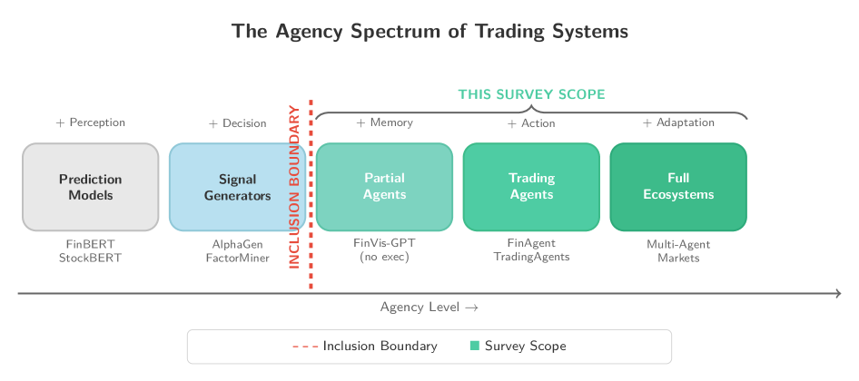
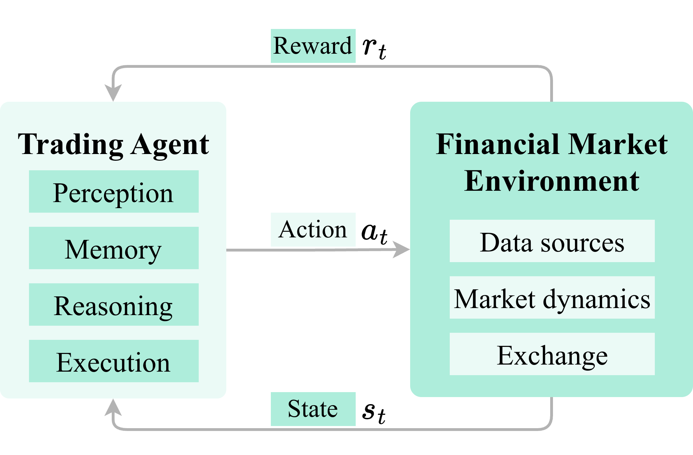

# Agentic Trading: When LLM Agents Meet Financial Markets

- **Authors:** Yihan Xia, Panpan You, Taotao Wang, Fang Liu, Han Qi, Xiaoxiao Wu, Shengli Zhang
- **Venue/Year:** Expert Systems with Applications (投稿中) / arXiv 2026-05-19
- **Link:** [arXiv:2605.19337](https://arxiv.org/abs/2605.19337)
- **Tags:** #survey #llm-agents #finance #trading #reproducibility #evidence-mapping

## TL;DR

这不是一篇提出新方法的论文，而是一篇**审计导向的证据图谱（evidence map）**：作者系统检索了 92 篇候选文献，纳入 77 篇进证据地图，但其中只有 **19 篇**同时满足"输出可交易动作"+"闭环评估"两个最低门槛，能算作"真正的" agentic trading 实证研究。对这 19 篇核心样本做协议审计后发现：只有 2 篇报告了时间一致的数据切分、1 篇报告了交易成本模型、1 篇处理了 universe/幸存者偏差、11 篇报告了执行语义、15 篇的可复现性等级是最低档 R0，**没有一篇达到最高档 R3**。核心论点：这个领域的"架构创新"在快速膨胀，但支撑这些创新的"可比较的评估协议"几乎不存在——协议不可比性（protocol incomparability）才是这个领域当下最大的瓶颈,而不是算法本身。

## Motivation

LLM 驱动的交易 agent（感知市场信息 → 检索/记忆上下文 → 推理决策 → 输出可交易动作 → 根据市场反馈自适应）正在快速增多，但已有综述（如 FinBen、InvestorBench、PIXIU 等 benchmark，以及泛化的 LLM-Agent 综述）存在系统性问题：

1. **把执行当成推理的副产品**：例如 FinAgent 被归类为"多模态金融 Agent"，突出其感知模块却淡化了它的执行层——而执行层恰恰是评估真实可部署性的关键
2. **把"架构机制"和"功能能力"混为一谈**：同一种推理机制可以同时服务于高频 alpha 信号生成和长周期组合管理，混淆二者会掩盖真正的设计选择
3. **把学习/自适应当作实现细节**：TradingAgents 被笼统归类为"多智能体框架"，却没有区分其层级化角色组织（架构）、分布式能力分配（能力）和基于反馈的自适应（自适应）三个本应分开讨论的维度

更根本的问题是：这个领域普遍存在"用回测收益率说话，但回测协议本身站不住脚"的现象——很多论文汇报了漂亮的收益曲线，却没有说清楚数据切分是否时间一致、有没有算交易成本、股票池构建有没有幸存者偏差、订单执行的时点假设是什么。如果这些协议细节缺失，收益率数字之间根本无法比较。

## Method

严格来说这篇论文的"方法"是**审计方法论**，而非算法：

### 三层证据分级体系

- **候选注册库（92 篇）**：2022-01-01 至 2026-03-09 期间通过 ACM DL（含 ICAIF）、IEEE Xplore、arXiv、SSRN、Google Scholar 检索，加上引文链滚雪球，去重后的候选记录
- **纳入证据地图集（77 篇）**：候选库中与金融交易/组合/风控相关的文献（15 篇因超出领域范围被排除）
- **核心实证子集（19 篇）**：纳入集里同时满足 **Action Output**（输出可交易的订单/仓位变化/组合配置）+ **Closed-Loop Evaluation**（在回测/仿真/实盘中评估这些动作，而不只是预测指标）两个条件的研究。其余 58 篇只能算作"背景/设计语境"，不进入协议统计和可复现性统计的分母

这个三层设计本身就是论文最重要的方法论贡献：**大量"看起来是 agentic trading"的论文，实际上只是金融 NLP 或时间序列预测模型套了个 agent 的壳，从未真正闭环评估过交易动作**。图 1 的"Agency Spectrum"清楚地画出了这条纳入边界：

### Architecture-Capability-Adaptation（A-C-A）分析透镜

作者提出 A-C-A 作为**探索性分析工具**（反复强调"不是经过验证的分类标准"），把整条决策管线拆成三个正交维度：

- **Architecture（架构）**：知识从哪里获取、存储、推理、作用——对应感知（Section 3）、记忆（Section 4）、推理（Section 5）、动作/执行（Section 6）四个模块
- **Capability（能力）**：agent 在支持什么交易功能——alpha 发现（Section 7）、组合管理（Section 8）、风险管理（Section 9）
- **Adaptation（自适应）**：决策管线如何随反馈变化——学习范式（Section 10）、多智能体协调（Section 11）、自我演化（Section 12）

这套框架把 agent 看作一个"专家系统决策管线"（expert-system decision pipeline）：感知模块=知识获取，记忆/RAG=知识库，推理模块=推理引擎，执行模块=外部动作接口，风控/合规=规则约束，日志/人工监督=可解释性与可追责层。这个类比的价值在于——它把"评估问题"变得具体：一个 agent 可以架构上很精巧，但如果评估时漏掉了时间切分、交易成本、股票池构建或执行语义，它在实证上仍然是空的。

### 协议审计维度

对每篇纳入研究，作者编码两类信息：
1. **架构范围**：感知/记忆/推理/动作执行/自适应
2. **协议关键报告项**：时间一致的数据切分、执行时点/语义、交易成本模型、股票池/幸存者偏差处理、可复现性artifact

**未清楚报告的字段一律保守编码为 NR/Unknown（而不是推测性填补）**——这是一个值得学习的审计原则：宁可低估证据强度,也不要用假设去填补缺失信息。

### 可复现性四级量表（R0-R3）

| 等级 | 定义 | 判定标准 |
|------|------|---------|
| R0 | 无可运行 artifact | 没有公开代码库，或代码库损坏/404，或缺少关键文件无法运行 |
| R1 | 代码存在但不可运行 | 公开仓库存在且可访问，但缺少依赖/数据访问/评估脚本等关键组件 |
| R2 | 可运行但有缺口 | 完整代码 + 数据可访问或有清晰文档 + 提供评估脚本，但可能缺少固定环境、完整文档或端到端流水线 |
| R3 | 完整可复现包 | 完整代码 + 固定环境 + 数据快照或清晰获取说明 + 完整文档 + 端到端评估流水线 |

## Results

### 核心实证子集（n=19）的协议审计结果

| 协议维度 | 满足数量 | 占比 |
|---------|---------|------|
| 时间一致的数据切分协议 | 2/19 | 10.5% |
| 显式交易成本模型 | 1/19 | 5.3% |
| 股票池/幸存者偏差处理 | 1/19 | 5.3% |
| 执行时点/语义报告 | 11/19 | 57.9% |
| R0（无可运行 artifact） | 15/19 | 78.9% |
| R1 | 1/19 | 5.3% |
| R2 | 3/19 | 15.8% |
| **R3（完整可复现）** | **0/19** | **0.0%** |

这组数字是全篇最有信息量的发现。**没有一篇论文同时做到时间切分严谨、成本建模、股票池处理透明、执行语义清晰、还能完整复现**——这意味着当前文献里几乎所有"XX Agent 在回测中跑赢 buy-and-hold N 个百分点"的结论,理论上都可能受到 look-ahead bias、隐藏成本、幸存者偏差或不可复现实现细节的污染,而且**读者根本无法从论文本身判断污染程度**，因为绝大多数关键字段就是没写。

### 关于"推理架构"的一个重要澄清

论文特别强调一个术语纠正：他们把"Reactive Reasoning"（反应式推理，毫秒级）这个词**严格限定给非 LLM 的延迟受限控制系统**，而 LLM-based 方法（包括 ReAct 类适配）实际运行在秒级或更慢，只能被归入"Reflective Reasoning"（反思式推理）档。作者明确指出这是为了避免一个常见误解——**LLM 无法支撑真正的高频交易决策**,这个延迟约束是硬性的物理限制，不是工程优化能绕开的。

### 多智能体协调的证据现状

Table 17 把多智能体协调模式分成三类（角色制/层级制/市场生态制），并标注：角色制系统（如 TradingAgents、FINCON）目前是"最可审计"的一类（R2），但这**不代表性能更优**，只是说明它们的协调痕迹（消息预算、角色分工、消融实验）最清晰；层级制和市场生态制目前证据基础是 R0，属于设计方向而非实证证据。论文还提出一个尚无实证支撑但机制上合理的风险——**策略拥挤与 alpha 衰减**：如果大量 LLM agent 使用相似的基础模型、相似的金融语料微调、相似的 CoT/RAG 模式，它们可能产生高度相关的交易信号，进而导致 alpha 被更快套利掉、趋势自我强化、止损同步触发、崩盘时集中平仓——但这些风险目前**没有大规模多智能体市场冲击的实证研究支撑**，作者把它标记为"关键空白，需要在部署前做基于仿真的研究"。

### 挑战与未来方向中的几个关键洞察

1. **幻觉传播机制**：一篇虚构的财报可以经过工具调用传播到下游——先触发错误建仓（纠正时立即亏损），再可能被其他 agent 检测为"信号"引发止损连锁，最后因虚假置信度导致仓位过度放大。绑定可验证来源（如 FinMCP、HydraRAG）能转移但不能消除风险,因为来源选择本身也可能出错，而事实核查机制的延迟是秒级,与毫秒级交易决策不兼容
2. **可解释性 vs. 性能的监管张力**：MiFID II、GDPR 等监管框架可能要求算法交易系统提供"有意义的信息"说明自动化决策依据，这与深度模型/LLM 的黑箱特性直接冲突
3. **负面结果缺失**：论文坦言"文献层面也可能受幸存者偏差影响"——很少有论文报告失败的 prompt、被放弃的奖励设计、实盘中性能退化，或者换手率增加却没提升净收益的架构。这不代表设计空间处处可行，只是"报告局限"

## Strengths & Weaknesses

**优点**：
- 这种"审计而非归纳"的综述方法论本身就是一种范式贡献——大多数 LLM agent 综述停留在"列举各种架构变体"，而这篇论文用可复现的证据分级逼着读者面对"这个领域的实证基础到底有多薄"这个不舒服的事实
- 三层证据分级（92 候选 → 77 纳入 → 19 核心）+ 保守编码原则（缺失即 NR，不臆测）是值得其他 AI-for-X 综述借鉴的方法论
- Minimum Reporting Checklist（MR-1 到 MR-7）具体到可操作层面，并给出了 Applicability Matrix 区分不同研究类型该强制哪些字段——这比"呼吁加强规范"式的空洞建议有用得多
- 对"reactive reasoning"术语的纠正非常必要，直接打掉了一个常见的过度宣传（LLM 能做高频交易）

**局限**：
- 核心实证子集只有 19 篇，A-C-A 框架和多数章节的具体子类讨论实际上大量依赖"背景文献"（58 篇非闭环评估的研究）做定性支撑,这些讨论的证据强度和核心 19 篇不是一个量级，读者需要自己留意区分（论文也确实反复提醒了这点，值得认可）
- 论文本身承认 A-C-A 是"exploratory analytical lens"而非"validated taxonomy"，Table 2 的三个重分类案例本质上是作者自己的解读示例，没有做外部专家验证或跨编码者一致性检验（S3 的可靠性审计只覆盖了 19 篇核心研究里的 15 篇提取字段，不是分类框架本身）
- 检索截止到 2026-03-09，而这个领域迭代极快，读者需要留意"当前证据薄"的结论可能在几个月内就被更新的、更规范的研究部分改写
- 论文自身也是这个领域的一部分——它对"可复现性"的强调值得称赞，但论文并未在正文中明确说明自己的证据地图/编码表是否会持续更新维护（Artifact Availability Statement 提到 S1-S3 补充材料，但这是一次性快照还是活文档不确定）

## Key Takeaways

1. **不要看到"agentic trading"论文就默认它做了闭环评估**——大量工作实际上是感知/记忆模块的研究，套壳成"trading agent"叙事，但从未真正输出过可交易动作或做过完整的市场反馈闭环。判断一篇论文是否值得当作"实证证据"引用时，先检查它是否同时满足 Action Output + Closed-Loop Evaluation
2. **看到回测收益率数字时，先问协议五件套**：时间切分是否严格前推、有没有交易成本模型、股票池构建是否处理了幸存者偏差、执行时点假设是什么（次开盘/收盘/中间价）、代码和数据是否可独立复现。这篇论文给出的证据是——目前这个领域的绝大多数论文在这五项上都是空白或部分空白，收益率数字本身几乎不可比较
3. **LLM agent 的延迟约束是物理硬限制,不是工程可以优化掉的**——秒级推理速度决定了当前 LLM-based trading agent 只能定位在"反思式"（分钟到天级别）决策场景，不能碰高频交易；如果看到某论文声称用 LLM 做毫秒级交易决策，这本身就是一个需要警惕的红旗
4. **多 agent 策略趋同（alpha decay/strategy crowding）是一个机制上合理但目前缺乏实证的系统性风险**——随着越来越多交易 agent 用相似的基础模型和相似的 prompt 模式，它们的信号可能高度相关，从而在市场层面放大波动。这是一个值得在设计多 agent 交易系统时主动纳入压力测试的考量点，即便现在还没有直接的实证文献支撑
5. **审计式综述方法论本身是可迁移的**——三层证据分级 + 保守编码（缺失不臆测）+ Minimum Reporting Checklist 这套方法论不局限于金融领域，任何"LLM agent 应用到某个高风险领域"（医疗、法律、安全）的综述都可以借用同样的框架来揭示"证据薄弱"问题

## Related Work

- 论文对比的三类相关工作：General LLM-Agent Surveys（Wang et al. 2024）、Financial ML Surveys（Giglio et al. 2022）、Task-Oriented Financial Benchmarks（FinBen、InvestorBench、FinGPT、PIXIU）——本文的定位是"没有一个现有框架把执行语义和协议可比性当作核心议题"
- 本项目已收录的相关工作：[`papers/2026-model-spec-midtraining.md`](2026-model-spec-midtraining.md) 讨论 agentic misalignment 的训练阶段干预，与本文第 13.1.1 节讨论的"金融场景幻觉传播"风险主题相关（不同领域，同属"agent 行为可信度"问题）
- 值得进一步追踪：FinEvo（Zou et al. 2026，市场生态博弈框架）、AlphaAgent（Tang et al. 2025，正则化探索对抗 alpha 衰减）——这两篇是本文重分类案例中提到的、在 A-C-A 透镜下有清晰架构-能力-自适应三层区分的代表性工作
