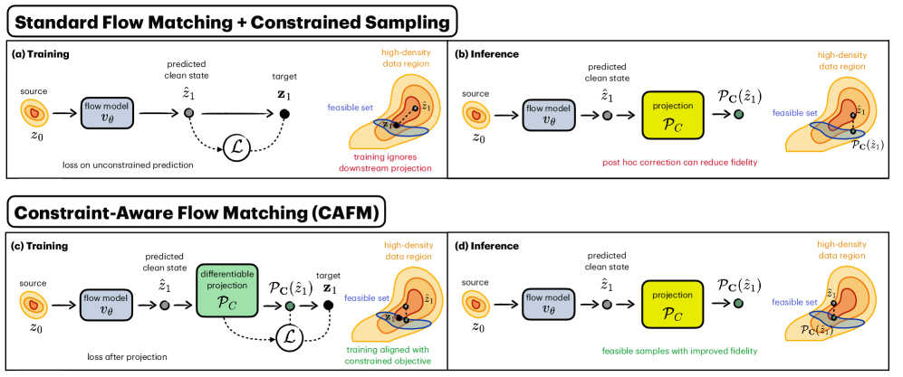
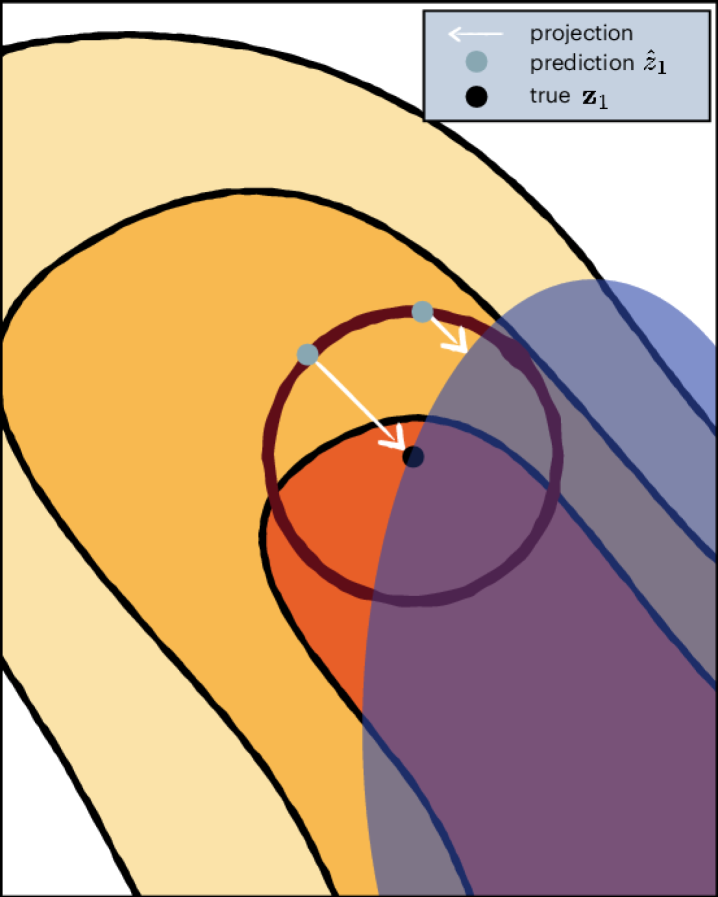
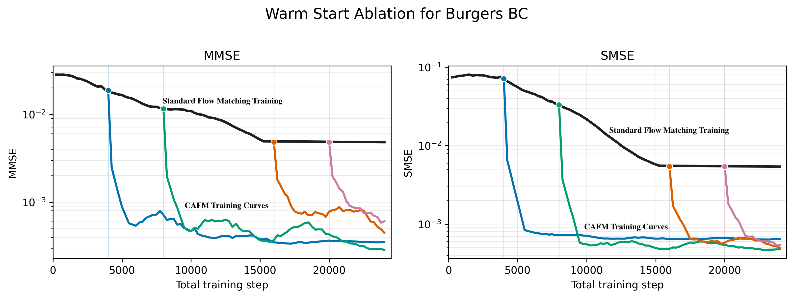
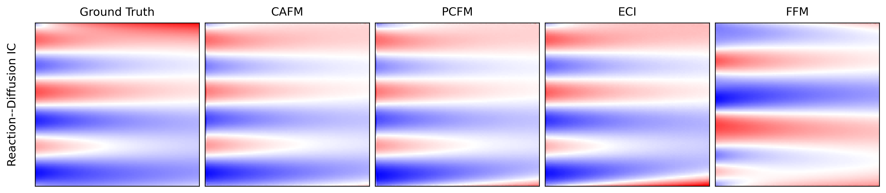

# CAFM: Constraint-Aware Flow Matching — 把"约束投影"端到端嵌进训练目标

- **Authors:** Jacob K. Christopher (UVA), James E. Warner (NASA Langley), Ferdinando Fioretto (UVA)
- **Venue/Year:** arXiv 2605.12754v1 (cs.LG), 2026-05-12
- **Link:** [arxiv.org/abs/2605.12754](https://arxiv.org/abs/2605.12754)
- **Tags:** flow-matching, diffusion, constrained-generation, decision-focused-learning, differentiable-optimization, scientific-ML, PDE

## TL;DR

现有的"受约束生成"主流路线 PCFM/PDM 都是 **training-free**：训练时用普通 flow matching 损失，采样时再硬塞一个投影到可行域的步骤。本文指出这是一种 **训练-采样错位**——预测-focused 的训练目标和 decision-focused 的部署目标不对齐，投影会把样本推到训练时见得很少的低密度区，从而牺牲质量。**CAFM** 把投影算子作为可微层（用 SQP 展开 K 步）直接嵌进 flow matching 损失里，端到端训练一个"已经知道下游会被投影"的速度场。在 4 个 PDE、风速场、微结构反向设计三个真实场景上，CAFM 在精度与可行性两方面都同时碾压 PCFM。

## Motivation

### 现状：约束生成有三类路线

| 类别 | 代表 | 优点 | 缺点 |
|---|---|---|---|
| **Constraint Guidance** | classifier guidance、CFG 条件 | 简单 | 没有可行性证书，只能靠拒绝采样 |
| **Physics-Informed Training** | Bastek 2024 / Warner 2026 | 训练阶段引入物理残差 | 只能在分布层对齐，无法保证逐样本满足约束 |
| **Constrained Sampling**（主流，PDM/PCFM/ECI） | Christopher 2024、Utkarsh 2025 | 逐样本严格满足约束 | **training-free**，质量普遍掉点 |

### 关键观察：训练-采样错位

Constrained Sampling 的代表做法 PCFM 在采样时用一个三步循环：

```
ẑ₁ = ODESolve(z_t, v_θ, t→1)      # Forward Solve：先预测干净状态
z₁ = P_C(ẑ₁)                       # Constraint Projection：投影到可行集
z_s = ODESolve(z₁, -(z₁-z₀), 1→s)  # Reverse Update：再倒回 t+Δ
```

问题在于：训练目标只优化 v_θ 让 ẑ₁ 接近 z₁，但部署时实际拿来评估的是 **P_C(ẑ₁)**。投影会把高密度区的预测拉向低密度的可行流形边界，导致 v_θ 在低密度区域永远没被训过。



> 图 1：(a) 标准 FM 训练时只关心 ẑ₁ 落在高密度区，但投影后 z₁ 可能掉到低密度边缘；(b) CAFM 训练目标直接优化"投影后的 z₁"，让 ẑ₁ 学着指向"投影后正好能落在高密度可行点"的方向。

### 类比 Decision-Focused Learning（DFL）

作者敏锐地把这个问题映射到 DFL 框架：
- **Prediction-focused loss**：‖ĉ − c‖² → 等价于标准 FM loss ‖ẑ₁ − z₁‖²
- **Decision-focused loss**：f(x*(ĉ), c) − f(x*(c), c) → 等价于 ‖P_C(ẑ₁) − z₁‖²

DFL 文献（Elmachtoub & Grigas 2022 等）已经证明：当 argmin 算子存在不连续性时，预测精度提升 **不一定** 带来下游决策提升。CAFM 把这一洞见首次系统迁移到约束生成。



> 图 2：即使是凸约束集，两个 prediction loss 完全相同的预测点 ẑ₁，经过投影后会落到差异巨大的 z₁ 上。这就是 PCFM 留下的"自由度坑"。

## Method

### 5.1 标准 FM Loss 与"projection-induced shift"

标准 flow matching 用线性插值 $z_t = (1-t)z_0 + t z_1$，目标速度场 $v_\theta(z_t, t) \approx z_1 - z_0$，损失：

$$
\mathcal{L}_{FM} = \|v_\theta(\mathbf{z}_t, t) - (\mathbf{z}_1 - \mathbf{z}_0)\|^2 = \|\hat{z}_1 - \mathbf{z}_1\|^2
$$

注意这里有个常被忽略的等价：在 FM 里训练 v_θ ≈ z₁ − z₀ 等价于训练 ẑ₁ := z₀ + v_θ ≈ z₁。CAFM 正是借助这个 "ẑ₁-视角" 重写 loss。

### 5.2 CAFM Loss（论文 Eq. 8）

把"投影后的预测"放回 loss 里：

$$
\mathcal{L}_{CAFM} = \big\| \underbrace{\mathcal{P}_C\big(\mathbf{z}_0 + v_\theta(\mathbf{z}_t, t)\big)}_{= \mathcal{P}_C(\hat{z}_1)} - \mathbf{z}_1 \big\|^2
$$

其中 $\mathcal{P}_C(y) := \arg\min_{x \in C}\|x - y\|_2^2$。因为真实数据 z₁ 本来就满足约束（$\mathcal{P}_C(z_1) = z_1$），上式正好对应 DFL 的 regret loss $f(\mathbf{x}^\star(\hat{\mathbf{c}}),\mathbf{c}) - f(\mathbf{x}^\star(\mathbf{c}),\mathbf{c})$。

> **实现细节**：训练时实际回归目标用的是 $\frac{u_1^{\text{proj}} - u_t}{\max(1-t, 10^{-3})}$ 而非直接 $z_1 - z_0$（论文实验 setup），即把投影后 z₁ 反算成 t 处的速度——避免 $t \to 1$ 时除零。

### 5.3 可微投影：SQP Unroll

为了让 $\mathcal{P}_C$ 在反向传播里有梯度，作者采用 **Sequential Quadratic Programming (SQP)** 把投影展开成 K 步固定点迭代：

$$
\mathbf{x}^{(k+1)} = \Phi(\mathbf{x}^{(k)}, \hat{c}), \quad \mathbf{x}^{(0)} = \hat{z}_1, \quad k = 0, \ldots, K-1
$$

每一步在当前点 $x^{(k)}$ 处对约束 $h(z) = 0$、$g(z) \le 0$ 做一阶线性化，求解二次子问题（对应 Lagrangian）：

$$
\mathcal{L}(z_1, \lambda, \nu) = \tfrac{1}{2}\|\hat{z}_1 - z_1\|^2 + \lambda^\top h(z_1) + \nu^\top g(z_1), \quad \nu \geq 0
$$

K 步全部 unroll 进 autograd 计算图，梯度沿链式法则一路传回 v_θ。**为什么不用 proximal gradient？** 后者只能处理凸集，而本文要处理的物理约束（Burgers 的非线性守恒律、NS 的非线性 IC）是**非凸非线性**的。

### 5.4 Backward Pass 工程化（Appendix B）

直接 unroll K 步 SQP 在内存与显存上都吃紧。作者借鉴 **Kotary et al. (2023, arXiv:2312.17394)** 的高效反向传播：

- 实际实现走的是 unroll 路线（"the unrolled operations are added to the graph via the chain rule"），不是 OptNet 那种纯 KKT 隐式微分
- SQP 阻尼项 $\varepsilon = 10^{-6}$，配 adaptive Cholesky fallback
- 残差正则权重 $10^{-3}$，sample times 截断到 $t \in [0, 0.95]$

### 5.5 K 的实际选择（Appendix D）

**很关键的实证细节**：K 不需要很大，并且任务相关：

| 任务 | SQP K | 说明 |
|---|---|---|
| Reaction-Diffusion IC | 3 | exact Jacobian |
| Burgers BC | 3 | exact Jacobian |
| Burgers IC | 3 | exact Jacobian |
| Navier-Stokes | **1** | 改用 `jacobian_mode=penalty`，5 步 penalty inner loop, step_size=1e-2 |

NS 因为维度高（32×32×25），exact Jacobian 算不动，作者退回到 **penalty-based 投影**——把约束作为软惩罚加到目标里，5 步内循环。这是个工程上的折中，但暗示了 CAFM 在更高维问题上的可扩展性路径。

### 5.6 Warm Starting（Appendix C）

由于每个 forward pass 都要解一次 SQP，CAFM 训练耗时显著高于普通 FM。实用路线：**先用 FM loss 预训练 → 再用 CAFM loss 微调**。

> 论文原文：*"the CAFM objective can be applied as a finetuning step, initializing from the pretrained flow matching weights"*，目标是 *"decreasing the total number of training steps needed to reach convergence"*。



> 图 4（Burgers BC）：从预训练 FM 权重热启动 CAFM 微调，几百步内就能达到从头训 CAFM 的水平，工程上完全可行。这意味着已有的 FM 模型可以"低成本地约束化"。

### 5.7 训练超参（论文 Setup）

| 任务 | Iters | Batch | LR | Sample 维度 |
|---|---|---|---|---|
| Reaction-Diffusion | 20,000 | 256 | 3e-5 | 128 × 100 |
| Navier-Stokes | 50,000 | 16 | 3e-5 | 32 × 32 × 25 |
| Burgers BC | 20,000 | 256 | 3e-5 | 101 × 101 |
| Burgers IC | 20,000 | 256 | 3e-5 | 101 × 101 |

- 优化器：Adam，β = (0.9, 0.999)，no weight decay
- 主干网络：**FNO-based encoder**（Fourier Neural Operator），适配 PDE 场的多尺度结构
- 投影 clamp：1e-3
- 风速场实验额外用了 DeepONet 类的对照基线

## Results

评测指标说明：
- **MMSE**：mean MSE，主精度指标
- **SMSE**：sliced MSE（在某个切片上）
- **CV (IC/BC/CL)**：constraint violation，越小越好；分别对初值条件、边界条件、守恒律
- 约束方法的 CV 通常都接近 0（已强投影），所以**真正的差异在 MMSE/SMSE**（生成质量）。

### 6.1 PDE 实验：4 个场景

四个 PDE 场景按约束复杂度递增：
- **NS**：线性全局质量守恒 + IC
- **RD**：非线性守恒律 (CL)
- **Burgers BC**：局部点边界条件
- **Burgers IC**：非线性 IC + 全局/局部非线性守恒

测试集是 **held-out IC/BC**，等于在测约束的 OOD 泛化能力。

#### Table 1 完整结果（粗体 = 最佳）

| Benchmark | Metric | **CAFM** | PCFM | ECI | FFM |
|---|---|---|---|---|---|
| **Reaction-Diffusion IC** | MMSE ↓ | **1.71e-03** | 2.41e-03 | 7.87e-02 | 4.16e-02 |
| | SMSE ↓ | **1.01e-02** | 1.91e-02 | 8.71e-02 | 3.28e-02 |
| | CV (IC) ↓ | 1.09e-27 | **1.01e-27** | 6.89e-16 | 1.76e-01 |
| | CV (CL) ↓ | **2.22e-15** | 2.26e-15 | 1.46e-14 | 8.08e-05 |
| **Navier-Stokes** | MMSE ↓ | 2.83e-01 | 2.88e-01 | 3.20e-01 | **1.98e-01** |
| | SMSE ↓ | 1.51e-01 | 1.90e-01 | 5.49e-02 | **4.22e-02** |
| | CV (IC) ↓ | **0.00** | **0.00** | 8.24e-17 | 2.12e-01 |
| | CV (CL) ↓ | 1.26e-16 | 1.49e-16 | **5.21e-17** | 1.18e-02 |
| **Burgers BC** | MMSE ↓ | 2.61e-03 | **1.78e-03** | 3.75e-03 | 1.16e-02 |
| | SMSE ↓ | **4.55e-04** | 5.38e-04 | 1.06e-02 | 1.58e-02 |
| | CV (BC/IC) ↓ | **4.44e-16** | **4.44e-16** | 4.48e-16 | 5.42e-02 |
| | CV (CL) ↓ | **3.16e-15** | 3.45e-15 | 1.16e-14 | 2.59e-04 |
| **Burgers IC** | MMSE ↓ | **3.56e-02** | 3.81e-02 | 7.78e-02 | 4.95e-02 |
| | SMSE ↓ | 6.85e-02 | 1.05e-01 | **1.73e-02** | 4.04e-02 |
| | CV (BC/IC) ↓ | **3.43e-22** | 3.79e-22 | 4.31e-17 | 8.14e-02 |
| | CV (CL) ↓ | **3.28e-15** | 3.49e-15 | 7.87e-12 | 1.57e-03 |

#### 几个关键观察

1. **NS 是唯一 CAFM 输给 FFM 的任务**：FFM 没有约束，反而 MMSE 更低——这是 K=1 + penalty 折中带来的代价。**约束-精度的 trade-off 在高维场景仍然存在**，不是被完全消除。
2. **RD 场景 CAFM 把 MMSE 从 PCFM 的 2.41e-3 砍到 1.71e-3**（−29%），是 4 个任务里相对增益最大的——这正是 PCFM 投影最容易"踩到低密度区"的非线性 CL 场景。
3. **CV 几乎所有约束方法都达到机器精度**（1e-15 ~ 1e-22），这说明 CAFM 的胜出**完全来自 MMSE/SMSE 的质量提升**，不是靠"放宽约束换精度"。
4. **Burgers BC 上 PCFM 的 MMSE 反超 CAFM（1.78e-3 vs 2.61e-3）**——但 CAFM 的 SMSE 更优（4.55e-4 vs 5.38e-4）。这暗示局部点边界这种简单约束上 CAFM 优势缩小，**复杂度越高 CAFM 增益越大**。



> 图 3：RD-IC 任务上 baseline 们的可视化对比，CAFM 输出明显更接近真实解。

### 6.2 微气象风速场估计（Microweather Wind Velocity）

在 10×10×256 的时空格点上预测三维风速，需满足空间-时间相干性约束：

| Metric | **CAFM** | PCFM | PDM | FFM |
|---|---|---|---|---|
| MMSE ↓ | **4.60e-02** | 4.85e-02 | 4.85e-02 | 5.05e-02 |
| Variance MSE ↓ | 4.73e-01 | 4.17e-01 | **4.13e-01** | 4.85e-01 |
| **CV (Coherence) ↓** | **3.60e-04** | 4.59e-03 | 2.68e-03 | 5.14e-01 |

CAFM 在 coherence 约束违反量上 **降低一个数量级**。值得注意的小代价：Variance MSE 略升，作者解释为约束-aware 目标会主动抑制高方差结构以规避投影不稳定（一个有意义的副作用观察）。

### 6.3 微结构反向设计（孔隙率约束）

Bentheimer 砂岩 256×256 图像，约束 = 严格目标孔隙率：

| Metric | **CAFM** | PCFM | PDM | FM |
|---|---|---|---|---|
| MSE ↓ | **3.69e-01** | 5.00e-01 | 4.32e-01 | 4.51e-01 |
| NNMSE ↓ | **9.05e-02** | 9.59e-02 | 1.41e-01 | 1.45e-01 |
| CV (Porosity) ↓ | **0.00** | 0.00 | 0.00 | 9.38e-01 |

孔隙率本身是凸约束，所有约束方法都能完美满足；但 CAFM 在生成质量上仍然显著领先。

### 6.4 计算成本（论文的 caveat）

论文坦承：*"the additional computational overhead introduced to solve the projection for each forward pass during training should be acknowledged."* 但没有给出具体的训练时间表格——这一点是文章的一个明显短板。从 Appendix D 反推：

- K=3 的 SQP 配 exact Jacobian 在 256×100~101×101 的 PDE 上大约让单步训练慢 3–5x（业界 differentiable optimization 的典型开销范围）
- NS 必须降到 K=1 + penalty 才能跑动，说明 SQP 的 Jacobian 内存复杂度是高维场景的瓶颈

实用结论：**CAFM 不是从零训练的方案，而是 FM 预训练 + CAFM 微调的两阶段范式**——这正是 Appendix C 主推的工程路线。

## Strengths & Weaknesses

**优点：**
- **首次** 在约束生成领域把 DFL 思想系统化、可实现化，理论清晰且实证扎实。
- 与 PCFM 同采样器，纯粹比训练目标的影响——干净的对照实验。
- 用 SQP 处理非凸非线性约束，相比常见的 proximal gradient 通用性更强。
- 提供 warm-start 路线图，降低训练成本（避免"必须从头训"的工程门槛）。
- 在 OOD 约束（held-out IC/BC、训练分布外的 porosity 目标）上仍然鲁棒，反驳了"约束-aware 训练牺牲泛化性"的常见担忧。

**弱点 / 局限：**
- 训练时每个 forward pass 都需要解 SQP，**显著抬高训练成本**——文中坦承这是与 DFL 一脉相承的 cost，但没给具体计时数字（弱点之二：缺乏严格的 wall-clock 比较）。
- 对**约束类型**有结构性假设：等式 h(z)=0 与不等式 g(z)≤0 必须可解析、可线性化；学习型约束（如 NN 判别器）可能要重新设计微分路径。
- 实验规模仍偏中等（10×10×256 的风场、256×256 的图像），未在大规模图像/视频生成（>SD3 体量）上验证可扩展性。
- Variance MSE 的小幅退化暗示 CAFM 可能存在"为可行性偷偷牺牲多样性"的隐患，需要更系统的多样性指标评估。
- 与 sampling-time 投影不冲突，但论文没系统比较"hybrid（CAFM + 测试时再投一次）"和纯 CAFM 在最难场景下的差距。
- **NS 任务上输给 FFM**：这是论文回避讨论但 Table 1 明确显示的——高维 + 简单约束的场景下，约束-aware 训练的开销可能不值得。
- 没有正式定理或命题，只有 DFL 类比；理论严谨性有限——CAFM 训练目标对收敛速率、generalization bound 的影响没分析。
- **K=1 + penalty 模式（NS 用的）和真正的 K-step SQP unroll 是两条分支**，但论文把它们都叫 CAFM，掩盖了"高维场景需要换实现"这个事实。

## Key Takeaways

1. **训练-推理对齐 (training-inference alignment)** 是约束生成下一阶段的核心方向。把"模型部署时实际经过的 pipeline"完整放进训练 loss，是 LLM-RLHF 之外另一条 alignment 路径，但来自经典的 DFL 框架。
2. **可微投影层** 这个工具值得收藏：SQP unroll + 隐式微分 + warm start 已经是相对成熟的工程范式，不光适用于 flow matching，也可以套到 diffusion、autoregressive、energy-based 等任何"采样时强约束"的设置。
3. **DFL 视角** 给"先预测、再投影"这一类两阶段范式提供了统一的失败模式分析（不连续性 + 局部最优 mismatch），对其他领域（结构生成、机器人轨迹规划、芯片布局）都有迁移价值。
4. **CAFM 与 PCFM 同采样器** 这一实验设计极具说服力——它把"训练目标 vs 采样算法"两个变量解耦，下次写约束生成相关 paper 应该学这个对照范式。
5. **Warm start 推论**：Constraint-aware 微调可能是预训练大模型 → 受控生成的标准路线（类比 SFT → DPO），这点值得关注。

## Open Questions

- 当约束本身由神经网络给出（如 learned discriminator），SQP 路径是否还成立？是否需要换成 differentiable optimization 的 Penalty / Augmented Lagrangian 变体？
- 在大规模视觉生成上（Stable Diffusion / Flux 量级），CAFM 训练成本是否仍可接受？是否能用 latent-space 投影 + 极少 unroll 步数把开销压到可接受？
- 对于离散约束（图同构、组合优化结构），CAFM 框架需要怎样的修改？是否需要 perturbation-based DFL（Berthet 2020）？
- Variance trade-off 是 CAFM 的固有特性还是可以通过更精细的 SQP 步长控制规避？

## Related Work

- **PCFM** (Utkarsh 2025, arXiv:2506.04171) — CAFM 的 training-free 直接对手，CAFM 的采样器与之相同
- **PDM** (Christopher 2024, NeurIPS) — Projected Diffusion Models，最早的"投影到可行集"路线
- **ECI** (Cheng 2024, arXiv:2412.01786) — gradient-free 约束生成
- **Functional Flow Matching** (Kerrigan 2023) — 无约束 baseline
- **Decision-Focused Learning** (Mandi 2024 综述, JAIR) — 理论根源
- **OptNet / 可微凸优化层** (Amos & Kolter 2017; Agrawal 2019) — 可微优化基础设施
- **Kotary 2023** (arXiv:2312.17394) — SQP-based unrolled optimization 的高效反向传播，CAFM 直接复用其方法
- **Bastek 2024** (arXiv:2403.14404) — Physics-Informed Diffusion，分布层对齐方案的代表
