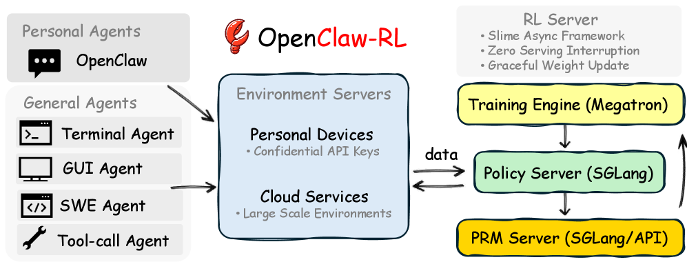
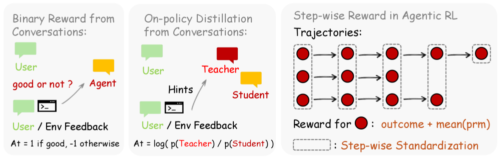
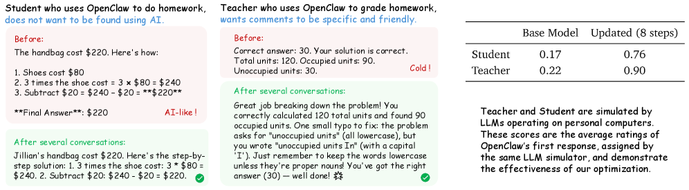

# OpenClaw-RL: Train Any Agent Simply by Talking

- **Authors:** Yinjie Wang, Xuyang Chen, Xiaolong Jin, Mengdi Wang, Ling Yang
- **Venue/Year:** arXiv 2603.10165, March 2026
- **Link:** https://arxiv.org/abs/2603.10165
- **Tags:** #agentic-rl #online-learning #process-reward #distillation #personal-agent

## TL;DR

OpenClaw-RL 提出利用 agent 交互中天然产生的 next-state signal（用户回复、工具输出、环境状态变化）作为在线学习信号，通过 Binary RL（评价性信号→标量奖励）和 Hindsight-Guided On-Policy Distillation/OPD（指导性信号→token 级 advantage）两种互补方法，实现 agent 在部署中持续自我改进，覆盖 personal conversation、terminal、GUI、SWE、tool-call 五种场景。

## Motivation

### 问题：Next-State Signal 的巨大浪费

每个已部署的 AI Agent 在每次动作 $a_t$ 之后都会收到一个 next-state signal $s_{t+1}$ —— 可能是用户的回复、工具的执行结果、GUI 的状态转变、或测试的判定。然而，**现有系统仅将其作为下一步推理的上下文**，从未将其回收为在线学习信号。

论文识别出两种形式的「信号浪费」：

### Waste 1 — 评价性信号 (Evaluative Signals)

Next-state signal 隐式地对前一个动作打分：
- 用户重新提问 → 暗示不满意
- 测试通过 → 暗示成功
- 错误 trace → 暗示失败

这本质上就是一种天然的 **Process Reward**，不需要任何额外的标注管线。但目前 PRM 的研究几乎全部集中在有可验证 ground truth 的数学推理领域。现有系统要么忽略这个信号，要么仅以离线/预收集的形式利用它。

### Waste 2 — 指导性信号 (Directive Signals)

比评分更进一步，next-state signal 往往还携带**方向性信息**：
- 用户说「你应该先检查文件再编辑」—— 不仅指出错误，还指明了 **token 级别应该怎么改**
- SWE 的详细 error trace 往往暗示了具体的修正方向

当前的 RLVR 方法（DeepSeekMath/GRPO、DeepSeek-R1、DAPO 等）使用标量 reward，无法将这种信息转化为方向性的策略梯度。而蒸馏方法依赖预先收集的 feedback-response pairs，而非实时信号。

### 核心观察

论文的核心 insight 非常简洁：

> **Next-state signals are universal, and policy can learn from all of them simultaneously.**

个人对话、终端执行、GUI 交互、SWE 任务、tool-call traces 不是分离的训练问题 —— 它们都是可以在同一个循环中训练同一个策略的交互。

## Method

### 一、问题形式化

每个交互流被形式化为 MDP $(S, A, T, r)$：

| 符号 | 含义 |
|------|------|
| $s_t \in S$ | 到 turn $t$ 为止的完整对话/环境上下文 |
| $a_t \in A$ | Agent 的响应（由 $\pi_\theta$ 生成的 token 序列） |
| $T(s_{t+1} \mid s_t, a_t)$ | 转移函数（给定环境是确定性的） |
| $r(a_t, s_{t+1})$ | 从 next-state signal 通过 PRM judge 推断的 reward |

关键区别在于：标准 RLVR 只在整条轨迹结束时给 outcome reward $o$，而 process reward $r(a_t, s_{t+1})$ **依赖于 next state，包含更丰富的信号**。

### 二、系统架构 — 四组件完全解耦



OpenClaw-RL 基于 slime 框架构建，核心设计原则是**完全解耦**：

```
Policy Serving  →  Environment  →  Reward Judging  →  Policy Training
  (SGLang)         (Http/API)      (SGLang/API)        (Megatron)
```

四个组件作为独立的异步循环运行，**无任何阻塞依赖**：
- 模型在服务下一个用户请求时，PRM 同时在判断上一个响应，训练器同时在应用梯度更新
- 权重更新采用 graceful update，不中断推理服务

**这是将持续学习从实时异构交互流中变为可行的关键：** 没有任何一条流需要暂停或批量化来适应其他组件的调度。

#### Session-Aware 环境服务器

对于 personal agent，环境就是用户的设备，通过保密 API 连接到 RL 服务器。每个 API 请求分为：

- **Main-line turn**：Agent 的主要响应和工具执行结果，构成可训练样本
- **Side turn**：辅助查询、记忆整理、环境转换，不产生训练数据

这种分类使 RL 框架能精确识别哪些 turn 属于哪个 session，实现针对性训练。

#### 多场景支持

| 设定 | 环境 | Next-state 信号 | 时域长度 |
|------|------|-----------------|----------|
| OpenClaw (Personal) | 用户设备 | 用户回复 / 工具结果 | 长 |
| Terminal | Shell sandbox | stdout/stderr, exit code | 长 |
| GUI | 屏幕 + 可访问性树 | 视觉状态差异, 任务进度 | 长 |
| SWE | 代码仓库 + 测试 | 测试判定, diff, lint 输出 | 长 |
| Tool-call | API/函数执行 | 返回值, error traces | 中等 |



### 三、Binary RL — 评价性信号 → 标量 Process Reward

#### PRM Judge 构建

给定响应 $a_t$ 和 next state $s_{t+1}$，judge 模型评估 $a_t$ 的质量：

$$\text{PRM}(a_t, s_{t+1}) \rightarrow r \in \{+1, -1, 0\}$$

具体判断逻辑：
- **工具调用结果**通常可得出明确结论
- **用户下一条回复**可能包含满意/不满意的信号
- 如果用户反应不明确，模型根据场景进行估计（但鼓励用户给出更明确的反馈）
- 对于通用 agent，judge 推断环境反馈是否表明朝任务目标取得了进展

运行 $m$ 次独立查询，取多数投票：$r_{\text{final}} = \text{MajorityVote}(r_1, \ldots, r_m)$

#### 训练目标

直接使用 $A_t = r_{\text{final}}$ 作为 advantage，采用标准 PPO-style 非对称 clipped surrogate：

$$\mathcal{L}_{\text{pg}} = -\mathbb{E}_t \left[ \min\left( \rho_t A_t, \; \text{clip}(\rho_t, 1-\varepsilon, 1+\varepsilon_{\text{high}}) \cdot A_t \right) \right]$$

$$\mathcal{L} = \mathcal{L}_{\text{pg}} + \beta_{\text{KL}} \cdot \mathcal{L}_{\text{KL}}$$

其中 $\varepsilon = 0.2$, $\varepsilon_{\text{high}} = 0.28$, $\beta_{\text{KL}} = 0.02$。

**注意**：这是实时对话设定，不存在可用于 GRPO 标准化的 group 结构。

### 四、Hindsight-Guided On-Policy Distillation (OPD) — 指导性信号 → Token 级监督

这是论文最核心的技术贡献。

#### 为什么需要 token 级监督？

Binary RL 将 $s_{t+1}$ 的全部信息内容压缩成一个标量 $r \in \{+1, -1, 0\}$。但当用户写「你应该先检查文件再编辑」时，传达的信息远不止「响应是错的」—— 而是**哪些 token 应该不同以及如何不同**。这种指导性信息被标量 reward 完全丢弃了。

OPD 的关键 insight：如果我们用从 $s_{t+1}$ 提取的文本 hint 增强原始 prompt，**同一个模型**会产生不同的 token 分布 —— 一个"知道"响应应该是什么样的分布。增强分布和学生分布之间的 per-token gap 就是方向性 advantage。

这与以下方法**本质不同**：
- **RLHF**：使用标量偏好信号
- **DPO**：需要成对偏好数据
- **标准蒸馏**：需要单独的、更强的教师模型

#### OPD 四步流程

**Step 1: Hindsight Hint 提取**

$$\text{Judge}(a_t, s_{t+1}) \rightarrow \{ \text{score} \in \{+1, -1\}, \; \text{hint} \in \mathcal{T}^* \}$$

关键设计选择：**不直接使用 $s_{t+1}$ 作为 hint**。原始 next-state 信号通常嘈杂、冗长或包含无关信息（例如用户回复可能同时包含修正和一个不相关的新问题）。Judge 模型将 $s_{t+1}$ 蒸馏为简洁、可操作的指令，通常 1-3 句话，聚焦于响应应该如何不同。

**Step 2: Hint 选择与质量过滤**

在 score=+1 且 hint > 10 字符的正向投票中，选择最长的（信息量最大的）。如果没有有效 hint，**直接丢弃该样本**。

这是一个刻意的设计：OPD **以样本数量换取信号质量**。只有 next-state 信号携带明确、可提取的修正方向的 turn 才进入训练。这种严格过滤与 Binary RL 互补 —— Binary RL 接受所有打分 turn 提供广覆盖，OPD 在更少样本上提供高分辨率监督。

**Step 3: 增强教师构建**

Hint 被附加到最后一条用户消息中：

$$s_{\text{enhanced}} = s_t \oplus \text{hint}$$

格式为 `[user's hint / instruction]\n{hint}`，创建模型「本来就会看到的」增强 prompt —— 如果用户一开始就提供了修正的话。

**Step 4: Token 级 Advantage 计算**

在 $s_{\text{enhanced}}$ 下查询策略模型，以**原始响应** $a_t$ 作为 forced input，计算每个 token 的 log-probability：

$$A_t = \log\pi_{\text{teacher}}(a_t \mid s_{\text{enhanced}}) - \log\pi_\theta(a_t \mid s_t)$$

- $A_t > 0$：教师（知道 hint）给这个 token 分配了更高概率 → 学生应该增加
- $A_t < 0$：教师认为这个 token 不太合适 → 学生应该降低

**与标量 advantage 的本质区别**：标量 advantage 将所有 token 推向同一方向，而这里提供了 **per-token 的方向性指导** —— 同一个响应中，某些 token 被强化，另一些被抑制。

训练使用与 Binary RL 相同的 clipped surrogate 目标，但 advantage 携带的信息量远大于标量 reward。

### 五、Binary RL + OPD 组合

两种方法的互补性分析：

| 维度 | Binary RL | OPD | 组合 |
|------|-----------|-----|------|
| 信号类型 | 评价性（好/坏） | 方向性 | 评价 + 方向 |
| Advantage | 序列级标量 | Token 级方向性 | 混合 |
| 覆盖密度 | 所有打分 turn | 仅 hint 通过的 turn | 所有打分 turn |
| 反馈类型 | 用户/环境 | 明确修正 | 隐式 + 显式反馈 |
| 信号丰富度 | 每样本 1 个标量 | 每 token 1 个值 | 每 token 1 个值 |

组合的 advantage 公式：

$$A_t = w_{\text{binary}} \cdot r_{\text{final}} + w_{\text{opd}} \cdot (\log\pi_{\text{teacher}}(a_t \mid s_{\text{enhanced}}) - \log\pi_\theta(a_t \mid s_t))$$

默认 $w_{\text{binary}} = w_{\text{opd}} = 1$。由于两者共享同一个 PPO loss，只是 advantage 计算不同，可以直接叠加。

### 六、General Agent 的 Step-wise Reward

#### 为什么 Process Reward 对 agentic 任务至关重要

长时域 agentic 任务中，outcome-only reward 仅在终止步提供梯度信号，绝大部分 turn 无监督。PRM 为每个 turn 基于 next-state signal 分配 reward，提供密集的 credit assignment。

#### Outcome + Process Reward 集成

沿用 RLAnything 的做法，直接相加：

$$\text{reward}_t = o + \sum_{i=1}^{m} r_i / m$$

其中 $r_i$ 由 $\text{PRM}(a_t, s_{t+1})$ 独立分配。

对于 advantage 计算的处理：由于 step-wise reward 的存在，GRPO 的分组标准化不再直接适用。论文直接按 **step index 分组** —— 在真实场景（如 terminal agent）中，状态难以聚类，按步骤索引分组被证明是有效的。

## Results

### Personal Agent Track

#### 实验设置

两个模拟场景，均使用 Qwen3-4B：

1. **学生场景**：模拟学生用 OpenClaw 写作业，不希望被看出使用了 AI。任务来自 GSM8K。
2. **教师场景**：模拟教师用 OpenClaw 批改作业，希望评语具体且友好。

设置：LR=$1 \times 10^{-5}$, KL 系数=0, 每 16 个样本触发一次训练。

#### 关键结果

**Q1: Binary RL vs. OPD — 各自何时胜出？**

| 方法 | 更新 8 步 | 更新 16 步 |
|------|-----------|------------|
| Binary RL | 0.25 | 0.23 |
| OPD | 0.25 | 0.72 |
| **Combined** | **0.76** | **0.81** |

（基准分 0.17）

关键发现：
- **OPD 的效果有延迟**：因为样本稀疏（严格的质量过滤），需要更多交互才能积累足够的训练数据
- **Binary RL 单独提供的改进有限**：仅靠标量 reward 对个性化优化的帮助不大
- **组合方法显著优于任何单一方法**：在仅 8 步更新时就达到 0.76，验证了两种方法的互补性



**Q2: 个性化是否随时间改善？**

- 学生场景：仅 36 次解题交互后，agent 学会避免明显的 AI 痕迹（不用「bold」等词、避免过度结构化的分步响应），转向更自然随意的风格
- 教师场景：仅 24 次批改交互后，agent 从简单的"Correct."变为详细、友好、带 emoji 的具体反馈

#### 具体示例

**学生场景 — 优化前 vs 优化后**：

优化前的回答高度格式化（加粗关键词、分步编号、LaTeX 公式、"Answer:"总结），一眼就是 AI 生成的。

优化后变成：「The answer is 100%. Here's the breakdown: The probability of rolling...」—— 更口语化、无多余格式。

**教师场景 — 优化前 vs 优化后**：

优化前：`Correct. Well done!`（两个词）

优化后：长段细致反馈，指出每一步计算的正确性，用鼓励性语言和 emoji。

### General Agent Track

#### 实验配置

| 场景 | 模型 | 数据集 | 并行环境数 | 最大交互步 |
|------|------|--------|-----------|-----------|
| Terminal | Qwen3-8B | SETA RL | 128 | 10 |
| GUI | Qwen3VL-8B-Thinking | OSWorld-Verified | 64 | 30 |
| SWE | Qwen3-32B | SWE-Bench-Verified | 64 | 20 |
| Tool-call | Qwen3-4B-SFT | DAPO RL | 32 | - |

#### Q3: 作为通用 agentic RL 框架是否有竞争力？

四种场景（terminal/GUI/SWE/tool-call）均展现持续性能提升。论文通过大规模环境并行化进一步提升了训练可扩展性。

#### Q4: Process Reward 对长时域任务是否至关重要？

| 设定 | Outcome + Process | Outcome only |
|------|-------------------|-------------|
| Tool-call | **0.30** | 0.17 |
| GUI | **0.33** | 0.31 |

Process reward 带来的提升在 tool-call 场景尤其显著（几乎翻倍），但代价是需要额外资源托管 PRM。

## Strengths & Weaknesses

### Strengths

1. **统一的理论视角**：将 personal conversation、terminal、GUI、SWE、tool-call 统一为「从 next-state signal 学习」的框架，这个抽象层次恰到好处 —— 足够通用涵盖所有场景，又足够具体可以直接实施。

2. **OPD 的设计非常巧妙**：
   - 不需要外部教师模型（自己做自己的教师）
   - 不需要成对偏好数据（DPO 所需）
   - 不需要预收集数据（完全在线）
   - 核心 trick 极其简单：同一模型 + 不同上下文 = 不同分布，差异就是梯度

3. **工程完备性**：四组件全解耦的异步架构不是 toy system，session-aware 的 turn 分类、non-blocking logging、graceful weight update 等设计都面向真实部署。

4. **Binary RL + OPD 的互补性论证充分**：不是简单的两个 loss 相加，而是在信号类型（evaluative vs directive）、覆盖密度（全量 vs 高质量子集）、粒度（序列级 vs token 级）三个维度上互补。

5. **"越用越好"的愿景很有吸引力**：agent 不需要专门的训练阶段，正常使用就是在训练，这对 personal agent 的产品化有重要意义。

### Weaknesses

1. **Personal Agent 实验全是模拟**：用 LLM 模拟用户，而非真实用户研究。模拟用户的行为模式（重新提问、给修正反馈）可能与真实用户有显著差异。这是论文最大的局限 —— "Train Any Agent Simply by Talking" 的标题承诺在真实场景中未被验证。

2. **场景单一**：Personal agent 只在 GSM8K 数学题上测试，这是一个有明确答案的 well-defined 任务。真实 personal agent 的使用场景远比此复杂 —— 开放式对话、创意写作、信息检索等，效果存疑。

3. **PRM Judge 的准确性问题被回避**：整个方法的基础是 PRM 能准确判断 $a_t$ 的质量，但论文未分析 judge 误判的频率和影响。尤其在 personal agent 场景，用户意图的理解本身就很困难。

4. **模型规模较小**：实验用 4B/8B/32B，大模型（70B+）上的效果未知。OPD 中 teacher 和 student 是同一个模型，模型能力上限可能限制 hint-enhanced 分布的质量。

5. **OPD 的样本效率问题**：严格的质量过滤意味着大量样本被丢弃，Table 3 中 OPD 在 8 步时仅与 Binary RL 持平（都是 0.25），到 16 步才爆发（0.72），说明 cold-start 问题存在。

6. **缺乏消融实验**：例如 hint 长度选择策略（为什么选最长的？）、vote 数量 $m$ 的影响、KL 系数的敏感性等。

7. **General Agent 的 PRM 设计较简单**：Binary +1/-1 的打分对于复杂的 SWE 任务可能过于粗糙，论文未探索更细粒度的评分方案。

## Key Takeaways

### 技术 Insight

1. **Next-state signal 是被严重低估的学习信号来源**。这个观察虽然事后看来"显而易见"，但之前没有人系统地将其用于在线 agentic RL。好的研究往往就是把"显而易见但没人做"的事情做好。

2. **自蒸馏通过上下文增强**是一种非常优雅的范式。不需要更强的模型、不需要成对数据、不需要离线收集 —— 只需要给同一个模型更多信息。这个 trick 的适用范围可能远超本文的场景。

3. **评价性信号和指导性信号的区分**是一个有用的概念框架。现有工作基本只利用前者（reward），本文首次系统性地利用后者（directional supervision）。

4. **完全异步的训练架构**是在线 agentic RL 的必要条件。传统的 batch-offline 模式在持续学习场景下不可行。

### 研究方向

1. **真实用户验证**是必须补上的工作。模拟实验只是 proof-of-concept。
2. **OPD 与更大模型的 scaling behavior** 值得研究 —— 当 teacher 更强时，hint-enhanced 分布的质量是否会带来更大的提升？
3. **多用户个性化**的场景（不同用户有不同偏好）如何处理 reward signal 的冲突？
4. **Safety 考虑**：如果用户的反馈本身包含 harmful 指令，模型会不会学到有害行为？论文完全没有讨论。

### 与现有工作的关系

- **vs RLAnything**: OpenClaw-RL 在 general agent track 上直接沿用了 RLAnything 的 outcome+process reward 集成方法，但增加了 personal agent track 和 OPD
- **vs slime**: OpenClaw-RL 构建在 slime 之上，继承其异步训练基础设施，扩展了 session-aware 环境服务器和 personal agent 支持
- **vs GRPO/DAPO**: 这些方法在 batch-offline 模式下工作，OpenClaw-RL 转向在线持续学习
- **vs STaR/HIR**: 这些 hindsight 方法在固定数据集上操作，OpenClaw-RL 将 hindsight relabeling 用于在线设置

## Related Work

- [RLAnything](https://arxiv.org/abs/placeholder) — step-wise PRM 对长时域 agentic 任务的重要性
- [slime](https://github.com/placeholder) — 异步 RL 训练框架（Megatron + SGLang）
- [DAPO](https://arxiv.org/abs/placeholder) — GRPO 的改进，大规模 RLVR
- [ReasonFlux](https://arxiv.org/abs/placeholder) — 层次化 RL 优化 thought template 序列
- [SuperCorrect](https://arxiv.org/abs/placeholder) — 从教师提取层次化 template 做跨模型纠错
- [Buffer of Thoughts](https://arxiv.org/abs/placeholder) — 上下文增强方法的先驱
