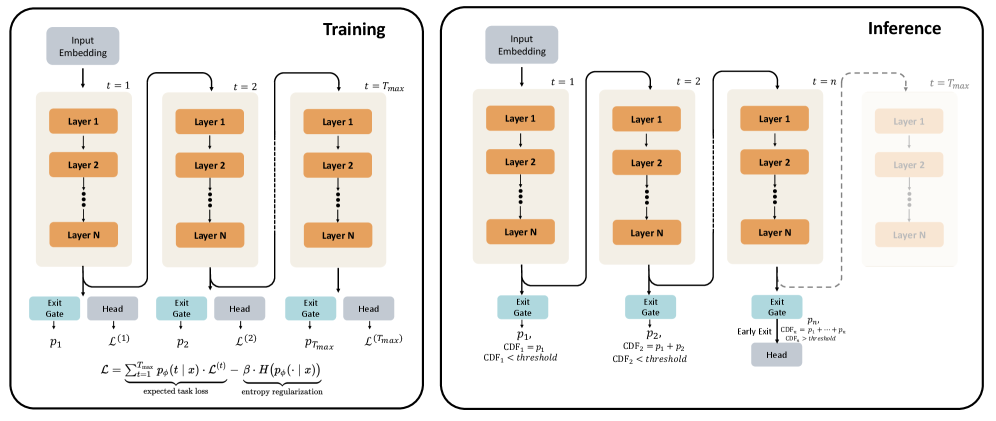
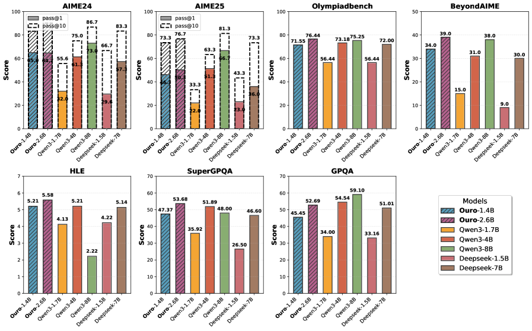
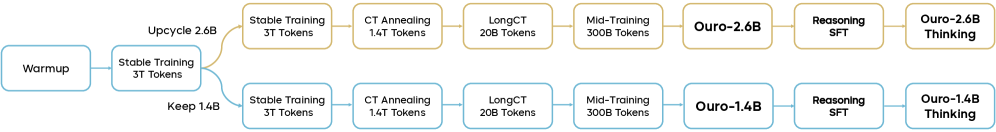

# Scaling Latent Reasoning via Looped Language Models (Ouro)

- **Authors:** Rui-Jie Zhu, Zixuan Wang, Kai Hua, Tianyu Zhang, Ziniu Li, ... Yoshua Bengio, Jason Eshraghian
- **Venue/Year:** arXiv 2510.25741, October 2025 (v4: November 2025)
- **Link:** https://arxiv.org/abs/2510.25741
- **Tags:** #architecture #looped-lm #latent-reasoning #adaptive-computation #scaling-law #pre-training

## TL;DR

Ouro 是一系列在预训练阶段就内建循环计算的 Looped Language Model (LoopLM)，通过 (i) 潜在空间中的迭代计算、(ii) 熵正则化的自适应深度分配、(iii) 7.7T tokens 的大规模预训练，实现了 1.4B 参数匹配 4B 模型、2.6B 参数匹配 8-12B 模型的参数效率。关键发现：循环不增加知识容量（仍是 ~2 bits/parameter），但显著增强知识操控能力（组合推理、多跳问答）。

## Motivation

### 现有 scaling 路径的局限

当前 LLM 推理能力的三条 scaling 路径各有瓶颈：

1. **模型规模 scaling**：部署百亿参数模型的基础设施成本高昂
2. **数据 scaling**：高质量数据接近枯竭（Chinchilla 式扩展已到极限）
3. **推理时 CoT**：将推理延迟到后训练阶段，上下文长度膨胀，且 CoT 的推理轨迹可能只是事后合理化（post-hoc rationalization）而非忠实反映模型内部计算

### 第三条路径：架构创新

论文提出**循环深度（loop depth）**作为模型规模和数据量之外的**第三个 scaling 轴**——在固定参数预算下，通过权重共享层的迭代复用实现动态计算深度。

核心 insight：不是让模型"说出"推理过程（CoT），而是让推理发生在潜在空间中（latent reasoning），通过反复过同一组层来加深计算。

## Method

### 一、LoopLM 架构


**标准 LM（非循环）：**

$$F(\cdot) = \text{lmhead} \circ M^L \circ \text{emb}(\cdot)$$

**Looped LM（T 次循环）：**

$$F^{(t)}(\cdot) = \text{lmhead} \circ \underbrace{M^L \circ M^L \circ \cdots \circ M^L}_{t \text{ iterations}} \circ \text{emb}(\cdot)$$

同一组 L 层权重被迭代复用 t 次。每个循环步 t 都产生一个 LM head 输出，可以在任意步提前退出。t=1 时退化为标准 Transformer。

**架构配置：**

| 配置 | Ouro 1.4B | Ouro 2.6B |
|------|-----------|-----------|
| 参数量 | 1.4B | 2.6B |
| 层数 (L) | 24 | 48 |
| Hidden size | 2048 | 2048 |
| Attention | MHA | MHA |
| FFN | SwiGLU | SwiGLU |
| Position Embedding | RoPE | RoPE |
| Normalization | Sandwich RMSNorm | Sandwich RMSNorm |
| Vocab Size | 49,152 (SmolLM2 tokenizer) | 49,152 |

**关键设计选择**：Sandwich normalization（attention 和 FFN 子层前都加 RMSNorm），对循环架构的训练稳定性至关重要。

### 二、自适应计算——退出门控机制



**退出门（Exit Gate）**：每步 t 并行于 LM head 运行：

$$\lambda_t(x) = \sigma(\text{Linear}_\phi(h^{(t)})) \in (0, 1)$$

**存活概率**：

$$S_t(x) = \prod_{j=1}^{t}(1 - \lambda_j(x)), \quad S_0 \equiv 1$$

**归一化退出分布**：

$$p_\phi(t \mid x) = \begin{cases} \lambda_t(x) \cdot S_{t-1}(x), & t = 1, \ldots, T_{\max}-1 \\ S_{T_{\max}-1}(x), & t = T_{\max} \end{cases}$$

**推理时提前退出**：给定阈值 $q \in [0, 1]$：

$$t_{\text{exit}}(x) = \min\{m : \text{CDF}(m \mid x) \geq q\}$$

小 q → 更早退出（省计算）；大 q → 更深计算（更准确）。

### 三、Stage I——熵正则化目标

$$\mathcal{L} = \sum_{t=1}^{T_{\max}} p_\phi(t \mid x) \cdot \mathcal{L}^{(t)} - \beta \cdot H(p_\phi(\cdot \mid x))$$

- 第一项：加权期望 task loss（每步 loss 按退出概率加权）
- 第二项：**熵正则化**，防止 $p_\phi$ 坍缩到 $t = T_{\max}$

**ELBO 解释**：等价于以退出步 z 为隐变量、均匀先验 $\pi_t = 1/T_{\max}$ 的负 ELBO：

$$\mathcal{L}_{\text{ELBO}} = \sum_t p_\phi(t \mid x) \cdot \mathcal{L}^{(t)} + \beta \cdot \text{KL}(p_\phi \| \pi)$$

**为什么用均匀先验**（而非 PonderNet 的几何先验）：深度无偏，让退出决策完全由输入难度驱动。消融实验证实均匀先验在训练 loss、收敛稳定性、测试时 accuracy-compute Pareto frontier 上全面优于几何先验。

### 四、Stage II——聚焦门控训练

LM 参数冻结，只训练退出门 $\phi$。使用贪心信号：

**Loss 改进量**：

$$I_i^{(t)} = \max(0, \mathcal{L}_{i,\text{stop}}^{(t-1)} - \mathcal{L}_{i,\text{stop}}^{(t)})$$

**理想继续概率**（sigmoid 标签）：

$$w_i^{(t)} = \sigma(k \cdot (I_i^{(t)} - \gamma)), \quad k=50, \gamma=0.005$$

**自适应退出 loss**（BCE，惩罚 underthinking 和 overthinking）：

$$\mathcal{L}_{\text{adaptive}}^{(t)} = -\frac{1}{M}\sum_i [w_i^{(t)} \log(1-\lambda_i^{(t)}) + (1-w_i^{(t)}) \log(\lambda_i^{(t)})]$$

### 五、训练流程



| 阶段 | 学习率 | 序列长度 | Tokens | 循环步数 | β (KL) | RoPE base |
|------|--------|---------|--------|---------|--------|-----------|
| 1a 预训练 I（探索） | 3e-4 | 4K | 3T | **8** | 0.1 | 10K |
| 1b 预训练 II（稳定） | 3e-4 | 4K | 3T | **4** | 0.1 | 10K |
| 2 CT Annealing | 3e-5 | 16K | 1.4T | 4 | 0.05 | 40K |
| 3 LongCT | 3e-5 | 64K | 20B | 4 | 0.05 | 1M |
| 4 Mid-training | 1e-5 | 32K | 300B | 4 | 0.05 | 1M |

**总计 7.7T tokens**。全程使用 AdamW (β₁=0.9, β₂=0.95)，weight decay=0.1，gradient clip=1.0。

**关键训练决策**：
- **循环步数从 8 降到 4**：8 步时梯度在循环迭代中累积放大，导致训练不稳定（loss spikes）
- **2.6B 模型的 upcycling**：将 24 层通过层复制扩展为 48 层。权重共享天然支持平滑 upcycling
- **KL 系数从 0.1 降到 0.05**：减少 task loss 和 KL 惩罚之间的冲突梯度

**预训练数据**（全部开源）：
- Stage 1：Nemotron-CC (73.4%), MAP-CC (13%), OpenCoder (7.5%), MegaMath (4.1%), Ultra-FineWeb-zh (2%)
- Stage 2：高质量子集 + 合成代码 + SFT 混合，1.4T tokens
- Stage 4：20+ 开源 SFT 数据集，转为 ChatML 格式，经过去污染

**SFT（Ouro-Thinking 模型）**：~8.3M 样本（Math 3.5M, Code 3.2M, Science 808K, Chat 767K），2 epochs，LR 2e-5

**RL 尝试（失败）**：DAPO/GRPO 在 DAPO-17K 上训练，因 LoopLM 的动态早退出机制与 vLLM/SGLang 的固定执行路径不兼容而失败。

## Results

### 主要 Benchmark 结果

**Ouro 1.4B (R4) vs 1-4B 基线：**

| Benchmark | Gemma3-1B | Llama3.2-1.2B | Qwen2.5-1.5B | Qwen3-1.7B | Qwen3-4B | **Ouro 1.4B** |
|-----------|----------|--------------|-------------|-----------|---------|------------|
| MMLU | 39.85 | 45.46 | 60.99 | 62.46 | 73.19 | **67.35** |
| MMLU-Pro | 11.31 | 11.80 | 29.11 | 37.27 | 51.40 | **48.62** |
| BBH | 30.26 | 30.72 | 43.66 | 53.51 | 70.95 | **71.02** |
| GSM8K | 2.05 | 7.05 | 60.73 | 70.28 | 72.86 | **78.92** |
| MATH500 | 41.00 | 7.40 | 17.60 | 25.80 | 59.60 | **82.40** |
| HumanEval | 6.70 | 19.50 | 52.40 | 66.50 | 77.40 | **74.40** |

1.4B 参数在 BBH 上超越 Qwen3-4B（71.02 vs 70.95），MATH500 上大幅领先（82.40 vs 59.60）。

**Ouro 2.6B (R4) vs 3-12B 基线：**

| Benchmark | Qwen3-4B | Qwen2.5-7B | Llama3.1-8B | Qwen3-8B | Gemma3-12B | **Ouro 2.6B** |
|-----------|---------|-----------|-----------|---------|----------|------------|
| MMLU | 73.19 | 74.20 | 73.02 | 76.63 | 72.14 | **74.60** |
| MMLU-Pro | 51.40 | 43.55 | 43.24 | 53.72 | 49.21 | **55.73** |
| BBH | 71.14 | 53.72 | 71.56 | 77.65 | 78.41 | **80.46** |
| MATH500 | 59.60 | 61.20 | 52.90 | 62.30 | 83.20 | **90.85** |
| MBPP | 78.80 | 73.80 | 62.40 | 79.00 | 73.50 | **80.40** |

2.6B 在 MMLU-Pro 和 BBH 上超越 Qwen3-8B，MATH500 上超越 Gemma3-12B。

**Ouro-Thinking（推理模型）：**

| Model | AIME24 p@1 | AIME25 p@1 | OlympiadBench | GPQA |
|-------|-----------|-----------|-------------|------|
| Ouro 1.4B-Thinking | **65.0** | **46.3** | **71.6** | 45.5 |
| Qwen3-4B | 61.3 | 51.3 | 73.2 | **54.5** |
| DS-Distill-Qwen-7B | 57.3 | 36.0 | 72.0 | 51.0 |
| Ouro 2.6B-Thinking | 64.7 | **50.3** | **76.4** | 52.7 |
| Qwen3-8B | **73.0** | 66.7 | 75.3 | **59.1** |

1.4B Thinking 在 AIME24 上超越 Qwen3-4B（65.0 vs 61.3）和 DS-Distill-Qwen-7B（57.3）。

### 循环深度与外推



**Base 模型**：
- T=1 → T=4 性能跳跃极大（如 1.4B 的 MMLU：41.21 → 67.45）
- T=1 到 T=2 是最大的跳跃（从弱到可用）
- 外推到 T=5-8 性能温和下降，但仍远高于 T=1

**Thinking 模型**：
- T=1 时性能接近零（如 AIME24: 0.00），证实迭代细化是必需的
- 1.4B 在 T=4-5 达到峰值；2.6B 更早在 T=3-4 达到峰值
- 2.6B 外推衰减更严重（AIME24 从 70.33 降到 39.00 at T=8）

### KV Cache 共享——推理效率

| 策略 | GSM8K | MATH500 | 显存节省 |
|------|-------|---------|---------|
| Full (4x cache) | 78.92 | 82.40 | 1x |
| 仅最后一步 cache | 78.85 | 80.40 | **4x** |
| 仅第一步 cache | 18.73 | 8.43 | 4x |
| 平均 cache | 78.73 | 78.52 | 4x |

**关键发现**：仅复用最后一步的 KV cache 即可在几乎不损失性能的情况下实现 4x 显存节省。第一步 cache 复用导致灾难性崩溃——说明循环确实在不断改写 hidden state。

### 知识容量 vs 知识操控——机制性理解


**知识容量（Capo 任务）**：
- 合成传记数据，GPT-2 架构，1M-40M 参数
- 结论：**循环不增加知识容量**，两者都是 ~2 bits/parameter
- 参数量是知识容量的直接决定因素

**知识操控（Mano 任务——模算术树组合）**：

| 模型 | 参数 | FLOP | L=10 | L=16 | L=24 |
|------|------|------|------|------|------|
| Base 12x1 | 6x | 6x | 93.6 | 94.4 | 34.8 |
| Base 2x1 | 1x | 1x | 21.5 | 8.4 | 7.5 |
| **Loop 2x6** | **1x** | **6x** | **98.1** | **96.3** | **78.0** |
| Base 3x1 | 1.5x | 1.5x | 75.4 | 29.8 | 11.0 |
| **Loop 3x4** | **1.5x** | **6x** | **97.9** | **95.8** | **92.2** |

Loop 2x6（与 2x1 同参数量）在 L=24 上从 7.5% 飙升至 78.0%，甚至超越参数量 6 倍的 12x1 基线（34.8%）。

**MMLU 子类别分析**：
- 推理密集型类别提升最大：Elementary Math (+155.6%), Formal Logic (+143.3%), Logical Fallacies (+127.8%)
- 知识密集型类别提升最小：Moral Scenarios (+7.8%), Global Facts (+8.3%), Virology (+13.7%)

**结论**：循环增强的是知识操控（组合、推理、多跳），而非知识存储。

### 推理轨迹的忠实性


**实验**：Quora Question Pairs (1000 items)，训练线性探针预测最终答案。

- **标准 CoT 模型（Qwen3-4B-Thinking）**：final-token logits 上的线性探针 ROC AUC = 0.99 → 思考过程几乎不改变结果，CoT 是事后合理化
- **LoopLM**：前一步的 hidden state 无法可靠预测下一步的决策，每个循环确实在修正暂时性判断

**步间一致性矩阵** A（1000 个 Quora pairs）：
- A[2,3] = 551（55.1% 一致）, A[2,4] = 361（36.1%）
- 训练深度内各步显著不一致 → 忠实的潜在推理过程
- T≥4 后趋于收敛 → 外推步不再有新的修正

### 安全性

HEx-PHI 数据集：安全性随循环步数增加而改善，甚至在外推步（T=5-8）仍在改善。Ouro 2.6B-Thinking 的有害率仅 0.003，优于 Qwen3-4B-Thinking (0.009)。

### Scaling Law

$$L_t = E + \frac{A}{(N+t_1)^\alpha} + \frac{B}{(D+t_2)^\beta} + \frac{C}{(T_m+t_3)^\gamma}$$

- $R^2 = 0.9596$，三个变量：模型大小 N、数据量 D、最大循环步 $T_m$
- 学习到的门控分布（T_max=4）：{0.0004, 0.0855, 0.3793, 0.5348}——模型压倒性偏好更深的步
- Standard vs LoopLM 的性能差距随模型规模增大而缩小

## Deep Dive：三个关键问题的深入讨论

### 问题一：LoopLM vs 扩展上下文长度/CoT，本质区别是什么？

两者看似都在"让模型想更久"，但计算发生的维度完全不同——**宽度 vs 深度**。

**扩展上下文 / CoT（横向扩展）：** 推理通过生成更多 token 实现。每个 token 只过一遍所有层（固定深度），"想更多"= 写更多字。

```
输入 → [Layer 1→...→24] → token₁ → [Layer 1→...→24] → token₂ → ...
```

**LoopLM（纵向扩展）：** 推理通过加深每个位置的计算实现。不生成新 token，"想更多"= 在同一个位置想得更深。

```
输入 → [Layer 1→...→24] → h₁ → [Layer 1→...→24] → h₂ → ... → h₄ → 输出 token
         同一组权重，反复使用 T 次，hidden state 不断精化
```

**信息瓶颈的差异**：CoT 把中间推理压缩成自然语言 token——这是一个巨大的信息瓶颈。Hidden state 是 2048 维的连续向量，而一个 token 只能从 49152 个离散选项里选一个。LoopLM 的中间状态始终停留在高维连续空间，信息不因文本化而丢失。

**计算复杂度的差异**：论文的理论结果最能说明问题。以图可达性为例：

| 方法 | 顺序计算步数 | 机制 |
|------|------------|------|
| CoT（写出中间推理） | $O(n^2)$ | 逐步写出路径 |
| Continuous CoT | $O(D)$（D=图直径） | 连续空间逐跳传播 |
| **LoopLM** | $O(\log D)$ | **重复平方法**——每循环一次可达范围翻倍 |

LoopLM 之所以能实现指数级加速，是因为在潜在空间中可以做**矩阵重复平方**（类似 Warshall 算法）。CoT 必须逐步写出"A→B→C→D→..."，每步只能前进一跳。

**资源消耗模式的差异**：

| | 扩展上下文 / CoT | LoopLM |
|---|---|---|
| 额外消耗 | KV Cache 线性增长 | KV Cache 可复用（最后一步即可，4x 省显存） |
| 延迟来源 | 自回归生成（token-by-token） | 前向传播次数增加（但所有位置可并行） |
| 上限 | 受上下文窗口限制 | 受循环步数限制 |

**两者非对立，可以结合**：Ouro-Thinking 就是 LoopLM + CoT SFT。每生成一个 thinking token，都经过了 4 次循环的深度计算。论文的立场是：CoT 把推理全部外包给文本生成是低效的，应该在预训练阶段就通过架构内建底层推理能力，让 CoT 只负责最高层的推理结构。

#### 不生成新 token，如何"理解更深"？

关键在于 **hidden state 在每次循环中都在变**。虽然没有新 token，但每个位置的 2048 维向量在每轮循环中都被 Attention 和 FFN 重新变换。

以计算 `(3 × 7) + (5 - 2)` 为例：

- **第 1 轮后**：各位置编码了局部信息——"×"知道左边是 3、右边是 7
- **第 2 轮后**：Attention 在已融合局部信息的表征上再次聚合——"×"完成了 3×7=21 的计算
- **第 3 轮后**："+"位置整合了两个子表达式的结果——21+3=24
- **第 4 轮后**：全局一致性检查和信心巩固

核心机制是**信息传播的"涟漪效应"**：每轮循环中 Attention 聚合的不是原始输入，而是上一轮已经融合了上下文的表征。这意味着每多循环一轮，每个位置间接获得的信息范围指数级增长——类似于社交网络中信息传播的"六度分隔"效应。

论文数据直接证明了 hidden state 在循环中发生了根本改变：

- **KV Cache 证据**：仅第 1 轮 cache → GSM8K 18.73%（崩溃），仅第 4 轮 cache → 78.85%（正常）。如果循环没有实质改变 hidden state，两者应差不多。
- **步间决策证据**：步 2 和步 4 的答案仅 36.1% 一致——63.9% 的决策被翻转了。

### 问题二：循环过多会导致类似 GNN 的"过平滑"吗？

**结论：确实存在类似现象，但机制不同于 GNN 过平滑。**

#### 数据证据

论文数据清晰展示了"循环过多性能下降"：

| 循环步 | 1 | 2 | 3 | **4** | 5 | 6 | 7 | 8 |
|--------|---|---|---|-------|---|---|---|---|
| MMLU (1.4B Base) | 41.2 | 60.4 | 66.7 | **67.5** | 66.6 | 65.8 | 65.3 | 64.5 |
| AIME24 (2.6B Thinking) | 3.0 | 52.0 | **70.3** | 64.7 | 57.0 | 56.3 | 49.7 | 39.0 |

Base 模型 T=4 后温和下降（67.5→64.5），但 Thinking 模型从峰值 70.3 暴跌至 39.0，几乎腰斩。

步间一致性矩阵也证实了"收敛"：A[4,5] ≈ 100%（步 4 之后几乎不再变化），hidden state 趋于"冻结"。

#### 与 GNN 过平滑的机制对比

| | GNN 过平滑 | LoopLM 深度衰减 |
|---|---|---|
| 坍缩维度 | 不同节点的表征趋于相同向量 | 同一位置在不同循环步的表征趋于不变 |
| 信息丢失类型 | 位置区分性消失 | 迭代修正能力消失 |
| 根本原因 | 重复聚合 ≈ 低通滤波器 | 同一映射反复作用 → 收敛到不动点 |
| 曲线形状 | 越深越差（单调下降） | **先升后降**（存在最优深度） |
| 数学本质 | 节点特征趋于图的主特征向量 | hidden state 收敛到 $f$ 的不动点 $h^*$ |

LoopLM 的问题更准确地说是**迭代映射的不动点收敛**：同一组权重 $f$ 反复作用在 hidden state 上，数学上是一个动力系统。经过足够多次迭代，$h \to f(h) \to f(f(h)) \to \cdots \to h^*$。到达不动点后，继续循环就是在 $h^*$ 附近做无意义的振荡甚至偏移。

但两者共享一个深层原因：**有限维度的表征空间在反复变换下信息逐渐饱和。**

#### Ouro 的缓解措施

1. **Sandwich RMSNorm**：attention 和 FFN 前都加 RMSNorm，每次循环后重新归一化，防止向量范数爆炸或坍缩。这和 GNN 中加 BatchNorm/LayerNorm 防过平滑的策略一脉相承。

2. **自适应退出门控**：最直接的对策——学习判断"继续循环还有没有收益"。当 loss 改进量 $I^{(t)} < \gamma$ 时建议退出。学习到的分布 {0.04%, 8.6%, 37.9%, 53.5%} 说明模型确实学会了在不同难度的输入上分配不同的循环深度。

3. **残差连接**：Transformer 每层的残差连接 $h' = h + \text{Attention}(h)$ 保证原始信息不会被完全洗掉。这和 GNN 中 JK-Net（Jumping Knowledge）防过平滑的思路相同。

#### 未解决的问题

- **循环步数卡在 4**：8 步循环导致梯度爆炸被迫妥协。论文没有尝试更优雅的解决方案：循环间 gradient detach（类似 Truncated BPTT）、progressive training（逐步增加循环步）、spectral normalization（约束权重谱半径 < 1 保证收缩映射）。
- **外推衰减的本质**：T=5-8 的性能暴跌可能不是经典过平滑，而是**分布外漂移**——第 5 轮的 hidden state 分布是训练时从未见过的，模型在 OOD 输入上行为不可预测。
- **理论上应该够了**：$O(\log D)$ 的理论复杂度意味着对大多数 NLP 任务 3-4 步就够。额外循环可能不是"过平滑导致信息丢失"，而是"超过任务所需计算深度后引入噪声"。

### 问题三：位置编码（RoPE）如何与循环兼容？

这是论文**没有充分讨论**的一个关键设计细节。

#### 现状：每轮循环使用完全相同的 RoPE

Ouro 使用 RoPE，它在 Attention 计算时对 Q/K 施加基于位置的旋转：

$$\text{attention}(q_m', k_n') = q_m^T R_{n-m} k_n$$

在 LoopLM 中，每次循环都使用**完全相同的位置编码**：

```
循环 1: Q = W_q · h⁽⁰⁾, K = W_k · h⁽⁰⁾, apply RoPE(pos=0,1,2,...)
循环 2: Q = W_q · h⁽¹⁾, K = W_k · h⁽¹⁾, apply RoPE(pos=0,1,2,...) ← 完全一样！
循环 3: Q = W_q · h⁽²⁾, K = W_k · h⁽²⁾, apply RoPE(pos=0,1,2,...) ← 完全一样！
```

RoPE **不区分"第几轮循环"**，模型只能通过 hidden state 本身的内容分布来隐式"感知"当前是第几轮。

#### 为什么这能工作？

这其实和标准 Transformer 的逻辑一致：标准 Transformer 的第 1 层和第 24 层也使用完全相同的 RoPE，依靠**不同的权重矩阵**和**不同的输入 hidden state** 来区分层级。

LoopLM 的区别是**权重也共享了**，所以完全靠 hidden state 内容差异区分循环步。而每轮的输入 hidden state 分布确实差异很大：

- 循环 1 输入：原始 token embedding（低层特征）
- 循环 2 输入：经过 24 层变换的表征（中层特征）
- 循环 4 输入：经过 72 层变换的表征（高层特征）

这些分布差异足够让共享的权重矩阵产生截然不同的行为——就像同一把锤子敲在木头和铁块上效果不同。

#### 但这也解释了外推衰减

没有显式的循环位置信号意味着：

1. **模型在隐式推断"我在第几轮"上浪费了容量**。如果加入 Loop Position Embedding（$h' = h + e_t$），模型可以直接知道循环位置，把容量省下来做推理。
2. **循环外推几乎无望**。第 5 轮的 hidden state 分布是训练时从未见过的，模型既没有显式信号说"这是第 5 轮"，也无法从陌生的 hidden state 分布中推断。这可能是外推性能暴跌（AIME24: 70.3→39.0）的根本原因之一。

#### 可能的替代方案

| 方案 | 做法 | 优劣 |
|------|------|------|
| **Ouro 当前** | RoPE 不变，循环步无显式编码 | 简洁、与标准 Transformer 兼容，但循环外推差 |
| **Loop Position Embedding** | 加可学习的 $e_t$：$h' = h + e_t$ | 显式区分，可能改善外推，但破坏权重共享纯粹性 |
| **拼接 loop index 到 RoPE** | pos = seq_pos × T_max + loop_idx | 统一序列和循环维度，但改变 attention 位置语义 |
| **循环间重置 RoPE 相位** | 每轮从不同相位开始 | 自动区分循环步，但可能破坏相对位置编码性质 |

这可能是 LoopLM 未来突破循环步数限制（从 4 到 8、16）的一个关键技术点，但目前社区对"循环架构的位置编码"还没有成熟的解决方案。

## Strengths & Weaknesses

### Strengths

1. **"循环深度作为第三个 scaling 轴"的提法非常有说服力**。不是概念验证级别的小实验，而是 7.7T tokens 的完整预训练管线，证明了这个方向在 scale 上可行。

2. **知识容量 vs 操控的分离实验**（Capo/Mano/Multi-hop QA）是全文最有价值的贡献。定量证明循环不增加存储（~2 bits/param），只增强组合推理能力。这为"为什么循环有效"提供了清晰的机制性解释，而非黑箱式的 benchmark 提升。

3. **CoT 忠实性分析**揭示了一个重要发现：标准 CoT 的"思考"可能只是事后合理化（线性探针 AUC=0.99 意味着答案在思考前就定了），而 LoopLM 的潜在循环是真正的迭代修正。这对 CoT 研究有深远影响。

4. **自适应退出的 ELBO 解释**非常优雅。将退出步视为隐变量、均匀先验 = 最大熵原则，给了一个理论上干净的框架。Stage II 的 loss-improvement 信号设计也很精巧（sigmoid 阈值化 + BCE）。

5. **KV Cache 共享发现**有实际应用价值：仅复用最后一步 cache 就能 4x 省显存且几乎无损，这大大降低了 LoopLM 的部署成本。

6. **理论结果**：LoopLM 在图可达性上只需 $O(\log D)$ 步（vs CoT 的 $O(n^2)$ 和 Continuous CoT 的 $O(D)$），提供了指数级加速的理论基础。

7. **完全开源**：模型、数据、训练框架全部开放，可复现性极强。

### Weaknesses

1. **RL 失败是明显短板**。LoopLM 的动态早退出与 vLLM/SGLang 不兼容，导致无法应用 GRPO/DAPO。这意味着 Ouro-Thinking 只有 SFT，没有 RL 阶段。考虑到 RL 在 DeepSeek-R1 等模型上的巨大提升，这可能严重限制了 Ouro 的推理潜力上限。

2. **循环步从 8 减到 4 的妥协**暴露了训练稳定性问题。8 步循环导致梯度累积放大和 loss spikes，最终被迫降到 4 步。论文没有充分探讨如何突破这个限制（是否可以用梯度截断、detach 中间步等技术？）。

3. **外推能力有限**。训练 T_max=4，外推到 T=5-8 时性能下降（尤其 2.6B Thinking 从 70.33 降到 39.00）。理论上循环应该支持任意深度，但实际上模型"过拟合"到了训练时的循环次数。这与 Universal Transformer 的理想（任意深度计算）还有差距。

4. **2.6B 的 upcycling 细节不透明**。从 24 层通过层复制扩展到 48 层，这不是简单的操作——如何处理层间连接、normalization 的不一致性？论文对此缺乏充分讨论。

5. **Standard Transformer 始终优于同条件的 LoopLM**。虽然论文强调的是参数效率（用更少参数达到更好效果），但如果比较同等 FLOP，标准 Transformer 仍然更强。LoopLM 的优势本质上来自"用更多计算换更少参数"，对于不受参数限制但受计算限制的场景，LoopLM 可能没有优势。

6. **Thinking 模型在 T=1 时几乎归零**。这意味着 LoopLM 完全依赖循环才能工作，没有优雅的降级能力。如果推理时必须跑满循环，那"自适应深度"的实际节省可能没那么大。

7. **与现有自适应计算工作的对比不足**。论文提到了 PonderNet、Universal Transformer，但没有与 Mixture-of-Depths、Early Exit Transformers 等近期工作进行直接实验对比。

## Key Takeaways

### 技术 Insight

1. **"循环 ≠ 更多知识，循环 = 更强的知识组合"**是最核心的发现。~2 bits/parameter 的容量上限对两种架构一致，但循环模型在需要多步组合推理的任务上有质的提升。这提供了一个清晰的 mental model：把循环理解为"固定知识库上的更深搜索"而非"更大的知识库"。

2. **CoT 的忠实性问题需要重新审视**。如果标准 CoT 模型的答案在"思考"之前就已确定（探针 AUC=0.99），那么 CoT 的价值到底是什么？LoopLM 的潜在循环是否是比显式 CoT 更"诚实"的推理方式？这对 interpretability 研究有深远影响。

3. **均匀先验优于几何先验**在自适应计算中被实验证实。直觉上均匀先验最大化了探索（不预设任何深度偏好），让数据本身决定最优深度分配。

4. **KV Cache 的最后一步复用**几乎无损是一个有价值的工程 insight。说明前几步的 KV cache 主要作用是为最后一步"热身"，最终表征才是最重要的。

5. **Scaling Law 扩展到循环维度**（$L_t$ 关于 N, D, $T_m$ 的三变量 power law，$R^2$=0.96）为 LoopLM 的预训练资源分配提供了理论指导。

### 研究方向

1. **解决 RL 兼容性问题**是最紧迫的方向。如果能让 LoopLM + GRPO/DAPO 工作，Thinking 模型的性能上限可能大幅提升。需要推理引擎原生支持动态循环。
2. **突破循环步数限制**（当前 8→4 的妥协）。可能的方向：循环间 gradient detach（Truncated BPTT）、progressive training（逐步增加循环步）、spectral normalization（约束权重谱半径保证收缩映射）。
3. **循环位置编码**：当前 RoPE 不区分循环步，可能是外推衰减的根本原因之一。Loop Position Embedding 或类似机制可能是突破循环深度限制的关键。
4. **更大规模验证**：1.4B/2.6B 展示了 2-3x 参数效率，7B/13B 规模的 LoopLM 是否能匹配 30B+ 模型？Scaling Law 预测 gap 随规模缩小，值得验证。
5. **与 Mixture-of-Depths 结合**：LoopLM 在循环维度自适应，MoD 在 token 维度自适应，两者正交且可能互补。
6. **LoopLM + OpenClaw-RL 式的在线学习**：循环计算可能天然适合 process reward（每步循环都可以给中间奖励），这与 OpenClaw-RL 的 step-wise PRM 思路契合。
7. **不动点收敛的理论分析**：从动力系统视角研究 LoopLM 的循环行为——收敛速率、不动点的稳定性、与任务复杂度的关系。这可能为"最优循环步数"提供理论指导，而非依赖经验调参。

### 与现有工作的关系

- **vs Universal Transformer (UT)**：Ouro 是 UT 在大规模预训练上的首次成功实践。UT 停留在小模型实验，Ouro 证明了 7.7T tokens + 2.6B params 的可行性
- **vs CoT/思考模型**：互补而非替代。LoopLM 在潜在空间推理，CoT 在文本空间推理。两者可以结合（Ouro-Thinking 就是 LoopLM + CoT SFT）
- **vs PonderNet**：Ouro 改进了 PonderNet 的退出机制——用均匀先验替代几何先验，增加 Stage II 的门控微调
- **vs Depth-wise scaling (如 Mixture-of-Depths)**：MoD 跳过不重要的 token 的部分层，LoopLM 对所有 token 重复所有层。两个维度的自适应计算可以正交组合

## Related Work

- [Universal Transformers](https://arxiv.org/abs/1807.03819) — 权重共享循环 Transformer 的原始提出
- [PonderNet](https://arxiv.org/abs/2107.05407) — 学习自适应计算步数，几何先验
- [Geiping et al.](https://arxiv.org/abs/2502.05171) — Looped Transformer 预训练，Poisson-lognormal 先验
- [Physics of LMs (Capo/Mano)](https://arxiv.org/abs/2411.02324) — 知识容量 vs 操控的分离评估方法
- research-notes/2026-04-13-agentic-rl-infrastructure-comparison.md — Atropos 的 GRPO 实现，与 Ouro 尝试失败的 RL 相关
