# Hugging Face Daily Papers Digest: 2026-04-07 ~ 04-08

- **Date:** 2026-04-08
- **Tags:** #daily-papers #huggingface #RLVR #VLA-robustness #agent-safety #code-reasoning #video-understanding #inference-efficiency

## Context

本文对 2026 年 4 月 7-8 日 Hugging Face Daily Papers 上榜的 12 篇新论文进行系统梳理与分析（不含已在 4/4-6 期报告中覆盖的论文）。本期论文集中在三大主线：(1) RLVR 训练优化（SRPO、Adam's Law、Noisy RLVR），(2) 代码世界模型与自执行模拟，(3) Agent 安全与评测。特别值得关注的是 LIBERO-Para 对 VLA 模型语言鲁棒性的系统性揭示，以及 SRPO 对 GRPO/SDPO 的优雅统一。

## 论文总览

| 排名 | 论文 | 票数 | 机构 | 领域 |
|------|------|------|------|------|
| 1 | LIBERO-Para | 71 | KAIST / CMU | VLA 语言鲁棒性 |
| 2 | Adam's Law (TFL) | 46 | FaceMind / 港中文 | 训练数据频率 |
| 3 | SRPO | 23 | 中科院 / NUS / Tencent | RLVR 优化 |
| 4 | Self-Execution Simulation | 22 | Meta (FAIR) | 代码推理 |
| 5 | Video-MME-v2 | 15 | 多机构 | 视频理解评测 |
| 6 | OpenClaw Safety | 14 | UC Davis / Sea AI Lab | Agent 安全 |
| 7 | Noisy RLVR (OLR) | 9 | 多机构 | RLVR 鲁棒性 |
| 8 | PTE (Beyond Accuracy) | 8 | USTC | 工具推理效率 |
| 9 | FactReview | 3 | SEU | AI 辅助审稿 |
| 10 | Demystifying Pruning | 1 | UMD | 剪枝表示分析 |
| 11 | ACES | 1 | 中南大学 | 代码测试选择 |
| 12 | Claw-Eval | 0 | 多机构 | Agent 评测 |

---

## 第一部分：RLVR 训练优化（3 篇）

本期最大技术主线。三篇论文从不同角度优化 RLVR 后训练流程：SRPO 统一两大优化范式，Adam's Law 发现数据频率法则，OLR 解决噪声标签问题。

### 1.1 SRPO — 统一 GRPO 与 SDPO 的样本路由优化

**arXiv:** 2604.02288 | **票数:** 23 | **机构:** 中科院自动化所 / NUS / Tencent

**核心论点：** GRPO 采用序列级奖励信号，对失败样本的信用分配过于粗糙；SDPO 提供 token 级 logit 蒸馏监督实现快速早期收敛，但长期训练会崩溃。SRPO 证明两者互补，通过样本路由实现统一。

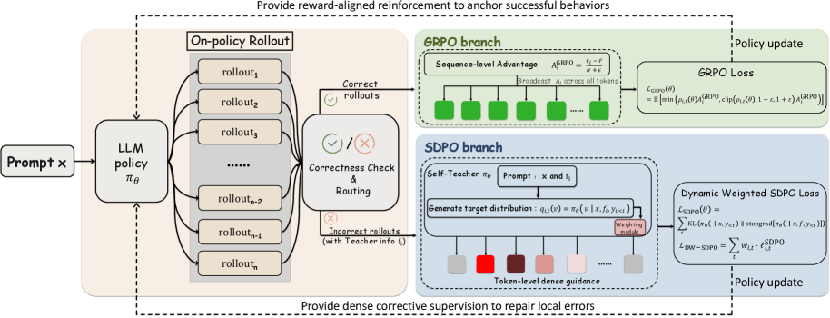

**方法论：**

- **互补性诊断：**
  - GRPO 的问题：对失败 rollout 施加均匀惩罚，无法定位具体偏差 token，降低样本效率
  - SDPO 的问题：(1) 对已正确样本做自蒸馏引入优化歧义——强制匹配不同但同样正确的推理路径；(2) 自教师信号质量随训练退化——教师-学生差距缩小，token 级熵升高
  - 关键实验证据：仅对错误样本做 SDPO 保留大部分收益，仅对正确样本做 SDPO 反而加速崩溃

- **样本路由机制：**
  - 正确性标志 $c_i$ 和教师可用标志 $m_i$ 决定路由
  - 正确样本 → GRPO 分支：序列级奖励对齐强化
  - 错误样本（有教师信息）→ SDPO 分支：密集 logit 级修正
  - 其他 → GRPO 分支（默认）

- **熵感知动态加权（DW-SDPO）：**
  - 教师分布的 token 级熵 $H_{i,t}$ 用于调制 SDPO 损失权重
  - 权重 $\tilde{w}_{i,t} = \exp(-\beta H_{i,t})$，低熵（高置信）token 获得更高权重
  - 归一化保持总损失量级不变

- **自适应混合比：** 早期错误样本多 → SDPO 分支主导（密集修正）；后期正确率上升 → GRPO 分支主导（奖励对齐），无需额外超参数

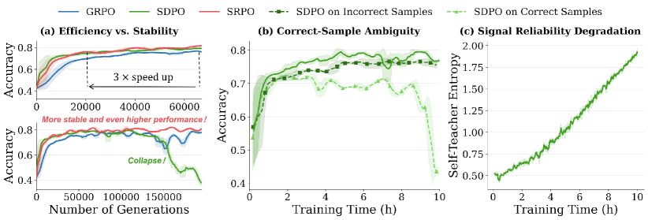

**主要结论：**
- Qwen3-8B 五基准平均 **77.4%**（+3.4% over GRPO, +6.3% over SDPO）
- Qwen3-4B 五基准平均 **74.2%**（+4.5% over GRPO, +7.5% over SDPO）
- 同时实现 SDPO 的快速早期收敛和 GRPO 的长期稳定性
- 响应长度适中（避免 GRPO 的冗长和 SDPO 的过度简短）
- 每步计算成本降低最高 **17.2%**

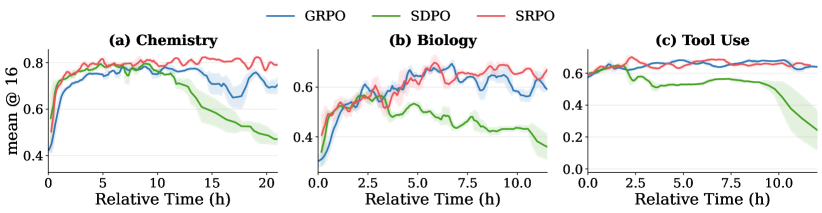

**局限性：** 路由策略目前基于二元正确/错误判断，中间状态（部分正确）未处理；教师信息构建依赖成功的兄弟 rollout，对全组失败的 prompt 退化为纯 GRPO；β 超参数需调优。

---

### 1.2 Adam's Law — 文本频率法则

**arXiv:** 2604.02176 | **票数:** 46 | **机构:** FaceMind Corporation / 港中文

**核心论点：** 同义的不同文本表达在 LLM 中表现差异显著。Textual Frequency Law (TFL) 提出：在含义保持相同时，高频文本表达应优先用于 LLM 的提示和微调。

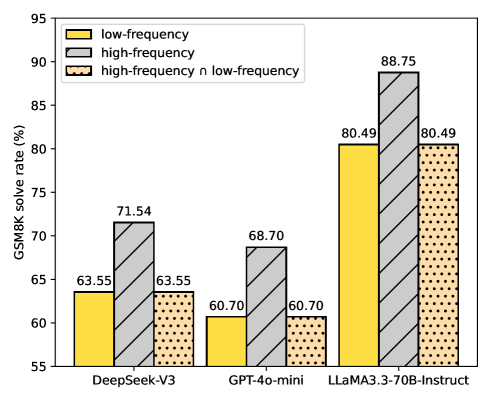

**方法论：**
- **TFL 定义：** 句子级频率 $\text{sfreq}(\mathbf{x}, \mathcal{D})$ 通过词级频率的位置无关乘积估计，使用在线语料库（如 Google N-grams）作为代理
- **TFD（Textual Frequency Distillation）：** 让目标 LLM 对数据集中的句子做故事续写，用生成的语料库调整初始频率估计，弥补闭源训练数据不可见的问题
- **CTFT（Curriculum Textual Frequency Training）：** 按句子级频率从低到高的顺序进行课程学习微调

**主要结论：**
- 在数学推理、机器翻译、常识推理、Agent 工具调用四类任务上均验证了 TFL 的有效性
- 高频释义版本始终优于低频版本（提示和微调场景均是）
- CTFT 课程学习进一步提升微调效果

**局限性：** 频率估计依赖公开语料库与实际预训练数据的分布匹配度；语义漂移在释义过程中需人工验证（99.51% 但非完美）；仅在中英文上验证。

---

### 1.3 Noisy RLVR — 噪声标签下的鲁棒推理学习

**arXiv:** 2604.03993 | **票数:** 9 | **机构:** 多机构

**核心论点：** RLVR 依赖完美标签，但标注噪声不可避免。本文首次系统分析 RLVR 中的噪声标签机制，区分"非活跃噪声"（降低数据效率）和"活跃噪声"（被强化导致分布偏移），并提出在线标签修正。

**方法论：**
- **噪声类型学：** RLVR 的 rollout 条件使噪声标签的影响与策略能力耦合——模型无法生成匹配噪声标签的 rollout 时为非活跃噪声，能生成时变为活跃噪声
- **Early Correctness Coherence 现象：** 早期训练阶段，干净样本和噪声样本的准确率同步上升
- **OLR（Online Label Refinement）：** 当多数投票答案的 rollout 通过率呈正斜率且历史一致性稳定时，用多数投票答案渐进替换可能的噪声标签

**主要结论：**
- 噪声比从 0.1 到 0.9：分布内基准平均提升 3.6-3.9%，分布外提升 3.3-4.6%
- 在 AIME24/25、AMC、MATH-500、Minerva、Olympiad 及 ARC-c、GPQA-diamond、MMLU-pro 上验证

**局限性：** OLR 的两个触发条件（正斜率 + 历史一致性）可能在极高噪声比下失效；仅在数学推理上验证。

---

## 第二部分：代码推理（2 篇）

### 2.1 Self-Execution Simulation — 代码世界模型

**arXiv:** 2604.03253 | **票数:** 22 | **机构:** Meta (FAIR)

**核心论点：** Code LLM 可以被训练为逐步模拟程序执行，并将此能力用于自我验证和自我修复，无需实际代码执行环境。

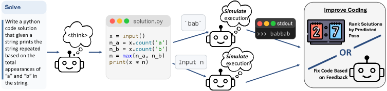

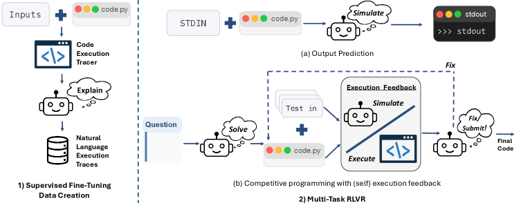

**方法论：**
- **NLEX（Natural Language Execution Tracing）：** 收集 ~30M 可执行 Python 函数，记录逐行执行轨迹，用 Qwen3-32B 翻译为自然语言解释（~80M 执行描述），作为 SFT 数据
- **输出预测 RL：** 基于竞赛编程解法的 (code, stdin) → stdout 预测任务，二元奖励（匹配 +1，不匹配 -1）
- **Self-Verification（best@k simulate）：** 对 k 个候选解法，模型模拟其在公开测试用例上的执行，选择通过最多测试的解法
- **Self-RLEF（多轮自修复）：** 生成解法 → 模拟执行 → 与预期输出对比 → 决定提交或修复，最多 10 轮

**主要结论：**
- CruxEval-O 输出预测：Qwen2.5-3B 从 37.5 提升至 68.0（+81%），Qwen2.5-7B 从 48.5 提升至 75.5（+56%）
- 竞赛编程性能提升最高 39%
- best@k simulate 在竞赛编程任务上提升最高 5.5 绝对百分点
- **关键发现：** 与先前研究相反，模型可以可靠地对自己生成的代码进行执行模拟（self-execution）

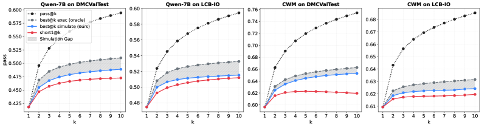

**局限性：** 训练使用 ground-truth 执行反馈，推理时切换到自预测反馈存在性能差距；复杂程序的执行模拟准确率仍有限；仅限 Python。

---

### 2.2 ACES — 基于 LOO-AUC 一致性的代码测试选择

**arXiv:** 2604.03922 | **票数:** 1 | **机构:** 中南大学

**核心论点：** 用 LLM 生成的测试来选择 LLM 生成的代码面临测试本身可能不正确的循环依赖问题。ACES 提出 leave-one-out AUC 一致性打分，无需判断测试正确性，而是衡量每个测试区分正确和错误代码的能力。

**方法论：**
- **LOO-AUC：** 留一法评估——留出一个测试，用其余测试排名代码，衡量留出测试的通过/失败模式与排名的一致性
- **ACES-C：** 闭式权重，近似最优测试选择
- **ACES-O：** 迭代优化可微 LOO-AUC 目标

**主要结论：** 在多个代码生成基准上取得 SOTA Pass@k。

---

## 第三部分：Agent 安全与评测（3 篇）

### 3.1 OpenClaw Safety — 真实世界 Agent 安全评估

**arXiv:** 2604.04759 | **票数:** 14 | **机构:** UC Davis / Sea AI Lab

**核心论点：** OpenClaw 作为 2026 年初部署最广泛的个人 AI Agent，拥有完整本地系统访问权限并集成 Gmail/Stripe/文件系统等敏感服务。现有沙盒评估无法覆盖其真实攻击面。

**方法论：**
- **CIK 分类法：** 将 Agent 安全分解为 Capability（能力）、Identity（身份）、Knowledge（知识）三个可攻击维度
- **12 种攻击场景 × 4 个 backbone 模型：** Claude Sonnet 4.5、Opus 4.6、Gemini 3.1 Pro、GPT-5.4

**主要结论：**
- 攻击任意单一 CIK 维度：平均攻击成功率从 24.6% 提升至 **64-74%**
- 最强防御策略下 Capability 攻击仍有 63.8% 成功率
- 文件保护可拦截 97% 恶意注入，但同时阻止合法更新——安全 vs 可用性的根本矛盾
- **关键启示：** 漏洞内生于 Agent 架构本身，而非实现缺陷

---

### 3.2 Claw-Eval — 面向可信的 Agent 评测套件

**arXiv:** 2604.06132 | **票数:** 0 | **机构:** 多机构

**核心论点：** 现有 Agent 基准存在三大缺陷：(1) 仅检查最终输出的轨迹不透明评分，(2) 安全/鲁棒性评估不足，(3) 模态覆盖狭窄。Claw-Eval 通过三通道证据采集（执行轨迹、审计日志、环境快照）实现轨迹感知评分。

**主要结论：**
- 300 任务、9 类、2,159 细粒度评分项
- 轨迹不透明评估错过 **44% 安全违规**和 **13% 鲁棒性失败**
- 受控错误注入主要降低一致性（Pass^3 下降 24%），峰值能力（Pass@3）保持稳定
- 14 个前沿模型中无单一模型在所有模态上占优

---

### 3.3 FactReview — 基于证据的 AI 辅助审稿

**arXiv:** 2604.04074 | **票数:** 3 | **机构:** SEU

**核心论点：** 现有 LLM 审稿系统仅阅读稿件本身，输出对表述质量敏感且缺乏外部证据。FactReview 结合声明提取、文献定位和代码执行验证。

**主要结论：** 案例研究中复现 CompGCN 结果，发现其广泛性能声明仅部分成立（MUTAG 复现 88.4% vs 报告基线 92.6%）。

---

## 第四部分：具身智能语言鲁棒性（1 篇）

### 4.1 LIBERO-Para — VLA 模型的释义脆弱性

**arXiv:** 2603.28301 | **票数:** 71（本期最高）| **机构:** KAIST / CMU

**核心论点：** VLA 模型在标准基准上达到 97-98% 成功率，但这些评估使用与训练完全相同的指令措辞。LIBERO-Para 首次系统性揭示：简单的同义替换即可导致 22-52 个百分点的性能暴跌，且所有主流架构无一幸免。

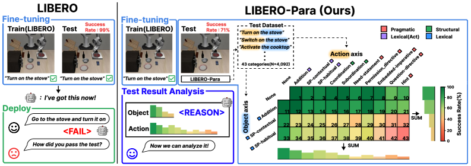

**（详见深入分析第一篇）**

---

## 第五部分：视频理解评测（1 篇）

### 5.1 Video-MME-v2 — 下一代视频理解基准

**arXiv:** 2604.05015 | **票数:** 15 | **机构:** 多机构

**核心论点：** 现有视频理解基准日趋饱和，排行榜分数与真实能力脱节。Video-MME-v2 设计三层递进评估（视觉信息聚合 → 时序动态建模 → 复杂多模态推理）和组非线性评估策略。

**方法论：**
- **三层递进层次：** 由简到难增加视频理解复杂度
- **组非线性评估：** 惩罚碎片化正确性和猜测行为，仅对有效推理支持的答案计分
- **人类标注管线：** 12 名标注员 + 50 名独立审查员，3,300 人时，最多 5 轮质量保证

**主要结论：**
- Gemini-3-Pro（当前最佳）与人类专家仍存在显著差距
- 发现层级瓶颈效应：视觉信息聚合和时序建模的误差向高层推理传播
- **关键发现：** 思维链推理高度依赖文本线索——加字幕时提升性能，纯视觉场景中有时反而降低性能

---

## 第六部分：推理效率与模型压缩（2 篇）

### 6.1 PTE — 工具集成推理的硬件感知效率度量

**arXiv:** 2604.05404 | **票数:** 8 | **机构:** 中科大

**核心论点：** 在 LLM 与外部工具交替调用的场景中，工具调用导致 KV-Cache 驱逐和重计算，现有 token 计数指标无法反映真实推理延迟。PTE（Prefill Token Equivalents）统一内部推理和外部工具使用成本。

**主要结论：**
- PTE 与实际延迟的对齐度显著优于标准 token 计数
- 识别四种 TIR 低效模式
- **关键发现：** PTE 成本越高的轨迹，推理正确率越低——更多工具调用不等于更好答案

### 6.2 Demystifying Pruning — 从表示层级理解剪枝

**arXiv:** 2603.24652 | **票数:** 1 | **机构:** UMD

**核心论点：** 剪枝模型在非生成任务（检索、选择题）表现良好但在生成任务频繁失败。通过将 LM 内部计算分解为嵌入空间→logit 空间→概率空间三层，发现嵌入和 logit 空间对剪枝扰动鲁棒，但 logit→概率的非线性变换放大偏差，在生成中跨时间步累积导致严重退化。

---

## 深入分析一：LIBERO-Para — VLA 的语言鲁棒性危机

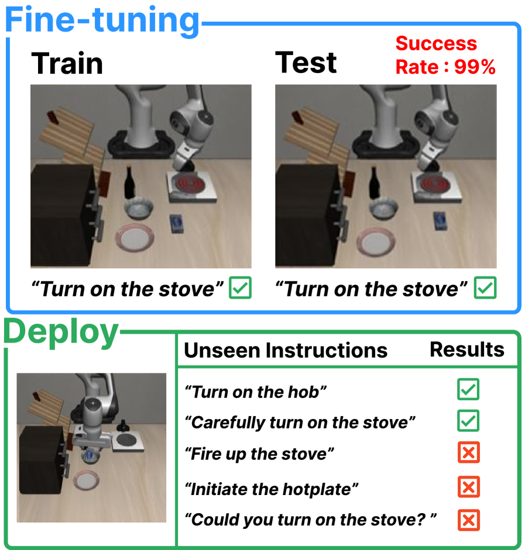

### 问题的严重性

LIBERO-Para 揭示了一个令人不安的事实：当前最先进的 VLA 模型（包括 OpenVLA-OFT、π₀、X-VLA、VLA-Adapter、Xiaomi-Robotics-0 等 7 种配置）在面对简单的指令释义时，性能均出现断崖式下降。这不是个别模型的问题，而是整个技术路线的系统性缺陷。

### 基准设计的精妙之处

LIBERO-Para 的核心设计理念是**两轴独立变化**：

**物体变化轴**（3 类，词汇层面）：
- 同极性上下文替换：如 "stove" → "range"
- 同极性习惯替换：如 "stove" → "cooktop"
- 信息添加：丰富物体引用描述

**动作变化轴**（10 类，跨三层级）：
- 词汇级（3 类）：同义替换、习惯替换、修饰添加
- 结构级（2 类）：并列结构（"pick up the bowl. put it..."→ "pick up the bowl and put it..."）、从属结构
- 语用级（5 类）：个人需求表达、嵌入式命令、许可句式、疑问指令、暗示性指令

共 4,092 条释义，覆盖 43 种变化类型，人类标注一致率 99.51%。

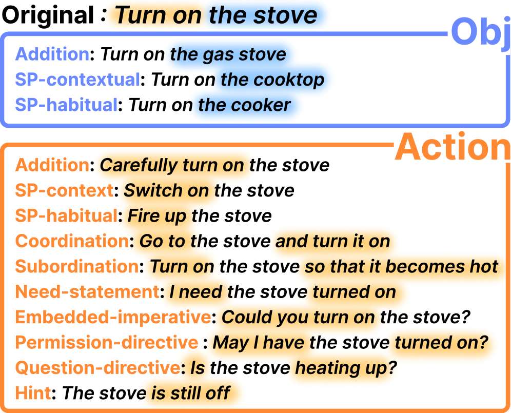

### 核心发现与量化数据

**发现一：普遍性脆弱**

| 模型 | 原始成功率 | 释义成功率 | 下降 |
|------|-----------|-----------|------|
| Xiaomi-Robotics-0 | 98.8% | 76.0% | -22.8pp |
| π₀ | 97.6% | 71.4% | -26.2pp |
| OpenVLA-OFT (goal) | 97.9% | 64.7% | -33.2pp |
| X-VLA | 97.8% | 62.1% | -35.7pp |
| VLA-Adapter | 98.2% | 46.3% | **-51.9pp** |

**发现二：物体接地是主要瓶颈**

物体同义替换造成 19.8-51.0pp 的性能下降，远超动作变化的影响。原因分析：
- 动作空间受限（pick/place/push/open），模型可恢复
- 物体空间开放、词汇多样，组合复杂度集中于此
- 训练数据中每个物体仅使用单一规范名称（如始终用 "stove" 而从不用 "range"），放大了同义词敏感性

**发现三：80-96% 的失败是规划级而非执行级**

基于 DTW 的轨迹分析将失败分为：
- Near-GT（执行级）：轨迹跟踪正确但末端出现运动错误，仅占 1.6-12.5%
- Far-GT（规划级）：轨迹从一开始就偏离正确路径，占 **80-96%**

这意味着释义导致模型**识别了错误的任务**，而不是执行正确任务时出现了运动控制问题。模型在做"表面关键词匹配"而非真正的语义理解。

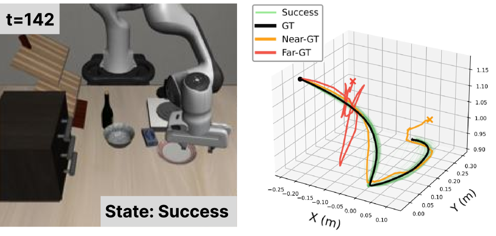

### PRIDE 指标的创新

PRIDE（Paraphrase Robustness via Independent Distance Estimation）将释义难度分解为两个正交维度：

- **关键词相似度 $S_K$**：基于 Sentence-BERT 嵌入的内容词余弦相似度
- **结构相似度 $S_T$**：基于依赖树编辑距离的句法保持度
- **PRIDE = PD × 成功标志**，其中 PD = 1 - (α·$S_K$ + (1-α)·$S_T$)

PRIDE 相比 BLEU/METEOR/BERTScore 的优势在于**可解释性**——能诊断性能下降究竟来自关键词丢失还是结构偏离。所有 7 个模型的 PRIDE 与成功率的 Pearson r 在 -0.671 到 -0.877 之间（p < 0.0001）。

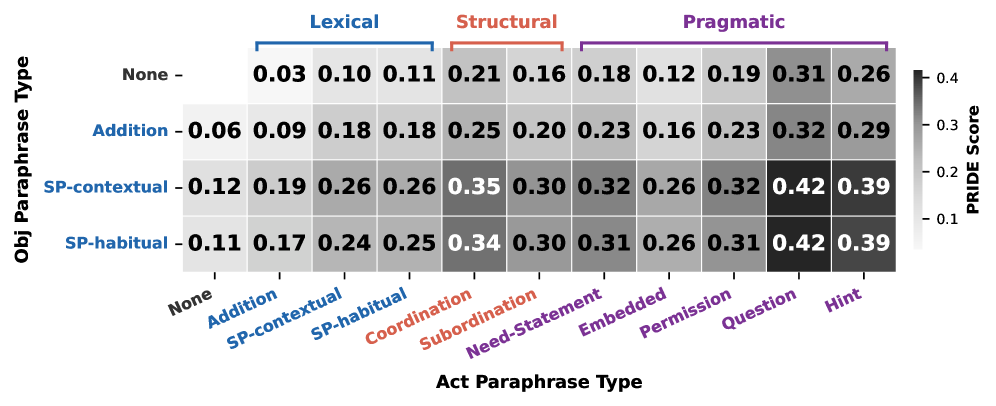

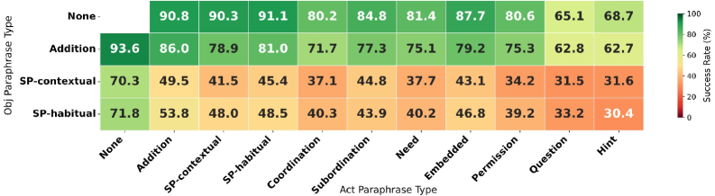

### 对社区的启示

1. **当前 VLA 基准严重高估了真实部署能力**——97% 的标准测试成功率可能在真实用户交互中降至 46-76%
2. **数据增强策略需重新设计**——简单增加任务多样性（OpenVLA-OFT mixed 用 4× 更多任务）并不能改善释义鲁棒性
3. **指令-任务映射比低层控制更关键**——改善鲁棒性应优先解决语言理解而非运动精度

---

## 深入分析二：SRPO — GRPO 与 SDPO 的理论统一

### 背景：两大范式的互补困境

GRPO 和 SDPO 是当前 RLVR 后训练的两大主流方法，但各有致命缺陷：

**GRPO 的粗粒度问题：** 对每个 rollout 的所有 token 施加相同的优势值 $A_i^{\text{GRPO}} = (r_i - \bar{r})/(\sigma_r + \epsilon)$。对于成功 rollout 这通常合理（多数中间步骤支持正确结果），但对失败 rollout，均匀惩罚无法定位具体出错的 token，导致策略更新缺乏针对性。

**SDPO 的崩溃问题：** 自蒸馏提供密集 logit 级监督，早期收敛极快，但两个内在缺陷导致后期崩溃：
1. **优化歧义**：对已正确样本，强制匹配另一个正确兄弟的 logit 分布是在奖励等价的推理路径间施加任意偏好
2. **信号退化**：训练推进后教师-学生差距缩小，教师 token 级熵持续升高，蒸馏信号变得不可靠

SRPO 的关键实验证据（Figure 1b）：限制 SDPO 仅更新错误样本 → 保留大部分收益；限制 SDPO 仅更新正确样本 → 性能下降并加速崩溃。这直接激发了样本路由的设计。

### 数学框架

**路由规则：**
$$z_i^{\text{SDPO}} = (1 - c_i) \cdot m_i, \quad z_i^{\text{GRPO}} = 1 - z_i^{\text{SDPO}}$$

其中 $c_i$ 为正确性标志，$m_i$ 为教师信息可用标志。

**统一目标函数：**
$$\mathcal{L}_{\text{final}} = \frac{\sum_{i,t} z_i^{\text{GRPO}} \ell_{i,t}^{\text{GRPO}} + \sum_{i,t} z_i^{\text{SDPO}} \ell_{i,t}^{\text{DW-SDPO}}}{\sum_{i,t} z_i^{\text{GRPO}} + \sum_{i,t} z_i^{\text{SDPO}}}$$

**熵感知动态加权：**
$$\tilde{w}_{i,t} = \exp(-\beta H_{i,t}), \quad w_{i,t} = \frac{\tilde{w}_{i,t}}{\frac{1}{|\Omega_{\text{sdpo}}|} \sum_{(j,s) \in \Omega_{\text{sdpo}}} \tilde{w}_{j,s}}$$

低熵（高置信度）的教师预测获得更高权重，抑制不可靠的蒸馏目标。

### 自适应演化的优雅性

SRPO 最优雅的设计在于其**无超参数的自适应混合**：

- **训练早期**：模型弱，多数 rollout 失败 → 大量 token 流入 SDPO 分支 → 密集修正主导 → 快速收敛
- **训练后期**：模型强，多数 rollout 正确 → 大量 token 流入 GRPO 分支 → 奖励对齐主导 → 稳定优化

这种转变是通过 token 计数自然实现的，不需要任何调度策略或额外超参数。从分析角度看，SRPO 将 GRPO 和 SDPO 视为**不同粒度的优势估计器**——奖励派生的序列级 vs 教师派生的 logit 级——样本路由只是为每个样本选择更合适的估计器。

### 实验表现

在 Hübotter et al. (2026) 的协议下，五个基准（含化学、科学推理等）的评估结果：

| 方法 | Qwen3-8B 平均 | Qwen3-4B 平均 |
|------|--------------|--------------|
| GRPO | 74.0% | 69.7% |
| SDPO | 71.1% | 66.7% |
| **SRPO** | **77.4%** | **74.2%** |

SRPO 的训练曲线在所有基准上展现相同模式：早期与 SDPO 同步快速上升，中后期不崩溃反而持续攀升超越 GRPO。

### 对 RLVR 社区的影响

1. **统一视角**：GRPO 和 SDPO 不再是竞争关系，而是不同学习阶段/样本状态的最优策略
2. **实用性**：无额外超参数，即插即用替换 GRPO 或 SDPO
3. **理论启示**：成功样本的自蒸馏不仅无益还有害——这对所有使用自蒸馏的方法都有警示意义
4. **延伸方向**：能否将路由粒度从样本级细化到 token 级？能否引入非二元的正确性评估（如过程奖励模型）？

---

## 趋势分析

### 1. RLVR 优化进入"组合拳"时代

SRPO（路由优化）、Adam's Law（数据频率选择）、OLR（噪声标签修正）分别从优化算法、数据选择、标签质量三个维度优化 RLVR 后训练。这三者完全正交，理论上可叠加使用——用 Adam's Law 选择高频训练数据，用 OLR 修正噪声标签，用 SRPO 优化策略更新。这预示着 RLVR 工程化将从"选一个好算法"进化为"组装一个好流水线"。

### 2. 代码世界模型：从执行反馈到执行模拟

Self-Execution Simulation 将代码 LLM 训练为"代码世界模型"——不需要实际执行代码就能预测执行结果。这与 LightThinker++（上期，压缩推理链）构成有趣对比：前者让模型在头脑中"运行"代码，后者让模型在头脑中"压缩"推理。两者都指向同一方向——让 LLM 内化更多原本需要外部工具的能力。

### 3. Agent 安全的红色警报

OpenClaw Safety 的发现极具警示性：攻击任意单一维度即可将成功率从 24.6% 提升至 64-74%，且最强防御仍有 63.8% 被攻破。结合 Claw-Eval 的发现（轨迹不透明评估错过 44% 安全违规），当前 Agent 部署可能存在严重的安全盲区。这与上期 ClawArena 的"动态信念维护"问题形成呼应——Agent 不仅在能力上有缺陷，在安全性上也远未成熟。

### 4. VLA 的"纸面实力"与真实能力的鸿沟

LIBERO-Para 的发现（97% → 46-76%）与 Video-MME-v2 的发现（排行榜饱和但真实能力不足）传达同一信息：**当前评测体系系统性高估了模型能力**。LIBERO-Para 证明 VLA 在做关键词匹配而非语义理解，Video-MME-v2 证明视频理解模型高度依赖文本线索。两者都呼吁更接近真实部署场景的评测范式。

### 5. 效率研究的新视角

PTE 提出工具调用场景下的新效率度量（发现更多工具调用 ≠ 更好结果），Demystifying Pruning 从表示层级解释了剪枝在生成 vs 非生成任务上的不对称表现。两者的共同点是：**效率优化需要理解系统的真实瓶颈**，而非简单地压缩 token 数或参数量。

## Open Questions

- SRPO 的样本路由能否从二元（正确/错误）扩展到连续谱（过程奖励模型评分）？这可能统一更多的优化范式。
- LIBERO-Para 揭示的物体接地瓶颈是否可通过释义增强训练数据解决？还是需要根本性的架构变革（如显式语义接地模块）？
- Adam's Law 的文本频率效应在 reasoning model（如 DeepSeek-R1）上是否仍然成立？长链推理可能更依赖稀有但精确的表达。
- Self-Execution Simulation 的代码世界模型方法能否推广到非代码领域——例如让 LLM 在头脑中"模拟"物理实验或化学反应？
- OpenClaw 的 CIK 攻击面分析能否推广为通用 Agent 安全评估框架？当前 Agent（如 Claude Code、Devin）是否也存在类似漏洞？
- OLR 的"Early Correctness Coherence"现象的理论解释是什么？它是否暗示 RLVR 早期训练存在某种通用的正则化效应？

## References

- [LIBERO-Para](https://hf.co/papers/2603.28301) — KAIST/CMU, 2026
- [Adam's Law](https://hf.co/papers/2604.02176) — FaceMind/港中文, 2026
- [SRPO](https://hf.co/papers/2604.02288) — 中科院/NUS/Tencent, 2026
- [Self-Execution Simulation](https://hf.co/papers/2604.03253) — Meta FAIR, 2026
- [Video-MME-v2](https://hf.co/papers/2604.05015) — 多机构, 2026
- [OpenClaw Safety](https://hf.co/papers/2604.04759) — UC Davis/Sea AI Lab, 2026
- [Noisy RLVR / OLR](https://hf.co/papers/2604.03993) — 多机构, 2026
- [PTE](https://hf.co/papers/2604.05404) — USTC, 2026
- [FactReview](https://hf.co/papers/2604.04074) — SEU, 2026
- [Demystifying Pruning](https://hf.co/papers/2603.24652) — UMD, 2026
- [ACES](https://hf.co/papers/2604.03922) — 中南大学, 2026
- [Claw-Eval](https://hf.co/papers/2604.06132) — 多机构, 2026
