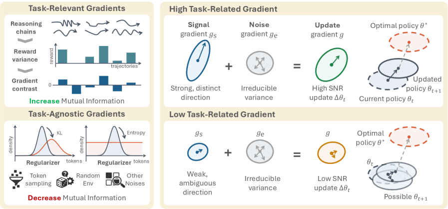
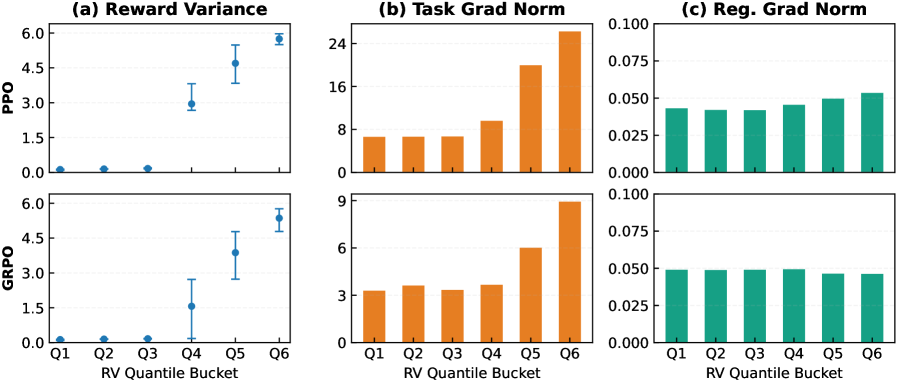
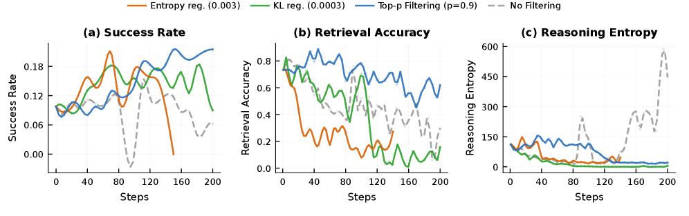
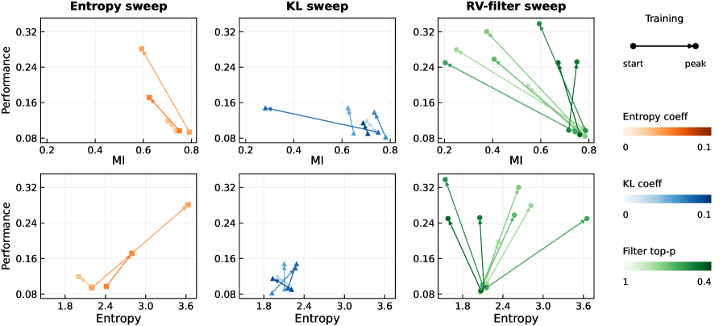
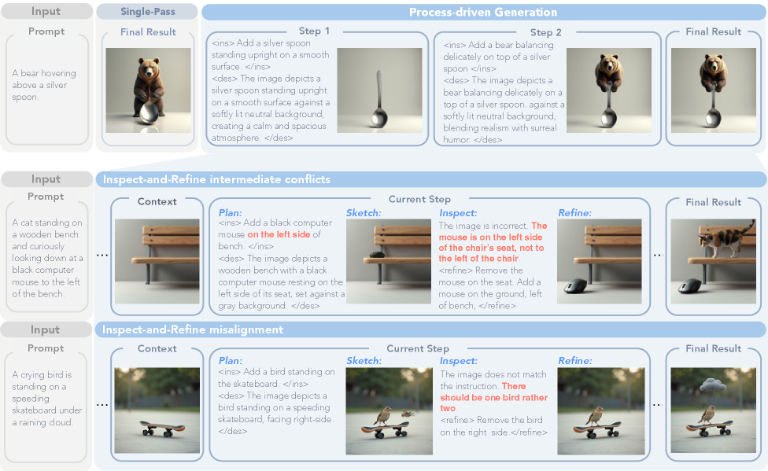
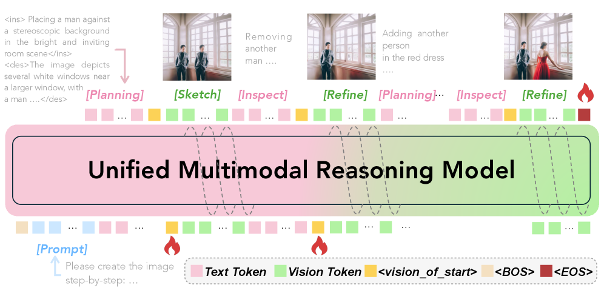
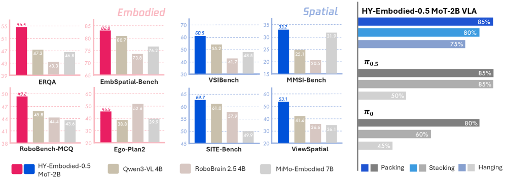
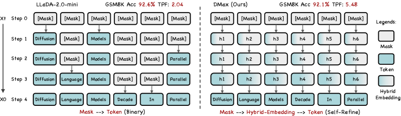

# Hugging Face Daily Papers Digest: 2026-04-09 ~ 04-10

- **Date:** 2026-04-10
- **Tags:** #daily-papers #huggingface #agent-skills #reasoning-collapse #agentic-RL #process-generation #embodied-AI #inference-efficiency #style-transfer

## Context

本文对 2026 年 4 月 9-10 日 Hugging Face Daily Papers 上榜的 33 篇新论文进行系统梳理（已排除 4/7-8 期覆盖的论文）。本期论文呈现四条鲜明主线：

1. **Agent 技能系统的进化与评估** — SkillClaw 提出跨用户技能集体进化，Graph of Skills / Combee / Externalization 从不同角度构建 Agent 能力体系，ClawBench / KnowU-Bench 提供真实世界评测
2. **Agentic RL 中的推理崩塌** — RAGEN-2 用信息论框架揭示 template collapse 这一隐蔽失败模式
3. **生成模型的精细控制** — Think in Strokes 开创过程驱动图像生成，NUMINA 解决文本到视频的数量对齐，MegaStyle 构建大规模风格数据集
4. **推理训练的泛化性反思** — Rethinking Generalization 条件性分析 SFT vs RL 的泛化能力

## 论文总览

### 4 月 10 日上榜（16 篇）

| 排名 | 论文 | 票数 | 机构 | 领域 |
|------|------|------|------|------|
| 1 | SkillClaw | 99 | AMAP-ML | Agent 技能进化 |
| 2 | NUMINA | 84 | HUST / 浙大 | T2V 数量对齐 |
| 3 | HY-Embodied-0.5 | 53 | Tencent Hunyuan | 具身基础模型 |
| 4 | MegaStyle | 51 | 同济 / Tencent / NTU | 风格数据集 |
| 5 | Rethinking SFT Generalization | 37 | AI45Research | 推理 SFT 泛化 |
| 6 | ClawBench | 29 | UBC / Vector / Waterloo | Agent 真实评测 |
| 7 | KnowU-Bench | 29 | 多机构 | 个性化手机 Agent |
| 8 | Externalization in LLM Agents | 29 | 上交 / 中山大 / CMU | Agent 系统综述 |
| 9 | LPM 1.0 | 26 | 多机构 | 视频角色表演 |
| 10 | OpenSpatial | 23 | 多机构 | 空间智能数据 |
| 11 | Act Wisely (HDPO) | 22 | 多机构 | 工具使用元认知 |
| 12 | DMax | 21 | NUS | 扩散语言模型加速 |
| 13 | Graph of Skills | 15 | 多机构 | Agent 技能检索 |
| 14 | OmniJigsaw | 12 | 多机构 | 多模态时序推理 |
| 15 | OpenVLThinkerV2 | 9 | 多机构 | 多模态推理 |
| 16 | OmniBehavior | 8 | 多机构 | 行为模拟评测 |

### 4 月 9 日上榜（17 篇）

| 排名 | 论文 | 票数 | 机构 | 领域 |
|------|------|------|------|------|
| 1 | Think in Strokes | 54 | Meta / UCSD | 过程驱动图像生成 |
| 2 | RAGEN-2 | 46 | Northwestern / Stanford | Agentic RL 推理崩塌 |
| 3 | MARS | 26 | 多机构 | 多 Token 生成 |
| 4 | SEVerA | 23 | UIUC | 验证式自进化 Agent |
| 5 | Combee | 22 | 多机构 | Agent Prompt 学习 |
| 6 | INSPATIO-WORLD | 21 | InSpatio Team | 实时 4D 世界模拟 |
| 7 | Neural Computers | 14 | 多机构 | 计算范式理论 |
| 8 | Sol-RL (FP4+BF16) | 11 | 多机构 | 扩散模型 RL 加速 |
| 9 | TC-AE | 10 | 多机构 | 深度压缩自编码器 |
| 10 | Graph-Based CoT Pruning | 7 | 多机构 | CoT 推理精简 |
| 11 | FlowInOne | 6 | 多机构 | 多模态统一生成 |
| 12 | Personalized RewardBench | 6 | 多机构 | 个性化奖励评测 |
| 13 | Beyond Hard Negatives | 5 | 多机构 | 知识蒸馏检索 |
| 14 | Fast Spatial Memory | 4 | 多机构 | 4D 弹性测试训练 |
| 15 | AgentGL | 4 | 多机构 | 图学习 Agent |
| 16 | The Depth Ceiling | 4 | 多机构 | LLM 潜在规划上限 |
| 17 | DeonticBench | 4 | 多机构 | 规则推理评测 |

---

## 第一部分：Agent 技能系统的进化与评估（6 篇）

本期最突出的主题。从 SkillClaw 的集体进化到 Graph of Skills 的依赖感知检索，再到 Externalization 的系统性综述，Agent 技能管理正在从静态部署走向动态演化。

### 1.1 SkillClaw — 多用户 Agent 技能集体进化 ⭐

**arXiv:** 2604.08377 | **票数:** 99（本期最高）| **机构:** AMAP-ML
**代码:** [GitHub](https://github.com/AMAP-ML/SkillClaw)

**核心论点：** LLM Agent（如 OpenClaw）依赖可复用技能执行复杂任务，但技能在部署后保持静态——类似的工作流、工具使用模式和失败模式在用户间被反复重新发现。SkillClaw 提出通过聚合多用户交互轨迹实现技能的**自主集体进化**。

**方法论：**

- **轨迹聚合（Trajectory Aggregation）：** 持续收集多用户在使用过程中产生的交互轨迹
- **自主进化器（Agentic Evolver）：** 处理聚合数据以识别反复出现的行为模式，自动将其转化为技能更新：
  - 精炼（Refine）现有技能
  - 扩展（Extend）新能力
- **共享技能仓库（Shared Repository）：** 在所有用户间同步维护技能，更新无需用户额外操作
- **跨用户知识迁移：** 一个用户场景中发现的改进自动传播到全系统

**主要结论：**
- 在 WildClawBench 上，使用 Qwen3-Max 的有限交互和反馈即可显著提升 Agent 性能
- 实现了"用得越多越好用"的正向飞轮效应
- 无需人工干预，技能库随使用自动改善

**启示：** 这是 Agent 系统从"部署即冻结"到"持续进化"的重要一步。类比传统软件的 CI/CD，SkillClaw 建立了 Agent 技能的"持续改进"管道。与 Graph of Skills（1.3）和 Externalization（1.5）形成互补视角。

---

### 1.2 ClawBench — 真实世界在线任务评测

**arXiv:** 2604.08523 | **票数:** 29 | **机构:** UBC / Vector Institute / Waterloo

**核心论点：** 现有 Agent 评测多在离线沙箱中进行，而 ClawBench 直接在 **144 个真实线上平台** 评测 AI Agent 完成日常任务的能力。

**数据集：**
- 153 个简单但真实的日常任务，跨 15 个类别（购物、预约、求职申请等）
- 轻量级拦截层捕获并阻止最终提交请求，确保安全评测
- 任务需要：从用户文档提取信息、跨平台多步工作流、表单填写等

**主要结论：**
- 7 个前沿模型测试结果表明，开源与闭源模型仅能完成约 30-40% 的任务
- 关键瓶颈：多步规划、表单细节准确度、跨平台适应性

---

### 1.3 Graph of Skills — 依赖感知的技能检索

**arXiv:** 2604.05333 | **票数:** 15 | **机构:** 多机构

**核心论点：** 当 Agent 技能库增长到 200-2000 个时，传统检索方法（基于描述相似度）效率急剧下降。本文将技能间的依赖关系建模为**图结构**，实现依赖感知的推理时检索。

**主要结论：**
- 奖励提升 **43.6%**，同时 Token 消耗减少 **37.8%**
- 图结构让 Agent 能在 2000 技能库中精准定位所需组合

---

### 1.4 Combee — 可扩展的 Prompt 学习

**arXiv:** 2604.04247 | **票数:** 22 | **机构:** 多机构

**核心论点：** Agent 自我改进通常依赖 prompt 学习，但现有方法扩展性差。Combee 通过并行扫描和动态批量控制实现可扩展的 prompt 学习。

**主要结论：** 最高 **17x 加速**，同时保持学习质量。

---

### 1.5 Externalization in LLM Agents — Agent 外部化系统综述

**arXiv:** 2604.08224 | **票数:** 29 | **机构:** 上海交大 / 中山大学 / CMU / OPPO

**核心论点：** LLM Agent 的进步越来越不是来自改变模型权重，而是来自**重组运行时基础设施**。本文提出统一框架分析四个外部化维度：

1. **记忆（Memory）：** 跨时间外部化状态 → 选择性检索取代长程上下文
2. **技能（Skills）：** 外部化程序性专长 → 可复用过程取代重复合成
3. **协议（Protocols）：** 外部化交互结构 → 机器可读契约取代临时协调
4. **Harness：** 统一协调层，提供编排逻辑、约束、可观测性和反馈回路

**历史演进：** Weights → Context → Harness 三层外部化转型

**启示：** 这篇综述为理解 SkillClaw、Graph of Skills 等工作提供了系统性理论框架。Agent 工程正在从"提示工程"升级为"Harness 工程"。

---

### 1.6 KnowU-Bench — 个性化手机 Agent 评测

**arXiv:** 2604.08455 | **票数:** 29 | **机构:** 多机构

**核心论点：** 评测个性化手机 Agent 在 GUI 环境中推断用户偏好和主动提供帮助的能力。填补了 Agent 个性化能力评测的空白。

---

## 第二部分：Agentic RL 训练与推理优化（4 篇）

### 2.1 RAGEN-2 — Agentic RL 中的推理崩塌 ⭐

**arXiv:** 2604.06268 | **票数:** 46 | **机构:** Northwestern / Stanford / Microsoft / Imperial College
**项目页面:** [ragen-ai.github.io/v2](https://ragen-ai.github.io/v2/)

**核心论点：** 多轮 LLM Agent RL 训练中存在一种隐蔽的失败模式——**Template Collapse（模板崩塌）**：Agent 的推理在单个输入内看起来多样（高条件熵 $H(Z|X)$），但在不同输入间变得**输入无关**（低互信息 $I(X;Z)$）。标准的 entropy 监控指标完全无法检测到这种崩塌。

**方法论：**

- **信息论分解：** 标准熵 $H(Z) = I(X;Z) + H(Z|X)$
  - $H(Z|X)$ = 条件熵（within-input 多样性），标准 entropy 监控只看这个
  - $I(X;Z)$ = 互信息（cross-input 依赖性），template collapse 就是这个指标崩塌
  - **关键洞察：** Entropy 监控指标可能保持健康甚至改善，但 MI 已经崩塌

- **MI 代理指标构建（In-Batch Cross-Scoring）：**
  - 对 batch 内所有 $(Z_{i,k}, X_j)$ 对计算 teacher-forced log-likelihood
  - **Retrieval-Acc**（离散）：真实输入在所有候选中排第一的比例；崩塌时趋近 $1/P$
  - **MI-ZScore-EMA**（连续）：匹配分数与边际分数的归一化差值，EMA 稳定

- **信噪比（SNR）机制：** 解释 collapse 的根因
  - 任务梯度上界：$\|g_{\text{task}}(x)\| \leq \sqrt{\text{Var}(R|X=x)} \cdot \mathbb{E}[\|s(z;x)\|^2|X=x]$
  - 当 prompt 内奖励方差低时 → 任务梯度弱 → KL/entropy 正则项主导 → 策略趋向输入无关
  - 三分量分解：$g_{\text{signal}}$（有意义奖励差异）+ $g_{\text{task-noise}}$（采样随机性）+ $g_{\text{reg}}$（均匀正则化，输入无关）

- **SNR-Aware Filtering：**
  - 每次迭代计算各 prompt 的 within-prompt reward variance
  - 按方差降序排列，保留 top-p 前缀（累积方差 ≥ $\rho \cdot \sum_i \text{Var}(R|X_i)$）
  - 仅在保留的高 SNR prompt 上执行参数更新

**主要结论：**

| 指标 | 数值 |
|------|------|
| Sokoban 提升 | +16.0% |
| FrozenLake 提升 | +10.9% |
| MI 与性能相关性 | +0.39 (Spearman) |
| Entropy 与性能相关性 | -0.11 ~ -0.14（负相关！）|
| RV 计算开销 | <0.1% 每步 |
| 过滤带来的计算节省 | 26-41% |

- 跨算法一致（PPO / DAPO / GRPO / Dr. GRPO）
- 跨模型规模一致（0.5B ~ 7B）
- 跨模态一致（文本 + 图像，Qwen2.5-VL）

**局限性：** SNR 分解假设任务噪声可分离；仅限单 Agent；奖励方差过滤可能被策略刻意膨胀。

**启示：** 这是继上期 SRPO 之后，又一篇对 RLVR 训练动态的深刻分析。如果说 SRPO 解决了"如何高效利用正确/错误样本"，RAGEN-2 则揭示了"为什么看起来正常的训练实际上已经崩塌"。MI 代理指标和 SNR-Aware Filtering 对任何做 agentic RL 的团队都有直接实用价值。

---

### 2.2 Rethinking Generalization in Reasoning SFT

**arXiv:** 2604.06628 | **票数:** 37 | **机构:** AI45Research
**代码:** [GitHub](https://github.com/Nebularaid2000/rethink_sft_generalization)

**核心论点：** "SFT 记忆、RL 泛化"的主流叙事过于简化。推理 SFT 的跨域泛化是**有条件的**，取决于三个因素：

1. **优化动态：** 跨域性能先降后升（Dip-and-Recovery），早期 checkpoint 会低估泛化
2. **数据质量：** 低质量解题路径全面伤害泛化；验证过的长 CoT traces 带来一致跨域收益
3. **模型能力：** 强模型内化可迁移的程序模式（如回溯），弱模型只模仿表面冗长

**关键发现：** 推理能力改善的同时安全性下降——存在不对称泛化。

---

### 2.3 SEVerA — 验证式自进化 Agent

**arXiv:** 2603.25111 | **票数:** 23 | **机构:** UIUC

将形式化规范与软目标结合，通过 Formally Guarded Generative Models 实现安全的 agentic 代码生成，**零约束违反**同时提升性能。

---

### 2.4 Act Wisely (HDPO) — 工具使用元认知

**arXiv:** 2604.08545 | **票数:** 22 | **机构:** 多机构

HDPO 框架使 Agent 能判断何时使用工具 vs 依赖内部知识——通过解耦优化实现"工具使用的元认知"。

---

## 第三部分：生成模型的精细控制（5 篇）

### 3.1 Think in Strokes — 过程驱动图像生成

**arXiv:** 2604.04746 | **票数:** 54 | **机构:** Meta Superintelligence Labs / UCSD / WPI / Northwestern

**核心论点：** 人类画画是渐进式的——规划布局、粗绘草稿、检查、精炼细节，每一步都基于当前视觉状态。本文首次提出**过程驱动图像生成（Process-Driven Image Generation）**，将生成分解为交替的思考-行动轨迹。

**方法论：** 每次迭代包含 4 个阶段：
1. **Textual Planning** — 规划视觉状态如何演进
2. **Visual Drafting** — 生成视觉中间态
3. **Textual Reflection** — 基于当前视觉状态反思并定位问题
4. **Visual Refinement** — 修正并精化

关键挑战在于中间状态的歧义性。论文通过 **dense step-wise supervision** 解决：对视觉中间态约束空间和语义一致性，对文本中间态保留先验视觉知识同时识别 prompt-violating 元素。

**启示：** 这是"slow thinking"理念从推理扩展到生成的自然延伸——图像生成不再是一步到位，而是可解释、可调试的渐进过程。

---

### 3.2 NUMINA — 文本到视频数量对齐

**arXiv:** 2604.08546 | **票数:** 84 | **机构:** HUST / 浙大 / Afari
**代码:** [GitHub](https://github.com/H-EmbodVis/NUMINA)

**核心论点：** T2V 扩散模型无法正确生成 prompt 中指定数量的物体。NUMINA 发现注意力机制中蕴含物体实例的关键信息，提出 **training-free** 的 identify-then-guide 框架。

**两阶段方法：**
- **Phase 1（识别）：** 选择最佳自注意力头（前景-背景分离度、结构丰富度、边缘清晰度三指标），构建可计数布局
- **Phase 2（引导）：** 对比检测数量与目标数量，通过 cross-attention bias 调制实现布局引导生成

**主要结论：**

| 模型 | Baseline | + NUMINA | 提升 |
|------|----------|----------|------|
| Wan 2.1-1.3B | 42.3% | 49.7% | +7.4% |
| Wan 2.2-5B | 43.0% | 47.8% | +4.9% |
| Wan 2.1-14B | 48.1% | 53.6% | +5.5% |

对 3 个物体场景提升最大（+16.2%），CLIP score 同步提升，无质量退化。

---

### 3.3 MegaStyle — 1.4M 大规模风格数据集

**arXiv:** 2604.08364 | **票数:** 51 | **机构:** 同济 / Tencent / NTU / 港科大 / NUS
**项目页面:** [jeoyal.github.io/MegaStyle](https://jeoyal.github.io/MegaStyle/)

利用 Qwen-Image 的一致性 T2I 风格映射构建 **1.4M 图像、170K 风格 prompt、8,355 个细粒度风格** 的数据集。训练的 MegaStyle-Encoder 在风格检索上 mAP@1 达 87.26%（vs CSD 45.60%），MegaStyle-FLUX 风格迁移人类偏好 31.37% vs StyleShot 15.21%。

---

### 3.4 LPM 1.0 — 视频角色表演模型

**arXiv:** 2604.07823 | **票数:** 26 | **机构:** 多机构

17B Diffusion Transformer，实现实时对话式角色表演生成，保持身份一致性。

---

### 3.5 FlowInOne — 多模态统一生成

**arXiv:** 2604.06757 | **票数:** 6 | **机构:** 多机构

以视觉为中心的多模态生成框架，将文本、空间布局和编辑指令统一为单一视觉表示，用 flow matching 模型处理。

---

## 第四部分：具身智能与空间推理（3 篇）

### 4.1 HY-Embodied-0.5 — 具身基础模型

**arXiv:** 2604.07430 | **票数:** 53 | **机构:** Tencent Hunyuan
**代码:** [GitHub](https://github.com/Tencent-Hunyuan/HY-Embodied)

**核心创新：**
- **MoT 架构（Mixture-of-Transformers）：** 视觉和语言分支使用非共享参数，视觉分支双向注意力、语言分支因果注意力
- **Visual Latent Tokens：** 每个视觉元素附加可学习 token，改善视觉-语言连接
- **迭代自进化后训练：** RL 扩展能力前沿 → RFT 巩固推理质量 → 大到小 On-Policy Distillation

**主要结论：**
- MoT-2B 在 **22 个基准中 16 个达最佳**，平均 58.0%（超 Qwen3-VL-4B 10.2%）
- MoE-A32B 平均 67.0%，超越 Gemini 3.0 Pro（63.6%）
- 真实机器人任务：精密插件组装 85%、餐具堆叠 80%、挂杯 75%

---

### 4.2 OpenSpatial — 空间智能数据引擎

**arXiv:** 2604.07296 | **票数:** 23 | **机构:** 多机构

开源数据引擎，利用 3D 边界框生成 **3M 样本**，赋能空间推理任务。

---

### 4.3 INSPATIO-WORLD — 实时 4D 世界模拟器

**arXiv:** 2604.07209 | **票数:** 21 | **机构:** InSpatio Team

从单视频实时生成高保真 4D 场景，使用时空自回归架构和联合分布匹配蒸馏。

---

## 第五部分：推理效率与加速（4 篇）

### 5.1 MARS — 多 Token 生成加速

**arXiv:** 2604.07023 | **票数:** 26 | **机构:** 多机构

微调方法让自回归模型每次 forward pass 预测多个 token，**无需架构修改**即可实现 **1.5-1.7x 吞吐量提升**。

### 5.2 DMax — 扩散语言模型激进并行解码

**arXiv:** 2604.08302 | **票数:** 21 | **机构:** NUS
**代码:** [GitHub](https://github.com/czg1225/DMax)

将扩散语言模型解码重新定义为从 mask embedding 到 token embedding 的**渐进自精炼**。核心创新：
- **On-Policy Uniform Training：** 统一 masked 和 uniform dLLM，使模型能从自身错误预测中恢复
- **Soft Parallel Decoding：** 中间状态为 predicted token embedding 和 mask embedding 的插值，嵌入空间中迭代自修正

**主要结论：** GSM8K TPF 从 2.04 → **5.47**，MBPP TPF 从 2.71 → **5.86**。两张 H200 上 batch=1 达 **1,338 TPS**。

### 5.3 Graph-Based CoT Pruning

**arXiv:** 2604.05643 | **票数:** 7 | **机构:** 多机构

将线性 CoT 转为 DAG，双重剪枝策略消除冗余推理，**Token 减少 42%** 同时保持精度。

### 5.4 TC-AE — Token 容量深度压缩自编码器

**arXiv:** 2604.07340 | **票数:** 10 | **机构:** 多机构

基于 ViT 的架构，通过分阶段 token-to-latent 压缩和联合自监督训练解决 token 空间限制。

---

## 第六部分：其他值得关注的工作

### 6.1 Neural Computers

**arXiv:** 2604.06425 | **票数:** 14 | **机构:** 多机构

提出**新的机器形态**概念：将计算、记忆和 I/O 统一在学习的运行时状态中，将模型视为正在运行的计算机而非静态 Agent 或世界模型。理论前瞻性较强。

### 6.2 Sol-RL — FP4 探索 BF16 训练

**arXiv:** 2604.06916 | **票数:** 11 | **机构:** 多机构

将 FP4 量化与扩散模型对齐结合，训练加速最高 **4.64x**。

### 6.3 Personalized RewardBench

**arXiv:** 2604.07343 | **票数:** 6 | **机构:** 多机构

评测奖励模型捕捉**个体用户偏好**的能力。当前模型峰值仅 75.94% 准确率。

### 6.4 The Depth Ceiling — LLM 潜在规划的上限

**arXiv:** 2604.06427 | **票数:** 4 | **机构:** 多机构

揭示 LLM 潜在推理深度的限制：**发现**多步规划策略和**执行**它们之间存在解离。

### 6.5 OpenVLThinkerV2 — 通用多模态推理

**arXiv:** 2604.08539 | **票数:** 9 | **机构:** 多机构

Gaussian GRPO 训练目标，在 18 个视觉基准上平衡感知与推理。

---

## 深入分析 1：RAGEN-2 — 为什么你的 Agentic RL 训练可能在"假装正常"

> 详见 2.1 节完整分析

RAGEN-2 最具洞察力的发现可以浓缩为一句话：**你用 entropy 监控训练健康度，但 entropy 看不到 template collapse。**

这种崩塌模式尤其危险，因为：

1. **表面正常：** 标准指标（loss、entropy、reward）可能持续改善
2. **输出多样：** 对同一输入，Agent 仍能生成不同的推理轨迹（高 $H(Z|X)$）
3. **但输入无关：** 不同输入得到的推理变得同构——Agent 学会了"万金油"模板

信息论视角的优美之处在于将这个直觉形式化：$H(Z) = I(X;Z) + H(Z|X)$。传统 entropy 监控只看 $H(Z)$ 或 $H(Z|X)$，完全遗漏了 $I(X;Z)$ 这个关键维度。

**实践建议：**
- 在 agentic RL 训练中加入 MI 代理指标（Retrieval-Acc 实现最简单——只需 in-batch cross-scoring）
- 使用 SNR-Aware Filtering 过滤低方差 prompt（几乎零额外成本）
- 警惕训练后期"看起来很好但实际已崩塌"的情况

---

## 深入分析 2：SkillClaw — Agent 技能从"冻结"到"活的"

> 详见 1.1 节完整分析

SkillClaw 解决的核心问题反映了当前 Agent 系统的一个结构性缺陷：**技能在部署后就冻结了**。每个用户都在独立地：
- 重新发现同样的工作流
- 踩同样的坑
- 摸索同样的最优工具组合

这与传统软件的状况如出一辙——在 CI/CD 出现之前，软件部署后的改进也是手动、分散、缓慢的。

SkillClaw 的"Agentic Evolver"本质上是为 Agent 技能建立了**持续集成管道**：
- 轨迹 = 代码提交
- 模式识别 = 代码审查
- 技能更新 = 合并部署
- 共享仓库 = 主分支

结合本期其他 Agent 技能工作：
- **Graph of Skills** 解决"当技能很多时如何高效检索"
- **Externalization** 综述提供了系统化思考框架
- **ClawBench** 提供了真实世界的评测标尺

这四篇工作共同勾勒出 Agent 技能管理的完整图景：**创建 → 进化 → 检索 → 评测**。

---

## 趋势分析

### 1. Agent 系统：从"能力"到"基础设施"

本期 Agent 相关论文（SkillClaw、Graph of Skills、Externalization、ClawBench、KnowU-Bench、Combee）清晰显示：Agent 研究重心正在从"让模型更聪明"转向"让基础设施更智能"。Externalization 综述的 Weights → Context → Harness 历史叙事精确概括了这一转变。

### 2. RLVR 训练：监控指标需要升级

连续两期的 RLVR 论文（上期 SRPO + Adam's Law + Noisy RLVR，本期 RAGEN-2 + Rethinking SFT）持续揭示训练动态的复杂性。一个共识正在形成：**标准指标不够用**。MI > Entropy，Reward Variance > Average Reward，Dip-and-Recovery > 早期 checkpoint。

### 3. 生成模型："慢思考"范式扩散

Think in Strokes 将推理中的 chain-of-thought 理念移植到图像生成，NUMINA 将 attention 分析用于 T2V 精细控制。生成不再是一步到位的黑盒，而是可分解、可干预、可解释的过程。

### 4. 具身 AI：开源基础模型涌现

HY-Embodied-0.5 的开源（2B+32B 双版本）标志着具身 AI 基础模型进入开源竞争阶段。MoT 架构的模态自适应计算、RL+RFT 迭代自进化、大到小蒸馏等方案提供了完整的技术栈参考。

---

## Open Questions

- SkillClaw 的技能进化是否会引入"技能漂移"——进化后的技能是否可能在某些边缘场景变差？如何检测和回滚？
- RAGEN-2 的 MI 代理指标在大规模（70B+）模型上的计算可行性如何？In-batch cross-scoring 的 batch size 是否会成为瓶颈？
- Rethinking SFT Generalization 发现的"安全性退化"是否意味着 reasoning SFT 和 safety alignment 存在根本性张力？
- Think in Strokes 的过程驱动生成是否可以扩展到视频领域，实现"过程驱动视频生成"？
- 当 Agent 技能库从 2000 扩展到 20000 时，Graph of Skills 的图结构是否仍然高效？技能间依赖关系的维护成本如何增长？

---

## References

### 4 月 10 日上榜

1. SkillClaw — arXiv:2604.08377 · [GitHub](https://github.com/AMAP-ML/SkillClaw)
2. NUMINA — arXiv:2604.08546 · [GitHub](https://github.com/H-EmbodVis/NUMINA) · [Project](https://h-embodvis.github.io/NUMINA/)
3. HY-Embodied-0.5 — arXiv:2604.07430 · [GitHub](https://github.com/Tencent-Hunyuan/HY-Embodied)
4. MegaStyle — arXiv:2604.08364 · [Project](https://jeoyal.github.io/MegaStyle/)
5. Rethinking SFT Generalization — arXiv:2604.06628 · [GitHub](https://github.com/Nebularaid2000/rethink_sft_generalization)
6. ClawBench — arXiv:2604.08523 · [Project](https://claw-bench.com/)
7. KnowU-Bench — arXiv:2604.08455
8. Externalization in LLM Agents — arXiv:2604.08224
9. LPM 1.0 — arXiv:2604.07823
10. OpenSpatial — arXiv:2604.07296
11. Act Wisely (HDPO) — arXiv:2604.08545
12. DMax — arXiv:2604.08302 · [GitHub](https://github.com/czg1225/DMax)
13. Graph of Skills — arXiv:2604.05333
14. OmniJigsaw — arXiv:2604.08209
15. OpenVLThinkerV2 — arXiv:2604.08539
16. OmniBehavior — arXiv:2604.08362

### 4 月 9 日上榜

17. Think in Strokes — arXiv:2604.04746
18. RAGEN-2 — arXiv:2604.06268 · [Project](https://ragen-ai.github.io/v2/)
19. MARS — arXiv:2604.07023
20. SEVerA — arXiv:2603.25111
21. Combee — arXiv:2604.04247
22. INSPATIO-WORLD — arXiv:2604.07209
23. Neural Computers — arXiv:2604.06425
24. Sol-RL (FP4+BF16) — arXiv:2604.06916
25. TC-AE — arXiv:2604.07340
26. Graph-Based CoT Pruning — arXiv:2604.05643
27. FlowInOne — arXiv:2604.06757
28. Personalized RewardBench — arXiv:2604.07343
29. Beyond Hard Negatives — arXiv:2604.04734
30. Fast Spatial Memory — arXiv:2604.07350
31. AgentGL — arXiv:2604.05846
32. The Depth Ceiling — arXiv:2604.06427
33. DeonticBench — arXiv:2604.04443
