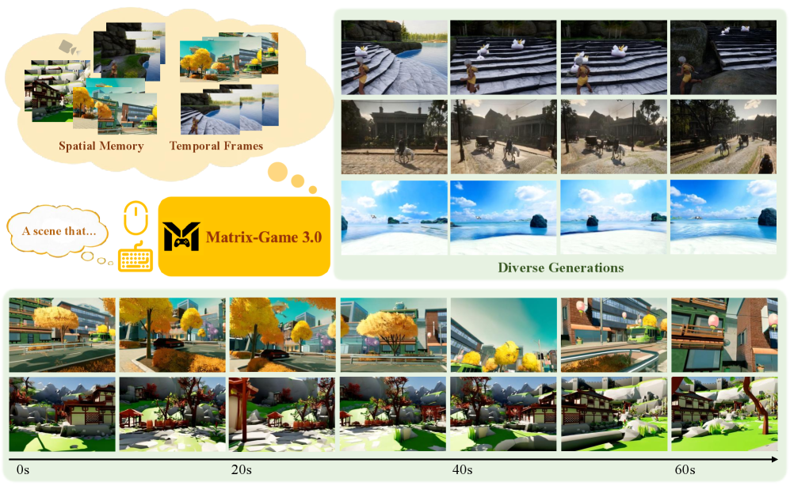
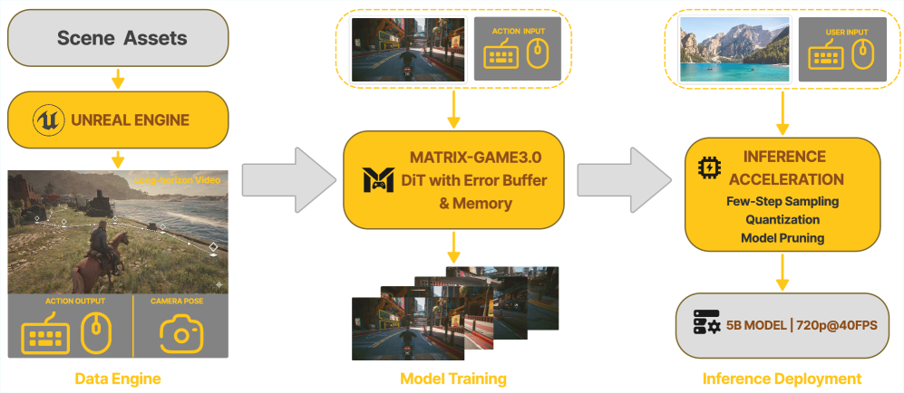
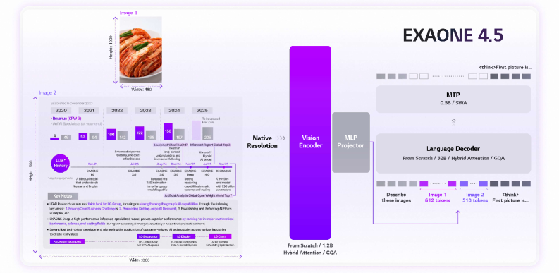
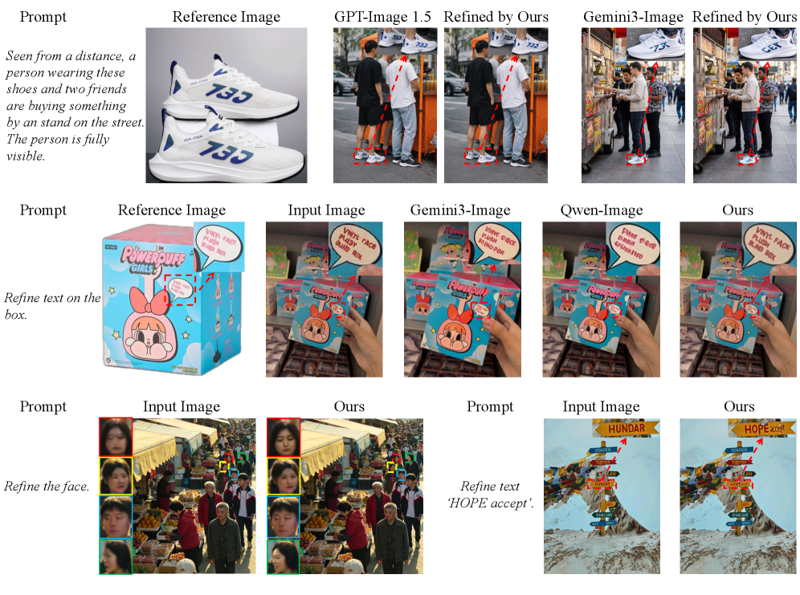
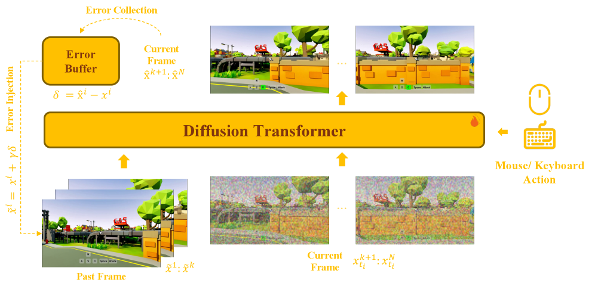

# Hugging Face Daily Papers Digest: 2026-04-11 ~ 04-13

- **Date:** 2026-04-13
- **Tags:** #daily-papers #huggingface #world-model #VLM #image-refinement #3D-detection #visual-generation #manufacturing-AI

## Context

本文对 2026 年 4 月 11-13 日 Hugging Face Daily Papers 上榜的论文进行系统梳理。由于 04/11（周六）和 04/12（周日）为周末，无新论文上榜，本期仅覆盖 04/13（周一）的 **8 篇**新论文。整体规模较上期（33 篇）明显缩减，但质量上呈现三条技术主线：

1. **视觉生成与世界模型** — Matrix-Game 3.0 实现 720p@40FPS 实时交互式世界模型，ELT 探索参数高效的循环 Transformer 架构，CT-1 将空间推理迁移到相机可控视频生成
2. **视觉语言模型的新进展** — EXAONE 4.5 是 LG AI Research 首个开源权重 VLM，VisionFoundry 提出用合成数据弥补 VLM 视觉感知短板
3. **精细视觉理解与编辑** — RefineAnything 聚焦区域级图像精修，WildDet3D 构建百万级开放世界 3D 检测数据集，FORGE 为制造业场景提供细粒度多模态评测

## 论文总览

### 4 月 13 日上榜（8 篇）

| 排名 | 论文 | arXiv ID | 票数 | 机构 | 领域 |
|------|------|----------|------|------|------|
| 1 | Matrix-Game 3.0 | 2604.08995 | 4 | 多机构 (Wanli Ouyang 等) | 交互式世界模型 |
| 2 | FORGE | 2604.07413 | 4 | 多机构 (Dacheng Tao 等) | 制造业多模态评测 |
| 3 | RefineAnything | 2604.06870 | 3 | 浙大 | 区域图像精修 |
| 4 | WildDet3D | 2604.08626 | 2 | Allen AI / UW | 开放世界 3D 检测 |
| 5 | EXAONE 4.5 | 2604.08644 | 1 | LG AI Research | 视觉语言模型 |
| 6 | CT-1 | 2604.09201 | 0 | 复旦大学 | 相机可控视频生成 |
| 7 | ELT | 2604.09168 | 0 | DeepMind | 参数高效视觉生成 |
| 8 | VisionFoundry | 2604.09531 | 0 | Princeton / Zhuang Liu | VLM 合成数据训练 |

---

## 第一部分：视觉生成与世界模型（3 篇）

本期最重磅的方向。从 Matrix-Game 3.0 的工业级实时世界模型，到 ELT 的循环 Transformer 参数压缩，再到 CT-1 的相机轨迹估计，视觉生成正加速迈向实用化。

### 1.1 Matrix-Game 3.0 — 720p 实时交互式世界模型 ⭐

**arXiv:** 2604.08995 | **票数:** 4 | **机构:** 多机构 (Wanli Ouyang 等)
**项目页:** [matrix-game-v3.github.io](https://matrix-game-v3.github.io/)

**核心论点：** 现有交互式视频生成方法无法同时实现「长期记忆一致性」和「高分辨率实时生成」。Matrix-Game 3.0 在数据、模型、推理三个层面系统升级，实现 **5B 模型 720p@40FPS** 的实时长序列生成。

**方法论亮点：**

- **工业级无限数据引擎：** 三路数据融合 —— UE5 合成数据（Tick 级同步 Video-Pose-Action-Prompt 四元组）、AAA 游戏自动录制（GTA V / 赛博朋克 2077 / 荒野大镖客 2 等，TB 级数据）、真实世界视频增强
- **误差感知自校正（Error-Aware Self-Correction）：** 训练时注入历史生成帧的残差误差，使模型学习 self-correction 能力，避免长序列累积漂移
- **相机感知长距记忆（Camera-Aware Long-Horizon Memory）：** 基于几何重叠的记忆检索 + Relative Plücker 编码实现视角一致性
- **多段自回归蒸馏：** 基于 DMD (Distribution Matching Distillation) 的 few-step 蒸馏，配合 INT8 量化和 VAE 解码器剪枝（50% 剪枝获 2.6× 加速）

**关键结果：**
- 5B 模型：720p@40FPS，分钟级序列稳定
- 2×14B 模型：进一步提升生成质量和泛化性
- 场景重访测试：成功恢复之前观察过的结构和纹理

**个人评价：** 这是目前见到的最完整的交互式世界模型工程方案。三路数据引擎（UE5 + AAA 游戏 + 真实世界）的设计非常实用，误差注入训练和相机感知记忆也解决了长序列生成的核心痛点。40FPS@720p 的指标已接近实用门槛。

### 1.2 ELT — 弹性循环 Transformer 视觉生成

**arXiv:** 2604.09168 | **票数:** 0 | **机构:** DeepMind

**核心创新：** 提出 Elastic Looped Transformers (ELT)，通过权重共享的循环 Transformer 块替代传统的深层独立 Transformer 层，在 **参数量减少 4×** 的情况下保持接近的生成质量。

**方法论：**
- **循环架构：** 复用相同的 Transformer 块进行迭代处理，大幅压缩参数
- **循环内自蒸馏 (ILSD)：** 中间循环作为 student，最终循环作为 teacher，单次训练步中实现多深度一致性
- **弹性推理：** 单次训练产出一族模型，推理时可动态调整循环次数以平衡计算成本与质量

**关键结果：** ImageNet 256×256 FID 2.0，UCF-101 FVD 72.8

### 1.3 CT-1 — 视觉-语言-相机模型

**arXiv:** 2604.09201 | **票数:** 0 | **机构:** 复旦大学
**代码:** [GitHub](https://github.com/gulucaptain/Camera-Transformer-1)

**核心创新：** 构建 Vision-Language-Camera 模型 CT-1，将空间推理知识迁移到相机可控视频生成。通过小波域正则化损失（Wavelet-based Regularization Loss）学习复杂相机轨迹分布，相机控制精度比先前方法提升 **25.7%**。配套发布 CT-200K 数据集（47M+ 帧）。

---

## 第二部分：视觉语言模型新进展（2 篇）

### 2.1 EXAONE 4.5 — LG 首个开源权重 VLM ⭐

**arXiv:** 2604.08644 | **票数:** 1 | **机构:** LG AI Research
**代码:** [GitHub](https://github.com/LG-AI-EXAONE/EXAONE-4.5)

**核心论点：** LG AI Research 发布首个开源权重视觉语言模型 EXAONE 4.5（33B 参数），在 EXAONE 4.0 基础上集成 1.2B 参数视觉编码器，支持 256K 上下文长度，重点面向文档理解和韩语场景。

**架构设计：**
- **视觉编码器：** 1.2B 参数，从零训练，采用 2D RoPE + GQA（Grouped Query Attention），自回归预训练
- **语言骨干：** EXAONE 4.0 32B，包含 Non-Reasoning 和 Reasoning 双模式
- **Multi-Token Prediction (MTP)：** 来自 K-EXAONE 的多 token 预测模块提升解码吞吐
- **上下文长度：** 256K token，在 SFT 阶段直接进行长度扩展

**训练流程：**
1. **预训练 Stage 1（基础模态对齐）：** 420B 图像 token + 400B 文本 token，8K 序列长度
2. **预训练 Stage 2（感知与知识精化）：** 225B 图像 token + 110B 文本 token，增大文档/OCR 数据比例
3. **SFT：** 多领域多模态监督微调 + 多语言（韩/英/日/西/德/越）
4. **偏好优化：** DPO（视觉任务）+ GROUPER（文本任务）
5. **RL：** GRPO + IcePop，联合文本与视觉强化学习

**Benchmark 亮点（Reasoning 模式）：**

| Benchmark | EXAONE 4.5 (33B) | GPT-5 mini | Qwen3-VL-235B |
|-----------|-------------------|------------|---------------|
| MMMU | 78.7 | 79.0 | 80.6 |
| MMMU-Pro | **68.6** | 67.3 | 69.3 |
| MATH-Vision | **75.2** | 71.9 | 74.6 |
| We-Math | **79.1** | 70.3 | 74.8 |
| CharXiv (RQ) | **71.7** | 68.6 | 66.1 |
| OCRBench v2 | 63.2 | 55.8 | 66.8 |
| BLINK | **68.8** | 67.7 | 67.1 |

**个人评价：** 33B dense 模型在 MMMU-Pro、MATH-Vision、We-Math、CharXiv 等多项测试上超过 GPT-5 mini 和 Qwen3-VL-235B (MoE)，说明 LG 的工业级 VLM 训练管线相当扎实。韩语和文档理解是其差异化优势。不过在 MedXpertQA 和 BabyVision 等更前沿的 benchmark 上仍有差距。

### 2.2 VisionFoundry — 用合成数据教 VLM 视觉感知

**arXiv:** 2604.09531 | **票数:** 0 | **机构:** Princeton (Zhuang Liu 组)
**项目页:** [zlab-princeton.github.io/VisionFoundry](https://zlab-princeton.github.io/VisionFoundry/)

**核心创新：** VLM 在空间理解、视角识别等低级视觉任务上表现不佳，根因是自然图像数据集对这些能力的监督不足。VisionFoundry 提出任务感知的合成数据管线：仅输入任务名称（如 "Depth Order"），用 LLM 生成 QA + T2I prompt，再合成图像 + VLM 验证一致性。构建的 VisionFoundry-10K 数据集（10 个任务，10K 样本）使 MMVP 提升 +7%，CV-Bench-3D 提升 +10%。

---

## 第三部分：精细视觉理解与编辑（3 篇）

### 3.1 RefineAnything — 多模态区域级图像精修

**arXiv:** 2604.06870 | **票数:** 3 | **机构:** 浙江大学 (Yi Yang 组)
**代码:** [GitHub](https://github.com/limuloo/RefineAnything)

**核心创新：** 将「区域级图像精修」定义为独立问题 —— 给定图像和用户指定区域（涂鸦/框选），恢复精细细节同时严格保持非编辑区域不变。

**方法论：**
- **Focus-and-Refine 策略：** 裁剪+缩放目标区域到全 VAE 输入分辨率，将分辨率预算集中在目标区域，再通过 blended-mask paste-back 保证背景严格不变
- **Boundary Consistency Loss：** 边界感知损失减少拼接伪影
- **Refine-30K 数据集：** 20K reference-based + 10K reference-free 样本
- **RefineEval Benchmark：** 同时评估编辑区域保真度和背景一致性

### 3.2 WildDet3D — 百万级开放世界 3D 检测

**arXiv:** 2604.08626 | **票数:** 2 | **机构:** Allen AI / UW (Ranjay Krishna 组)
**代码:** [GitHub](https://github.com/allenai/WildDet3D)

**核心贡献：**
- **统一架构：** 支持文本/点/框三种 prompt 模态，可选择性融入辅助深度信号
- **WildDet3D-Data：** 目前最大的开放 3D 检测数据集，1M+ 图像覆盖 **13.5K 类别**
- **关键结果：** Omni3D 上 34.2/36.4 AP3D（文本/框 prompt），引入深度线索在各设置上平均提升 +20.7 AP

### 3.3 FORGE — 制造业场景细粒度多模态评测

**arXiv:** 2604.07413 | **票数:** 4 | **机构:** 多机构 (Dacheng Tao 等)
**代码:** [GitHub](https://github.com/AI4Manufacturing/FORGE)

**核心发现：** 评测 18 个 SOTA MLLM 在工件验证、结构表面检测、装配验证三个制造业任务上的表现。**反直觉发现：视觉定位（visual grounding）并非主要瓶颈，领域特定知识不足才是关键短板。** 在 3B 模型上用其标注数据进行 SFT 可获得高达 **90.8%** 的相对精度提升。

---

## 深入分析

### 深入分析 1: Matrix-Game 3.0 — 实时交互式世界模型的工程全景

Matrix-Game 3.0 的核心价值不在于单一技术突破，而在于从数据到推理的**全栈工程优化**。

**数据引擎的三条线：**

| 数据源 | 特点 | 规模 |
|--------|------|------|
| UE5 合成 | Tick 级同步四元组，NavMesh-RL 混合探索，10⁸+ 角色变体 | 1000+ 自定义场景 |
| AAA 游戏录制 | 四层解耦架构，8 方向动作推断，99%+ 精度 | TB 级 |
| 真实世界视频 | DL3DV-10K + RealEstate10K + OmniWorld + SpatialVid-HD | 多源融合 |

**自校正机制的设计直觉：** 传统自回归生成将 ground truth 作为历史输入训练，但推理时输入的是自身不完美的生成帧——这种 train-test gap 导致误差累积。Matrix-Game 3.0 在训练时主动注入生成残差 $\delta = \hat{x}_i - x_i$，将扰动后的帧 $\tilde{x}_i = x_i + \gamma\delta$ 作为训练输入，使模型显式学习从有误差的历史中恢复。这一思路类似 Scheduled Sampling，但在扩散模型框架下重新设计。

**记忆检索机制：** 相机感知记忆检索基于视角间的几何重叠程度选择最相关的历史帧，使用 Relative Plücker 坐标编码视角关系。关键技巧是 Head-wise Perturbed RoPE：$\hat{\theta}_h = \theta_{base}(1 + \sigma_\theta \cdot \epsilon_h)$，为不同注意力头赋予略有不同的位置编码频率，减轻位置别名效应。

**推理加速组合拳：**
- INT8 量化（DiT attention projections）
- VAE 解码器剪枝（MG-LightVAE，50% 剪枝获 2.6× 加速）
- GPU 端记忆检索（采样近似替代精确搜索）
- 异步部署（8 GPU DiT + 1 GPU VAE）

### 深入分析 2: EXAONE 4.5 — 工业导向 VLM 的设计哲学

EXAONE 4.5 的设计选择反映了 LG 作为工业企业的实际需求导向：

**视觉编码器的关键决策：** 没有复用现有小规模编码器（如 600M 的 SigLIP），而是从零训练 1.2B 参数编码器。原因是大规模编码器能保留更丰富的视觉表征，避免对 visual token 进行激进压缩。配合 GQA 在视觉编码器中的使用（即使没有 KV cache），也能通过降低注意力复杂度提升端到端效率。

**后训练管线的精细分层：**
1. SFT → 多领域多模态基础对齐
2. DPO/GROUPER → 视觉用 DPO（有参考模型，训练稳定），文本用 GROUPER（可利用多个 rejected response）
3. GRPO + IcePop → 联合文本+视觉的强化学习

这种「三阶段后训练」比单一 RLHF 更精细，每个阶段解决不同层面的对齐问题。

**差异化优势分析：** EXAONE 4.5 的韩语和文档理解能力明显突出。在 KMMMU（42.7 vs Qwen3-VL-32B 的 37.8）和 CharXiv（71.7 vs Qwen3-VL-235B 的 66.1）上的领先，源于其刻意增大文档/OCR 数据比例和韩语文化语料的策略。这也是工业 VLM 的正确打法 —— 与其在通用 benchmark 上追赶头部，不如在垂直场景深度优化。

---

## 趋势分析

1. **世界模型加速实用化：** Matrix-Game 3.0 的 40FPS@720p 是一个标志性指标，意味着交互式世界模型已接近游戏/仿真的实用门槛。数据引擎（UE5 + 商业游戏 + 真实世界）的三路融合范式可能成为标准做法。

2. **VLM 进入垂直深耕阶段：** EXAONE 4.5 和 FORGE 共同指向一个趋势 —— VLM 的竞争从「通用 benchmark 刷榜」转向「垂直场景适配」。FORGE 发现制造业瓶颈在领域知识而非视觉感知，这对工业 VLM 的数据策略有直接指导意义。

3. **参数效率持续受关注：** ELT 通过循环架构实现 4× 参数压缩，VisionFoundry 用仅 10K 合成样本实现显著提升，都体现了「少即是多」的设计哲学。

4. **精细控制成为图像/视频生成的核心需求：** RefineAnything（区域精修）、CT-1（相机控制）、Matrix-Game 3.0（动作控制 + 记忆）—— 本期三篇生成论文都聚焦于「更精确的控制」而非「更大的模型」。

## Open Questions

- Matrix-Game 3.0 的记忆机制在更长（10 分钟+）序列和更复杂场景（多角色交互）下的鲁棒性如何？
- EXAONE 4.5 的工业部署效果如何验证？LG 是否会发布制造业场景的专用模型？
- VisionFoundry 的合成数据方法是否能扩展到更高级的视觉推理（如物理直觉、因果推断）？
- RefineAnything 的 Focus-and-Refine 策略在极小区域（<5% 图像面积）时是否仍然有效？

## References

1. Matrix-Game 3.0 — [arXiv:2604.08995](https://arxiv.org/abs/2604.08995) | [Project](https://matrix-game-v3.github.io/)
2. FORGE — [arXiv:2604.07413](https://arxiv.org/abs/2604.07413) | [GitHub](https://github.com/AI4Manufacturing/FORGE)
3. RefineAnything — [arXiv:2604.06870](https://arxiv.org/abs/2604.06870) | [GitHub](https://github.com/limuloo/RefineAnything)
4. WildDet3D — [arXiv:2604.08626](https://arxiv.org/abs/2604.08626) | [GitHub](https://github.com/allenai/WildDet3D)
5. EXAONE 4.5 — [arXiv:2604.08644](https://arxiv.org/abs/2604.08644) | [GitHub](https://github.com/LG-AI-EXAONE/EXAONE-4.5)
6. CT-1 — [arXiv:2604.09201](https://arxiv.org/abs/2604.09201) | [GitHub](https://github.com/gulucaptain/Camera-Transformer-1)
7. ELT — [arXiv:2604.09168](https://arxiv.org/abs/2604.09168)
8. VisionFoundry — [arXiv:2604.09531](https://arxiv.org/abs/2604.09531) | [Project](https://zlab-princeton.github.io/VisionFoundry/)
