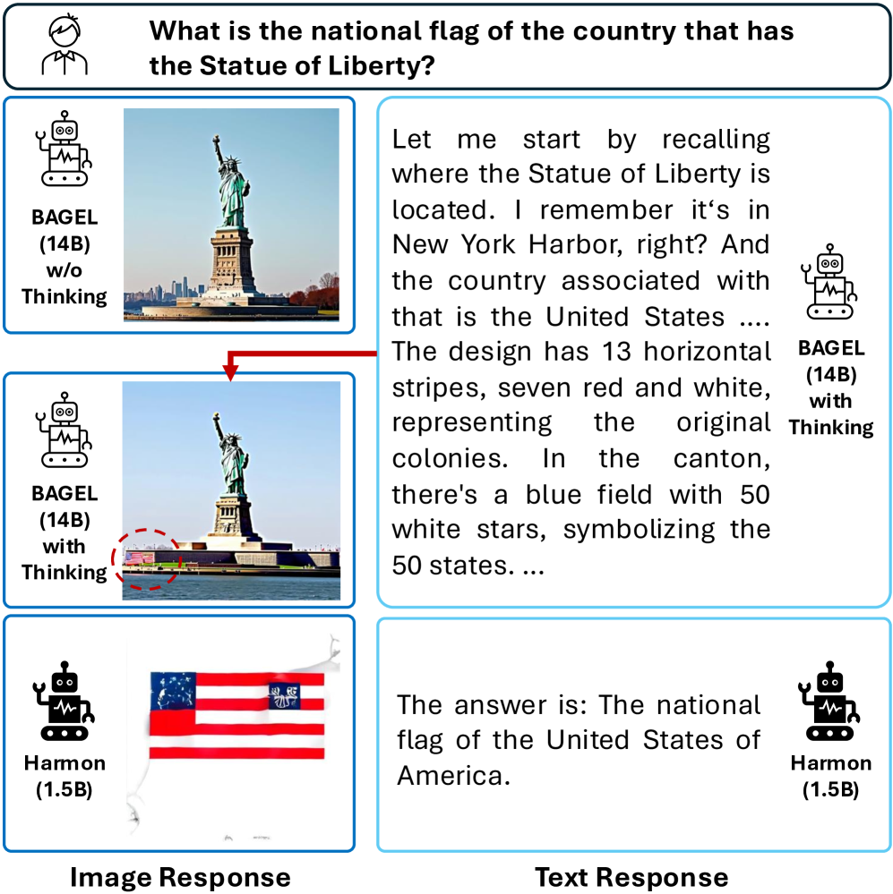
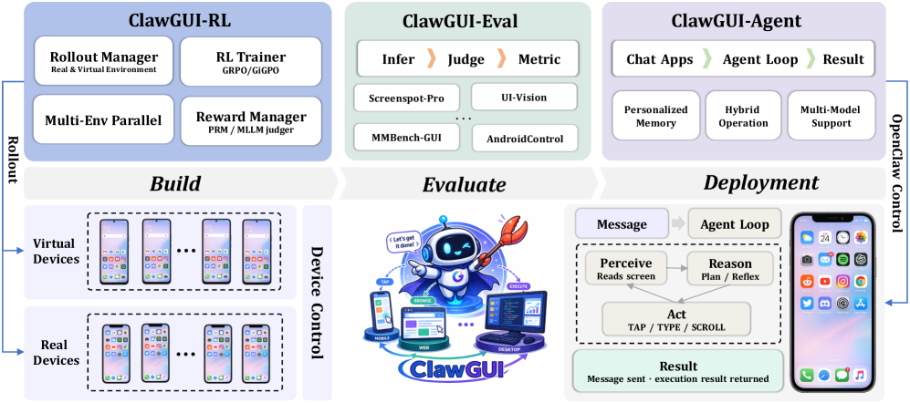
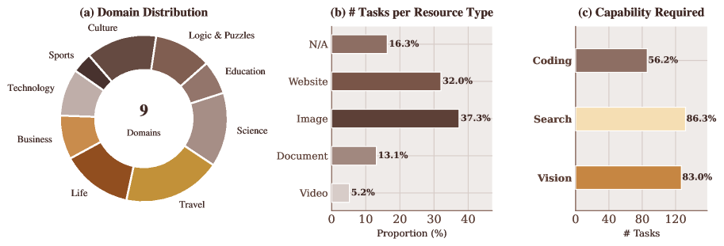
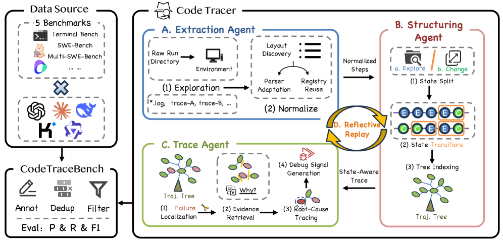
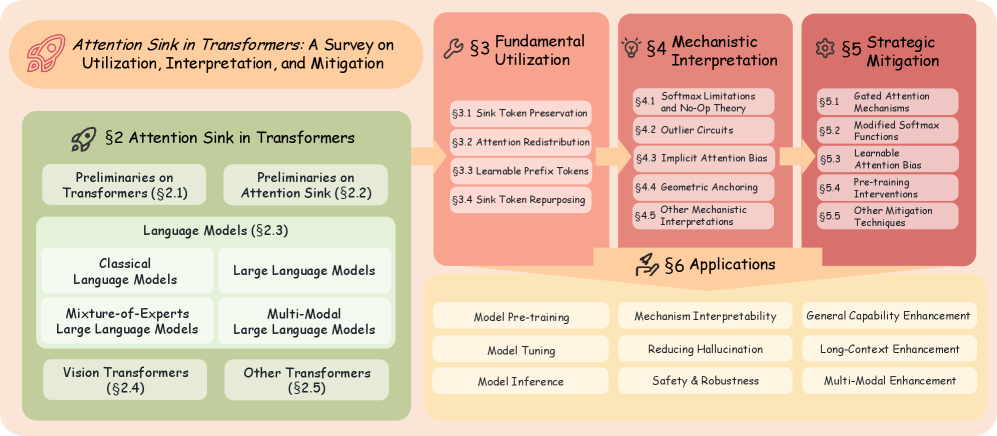
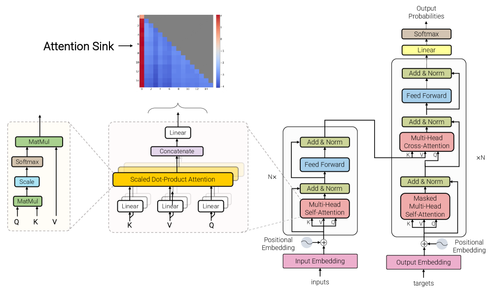
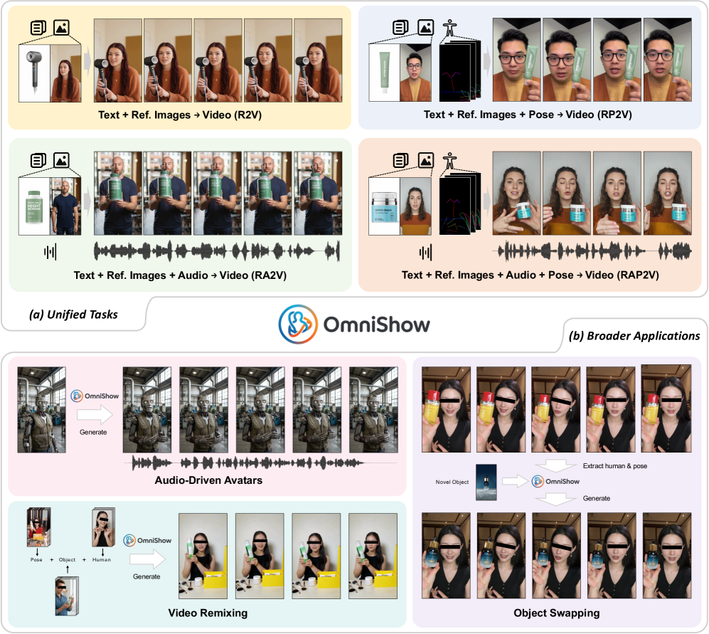
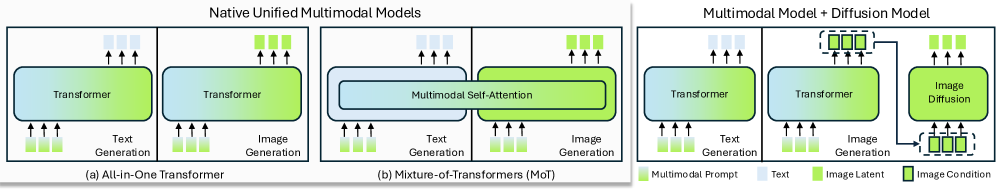
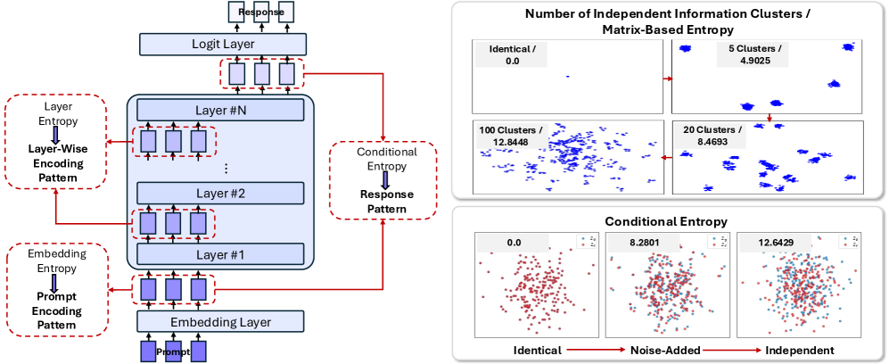

# HuggingFace Daily Papers Digest: 04/13-14

- **Date:** 2026-04-14
- **Tags:** #hf-daily-papers #digest #multimodal #agents #attention #rl

## Context

本期覆盖 2026 年 4 月 13-14 日 HuggingFace Daily Papers，去重后共 **26 篇**新论文。深入分析 2 篇高影响力论文：Pseudo-Unification（统一多模态模型的"伪统一"问题）和 Attention Sink Survey（首个系统化的 Attention Sink 综述）。

---

## 论文总览表

| # | 论文 | 领域 | 关键词 | Upvotes |
|---|------|------|--------|---------|
| 1 | Pseudo-Unification: Entropy Probing Reveals Divergent Information Patterns in UMMs | 多模态 | 统一多模态模型, 信息论探测, 伪统一 | 30 |
| 2 | Attention Sink in Transformers: A Survey | Transformer | Attention Sink, 综述, 180+ 论文 | 30 |
| 3 | SATO: Strips as Tokens for Artist Mesh Generation | 3D 生成 | 三角网格, 自回归, UV 分割 | 27 |
| 4 | OmniShow: Multimodal Human-Object Interaction Video Generation | 视频生成 | 人物-物体交互, 多模态条件 | 23 |
| 5 | Multi-User Large Language Model Agents | Agent | 多用户 Agent, 隐私, 协调 | 18 |
| 6 | ClawGUI: Unified Framework for GUI Agents | Agent | GUI Agent, RL 训练, 跨平台部署 | 18 |
| 7 | ECHO: Efficient Chest X-ray Report Generation | 医疗 AI | 扩散模型, X 光报告, 8x 加速 | 17 |
| 8 | CocoaBench: Evaluating Unified Digital Agents | Agent/Benchmark | 综合 Agent 评测, 长程任务 | 16 |
| 9 | CodeTracer: Traceable Agent States | Agent/Debug | Code Agent 追踪, 故障定位 | 14 |
| 10 | AgentSwing: Adaptive Parallel Context Management | Agent | 长程 Web Agent, 上下文管理 | 13 |
| 11 | Backdoor Attacks on Decentralised Post-Training | 安全 | 后训练后门攻击, 流水线并行 | 10 |
| 12 | Introspective Diffusion Language Models | 语言模型 | 扩散语言模型, 内省一致性 | 9 |
| 13 | Tracing the Roots: Data Lineage in Post-Training LLMs | 数据 | 数据谱系追踪, 多 Agent 框架 | 9 |
| 14 | VisionFoundry: Teaching VLMs with Synthetic Images | 视觉 | 合成数据, VLM 视觉感知 | 7 |
| 15 | Structured Causal Video Reasoning | 视频理解 | 因果推理, 多目标 RL | 7 |
| 16 | Prompt Relay: Temporal Control for Multi-Event Video | 视频生成 | 时序控制, 多事件视频 | 6 |
| 17 | ScheMatiQ: Interactive Schema Discovery | NLP/工具 | 自动 schema 生成, 结构化数据库 | 6 |
| 18 | Envisioning the Future, One Step at a Time | 自动驾驶 | 轨迹预测, 自回归扩散 | 6 |
| 19 | From Reasoning to Agentic: Credit Assignment in RL for LLMs | RL | 信用分配, 推理 vs Agentic | 5 |
| 20 | Audio Flamingo Next | 音频 | 音频语言模型, 语音/音乐/声音 | 4 |
| 21 | General365: Benchmarking General Reasoning | Benchmark | 通用推理, K-12, 365 种任务 | 4 |
| 22 | LLMs Generate Harmful Content via Unified Mechanism | 安全 | 有害内容, 权重剪枝, 内部机制 | 4 |
| 23 | p1: Better Prompt Optimization with Fewer Prompts | Prompt | 系统 prompt 优化, 用户过滤 | 4 |
| 24 | Physics Olympiad via RL on Physics Simulators | RL/科学 | 物理模拟器, 零样本迁移 | 3 |
| 25 | MedSSR: Medical Reasoning with Knowledge-enhanced Synthesis | 医疗 AI | 半监督 RL, 罕见病 | 3 |
| 26 | Low-rank Optimization Trajectories for RLVR Acceleration | RL | LoRA 外推, RLVR 加速 | 2 |

---

## 分主题详解

### 主题一：多模态模型——统一的幻象与真实

**Pseudo-Unification (2604.10949)** ★ 深入分析见下文

港科大 MMLab 提出了一个尖锐的问题：当前号称"统一"的多模态模型（UMMs）其实是**伪统一**——它们在架构上共享参数，但在信息流上并没有真正融合。通过信息论探测框架分析 10 个代表性 UMM，发现了双重分歧：编码端的模态不对称和解码端的模式分裂。

**Audio Flamingo Next (2604.10905)** 是音频-语言模型的下一代版本，增强了对语音、声音和音乐的统一理解能力，支持更长的音频输入和时序推理。

**TorchUMM (2604.10784)** 提供了统一多模态模型的代码库，支持评估、分析和后训练。

### 主题二：Agent 基础设施的成熟化

本期最大的主题是 **Agent 工具链和评测基准的快速成熟**，共有 6 篇相关论文：

**ClawGUI (2604.11784)** 提出了 GUI Agent 的全栈框架，覆盖训练（ClawGUI-RL）、评估（ClawGUI-Eval）和部署（ClawGUI-Agent）。亮点包括首个开源 GUI Agent RL 基础设施（支持并行虚拟环境和真实物理设备）、跨 6 个 benchmark 的标准化评估流水线、以及 Android/HarmonyOS/iOS 跨平台部署。ClawGUI-2B 在 MobileWorld GUI-Only 上达到 17.1% 成功率，比同规模 baseline 高 6%。

**CocoaBench (2604.11201)** 是第一个评测"统一数字 Agent"的 benchmark——要求 Agent 在单次任务中组合视觉、搜索和编程等多种能力。最好的系统也只有 45.1% 成功率，揭示了当前 Agent 在推理规划、工具使用和视觉定位方面的显著不足。

**CodeTracer (2604.11641)** 解决了 Code Agent 调试难题——当框架编排并行工具调用和多阶段工作流时，Agent 的状态转换和错误传播难以观测。CodeTracer 通过层级化追踪树重建完整状态历史，定位故障起点和下游连锁反应。

**AgentSwing (2603.27490)** 提出了长程 Web Agent 的自适应并行上下文管理框架，通过分支和前瞻路由实现高效上下文切换。

**Multi-User LLM Agents (2604.08567)** 是首个系统研究多用户 LLM Agent 的工作，发现在指令遵循、隐私保护和用户协调方面存在显著差距。

**Credit Assignment in RL for LLMs (2604.09459)** 系统梳理了 LLM 强化学习中的信用分配方法，区分了推理场景和 Agentic 场景的不同方法论。

### 主题三：Transformer 机制理解

**Attention Sink Survey (2604.10098)** ★ 深入分析见下文

首个关于 Transformer 中 Attention Sink 现象的系统综述，覆盖 180+ 论文，从利用、解释和缓解三个维度组织。揭示了 Attention Sink 如何在不同架构中出现，以及为什么掌握它对可解释性、训练/推理效率和幻觉问题至关重要。

**LLMs Generate Harmful Content via Unified Mechanism (2604.09544)** 通过权重剪枝发现 LLM 有一个独立于良性能力的、统一的有害内容生成内部机制。

### 主题四：视频生成与视觉理解

**OmniShow (2604.11804)** 是 HOIVG（人物-物体交互视频生成）的端到端框架，能同时处理文本、参考图像、音频和姿态等多模态条件。关键创新包括统一通道条件注入（Unified Channel-wise Conditioning）和门控局部上下文注意力（Gated Local-Context Attention）以实现音视频同步。

**SATO (2604.09132)** 用三角条带（triangle strips）作为 token 排序策略，在自回归 Transformer 中保持边缘流和语义布局。

**Prompt Relay (2604.10030)** 通过 cross-attention 惩罚实现推理时的多事件视频时序控制。

**VisionFoundry (2604.09531)** 使用任务感知的合成数据训练 VLM 的视觉感知能力，在 MMVP 上提升 7%，在 CV-Bench-3D 上提升 10%。

### 主题五：RL 与推理增强

**Physics Olympiad via RL (2604.11805)** 用物理模拟器生成合成数据，通过 RL 让 LLM 发展物理推理能力，实现零样本迁移到真实 benchmark。

**MedSSR (2604.11547)** 通过知识增强的半监督 RL 提升 LLM 医学推理，在罕见病任务上表现突出。

**Low-rank Optimization for RLVR (2604.11446)** 提出 LoRA 训练的秩-1 参数轨迹非线性外推，加速 RLVR 训练。

### 主题六：Benchmark 与安全

**General365 (2604.11778)** 评测 LLM 在 365 种 K-12 级别任务上的通用推理能力，发现尽管领域特定表现强，通用推理仍然有限。

**Backdoor Attacks on Decentralised Post-Training (2604.02372)** 首次在流水线并行场景下实现后门攻击，仅控制中间阶段就将对齐度从 80% 降到 6%。

---

## 深入分析一：Pseudo-Unification——统一多模态模型的"伪统一"问题

**论文：** Pseudo-Unification: Entropy Probing Reveals Divergent Information Patterns in Unified Multimodal Models (2604.10949)
**作者：** Songlin Yang, Xianghao Kong, Anyi Rao 等（港科大 MMLab）
**Upvotes：** 30

### 问题

当前的统一多模态模型（UMMs）号称在一个模型内同时完成文本理解和图像生成，但实际表现远不如分离的专家模型。为什么？

### 核心发现

通过信息论探测框架分析 10 个代表性 UMM，发现**伪统一**源于双重分歧：

**1. 编码端——模态不对称编码（Modality-Asymmetric Encoding）：** 视觉和语言输入在模型内部经历完全不同的熵轨迹。语言编码逐层压缩（熵递减），而视觉编码则路径不同，两者没有融合。

**2. 解码端——模式分裂响应（Pattern-Split Response）：** 文本生成表现为高熵的创造性过程，而图像合成则强制执行低熵的保真过程。两种模式对信息流的需求根本对立。

### 关键洞见

只有通过**上下文预测（contextual prediction）** 统一两侧的模型（而非简单的参数共享）才能实现更真正的统一——这类模型即使参数更少，也能实现更强的基于推理的文本到图像生成。

### 意义

这项工作提供了首个**模型内部视角**的统一度诊断——告诉我们"统一"不等于"共享参数"，真正的多模态协同需要**信息流的一致性**。

---

## 深入分析二：Attention Sink 综述——为什么 Transformer 总盯着没用的 token？

**论文：** Attention Sink in Transformers: A Survey on Utilization, Interpretation, and Mitigation (2604.10098)
**作者：** Zunhai Su, Hengyuan Zhang, Wei Wu 等（清华、港大、美团 LongCat）
**Upvotes：** 30

### 什么是 Attention Sink？

Attention Sink（注意力汇聚）是 Transformer 中一个广泛存在但长期被忽视的现象：**模型将不成比例的注意力集中在少数无信息 token 上**（如句首 token、[CLS]、[BOS]）。在 LLaMA-2 中，首个 token 在 **98% 的注意力头**中获得最高注意力。

### 三维度分类框架

这篇综述将 180+ 论文组织为三个发展阶段：

| 阶段 | 时间 | 核心问题 | 代表方法 |
|------|------|---------|---------|
| **利用** | 2023+ | 如何利用 Sink 现象？ | StreamingLLM（保留 Sink token）、H2O（累积注意力选择）、Register Tokens |
| **解释** | 2024+ | 为什么会出现？ | Softmax 约束（和为 1 强制分配）、No-Op 理论（Sink token 值向量近零）、异常激活电路 |
| **缓解** | 2025+ | 能否消除？ | 门控注意力、修改 Softmax（Softpick）、可学习注意力偏置 |

### 跨架构的 Attention Sink

| 架构 | Sink 位置 | 特点 |
|------|----------|------|
| 经典 LM（BERT） | [CLS], [SEP] | 固定在特殊 token |
| LLM（LLaMA, GPT） | 首个 token | 深层越严重，训练收敛时形成 |
| MoE LLM | Super Experts | 极少数专家集中路由 Sink token |
| 多模态 LLM | 文本侧 [BOS] + 视觉侧背景 patch | 双重 Sink |
| ViT | 低信息背景 patch | 不限于序列起始位置 |
| Diffusion Transformer | 持久上下文锚点 | 长程生成的稳定锚 |

### 为什么重要？

Attention Sink 不只是一个学术好奇心：
1. **KV Cache 压缩**：StreamingLLM 等方法利用 Sink 实现长上下文推理
2. **量化**：Sink token 的异常激活导致量化误差放大
3. **幻觉**：多模态场景中 Sink 干扰了语义注意力分配
4. **安全**：Sink 可被利用进行后门攻击和异常检测

### 核心解释：Softmax 的"原罪"

最被接受的解释是 Softmax 的 **sum-to-one 约束**——即使没有相关的 key，注意力也必须分配到某处。模型学会把"多余"的注意力倒进一个"垃圾桶"token，同时让这个 token 的 value 向量接近零（No-Op 行为），确保不会真正影响输出。

---

## 趋势分析

### 1. Agent 基础设施的"寒武纪爆发"

本期 6/26 篇论文直接关于 Agent 基础设施（训练、评测、调试、部署），这不是巧合。从 ClawGUI 的全栈框架到 CodeTracer 的调试工具，再到 CocoaBench 的综合评测，Agent 正在从"能跑"走向"能工程化"。这与 Harness 工程的趋势完全一致。

### 2. "统一"不等于"融合"

Pseudo-Unification 的发现对当前多模态模型的发展路线提出了根本质疑。参数共享 ≠ 信息融合。真正的统一需要在信息流层面实现一致性，这可能需要全新的架构设计。

### 3. 理解 Transformer 内部机制的热潮

Attention Sink 综述（180+ 论文）和有害内容统一机制的发现，都表明社区正在从"用模型"转向"理解模型"。这种理解是优化推理效率、提升安全性、减少幻觉的前提。

### 4. RL 的普及化

从 GUI Agent RL 训练（ClawGUI）、物理推理 RL（Physics Olympiad）到医学 RL（MedSSR）和 RLVR 加速（Low-rank Optimization），RL 正在渗透到 LLM 的各个应用场景。

---

## Open Questions

- Pseudo-Unification 的诊断方法能否指导下一代 UMM 架构设计？哪些模型最接近"真正统一"？
- Attention Sink 能否被完全消除而不影响性能，还是它本质上是 Transformer 的必要特性？
- Agent 基础设施的碎片化（ClawGUI、CodeTracer、CocoaBench 各自独立）是否需要一个统一的 Agent 开发平台？
- 当 Code Agent 的复杂度持续增加，CodeTracer 这类追踪工具是否会成为标配？

## References

- Pseudo-Unification: https://arxiv.org/abs/2604.10949
- Attention Sink Survey: https://arxiv.org/abs/2604.10098
- OmniShow: https://arxiv.org/abs/2604.11804
- ClawGUI: https://arxiv.org/abs/2604.11784
- CocoaBench: https://arxiv.org/abs/2604.11201
- CodeTracer: https://arxiv.org/abs/2604.11641
- SATO: https://arxiv.org/abs/2604.09132
- Multi-User LLM Agents: https://arxiv.org/abs/2604.08567
- ECHO: https://arxiv.org/abs/2604.09450
- AgentSwing: https://arxiv.org/abs/2603.27490
