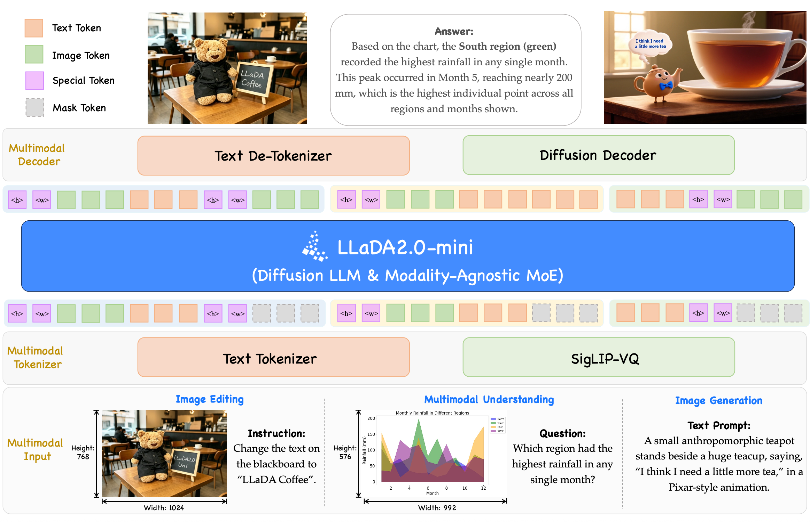
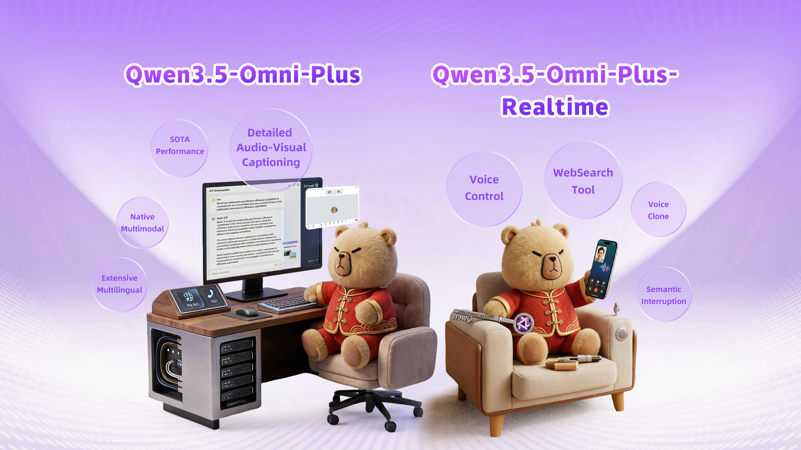
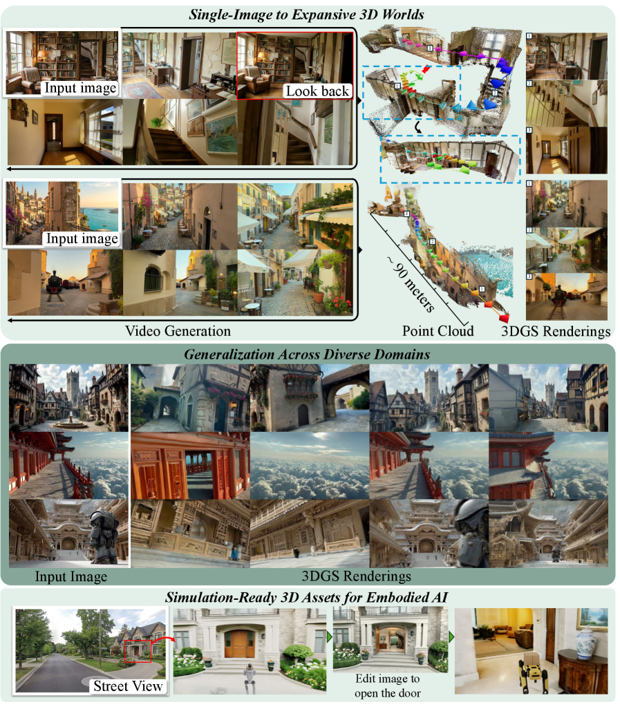
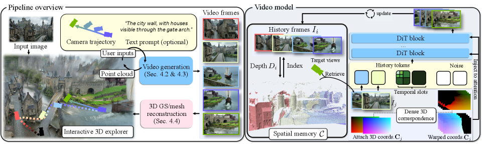
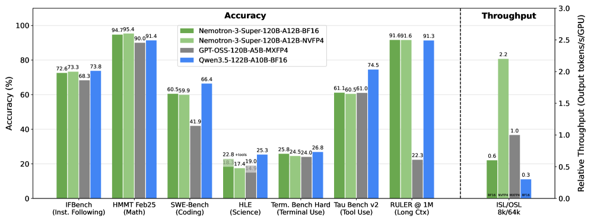
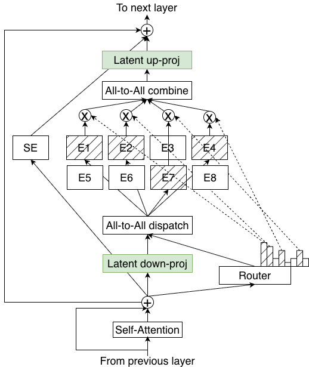
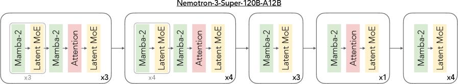
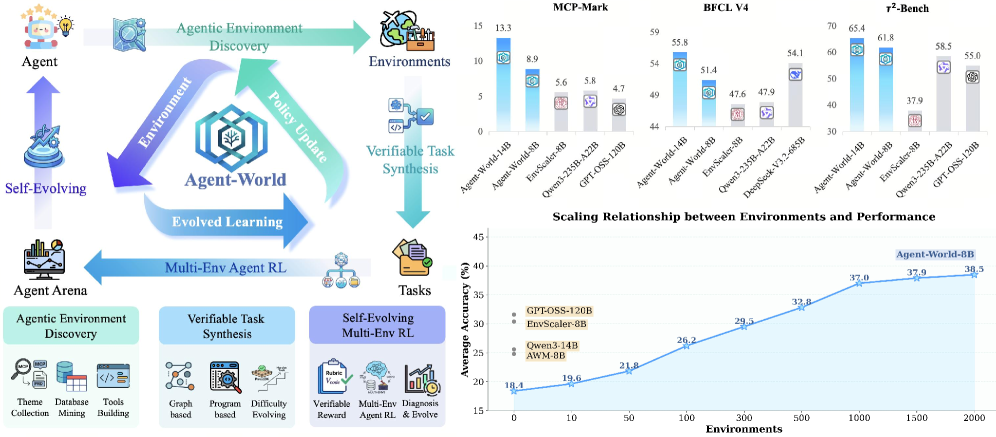
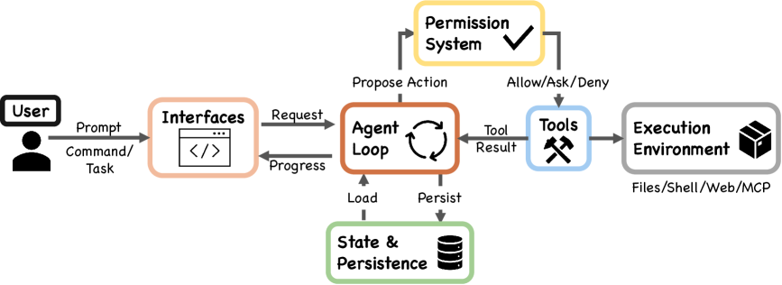

# Hugging Face Daily Papers Digest: 2026-04-14 ~ 04-24

- **Date:** 2026-04-24
- **Tags:** #daily-papers #huggingface #diffusion-LLM #MoE #video-generation #agent-training #omni-model #3D-generation #RL-for-LLM #AI-agent-systems

## Context

本文对 2026 年 4 月 14-24 日 Hugging Face Daily Papers 上榜的论文进行系统梳理。覆盖 **9 个有效日期**（04/18 无论文，04/19 并入 04/20），共计约 **300+ 篇**论文。考虑到规模庞大，本期采用 **精选模式**：按主题归类介绍最高影响力论文，并对 2 篇进行深入分析。

这一周半的论文呈现出五大技术主线：

1. **统一多模态模型** — LLaDA2.0-Uni 以 218 票夺冠，扩散 LLM 统一理解与生成成为热门范式；Qwen3.5-Omni 继续推进全模态
2. **视频与 3D 世界生成** — Seedance 2.0（151 票）、Lyra 2.0（NVIDIA）、HY-World 2.0 代表视频/3D 生成的新高度
3. **高效 MoE 架构** — Nemotron 3 Super 首创 LatentMoE + Hybrid Mamba-Attention，120B 参数仅 12B 激活
4. **Agent 系统与训练** — Agent-World、Claude Code 系统分析、AgentSPEX 等构成 Agent 生态的完整拼图
5. **LLM 训练方法论** — 蒸馏、RL、推理优化方面涌现大量高质量工作

## 论文总览

### 按日期统计

| 日期 | 论文数 | 最高票论文 |
|------|--------|-----------|
| 04/14 | 49 | Memory-Enhanced Dynamic Reward Shaping (137) |
| 04/15 | 41 | ClawGUI (141) |
| 04/16 | 34 | Seedance 2.0 (151) |
| 04/17 | 27 | HY-World 2.0 (110) |
| 04/18-19 | 0 | — |
| 04/20 | 28 | DiPO (72) |
| 04/21 | 41 | Tstars-Tryon 1.0 (242) / Agent-World (77) |
| 04/22 | 32 | Tstars-Tryon 1.0 (242) |
| 04/23 | 28 | LLaDA2.0-Uni (218) |
| 04/24 | 16 | WorldMark (27) |

### Top 20 精选论文

| # | 论文 | arXiv ID | 票数 | 日期 | 主题 |
|---|------|----------|------|------|------|
| 1 | Tstars-Tryon 1.0 | 2604.19748 | 242 | 04/22 | Virtual Try-On |
| 2 | LLaDA2.0-Uni | 2604.20796 | 218 | 04/23 | 统一扩散 LLM |
| 3 | AgentSPEX | 2604.13346 | 153 | 04/22 | Agent 规范语言 |
| 4 | Seedance 2.0 | 2604.14148 | 151 | 04/16 | 多模态视频生成 |
| 5 | ClawGUI | 2604.11784 | 141 | 04/15 | GUI Agent 框架 |
| 6 | Memory-Enhanced Reward Shaping | 2604.11297 | 137 | 04/14 | RL 奖励塑造 |
| 7 | QuanBench+ | 2604.08570 | 124 | 04/14 | 量子代码生成 |
| 8 | GameWorld | 2604.07429 | 114 | 04/16 | 多模态游戏 Agent |
| 9 | HY-World 2.0 | 2604.14268 | 110 | 04/17 | 多模态 3D 世界 |
| 10 | RationalRewards | 2604.11626 | 100 | 04/16 | 推理奖励视觉生成 |
| 11 | KnowRL | 2604.12627 | 98 | 04/15 | 知识引导 RL |
| 12 | OneVL | 2604.18486 | 83 | 04/21 | 单步视觉-语言推理 |
| 13 | Extending One-Step Image Gen | 2604.18168 | 94 | 04/21 | 单步图像生成 |
| 14 | Rethinking On-Policy Distillation | 2604.13016 | 85 | 04/15 | 蒸馏方法论 |
| 15 | CoInteract | 2604.19636 | 81 | 04/22 | 人物交互视频 |
| 16 | Agent-World | 2604.18292 | 77 | 04/21 | Agent 训练环境 |
| 17 | DiPO | 2604.13902 | 59 (04/20) | 04/20 | 探索-利用权衡 |
| 18 | Qwen3.5-Omni | 2604.15804 | 52 | 04/20 | 全模态模型 |
| 19 | Nemotron 3 Super | 2604.12374 | 36 | 04/15 | Hybrid MoE |
| 20 | Lyra 2.0 | 2604.13036 | 38 | 04/15 | 可探索 3D 世界 |

---

## 第一部分：统一多模态模型（4 篇）

本期最突出的趋势：用一个模型同时完成多模态理解和生成。扩散 LLM 路线（LLaDA2.0-Uni）与传统自回归路线（Qwen3.5-Omni）各有千秋。

### 1.1 LLaDA2.0-Uni — 扩散 LLM 统一多模态理解与生成 ⭐⭐

**arXiv:** 2604.20796 | **票数:** 218 | **机构:** inclusionAI (Inclusion AI)
**代码:** [GitHub](https://github.com/inclusionAI/LLaDA2.0-Uni)

**核心论点：** 当前统一模型面临「理解 vs 生成」的架构矛盾——自回归 LLM 擅长理解但生成图像质量有限，扩散模型擅长生成但理解能力弱。LLaDA2.0-Uni 证明了离散扩散 LLM (dLLM) 可以在原生统一框架内同时实现两者。

**架构三大支柱：**

- **语义离散 Tokenizer (SigLIP-VQ):** 将连续视觉输入通过 SigLIP 编码器 + VQ 量化转为离散 token，使视觉和文本在同一离散空间中处理
- **MoE-based dLLM 骨干网络:** 采用 block-level masked diffusion 机制同时处理文本和视觉 token，MoE 结构提供高效的计算扩展
- **扩散解码器:** 将视觉 token 重建为高保真图像，支持 few-step 蒸馏加速

**推理效率优化：**
- Backbone 的 prefix-aware 优化减少重复计算
- 解码器 few-step 蒸馏显著降低采样步数
- 整体推理速度远超逐 token 生成的自回归方法

**关键结果：**
- 多模态理解：匹配专用 VLM（如 LLaVA 等）的性能水平
- 图像生成：在 GenEval、DPG-Bench 等基准上表现优异
- 图像编辑：支持基于指令的图像编辑
- 交叉生成：原生支持 interleaved text-image generation 和推理

**个人评价：** 这是扩散 LLM 路线在统一多模态方面的一个里程碑。相比自回归统一模型（如 Emu、Chameleon 等），dLLM 路线有天然的并行解码优势。218 票的社区认可也说明了该方向的热度。不过，当前的离散化可能仍会损失一些视觉细节。

### 1.2 Qwen3.5-Omni — 全模态理解与生成

**arXiv:** 2604.15804 | **票数:** 52 | **机构:** Alibaba Qwen Team

**核心创新：** Qwen3.5-Omni 是一个统一的多模态音视频生成模型，支持文本、图像、音频、视频的理解和生成。相比前代，在多模态协同生成方面有显著提升。

### 1.3 OneVL — 单步潜在推理与规划

**arXiv:** 2604.18486 | **票数:** 83 | **机构:** 多机构

单步视觉-语言模型，将多模态推理和规划压缩到一次前向传播中完成，效率极高。

### 1.4 PersonaVLM — 长期个性化多模态 LLM

**arXiv:** 2604.13074 | **票数:** 45 | **机构:** 多机构

探索如何在多模态模型中引入长期个性化记忆，使模型能够记住用户偏好并个性化响应。

---

## 第二部分：视频与 3D 世界生成（5 篇）

视频生成领域本周迎来重量级更新：字节跳动 Seedance 2.0、NVIDIA Lyra 2.0、以及腾讯 HY-World 2.0，三大巨头同台竞技。

### 2.1 Seedance 2.0 — 多模态音视频联合生成 ⭐

**arXiv:** 2604.14148 | **票数:** 151 | **机构:** ByteDance
**项目页:** [seed.bytedance.com/en/seedance2_0](https://seed.bytedance.com/en/seedance2_0)

**核心论点：** Seedance 2.0 是字节跳动发布的新一代原生多模态音视频联合生成模型。相比 Seedance 1.0/1.5 Pro，采用统一高效大规模架构实现多模态联合生成，支持文本、图像、音频、视频四种输入模态。

**关键能力：**
- **多模态输入：** 支持最多 3 段视频 + 9 张图片 + 3 段音频作为参考
- **音视频联合生成：** 直接生成包含音频的视频内容（4-15 秒）
- **分辨率：** 原生 480p 和 720p 输出
- **快速版本：** Seedance 2.0 Fast 针对低延迟场景优化

**个人评价：** 音视频联合生成是一个重要的工程突破。此前大多数视频生成模型只输出无声视频，Seedance 2.0 的音视频一体化设计更接近真实场景需求。

### 2.2 Lyra 2.0 — 可探索的生成式 3D 世界 ⭐

**arXiv:** 2604.13036 | **票数:** 38 | **机构:** NVIDIA

**核心论点：** 现有的视频-to-3D 方法在长相机轨迹下面临两大退化：**空间遗忘**（spatial forgetting）和**时间漂移**（temporal drifting）。Lyra 2.0 系统性地解决了这两个问题。

**方法论亮点：**

- **空间遗忘的解决方案：** 维护逐帧 3D 几何信息用于信息路由——检索相关历史帧并建立密集对应关系，同时依赖生成先验进行外观合成
- **时间漂移的解决方案：** 使用 self-augmented histories 训练，让模型暴露于自身过去的生成结果中，学习纠正累积误差
- **3D 重建：** 基于 feed-forward 3D Gaussian Splatting 实现实时渲染

### 2.3 HY-World 2.0 — 多模态 3D 世界重建/生成/仿真

**arXiv:** 2604.14268 | **票数:** 110 | **机构:** 腾讯 HunYuan

腾讯推出的多模态 3D 世界模型，支持重建、生成和仿真三合一。110 票的高认可度说明社区对 3D 世界模型的强烈期待。

### 2.4 RationalRewards — 推理奖励驱动视觉生成

**arXiv:** 2604.11626 | **票数:** 100 | **机构:** 多机构

提出用推理 reward 模型同时提升视觉生成的训练质量和测试时优化，train-time 和 test-time 双重提升。

### 2.5 WorldMark — 交互式视频世界模型基准

**arXiv:** 2604.21686 | **票数:** 27 | **日期:** 04/24

统一的交互式视频世界模型评测基准，为这一快速增长的领域提供标准化测试。

---

## 第三部分：高效模型架构（2 篇）

### 3.1 Nemotron 3 Super — LatentMoE + Hybrid Mamba-Attention ⭐⭐

**arXiv:** 2604.12374 | **票数:** 36 | **机构:** NVIDIA
**代码:** [GitHub](https://github.com/NVIDIA-NeMo/Nemotron)

**核心论点：** 传统 MoE 设计只优化 accuracy per FLOP，忽略了 accuracy per parameter 这一实际部署的关键指标。Nemotron 3 Super 从硬件-软件协同设计视角出发，提出 LatentMoE 架构。

**架构创新 — LatentMoE：**

传统 MoE 的瓶颈在于：
- **低延迟场景：** 推理受制于读取专家权重的内存带宽（$d \times m$）
- **高吞吐场景：** 推理受制于 all-to-all 路由的通信量（$d \times K$）

LatentMoE 的解决思路：将 token 从 hidden dimension $d$ 投影到更小的 latent dimension $\ell$，在潜空间中进行路由和专家计算。节省的开销用于**同比增加专家总数和激活专家数**（均增加 $d/\ell$ 倍），从而在相似推理成本下提升模型质量。

**模型规格：**
- **总参数量:** 120.6B | **激活参数:** 12.7B（仅 ~10.5%）
- **层数:** 88 层 Hybrid (Mamba-2 + LatentMoE + 少量 Global Attention)
- **专家数:** 每层 512 个专家，Top-22 激活
- **Latent MoE 维度:** 1024（vs 隐藏维度 4096，压缩 4 倍）
- **MTP 层:** 2 层共享权重，支持原生投机解码

**Hybrid Mamba-Attention 设计：**
- 以 Mamba-2 块为主体（线性时间），大幅降低 KV cache 开销
- 少量 Attention 层作为 Global Anchor，确保长距离信息路由
- 支持最长 **1M token** 上下文

**训练亮点：**
- **NVFP4 全程预训练：** 首个在 NVFP4（4-bit 浮点）精度下稳定训练 25T token 的模型
- **MTP 投机解码：** 共享权重 MTP 头设计，比独立偏移训练更稳定，SPEED-Bench 上平均接受长度 3.45（超过 DeepSeek-R1 的 2.70）
- **强化 Agentic 能力：** 大规模 RL 环境训练，专注多步工具使用

**关键结果：**
- 准确率：与 GPT-OSS-120B 和 Qwen3.5-122B 持平
- 推理吞吐：比 GPT-OSS-120B 高 **2.2×**，比 Qwen3.5-122B 高 **7.5×**
- 全部权重、数据、训练配方开源

**个人评价：** Nemotron 3 Super 是目前最前沿的开源 MoE 设计。LatentMoE 的 5 条设计原则非常有洞察力——从第一性原理出发分析了 MoE 在不同推理场景下的真实瓶颈。Mamba + Attention + MoE 三者的有机结合实现了罕见的效率-质量平衡。NVFP4 全程训练也是工程上的重要突破。

### 3.2 Rethinking On-Policy Distillation — 蒸馏方法论

**arXiv:** 2604.13016 | **票数:** 85 | **机构:** 多机构

系统性重新思考 on-policy 蒸馏的现象学、机制和配方。高票数反映了社区对蒸馏这一基础方法论的持续关注。

---

## 第四部分：AI Agent 系统与训练（7 篇）

Agent 是本期最密集的方向。从系统设计（Claude Code 分析）、到规范语言（AgentSPEX）、到训练范式（Agent-World）、再到 GUI 操控（ClawGUI），形成了完整的技术栈。

### 4.1 Agent-World — 可扩展真实环境合成的 Agent 训练竞技场 ⭐

**arXiv:** 2604.18292 | **票数:** 77 | **机构:** 多机构

**核心论点：** 训练强大的通用 Agent 受限于缺乏真实环境和持续学习机制。Agent-World 提出一个自进化训练竞技场，通过可扩展环境实现通用 Agent 智能。

**两大核心组件：**

1. **Agentic Environment-Task Discovery:**
   - 从 1978 个真实环境主题（MCP Server 规范、工具文档、工业 PRD）出发
   - Deep-research Agent 自动从 Web 挖掘主题对齐的数据库
   - 生成 19822 个可执行工具
   - 图形化 + 程序化两种任务合成策略
   - 沙箱执行验证确保任务质量

2. **Continuous Self-Evolving Agent Training:**
   - 多环境 RL 训练（agent-tool-database 交互链）
   - 自进化竞技场：自动发现能力缺口 → 动态生成新任务 → 定向学习
   - Agent 策略与环境协同进化

**关键结果：** Agent-World-8B 和 14B 在 23 个 Agent 基准上持续超越强大的专有模型。

### 4.2 Dive into Claude Code — AI Agent 系统设计空间 ⭐

**arXiv:** 2604.14228 | **票数:** 24 | **机构:** VILA Lab (MBZUAI) / UCL

**核心贡献：** 通过分析 Claude Code 的公开 TypeScript 源代码，识别出 AI Agent 系统的设计空间：

- **5 个人类价值驱动原则：** 人类决策权威、安全保障、可靠执行、能力放大、情境适应
- **13 个设计原则** 映射到具体实现
- **核心架构：** 简单的 while-loop（调用模型 → 执行工具 → 重复），但周边系统复杂：7 模式权限系统 + ML 分类器、5 层 compaction 管道、4 种扩展机制（MCP / plugins / skills / hooks）
- 对比 OpenClaw 开源系统的设计差异

### 4.3 AgentSPEX — Agent 规范与执行语言

**arXiv:** 2604.13346 | **票数:** 153 | **机构:** 多机构

提出 Agent 规范和执行语言 AgentSPEX，为 Agent 行为提供形式化定义。153 票的超高认可度说明了 Agent 标准化的迫切需求。

### 4.4 ClawGUI — 统一 GUI Agent 框架

**arXiv:** 2604.11784 | **票数:** 141 | **机构:** 多机构

统一了 GUI Agent 的训练、评估和部署流程。

### 4.5 OccuBench — 真实职业任务 AI Agent 评测

**arXiv:** 2604.10866 | **票数:** 63 | **日期:** 04/16

通过语言世界模型评估 AI Agent 在真实专业任务上的表现。

### 4.6 SpatialEvo — 空间智能自进化

**arXiv:** 2604.14144 | **票数:** 62 | **日期:** 04/16

通过确定性几何环境实现空间智能的自进化。

### 4.7 Memory Transfer Learning — 编码 Agent 的记忆迁移

**arXiv:** 2604.14004 | **票数:** 29 | **日期:** 04/16

研究记忆如何在不同领域的编码 Agent 之间迁移。

---

## 第五部分：LLM 训练方法论 — RL、蒸馏与推理（8 篇）

### 5.1 RL 训练相关

| 论文 | ID | 票数 | 核心创新 |
|------|-----|------|----------|
| Memory-Enhanced Dynamic Reward Shaping | 2604.11297 | 137 | 记忆增强的动态奖励塑造 |
| KnowRL | 2604.12627 | 98 | 最小充分知识引导的 RL |
| DiPO | 2604.13902 | 59 | 解耦困惑度策略优化，细粒度探索-利用权衡 |
| Near-Future Policy Optimization | 2604.20733 | 61 | 近未来策略优化 |
| RAD-2 | 2604.15308 | 28 | Generator-Discriminator RL 框架 |

### 5.2 蒸馏与推理优化

| 论文 | ID | 票数 | 核心创新 |
|------|-----|------|----------|
| Rethinking On-Policy Distillation | 2604.13016 | 85 | On-policy 蒸馏的系统性重思 |
| SPPO | 2604.08865 | 29 | 序列级 PPO 用于长 horizon 推理 |
| TEMPO | 2604.19295 | 32 | 测试时训练的大推理模型扩展 |
| DR-Venus | 2604.19859 | 43 | 仅 10K 开放数据的边缘级 Deep Research Agent |

---

## 第六部分：其他亮点论文（5 篇）

### 6.1 Tstars-Tryon 1.0 — 虚拟试穿

**arXiv:** 2604.19748 | **票数:** 242

本期票数最高（242 票），一个鲁棒且逼真的虚拟试穿系统，支持多种时尚单品。

### 6.2 Attention Sink in Transformers — 综述

**arXiv:** 2604.10098 | **票数:** 75 | **日期:** 04/14

系统性综述 Transformer 中的 Attention Sink 现象（首 token 吸引不成比例的注意力），涵盖利用、解释和缓解策略。

### 6.3 Maximal Brain Damage Without Data — 无数据神经网络破坏

**arXiv:** 2502.07408 | **票数:** 53 | **日期:** 04/20

通过符号位翻转实现无需数据和优化的神经网络压缩。

### 6.4 Toward Autonomous Long-Horizon Engineering for ML Research

**arXiv:** 2604.13018 | **票数:** 34 | **日期:** 04/15

探索自主长 horizon 工程在 ML 研究中的应用。

### 6.5 Reward Hacking in the Era of Large Models

**arXiv:** 2604.13602 | **票数:** 20 | **日期:** 04/23

系统性分析大模型时代的奖励黑客现象，涵盖机制、涌现错位和挑战。

---

## 深入分析一：LLaDA2.0-Uni — 扩散 LLM 的统一多模态之路

### 背景与动机

统一多模态模型一直是 AI 社区的圣杯。过去一年，几条技术路线并行推进：

1. **自回归统一：** Chameleon、Emu3 等将图像也视为离散 token 序列自回归生成
2. **扩散统一：** LLaDA、Transfusion 等探索扩散+语言的混合架构
3. **编码器-解码器：** 传统的分离式设计（CLIP encoder + diffusion decoder）

LLaDA2.0-Uni 属于第二条路线，但相比前作有质的飞跃：它首次在一个**原生离散扩散框架**内同时实现了对标专用模型的理解能力和高质量生成。

### 技术深度剖析

**1. SigLIP-VQ 离散 Tokenizer**

关键设计选择是使用**语义级**离散化（而非像素级 VQ-VAE）。SigLIP encoder 提取的特征本身就编码了高层语义信息，VQ 量化后保留了用于理解的关键信息。这使得同一套离散 token 既可以用于 mask-predict 式的扩散生成，也可以直接输入理解头。

**2. Block-Level Masked Diffusion**

不同于逐 token 的 mask，LLaDA2.0-Uni 采用 block-level masking：将 token 序列分块，每次 mask/unmask 整个块。优势：
- 减少扩散步数（block 数 << token 数）
- 保持块内 token 的连贯性
- 对长序列更友好

**3. MoE 骨干的选择**

使用 MoE 而非 dense Transformer 有深层考量：统一模型需要同时处理理解和生成两种截然不同的计算模式，MoE 的稀疏激活天然适合这种 multi-task 场景——不同专家可以自然分工。

### 与竞品对比

| 维度 | LLaDA2.0-Uni | Chameleon/Emu3 | 分离式 (CLIP+SD) |
|------|-------------|----------------|------------------|
| 架构 | 原生统一 dLLM | 自回归统一 | 分离 |
| 生成质量 | 高 | 中-高 | 高 |
| 生成速度 | 快（并行解码） | 慢（逐 token） | 中 |
| 理解能力 | 匹配专用 VLM | 较好 | 依赖 encoder |
| 交叉生成 | 原生支持 | 原生支持 | 需要额外设计 |

### 启示与展望

LLaDA2.0-Uni 的成功暗示扩散 LLM 可能是统一多模态模型的更优范式。并行解码的速度优势在实际部署中尤为重要。未来的关键挑战：
- 离散化的信息损失如何进一步降低
- 如何扩展到视频等更长序列
- 与 RL/RLHF 的兼容性如何

---

## 深入分析二：Nemotron 3 Super — 重新定义高效 MoE

### 背景与动机

MoE 架构已成为大语言模型的主流趋势（DeepSeek V3、Qwen3 等），但现有设计有一个被忽视的问题：**它们只优化了 accuracy per FLOP，却没有优化 accuracy per parameter**。在实际部署中，内存带宽、通信开销和参数量本身才是真正的瓶颈。

### LatentMoE 的五条设计原则

NVIDIA 从硬件-软件协同设计视角提出了 5 条原则，这是本文最有价值的理论贡献：

1. **低延迟场景受制于专家权重读取的内存带宽（$d \times m$）**
2. **高吞吐场景受制于 all-to-all 路由通信量（$d \times K$）**
3. **模型质量取决于有效非线性预算（$K \cdot m$），应保持不变**
4. **任务特定的有效特征秩 $r_{\text{eff}}$ 对 $d$ 的压缩设定了下界**
5. **增加专家总数 $N$ 和激活数 $K$ 通过指数级扩展专家组合空间来提升质量**

结论：**hidden dimension $d$ 是最有前景的压缩轴。** 将 $d$ 压缩 $\alpha$ 倍到潜空间 $\ell$，同时将专家数和激活数各增加 $\alpha$ 倍，在相似推理成本下获得更高质量。

### Hybrid Mamba-Attention 的精妙设计

88 层中绝大多数是 Mamba-2 块（线性时间 + 恒定大小状态），只有少量 Attention 层作为 "Global Anchor"。这带来了：
- **KV cache 开销剧降：** Mamba 块无需 KV cache，仅 Attention 层产生 KV cache
- **1M token 上下文：** 线性时间复杂度使超长上下文可行
- **推理吞吐飙升：** 大部分计算在高效 Mamba 块中完成

### NVFP4 训练的工程启示

全程 FP4 训练 25T token 是一个重大工程突破。论文详细分析了训练中的 zero-gradient 问题：NVFP4 量化会导致某些小梯度下溢为零。关键发现：
- BF16 训练在 10T token 后也会出现类似的 zero-gradient pattern
- NVFP4 只是加速了这一自然过程（1T FP4 ≈ 10T BF16）
- 这不影响最终模型质量

### MTP 投机解码的创新

与 DeepSeek V3 的独立 MTP 头不同，Nemotron 3 Super 采用**共享权重 MTP 头**。独立头在训练时只见过固定偏移，自回归草稿时会有分布偏移。共享权重头通过跨偏移正则化缓解了这一问题，使得可以递归应用同一头生成更长草稿。

---

## 趋势分析

### 1. 扩散 LLM 正式成为多模态统一的主流路线

LLaDA2.0-Uni 的 218 票打破了近期的记录。离散扩散 + MoE + 语义 tokenizer 的组合正在成为标准配方。预计短期内会有更多团队跟进。

### 2. MoE 设计进入「第一性原理」时代

Nemotron 3 Super 的 LatentMoE 标志着 MoE 设计从经验驱动转向原理驱动。从硬件约束出发推导架构选择，而非简单堆参数。这种思维方式值得整个社区学习。

### 3. Agent 训练从静态走向自进化

Agent-World 代表了一个范式转变：不再是「构建环境 → 训练 agent → 评估」的线性流程，而是环境和 agent 协同进化的闭环。这与 self-play 在棋类游戏中的成功如出一辙。

### 4. 视频/3D 生成的「持久世界」追求

Lyra 2.0 和 HY-World 2.0 的关键词不再是「生成一段视频」，而是「创建一个可探索的持久世界」。这对 3D 一致性、空间记忆和时间连贯性提出了远高于单次生成的要求。

### 5. 高效推理的全栈优化

从 NVFP4 训练、LatentMoE 架构、MTP 投机解码、到 Hybrid Mamba-Attention，Nemotron 3 Super 展示了从训练到推理的全栈效率优化。这种系统性工程能力可能比任何单项创新更有价值。

---

## Open Questions

1. **扩散 LLM vs 自回归 LLM 的长期路线之争：** LLaDA2.0-Uni 展示了扩散路线的优势，但自回归在 CoT 推理方面有天然优势。两者能否真正统一？

2. **LatentMoE 的通用性：** 潜空间压缩的最优比例 $d/\ell$ 是否有通用规律？不同任务类型是否需要不同的压缩比？

3. **Agent 自进化的收敛性：** Agent-World 的环境-agent 协同进化循环是否总能收敛？会不会出现 mode collapse 或 reward hacking？

4. **持久 3D 世界的评测标准：** Lyra 2.0 等系统如何标准化评测？单纯的 FID/FVD 已不足以衡量时空一致性。

5. **FP4 训练的边界在哪里：** Nemotron 3 Super 证明了 FP4 训练的可行性，但模型规模和任务复杂度增长时，精度损失是否会累积？

---

## References

1. LLaDA2.0-Uni: Unifying Multimodal Understanding and Generation with Diffusion Large Language Model. arXiv:2604.20796
2. Seedance 2.0: Advancing Video Generation for World Complexity. arXiv:2604.14148
3. Nemotron 3 Super: Open, Efficient Mixture-of-Experts Hybrid Mamba-Transformer Model for Agentic Reasoning. arXiv:2604.12374
4. Lyra 2.0: Explorable Generative 3D Worlds. arXiv:2604.13036
5. Agent-World: Scaling Real-World Environment Synthesis for Evolving General Agent Intelligence. arXiv:2604.18292
6. Dive into Claude Code: The Design Space of Today's and Future AI Agent Systems. arXiv:2604.14228
7. AgentSPEX: An Agent SPecification and EXecution Language. arXiv:2604.13346
8. ClawGUI: A Unified Framework for Training, Evaluating, and Deploying GUI Agents. arXiv:2604.11784
9. Qwen3.5-Omni Technical Report. arXiv:2604.15804
10. Rethinking On-Policy Distillation of Large Language Models. arXiv:2604.13016
11. HY-World 2.0: A Multi-Modal World Model for Reconstructing, Generating, and Simulating 3D Worlds. arXiv:2604.14268
12. RationalRewards: Reasoning Rewards Scale Visual Generation Both Training and Test Time. arXiv:2604.11626
13. DiPO: Disentangled Perplexity Policy Optimization. arXiv:2604.13902
14. Tstars-Tryon 1.0: Robust and Realistic Virtual Try-On. arXiv:2604.19748
15. The Past Is Not Past: Memory-Enhanced Dynamic Reward Shaping. arXiv:2604.11297
