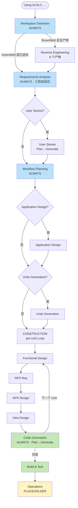

# AI-DLC 深度研究：把 SDLC 重写成 AI 可执行的 Markdown

**Date**: 2026-05-07
**Tags**: #aidlc #ai-coding #methodology #aws #claude-code #kiro #cursor #agentic-se
**Repo**: [awslabs/aidlc-workflows](https://github.com/awslabs/aidlc-workflows) v0.1.8 · ★1553

## 一句话定位

**AI-DLC = 一份 25KB 的 `core-workflow.md`，按各家 Agent 的约定拷进项目，立刻把这个 Agent 升级成"按 SDLC 流程执行 + 强制人审 + 全程审计"的工程化执行器。**

它不是 IDE、不是 SaaS、不是 CLI、不是 Agent，**是方法论作为代码**——SDLC 第一次以"AI 可直接执行 + 人可审批 + audit-loggable"的形式存在。

资料来源：
1. GitHub 仓库 `core-workflow.md` 25KB 单文件 + 扩展规则目录
2. Issue #182：AWS 官方对 "AIDLC vs Kiro Spec Mode" 的对比答复
3. AWS 内部首讲材料的销售口径（不是第三方测量）
4. 对照样本 [xg-gh-25/SwarmAI](https://github.com/xg-gh-25/SwarmAI)：同期出现、解同一痛点的另一种解法

---

## 1. AIDLC 的三个核心命题

### 命题 1：AI-Managed 和 AI-Assisted 都失败了

业界目前两种主流范式：

**AI-Managed**：业务意图直接喂给 AI，AI 自主开发，无 lifecycle。
- ❌ 不可靠、不可解释
- ❌ 开发者与代码"断联"——不知道写了什么、为什么这么写

**AI-Assisted**（Copilot 范式）：AI 在窄任务里打补丁，开发者承担智识重活。
- ❌ "Time saved in coding is **still lost** in other SDLC rituals"
- ❌ 编码省下的时间被需求/设计/测试/部署等环节吐回去

引用的反面证据是 METR.org：开发者用 AI 工具反而**慢 19%**。业界平均提速只有 10–15%——和厂商承诺差一个量级。

### 命题 2：AI-Driven 是第三条路

> AI **编排**整个开发流程（规划、任务分解、架构建议）。开发者保留**验证、决策和监督**的最终责任。

操作模型五步：

```
AI 拟定计划 ─▶ 人审计划 ─▶ AI 修订 ─▶ AI 执行 ─▶ 人审结果
              ↑ 阀门 1                          ↑ 阀门 2
```

口号：**Humans steer. Agents execute.**

### 命题 3：方法论必须 Agent-agnostic

AIDLC 的 5 条 Tenets：

| Tenet | 含义 |
|---|---|
| No duplication | 真相只在一处。新工具支持靠生成而非维护副本 |
| **Methodology first** | 是方法论不是工具。**用户不应该需要装任何东西就能用** |
| Reproducible | 规则要清晰到不同模型能产出相似结果 |
| Agnostic | 不绑 IDE / Agent / 模型 |
| Human in the loop | 关键决策必须人确认。Agent 提议，人批准 |

部署方式（一份规则文件，按各 Agent 约定拷贝）：

| Agent | 文件位置 |
|---|---|
| Claude Code | `CLAUDE.md` 或 `.claude/CLAUDE.md` |
| Cursor | `.cursor/rules/ai-dlc-workflow.mdc` |
| Kiro | `.kiro/steering/aws-aidlc-rules/` |
| Codex | `AGENTS.md` |
| Q Developer | `.amazonq/rules/aws-aidlc-rules/` |
| GitHub Copilot | `.github/copilot-instructions.md` |
| Cline | `.clinerules/core-workflow.md` |

触发：用户在 chat 里说 `Using AI-DLC, ...`，工作流自动接管。

---

## 2. 三阶段自适应工作流



### 2.1 INCEPTION（构建什么、为什么）

| 阶段 | 触发 | 关键产物 |
|---|---|---|
| Workspace Detection | ALWAYS | 判定 brownfield/greenfield、是否已有逆向产物 |
| **Reverse Engineering** | **brownfield only** | **8 个文档**：业务总览、架构图、代码结构、API、组件清单、跨组件交互图、技术栈、依赖图 |
| Requirements Analysis | ALWAYS | 三档自适应：minimal / standard / comprehensive |
| User Stories | CONDITIONAL | 多 persona / 跨工作流时执行 |
| Workflow Planning | ALWAYS | 决定后续哪些阶段执行、深度多少；输出 Mermaid 流程图 |
| Application Design | CONDITIONAL | 组件方法、业务规则、服务层 |
| Units Generation | CONDITIONAL | 拆"Unit of Work" 以便并行 |

**Reverse Engineering 的 8 产物**是接手老代码的 brownfield 项目最值得抄的部分——它把"AI 接手老代码"做成了固定流水线。

### 2.2 CONSTRUCTION（怎么构建，按 Unit 循环）

每个 Unit 5 个 stage，前 4 个 conditional，Code Generation 必跑：

```
For each Unit of Work:
  Functional Design     [CONDITIONAL]   数据模型 / 复杂业务逻辑
  NFR Requirements      [CONDITIONAL]   性能 / 安全 / 可扩展性 / 技术栈选型
  NFR Design            [CONDITIONAL]   把 NFR 落到具体设计模式
  Infrastructure Design [CONDITIONAL]   云资源映射 / 部署架构
  Code Generation       [ALWAYS]        Plan → Approve → Generate 两段式
End

Build and Test          [ALWAYS]        build / unit / integration / perf / e2e
```

**关键设计**：每个 Unit"设计 + 代码"完整闭环再进下一个，避免大爆炸式产出。

### 2.3 OPERATIONS

v0.1.8 还是 placeholder。规划中的功能：部署自动化、可观测性、事故响应、生产就绪检查。

---

## 3. 五条强制工程纪律（真正区分 AIDLC 和"普通 prompt 模板"）

### 3.1 Append-only 审计链 (audit.md)

ISO 8601 时间戳，append-only。规则原文：

> **CRITICAL**: 永远不要用会 overwrite 的工具修改 audit.md。Capture 用户的 COMPLETE RAW INPUT，**禁止 paraphrase 或 summarize**。

格式：
```markdown
## [Stage Name]
**Timestamp**: 2026-05-07T08:00:00Z
**User Input**: "完整的用户原话"
**AI Response**: "AI 的响应或动作"
**Context**: [Stage / decision]
---
```

### 3.2 状态机 (aidlc-state.md)

跟踪 stage 进度 + Extension enabled 状态。**用于 session 中断后续传**——这是 AIDLC 区别于"单 prompt → 单输出"范式的关键基础设施。

### 3.3 Extension 系统（context-optimized lazy loading）

`aws-aidlc-rule-details/extensions/` 下分类目录（`security/`、`testing/`），每个 extension 两个文件：

- `<name>.md` —— 完整规则
- `<name>.opt-in.md` —— 多选题形式开关

**Lazy load**：workflow 启动时**只加载 `*.opt-in.md`**，节省 context；用户 opt-in 后才加载完整规则。

**Blocking constraint**：opt-in 后的规则在每个 stage 都校验合规，**不合规 → stage 不能完成**。这是和"软建议"的本质区别。

内置：security/baseline、testing/property-based。

### 3.4 双层 Checkbox 强制

- Plan-level：每个 stage 内部步骤
- Stage-level：跨 stage 总进度（写在 `aidlc-state.md`）

规则原文：
> **NEVER complete any work without updating plan checkboxes**.
> 必须在**同一次交互内**勾选 [x]，不能延后。

### 3.5 标准化 2 选项完成消息

每个 stage 完成时，AI **只能** 给：

```
[Request Changes]   [Continue to Next Stage]
```

明令禁止"涌现出"3 选项菜单。语义在所有阶段保持一致——人审纪律可重复。

---

## 4. 文件系统布局（代码与文档严格分离）

```
<WORKSPACE-ROOT>/                   ⚠️ 应用代码在这里
├── [project-specific structure]    具体结构由 code-generation.md 决定
│
├── CLAUDE.md / AGENTS.md / .kiro/...   AIDLC 规则入口
├── .aidlc-rule-details/                Extension 详情
│   ├── common/  inception/  construction/
│   ├── extensions/  operations/
│
└── aidlc-docs/                     📄 仅放文档，不放代码
    ├── inception/
    │   ├── plans/
    │   ├── reverse-engineering/    Brownfield 才有
    │   ├── requirements/
    │   ├── user-stories/
    │   └── application-design/
    ├── construction/
    │   ├── plans/
    │   ├── {unit-name}/            每个 Unit 一个目录
    │   │   ├── functional-design/
    │   │   ├── nfr-requirements/
    │   │   ├── nfr-design/
    │   │   ├── infrastructure-design/
    │   │   └── code/               ⚠️ 只放 Markdown 总结
    │   └── build-and-test/
    ├── operations/                 placeholder
    ├── aidlc-state.md              状态机
    └── audit.md                    审计链
```

---

## 5. 和 Kiro Spec Mode 的对比（Issue #182 官方答复）

| 维度 | Kiro Spec Mode | AI-DLC |
|---|---|---|
| 阶段数 | 3 个固定 (req/design/tasks) | **13+** 个，自适应跳过 |
| 支持 Agent | 仅 Kiro | Kiro / Q / Claude Code / Cursor / Cline / Copilot / Codex / 任意 markdown rules |
| 可定制 stage / 提示词 | ❌ 写死 | ✅ 可加减、写自定义 extension |
| Brownfield 支持 | Steering files 提供上下文 | **专门 Reverse Engineering 阶段（8 产物）** |
| 审计链 | 无 | append-only audit.md + ISO 8601 |
| CI/CD 集成 | 无 | GitHub Actions + 自动 evaluator |
| NFR / Infra 独立设计 | 无 | per-unit 独立 stage |
| 组织治理 / Extension | 无 | 内置 security / testing |

**官方指引**：

> 当需要 **Agent 可移植性、深度设计阶段（NFR / Infra / 多 Unit）、组织级治理（extension）、可复现审计链** 时，用 AIDLC 替代 Kiro spec mode；只在 Kiro 内快速 prototype 用 spec mode 即可。
>
> 它们**可组合**：把 AIDLC 装进 `.kiro/steering/` 就替换或增强 Kiro 内置 spec mode。

注意：Kiro IDE 里要选 **Vibe mode** 而不是 spec mode，否则 Kiro 会持续 nudge 切回 spec mode。

---

## 6. 和 Claude Code 是叠加关系

Claude Code 本身是"裸 agent + tools + 文件系统访问"，没有 SDLC 流程概念。AIDLC 把 `core-workflow.md` 拷成项目根的 `CLAUDE.md`（或 `.claude/CLAUDE.md`），就把 Claude Code 升级成 AIDLC 执行器：

```
[Claude Code 裸态]
  user prompt → tool calls → file edits

[Claude Code + AIDLC]
  user "Using AI-DLC, ..." 
    → 强制 INCEPTION → 强制人审 plan
    → 强制 audit.md log → 强制 2-option 完成消息
    → CONSTRUCTION 按 Unit 循环
    → 每一步双层 checkbox 跟踪
```

**Claude Code 原生 plan mode vs AIDLC workflow plan**：
- Plan mode 只是单次任务的规划展示
- AIDLC 的 plan 是**跨多 stage、可复用、可恢复（aidlc-state.md）、可审计（audit.md）**的状态机

---

## 7. 和 SwarmAI 是正交关系

`xg-gh-25/SwarmAI` 是同期出现的另一种解法。差异：

| 维度 | AI-DLC | SwarmAI |
|---|---|---|
| **形态** | Markdown 规则包，0 安装 | 完整桌面应用（Tauri + React + FastAPI），launchd daemon |
| **解决的问题** | **单次开发的 SDLC 流程缺失** | **跨 session 的记忆遗忘 + AI 不会自我改进** |
| **持久化** | `aidlc-docs/` + `audit.md`（人可读文档）| 4 层记忆 + FTS5 + sqlite-vec + 1500+ session 转写 |
| **核心机制** | INCEPTION → CONSTRUCTION → OPS 三段 + 强制人审 | 6 飞轮：Self-Evolution / Self-Memory / Self-Context / Self-Harness / Self-Health / Self-Jobs |
| **自动化粒度** | AI 提议 + 人批准（每 stage）| EVALUATE → THINK → PLAN → BUILD(TDD) → REVIEW → TEST → DELIVER → REFLECT 8 段 pipeline |
| **是否可叠加** | ✅ 是任意 Agent 之上的"流程层" | SwarmAI 底层是 Claude Agent SDK + Opus 4.6，理论上可在 SwarmAI 项目里再装 AIDLC |
| **目标用户心智** | 工程团队/PM/SA：方法论、合规、可审计 | 个人/小团队：长期 compound、个性化、记忆 |

**两个工具不是竞争是邻居**：

- **AIDLC**：把"这一次开发"做对（流程纪律）
- **SwarmAI**：让"第 50 次会话比第 1 次聪明"（记忆 + 自进化）

---

## 8. 和其他主流 AI 编码工具的横向对比

| 工具 | 流程纪律 | 跨会话记忆 | 多 Agent 支持 | 组织治理 |
|---|---|---|---|---|
| **AIDLC** | ⭐⭐⭐⭐⭐ 13+ stage + 强制人审 + audit | ⭐ aidlc-state 仅状态机 | ⭐⭐⭐⭐⭐ Agnostic | ⭐⭐⭐⭐ Extension 系统 |
| Kiro Spec | ⭐⭐⭐ 3 stage 固定 | ⭐ Steering files | ⭐ 仅 Kiro | ⭐ 无 |
| Claude Code | ⭐⭐ 仅 plan mode + skills | ⭐⭐ 手维护 CLAUDE.md / memory | ⭐ 仅 Claude | ⭐ 无 |
| Cursor | ⭐⭐ rules 文件 | ⭐⭐ rules + .cursor | ⭐ 仅 Cursor | ⭐ 无 |
| Copilot | ⭐ 几乎无 | ⭐ copilot-instructions.md | ⭐ 仅 VSCode | ⭐ 无 |
| Codex | ⭐⭐ AGENTS.md 约定 | ⭐⭐ AGENTS.md | ⭐ 仅 Codex | ⭐ 无 |
| **SwarmAI** | ⭐⭐⭐ 8 段 pipeline | ⭐⭐⭐⭐⭐ 4 层记忆 + 转写 | ⭐ 单 runtime | ⭐⭐ skill 系统 |

---

## 9. 客户案例（AWS 内部销售口径，非第三方）

| 客户 | 行业 | 工程量 | 时长 | AIDLC 角色 |
|---|---|---|---|---|
| **HackerRank** ($500M, 250 人) | 技术招聘 | AI 监考微服务（眼动/物体/三角面）+ UI + 报告 | 2 天搭原型，4 周上 prod | 全流程 |
| **Razorpay** ($7.5B, 2700 人) | 印度金融科技 | PHP 单体 → Go 微服务（多租户重构 + 4 微服务的 2 个） | 2 天 | 现代化蓝图 |
| **Dhan** | 印度券商 | 6 个核心模块到 pre-prod | **48 小时**完成原计划 2 个月 | 跨工程/产品协同 |
| **Healthcare Payer** | 美国医保 | DDD 驱动的 Production 平台 | 20 小时 | 3 地远程团队 + Amazon Q |

**AWS 自报指标**：

| 指标 | 传统 SDLC | AIDLC | 改善 |
|---|---|---|---|
| Cycle Time | 周到月 | 小时到天（"Bolts"颗粒）| 30–50% 缩短 |
| Defect Rate | 波动 | 一致 | 25–40% 减少 |
| Developer Satisfaction | 传统 | 战略聚焦 | 20–35% 提升 |
| Iteration | Sprint（周）| Bolt（小时/天）| 持续流 vs 批次 |

**数据可信度**：销售口径，非第三方测量。建议看作"在咨询 + workshop 配合下的最佳案例"，不是日常基线。

---

## 10. 真正的野心：组织变革，不是工具

AIDLC 不只是工程方法，它要重写每个 SDLC 角色的工作内容：

| 角色 | 传统职责 | AIDLC 增强职责 | 时间转移 |
|---|---|---|---|
| **PM/PO** | 写详细需求、协调团队、写 user story | 验证 AI intent 拆解、批准 AI 提议的 Units 和 Bolts、精化 AI 生成的 PRFAQ/NFR | 重文档 → 战略验证 |
| **Developer** | 按需求写代码、手测调试、专业边界 | 验证 AI domain model、批准架构决策、实时协同验证 | 深度专业 → AI 协作 + 验证专长 |
| **Solutions Architect** | 设计架构、写技术规范、人工选型 | 验证 AI 逻辑设计、批准 AI 推荐模式、引导 AI 做 AWS 服务映射 | 个人架构 → AI 辅助协同 |
| **QA Engineer** | 手写用例、人工执行测试、bug 跟踪 | 验证 AI 测试场景、批准 AI 测试结果、引导测试优化 | 反应式 → AI 驱动主动质量 |
| **DevOps** | 手工 pipeline、infra 管理、监控告警 | 验证 AI 部署单元、批准 AI infra 推荐、引导运维洞察 | 反应式 → AI 主动运维 |

新概念：

- **Mob Elaboration**：跨职能群体精化取代职能孤岛——PO/Dev/BA/QA/Ops 一起在 INCEPTION 阶段
- **Mob Construction**：未来开发者"以判断的速度迭代"，从"ticket 到 code"升级为"商业雄心到 code"
- **Bolts**：完整的 intent → 可部署单元的最小颗粒（小时/天级）

---

## 11. 我的判断

### 11.1 真正的创新点不是阶段划分

瀑布、RUP、SAFe、Agile 都拆过 13+ 阶段。AIDLC 的关键创新是：

> **把"阶段"重写成 AI 可执行 + 人审批 + audit-loggable 的 markdown rule，让任意支持 rule 文件的 Agent 立刻获得相同的工程纪律。**

这是"**方法论作为代码**"——SDLC 第一次以可被 AI 直接执行的形式存在。

### 11.2 最强的护城河也是最弱的依赖

Agent-agnostic 是它的卖点，但只要厂商改了 rule 加载机制（Kiro 推 spec mode、Claude Code 改 CLAUDE.md 行为、Cursor 改 mdc 格式），AIDLC 就要打补丁。这也解释了为什么 README 里有 7 种 Agent 的 setup 步骤——维护成本不低。

### 11.3 自报数据 (30–50%) 与 METR (−19%) 的张力

这是 AIDLC 最微妙的地方：

- 它**承认**了 AI-Assisted 模式失败
- 它**给出**的对策是"加流程纪律"
- 但流程纪律本身的成本（需求阶段、设计阶段、人审阀门、audit 维护）也很高

**开放问题**：在多大规模 / 多复杂的项目上，AIDLC 的"流程开销"才被"减少返工"抵消？小型一次性脚本几乎肯定不需要 13 个 stage。AIDLC 的 "adaptive depth"（minimal/standard/comprehensive）就是在尝试解决这个问题，但实际效果需要 longitudinal study。

### 11.4 和学界 agentic SE 反思的方向一致

近一年学界（Voyager、SWE-agent、AlphaCode、recent reasoning + reflection 论文）都在指出：单 prompt → 单输出 范式在复杂工程任务上失败，需要 reasoning + reflection + memory + structured tool use。

AIDLC 是工业界对这个反思的工程化回应——它不研究模型怎么 reflect，但它**强制把 reflection 拆成显式 stage 和审批阀门**。

### 11.5 适用与不适用

**适合**：
- 有合规/审计需求的企业（金融、医疗、政府）
- 接手老代码的 brownfield 项目（reverse engineering 8 产物很值钱）
- 跨地理 / 跨职能远程协同的团队（audit.md 自动同步上下文）
- 想给团队建立"AI 编码 SOP"的工程组织

**不适合**：
- 一次性脚本 / 个人 hack
- 探索性研究（边写边改思路）
- 不需要审计的小团队迭代项目

---

## Open Questions

1. AIDLC 在不同 Agent（Claude vs Q vs Codex）上的产出差异——号称 reproducible，实际多大方差？
2. `audit.md` append-only 一年后会不会膨胀到模型 context 装不下？是否需要分片归档机制？
3. Extension 系统当前只内置 security/testing，组织级合规（SOX、HIPAA、GDPR）有没有 marketplace？
4. Operations 阶段什么时候不再是 placeholder？AWS 是否会把 AgentCore / CodeCatalyst 接入？
5. 和 SwarmAI 这种"runtime 记忆层"组合使用的最佳实践是什么？
6. METR 的 −19% 实验如果改用 AIDLC 重测，提速能到多少？

---

## References

- **Repo**: <https://github.com/awslabs/aidlc-workflows> (v0.1.8, ★1553)
- **Core workflow**: <https://raw.githubusercontent.com/awslabs/aidlc-workflows/main/aidlc-rules/aws-aidlc-rules/core-workflow.md>
- **Method paper**: <https://prod.d13rzhkk8cj2z0.amplifyapp.com/>
- **AWS blog**: <https://aws.amazon.com/blogs/devops/ai-driven-development-life-cycle/>
- **Issue #182** (vs Kiro Spec): <https://github.com/awslabs/aidlc-workflows/issues/182>
- **SwarmAI** (对照): <https://github.com/xg-gh-25/SwarmAI>
- **METR negative result**: METR.org
- **Kiro Steering**: <https://kiro.dev/docs/cli/steering/>
- **Kiro Specs**: <https://kiro.dev/docs/specs/>
