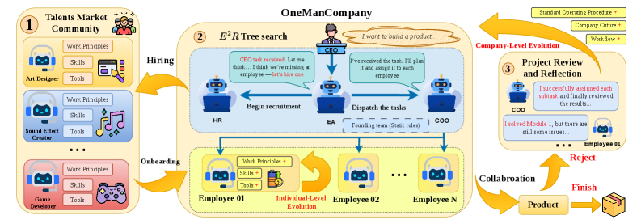
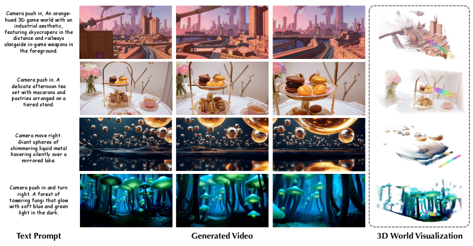
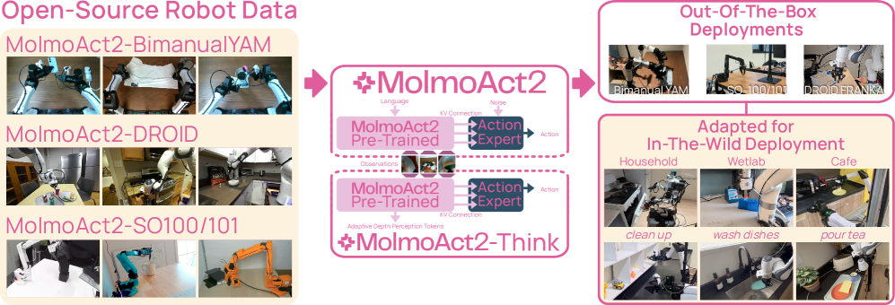
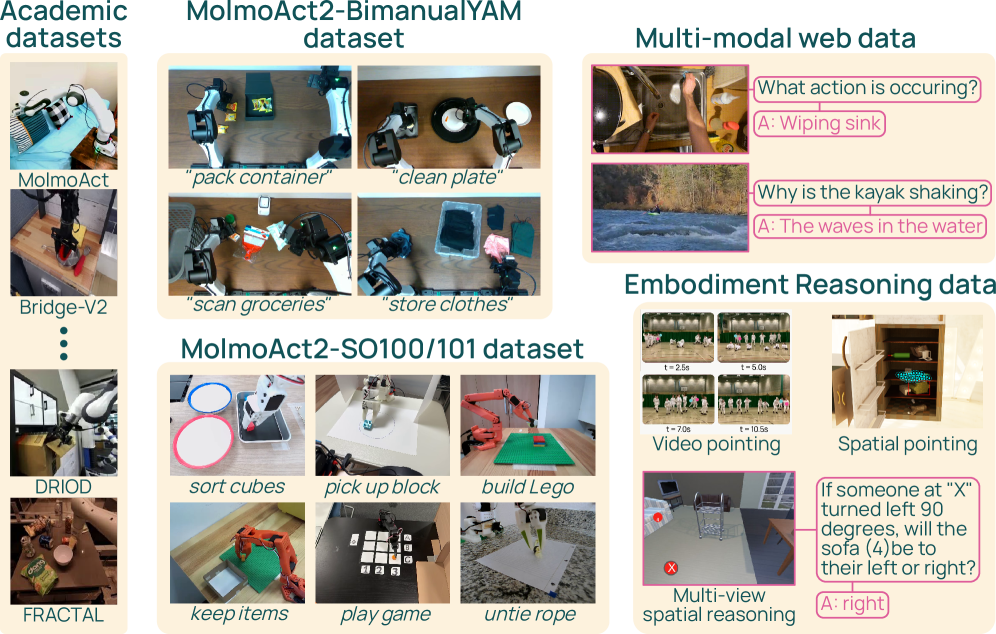
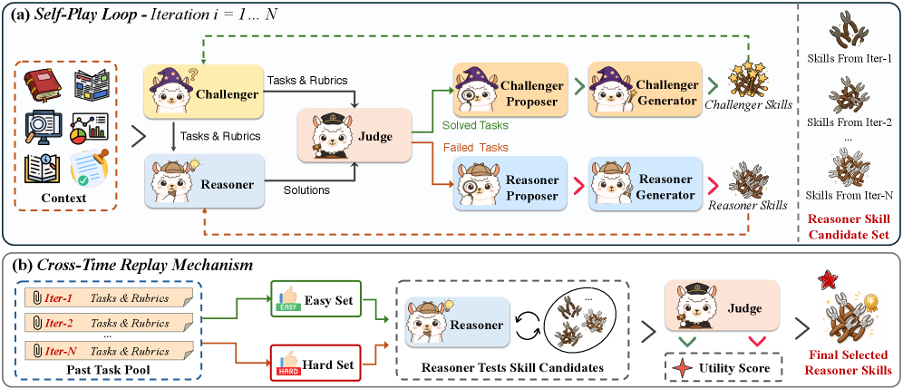
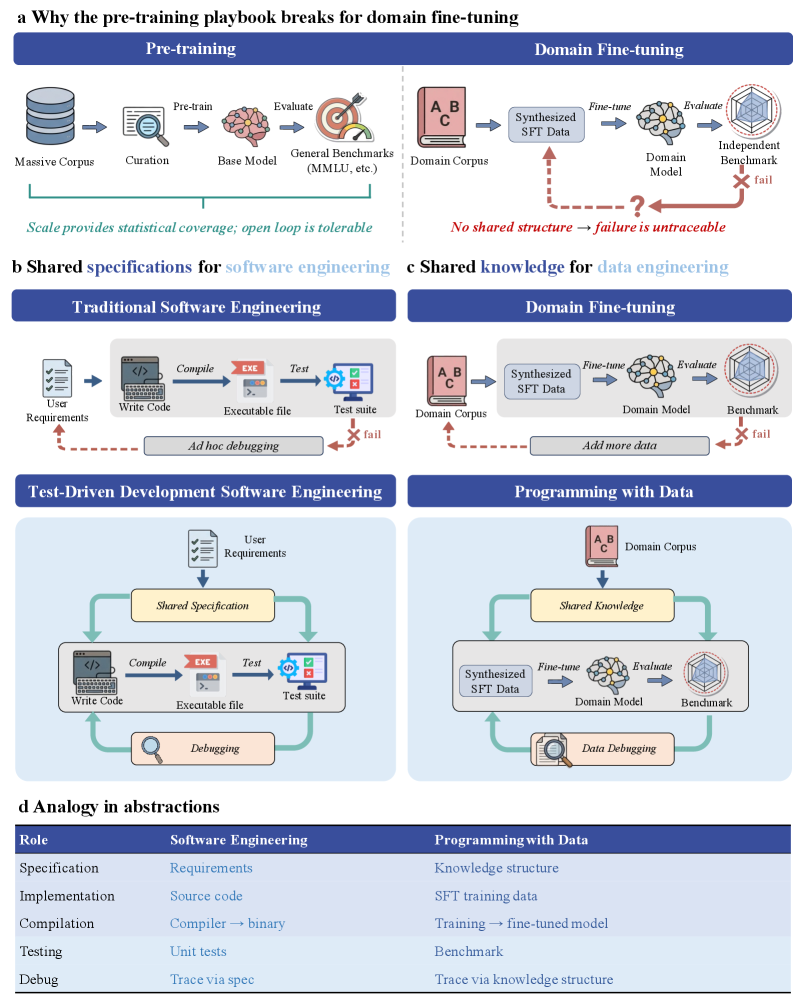
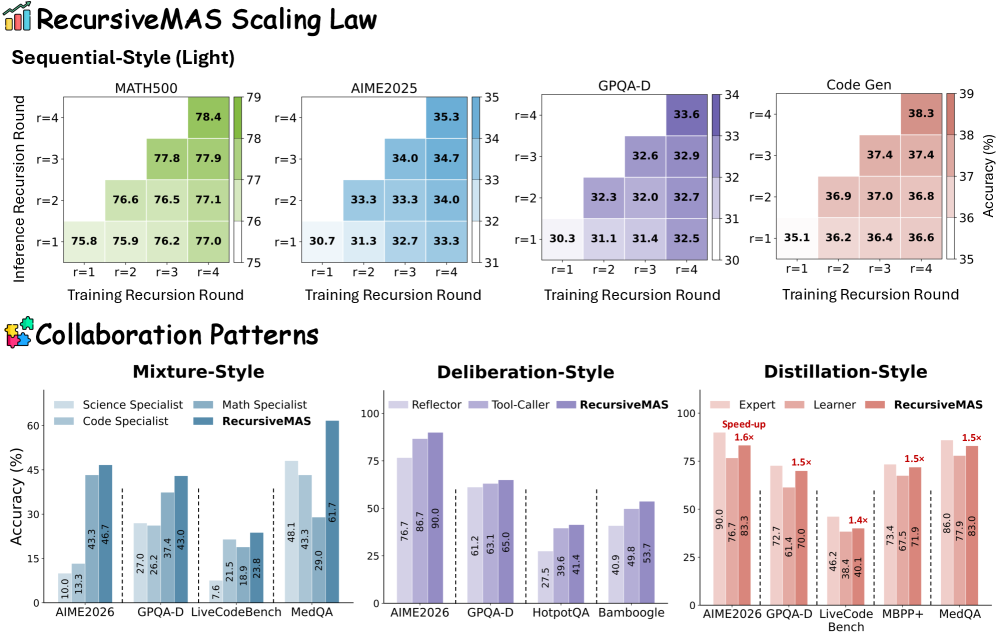
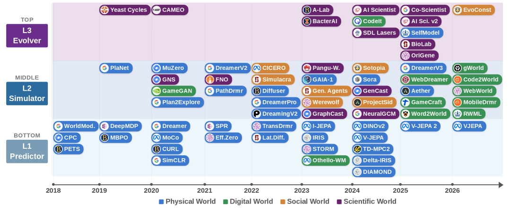

# Hugging Face Daily Papers 深度解读 (2026-04-25 ~ 2026-05-07)

- **Date:** 2026-05-07
- **Tags:** #hf-daily-papers #weekly-digest #multi-agent #world-model #vla #scientific-fm #multimodal

## Context

本期覆盖 **2026-04-25 ~ 2026-05-07** 共 13 天（HF API 在 4-25/4-26 和 5-2/5-3 周末未返回数据，实际有效日期 9 天），合计 **约 200 篇**入选 Daily Papers，本文精选 **22 篇高影响论文**，按主题归类详解，并对其中 6 篇做深度解读：RecursiveMAS、Agentic World Modeling 综述、MolmoAct2、Heterogeneous Scientific FM (Eywa)、Ctx2Skill、ProDa。

> 与上一期 `2026-04-24-hf-daily-papers-apr14-24.md` 衔接，已剔除重复论文。本期最显著的趋势是：**Agentic 系统从 "工具 + 提示工程" 向 "组织/递归/skill 自演化" 跃迁**，World Model 从图像生成走向"可决策、可演化"的三层能力分层，VLA 模型迎来全开源里程碑（MolmoAct2）。

---

## 论文总览（精选 22 篇）

| ID | 标题 | 主题 | Upvotes | 主要贡献 |
|---|---|---|---|---|
| **2604.25917** | Recursive Multi-Agent Systems | 多智能体/Latent | **258** | 把 MAS 转成 latent 空间的递归循环，token ↓75.6% / 速度 ×2.4 |
| **2604.22748** | Agentic World Modeling: Foundations, Capabilities, Laws | World Model 综述 | **224** | L1/L2/L3 能力 × 4 律 (物理/数字/社会/科学) 分类法，覆盖 400+ 论文 |
| **2604.27351** | Heterogeneous Scientific FM Collaboration (Eywa) | 科学 FM | **206** | 用 LLM 给非语言科学基础模型加"语言推理接口"，跨模态协作 |
| **2605.02881** | MolmoAct2: Action Reasoning Models | VLA/机器人 | **201** | 全开源 VLA：3.3M 空间-具身语料 + 720h 双臂遥操，超越 π_0.5 |
| **2604.27660** | From Context to Skills: Ctx2Skill | Skill / Context Learning | **137** | 自博弈循环从长上下文中无监督发现 skill，GPT-5.1 +4.6pp |
| **2604.22446** | From Skills to Talent: OneManCompany | Agent 组织 | **120** | Talent + Container + E²R 树搜索，PRDBench 84.67% (+15.48pp) |
| **2604.24764** | World-R1: Reinforcing 3D Constraints for T2V | 3D 视频生成 | **116** | 用 3D FM 做 reward 给 T2V 注入几何一致性，PSNR +10.23dB |
| **2604.26752** | GLM-5V-Turbo | 多模态 Agent 基础模型 | **97** | CogViT + MMTP，多模态 RL 跨 30+ 任务，OSWorld 62.3 |
| **2604.28185** | Visual Generation in the New Era (综述) | 视觉生成 | **86** | 从原子映射到 agentic world modeling 演进路线 |
| **2604.24819** | Programming with Data (ProDa) | 数据工程 | **86** | 把 fine-tune 视为 "test-driven 软件工程"，闭环修复 |
| **2604.27083** | Co-Evolving Policy Distillation | RL 蒸馏 | 61 | Teacher/Student 同步进化的策略蒸馏 |
| **2604.27505** | Verifier-Based RL for Image Editing | 图像编辑 RL | 55 | 利用验证器做奖励，提升精确编辑能力 |
| **2604.24300** | ReVSI: VLM 3D Reasoning Eval | VLM 评测 | 64 | 重建 VLM 空间智能评测 |
| **2604.24763** | Tuna-2: Pixel Embeddings for Multimodal | 多模态架构 | 68 | Pixel embeddings 替代 vision encoder |
| **2604.26904** | ClawGym: Effective Claw Agents | Agent Harness | 49 | 可扩展的 Claw 代理构建框架 |
| **2604.26951** | TIDE: Cross-Architecture Diffusion Distillation | 扩散蒸馏 | 46 | Transformer ↔ Diffusion LLM 跨架构蒸馏 |
| **2604.26067** | RADIO-ViPE: Open-Vocabulary Semantic SLAM | SLAM | 73 | 多模态融合开放词表语义 SLAM |
| **2604.24927** | LLMs Explore by Latent Distilling | RL/Exploration | 71 | 在 latent 空间进行探索蒸馏 |
| **2604.28139** | Claw-Eval-Live | Agent Eval | 37 | 持续演进的实时 Agent 基准 |
| **2604.28158** | Intern-Atlas: Methodology Graph for AI Scientists | AI 科学家 | 45 | 把研究方法演进画成图，作为 AI 科学家基础设施 |
| **2605.03042** | ARIS: Adversarial Multi-Agent Research | AI 自研 | 83 | 对抗式多 Agent 协作做自动研究 |
| **2605.04036** | OpenSeeker-v2 | 搜索 Agent | 51 | 开源搜索 Agent 训练轨迹与方法 |

---

## 一、多智能体与 Agent 组织（最大热点）

### 1.1 RecursiveMAS（深度解读 §A）
首次把"递归语言模型 (RLM)"的 scaling 思想搬到多智能体系统：每个 Agent 当作 RLM 的一层，通过轻量级 RecursiveLink 在 latent 空间循环。9 个 benchmark 上平均 +8.3% 准确率、token 减少 34.6%–75.6%、速度 ×1.2–2.4。

### 1.2 OneManCompany (OMC)
HUAWEI Noah's Ark + UCL 提出"AI 公司"抽象层：
- **Talent**：可移植的 Agent 身份（角色/Prompt/Skill/工具）
- **Container**：异构后端（LangGraph、Claude Code、Script）的运行时
- **E²R 树搜索**：Explore-Execute-Review 形式化保证终止性与无死锁
- **Talent Market**：社区驱动的 Agent 招聘市场
- 在 PRDBench 上单次零样本达到 **84.67%**，比当前 SOTA 高 **15.48pp**

> 
> *图：OMC 把多 Agent 系统组织成"公司"——CEO 接需求，Talent Market 招人，E²R 树做项目分解*

**关键洞察**：Skills 回答 "Agent 能干什么"，MAS 回答 "Agent 怎么交互"，**AI 组织**回答 "如何自治地组装、管理、演化 Agent 工作团队"——这是 Agent 系统的下一层抽象。

### 1.3 Recursive 与 Organizational 两条路线对比

| 维度 | RecursiveMAS | OneManCompany |
|---|---|---|
| 抽象层级 | latent 计算流 | 人类组织流程（HR/Review） |
| 通信媒介 | hidden state | 结构化协议 + DAG |
| 优化方式 | 反向传播 RecursiveLink | SOP 演化 + Talent 市场 |
| 目标场景 | 数学/科学/代码 | 软件项目级 PRD |

两者代表了"latent 数学化"和"系统工程化"两种 MAS scaling 范式。

### 1.4 ARIS（2605.03042，83 upvotes）
Adversarial Multi-Agent 协作做自动科研：让 Agent 互相挑战自己的论点和方法，能在 AutoResearchBench 上提升科学发现质量。与 Ctx2Skill 思路相通——**自博弈正在成为后训练 Agent 的主流范式**。

---

## 二、World Model 与视觉生成

### 2.1 Agentic World Modeling 大综述（深度解读 §B）
HKUST + NUS + Oxford 联合 30+ 学者撰写的"立场+综述"巨作，覆盖 400+ 论文，提出 **L1/L2/L3 能力 × 物理/数字/社会/科学 4 律** 二维分类法，把 RL imagination、视频生成、Web Agent、多 Agent 模拟、AI for Science 统一到同一坐标系。

> 

### 2.2 World-R1（116 upvotes）
解决"视频基础模型缺 3D 一致性"问题，思路非常巧妙：
- **不**改架构、**不**用 3D 数据集
- 用**预训练 3D 基础模型 + VLM 当 critic** 构造 reward
- 用 **Flow-GRPO** 优化 T2V 模型
- PSNR 提升 **10.23dB / 7.91dB**，且不损失原有视觉质量

> 

**关键启发**：当数据稀缺/昂贵时，用"已有强模型当裁判"的 RL 后训练，是把 capability 注入 base model 的高性价比路径。

### 2.3 RADIO-ViPE（73 upvotes）
在线紧耦合多模态融合的开放词表语义 SLAM，针对动态环境，可作为 L2 Simulator 的物理感知前端。

### 2.4 Visual Generation 综述（86 upvotes）
从 atomic mapping 到 agentic world modeling 的演进路线，可与 §B 综述互为补充。

---

## 三、Vision-Language-Action（VLA）与机器人

### 3.1 MolmoAct2（深度解读 §C）
Allen AI + UW + 多家高校联合发布的**完全开源** VLA：
- **Molmo2-ER VLM 后端**：3.3M 样本空间-具身语料，13 项 ER benchmark 中 9 项超越 GPT-5 / Gemini Robotics ER-1.5
- **三个数据集开源**：720h 双臂 YAM (最大开源双臂数据集)、DROID 过滤子集、SO-100/101 子集
- **OpenFAST tokenizer**：开源动作分词器，5 种本体百万轨迹训练
- **新架构**：Flow-matching 连续动作专家通过 per-layer KV-cache 嫁接到离散 token VLM
- **MolmoAct2-Think**：自适应深度推理——只对场景中变化区域重新预测 depth tokens
- 在 7 个真实/仿真 benchmark 全面超越 π_0.5

> 

> 

**意义**：这是 robotics 领域第一个**模型权重 + 训练代码 + 完整训练数据**全开源、且在 14 个 benchmark 全面 SOTA 的 VLA。720h 双臂数据 + $6000 标准化采集套件，让学术界终于有了与商用 π_0.5 / Helix 同台竞技的基础。

### 3.2 Tuna-2（68 upvotes）
"Pixel Embeddings 击败 Vision Encoder"——直接把图像作为 token 序列输入 LLM，简化多模态架构，对后续 unified model 设计有启发。

---

## 四、Skill 与 Context Learning

### 4.1 Ctx2Skill（深度解读 §D，137 upvotes）
THU + DeepLang + UIUC + FDU + CUHK 联合工作，回答**"语言模型能否从上下文中熟练地学习"**：
- 用 **Challenger / Reasoner / Judge / Proposer / Generator** 五个 frozen-LM 角色构成自博弈循环
- 通过 **失败驱动的文本编辑**协同进化两套 skill set
- **Cross-Time Replay** 机制对抗"对抗坍缩" (Challenger 越来越极端 → Reasoner 过特化)
- 在 CL-Bench 上：GPT-4.1 11.1% → 16.5%, GPT-5.1 21.2% → **25.8%**

> 

### 4.2 与"Skills to Talent" 的 Skill 概念对比
| 概念 | Ctx2Skill 的 skill | OMC 的 Talent |
|---|---|---|
| 粒度 | 上下文特定的规则文档 | 完整 Agent 身份 |
| 来源 | 自博弈失败诊断 | 社区市场 + 招聘 |
| 持久性 | 一次性 / 上下文绑定 | 跨项目复用 |
| 参数 | 不更新模型参数 | 不更新模型参数 |

两者代表了 skill 的**动态发现**和**静态市场**两条路线。

---

## 五、数据工程与训练范式革命

### 5.1 ProDa: Programming with Data（深度解读 §E，86 upvotes）
浙大 + UCAS + 上海 AI Lab 提出**"测试驱动数据工程"**范式：
- 数据 → 代码，训练 → 编译，benchmark → 单元测试，failure → debug
- 三层知识结构：**L1 概念 / L2 关系 / L3 推理链**作为 corpus 的"shared specification"
- 失败可追溯到具体的 L1/L2/L3 节点，**针对性修补**而非盲目堆数据
- 16 学科 / 227k 概念 / 16k 评测 / 160k 训练样本全部开源
- 32B 开源模型在 16 学科平均**超过 GPT-5.4 / Gemini-3-flash / DeepSeek-v3.2**，且 MMLU/CEVAL 通用能力不退化

> 

**核心洞察**：当前 LLM 微调采用的还是 pretrain 时代"开环"打法（失败就堆更多数据）；ProDa 提出的"shared knowledge representation 让 train ↔ eval 互相索引"是 domain fine-tune 进入工程化的关键缺失环节。

### 5.2 Co-Evolving Policy Distillation（61 upvotes）
Teacher 与 Student 同步进化做策略蒸馏，跟 Ctx2Skill 的双方共进化思路相通。

---

## 六、深度解读

### §A. RecursiveMAS：把多 Agent 系统压缩到 Latent 循环

**核心问题**：传统 MAS 用文本通信存在两个瓶颈：
1. 文本解码-编码的反复开销 → 推理慢
2. 文本-SFT 训练时梯度消失 → 难全系统协同优化

**关键创新**：

#### A1. RecursiveLink (轻量两层投影)

- **Inner Link**: `R_in(h) = h + W_2 σ(W_1 h)` — 在单 Agent 内部把上一步 last-layer hidden 反馈到下一步 input embedding，省去 detokenize/retokenize
- **Outer Link**: `R_out(h) = W_3 h + W_2 σ(W_1 h)` — 跨异构 Agent 把 hidden 投影到目标 Agent 的 embedding 空间

#### A2. Inner-Outer Loop 训练

- **冻结所有 LLM 参数**，仅训 RecursiveLink
- Inner loop: cosine 相似度对齐每个 Agent 的 latent thought
- Outer loop: 在循环结构上 unroll n 轮，最后做 CE 监督，梯度 share-credit 回所有 outer link

#### A3. 理论保证

- **复杂度**：text-based MAS 含 `O(m|V|d_h)` 词表投影项，RecursiveMAS 替换为 `O(m d_h²)`
- **梯度稳定性**（定理 4.1）：text-SFT 在低熵 token 时梯度范数趋零（`O(ε)`），而 RecursiveLink 保证梯度范数 `≥ 1 - √(1/d_h · log(1/δ))`

#### A4. 实验亮点（9 个 benchmark × 4 种协作模式）

| Recursion 轮数 | 文本 MAS Acc | RecursiveMAS Acc | 提速 | Token ↓ |
|---|---|---|---|---|
| r=1 | base | +3.4 pp | ×1.2 | 34.6% |
| r=2 | base | +6.0 pp | ×1.9 | 65.5% |
| r=3 | base | +7.2 pp | **×2.4** | **75.6%** |

> 

**意义**：当 Agent 数量和递归深度成为新的 scaling 维度时，**latent 通信成为 MAS 的"高速公路"**。这与 Coconut、CoT-in-latent-space 等工作呼应——latent 不仅可以压缩 reasoning，也可以压缩 collaboration。

---

### §B. Agentic World Modeling 综述：用"能力 × 律"重塑碎片化领域

**问题**：World Model 一词在 RL、CV、Robotics、Language Agents、AI for Science 五个社区有完全不同的含义——同一个工作可能被某社区视为 SOTA，另一个社区认为根本不是 World Model。

**解决方案**：二维分类法

#### B1. 三层能力 (L1 → L2 → L3)

- **L1 Predictor**：一步局部 Markov 转移（如 next-frame prediction、next-token prediction）
- **L2 Simulator**：多步 action-conditioned rollout，必须**遵守领域定律**（如机器人物理仿真、Web 状态机）
- **L3 Evolver**：当预测失败时，**自主修正自己的模型** —— 真正的 closed-loop 科研发现

#### B2. 四种"律" (Governing Laws)

- **物理律**：感知/操作/导航 → 解析或仿真器可验证
- **数字律**：程序语义、Web/GUI 状态机
- **社会律**：信念、目标、规范、对话
- **科学律**：潜在机制、实验观测，**必须经验验证**

#### B3. 关键 framing

- L1/L2/L3 **不是模型类别**，而是 **agent 在某一刻调用的能力**——同一系统在不同任务可调用不同 level
- 物理律 vs 科学律的关键差异：**约束如何被访问**——物理可解析/仿真验证，科学只能经验验证
- L3 Evolver 是真正的"水位线"——目前只有 Co-Scientist、AI Scientist 等极少数系统达到

> 

**为什么重要**：这是首篇尝试**统一 RL imagination + 视频 World Model + Web Agent + 社会模拟 + AI for Science**的综述，给后续工作提供了通用坐标系（"我做的是 L2 物理 World Model" vs "L3 科学 World Model"），有望减少社区间的"鸡同鸭讲"。

---

### §C. MolmoAct2：第一个真正"完全开源 + 实用部署"的 VLA

**挑战**：当前 VLA 四大短板：
1. 前沿 VLA (π_0.5、Gemini Robotics) 模型 + 数据 + 训练 recipe 全闭源
2. 显式 reasoning (CoT、predicted goal images) 推理太慢，闭环控制无法用
3. 开源 VLA 绑定昂贵硬件
4. 微调后成功率仍低于可靠部署阈值

**MolmoAct2 五轴改进**：

#### C1. Molmo2-ER VLM 后端
- 从 Molmo2 (Qwen3-4B) 出发，**specialize-then-rehearse** 两阶段配方
- 3.3M 空间-具身语料：6 大能力 (image embodied QA / video / pointing / detection / multi-image / abstract)
- 结果：13 项 ER benchmark 中 **9 项**超越 GPT-5 + Gemini Robotics ER-1.5，平均 63.8% (比 Molmo2 +17 pp)

#### C2. 三个开源数据集
- **MolmoAct2-BimanualYAM**：720h 双臂遥操，34.5k 演示，28 种真实任务，**$6000 标准化采集套件**
- **MolmoAct2-DROID**：74,604 episodes，1,775 万帧
- **MolmoAct2-SO100/101**：1,222 个社区数据集 + 4 阶段过滤管线

#### C3. OpenFAST Tokenizer
- 开源 FAST 重实现 + 训练数据全公开
- 5 种本体百万轨迹，把 1 秒 32 维连续动作压成离散序列

#### C4. 新架构：Flow-matching 动作专家 + per-layer KV-cache
- 离散 token VLM 后端 + 连续动作专家通过**每层 KV cache 条件**耦合
- 既保留 VLM 的语义能力，又能输出高频连续控制

#### C5. MolmoAct2-Think 自适应推理
- 只对场景中**变化区域**重新预测 depth tokens
- 利用轨迹时间冗余降低延迟，保留几何 grounding 收益

**实验**：
- 7 个仿真+真实 benchmark **全面**超越 π_0.5
- 直接 zero-shot 部署在双臂 YAM、SO-100/101、DROID Franka
- 8 个真实 YAM 任务（叠衣服、解电缆、收拾桌子、扫码、装药）显著领先

**意义**：这是机器人领域的"DeepSeek 时刻" —— 学术界第一次拿到了一个**模型/代码/数据**完全开源、且在标准 benchmark 全面 SOTA 的 VLA。下一个 6 个月会涌现大量基于 MolmoAct2 的衍生工作。

---

### §D. Ctx2Skill：从上下文中无监督发现 Skill

**问题陈述**：Context Learning（让模型从未见过的上下文中学习并解题）面临两难：
- **(1)** 长技术文档手工标注 skill 不现实
- **(2)** 缺乏外部反馈信号判断 skill 是否抓到关键

**Ctx2Skill 解法**：5 角色自博弈循环

| 角色 | 职责 |
|---|---|
| **Challenger** | 基于 context 生成探针任务 + rubric |
| **Reasoner** | 在当前 skill 集指导下解题 |
| **Judge** | 二元判定每条 rubric 是否通过 |
| **Reasoner Proposer** | 分析失败案例，诊断"缺什么 contextual 知识" |
| **Reasoner Generator** | 把诊断物化成新 skill 文档 |
| **Challenger Proposer/Generator** | 镜像角色：让 Challenger 持续施压 |

#### D1. 关键风险与对策："Adversarial Collapse"
- 随迭代进行，Challenger 越来越极端 → Reasoner skill 过特化 → 泛化变差
- **Cross-Time Replay**：在自博弈过程中累积"hard probe"和"easy probe"集，最终从所有迭代候选 `{S^R_1, ..., S^R_N}` 中选 `argmax (ρ_h · ρ_e)`
- 乘积形式确保不会牺牲 easy 换 hard

> 

#### D2. 实验
| Backbone | 无 skill | + Ctx2Skill |
|---|---|---|
| GPT-4.1 | 11.1% | **16.5%** |
| GPT-5.1 | 21.2% | **25.8%** |
| GPT-5.2 | 18.2% | **21.4%** |

**意义**：把"agent 自我演化"的范式从可验证任务（数学、代码）扩展到**无外部反馈**的 context learning 场景。Cross-Time Replay 是对自博弈崩溃的优雅工程解法，可借鉴到一般 RL 自博弈中。

---

### §E. ProDa：测试驱动的 LLM 数据工程

**核心 framing**：把当前 LLM 微调的**开环**问题，用软件工程的**测试驱动开发**框架重塑。

| 软件工程 | Programming with Data |
|---|---|
| 需求规约 | 原始 corpus |
| 源代码 | 合成训练数据 |
| 编译 | 模型训练 |
| 单元测试 | benchmark |
| Test 失败 → 追溯 → patch | benchmark 失败 → 追溯到 L1/L2/L3 节点 → 数据 patch |

#### E1. 三层知识结构（shared specification）
- **L1 概念**：原子词汇（术语、定理、公式）
- **L2 关系**：(主语, 关系, 宾语) 三元组——causal/specialization/prerequisite
- **L3 推理链**：跨多 L1 的多步推理

#### E2. CORE 原则
- **C**ontextualized — 文档级语境而非碎片
- **O**rganized — 分层结构而非平铺 QA
- **R**igorous — 训练/评测样本不重叠 + 对抗 distractor
- **E**volving — 失败驱动的迭代修复

#### E3. ProDa 三组件
- **Builder**：自顶向下抽取 L3 → L2 → L1，从 L1/L2 合成训练数据
- **Tester**：从 L3 构造 benchmark
- **Debugger**：失败分类（concept gap vs reasoning deficit），针对性 patch

> 

#### E4. 实验
- 16 学科 × 2 模型族 (Llama, Qwen) × 多个尺度 (3B-32B)
- **每一轮 debug 都带来一致提升**，无例外
- 1 轮 debug 后 32B 开源模型在 16 学科平均**超过 GPT-5.4 + Gemini-3-flash + DeepSeek-v3.2**
- MMLU/CEVAL 通用能力**完全保留**

**意义**：当前 SFT 数据混合还是"加点这个，加点那个"的炼丹术。ProDa 提供的**结构化、可追溯、可复现**框架可能是 domain fine-tune 进入工程化阶段的关键基础设施。开源 ProDaLib (227k 概念 / 16k 评测 / 160k 训练样本)。

---

## 七、趋势分析

### 趋势 1：Skill / Talent / Recursion 三种 Agent 演化路线
- **Ctx2Skill**：失败驱动 skill 发现（无参数更新）
- **OMC Talent**：组织级 Agent 招聘（无参数更新）
- **RecursiveMAS**：latent 循环训练（仅训 link）
- 共性：**冻结 base model，外挂演化层**——这正在成为 post-training 的主流。

### 趋势 2：World Model 从"图像生成"走向"可决策、可演化"
- 综述给出 L1/L2/L3 ladder
- World-R1 用 RL 把 3D 一致性注入 video FM
- 几乎所有"生成"工作都开始往 L2 Simulator 方向靠拢

### 趋势 3：Robotics 进入全开源时代
- MolmoAct2 = 模型 + 代码 + 数据 + tokenizer + 标准化采集套件
- 第一个能让学术界与商用 π_0.5、Helix 直接对比的基础

### 趋势 4：自博弈/对抗范式扩展到不可验证任务
- Ctx2Skill：context learning
- ARIS：科研自动化
- World-R1：3D 一致性（用 3D FM 当 verifier）
- 共性：**找到一个比 base model 更弱但有 ground truth 的"verifier"** → RL 后训练。

### 趋势 5：数据工程范式升级
- ProDa：测试驱动的 fine-tune 数据工程
- Programming with Data 提供了从"加更多数据"到"针对性修补"的方法论跃迁

### 趋势 6：科学 FM 从单点突破走向跨模态协作
- Eywa (Heterogeneous Scientific FM)：用 LLM 给非语言 FM 加推理接口
- Intern-Atlas：把研究方法演进画成图作为 AI 科学家基础设施
- 物理/生物/社会/化学领域的 specialized FM 终于有统一协作框架

---

## 八、Open Questions

1. **RecursiveMAS 的可扩展性**：当 Agent 数量从 4 个增长到 100 个、recursion 深度从 3 增长到 30，latent 表征是否会发生"模式坍塌"？训练 RecursiveLink 的代价是否随 N² 增长？

2. **L3 Evolver 的稳定性**：综述指出 L3 是"水位线"，但目前的 L3 系统（Co-Scientist 等）如何防止"灾难性自我修正"？什么时候应该 trust the model 自己改 dynamics？

3. **MolmoAct2 之后的差异化路径**：当 base 数据 + 模型已经全开源，下一波 VLA 的差异化创新点在哪里？是更长 horizon、更精细操作、还是 sim-to-real？

4. **Ctx2Skill 的 transfer**：自博弈发现的 skill 能跨不同 context 迁移吗？还是每次都需要重新跑？skill 文档本身是否会形成"风格收敛"（所有 context 最后长得很像）？

5. **OMC vs Recursive 路线竞争**：长期看，是"组织化 Agent 公司"赢，还是"latent 数学化协作"赢？还是会分化为应用层 (OMC) + 模型层 (RecursiveMAS) 各占一席？

6. **ProDa 的边界**：当 corpus 是有结构知识（教科书）时 ProDa 完美，但当 corpus 是非结构化（小说、Twitter）时，三层知识结构如何抽取？是否存在不能"测试驱动"的领域？

7. **World-R1 的 verifier 上限**：当 video 模型已经超过 3D FM 的精度，谁来当 verifier？这是所有"用 strong 模型当 verifier"路线的共同上限问题。

---

## 九、上期对照与重复检查

本期已剔除上期 (2026-04-24-hf-daily-papers-apr14-24) 中提到的论文，重点新增：
- 04/27 大量 World Model / Agentic 论文涌现（之前几天数据空缺，4-25/26 周末 API 无返回）
- MolmoAct2 (5/5)、GLM-5V-Turbo (4/30) 是本期最值得关注的两个**模型发布**
- Ctx2Skill、OMC、RecursiveMAS 形成了 Agent 演化的三足鼎立

---

## References

### 深度解读论文
- [RecursiveMAS](https://huggingface.co/papers/2604.25917) — Stanford/UIUC/NVIDIA/MIT
- [Agentic World Modeling 综述](https://huggingface.co/papers/2604.22748) — HKUST + NUS + Oxford 等 30+ 机构
- [MolmoAct2](https://huggingface.co/papers/2605.02881) — Allen AI + UW
- [Heterogeneous Scientific FM (Eywa)](https://huggingface.co/papers/2604.27351) — UIUC
- [Ctx2Skill](https://huggingface.co/papers/2604.27660) — THU + DeepLang AI + UIUC
- [ProDa](https://huggingface.co/papers/2604.24819) — 浙大 + 上海 AI Lab

### 高 upvotes 重要论文
- [OneManCompany](https://huggingface.co/papers/2604.22446) — HUAWEI Noah's Ark + UCL
- [World-R1](https://huggingface.co/papers/2604.24764) — 浙大 + Microsoft Research
- [GLM-5V-Turbo](https://huggingface.co/papers/2604.26752) — Z.ai + 清华
- [Visual Generation 综述](https://huggingface.co/papers/2604.28185)

### 工具
- HF Daily API: `https://huggingface.co/api/daily_papers?date=YYYY-MM-DD`
- 上期digest: `2026-04-24-hf-daily-papers-apr14-24.md`
