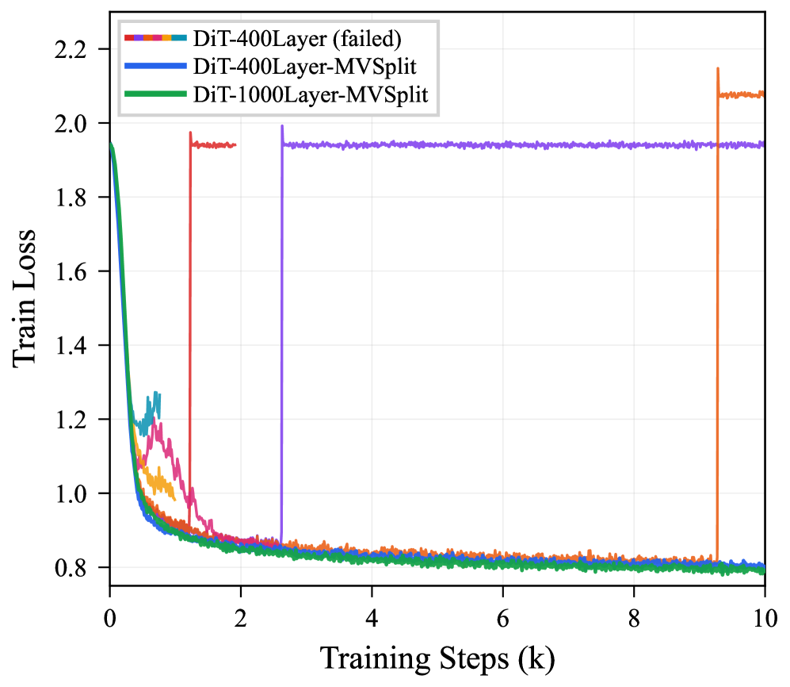
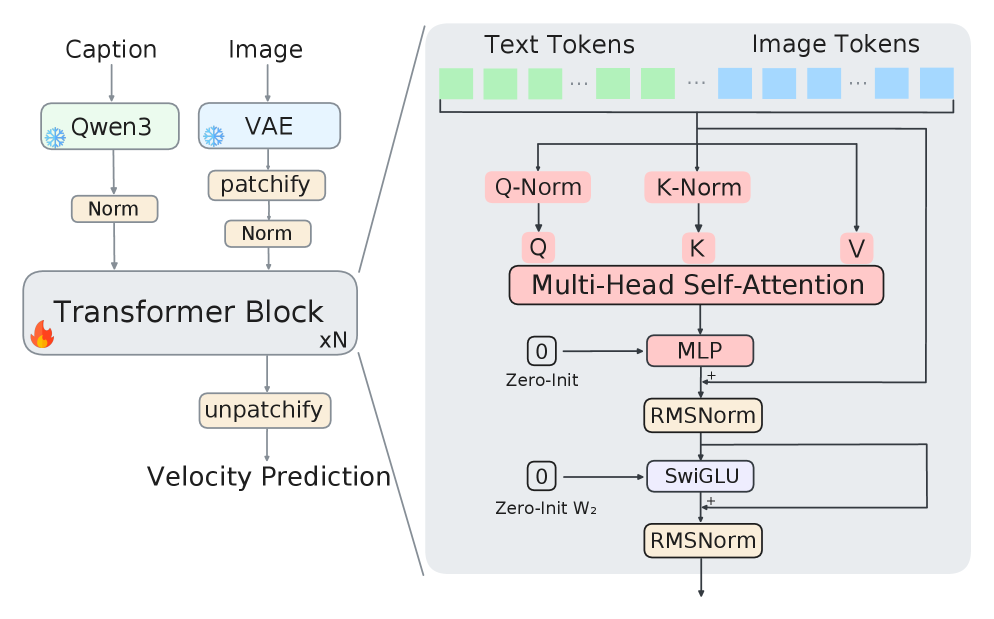
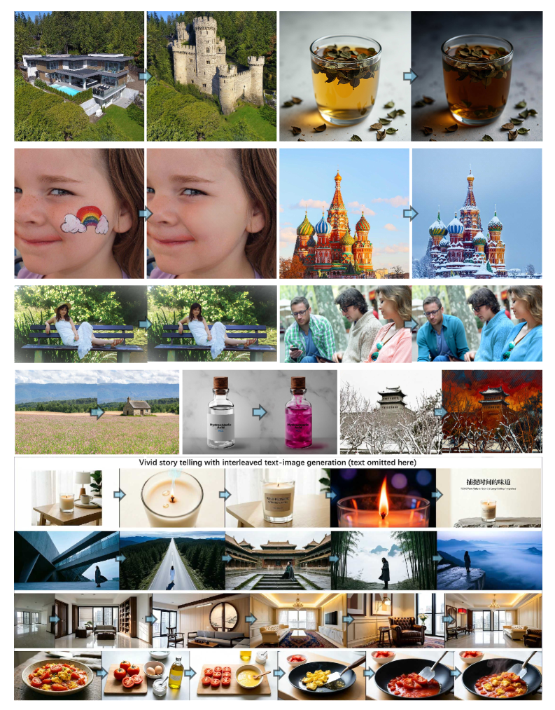

# Hugging Face Daily Papers 深度解读 (2026-05-08 ~ 2026-05-15)

- **Date:** 2026-05-15
- **Tags:** #hf-daily-papers #weekly-digest #depth-scaling #unified-multimodal #lora-infra #memory #olympiad-rl #flow-matching

## Context

本期覆盖 **2026-05-08 ~ 2026-05-15** 共 8 天 HF Daily Papers feed（5-09/5-10 周末未返回新条目，实际有效日期 6 天），**275 篇**论文按 `submittedOnDailyAt` 去重后入选，本文从中精选 **22 篇高影响论文**，按 6 个主题归类，对其中 4 篇（**MV-Split DiT**、**SenseNova-U1**、**MinT**、**SU-01**）做深度解读。

> 与上一期 `2026-05-07-hf-daily-papers-apr25-may7.md` 衔接，已剔除重复论文（22 篇）。本期最显著的趋势：
> - **从训练稳定性角度撬动深度 scaling**：MV-Split 把 1000-layer DiT 训稳，是 DiT 第一次跨入 4 位数深度。
> - **统一多模态架构走向 native**：SenseNova-U1 / Qwen-Image-2.0 / Qwen-Image-VAE-2.0 联袂登场，"理解 vs 生成"分裂结束。
> - **Skill / Rubric / Memory 成为 RL 主角**：Skill1, SkillOS, RubricEM, ROPD 把 RL 的奖励信号从 "verifiable" 推向 "rubric / skill / 经验复用"。
> - **基础设施级开源**：MinT 把 LoRA 训练-服务全流水线管控，已验证在 1T+ 参数模型上可用。

---

## 论文总览（精选 22 篇）

| ID | 标题 | 主题 | Upvotes | 主要贡献 |
|---|---|---|---|---|
| **2605.06169** | MV-Split：Mean Mode Screaming 与 1000-Layer DiT | DiT 深度稳定性 | **182** | 隔离 MMS 失败模式，给残差分裂"均值/中心"通道，1000 层 DiT 首次稳定可训 |
| **2605.12500** | SenseNova-U1 | 统一多模态 | **160** | NEO-unify 架构：抛弃 VE/VAE，pixel-flow + AR token MoT，VLM SOTA + X2I 生成同台 |
| **2605.13779** | MinT (MindLab Toolkit) | 训练-推理基建 | **149** | LoRA 适配器即基础单位的"经管基础设施"，验证至 1T+ 参数，4B/30B 步时 ↓18.3×/2.85× |
| **2605.09530** | MemPrivacy | 隐私 / Edge-Cloud 记忆 | **137** | 类型感知占位符替换隐私 span，效用损失 <1.6%，超越 GPT-5.2 / Gemini-3.1-Pro |
| **2605.10616** | MulTaBench | 多模态表格学习评测 | **122** | 40 数据集（图×表 / 文×表），驳斥"冻结 embedding 够用"，需 Target-Aware 表征 |
| **2605.06130** | Skill1 | Skill-Augmented RL | **105** | 单一 task-outcome 信号同时训练 skill 选择/使用/蒸馏三能力共演化 |
| **2605.05242** | DCI (Direct Corpus Interaction) | Agentic Search | **103** | 抛弃向量库，直接用 grep/shell 探查原始语料，BRIGHT/BEIR 多项 SOTA |
| **2605.10730** | Qwen-Image-2.0 Technical Report | 文生图基础模型 | **103** | Qwen3-VL + MM-DiT，1K-token 长文本指令、多语言排版、海报/PPT/漫画级生成 |
| **2605.12357** | δ-mem | LLM 在线记忆 | **103** | 8×8 状态矩阵 + delta-rule 学习，给冻结 backbone 注入记忆，MemoryAgentBench ×1.31 |
| **2605.08063** | Flow-OPD | Flow Matching 蒸馏 | **92** | 两阶段：on-policy 蒸馏 + manifold 锚正则，提升 T2I FM 的对齐与质量 |
| **2605.13301** | SU-01 | 数学/物理奥赛推理 | **88** | 30B-A3B 训出 IMO 2025 / IPhO 24-25 金牌等级，Reverse-PPL 课程 + 两阶段 RL + TTS |
| **2605.13724** | AnyFlow | 视频扩散蒸馏 | **81** | 把 endpoint consistency 替换为 flow-map transition + 反向模拟，true 任意步推理 |
| **2605.13831** | Long-Context VLM (>128K) | 长上下文 VLM | **76** | 7B 模型 32K→128K，长文档 VQA 比 OCR 转录更有效，泛化 >128K |
| **2605.06548** | Cola DLM | 扩散语言模型 | **73** | Text VAE + block-causal latent DiT + 条件解码，统一 Markov-path 视角 |
| **2605.10899** | RubricEM | Deep Research RL | **70** | Rubric 既是评估器也是 policy 接口与 memory，stagewise 分解 + 反思 |
| **2605.08735** | CollabVR | 视频推理协作 | **67** | VLM + 视频生成模型协同推理，长程视频问答 |
| **2605.06416** | MiA-Signature | 长上下文激活近似 | **54** | 用压缩签名近似全局激活模式，长上下文性能 + 计算高效 |
| **2605.13565** | Qwen-Image-VAE-2.0 | 高压缩 VAE | **44** | GSC + 大规模训练 + 语义对齐，给扩散提供高压缩比可扩散 latent |
| **2605.15155** | SDAR | Agentic RL + Self-Distill | **44** | OPSD 升级到多轮 Agent：sigmoid 门选择正向 token guidance，过滤负面教师拒绝 |
| **2605.07396** | ROPD | 蒸馏 / 知识迁移 | **37** | Rubric-based on-policy 蒸馏，结构化语义评分替代 logit 蒸馏 |
| **2605.15178** | SANA-WM | World Model / 长视频 | **37** | 2.6B 混合线性 DiT，720p 分钟级生成，工业级质量但显著降低算力 |
| **2605.12090** | World Action Models 综述 | Embodied AI 综述 | **56** | 把 VLA + World Model 形式化为 WAM，统一 future-state×action 联合分布 |

---

## 一、深度 scaling 与训练稳定性（A 类深度解读）

### 1.1 Mean Mode Screaming：把 DiT 推进 4 位数深度（深度解读 §A）

> 
> *图 1：1000-layer MV-Split DiT 的文本到图像生成样本（来源：arXiv 2605.06169 Fig. 1）*

**问题画像**：把 DiT 堆到几百层会"看似稳定上千步、几个 update 内突然崩塌、loss 回到初始化"——但**没有 NaN，也没有梯度爆炸**。作者把这个失败模式命名为 **Mean Mode Screaming (MMS)**，并在 400-layer baseline 上完整复现。

**机制（§4）**：
- Token 表征沿深度同化，进入 mean-dominated collapse；
- 反向梯度可被精确分解为 **mean-coherent** 与 **centered** 两部分。token 越同化，mean-coherent 分量沿序列长度相干叠加 → 直接打爆 residual writer；
- 一旦 value 同化，attention-logit 梯度被 Softmax-Jacobian 的零空间吃掉 → Q/K 学不动；
- 这两条共同把模型锁死在"全输出均值"的 trivial 解上。

> 
> *图 2：MMS 触发链——backward 端梯度集中爆发于 mean-coherent 分量，随后 Q/K 梯度坍缩、残差分支打开（来源：arXiv 2605.06169 Fig. 3）*

**方案：MV-Split Residuals**
- 把残差路径**对称地**拆成两路：
  - **centered 路径**：保留独立 gain，承担可学的空间变化信号；
  - **mean 路径**：用一个"漏式"trunk-mean 替换抑制掉相干放大；
- 区别于 LayerScale / ReZero 的"等比缩放整支残差"——后者在抑制崩塌的同时**也会拖慢 centered 信号收敛**。

**结果**：
- 400-layer 配置下，未稳定 baseline 崩溃；MV-Split 跑完整 schedule，且优于 LayerScale；
- **1000-layer DiT 首次跑出可生成的文生图模型**（开源权重 `StableKirito/mvsplit-dit-1000l`）；
- 还做了 Triton 融合：RoPE + QK-Norm + SwiGLU + MV-Split + RMSNorm 的端到端 fuse kernel。

**为什么重要**：DiT 的 scaling law 是"宽 × 深 × 数据"，但深度方向之前被一只"看不见的脚"踩着。MV-Split 把这只脚拿开后，下一阶段视觉生成模型的 capacity ceiling 会被显著抬高——而且方法本身只改残差，不改 attention/FFN，几乎可以零成本接入现有 DiT 训练管线。

> 
> *图 3：400/1000 层训练曲线——LayerScale 收敛慢且未恢复，MV-Split 紧贴 baseline 的崩溃前轨迹并保持稳定（来源：arXiv 2605.06169 Fig. 2）*

---

## 二、统一多模态：从架构妥协走向 native（B 类深度解读）

### 2.1 SenseNova-U1 / NEO-unify：抛弃 VE 与 VAE（深度解读 §B）

> 
> *图 4：SenseNova-U1-8B-MoT 在信息图与人像生成上的样张（来源：arXiv 2605.12500 Fig. 1）*

**核心立论**：理解 vs 生成的分裂**不是工程偶然**，而是底层"用 CLIP/SigLIP 当编码、用 VAE 当解码"两套 representation space 决定的——这个结构限制了 native 多模态智能的涌现。

**做法**（NEO-unify 架构）：
1. **不用预训练 VE 也不用 VAE**：直接面向 raw pixel + token；
2. **统一损失**：语言侧 AR 交叉熵 + 视觉侧 pixel-space flow matching 联合训练；
3. **MoT (Mixture-of-Transformers)**：用专家分流降低不同模态目标之间的干扰，提供 scaling 通路。

**两个变体**：
- **U1-8B-MoT**（dense 8B 起底）；
- **U1-A3B-MoT**（30B-A3B MoE 起底）。

**评测覆盖**：text understanding / VL perception / knowledge reasoning / agentic decision / spatial intelligence / X2I 生成 / 信息图 / 交错图文生成。声称在保持 32× 视觉压缩比的前提下追平/超过 understanding-only VLM 的 SOTA。

> 
> *图 5：U1 在图像编辑与交错图文生成上的能力示例（来源：arXiv 2605.12500 Fig. 2）*

**前瞻性结论**：作者明确表示模型在 **VLA + World Model** 场景中显示出潜力——这意味着 native 统一架构有望直接成为下一代 VLA 的基础底座，**不需要再外挂 vision encoder 或 video tokenizer**。

**和本期其他多模态工作的关系**：
- **Qwen-Image-2.0 (2605.10730)** 仍走 "Qwen3-VL 当 condition encoder + MM-DiT" 的"双塔"路线，强项是 1K-token 指令的长文本渲染、多语言排版、海报/PPT/漫画一体化；
- **Qwen-Image-VAE-2.0 (2605.13565)** 把 VAE 推到高压缩比但仍可扩散；
- **SenseNova-U1** 直接对这条 "VE+VAE" 范式提出否定，是路线之争。

> 三者并立，正好揭示了 2026 年中"统一多模态"的两条路线并行：**继续优化 dual-tower 范式 vs. 用 native flow-matching 颠覆它**。

---

## 三、训练/服务基础设施（C 类深度解读）

### 3.1 MinT（MindLab Toolkit）：把 LoRA 训-服全栈服务化（深度解读 §C）

**问题画像**：现实场景下，"贵重 base model 部署一次、上面跑无数 LoRA 策略" 的 pattern 越来越普遍（多租户、多任务、多版本、多 ckpt rollback）。但传统做法把每个策略 merge 成全权重 → 存储/迁移/调度/灰度都贵到难以扩展。

**MinT 的抽象**：
- Base model **常驻**；
- 流水线只搬动 **LoRA 适配器版本**（rank-1 的话甚至 <1% base 大小）；
- rollout / update / export / eval / serve / rollback 全部隐藏在服务接口背后。

**三轴 scaling**：
| 轴 | 含义 | 关键数字 |
|---|---|---|
| **Scale Up** | 把 LoRA RL 推到前沿规模 | dense + MoE + MLA + DSA，>1T 参数验证 |
| **Scale Down** | 只搬 adapter，不搬 base | 4B dense 单步 ↓18.3×；30B MoE ↓2.85× |
| **Scale Out** | 多策略并发 + tensor-parallel | concurrent multi-policy GRPO 墙时 ×1.77 / ×1.45，不增 peak memory |

**意义**：之前 OpenRLHF / verl 等 RL 框架解决的是"怎么把一个 RL job 训起来"，MinT 解决的是"百万级 LoRA 策略的生命周期管控"——更像 **K8s for LoRA**，把 RL 模型也带入 SaaS 化运维。配合本期 Skill1 / RubricEM / SkillOS 这些"自演化 Agent"的工作，MinT 是把它们 ship 到生产的中间层。

代码：[`github.com/MindLab-Research/mindlab-toolkit`](https://github.com/MindLab-Research/mindlab-toolkit)

---

## 四、Skill 与 Rubric 驱动的 RL 后训练

### 4.1 Skill1（2605.06130）

**论点**：维护 skill library 需要三个能力——选择、使用、蒸馏新 skill。已有方法把它们隔离训练或用不同奖励源 → **partial & conflicting evolution**。

**方法**：单一 task-outcome 信号训练同一 policy。
- **低频趋势**给 selection 信用；
- **高频波动**给 distillation 信用；
- 一次 rollout 完成"查 → 重排 → 用 → 蒸馏"全流程。
- ALFWorld / WebShop 上超越 skill-based 与 RL baseline。

### 4.2 SkillOS（2605.06614）

把"策略地维护 skill"当作单独一层 OS：让 LLM Agent 学一个长期 skill curation policy。**和 Skill1 的差别**：Skill1 在 single-policy 内联训三能力；SkillOS 把 curation policy 单独出来，跨 executor 架构泛化。

### 4.3 RubricEM / ROPD：Rubric 成为 RL 的"通用接口"

- **RubricEM (2605.10899)**：训练 deep research agent，把 rubric 当作 policy execution / judge feedback / agent memory 的统一接口，stagewise 分解 + 反思的 meta-policy；
- **ROPD (2605.07396)**：把 rubric 用进蒸馏——结构化语义评分替代 logit 蒸馏，sample efficiency 显著提升。

**趋势**：本期 RL 工作明显告别"verifiable reward only"。Rubric 既是评估也是控制接口，意味着 **Deep Research / 长 horizon agent** 这类原本"没有 ground truth"的任务也开始被系统化训练。

### 4.4 SDAR（2605.15155）

把 OPSD（On-Policy Self-Distillation）从单步推到多轮 Agent：核心难点是教师拒绝有时来自 skill retrieval 失败而非"动作错"。**sigmoid 门**只对正向 token 强化指导，对负面拒绝降权——简单但有效的非对称处理。

---

## 五、记忆 / 长上下文 / 检索

### 5.1 δ-mem（2605.12357）

- 仅 **8×8** 在线状态矩阵，delta-rule 更新；
- 给冻结 full-attention backbone 输出"低秩 attention 修正"；
- 平均得分 ×1.10（vs 冻结 backbone）/ ×1.15（vs 最强非 δ-mem 基线）；
- MemoryAgentBench ×1.31 / LoCoMo ×1.20；
- **不需要全量 fine-tune、不需要换 backbone、不需要扩 context**。

### 5.2 MemPrivacy（2605.09530）

针对 edge-cloud agent 的隐私敏感记忆管理：
- 边端识别隐私 span，替换成**类型感知占位符**送云端处理，本地恢复值；
- 200 用户 / 52K 隐私实例的 MemPrivacy-Bench；
- 4 级隐私分类法（可配置策略）；
- **utility loss <1.6%**，且隐私抽取超过 GPT-5.2 / Gemini-3.1-Pro。

### 5.3 MemEye（2605.15128）

视觉中心的多模态 Agent 记忆评测，按视觉证据粒度 + 检索使用复杂度评估，覆盖 8 类生活场景任务。和 δ-mem / MemPrivacy 共同把"记忆"扩成评测-机制-隐私三位一体。

### 5.4 DCI（2605.05242）：抛弃向量库

**激进观点**：vector retriever 是 agent 的瓶颈，因为 lexical 约束、稀疏线索合取、局部上下文校验难以表达。**DCI 让 agent 直接 grep/shell 原始语料**——不预建索引、不挂 embedding。在 BRIGHT/BEIR/BrowseComp-Plus/multi-hop QA 上多项超过强 sparse/dense/reranker baseline。

**和当下 Agent harness 的协同**：Claude Code / Codex / Cursor 的 agentic search 路径就是 grep + read，DCI 是把这套实践抽象化成"接口设计的可用空间比检索质量更关键"。

### 5.5 Long-Context VLM（2605.13831）

7B VLM 从 32K 扩到 >128K：
- **长文档 VQA 比 OCR 转录更有效**（驳斥"先转 text 再喂"路径）；
- 长上下文 continued pre-training 的数据 mixture 平衡是关键；
- 泛化能力可超过 128K context window。

### 5.6 MiA-Signature（2605.06416）

把全局激活模式压缩成"签名"近似，长上下文场景下既保性能又减算力——和 δ-mem 在精神上同向：**压缩 + 注入**，不动 backbone。

---

## 六、奥赛推理与 Test-Time Scaling

### 6.1 SU-01：30B-A3B 拿到 IMO 2025 / IPhO 双金（深度解读 §D）

**配方**（极致简化、号称 "simple and unified"）：
1. **Reverse-Perplexity Curriculum SFT**
   - 338K 条 <8K-token 长 trajectory（数学/科学/代码/指令）；
   - 按 reverse PPL 排序——**先教模型"最不像它当前分布的样本"**，再回到熟样本巩固，避免 SFT 把后训练 backbone 推坏。
2. **两阶段 RL**
   - **Coarse RL**（RLVR）：用可验证 reward（答案二元判定）放大 SFT 引入的"证明-检验-修复"行为；
   - **Refined RL**（proof-level）：换成 generative reward model 给完整证明打分 + self-refinement + 经验回放保留稀有成功 trajectory。
3. **Test-Time Scaling**：自验证-自修复回路，最终把模型推到金牌级。

**成绩**：
- IMO 2025 / USAMO 2026 / IPhO 2024-2025 **gold-medal-level**；
- 训练 trajectory 长度 >100K tokens 仍稳定；
- 跨数学/物理之外的科学领域有泛化迁移。

**为什么算"统一配方"**：以前奥赛系统倾向"几何专家 + 代数专家 + 符号 search"组合，SU-01 把同一套 SFT→RLVR→Proof-RL→TTS 应用到数学 + 物理两个奥赛——配方一份、模型一份。

### 6.2 TMAS（2605.10344）

Test-time scaling 的另一思路：**多 Agent synergy** + 分级记忆。和 SU-01 走"单模型纵深"互为对照——一个把算力堆在 inference loop，一个把算力堆在多 agent 协作。

---

## 七、生成与 World Model

### 7.1 Flow-OPD（2605.08063）

Flow Matching T2I 的两阶段对齐：
- **on-policy 蒸馏**：从教师采样 + 学生 on-policy 反馈双重信号；
- **manifold anchor 正则**：避免学生跑出 valid manifold；
- 在生成质量与对齐指标上双提升。

### 7.2 AnyFlow（2605.13724）

视频扩散蒸馏的 "any-step" 突破：
- 普通 consistency distillation 换掉了 ODE 轨迹 → test-time 增加步数反而退化；
- AnyFlow 把蒸馏目标从 endpoint consistency `z_t → z_0` 换成 **flow-map transition** `z_t → z_r`（任意时段）；
- **Flow Map Backward Simulation** 把整段 Euler rollout 拆解成 shortcut flow-map transitions；
- 兼顾 few-step 推理的离散误差与 causal 生成的曝光偏差。
- 代码：[`github.com/NVlabs/AnyFlow`](https://github.com/NVlabs/AnyFlow)

### 7.3 SANA-WM（2605.15178）

2.6B 参数的混合线性 DiT 世界模型：
- 720p、**分钟级**视频、双相机精确控制；
- 混合 attention（线性 + 全局）、双相机分支、两阶段生成、稳健标注流水线；
- 工业级质量但显著降低算力，验证 world model 的"日常计算预算"路径可达。

### 7.4 World Action Models 综述（2605.12090）

把 VLA + world model 形式化为 **WAM**：联合建模 future state 与 action 分布。这是和上一期"Agentic World Modeling 综述"互补——上一期聚焦能力分层（L1/L2/L3），本期聚焦"VLA × WM"的统一形式。

### 7.5 CollabVR（2605.08735）

VLM + 视频生成模型协同推理：长视频问答场景下，让 VLM 做条件化推理、让视频生成模型做反事实想象，两者互为 critic。

### 7.6 Cola DLM（2605.06548）

层级化扩散语言模型：Text VAE + block-causal latent DiT + 条件解码——**统一 Markov-path 视角**让 AR 与 diffusion 在同一理论框架下比较。

---

## 八、其他亮点

### 8.1 MulTaBench（2605.10616）

40 数据集（图×表 / 文×表）多模态表格学习评测：明确驳斥"用冻结预训练 embedding 就够"——必须 task-specific tuning 才能利用互补预测信号。给业界"上 RAG / 上多模态"的工程默认值打了一记反问。

### 8.2 Do Enterprise Systems Need Learned World Models?（2605.12178）

立论：**不需要**。在"配置驱动、动态可读"的企业系统里，runtime 直接读配置的 discovery agent 性能优于学过的 world model——因为 dynamics 随配置变化，模型学的是过期版本。这条工程结论很可能改变 RPA + Agent 的产品设计。

### 8.3 EVA-Bench（2605.13841）

端到端 voice agent 评测框架，覆盖 ASR + 推理 + TTS + 工具调用全链路。

### 8.4 MACE-Dance（2512.18181，跨年提交）

音乐驱动舞蹈视频：Motion-Appearance Cascaded Experts（动作专家 + 外观专家），是本期"音视频协同生成"的代表。

---

## 趋势分析

**1. DiT/VLM 的 "unfair competition" 时代**

- MV-Split 让 1000-layer DiT 可训 → 视觉生成模型的下一个 capacity 跳跃来自 **深度** 而非数据；
- SenseNova-U1 否定 "VE+VAE" → 多模态 base model 的形态可能在 2026Q3-Q4 完成迁移；
- 这两条同时发生，会迫使 ext-pretrain 团队重新对齐技术栈选择。

**2. RL 的 "rubric / skill / 经验" 三元上位**

| 之前 | 现在 |
|---|---|
| 单一 verifiable reward | rubric / skill / 经验回放 / self-distill |
| 单 policy 收敛 | 多能力共演化（Skill1）/ 多策略并发（MinT） |
| 数学/代码 | Deep Research / 工具调用 / 多模态推理 |

**3. 记忆 = 接口 + 隐私 + 评测**

- δ-mem 用 8×8 状态做"机制注入"；
- MemPrivacy 把"隐私"做进 memory 流水线；
- MemEye 给"看图记忆"建评测；
- DCI / MiA-Signature 把"接口"层重写。
- 把这四件加起来，2026 中的 "memory" 不再是单一向量库，而是**"机制-接口-隐私-评测"四位一体**。

**4. 基建从训练向"百万策略 lifecycle"扩展**

MinT 是第一个公开把 LoRA 适配器当作"一级 schedulable 资产"来管的工业级方案。配合 Skill1 / SkillOS / RubricEM 这种自演化 Agent，下一阶段的研究 → 部署链条会往 **K8s 风格的 LoRA 编排** 集中。

**5. 奥赛推理的"配方收敛"**

SU-01 用同一份 SFT→RLVR→Proof-RL→TTS 同时拿下数学 + 物理金牌，开始指向"通用奥赛推理基线"——AlphaProof / AlphaGeometry 的"问题域专家组合"路线进入"通用 specializable-generalist"路线。

---

## Open Questions

1. **MV-Split 之外，DiT 的下一阻力是什么？**——1000 层稳定可训之后，scaling 上限会不会又被"长序列 attention I/O"或"梯度方差"重新封顶？
2. **NEO-unify 路线能不能"端到端无 VAE"地训出视频？**——目前 SenseNova-U1 是图像/交错图文，video flow-matching 还没看到同样的清白方案。
3. **Skill / Rubric 是否能联合"自动 task 生成"形成闭环？**——RubricEM + Skill1 + 自动构造 rubric → 自动课程 RL 是否会成为 AI Researcher 的下一形态？
4. **MinT 这种"百万策略"方案的开源生态会怎么演化？**——一旦 LoRA 调度成为基础设施，专门做 adapter 路由 / 灰度 / A/B 的初创会涌现吗？
5. **DCI 替代向量检索的边界在哪？**——大语料（>10TB）下 grep + shell 是否还成立？这种"接口质量"假说能否量化？

---

## References

- arXiv 2605.06169 — Mean Mode Screaming: Mean–Variance Split Residuals for 1000-Layer Diffusion Transformers
- arXiv 2605.12500 — SenseNova-U1: Unifying Multimodal Understanding and Generation with NEO-unify Architecture
- arXiv 2605.13779 — MinT: Managed Infrastructure for Training and Serving Millions of LLMs
- arXiv 2605.09530 — MemPrivacy: Privacy-Preserving Personalized Memory Management for Edge-Cloud Agents
- arXiv 2605.10616 — MulTaBench: Benchmarking Multimodal Tabular Learning with Text and Image
- arXiv 2605.06130 — Skill1: Unified Evolution of Skill-Augmented Agents via Reinforcement Learning
- arXiv 2605.05242 — Direct Corpus Interaction (DCI): Beyond Semantic Similarity for Agentic Search
- arXiv 2605.10730 — Qwen-Image-2.0 Technical Report
- arXiv 2605.12357 — δ-mem: Efficient Online Memory for Large Language Models
- arXiv 2605.08063 — Flow-OPD: On-Policy Distillation for Flow Matching Models
- arXiv 2605.13301 — SU-01: Achieving Gold-Medal-Level Olympiad Reasoning via Simple and Unified Scaling
- arXiv 2605.13724 — AnyFlow: Any-Step Video Diffusion Model with On-Policy Flow Map Distillation
- arXiv 2605.13831 — Training Long-Context Vision-Language Models Effectively
- arXiv 2605.06548 — Cola DLM: Continuous Latent Diffusion Language Model
- arXiv 2605.10899 — RubricEM: Meta-RL with Rubric-guided Policy Decomposition
- arXiv 2605.13565 — Qwen-Image-VAE-2.0 Technical Report
- arXiv 2605.15155 — SDAR: Self-Distilled Agentic Reinforcement Learning
- arXiv 2605.07396 — ROPD: Rubric-based On-policy Distillation
- arXiv 2605.15178 — SANA-WM: Efficient Minute-Scale World Modeling
- arXiv 2605.12090 — World Action Models: The Next Frontier in Embodied AI
- arXiv 2605.06416 — MiA-Signature: Approximating Global Activation for Long-Context Understanding
- arXiv 2605.10344 — TMAS: Scaling Test-Time Compute via Multi-Agent Synergy
- arXiv 2605.12178 — Do Enterprise Systems Need Learned World Models?
- arXiv 2605.15128 — MemEye: Visual-Centric Evaluation Framework for Multimodal Agent Memory
- HF Daily Papers feed: `https://huggingface.co/api/daily_papers?date=YYYY-MM-DD`
