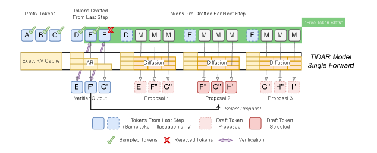
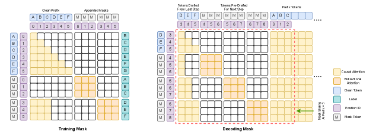
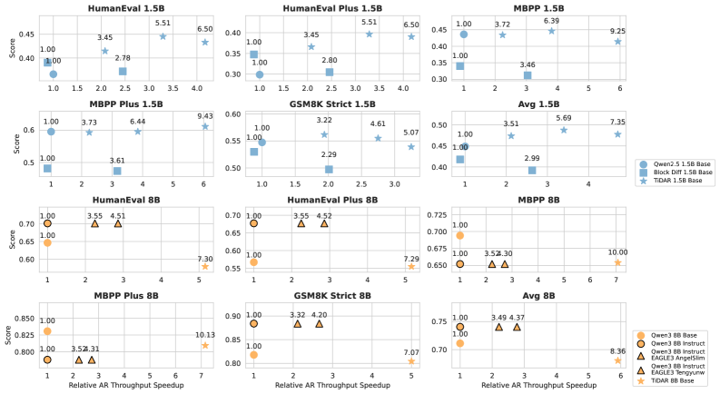
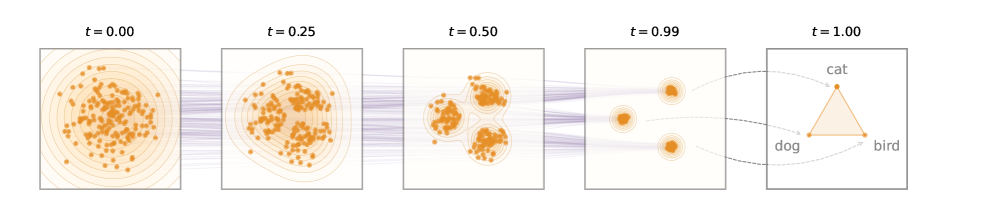
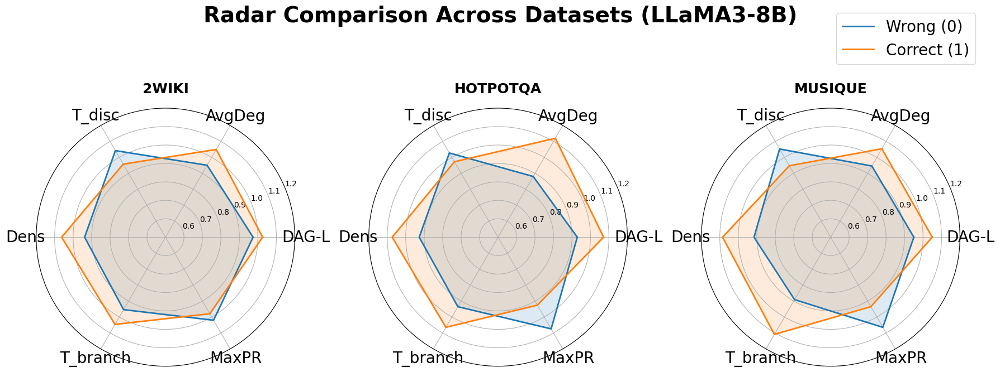
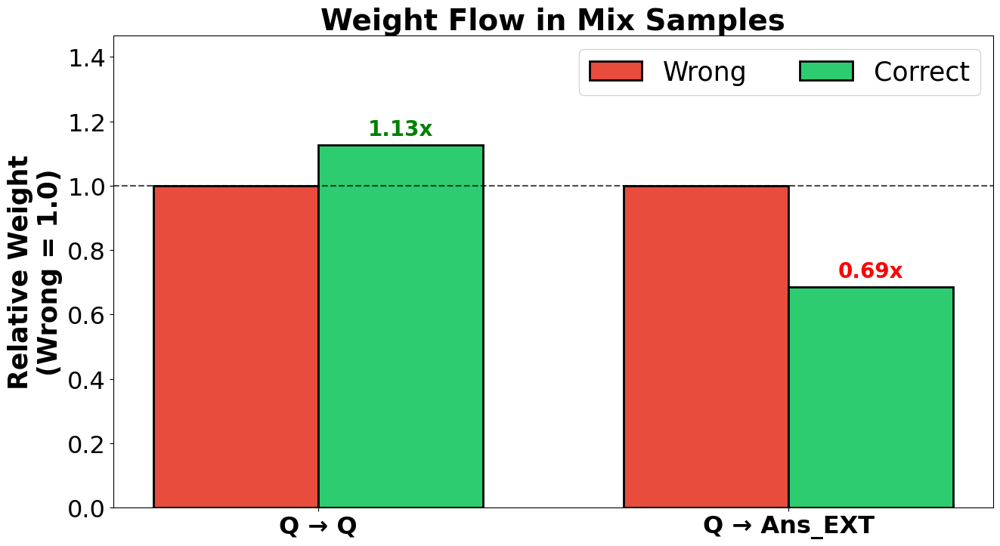
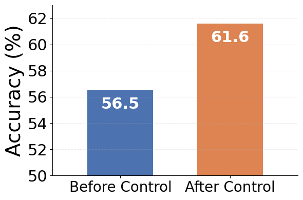
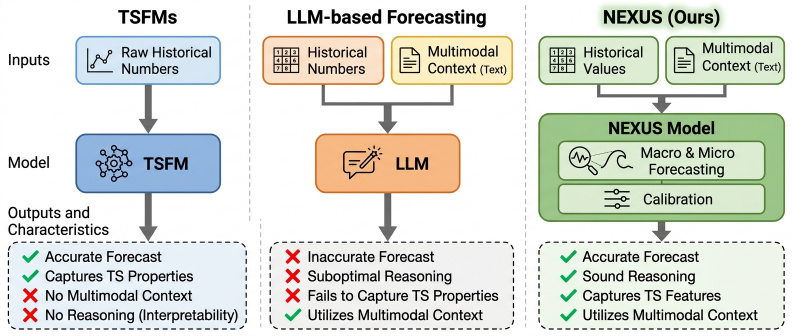
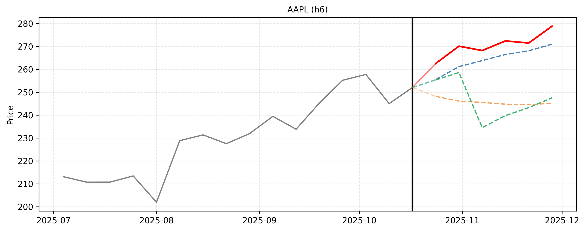
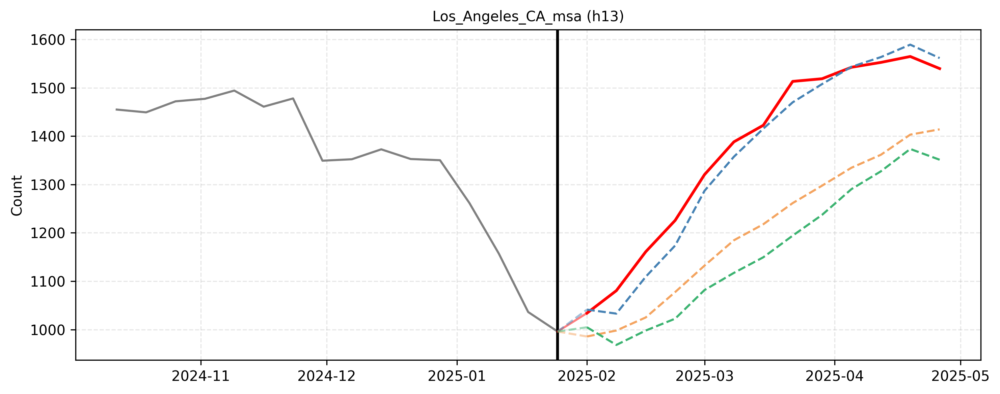

# 四篇论文合读：扩散×自回归、连续嵌入流、RAG 失败的电路追踪、时序预测多智能体

- **Date:** 2026-05-18
- **Tags:** #论文笔记 #diffusion-LM #flow-matching #RAG #机制可解释性 #时序预测 #多智能体
- **Papers:**
  - [TiDAR: Think in Diffusion, Talk in Autoregression](https://arxiv.org/abs/2511.08923) — NVIDIA, 2025-11
  - [ELF: Embedded Language Flows](https://arxiv.org/abs/2605.10938) — MIT (Hu, Andreas, Kaiming He et al.), 2026-05
  - [Why Retrieval-Augmented Generation Fails: A Graph Perspective](https://arxiv.org/abs/2605.14192) — 2026-05
  - [Nexus: An Agentic Framework for Time Series Forecasting](https://arxiv.org/abs/2605.14389) — Google DeepMind 团队相关, 2026-05

## Context

四篇看似无关，但合在一起能看出 2026 年 LLM 研究的几条主线：
- **生成范式之争**（论文 1、2）：扩散/流匹配 vs 自回归。两篇都尝试把 image 域的并行生成红利搬到语言上，但走了完全不同的路——一篇做"两套架构融合"（TiDAR），一篇做"连续嵌入空间纯粹化"（ELF）。
- **黑盒变白盒**（论文 3）：RAG 为什么会失败，第一次有人用 circuit tracing 把"Transformer 内部信息流"画成图，并直接拿这个图诊断 + 干预。
- **LLM 长出"专业肌肉"**（论文 4）：把 LLM 当"agent 调度器"用在时序预测这种传统 ML 强项领域，证明 LLM 内在预测能力被严重低估。

底层是同一个张力：**模型变强了，但理解/改造它的工具还在追赶。** 四篇分别给出了四种不同方向的回应。

---

## 论文 1：TiDAR — 在 Diffusion 里"思考"，在 AR 里"说话"

> **作者**: Jingyu Liu, Xin Dong, ..., Pavlo Molchanov（NVIDIA, 2025-11-12）
> **TL;DR**: 单次 forward 内同时跑扩散草稿 + AR 验证，用结构化 attention mask 协调两种范式。1.5B 模型 4.71× 加速、8B 模型 5.91× 加速，**首次在质量上完全追平 AR**。

### 核心 idea

扩散模型并行生成快但质量差，自回归（AR）质量高但只能一次一 token。前人尝试过两条路：
- **Speculative decoding**：用小 draft 模型 + 大 target 模型双阶段验证 → 需要两个模型，部署复杂
- **Block diffusion**：把序列切块，块内双向、块间因果 → 块内双向导致前缀无法算 NTP loss

TiDAR 的设计：**一个模型在一次 forward 中**同时完成草稿（diffusion）和验证（AR），通过一张精心设计的 attention mask 让两种角色共存。

### 三大技术点

1. **结构化 mask**：训练时把序列翻倍——前半 clean token 走因果注意力（保留 NTP loss），后半 mask token 走块内双向注意力（diffusion 草稿）。推理时预构建 `(q_len, q_len + max_seq)` 大 mask，每步切片复用。

2. **精确 KV cache**：所有 causal 计算的 token 的 KV 都保留；rejection sampling 拒掉哪些 token，就 evict 哪些 KV。**完全不需要重新计算 KV**——比 Block Diffusion / SBD 高效得多。

3. **训练损失**：
$$\mathcal{L}_{TiDAR} = \frac{1}{1+\alpha}\left(\frac{\alpha}{S-1}\sum \mathcal{L}_{AR} + \frac{1}{S-1}\sum \mathcal{L}_{Diff}\right)$$
α=1 时两类 loss 项数相同便于平衡。

### 关键数字

| 模型 | vs AR baseline | T/NFE | 质量（GSM8k） |
|------|---|---|---|
| TiDAR 1.5B | **4.71×** | 7.45 | 53.90% (Qwen2.5: 54.74%) |
| TiDAR 8B | **5.91×** | 8.25 | 80.44% (Qwen3: 81.80%) |

vs EAGLE-3 投机解码：TiDAR T/NFE 更高，且 T/s 转换率更优。论文说："diffusion models can surpass the efficiency gains over speculative decoding"。

### 为什么重要

- **第一次** diffusion-AR 混合架构在质量上彻底追平纯 AR
- **不需要外部 draft 模型**（不像 spec decoding）
- 留下的坑：batch size > 1 的优化、长上下文（训练序列要翻倍）、自定义 kernel

---

## 论文 2：ELF — 把语言扩散完全留在连续嵌入空间

> **作者**: Keya Hu, Linlu Qiu, ..., Yoon Kim, Jacob Andreas, **Kaiming He**（MIT, 2026-05-11）
> **TL;DR**: 用 Flow Matching 在连续 embedding 空间做语言扩散，**只在最后一步**离散化。不需要独立 decoder，CFG 直接迁移。45B token 训练量打过 500B+ 的 baseline。

### 核心 idea

现有扩散语言模型主流派（SEDD、MDLM 等）都在**离散 token 空间**做 diffusion。少数尝试连续空间的（Diffusion-LM、CDCD、并发的 FLM/LangFlow）每步都要做 token-level cross-entropy 或 rounding loss，把连续 dynamics 拽回离散。

ELF 的极端立场：**整段轨迹完全留在 unrestricted continuous embedding space**，**只**在最后 t=1 那一步离散化。

### 设计要点

1. **嵌入选择**：用冻结的 T5-small encoder（512 维）把 token 投到连续空间。论文消融：预训练 contextual embedding > scratch contextual > pretrained token embedding > 冻结 Gaussian。

2. **Rectified flow**：$\bm{z}_t = t\bm{x} + (1-t)\bm{\epsilon}$，速度场 $\bm{v} = \bm{x} - \bm{\epsilon}$。**用 x-prediction 而非 v-prediction**——高维下表现更好，且与"最后一步预测干净 token"目标天然对齐。

3. **共享权重 denoiser-decoder**：不需要单独的 decoder。同一个 net_θ 通过一个 binary mode token 区分"去噪"和"解码"两种调用方式。最后用可学习 unembedding W 投到 logits。

4. **双分支训练（同 batch、共享网络）**：
   - 80% 去噪分支：MSE loss
   - 20% 解码分支：在 t=1 加 token-level corruption，CE loss

5. **CFG 直接迁移**：用 self-conditioning 构造条件 c，**训练时 CFG**——单次 forward 就能得到 cfg 速度场，避免推理双倍开销。这一招连续空间天然支持，离散 DLM 里 CFG 一直效果差。

### 关键数字

| 设置 | ELF-B (105M) | 备注 |
|------|---|---|
| OpenWebText 训练 token | **45B** | Baseline（MDLM/Duo）多在 500B+ |
| 32 步采样 Gen. PPL | **24** | 优于所有 ~170M baseline |
| WMT14 De-En BLEU | **26.4** | 超过 AR 25.2、E2D2 24.8、CDCD 24.9 |
| XSum R-1/R-2/R-L | 36.0 / 12.2 / 27.8 | 全面领先 |

### 为什么重要

- **最简设计原则**：把所有"discrete vs continuous"的耦合都推到最后一步
- **直接复用 image diffusion 工具箱**（CFG、SDE/ODE samplers、rectified flow）
- 不需要蒸馏就能少步生成（部分并发工作要靠蒸馏才能做到这点）
- Kaiming He 加入语言扩散——一个标志性事件，预示这一路线会被严肃推进

---

## 论文 3：RAG 为什么会失败 — 用电路追踪把 Transformer 画成图

> **作者**: Kai Guo et al.（2026-05-13）
> **TL;DR**: 用 circuit tracing + transcoders 把 Transformer 解码过程构造成 attribution graph，发现 **正确预测和错误预测在图结构上系统性不同**。基于此做错误检测（+11.53%）和零参数干预（+9%）。

### 核心 idea

RAG 经常失败：明明把答案塞进 context 了，模型还是答错。以往要么改模型、要么改 retriever，**没人从模型内部看"信息怎么流的"**。

这篇论文的工具是 **attribution graph**：
- 节点 v_{t,ℓ} = token t 在 layer ℓ 的表示
- 边 = token-to-token 因果贡献（边权 = 贡献强度）
- 用 **transcoders**（特征字典）把残差流分解成稀疏激活单元
- 用 **locally linearized replacement**（MLP 替换为 transcoder + 冻结 attention）让网络变成可分解的线性映射

### 关键发现：六个图指标

| 指标 | 正确预测 | 错误预测 |
|------|---|---|
| DAG-L（最长路径深度） | 长 | 短 |
| AvgDeg / Dens | 高 | 低 |
| T_disc（断开三元组比例） | 低 | 高 |
| T_branch（分支三元组比例） | 高 | 低 |
| MaxPR（最大 PageRank） | 低 | 高（信息集中在 hub） |
| 中间层（8-18）激活占比 | 高 | 低（过依赖早层） |

> 一句话总结：**正确预测=深、分布、结构化**；**错误预测=浅、碎片、过度集中**。

### 应用 1：错误检测器

用 Graph Transformer Encoder（2 层、hidden 128）做二分类：
- 节点特征：type one-hot + degree + PageRank
- 局部 MPNN + 全局 attention 交替
- HotpotQA / 2WikiMultihopQA / MuSiQue 三个 benchmark
- vs 自评 baseline：**平均提升 +11.53%**

### 应用 2：零参数干预（QCEG）

定位失败模式 SAEG（surface-aligned evidence grounding），目标是诱导 QCEG（question-constrained evidence grounding）。**只用 forward hooks 改 attention 权重，不动任何参数**：

| 控制 | 层位 | 效果 |
|------|------|------|
| α_QQ = 1.5 | 低层 | 增强问题理解 |
| α_ctx = 0.5 | 低层 | 抑制过早依赖检索 |
| α_QIn = 1.5 | 高层 | 保持问题引导解码 |

Mix-MuSiQue（含干扰段落）：**56.5% → 61.6%**（相对 +9%）。

### 为什么重要

- 这是 **Anthropic circuit tracing 之后第一篇把方法落地到具体应用场景** 的工作
- 不修改任何参数就能提升 RAG 准确率，部署成本几乎为零
- 给"为什么 RAG 不可靠"提供了机制层面的解释——而不是又一次工程黑魔法

---

## 论文 4：Nexus — 时序预测当作 agentic reasoning

> **作者**: Sarkar Snigdha Sarathi Das, Palash Goyal, ..., Tomas Pfister（2026-05-14）
> **TL;DR**: 把时序预测拆成**5 个 LLM agent** 的协作流水线（context → macro → micro → synthesizer → calibration）。在 LLM 知识截止后的 Zillow / 股票数据上，匹敌或超越 SOTA 的 TimesFM-2.5。

### 核心 idea

现有两条路都不够：
- **TSFM**（TimesFM、Chronos、Moirai）：擅长数值模式，**忽略文本信号**
- **直接 LLM zero-shot prompt**：跨领域不稳定

Nexus 的立场：**LLM 本身的预测能力被严重低估**——关键不是模型，而是**怎么组织数值 + 上下文推理**。

### 五个 agent 的分工

| Agent | 职责 |
|-------|------|
| **Context Agent** (𝒜_ctx) | 把原始多模态 (X, E) → 结构化时间线 H_{1:τ}，每步链接数值与"驱动因素" |
| **Macro Agent** (𝒜_macro) | 自顶向下，规划整个预测时域 T 的"广义轨迹"和 regime |
| **Micro Agent** (𝒜_micro) | 粒度化逐步，对每个未来时间步评估"即时催化剂、短期变化、局部波动" |
| **Synthesizer** (𝒜_syn) | 综合 macro + micro + 学到的 guideline，输出最终预测 |
| **Calibration** (𝒜_calib) | 历史回测 → 提取批评规则 → 取交集成 master guideline，仅当 ≥k% 改善才采用 |

### 数据 & 防泄漏设计

**关键防泄漏**：评估期都在 LLM 知识截止后（Gemini-3.1-Pro / Claude-4.5-Sonnet 截止 2025-01）：
- **Zillow**：15 个美国都市统计区，每周销售库存，2025-02 ~ 10
- **股票**：7 家公司每周收盘（AAPL、GOOGL、RKLB、JNJ、MSFT、NFLX、NVDA），2025-02 ~ 12

### 关键数字（多模态语境预测）

Claude-4.5-Sonnet 上 Nexus vs CoT baseline：
- Zillow：**MAPE ↓86.6%**（CoT 在长上下文严重退化）
- 股票：MAPE ↓12.0%

Gemini-3.1-Pro 上：
- Zillow：MAPE ↓14.7%
- 股票：MAPE ↓1.2%

**仅数值模式下 Nexus 也能匹敌或超越 TimesFM-2.5**：Zillow MAPE 0.0330 (Claude+Nexus) vs 0.0387 (TimesFM)。

### Reasoning trace 质量（人类/模型偏好）

Cross-judge（Gemini 输出由 Claude 评，反之）四个标准：domain relevance / event plausibility / logic-to-number consistency / analytical depth。

- Gemini-3.1-Pro on Zillow：Nexus **97.1%** vs CoT 2.8%
- Claude-4.5-Sonnet on 股票：Nexus 79.8% vs 19.9%

定性样例：RKLB 预测引用 "56 亿美元 NSSL Phase 3 Lane 1 合同" 作为催化剂；LA 房产引用超级碗、奥斯卡、Coachella 等具体事件。

### 为什么重要

- 把时序预测从"序列建模"重新定义为 **agentic reasoning problem**
- 严格防泄漏的实验设计（评估期都在知识截止之后）让结论更可信
- 不只追求精度，**还产出可解释的推理轨迹**——这点对金融、政策类预测场景非常重要

---

## 横向对比与共同主题

### 主题一：生成范式之争（论文 1、2）

|  | TiDAR | ELF |
|---|---|---|
| 立场 | 混合：扩散+AR 共存 | 纯粹：完全连续，只在终点离散 |
| 关键技术 | 结构化 attention mask + 精确 KV cache | Flow matching + 共享权重 denoiser-decoder |
| 数据 token 量 | 1.5B: 50B / 8B: 150B | 105M: 仅 45B |
| 推理速度优势 | 4.71×–5.91× vs AR | 32 步即可，无需蒸馏 |
| 质量首次追平 | ✅ vs AR | ✅ vs 离散/连续 DLM |
| 是否需要外部 draft 模型 | ❌ | ❌ |
| 是否兼容 image diffusion 工具 | 部分 | **完全兼容**（CFG、SDE/ODE） |

> 启示：如果你的目标是**生产环境替代 AR**，TiDAR 的混合架构更稳妥；如果目标是**长期推进语言扩散研究**，ELF 的极简设计可能更有理论价值。

### 主题二：从黑盒到白盒（论文 3 单独一类）

> 这篇是四篇里**最特殊**的一篇。前面三篇都在"训练新模型"，只有这篇在"理解现有模型"。但它的成果是**最便宜也最有可移植性的**——零参数干预，5% 提升，可以叠加到任何 RAG 系统上。

### 主题三：LLM 是基础设施（论文 4 + 论文 3 的干预）

- 论文 4：LLM 不是"会聊天的模型"，是**可以编排成 agent 系统的推理引擎**
- 论文 3 的干预：LLM 内部的 attention 流可以**被精确操控**而不动参数

> 共同信号：**调度 > 训练**。当你能精细组织 LLM 的工作流（agent / hook / mask）时，提升经常比微调还大。

### 一张总览表

| 论文 | 解决什么问题 | 怎么解决 | 关键数字 | 是否要训新模型 |
|------|-------------|---------|---------|-------------|
| TiDAR | AR 推理慢 | 扩散+AR 单 forward 共存 | 5.91× 加速 | ✅ continual pretrain |
| ELF | 离散 DLM 限制太多 | 连续 embedding flow，只末端离散 | 45B token 打过 500B+ baseline | ✅ from scratch |
| RAG fails | RAG 错误不可解释 | Circuit tracing → graph features | +11.53% 检测、+9% 干预 | ❌ 训了一个小 graph 分类器 |
| Nexus | 时序预测忽略文本 | 5 agent 分工流水线 | Zillow MAPE ↓86.6% | ❌ 完全 zero-shot prompt |

### 谁该读哪篇

- **做 LLM serving / 推理优化**：论文 1（TiDAR）
- **做生成模型基础研究**：论文 2（ELF）
- **做 RAG 系统 / 可解释性**：论文 3
- **做时序预测 / 量化 / 多 agent 应用**：论文 4

---

## Open Questions

- **TiDAR vs ELF**：5 年后哪条路会赢？我赌混合派短期赢、纯连续派长期更可能突破——但 NVIDIA 的资源和工程能力不容低估。
- **Circuit tracing 的可扩展性**：论文 3 的方法依赖 transcoders，模型每变一次都要重新训 transcoder。能不能做 base model agnostic 的归因图？
- **Nexus 在更长 horizon 的失败模式**：26 周已经是它评估的最长 horizon，更长会怎样？是否需要引入"agent 之上的 agent"做层级递归？
- **共同的"shared weights"主题**：TiDAR（diffusion+AR 共享 backbone）、ELF（denoiser+decoder 共享 net）、论文 3（attention hooks 不动参数复用 backbone）——共享权重是 2026 年的隐性主题？
- **Diffusion 进入语言带来的安全/对齐问题**：扩散并行生成 + CFG 让控制变难。RLHF 怎么和 ELF 这种连续空间模型结合？

## References

- [TiDAR (arXiv:2511.08923)](https://arxiv.org/abs/2511.08923)
- [ELF (arXiv:2605.10938)](https://arxiv.org/abs/2605.10938)，[GitHub](https://github.com/lillian039/ELF)
- [RAG-graph-perspective (arXiv:2605.14192)](https://arxiv.org/abs/2605.14192)
- [Nexus (arXiv:2605.14389)](https://arxiv.org/abs/2605.14389)
- [Block Diffusion](https://arxiv.org/abs/2503.09573)（TiDAR 的主要对比 baseline）
- [SEDD](https://arxiv.org/abs/2310.16834)（离散扩散经典）
- [Anthropic Circuit Tracing](https://transformer-circuits.pub/2024/scaling-monosemanticity/)（论文 3 的方法源）
- [TimesFM](https://arxiv.org/abs/2310.10688)（论文 4 的 SOTA baseline）
