# 从 Attention 到异步连续批处理：HuggingFace 高效 LLM 推理两篇博客深度解读

- **Date:** 2026-05-18
- **Tags:** #LLM-推理 #continuous-batching #KV-cache #attention #CUDA #异步调度 #HuggingFace #性能优化
- **Sources:**
  - [Continuous batching from first principles](https://huggingface.co/blog/continuous_batching) (2025-11-25)
  - [Unlocking asynchronicity in continuous batching](https://huggingface.co/blog/continuous_async) (2026-05-14)
- **Authors:** Rémi Ouazan Reboul, Arthur Zucker, Luc Georges, Pedro Cuenca, Aritra Roy Gosthipaty (HuggingFace)

## Context

HuggingFace 推出了一个高效 LLM 推理博客系列。两篇文章构成一条**完整推理优化路径**：

- **第一篇（2025-11）**：从 attention 第一性原理出发，逐层推导出 continuous batching 为什么是当前推理引擎（vLLM / SGLang / TGI）的标配——回答了"如何在 GPU 内部高效打包请求"。
- **第二篇（2026-05）**：进一步发现 continuous batching 仍是**同步**的——CPU 准备 batch 时 GPU 空转，反之亦然，**24% 的时间被浪费**。然后通过 CUDA stream / event / 双 slot / memory pool / carry-over 这套工程组合拳，把 GPU 利用率从 76% 拉到 99.4%，端到端提速 22%。

合并阅读的价值：第一篇告诉你**调度的对象**（请求、token、KV cache、attention mask），第二篇告诉你**调度的时机**（让 CPU 和 GPU 数据依赖、而非时间表依赖）。把它们串起来，能完整理解一个现代推理引擎的核心。


---

## Part I — 第一性原理：从 Attention 推导出 Continuous Batching

> 关键论点：throughput（每秒生成 token 数）是推理引擎追求的核心指标。从 attention 机制和 KV cache 出发，**continuous batching 是为最大化 throughput 而做出的自然选择**。

### 1.1 Attention：唯一让 token 互相影响的地方

LLM 处理 token 的大部分操作（LayerNorm、矩阵乘法）都是 **token-wise** 的——每个 token 独立计算，互不影响。要让句子中 token 之间产生联系，必须靠 **attention 层**。

> Attention 层是网络中**唯一**让不同 token 互相影响的地方。

#### 张量形状

提示词 `I am sure this project` 被切成 7 个 token：`[<bos>, I, am, sure, this, pro, ject]`。

- 输入张量 x 形状：**[1, 7, d] = [batch, n, d]**（d 是 hidden dim）
- 三个投影矩阵 Wq / Wk / Wv 把 x 投影成 Q、K、V，形状均为 **[1, n, A]**（A 是 attention head 维度）

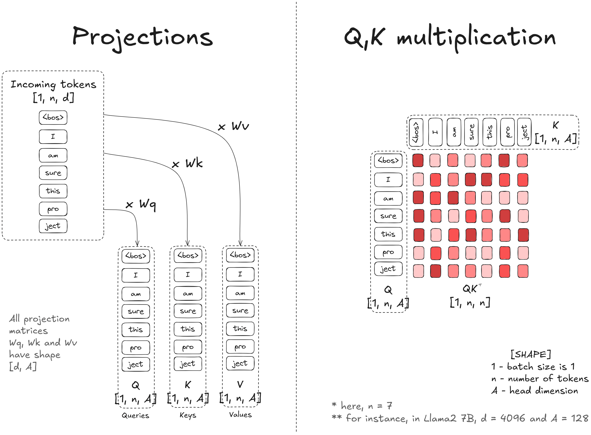

#### Attention 计算

- Q 和 K 相乘 → **[1, n, n]** 注意力分数矩阵
- 这导致 attention 是**二次复杂度** O(n²d)
- 应用 mask、做 row-wise softmax、再乘 V → 输出 [1, n, A]

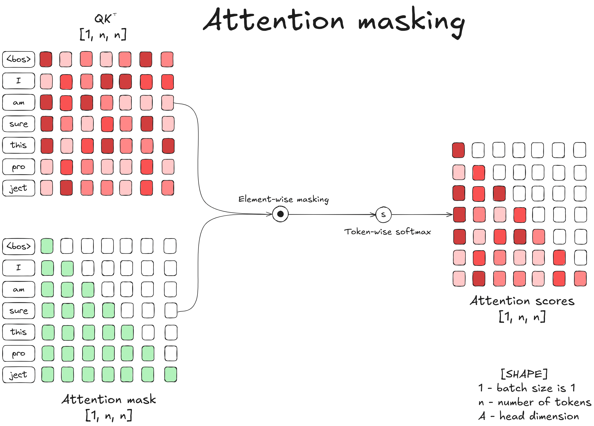

#### Causal Mask 是核心

布尔值 attention mask 控制谁能看到谁。**因果 mask** 让每个 token 只能看到它前面的 token。

> 把整个 mask 设为 False，整个网络中的 token 就再也不会相互影响。

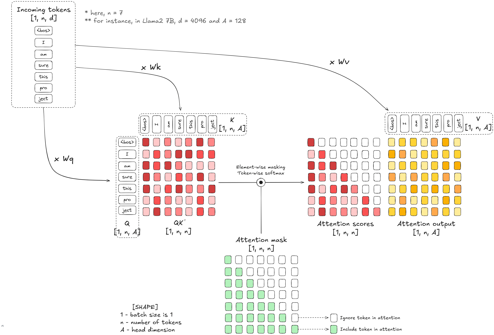

#### 推广形状（为后面的 continuous batching 铺垫）

- Q 形状 **[1, n_Q, A]**
- K 形状 **[1, n_K, A]**
- V 形状 **[1, n_V, A]**
- QK^T 形状 **[1, n_Q, n_K]**
- 约束：**n_K = n_V**

后面只用一张简化图来代表 attention，重点关注 Q 和 mask：

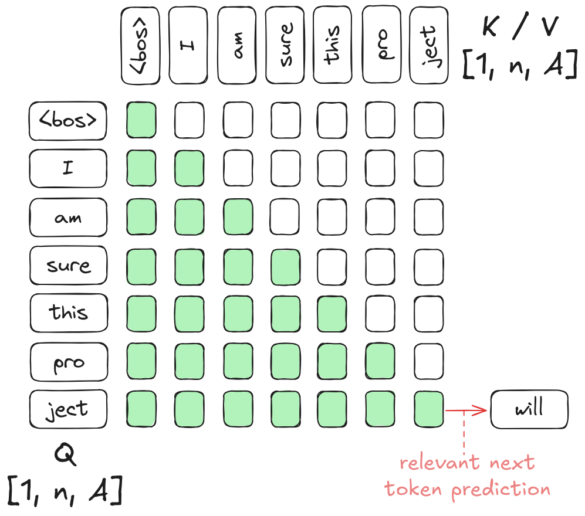

#### Mask 的可视化阅读

- **绿色方块** = True：token j 影响 token i
- **白色方块** = False：无影响
- 例：在 `am` 那一行，`I` 列绿色（影响），`pro` 列白色（不影响）

#### Prefill vs Decoding

- **Prefill**：把整个输入序列一次过 attention，生成第一个新 token
- **Decoding**：逐 token 生成后续输出

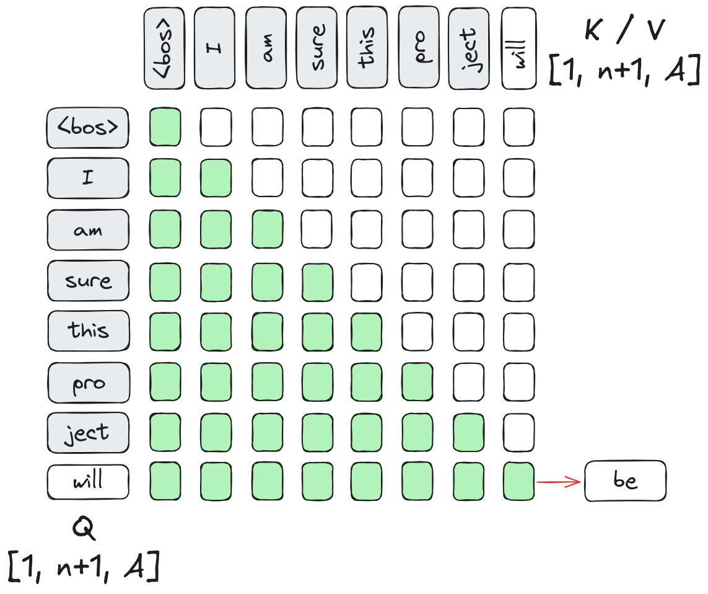

朴素方法每生成一个 token 都要重算前面所有 token 的 K 和 V → 大量重复计算。

---

### 1.2 KV Cache：把二次降到一次

#### 关键观察

由于 causal mask，**最后一个 token 不影响其他 token 的注意力计算**。

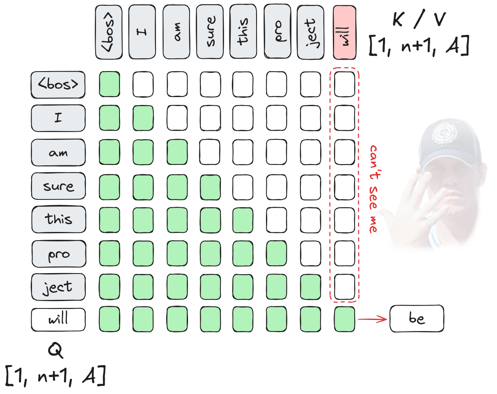

#### KV Cache 定义

> **KV cache** = 生成过程中产生的 K 和 V 状态的列表。

复杂度变化：

| 方式 | 算 token n+1 的复杂度 | 内存代价 |
|------|------------------------|----------|
| 无缓存 | **O(n²)** | — |
| 有 KV cache | **O(n)** | **O(n)** |

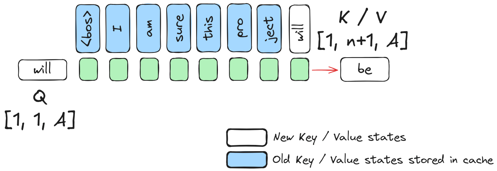

#### 缓存大小估算

对一个 L 层、H 头、每头维度 A 的模型：

> **每个 token 的 KV cache 大小 = 2 × L × A × H** （×2 是 K 和 V 各一份）

**Llama-2-7B 实例**：L=32, H=32, A=128 → 每 token 每层 2×32×128 = 8192 个值 → float16 下 **每 token 16 KB**。

→ 这就是为什么长上下文 + 多并发 = VRAM 杀手。

---

### 1.3 Chunked Prefill：长 prompt 的分块处理

实际场景里 prompt 经常很长（Cursor 把整个仓库塞进上下文）。当 n 个 token 的 KV 装不下 GPU 时怎么办？

#### 分块策略

设每次 forward 最多处理 m 个 token，n=7、m=4：

> 块数 = ⌈n/m⌉ = ⌈7/4⌉ = 2

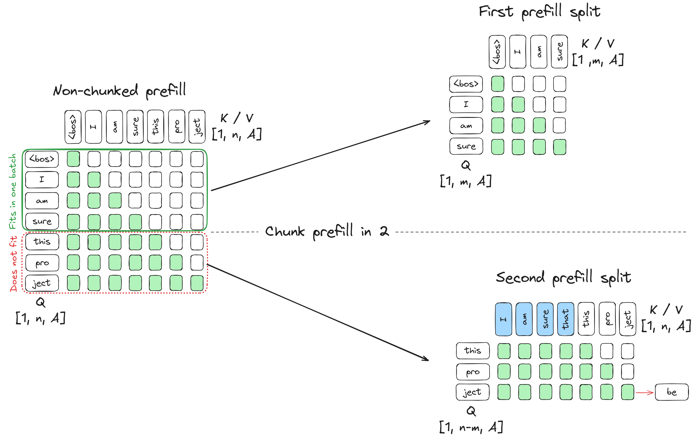

执行流程：
1. 第一块 prefill 时存下产生的 KV
2. 第二块 prefill 时把存下的 KV 拼到前面
3. 相应调整 attention mask（让第二块能看到第一块）

> **核心 insight**：缓存的 KV 让我们能增量处理 prompt 而不丢信息。

> [!NOTE]
> 评论区 zinchse 的重要补充：chunked prefill 的**主要动机其实不是显存**（显存可以用 FlashAttention 解决），而是**长 prefill 会阻塞同 batch 里所有 decode 请求**。把 prefill 切碎后，decode 请求可以在块之间继续推进；而且 prefill 块是 compute-bound 的，decode token 几乎可以零边际成本搭便车——这把内存受限的 decode-only batch 变成了计算饱和的 batch。详见 **SARATHI 论文**。

---

### 1.4 Continuous Batching：消灭 padding，最大化 throughput

#### 目标：throughput

> **throughput = 每秒生成 token 数**。要提高它，就在一个 batch 里并行生成多个 prompt 的 token。

#### 朴素 batched 生成：左 padding

张量必须是矩形的 → 不同长度的 prompt 必须 padding 到等长。用**左 padding**让"下一个 token 来自最右侧 token"这个规则保持不变。

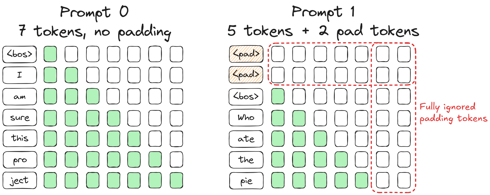

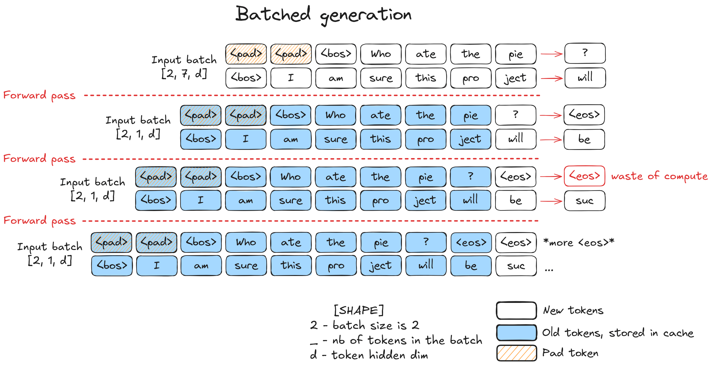

#### 第一个问题：等长浪费

如果某个 prompt 提前生成 `<eos>`（End Of Sequence），它后面继续生成的 token 全是浪费——直到最长的 prompt 也结束。

#### Dynamic Batching（动态调度）

→ 把已完成的请求换成等待中的新请求。

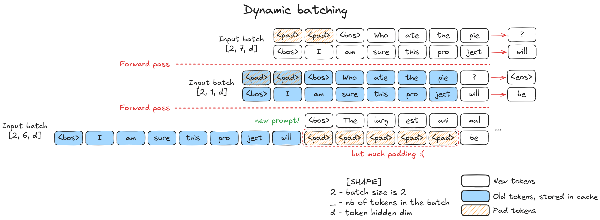

新问题：新加入的 prompt 需要 prefill，而其他在 decode → 必须 padding 到同一长度。

#### Padding 成本公式

> 在一个 batch 大小 B 的 decode 中插入一个长度 n 的新 prompt：
>
> **padding token 数 = (n−1) × (B−1)**

例：B=8、n=100 → 99 × 7 = **693 个 padding token**！代价随 batch 大小和 prompt 长度**二次增长**。雪上加霜的是 CUDA graph 和 `torch.compile` 都需要静态形状，padding 还得 pad 到固定上限。

#### Ragged Batching：消灭 batch 维度

干脆把 batch 维度去掉——把所有 prompt 沿序列维度**直接拼起来**：

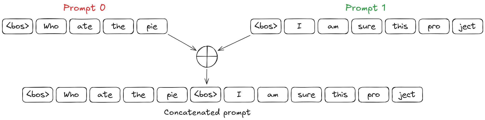

然后用 **attention mask** 阻止跨 prompt 的 token 互相看见：

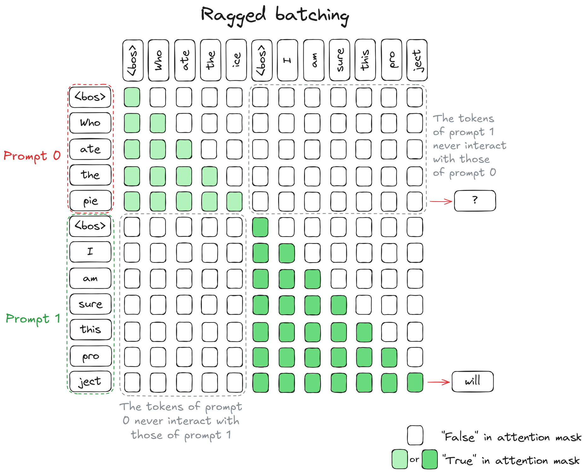

> **ragged**（参差不齐）= 序列长度不齐。好处：吞吐量提升，零 padding，只受 m（每 batch token 预算）限制。

#### Continuous Batching = Ragged + Dynamic

最终算法：

1. 始终尽量打满 m 个 token 的预算
2. 先把所有 decoding 阶段的 prompt 加进来（每个占 1 token）
3. 用 prefill 阶段的 prompt 填满剩余空间（chunked prefill 让这步很灵活）
4. 完成的请求立即移出，新请求立即加入

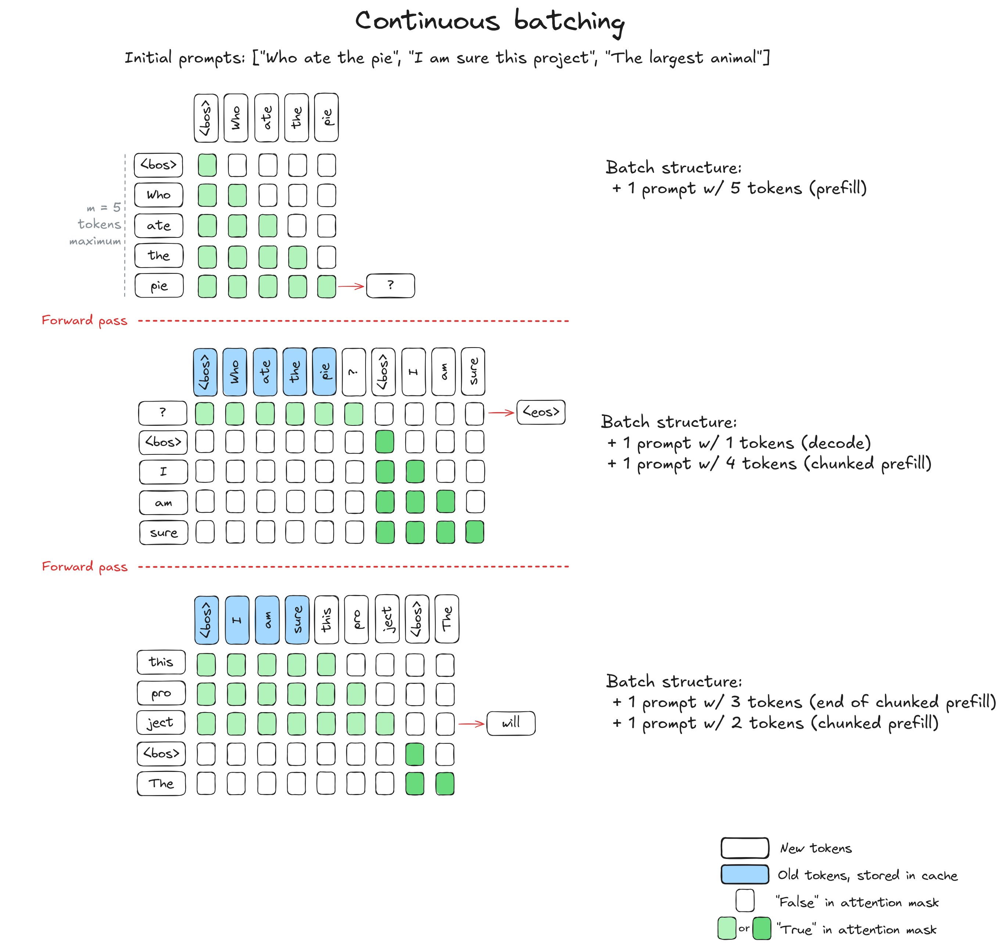

> 这就是为什么 ChatGPT 这种服务能高效服务上千并发用户。

#### 第一篇结论

Continuous batching = **KV cache + chunked prefill + ragged batching + dynamic scheduling** 四件套。
- 去掉 batch 维度
- 用 attention mask 控制 token 之间的可见性
- 让 prefill 和 decode 在同一个 batch 里混合执行

---

## Part II — 进一步：解锁异步性，再榨 22%

> 第一篇做完之后，**GPU 内部已经被打满**。但作者继续 profiling，发现 **GPU 整体仍有 24% 空闲**——因为 CPU 和 GPU 还在轮流工作。

### 2.1 同步批处理仍有 24% 浪费

H200 GPU 在 Inference Endpoints 上 ~$5/小时（~$120/天），每 1% 利用率提升都是钱。

朴素同步循环：
1. CPU 选请求组成 batch
2. CPU 更新 KV cache 表（驱逐已完成、纳入新请求）
3. CPU 把准备好的输入 H2D 传到 GPU
4. GPU 跑 forward + 采样
5. 结果 D2H 回 CPU；进入下一轮

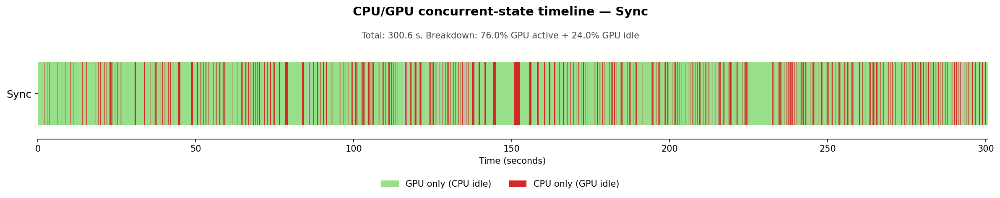

**实测**（Llama-3 8B，8K tokens，batch=32）：

| 指标 | 数值 |
|------|------|
| 总生成时间 | 300.6 s |
| GPU 空闲占比 | **24.0%** |
| 消除 CPU overhead 后理论时间 | 228 s |
| **理论 free speedup** | **~24%** |

> 三个待解决的工程问题：
> 1. CPU 怎么把活儿丢给 GPU 后立即返回？
> 2. 怎么保证每个任务启动时所需数据已就绪？
> 3. batch N+1 的输入依赖 batch N 的预测，怎么提前准备？

---

### 2.2 制造并发：CUDA Streams

#### CUDA Stream 是什么

> CUDA stream = **GPU 操作的有序队列**（kernel 启动、内存拷贝、同步屏障）。
> - **同 stream 内**：严格顺序执行
> - **跨 stream**：相互独立、可并发

每个 GPU 操作都需要 CPU 启动（找 kernel、发调用、传命令），这就是 **CPU launch overhead**。

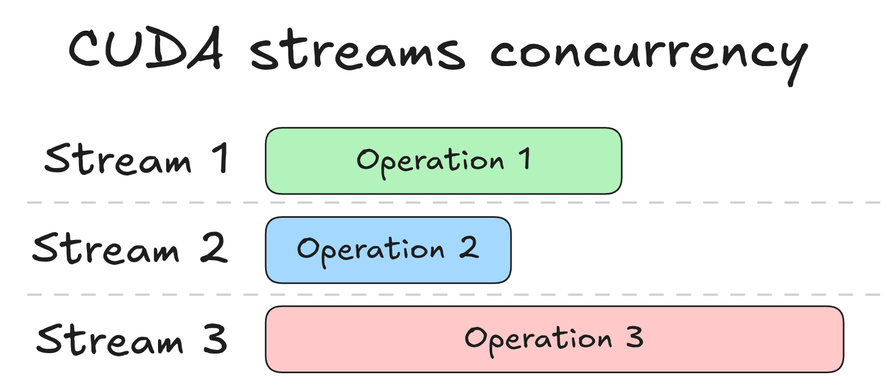
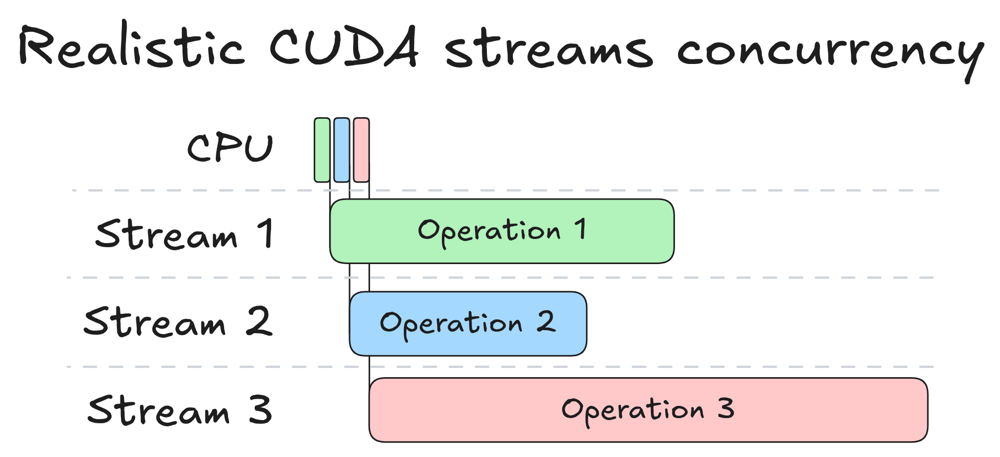

#### Default Stream 是个坑

PyTorch 的默认 stream 是**同步的**：
- 它上面的操作必须等所有其他 stream flush 才执行
- 反之，所有其他 stream 也要等它 flush

→ 一旦用了 default stream，并发性彻底丢失，即使你设了 `non_blocking=True` 也没用。

**结论：必须用非 default stream。**

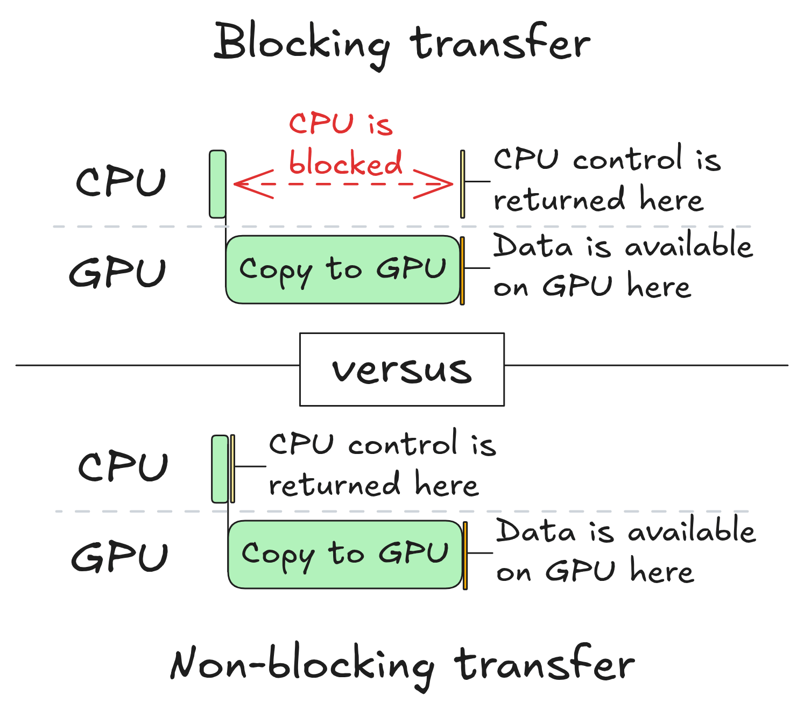

#### 三个 Stream 的分工

CUDA 术语 **host = CPU**，**device = GPU**：

1. **H2D stream** — host → device 输入传输
2. **Compute stream** — GPU forward pass
3. **D2H stream** — device → host 输出传输

#### 第一次失败：没有同步就乱了

把三件事丢到三个 stream 上 → 速度飞快但**结果错了**：stream 之间互不等待，compute 可能基于旧 GPU 内存运行，D2H 可能传出还没算完的结果。

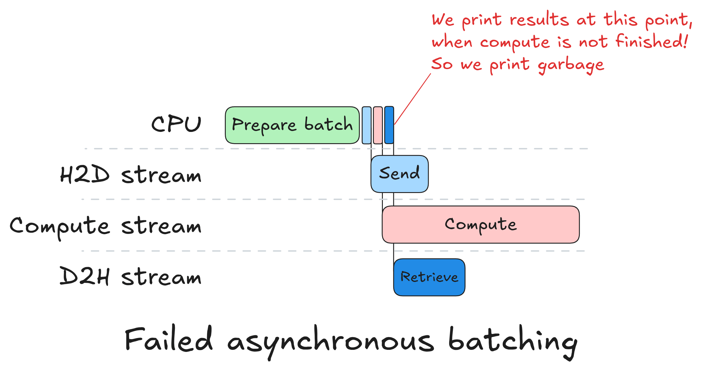

---

### 2.3 用 CUDA Event 强制同步

#### CUDA Event 是什么

> CUDA event = 插入到 stream 中的**标记**。GPU 执行到该标记时 event 完成；其他 stream 可以"等"它。

两个 API：
- `stream.record(event)` — 在 stream 中插入标记
- `stream.wait(event)` — 让该 **stream**（不是 CPU！）阻塞直到 event 完成

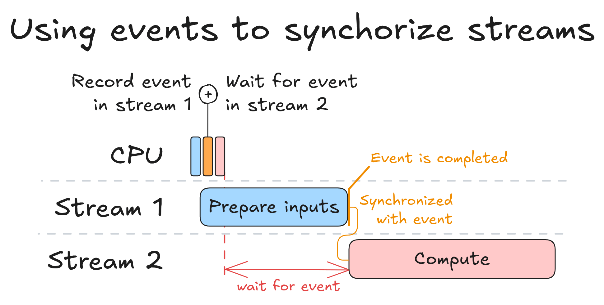

#### 在 continuous batching 中的用法

```python
# H2D 入队后
h2d_stream.record(h2d_done)

# 计算前
compute_stream.wait(h2d_done)
# 入队 model.forward
compute_stream.record(compute_done)

# D2H 前
d2h_stream.wait(compute_done)
# 入队输出回传

# CPU 在循环末尾等待
d2h_done_event.synchronize()
```

完整流水线：
1. H2D 拷贝在 `h2d_stream` 上跑
2. Compute 在 `compute_stream` 上 wait `h2d_done` → 跑 forward → record `compute_done`
3. D2H 在 `d2h_stream` 上 wait `compute_done` → 跑回传
4. CPU 只在 `d2h_done_event.synchronize()` 处阻塞

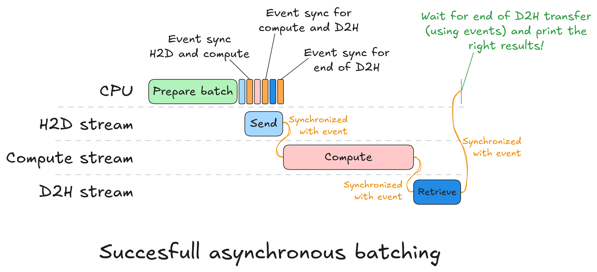

---

### 2.4 填补真空：CPU 提前准备 batch N+1

CPU 在 dispatch 完 batch N 到等回 batch N 结果之间空着，正好用来准备 batch N+1。但带来两个新问题。

#### 4.1 Race Condition → 双 Slot

如果两个 batch 共享 device 端的 buffer，CPU 可能在 GPU 还在读时就覆写。

**双 slot A/B 交替**：GPU 在 slot A 跑 batch N 时，CPU 在 slot B 准备 batch N+1。代价是 input/output tensor 的 RAM/VRAM 翻倍（FlashAttention 不需要 attention mask 时开销更小）。

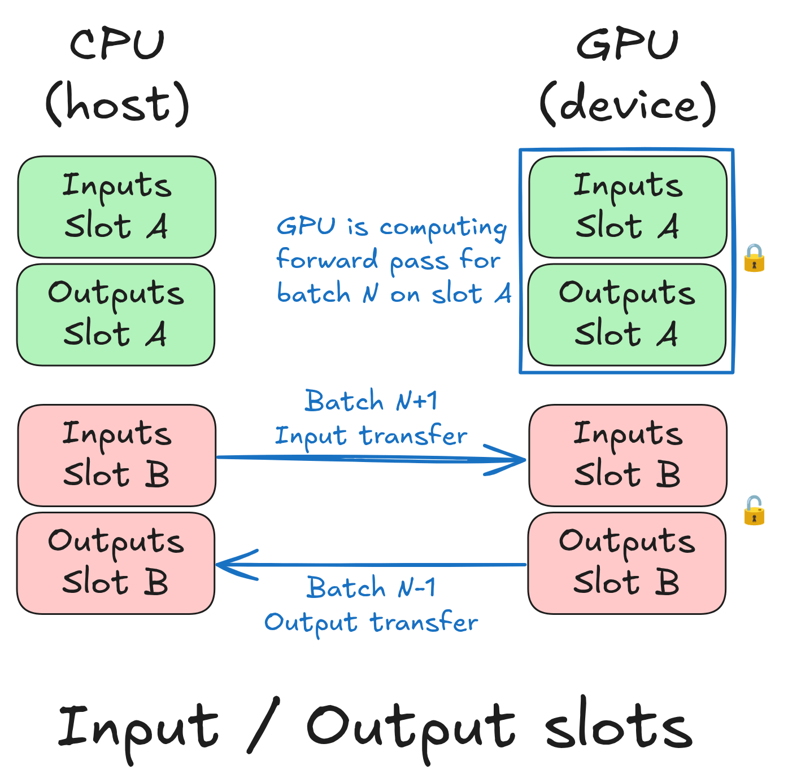

##### CUDA Graph 的问题

[CUDA graphs](https://pytorch.org/blog/accelerating-pytorch-with-cuda-graphs/) 是预录的操作序列，**绑定到具体内存地址**。两个 slot → 两个 graph → 看似要双倍 VRAM。

**解法：Memory pool**——共享缓冲池，两个 graph 都从中分配。约束：同 pool 的 graphs 不能并发执行（这里天然满足，因为 batch N 必须先完成 batch N+1 才开始）。**总 VRAM ≈ 单个 graph 的体积**，只是初始化时多了一次 capture。

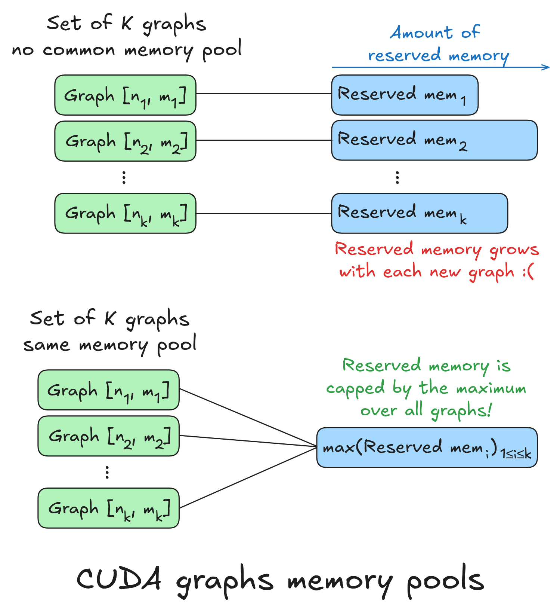

#### 4.2 Carry-Over：跨 batch 传 token

某个请求同时存在于 batch N 和 batch N+1 → batch N 产生的新 token 是 batch N+1 的输入，但准备 batch N+1 时这个 token **还没生成**。

**解法**：
1. 在 batch N+1 中先用 **0 作为占位符**
2. batch N 算完后、batch N+1 forward 前，做一次 **carry-over**：
   - 从 batch N 输出中挑出要传递的 token 写入 tensor T
   - 不需要传递的位置置零
   - 截断 T 到 batch N+1 输入长度
   - 把 T **加到** batch N+1 input ids 上（占位符是 0，加法等价于赋值）

**Carry-over mask**：目标索引 tensor，**-1 表示"不传递"**。这 4 个操作非常便宜，可以塞进 CUDA graph。

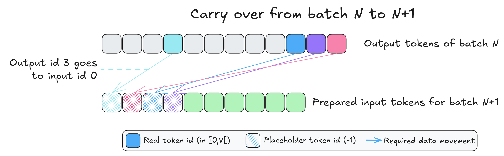
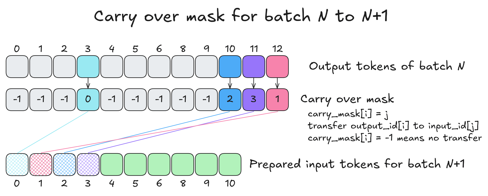

---

### 2.5 完整异步循环

**Step 0（冷启动）**：CPU 在 slot A 准备 batch 0，**同步**派发。

**Step 1**：异步循环开始。
- GPU 在 slot A 跑 batch 0
- CPU 同时在 slot B 准备 batch 1（驱逐、纳入、KV cache 路由、carry-over mask）
- CPU 入队 H2D，record/wait events，继续

**Step 2**：并行进行
- Slot A：compute 完成 → `compute_done` 触发 → D2H 把 batch 0 输出传回
- Slot B：H2D 完成 → `h2d_done` 触发 → batch 1 compute 开始（含 carry-over）

CPU 在 `d2h_done_event.synchronize()` 阻塞直到 batch 0 输出落地，处理结果，调度 batch 2。

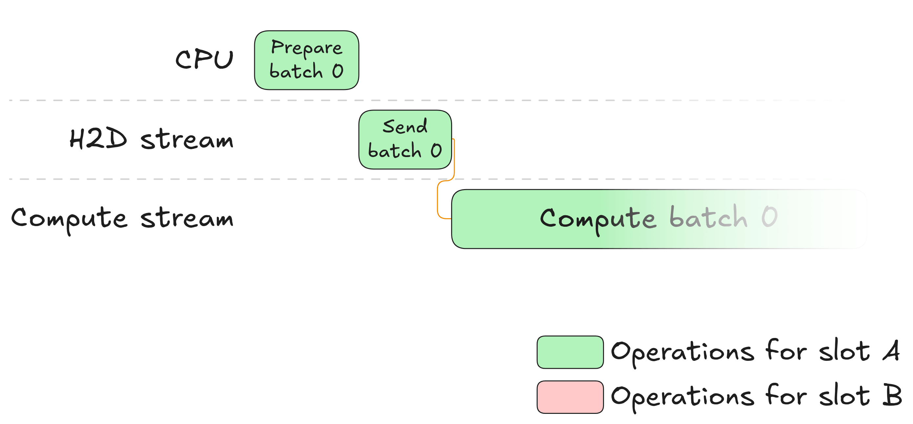
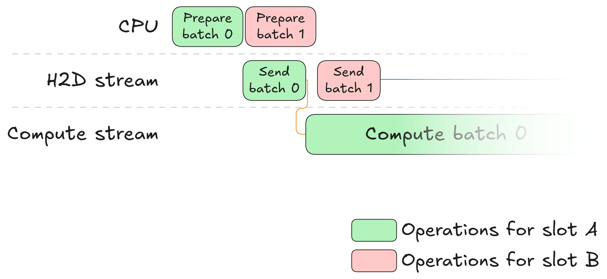
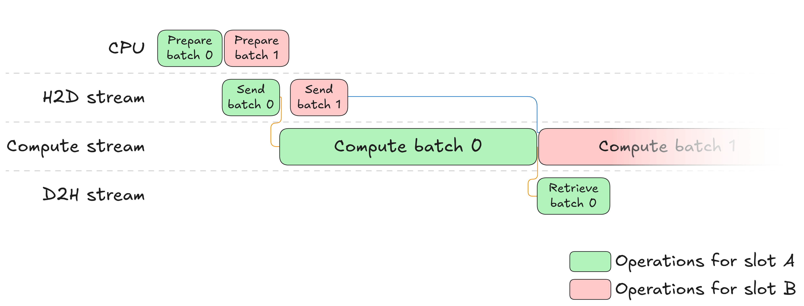
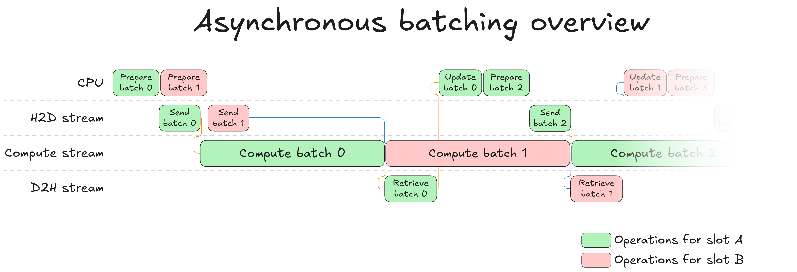

> **核心思想**：从"调度依赖"（CPU 排时间表）切换到"数据依赖"（用 event 让 stream 互相等数据）。只要 batch N+1 的输入在 batch N 完成时已经就绪，GPU 就永不空闲。

---

### 2.6 实测效果

同样配置：8K tokens，batch=32，8B 模型。

| 指标 | 同步 | 异步 | Δ |
|------|------|------|---|
| GPU 活跃占比 | 76.0% | **99.4%** | **+23.4 pp** |
| 总生成时间 | 300.6 s | **234.5 s** | **−22.0%** |

理论上限 24%，实测 22%，差距来自不可避免的 CPU `synchronize()` 阻塞点。

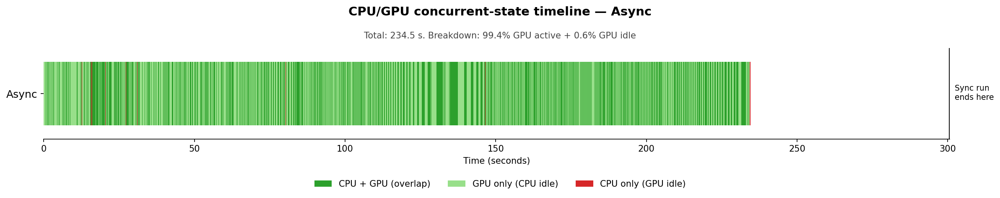

> **完全没有写新的 GPU kernel，也没改模型架构** —— 只是 CPU/GPU 协调方式的工程优化。

---

## Part III — 整体认知：从 token 调度到 stream 调度

### 3.1 两篇博客的逻辑闭环

| 层次 | 第一篇解决的问题 | 第二篇解决的问题 |
|------|------------------|------------------|
| 张量层 | 怎么不浪费 GPU 矩阵的格子？ | — |
| 调度层（GPU 内部） | 怎么把不同长度、不同阶段的请求混进同一个 batch？ | — |
| 调度层（CPU↔GPU） | — | 怎么让 CPU 和 GPU 不互相等待？ |
| 关键技术 | KV cache、chunked prefill、ragged batching、dynamic scheduling | 三个 stream、CUDA event、双 slot、memory pool、carry-over |
| 不变量 | attention 是唯一的 token 互动点 → 用 mask 控制可见性 | stream 互相独立 → 用 event 表达数据依赖 |

> **抽象层面的对应**：第一篇用 attention mask 在张量空间表达"谁能看谁"的依赖，第二篇用 CUDA event 在时间空间表达"谁等谁"的依赖。两者都是**用显式依赖图替代隐式时序**——这是高性能并发系统的通用设计哲学。

### 3.2 关键概念全景速查

| 类别 | 概念 | 含义 |
|------|------|------|
| **基础** | Attention mask | 控制 token 互相影响的布尔矩阵 |
| | Causal mask | 每 token 只能看自己和之前 |
| | KV cache | 把 K/V 状态缓存避免重算，O(n²)→O(n) |
| | Prefill / Decode | 处理整个 prompt / 逐 token 生成 |
| | EOS | 模型生成的"结束标记" |
| **打包** | Padding | 短 prompt 补齐到等长（浪费） |
| | Chunked prefill | 长 prompt 切分为多块，连同 KV 一起处理 |
| | Ragged batching | 去掉 batch 维度，prompt 沿序列拼接，用 mask 隔离 |
| | Continuous batching | Ragged + 动态调度，混 prefill 和 decode |
| **并发** | CUDA Stream | GPU 操作的有序队列 |
| | Default Stream | 隐式同步 stream（陷阱） |
| | CUDA Event | 标记，用于跨 stream 同步 |
| | H2D / D2H | host↔device 内存传输 |
| | CPU launch overhead | CPU 启动 GPU 操作的固定开销 |
| **资源** | Slot A/B 交替 | 解决共享 buffer 的 race condition |
| | CUDA Graph | 预录操作序列，绑定具体内存地址 |
| | Memory pool | 多 graph 共享 VRAM |
| | Carry-over | 把 batch N 输出 token 注入 batch N+1 输入 |
| | Carry-over mask | -1 表示"不传递"的索引 tensor |

### 3.3 关键数学公式

| 公式 | 含义 |
|------|------|
| Q, K, V shape = [1, n, A] | 单 batch 单头 |
| Attention 复杂度 = O(n²d) | 序列长度二次复杂度 |
| 无 KV cache 算 token n+1 = O(n²) | 重算所有 K/V |
| 有 KV cache = O(n) compute, O(n) memory | 用空间换时间 |
| 单 token KV cache = 2·L·A·H | 每层 K/V 各一份 |
| Llama-2-7B：每 token 16 KB（fp16） | 长上下文显存杀手 |
| Chunk 数 = ⌈n/m⌉ | m 是单批 token 预算 |
| 朴素动态批的 padding 浪费 = (n−1)(B−1) | 二次增长 |

### 3.4 工程价值与启示

1. **复杂度先于工程**：第一篇核心是把 O(n²) 降到 O(n)，这是质变；后续 padding/batching 优化都是 O(n) 内的常数因子打磨。
2. **Mask 是个被低估的工具**：在 attention 里用它隔离不同 prompt（ragged batching），在生成里用它隔离 carry-over（-1 表 "不传"），同一抽象贯穿两层。
3. **静态形状是把双刃剑**：`torch.compile` / CUDA graph 要求静态形状 → padding 浪费；但反过来 CUDA graph 又是异步实现的关键。Memory pool 是缓解张力的妙招。
4. **"免费的 24%"是真实存在的**：只要推理 stack 还是同步的，这部分性能就在桌上等你拿。
5. **数据依赖 > 调度依赖**：与其 CPU 主动协调时序，不如让 GPU stream 之间通过 event 互相等待数据就绪——这是异步系统的通用设计哲学。
6. **GPU 越大越值**：模型规模增长但调度逻辑成本恒定 → 计算密集型场景下 GPU 始终是瓶颈，CPU 异步几乎不会成为新瓶颈。

---

## Open Questions

- **多 GPU/张量并行**场景下，跨设备同步会让 event 机制更复杂吗？是否需要 NCCL 级协调？
- **变长 batch**（Pramodith 评论提的）：batch N 和 N+1 的 size 不同时，CUDA graph 的 capture 策略是预先 capture 多个 size 还是用 max-batch + mask？
- **PD 分离**（prefill/decode disaggregation）和本文异步思想如何组合？vLLM/SGLang 已经把 prefill 和 decode 拆到不同 GPU，是否每个 GPU 上还要再叠一层 CPU/GPU 异步？
- **CPU 端瓶颈**：当模型小（< 1B）或 batch 极大时，CPU 准备时间是否反而成为新瓶颈？是否需要多 CPU 线程并行准备多个 slot？
- **Chunked prefill 的真正动机**：评论 zinchse 指出它主要不是为内存而是为避免阻塞 decode（参 SARATHI 论文）——这与 continuous batching "混合 prefill+decode" 的设计哲学如何调和？
- 下一篇预告的 **decode-specific kernels + 细粒度 compile**，对 16K+ 长序列（RL 训练场景）能再榨多少？

## References

- [HF Blog — Continuous batching from first principles](https://huggingface.co/blog/continuous_batching) (2025-11-25)
- [HF Blog — Unlocking asynchronicity in continuous batching](https://huggingface.co/blog/continuous_async) (2026-05-14)
- [HF Blog — KV caching visualizations (not-lain)](https://huggingface.co/blog/not-lain/kv-caching)
- [HF Blog — KV cache implementation](https://huggingface.co/blog/kv-cache)
- [PyTorch Blog — Accelerating PyTorch with CUDA Graphs](https://pytorch.org/blog/accelerating-pytorch-with-cuda-graphs/)
- [FlashAttention](https://github.com/Dao-AILab/flash-attention)
- [transformers — continuous_api.py](https://github.com/huggingface/transformers/blob/main/src/transformers/generation/continuous_batching/continuous_api.py)
- [transformers — `ContinuousBatchingAsyncIOs` 类](https://github.com/huggingface/transformers/blob/5042bb7eb64b69efd351482a05b3803c48955cb4/src/transformers/generation/continuous_batching/input_outputs.py#L609)
- [SARATHI 论文（chunked prefill 设计动机）](https://arxiv.org/abs/2308.16369)
- [Profiling 脚本 by remi-or](https://gist.github.com/remi-or/8de44738629c4d3c72451aa01df1a2ab)
- [HF Inference Endpoints](https://endpoints.huggingface.co/)
