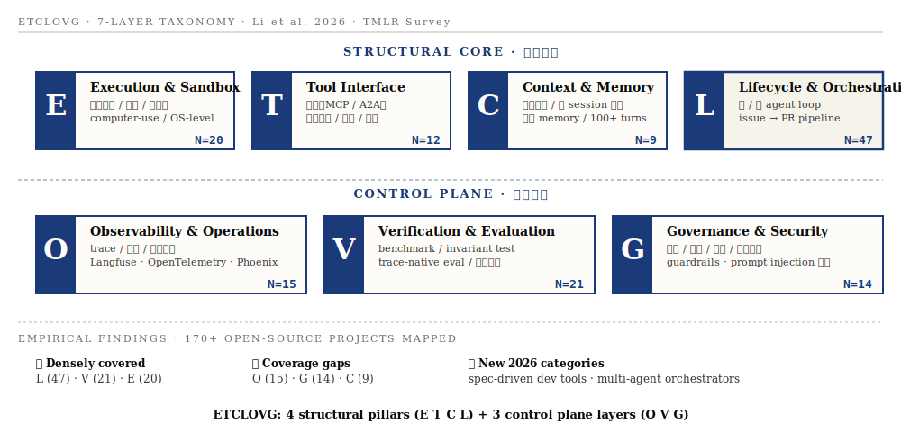

# Agent Harness Engineering: A Survey · 深度解读

- **Date:** 2026-05-25
- **Tags:** #harness #agent #survey #etclovg #binding-constraint #tmlr #agent-systems
- **Paper:** [OpenReview](https://openreview.net/forum?id=eONq7FdiHa) · TMLR under review · 2026
- **Project page:** [picrew.github.io/LLM-Harness](https://picrew.github.io/LLM-Harness/)
- **GitHub corpus:** [Picrew/awesome-agent-harness](https://github.com/Picrew/awesome-agent-harness)
- **Authors:** Junjie Li (CMU), Xi Xiao (UAB), Yunbei Zhang (Tulane), Chen Liu (Yale), and 16 others from CMU / Yale / JHU / NEU / Tulane / UAB / OSU / Virginia Tech / Amazon

## TL;DR

> 第一篇把 **agent harness engineering** 作为独立研究方向系统化的综述。提出 **binding-constraint thesis**——对长程任务，benchmark 表现差异主要来自 harness 不是模型——并用 **3 个跨独立团队的硬数据** 支撑：harness-only 改动达到 **10× / +13.7pp / 76.4%**，每个都超过同期"更好模型"在同 benchmark 上 **2-4pp** 的典型涨幅。然后提出 **ETCLOVG** 七层分类法（Execution / Tool / Context / Lifecycle / Observability / Verification / Governance），把 **170+ 个开源项目** 映射进去，揭示生态空白。最后给 **5 个开放问题** 形成研究路线图。

**一句话定位**：把 Anthropic / OpenAI 那批工业博客（Lopopolo / Young / Rajasekaran 等）的实践智慧，**升级到学术综述层级**——给"harness 是不是只是大厂自吹"提供了系统的反驳。

## Context

2025-11 到 2026-03 这半年里，Anthropic 发了 [Effective Harnesses for Long-Running Agents](https://www.anthropic.com/engineering/effective-harnesses-for-long-running-agents) 和 [Harness Design](https://www.anthropic.com/engineering/harness-design-long-running-apps)，OpenAI 发了 [Harness Engineering](https://openai.com/index/harness-engineering/) 和 [Codex App Server](https://openai.com/index/unlocking-the-codex-harness/)，AWS 发了 [AIDLC Workflows](https://github.com/awslabs/aidlc-workflows)。**4 篇博客 + 1 个 SDK，跨两家公司**，提出一个共同发现：**模型能力上限不取决于模型本身，而取决于包裹在模型外部的工程系统**。

这篇 survey 是对这股工业潮流的<u>学术响应</u>——它解决的是 Anthropic / OpenAI 文献的两个根本缺陷：

1. **缺乏统一术语**：4 篇博客用了 "context engineering" / "harness engineering" / "agent infrastructure" / "spec-driven development" 等不同词
2. **缺乏量化证据**：博客读起来像"故事"，不像"数据"

Survey 用了 **170+ 个开源项目的实证映射** + **3 个跨团队 benchmark 数据** 把这两个缺陷补上。

读完这篇综述，我对 harness 工程的认知比之前那 4 篇博客 + 自己 4 月的笔记加起来更深。这篇值得作为<u>所有人在 harness 这个话题上的"第一篇必读"</u>。

---

## Main Content

### 1. Binding-Constraint Thesis · 核心论断

> **For long-horizon tasks evaluated across comparable frontier models, benchmark variance may be driven as much by the execution harness as by the model itself.**

这是这篇 survey 最重要的一个论断。它直接挑战了过去 5 年 LLM 研究的隐含假设——"agent capability is primarily a function of model capability"（Agent 能力主要是模型能力的函数）。

#### 三个支撑证据（每一个都跨独立团队）

| 证据 | 团队 | 改动 | 结果 |
|---|---|---|---|
| **Bölük 2026** | 独立研究 | 仅修改 edit-tool 格式（怎么让 Agent 编辑文件） | 跨 15 个模型 **+10× 编程 benchmark** |
| **Trivedy 2026 · LangChain DeepAgents** | LangChain | 固定 GPT-5.2-Codex，仅改 system prompt + middleware + self-verify hooks | Terminal-Bench 2.0: **52.8% → 66.5% (+13.7pp, +26% relative)** |
| **Lee et al. 2026 · Meta-Harness** | Stanford / MIT | 自动化 harness 优化（搜索 prompts、tools、control loops） | Terminal-Bench-2: **76.4%**，超过所有手工调优 |

**关键对比**：以上每个数字都<u>超过</u>同期"更好模型"在同 benchmark 上 2-4pp 的典型涨幅。

也就是说：

> **变量是 harness，不是模型。**

#### 为什么这件事重要

如果你接受这个论断，意味着：

1. **学术研究的关注点要重排**：Memory / Tool use / Planning / Safety 是 component，但<u>把它们组合成可靠系统的工程问题</u>（也就是 harness）才是 binding constraint
2. **工业界的投资方向要重排**：与其继续追下一代模型，不如投资 harness（这正是 OpenAI 内部 Symphony / Codex 团队在做的）
3. **研究员的稀缺力要重排**：能写 harness 的人比能写模型的人值钱（至少在 short-to-mid term）

### 2. Three Engineering Phases · 工程演化三阶段

| 阶段 | 时间 | 优化目标 | 核心问题 |
|---|---|---|---|
| **Prompt Engineering** | 2022–2024 | 单次输入文本 | "What's the input?" |
| **Context Engineering** | 2025 | 单步看到的所有信息 | "What should the model see at each step?" |
| **Harness Engineering** | 2026+ | 整个执行环境 | "What governance / constraints / feedback / execution control must we design around the model?" |

**关键性质**：

- 后一个阶段**包含**前一个阶段（harness ⊃ context ⊃ prompt）
- 三个阶段**在时间上重叠**——prompt engineering 至今仍在用，但已经从主要矛盾退化为子问题
- 每次范式跃迁都伴随**工程范围的扩张**：从单文本 → 多信息流 → 整个系统

这跟 AIDLC 的 "AI-Assistant → AI-Driven → AI-Management" 三阶段是对应的，**只是从工程师视角看的版本**。

### 3. ETCLOVG · 七层分类法

ETCLOVG 把 agent harness 分成 **7 层**：4 层结构主干（E·T·C·L）+ 3 层控制平面（O·V·G）。

#### 4 层结构主干（系统骨架）

##### E · Execution Environment & Sandbox（执行环境）

> Agent 代码物理上在哪跑、被什么沙盒约束。

- **7 个产品类别**：通用托管沙盒（Daytona、E2B、Modal）、computer-use 基础设施（Anthropic Computer Use、OSWorld）、代码专用沙盒（Judge0、OpenAI Code Interpreter）、框架集成 runtime（OpenHands）、浏览器评测环境（WebArena、BrowserGym）、OS 级权限沙盒（Anthropic sandbox-runtime、IsolateGPT）、沙盒抽象层（SWE-ReX、K8s Agent Sandbox）
- **隔离技术**：容器 → gVisor → Firecracker microVM → Kata Containers → WebAssembly → OS-level primitives
- **三个用途同时满足**：security（防恶意 code）+ reproducibility（可重置基线）+ **liveness**（不需要每次问用户授权——这一点是 agent 时代<u>新</u>的）
- **关键数据**：Anthropic 报告引入沙盒后 Claude Code 的权限提示减少 **84%**，但安全性保留

##### T · Tool Interface & Protocol（工具接口）

> Agent 怎么发现 / 描述 / 调用外部能力。

- **协议层**：MCP（Model Context Protocol, Anthropic 2024）、A2A（Agent2Agent, Google 2025）正在成为标准
- **核心子问题**：tool description / tool discovery / tool selection / tool-augmented training
- **关键洞察**：tool 数量不能太多——"如果人类工程师都说不出哪个 tool 适用，模型也不行"

##### C · Context & Memory Management（上下文管理）

> 模型在每一步看到什么信息。

这一层 survey 写得最厚（10+ 页），分**三层 memory hierarchy**：

| Tier | 时间尺度 | 代表方案 |
|---|---|---|
| **Short-term** · 活跃上下文窗口 | 单 inference step | 系统 prompt 校准、token-efficient tool design、progressive disclosure、KV-cache aware design |
| **Mid-term** · 跨 turn / 跨 run 状态 | 单 session | 结构化 note-taking（NOTES.md / todo.md）、文件式 planning |
| **Long-term** · 跨 session 记忆 | 跨 day / week / 永久 | MemGPT / Mem0 / A-MEM / Generative Agents |

**关键论断**："**Larger context windows do not solve the memory problem**"——三个理由：

1. **二次注意力成本**：双倍上下文 = 4× 计算
2. **U 型注意力曲线**（Liu et al. 2024）：信息放在中间会丢失 **30%+** 准确率
3. **Context rot**（Hong et al. 2025）：跨 18 个前沿模型的实证——所有模型都在长上下文下退化，**且很多在 50K 时已显著退化**（即使标称 200K 窗口）

**关键工程实践**——Manus 团队提的 "**KV-cache hit rate is the single most important metric for a production-stage AI agent**"。原因：cached tokens 比 uncached 便宜 **10×**（$0.30/MTok vs $3.00/MTok on Claude Sonnet）。

##### L · Lifecycle & Orchestration（生命周期与编排）

> Agent 系统怎么把任务跨 model call / tool call / failure / handoff 跑下去。

**3 个层级 × 2 个状态模型**：

| 层级 | 代表系统 | 主要模式 |
|---|---|---|
| **Single-Agent Inner Loop** | OpenCode (159k★)、Claude Code (123k★)、Gemini CLI (104k★)、Codex CLI (82k★)、Aider (45k★) | ReAct loop |
| **Multi-Agent Orchestration** | DeerFlow (67k★)、AutoGen (58k★)、LangGraph (32k★)、OpenAI Agents SDK (26k★)、DeepAgents (23k★) | Hierarchical / Team / Workflow / Fan-out / Graph composition |
| **Full Lifecycle Pipeline** | Vibe Kanban (26k★)、Symphony (24k★)、GitHub Agentic Workflows (5k★) | Issue → PR pipeline |

**状态模型**：Stateless replay（重放交互历史）vs Stateful execution（持久化外部状态）vs Hybrid。

L 层是 **170+ 项目里覆盖最密集的一层**（N=47），说明这是当前生态最卷的方向。

#### 3 层控制平面（横切关注）

##### O · Observability & Operations（可观测性）

> Agent 系统的 trace / 成本 / 失败信号。

- **核心工具**：Langfuse、OpenTelemetry、Arize Phoenix、OpenLLMetry、AgentOps
- **重要数据**：LangChain 2026 调查显示 **89% 团队用 observability，仅 52.4% 跑离线评测**——这个 gap 意味着<u>团队能看到 agent 做了什么，但没系统地判断对不对</u>
- **作者的强论断**：把 Observability 提到独立层，不再埋在 lifecycle hook 里——理由是它有<u>独立的工具栈和运维实践</u>

##### V · Verification & Evaluation（验证与评测）

> 怎么把 task 和 trace 变成评测、失败归因、回归反馈。

- **5 个子层**：Task and Benchmark Grounding / Pre-Execution Readiness Validation / Controlled Execution and Trace Capture / Multi-Level Judgement and Failure Attribution / Continuous Regression
- **核心趋势**：从 final-score-centric（看总分）到 **trace-native evaluation**（看轨迹）——把 observability 的 spans / tool calls / costs / retries 变成评测的主对象
- **关键数据**：N=21（开源项目数仅次于 L 层），说明这一层社区高度活跃

##### G · Governance & Security（治理与安全）

> 权限 / 身份 / 审计 / 加固 / 人工监督。

- **3 个子层级**：模型级（guardrails / 内容过滤）+ 系统级（gateway / proxy / 权限模型）+ 组织级（audit / 合规 / human-in-the-loop）
- **重要数据**：SandboxEscapeBench 显示 frontier 模型可以在真实配置下利用沙盒漏洞（agent 有能力越狱）
- **生态空白**：N=14，开源里覆盖最稀缺——大部分 governance 能力住在<u>商业平台</u>里。**这是研究空白，也是研究机会**

### 4. 170+ 项目的实证映射

| 层 | 项目数 | 状态 |
|---|---|---|
| **L** Lifecycle | 47 | 🔥 Densely covered |
| **V** Verification | 21 | 🔥 Densely covered |
| **E** Execution | 20 | 🔥 Densely covered |
| **O** Observability | 15 | ⚠ Coverage gap |
| **G** Governance | 14 | ⚠ Coverage gap |
| **T** Tool | 12 | ⚠ Coverage gap |
| **C** Context | 9 | ⚠ Coverage gap |

**3 个关键观察**：

1. **L 层最热**：大家都在卷"怎么编排 agent"。Claude Code、Gemini CLI、Codex CLI 都在这里
2. **C 层项目最少（N=9）**：但<u>不是因为它不重要</u>，而是因为它的核心问题（context rot、长程 state）尚未有共识方案——<u>这恰恰是研究热点</u>
3. **O 和 G 层覆盖稀缺**：商业系统在做但没开源——<u>这是开源社区的研究方向</u>

### 5. Cross-Layer Synthesis · 跨层综合

Survey 第 11 章讨论"当 7 层组合后产生的系统级效果"，这是<u>读单层时看不到的</u>。

#### 11.1 Cost-Quality-Speed Trilemma · 三难困境

每一层 harness 都有"投入更多 → 质量更好 → 但成本和延迟更高"的特性：

| 投入 | 收益 | 代价 |
|---|---|---|
| 强沙盒 + 真实环境 | 安全 + 可重复 | 启动延迟 + 基础设施成本 |
| 丰富 context + memory | 任务连续性 | token 消耗 + 检索 overhead |
| 深 evaluation + observability | 诊断能力 | 迭代速度 + 存储 + trace 处理 |

**关键洞察**：production 系统不能把 quality 当 scalar——必须决定<u>哪些风险值得昂贵控制、哪些检查可以异步、哪些 telemetry 在哪个 lifecycle 阶段值得抓</u>。

#### 11.2 Capability-Control Tradeoff · 能力-控制权衡

每一层"能力扩展"都对应"控制问题扩张"：

- 更大 tool 菜单 → 更广任务覆盖 + 更高选择错误率 + 更大 prompt injection 攻击面
- 持久 memory → 长程任务能力 + provenance / staleness / 隐私风险
- 宽松沙盒 → 自主执行能力 + 更大 blast radius

**关键洞察**："security 不是 add-on，是<u>设计轴</u>"——它贯穿 tool schema / context policy / runtime permission / identity / auditability / human approval 整条链。

#### 11.3 Harness Coupling Problem · 耦合问题

> Harness 的各层是**耦合**的——某一层的局部优化在系统级可能<u>失效甚至倒转</u>。

具体例子：

- **执行环境** 改变会影响 evaluation 结果（package 可用性 / reset 语义 / latency）
- **tool 描述** 既消费 context budget，又塑造模型行为
- **observability traces** 只有当 identity / permission state 在同 granularity 捕获时，才能成为 governance evidence
- **evaluation design** 反过来塑造 orchestration（哪种 recovery loop 被奖励、哪种被惩罚）

**关键论断**：Harness 改动必须当作<u>系统改动</u>测试。某个 prompt / tool / memory / sandbox / verifier / monitor 单看可能有益，但跟剩下的 control loop 组合起来可能<u>降低</u> rollout 质量。

这也解释了为什么 "agent score 不能干净地归因到模型上而不指明 controller"——同一个模型在不同 harness 里行为天差地别。

#### 11.4 From Frameworks to Platforms · 从框架到平台

> Frameworks 提供局部抽象（agents、tools、memory stores、execution loop）；
> **Platforms** 加上 durable workspaces、managed sandboxes、identity、billing、observability、evaluation、governance、human handoff——跨多个 run、多个 user。

**关键转变**：核心设计问题从"How do I build an agent?"**变为**"How do I operate a fleet of agents whose actions remain inspectable and reversible over time?"

这一节解释了为什么 LangChain（框架）在 2026 年开始投资 LangSmith（平台），为什么 OpenAI 推出 Symphony（agent control plane），为什么 Anthropic 在 Claude Code 之上做 Sandbox Runtime——**框架时代正在让位于平台时代**。

### 6. 5 个开放问题 · 研究路线图

最后一章给学术界一份明确的"接下来该做什么"清单：

#### Q1 · 强化和扩展执行环境

- **问题**：one-container-per-task 在 10k+ 并行 trajectory 时太贵，但学习的 surrogate environment（如 SWE-World）保真度未知
- **机会**：Common security evaluations + cost models + portability layers

#### Q2 · 长程 state 管理（recast as state estimation）

- **核心 reframe**：把 context management 当作 **state estimation**——量化每次 compression / retrieval / forgetting 损失了多少 task-relevant 信息
- **机会**：uncertainty-aware summaries / provenance / contradiction handling / staleness markers / state recovery procedures

#### Q3 · 从 trace 诊断失败

- **现状**：89% 团队用 observability，但只 52.4% 跑离线 eval——巨大 gap
- **机会**：trace-native evaluation——把 spans / tool calls / costs / retries 变成评测主对象，自动转换 anomalous 生产 trace 为 regression case

#### Q4 · 标准化交接协议

- **问题**：agent → tool / sub-agent / human / 另一个 agent 的交接<u>仍是 ad-hoc</u>。MCP 标准化 tool 访问、A2A 标准化 inter-agent 通信、OpenTelemetry 提供 trace substrate，但**缺少 cross-layer handoff contract**
- **机会**：统一交接协议——传递 intent、constraints、permissions、artifacts、provenance、budget state、risk level、trace history、unresolved decisions

#### Q5 · 随模型能力提升的自适应简化

- **关键认知**："Every wrapper, reset, verifier, planner, memory rule, and permission gate encodes an assumption about what the model cannot do reliably on its own."
- **新方向**：Meta-Harness（Lee et al. 2026）已经证明 harness 可以被搜索优化；**未来 harness 应该有自我简化机制**——随着模型变强，自动移除多余的 scaffold
- **关键风险**：benchmark overfitting——只对特定 benchmark 优化的 harness 会变得 brittle
- **目标**：**adaptive simplification**——harness 持续问"哪些 control 在新任务/新工具/新模型下还必要"

---

## 我的判断 · 这篇 survey 的价值与局限

### 价值（为什么值得读）

1. **第一篇严肃综述**：之前关于 harness 的写作都是博客 / 内部材料，这篇是<u>第一次</u>系统化、有 taxonomy、有量化证据
2. **跨独立团队的 binding-constraint 数据**：3 个独立结果（Bölük / LangChain / Stanford-MIT）都指向同一个结论，这种"非合谋证据"分量很重
3. **170+ 项目的实证映射**：让"哪里有空白"变得可证伪——你可以去 GitHub 数有没有更新
4. **5 个开放问题**：给学术界一份明确的 research agenda——这对硕士 / 博士生选题极其有价值
5. **跨层综合（cost-quality-speed / capability-control / coupling）**：这一章的洞察我之前的笔记里完全没有

### 局限（作者自己承认的）

1. **语料偏 GitHub-visible 英文项目**：闭源系统、非编程 agent 生态没覆盖
2. **分类法目前是描述性的**：把 ETCLOVG 变成<u>规范性框架</u>（能指导设计决策）是 next step
3. **跨 paper / 跨博客引用不够 rigorous**：survey 综合了 Anthropic / OpenAI 博客，但部分引用是非 peer-reviewed 的
4. **数据滞后**：corpus 截至 2026-05，agent 领域 6 个月就大变样

### 我应该追问的

- **TMLR 评审结果**：under review 状态——评审意见会很有意思
- **Meta-Harness 的具体方法**：Lee et al. 2026 的 76.4% 是怎么自动搜索出来的？这是 Q5 路线图的关键
- **MCP / A2A 的实际采用率**：作者说在 standardize，但实证数据是？
- **C 层项目数最少（N=9）的解释**：是因为难做，还是因为它跟 L 层有重叠所以被吸收了？

---

## 这篇 survey 跟我之前总结的 4 篇博客 + AIDLC 的关系

| 来源 | 视角 | 强项 | 弱项 |
|---|---|---|---|
| Anthropic 4 篇博客 | 工程实践 | 具体 technique（多 agent / Generator-Evaluator） | 缺统一术语 |
| OpenAI 2 篇博客 | 团队组织 | 文化转变（Humans steer, Agents execute） | 缺数据 |
| AWS AIDLC | 方法论栈 | DDD + SDD + TDD 三件套 | 偏咨询风 |
| **本 survey** | 学术综述 | **统一 taxonomy + 量化证据 + 研究路线图** | descriptive，未规范化 |

**这 4 个来源应该一起读**：博客提供"为什么"，AIDLC 提供"怎么做（高层方法论）"，survey 提供"在哪里、用什么术语、有什么开放问题"。

读完这 4 个来源，**对 harness 工程的认知就完整了**——再读其他 harness 相关的内容，本质上都是在这个框架下填补具体细节。

---

## 给师弟师妹的"如果只读 1 节" 建议

按你目前的状态选：

| 你的状态 | 读哪节 |
|---|---|
| 想说服自己 / 同学 "harness 是真的" | §1.1 + §1.3 + §11.3（binding-constraint thesis + 三个数据 + coupling 问题） |
| 找研究方向 | §12 五个开放问题（特别是 Q2 state estimation 和 Q5 adaptive simplification） |
| 选课题组方向 | §11.4（frameworks → platforms 的转变——你想做哪种？） |
| 找开源项目可以贡献 | C 层（N=9）和 G 层（N=14）——这两层覆盖最稀缺 |
| 想理解你为什么"prompt 写再好也没用" | §5.1 三个理由（quadratic cost / U-shaped curve / context rot） |
| 准备演讲 / 写综述 | §2.2 三阶段演化 + §2.3 ETCLOVG taxonomy（可以直接用） |

---

## Open Questions

- 这篇 survey 在 TMLR 的评审会怎么发展？binding-constraint thesis 是否会被部分评审挑战？
- ETCLOVG 七层分类是否会成为 community standard？还是 6 个月后被另一个 taxonomy 替代？
- 当 model 变强（如 Claude Opus 5、GPT-6），论文里"harness 改动 +10× / +13.7pp" 的优势会不会缩小？还是会扩大（因为更强的模型能更好地利用 harness 给的信号）？
- C 层（context）项目数最少——是因为难、还是因为已经被 L 层吸收？这个数据需要更细粒度分析
- "adaptive simplification" 这件事跟 Anthropic Prithvi 的"V1→V2 减法演化"是同一个现象的两种表述，但 Meta-Harness 给出了<u>自动化</u>的可能。这条路线如果真的 work，会不会让"手工调 harness" 这个职业消失？

---

## References

- **Survey 本文**：Junjie Li, Xi Xiao, Yunbei Zhang, Chen Liu et al. *Agent Harness Engineering: A Survey*. TMLR under review, 2026. [openreview.net/forum?id=eONq7FdiHa](https://openreview.net/forum?id=eONq7FdiHa)
- **项目主页**：[picrew.github.io/LLM-Harness](https://picrew.github.io/LLM-Harness/)
- **配套数据集**：[huggingface.co/datasets/ChenLiu1996/Agent-Harness-Engineering](https://huggingface.co/datasets/ChenLiu1996/Agent-Harness-Engineering)
- **GitHub 持续维护目录**：[Picrew/awesome-agent-harness](https://github.com/Picrew/awesome-agent-harness)

### 论文引用的 3 个 binding-constraint 数据来源

- Bölük 2026: edit-tool format → 10× coding benchmarks
- Trivedy 2026 (LangChain DeepAgents): GPT-5.2-Codex + harness → +13.7pp on Terminal-Bench 2.0
- Lee et al. 2026 (Meta-Harness, Stanford/MIT): automated harness optimization → 76.4% on Terminal-Bench-2

### 我之前的相关笔记

- [Harness 工程：让 AI Agent 从"能用"到"好用"的系统设计](2026-04-14-harness-engineering-analysis.md) — 综合 Anthropic + OpenAI 4 篇博客
- [AI-DLC 深度研究：把 SDLC 重写成 AI 可执行的 Markdown](2026-05-07-aidlc-deep-dive.md) — AWS AIDLC 方法论
