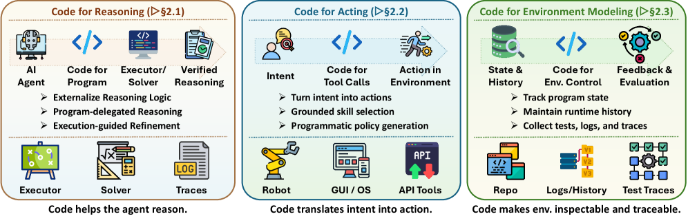
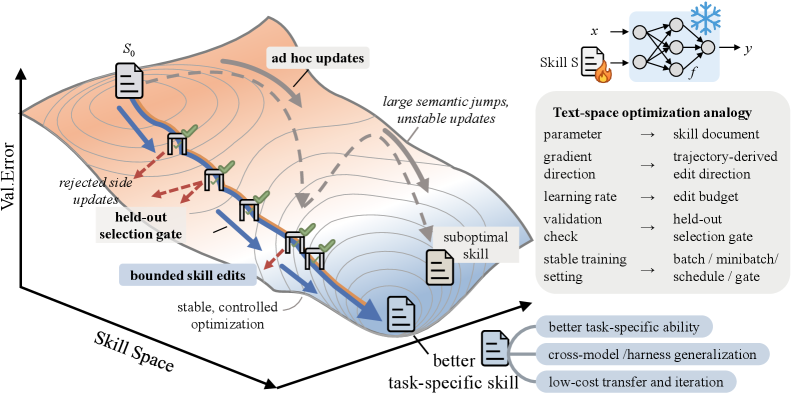
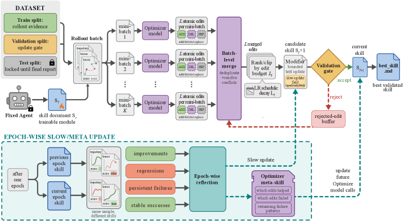
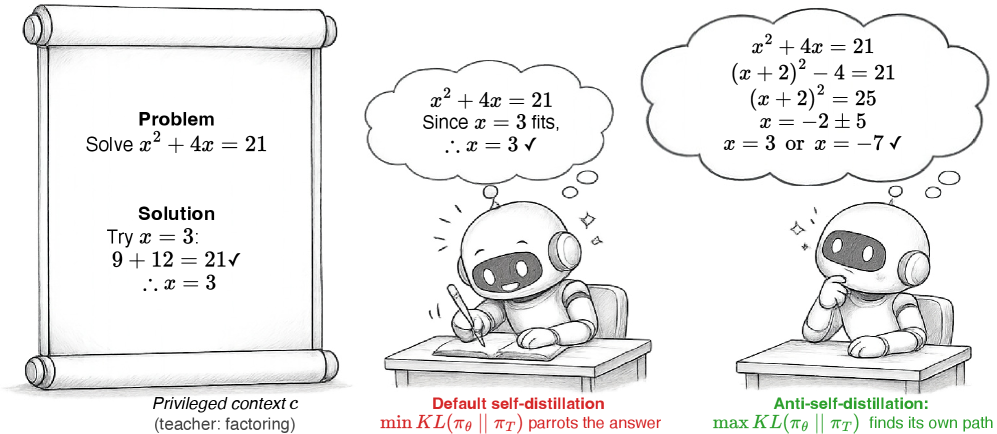
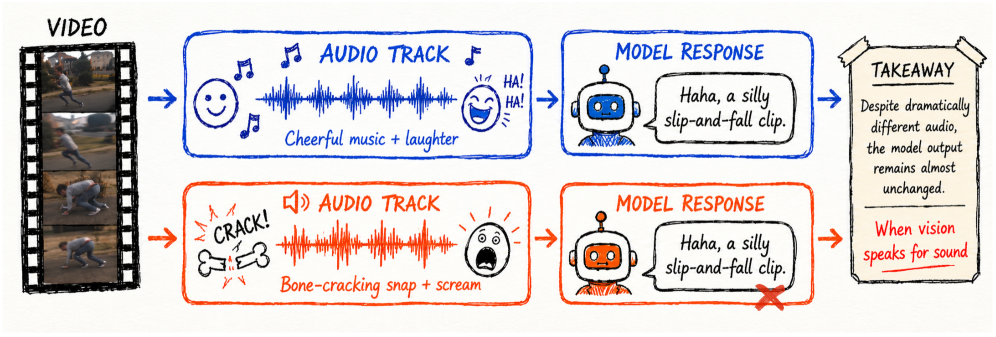

# Hugging Face Daily Papers 深度解读 (2026-05-16 ~ 2026-05-26)

- **Date:** 2026-05-26
- **Tags:** #hf-daily-papers #weekly-digest #agent-harness #skill-optimization #rlvr #autoresearch #unified-multimodal #linear-attention

## Context

本期覆盖 **2026-05-16 ~ 2026-05-26** 共 11 天 HF Daily Papers feed（5/16、5/17、5/23、5/24 周末未返回新条目，实际有效日期 7 天），按 `submittedOnDailyAt` 去重统计共 **270+ 篇**论文，本文从中精选 **24 篇高影响论文**，按 6 个主题归类，对其中 4 篇（**Code as Agent Harness**、**SkillOpt**、**DelTA / AntiSD**、**AutoResearchClaw**）做深度解读。

> 与上一期 `2026-05-15-hf-daily-papers-may8-15.md` 衔接，已剔除重复论文。本期最显著的趋势：
> - **"Agent Harness" 正式成为研究子领域**：Illinois×Meta×Stanford 联合发布 60+ 页综述，把 code 视为 agent 的 substrate；HarnessAudit 把 harness 安全审计形式化；ACC 把 trajectory 直接当长上下文训练数据。
> - **Skill 优化进入"工程化"阶段**：SkillOpt 把 skill 编辑当作训练问题（textual learning rate / validation gate / momentum），52/52 全部 best；SkillsVote 把开源 skill 生态当成可治理的 lifecycle。
> - **RLVR 从黑盒走向可解释**：DelTA / AntiSD / Rank-1 Trajectories 三篇同时把 RLVR 拆解到 token-级 / PMI-级 / 参数空间-级，给出可控干预点。
> - **AutoResearch 从 demo 走向系统**：AutoResearchClaw（54.7% 优于 AI Scientist v2）、AI for Auto-Research roadmap、SciAtlas、AutoResearch AI 集中发布；Nature 评审实证（2605.20668）首次给 AI reviewer 划清能力边界。
> - **统一多模态继续推进**：Lance（dual-stream MoT）、LatentOmni（latent CoT 替代 text CoT）、PhysBrain（egocentric video → VLA prior）。

---

## 论文总览（精选 24 篇）

| ID | 标题 | 主题 | Upvotes | 主要贡献 |
|---|---|---|---|---|
| **2605.18747** | Code as Agent Harness | Agent Harness 综述 | **109** | 60+ 页系统化综述，把 code 定位为 agent 的 substrate；三层框架（interface / mechanisms / multi-agent scaling）+ 7 个 open problems |
| **2605.23904** | SkillOpt | Skill 优化 | **162** | 把 skill 编辑当训练：textual LR、validation gate、rejected-edit buffer、momentum；52/52 全部 best；GPT-5.5 SearchQA 77.7→87.3、SpreadsheetBench 41.8→80.7 |
| **2605.21467** | DelTA | RLVR 内在机制 | **200** | RLVR update 是 token-gradient 上的隐式线性判别器；Qwen3-8B/14B 在 7 个数学 benchmark 上分别 +3.26/+2.62 平均分 |
| **2605.20025** | AutoResearchClaw | Auto-Research 系统 | **182** | 多 agent 辩论 + 自愈执行 + 7 种 human-in-the-loop 模式；ARC-Bench 上比 AI Scientist v2 高 54.7% |
| **2605.11609** | AntiSD (Anti-Self-Distillation) | 推理 RL | **191** | PMI 分析揭示 self-distill 在数学上失败的机制（deliberation token 被压制）；2-10× 训练步达到 GRPO baseline，最终 +11.5 点 |
| **2605.18401** | SkillsVote | Skill 治理 | **125** | 百万级开源 skill 生态的 lifecycle（采集→推荐→演化）；GPT-5.2 在 Terminal-Bench 2.0 +7.9pp、SWE-Bench Pro +2.6pp |
| **2605.21468** | Rank-1 RLVR Extrapolation | RLVR 几何 | 48 | RLVR 权重轨迹是 rank-1 主导的；用 r1 trajectory 外推可达 full-train 大部分增益 |
| **2605.14747** | Video2GUI / WildGUI | GUI Agent 数据 | **143** | 从 5 亿视频 metadata 自动提取 GUI 教程，构建 1200 万条 trajectory（1500+ apps）；Qwen2.5-VL/Mimo-VL 预训练 +5–20% |
| **2605.16928** | RTPurbo (Full→Sparse Attention) | Attention 高效化 | 89 | 仅小子集 head 需要全长上下文；16 维 indexer + dynamic top-p；只需百级训练步即可稀疏化 |
| **2605.21850** | ACC (Agent Context Compilation) | 长上下文训练 | 57 | 直接把 trajectory 编译成长上下文 QA 对，避免 SFT 中 tool response 的监督盲区 |
| **2605.16403** | When Vision Speaks for Sound (Thud) | 多模态对齐审计 | **147** | 揭示 omni-MLLM 的"Audio-Visual Clever Hans"——靠视觉相关性伪造听觉理解；10K 样本 recipe 修复 +28pp |
| **2605.16679** | CHI-Bench | Healthcare Agent | 52 | 端到端长程 policy-rich 医疗工作流 benchmark；揭示 frontier 模型在长程合规上崩塌 |
| **2605.14271** | HarnessAudit | Agent 安全审计 | 54 | trajectory-级 harness 审计（边界合规 / 执行保真 / 系统稳定性）；210 任务 8 域；多 agent 配置漏洞集中 |
| **2605.12882** | CiteVQA / SAA | 文档 VQA 可信化 | **266** | "答对但引错" 的 Attribution Hallucination；最强系统 SAA 仅 76.0，开源最强仅 22.5 |
| **2605.18739** | LongLive-2.0 | 长视频生成基建 | 109 | NVFP4-原生训练+推理 stack，Balanced SP，W4A4 推理；不再依赖 ODE init + DMD |
| **2605.18233** | MIGA | Train-free 长视频 | 89 | 修正 FIFO-diffusion 的训练-推理 mismatch；双 consistency 增强（self-reflection + long-range guidance） |
| **2605.21573** | Lens (3.8B T2I) | T2I 训练效率 | 90 | 数据信息密度+训练曲线设计；3.8B 仅用 Z-Image 19.3% 计算量达可比/超越 |
| **2605.18678** | Lance (Unified Multimodal) | 统一多模态 | 74 | dual-stream MoT 的 lightweight unified model（理解+生成+编辑，图像+视频） |
| **2605.22012** | LatentOmni | 视听 latent 推理 | 43 | 文本 CoT 压缩了连续视听信号；改用 latent space CoT 重建时间 grounding |
| **2605.20119** | Toto 2.0 | 时序基础模型 | 36 | 4M→2.5B 单一 recipe 的可扩展时序 FM；BOOM/GIFT-Eval/TIME 三 benchmark SOTA |
| **2605.22791** | Gated DeltaNet-2 | 线性注意力 | 25 | 把 erase 与 write 解耦；单标量 gate 不够，需要每通道独立的 erase/write 控制 |
| **2605.20613** | HRM-Text | 高效预训练 | 50 | 用 Hierarchical Recurrent Model 替代标准 Transformer；前额顶联合环路启发的多时间尺度处理 |
| **2605.20668** | AI Reviewer Limits (Nature) | AI 评审实证 | 11 | 45 位专家审阅 AI 评审 Nature-family 论文；首次给 AI reviewer 划能力边界 |
| **2605.15298** | PhysBrain 1.0 | VLA 物理先验 | **141** | 把人类 egocentric 视频转成结构化物理常识 QA，作为 robot 适应前的 prior |

---

## 一、Agent Harness 作为研究范式（A 类深度解读）

### 1.1 Code as Agent Harness：Illinois×Meta×Stanford 把"harness"形式化（深度解读 §A）

> 
> *图 1：Code as Agent Harness 三层分类法——interface（reasoning/acting/environment）→ mechanisms（planning/memory/tool/control/optimization）→ scaling（multi-agent）。来源：arXiv 2605.18747 Fig. 1*

**论文定位**：这篇综述（Illinois×Meta×Stanford 30+ 作者，60+ 页）是 2026 年第一篇专门把 **"agent harness"** 作为研究子领域提出的系统化工作。引用了 lee2026metaharness、lou2026autoharness、anthropic2025longrunning、lopopolo2026harnessengineering、openai2026harnessengineering、langchainanatomyharness2026 等一系列同期发布的 harness 工程文献，把它们整合成统一框架。

**核心立论**：在 long-running agentic system 中，瓶颈不只是 base model 的 reasoning ability，**还在于把 model output 接到长期 action 与持久 state 的系统可靠性**。把这个系统层称为 **agent harness**——围绕 LLM 的工具/API/sandbox/memory/validator/permission boundary/execution loop/feedback channel 软件层。

**三层框架（图 1）**：

1. **Harness Interface（§2）**：code 作为 model 与 environment 的最小接口
   - **Code for Reasoning**：program-delegated reasoning、formal verification、iterative code-grounded reasoning
   - **Code for Acting**：grounded skill selection、programmatic policy generation、lifelong code-based agents
   - **Code for Environment**：structured world representation、execution-trace world modeling、code-grounded evaluation environments、verifiable environment construction

2. **Harness Mechanisms（§3）**：long-horizon 可靠性
   - **Planning**：linear decomposition / structure-grounded / search-based / orchestration-based
   - **Memory & Context Engineering**：working / semantic / experiential / long-term / multi-agent / context compaction & state offloading
   - **Tool Use**：function-oriented / environment-interaction / verification-driven / workflow-orchestration
   - **Plan-Execute-Verify Loop**：debugging→harness control、planning as contract formation、sandboxed execution、deterministic sensors
   - **Adaptive Harness Optimization**：deep telemetry、evolution agent、governed harness mutation

3. **Scaling the Harness（§4）**：从单 agent 到多 agent 协调
   - 角色专业化（manager / planner / coder / reviewer / tester）
   - 协作模式（programming / repair / debate / red-teaming / adversarial）
   - 工作流拓扑（centralized / distributed / streaming）

> 
> *图 2：harness interface 把 model 输出转换为 executable 程序、tool call、state tracking 与 feedback trace。来源：arXiv 2605.18747 Fig. 2*

> 
> *图 3：interface 三种角色的 chronological roadmap，可看到 2025-2026 年从"程序当工具"向"程序当 substrate"的范式迁移。来源：arXiv 2605.18747 Fig. 3*

**7 个 Open Problems**（§5.2，方向性意义最强）：

| # | 开放问题 | 关键洞察 |
|---|---|---|
| 1 | Harness-Level Evaluation & Oracle Adequacy | 终态成功率不够，需要 trajectory-级评估 |
| 2 | Semantic Verification Beyond Executable Feedback | 编译通过 + 测试通过 ≠ 语义正确 |
| 3 | Self-Evolving Harness without Regression | harness 自我演化必须有回归保护 |
| 4 | Transactional Shared State & Semantic Conflict Resolution | 多 agent 状态需要数据库式事务语义 |
| 5 | Human-in-the-Loop as Harness State | 人工监督本身应作为 harness 的一阶 state |
| 6 | Multimodal Code-Harness | 视觉/音频如何接入 code substrate |
| 7 | Toward a Science of Harness Engineering | harness 工程需要自身的科学方法论 |

**和本期其他 harness 工作的关系**（最关键的 cross-reference）：
- **HarnessAudit (2605.14271)** → 直接对应 Open Problem 1（trajectory-级评估）
- **EnvFactory (2605.18703)** → 对应 §3.5（adaptive harness optimization）
- **ACC (2605.21850)** → 对应 §3.2（trajectory 当 memory→training data）
- **SkillOpt (2605.23904)、SkillsVote (2605.18401)** → 对应 §3.5.2（evolution agent）
- **AstraFlow (2605.15565, 已在上期)** → 对应 §4（multi-agent orchestration）

**为什么重要**：本综述把过去 12 个月分散的 harness 论文（agent skills、agent loops、context compaction、tool registry、harness audit、harness mutation 等）整合到一个统一坐标系。**它意味着 "agent harness" 已经从工程 jargon 升格为可被学术界接受、可发论文的研究子领域**——这是范式确立的标志事件。

---

## 二、Skill 优化进入"工程化"阶段（B 类深度解读）

### 2.1 SkillOpt：把 skill 编辑当作 SGD 来做（深度解读 §B）

> 
> *图 4：SkillOpt 主循环——target model 用当前 skill 执行任务，frontier optimizer model 把 trajectory 转成 add/delete/replace edit，hold-out gate 只接受能提升 validation 的 edit。被拒 edit 进入 negative feedback。来源：arXiv 2605.23904 Fig. 1*

**核心立论**：如果 skill 是 agent 的适应层（adaptation layer），那么 skill 文档本身就应该是**可训练对象**。但权重更新对闭源 frontier 模型不可用、对开源模型成本高，而手写或 one-shot skill 又脆弱——所以需要把 skill 编辑当作可控的"文本空间训练问题"。

**做法（深度学习类比是 operational 而不是 decorative）**：

| 深度学习概念 | SkillOpt 文本空间映射 |
|---|---|
| Batch size | rollout batch + reflection minibatch（控制每次 edit 的证据噪声） |
| Learning rate | textual learning rate budget（控制单次 edit 离上一版多远） |
| LR schedule | epoch-wise schedule |
| Validation set | held-out selection split（hold-out gate） |
| Negative samples | rejected-edit buffer（被拒 edit 作为反向证据） |
| Momentum | epoch-wise slow/meta update（跨 epoch 累积稳定方向） |
| Model checkpoint | `best_skill.md` 文件（300–2000 token） |

**实验规模（论文最强卖点）**：6 个 benchmark × 7 个 target 模型（GPT-5.5 frontier 到 Qwen 小模型）× 3 种 execution mode（direct chat / Codex harness / Claude Code harness）= **52 个 (model, benchmark, harness) cell，SkillOpt 在 52/52 全部 best 或 tied-best**。

**关键数据表（GPT-5.5 direct chat，no skill → SkillOpt）**：

| Benchmark | No Skill | SkillOpt | Δ |
|---|---|---|---|
| SearchQA | 77.7 | **87.3** | +9.6 |
| SpreadsheetBench | 41.8 | **80.7** | +38.9 |
| OfficeQA | 33.1 | **72.1** | +39.0 |
| DocVQA | 78.8 | **91.2** | +12.4 |
| LiveMathematicianBench | 37.6 | **66.9** | +29.3 |
| ALFWorld | 83.6 | **95.5** | +11.9 |
| **平均** | – | – | **+23.5** |

- **比最强 per-cell baseline（含 human-written / one-shot LLM / Trace2Skill / TextGrad / GEPA / EvoSkill）平均还高 +5.4 点**
- Codex harness：+24.8 over no-skill，+14.0 over EvoSkill
- Claude Code harness：+19.1 over no-skill，+3.2 over EvoSkill

**Transfer 结果（实用价值）**：
- SpreadsheetBench skill 在 GPT-5.4 上训练 → 所有更小 GPT 变体都受益
- Codex 训练的 spreadsheet skill 迁到 Claude Code → **+59.7 点**
- OlympiadBench skill → Omni-MATH 正向收益

> 
> *图 5：bounded textual learning > 无控制 rewriting；hold-out gate 防止有害 edit 累积；rejected buffer 把失败 edit 转为负反馈；slow/meta update 不会让 deployed skill 变臃肿。来源：arXiv 2605.23904 Fig. 3*

**为什么重要**：
1. **它是 GEPA / EvoSkill / Trace2Skill 一系工作的"控制论"加固**——把无监督的 trajectory 反思变成有 LR / validation / momentum 的可控过程；
2. **52/52 best 是非常强的工程结论**，几乎宣告 "skill optimization" 在 frontier 模型时代是 default 配置；
3. **deployed artifact 是一个 300–2000 token 的 markdown 文件**——可审计、可版本控制、可跨模型迁移。这与 Anthropic 的 Skills 框架形成路线呼应。

**和 SkillsVote (2605.18401) 的互补**：
- SkillOpt 解决"如何训练**一**个 skill"
- SkillsVote 解决"如何治理**百万级**开源 skill 生态"（采集 / 推荐 / 演化）；offline 演化把 GPT-5.2 在 Terminal-Bench 2.0 上提 +7.9pp，online 在 SWE-Bench Pro 上 +2.6pp
- 两者一起构成"单 skill 训练 → 多 skill 治理"的完整流水线

---

## 三、RLVR 从黑盒走向可解释（C 类深度解读）

### 3.1 DelTA + AntiSD + Rank-1 Trajectories：三篇同时解构 RLVR 内部机制（深度解读 §C）

本期 RLVR 方向最值得关注的不是某个 SOTA，而是 **三篇论文从三个不同视角同时拆解 RLVR 的内部机制**。这种"同月共振"通常是研究范式转折点的信号。

#### 3.1.1 DelTA (2605.21467)：RLVR update 是 token-gradient 上的隐式线性判别器

> 
> *图 6：Qwen3-8B-Base 上 DelTA vs DAPO 训练动力学——DAPO 在 reward 上 plateau 后退化，DelTA 持续上升；response length 维持长，entropy 更低，long-reasoning 行为更稳定。来源：arXiv 2605.21467 Fig. 2*

**核心 insight**：
- 标准 sequence-level RLVR 看似只更新参数，但**同时定义了一个 token-级决策规则**——某个 candidate token 的概率会被增 / 减取决于其 token-gradient 与 positive-side / negative-side 中心向量哪个对齐更好
- 即 RLVR update **是 token-gradient 空间上的隐式线性判别器（discriminator）**
- 标准 RLVR 的失败模式：**centroid 被高频共享 token（如格式 token、连接词）主导**，稀疏但有判别力的方向反而被稀释

**做法**：DelTA = Discriminative signal-guided Token Credit Assignment
- 给每个 token-gradient 估一个权重，**放大其判别性方向、压制共享方向**
- 在 self-normalized RLVR surrogate 中重新加权
- 通过这个 reweighting 让 effective centroid 更具对比性，从而 reshape update direction

**结果**（7 个数学 benchmark）：

| 模型 | Best baseline | DelTA | Δ |
|---|---|---|---|
| Qwen3-8B-Base | 25.14 | **28.40** | +3.26 |
| Qwen3-14B-Base | – | – | +2.62 |

- 在 code generation、Olmo3-7B-Base、out-of-domain 上同样泛化
- 训练动力学中 **DAPO 趋向短回答+高 entropy，DelTA 维持长回答+低 entropy+高 reward**——意味着 long-reasoning 行为在没有显式长度激励时也能稳定

#### 3.1.2 AntiSD (2605.11609)：on-policy self-distillation 在数学失败的 PMI 解释

> 
> *图 7：on-policy self-distillation 用 privileged context 训学生 → privileged context 让 teacher 在 "Wait/Let/Maybe" 这类 deliberation token 上反而 deflate confidence；AntiSD 反向上升 divergence 修复这个 bias。来源：arXiv 2605.11609 Fig. 1*

**核心 insight**（用 PMI 分析得到）：
- on-policy self-distillation 把学生拉向"加了特权 context（验证过的解 / feedback）的自己"
- 但在数学上**特权 context 会 inflate teacher 在已经被解蕴含的 token（结构连接词、可验证 claim）上的 confidence，同时 deflate 在驱动多步搜索的 deliberation token（"Wait"/"Let"/"Maybe"）上的 confidence**
- 这导致 self-distillation 反而**消除了模型探索行为**，所以在数学上 gain 不一致

**做法**：AntiSD = 反向上升 student-teacher divergence（不是下降！）
- 反转 per-token 符号，得到 one-step 自然有界的 advantage
- entropy-triggered gate：teacher entropy 崩塌后关闭该项
- Drop-in replace default self-distillation

**结果**（5 个模型 4B–30B，数学 benchmark）：
- 达到 GRPO baseline 准确率所需训练步 **少 2–10 倍**
- 最终准确率 **提升最多 11.5 点**

#### 3.1.3 Rank-1 RLVR Extrapolation (2605.21468)

**核心 insight**：
- RLVR 训练的权重 trajectory **本质上是 rank-1 主导的，且高度可预测**
- 大部分 downstream 性能增益可以由 parameter delta 的 rank-1 近似捕获
- 意味着可以用极少的 RLVR step 推断出"完整训练后会到哪里"

**三篇合在一起的 takeaway**：
1. **DelTA** 解构了 RLVR 的 update direction（token-gradient 空间）
2. **AntiSD** 解构了 self-distillation 的 confidence bias（PMI 空间）
3. **Rank-1** 解构了 RLVR 的参数轨迹（权重空间）

→ RLVR 正在从"work-but-don't-know-why"转入"可解释→可干预→可外推"阶段。**这与去年（2025 中）DPO/RLHF 经历的"理论补课"轨迹高度相似**。

---

## 四、AutoResearch 从 demo 走向系统（D 类深度解读）

### 4.1 AutoResearchClaw：5 个机制叠加，比 AI Scientist v2 高 54.7%（深度解读 §D）

**论文定位**：本期 auto-research 方向最完整的工程系统。AI Scientist v2 是 2025 年标志性工作（自动撰写完整论文），但仍是**线性 pipeline**（单 agent + 失败即终止 + 不跨 run 累积经验）。AutoResearchClaw 用 5 个机制把这个 pipeline 改造成**迭代式研究 amplifier**。

**5 个机制**：

1. **Structured multi-agent debate**：用于 hypothesis generation 与 result analysis（防止单 agent 偏见）
2. **Self-healing executor + Pivot/Refine 决策环**：实验失败 → 转化为信息，而不是终止
3. **Verifiable result reporting**：阻止伪造数字 / 幻觉引用（这是 AI Scientist v2 被批评最多的点）
4. **7 种 Human-in-the-loop intervention mode**：从 full autonomy 到 step-by-step oversight
5. **Cross-run evolution**：把过去错误转化为未来 safeguard

**关键结果**：
- **ARC-Bench（25 主题 experiment-stage benchmark）**：AutoResearchClaw 比 AI Scientist v2 高 **54.7%**
- **Human-in-the-loop ablation 结论**：精确、有针对性的 high-leverage 决策点协作 **稳定优于** 完全自治 OR 全程逐步监督
  - 这是 HITL 设计上的一个重要经验数据点：**"半自治"比"全自治 / 全监督"更优**

**和本期其他 auto-research 工作的关系**：
- **AI for Auto-Research: Roadmap (2605.18661)**：roadmap 论文，warned that frontier model 仍然 fabricate result、miss error、misjudge novelty
- **SciAtlas (2605.22878)**：大规模科学知识图谱
- **AutoResearch AI (2605.23204)**：另一个端到端系统
- **AI Reviewer Limits (2605.20668)**：45 位专家审阅 AI 评审 Nature-family 论文，第一份大规模实证研究——给"AI 当 reviewer"划清能力边界

**整体趋势**：auto-research 正在从"能不能写出一篇论文"走向"在什么 leverage 点该让人介入"。**研究 pipeline 设计本身正在成为 research 对象**。

---

## 五、视觉 / 多模态 / 长视频

### 5.1 When Vision Speaks for Sound (2605.16403)：揭穿 omni-MLLM 的"听觉理解"

> 
> *图 8：omni-MLLM 表面上"理解了音频"，实际只是用视觉相关性推断声学；Thud 用三种 counterfactual edit（Shift/Mute/Swap）暴露这个 Clever Hans 效应。来源：arXiv 2605.16403 Fig. 1*

**核心立论**：当前 video-capable MLLM（包括 GPT/Gemini 闭源和 omni-modal 开源）的"音频理解"经常**不是真正理解音频流，而是用视觉线索推断 / 幻觉声学信息**——作者命名为"audio-visual Clever Hans 效应"。

**Thud 探针框架**（三种 counterfactual audio edit）：
- **Shift**：测时间同步性
- **Mute**：测声音存在性
- **Swap**：测音视频一致性

**修复方法**：两阶段对齐 recipe
- 阶段 1：intervention-derived preference pair 教 audio verification
- 阶段 2：event-level general video preference 防过拟合

**结果**：10K 样本 recipe → 三个 intervention 维度平均 **+28pp**，普通 video / AV-QA benchmark 略升。

### 5.2 其他重要视觉/多模态工作

- **Video2GUI / WildGUI (2605.14747)**：从 5 亿视频 metadata 自动构建 1200 万条 GUI trajectory（1500+ apps）；Qwen2.5-VL/Mimo-VL 预训练 +5–20%。**为 GUI agent 解决了数据稀缺问题**。
- **CiteVQA / SAA (2605.12882)**：266 票，本期最高 upvote。"答对但引错"的 Attribution Hallucination 在文档智能里被首次系统量化——最强系统 SAA 仅 76.0，开源最强仅 22.5。
- **HarnessAudit (2605.14271)**：210 任务、8 域、10 配置；多 agent harness 配置漏洞集中。
- **Lance (2605.18678)**：dual-stream MoT 的轻量统一模型（图像+视频，理解+生成+编辑）。
- **LongLive-2.0 (2605.18739)**：长视频生成 NVFP4 全栈基建。
- **MIGA (2605.18233)**：train-free 长视频，修正 FIFO-diffusion 的训练-推理 mismatch。
- **LatentOmni (2605.22012)**：用 latent CoT 替代 text CoT 做视听联合推理。
- **PhysBrain 1.0 (2605.15298)**：把人类 egocentric video 转成结构化物理常识 QA，作 robot 适应前的 prior。

---

## 六、效率 / 基础架构

- **RTPurbo / Full→Sparse Attention (2605.16928)**：full-attention LLM 本质就稀疏，**只需百级训练步**即可转换；retrieval head 保留 full KV，其余用 16-d indexer + dynamic top-p。
- **Gated DeltaNet-2 (2605.22791)**：linear attention 中 erase 与 write 应解耦——单标量 gate 不够，需要每通道独立的 erase / write 控制。
- **HRM-Text (2605.20613)**：用 Hierarchical Recurrent Model 替代 Transformer，受前额顶联合环路（多时间尺度）启发。
- **Lens (2605.21573)**：3.8B T2I，仅用 Z-Image **19.3% 计算量** 达到可比 / 超越。
- **Toto 2.0 (2605.20119)**：4M→2.5B 单一 recipe 的可扩展时序 FM；BOOM/GIFT-Eval/TIME 三 benchmark SOTA。
- **ACC (2605.21850)**：trajectory 直接编译为长上下文 QA 对，弥补 SFT 中 tool response 监督盲区。

---

## 七、本期趋势分析

### 7.1 "Agent Harness" 完成范式确立

| 信号 | 证据 |
|---|---|
| 系统化综述 | Code as Agent Harness (2605.18747)，60+ 页，3 校 30+ 作者 |
| 安全框架 | HarnessAudit (2605.14271) 把 trajectory-级安全审计形式化 |
| 训练数据 | ACC (2605.21850) 把 trajectory 直接编译成长上下文训练数据 |
| 适配层训练 | SkillOpt (2605.23904)、SkillsVote (2605.18401) 把 skill 当训练对象 |
| 环境合成 | EnvFactory (2605.18703) 给 tool-use agent 自动合成可执行 env |
| 工业引用 | 综述同时引用 Anthropic、OpenAI、LangChain、Codex、Claude Code 的 harness 工程文档 |

→ 这是 2024-2025 "agent" 概念分化为 **base model（reasoning）+ harness（substrate）+ skill（adaptation layer）** 三层架构的关键节点。

### 7.2 RLVR 进入"可解释→可干预"阶段

DelTA、AntiSD、Rank-1 三篇分别从 token-gradient 空间、PMI 空间、参数空间拆解 RLVR 内部机制。这与 2024 年 DPO/RLHF "理论补课"高度同构——**通常意味着 6-12 个月内会出现一波基于这些 insight 的下一代 RL 方法**。

### 7.3 多模态进入"打假"阶段

- **CiteVQA**：文档 VQA 的 "Attribution Hallucination"（266 票，本期最高）
- **When Vision Speaks for Sound**：omni-MLLM 的 "Audio-Visual Clever Hans"
- **HarnessAudit**：multi-agent harness 的隐性安全失效

→ 终态指标的水分被三类工作同时戳穿——下一代 benchmark 可能要全面转向 **trajectory-级 / attribution-级 / counterfactual 干预级** 评估。

### 7.4 AutoResearch 系统化、HITL 精细化

AutoResearchClaw、AI for Auto-Research roadmap、SciAtlas、AutoResearch AI、AI Reviewer Limits 集中发布。最值得关注的发现：**"半自治"（在 high-leverage 决策点精确介入）稳定优于"全自治 / 全监督"**——这是 HITL 设计的一个重要经验定律。

### 7.5 长视频 / 长上下文从"trick"走向"基建"

LongLive-2.0（NVFP4 全栈基建）、ACC（trajectory→长上下文）、RTPurbo（百级步稀疏化）、HRM-Text（多时间尺度替代 Transformer）一起把"长 / 高效"问题从单点 trick 变成系统级基建。

---

## Open Questions

1. **Code as Agent Harness 综述提出的 "Self-Evolving Harness without Regression" 怎么实现？** 现在 SkillOpt 用 hold-out gate + rejected-edit buffer 做了 skill 级回归保护，但 harness 整体（含 tool registry / permission / sandbox）的回归保护仍然没有标准答案。
2. **DelTA / AntiSD / Rank-1 三个方向能否融合？** 三者分别在 token / response / parameter 三个粒度做 RL 改进——理论上正交。是否能有"统一 RLVR 改进范式"（类似 DPO 之于 RLHF 的统一）？
3. **SkillOpt 的 textual learning rate 如何 auto-tune？** 现在还是手动调；如果能像 AdamW 那样自适应，frontier 模型上的部署成本会大幅下降。
4. **Audio-Visual Clever Hans 是否在文本-视觉 / 文本-代码上也存在？** 类似的"模型用一种模态推断另一种模态"是否系统存在于所有跨模态对齐？
5. **AutoResearchClaw 的 7 种 HITL mode 哪些 high-leverage 决策点最重要？** 论文给了 ablation 但尚未给出 universal recipe；这可能是下一篇值得做的工作。

---

## References

- [HF Daily Papers (recent)](https://huggingface.co/papers)
- 上一期：`2026-05-15-hf-daily-papers-may8-15.md`
- Code as Agent Harness：[arXiv 2605.18747](https://arxiv.org/abs/2605.18747)、[Github](https://github.com/YennNing/Awesome-Code-as-Agent-Harness-Papers)
- SkillOpt：[arXiv 2605.23904](https://arxiv.org/abs/2605.23904)
- DelTA：[arXiv 2605.21467](https://arxiv.org/abs/2605.21467)
- AntiSD：[arXiv 2605.11609](https://arxiv.org/abs/2605.11609)
- AutoResearchClaw：[arXiv 2605.20025](https://arxiv.org/abs/2605.20025)
- SkillsVote：[arXiv 2605.18401](https://arxiv.org/abs/2605.18401)
- HarnessAudit：[arXiv 2605.14271](https://arxiv.org/abs/2605.14271)
- CiteVQA：[arXiv 2605.12882](https://arxiv.org/abs/2605.12882)
- When Vision Speaks for Sound：[arXiv 2605.16403](https://arxiv.org/abs/2605.16403)
- Video2GUI：[arXiv 2605.14747](https://arxiv.org/abs/2605.14747)
- Lance：[arXiv 2605.18678](https://arxiv.org/abs/2605.18678)
- Toto 2.0：[arXiv 2605.20119](https://arxiv.org/abs/2605.20119)
- Gated DeltaNet-2：[arXiv 2605.22791](https://arxiv.org/abs/2605.22791)
- LongLive-2.0：[arXiv 2605.18739](https://arxiv.org/abs/2605.18739)
- AI Reviewer Limits：[arXiv 2605.20668](https://arxiv.org/abs/2605.20668)
