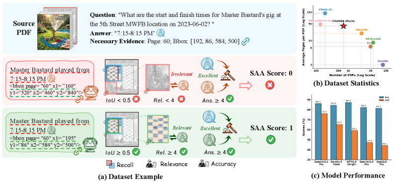
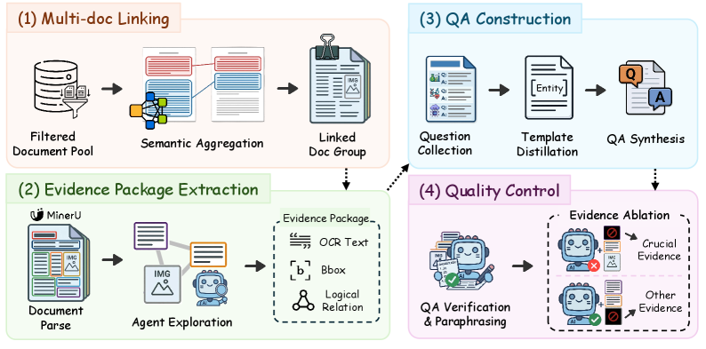
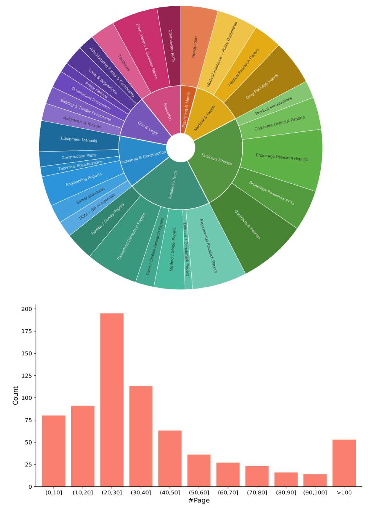
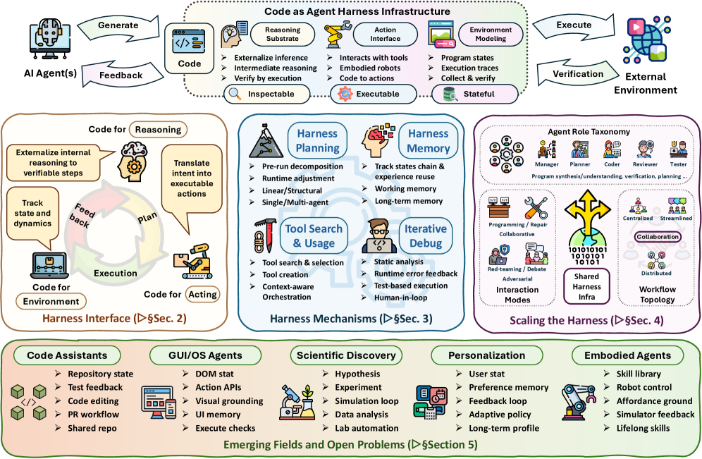
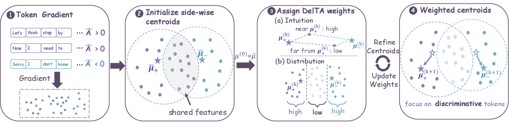
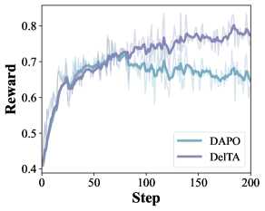
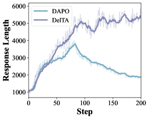

# HF Daily Papers Digest · 2026-05-16 ~ 05-28

> **Date**: 2026-05-28
> **Tags**: #digest #huggingface #weekly #agent-harness #rlvr #document-vqa #auto-research
> **Coverage**: 2026-05-16 ~ 2026-05-28 (覆盖 9 个发布日，去重后共 **394 篇**论文，精选 **25 篇**，4 篇 deep dive)
> **上一份 digest**: [2026-05-15 (May 8-15)](2026-05-15-hf-daily-papers-may8-15.md)

## Context

这两周的 HF Daily Papers 反映出几个明显的方向收敛：

1. **Agent harness / Skill 体系成为显学**：Anthropic 之前提出的 "Code as Agent Harness" 视角被 UIUC + Meta + Stanford 写成 60+ 页综述（#2，209 upvotes）；Skill 相关论文（SkillOpt #5, SkillsVote #14, MMSkills #15, AI for Auto-Research #34）密集出现，Agent Skill 正在从工程概念走向研究主题。
2. **RLVR 进入"显微镜阶段"**：DelTA（#3，token 级 credit assignment）、Anti-Self-Distillation（#4，PMI 替代 self-distillation）、Minimal RLVR（#51）、DVAO（#13）等多篇都在拆解 GRPO/DAPO 的内部更新机制，研究"哪些 token 真正在被更新"，而不是单纯堆训练量。
3. **可信度 / 证据归因成为评测共识**：CiteVQA（#1，269 upvotes，本周第一）首次提出"答对但归因错"是 MLLM 隐藏故障模式；类似的还有 Vision Speaks for Sound（#9，video 模型把视觉特征当声音特征）、Perception or Prejudice（#8，MLLM 对人格判断的偏见）。
4. **自动科研系统从"线性 pipeline"走向"自我强化"**：AutoResearchClaw（#6，184 upvotes）系统化反思了 AI Scientist v2 的局限，提出多智能体辩论 + 自愈执行 + 跨 run 经验积累。

下文按主题分组，先论文总览表，再分主题详解，最后是 4 篇 deep dive + 趋势分析。

---

## 论文总览表（精选 25 篇）

| # | Paper | 主题 | Upvotes | 一句话 |
|---|------|------|---------|--------|
| 1 | [CiteVQA](https://huggingface.co/papers/2605.12882) | Doc-VQA / 可信归因 | 269 | 揭示 MLLM 普遍存在 "Attribution Hallucination"：答对但引错；Gemini-3.1-Pro 在 SAA 上仅 76.0 |
| 2 | [Code as Agent Harness](https://huggingface.co/papers/2605.18747) | Agent / Survey | 209 | 把"代码"统一成 agent 的执行底座，三层框架（接口 / 机制 / 多智能体）+ 100+ 工作梳理 |
| 3 | [DelTA](https://huggingface.co/papers/2605.21467) | RLVR / Token CA | 204 | 把 RLVR 看成"线性判别器"；剔除高频共享 token 后 Qwen3-8B-Base 上提升 3.26 分 |
| 4 | [Anti-Self-Distillation](https://huggingface.co/papers/2605.11609) | Reasoning RL | 193 | 用 PMI 取代 on-policy self-distillation，抑制"自我塌缩" |
| 5 | [SkillOpt](https://huggingface.co/papers/2605.23904) | Agent Skill | 186 | 把 skill 进化做成"深度学习优化器"：metric-driven、可回滚 |
| 6 | [AutoResearchClaw](https://huggingface.co/papers/2605.20025) | Auto-Research | 184 | 多 agent 辩论 + Pivot/Refine 自愈执行；ARC-Bench 上比 AI Scientist v2 高 54.7% |
| 7 | [TransitLM](https://huggingface.co/papers/2605.22355) | Routing / Dataset | 175 | 跳过地图基建，让 LLM 直接出公交线路；首个大规模无地图 Transit 数据 |
| 8 | [Perception or Prejudice](https://huggingface.co/papers/2605.22109) | MLLM / Bias | 169 | MLLM 在性格判断上停留在"刻板印象"层：第一印象偏差 |
| 9 | [When Vision Speaks for Sound](https://huggingface.co/papers/2605.16403) | Audio-Visual | 149 | Video-MLLM 的"音频理解"其实多是视觉幻觉，新基准 VS4S |
| 10 | [Video2GUI](https://huggingface.co/papers/2605.14747) | GUI Agent | 144 | 用录屏视频反向合成大规模 GUI 交互轨迹，做通用 GUI agent 预训练 |
| 11 | [PhysBrain 1.0](https://huggingface.co/papers/2605.15298) | VLA / Robot | 143 | 把视频转成"物理理解"语料，补充 VLA 模型缺乏的物理先验 |
| 12 | [Mega-ASR](https://huggingface.co/papers/2605.19833) | Speech | 131 | 大规模真实声学仿真，突破 in-the-wild ASR 的"声学鲁棒瓶颈" |
| 13 | [DVAO](https://huggingface.co/papers/2605.25604) | Multi-reward RL | 128 | 动态方差自适应 advantage：在 GRPO 上做多奖励融合 |
| 14 | [SkillsVote](https://huggingface.co/papers/2605.18401) | Agent Skill | 126 | 全生命周期 skill 治理（采集 → 推荐 → 演化）：把 skill 当成可治理资源 |
| 15 | [MMSkills](https://huggingface.co/papers/2605.13527) | Multimodal Skill | 118 | 多模态 skill 体系：不仅是 prompt，而是 prompt + code + 学到的策略 |
| 16 | [LongLive-2.0](https://huggingface.co/papers/2605.18739) | Video Gen / Infra | 111 | NVFP4 全栈并行 infra，长视频训练 / 推理同时加速且省显存 |
| 17 | [LocateAnything](https://huggingface.co/papers/2605.27365) | Grounding | 108 | 并行 box 解码替代逐 token 坐标生成，显著加速 grounding |
| 18 | [π-Bench](https://huggingface.co/papers/2605.14678) | Personal Assistant | 102 | 评估 proactive personal assistant 在长流程任务上的表现 |
| 19 | [Lens](https://huggingface.co/papers/2605.21573) | T2I 基础模型 | 101 | 3.8B 参数 T2I 在多 benchmark 超过 6B+ 模型，重新讨论训练效率 |
| 20 | [Full Attention Strikes Back](https://huggingface.co/papers/2605.16928) | Long Context | 93 | 仅用 100 步训练把 full attention 转成 sparse，对长上下文推理几乎无损 |
| 21 | [HRM-Text](https://huggingface.co/papers/2605.20613) | Pretraining | 88 | 跳出"暴力 scaling"：受生物启发的高效预训练范式 |
| 22 | [OpenComputer](https://huggingface.co/papers/2605.19769) | Computer-Use | 81 | Verifier-grounded 软件世界，给 computer-use agent 提供可验证训练环境 |
| 23 | [AI for Auto-Research](https://huggingface.co/papers/2605.18661) | Auto-Research | 67 | 自动科研路线图 + 用户指南：$15 一篇论文不再是科幻 |
| 24 | [OSCAR](https://huggingface.co/papers/2605.17757) | KV Cache 量化 | 63 | INT2 KV-cache 量化新方法，spectral covariance-aware rotation |
| 25 | [SciAtlas](https://huggingface.co/papers/2605.22878) | Auto-Research | 55 | 大规模科研知识图谱，给 agentic research 提供结构化背景 |

---

## 主题一 · Agent Harness & Skill 体系

这两周关于 agent 的一个明确信号：**社区开始把"agent loop"工程化为一个独立学科**。Anthropic 此前在 blog 里提到的 "harness engineering" 概念被多个团队系统化。

### Code as Agent Harness（#2，UIUC + Meta + Stanford，60+ 页综述）

把 LLM agent 看成 "model + harness" 的二元系统：harness 负责 tool 派发、资源分配、消息路由、状态保持。这篇综述把 **代码** 提到中心位置 —— 不只是 agent 输出的产物，而是 agent **推理 / 行动 / 环境建模** 的统一底座。

三层框架：
1. **Harness Interface**: code for reasoning（PAL, Chain-of-Code）/ code for acting（Voyager, RoboCodex）/ code for environment modeling（WorldCoder, SWE-bench）。
2. **Harness Mechanisms**: planning（CodePlan, MapCoder）/ memory（CodeMem, RepoCoder）/ tool use / feedback-driven control。
3. **Scaling the Harness**: 多 agent 协作（AutoGen, MetaGPT），repository / tests / traces 作为共享底座。

> 详见 deep dive。

### SkillOpt（#5）+ SkillsVote（#14）+ MMSkills（#15）

同一周三篇 "skill" 主题论文，分别从三个角度切入：
- **SkillOpt** ([2605.23904](https://huggingface.co/papers/2605.23904))：把 skill 进化做成"深度学习优化器"风格的可观测、可回滚过程。当前 skill 大多是手写、一次性生成或松散迭代，没有任何"梯度信号"。SkillOpt 给每个 skill 引入 metric + 受控更新策略。
- **SkillsVote** ([2605.18401](https://huggingface.co/papers/2605.18401))：从 long-horizon agent trace 中**采集**经验 → **推荐**给新任务 → 通过反馈信号**演化**。把 skill 视为有版本、有质量、有 owner 的可治理资源。
- **MMSkills** ([2605.13527](https://huggingface.co/papers/2605.13527))：扩展到多模态视觉 agent。强调一个 skill 不只是 prompt 文本，而是 (prompt, code, 学到的视觉策略) 的三元组。

> **观察**：三篇都在显式批评目前 skill 的"prompt + bash"形态过于扁平，开始引入"训练 / 治理 / 评测"三元组。这也回应了 Anthropic Claude Code 的 [SKILL.md](https://www.anthropic.com/engineering/equipping-agents-for-the-real-world-with-agent-skills) 设计：不是要写更多 markdown 文档，而是要把 skill 当成软件工件来管理。

### AI for Auto-Research（#23）

声称当前最便宜的全自动论文生成已降到 **$15/篇**。这篇是路线图 + 实操指南，配合 AutoResearchClaw、SciAtlas 一起读，可以拼出"2026 年中自动科研栈"的样子。

---

## 主题二 · RLVR 显微镜：从"堆训练"到"看更新"

RLVR（Reinforcement Learning from Verifiable Rewards）作为 GRPO/DAPO 的统一称呼，本周出现多篇**机制层**论文，研究"RLVR 到底在更新什么"。

### DelTA（#3，RUC + 蚂蚁国际，204 upvotes）

提出"RLVR = 隐式线性判别器"的视角：policy gradient 的更新方向就是在 token-gradient 空间里的一个判别器，决定哪些 token 概率被推高、哪些被压低。

发现的问题：标准 RLVR 通过对正负 advantage response 的 token 梯度做平均，构造正负中心。但**高频共享 token**（如格式化 token "Let's", "##", "Therefore"）在两边都频繁出现 → 把两个中心同时拉向同一方向 → **稀疏的有判别力的方向被淹没**。

DelTA 给每个 token 一个"判别度"系数：在自归一化 RLVR surrogate 上重新加权，让正负中心更对比。

结果（7 个数学 benchmark）：
- Qwen3-8B-Base: +3.26 平均分
- Qwen3-14B-Base: +2.62 平均分
- 在 code generation、out-of-domain 上同样泛化。

> 详见 deep dive。

### Anti-Self-Distillation（#4，193 upvotes）

挑战 "on-policy self-distillation"（OPD）作为 reasoning RL 的主流后训练方法。OPD 让模型向自己的 privileged-context（含 ground-truth）版本对齐，但作者证明这会导致"自我塌缩"：模型学不到新东西，只是把已有 mode 强化。

提出基于 **Pointwise Mutual Information (PMI)** 的替代信号，避免塌缩同时保留长 CoT 的推理结构。

### DVAO（#13）+ Minimal RLVR（#51）+ Learning to Foresee（#39）

- **DVAO**（[2605.25604](https://huggingface.co/papers/2605.25604)）：在多奖励场景下，标准 GRPO advantage 估计方差爆炸。DVAO 做动态方差自适应，让多奖励融合更稳定。
- **Minimal RLVR**（[2605.21468](https://huggingface.co/papers/2605.21468)）：发现只用 **rank-1 trajectory** 也能训出有效 RLVR，揭示参数空间几何结构出乎意料地低维。
- **Learning to Foresee**（[2605.11739](https://huggingface.co/papers/2605.11739)）：on-policy distillation 的"提效"不是因为更密的监督信号，而是因为隐式的"前瞻"机制。

> **趋势**：RLVR 论文从"我提一个新 trick"变成"我用显微镜看 GRPO 在做什么"。这个转折让人想起 Adam 出来后那两年关于 second moment estimator 的拆解工作。

### GoLongRL + ACC + Process Rewards（长上下文 RL 三件套）

- **GoLongRL** ([2605.19577](https://huggingface.co/papers/2605.19577))：能力导向的长上下文 RLVR，多任务对齐。
- **ACC** ([2605.21850](https://huggingface.co/papers/2605.21850))：把 agent trajectory 编译成长上下文训练数据，避开人工长文档策划。
- **Process Rewards with Learned Reliability** ([2605.15529](https://huggingface.co/papers/2605.15529))：PRM 输出不止 "step 是否正确"，还输出 "这个判断的可信度"，下游可以选择性地相信。

---

## 主题三 · 可信归因 & MLLM 故障模式

之前 MLLM 评测主要看"答对率"。这两周三篇高赞论文集体提出：**答对率掩盖了系统性的归因 / 感知错误**。

### CiteVQA（#1，269 upvotes，本周第一）

核心论点：Doc-VQA 评测只看最终答案，掩盖了一种关键失败模式 —— **答对但归因错** ("Attribution Hallucination")。在金融、法律、医疗等高风险领域不可接受。

CiteVQA 强制要求模型同时输出**element-level bounding-box 引用**，并提出 **Strict Attributed Accuracy (SAA)**：只有"答对 + 引对"才得分。

20 个 MLLM 的审计结果令人意外：
- **Gemini-3.1-Pro-Preview SAA = 76.0**（最强）
- 最强开源 MLLM (Qwen3-VL-235B-A22B) **SAA = 22.5**
- 开源小模型 (<10B) SAA 低于 **10.0**

> 详见 deep dive。

### When Vision Speaks for Sound（#9）

提出 video-MLLM 的"音频理解"经常是**视觉假象**：模型不真的听音频，而是从画面推测声音特征。比如看到狗就说"听到吠声"，无论实际音轨内容。

新基准 VS4S 系统验证这一点：模型在保留音频但替换视频的 controlled 设置下表现急剧下降。

### Perception or Prejudice（#8）

测试 MLLM 对人物**性格**的判断：现有 benchmark 只评数值打分。作者构造了开放式生成题，发现 MLLM 输出几乎完全停留在"第一印象 + 刻板印象"：穿西装就是"专业可靠"，纹身就是"叛逆"。模型缺乏"超越视觉表象"的能力。

> **共同信号**：以前我们说 hallucination 是"模型瞎编"。这两周的论文把 hallucination 进一步细分：**归因幻觉**（CiteVQA）、**模态幻觉**（VS4S）、**判断幻觉**（Perception or Prejudice）。每一种都需要新的 benchmark 来揭露。

---

## 主题四 · Auto-Research / 自动科研

5 月初 OpenAI、Sakana AI 都在推自动科研，5 月中下旬学界给出了**多篇系统化反思**。

### AutoResearchClaw（#6，184 upvotes）

UNC + UCSC + CMU + 多机构联合。批评 AI Scientist v2 等系统的三个共同短板：
1. **Hypothesis 生成单一 agent**：自我评估自我假设，缺乏对抗。
2. **执行失败即终止**：丢失中间产物。
3. **Run 之间无记忆**：每次从零开始。

AutoResearchClaw 五大机制：
1. **Multi-agent debate**：Innovator + Pragmatist + Contrarian (假设阶段) / Optimist + Skeptic + Methodologist (结果阶段)。
2. **Self-healing 执行**：Pivot/Refine 循环，将失败转化为信息。
3. **Verifiable result reporting**：所有数字必须挂在 numeric registry 上；引用走 4 层验证（DOI → OpenAlex → arXiv → Semantic Scholar）。
4. **HITL 协作**：7 种干预模式 + SmartPause 不确定性触发。
5. **Cross-run evolution**：跨 run 的经验积累，半衰期 30 天的时间衰减权重。

ARC-Bench (25 topic) 上比 AI Scientist v2 高 **54.7%**。

> 详见 deep dive。

### SciAtlas（#25）+ Forecasting Scientific Progress（#56）

- **SciAtlas** ([2605.22878](https://huggingface.co/papers/2605.22878))：把分散的论文 / dataset / model 编织成大规模科研知识图谱，给 agentic research 提供结构化背景。
- **Forecasting Scientific Progress** ([2605.22681](https://huggingface.co/papers/2605.22681))：能否用 AI 预测科学进展？提出时间分组的评估，发现现有模型只能预测短期趋势，长期突破依然不可预测。

---

## 主题五 · GUI / Computer-Use Agent

| 论文 | 一句话 |
|------|--------|
| **Video2GUI** ([2605.14747](https://huggingface.co/papers/2605.14747)) | 从录屏视频反向合成 GUI 交互轨迹 → 大规模通用 GUI agent 预训练数据 |
| **OpenComputer** ([2605.19769](https://huggingface.co/papers/2605.19769)) | Verifier-grounded 软件世界，给 computer-use agent 提供可验证 RL 环境 |
| **MobileGym** ([2605.26114](https://huggingface.co/papers/2605.26114)) | 浏览器内的轻量化 mobile GUI 仿真，可大规模并行 |
| **π-Bench** ([2605.14678](https://huggingface.co/papers/2605.14678)) | 评估 proactive personal assistant 在长流程任务的表现 |
| **Macaron-A2UI** ([2605.24830](https://huggingface.co/papers/2605.24830)) | Personal agent 的 generative UI 生成模型 |

> **重要趋势**：Computer-use 训练数据从"人工标注"转向**"录屏 → 合成轨迹 + 可验证仿真器"**。Video2GUI + OpenComputer + MobileGym 这条线很可能是接下来 6 个月 GUI agent 训练的主线 —— 理由是它们解决了**数据量级**和**奖励信号**两个最大瓶颈。

---

## 主题六 · 视频生成 & 世界模型

| 论文 | 一句话 |
|------|--------|
| **LongLive-2.0** ([2605.18739](https://huggingface.co/papers/2605.18739)) | NVFP4 全栈并行 infra，长视频训练 / 推理同时加速且省显存 |
| **Gamma-World** ([2605.28816](https://huggingface.co/papers/2605.28816)) | Generative 多 agent 世界建模，超越双玩家场景 |
| **WBench** ([2605.25874](https://huggingface.co/papers/2605.25874)) | Interactive video world model 的多轮评估 benchmark |
| **EvalVerse** ([2605.23271](https://huggingface.co/papers/2605.23271)) | 专业级电影视频生成的 pipeline-aware 评测 |
| **Enhancing Train-Free Infinite-Frame Generation** ([2605.18233](https://huggingface.co/papers/2605.18233)) | 不训练就能让 video model 出连贯长视频 |
| **WorldKV** ([2605.22718](https://huggingface.co/papers/2605.22718)) | World retrieval + KV 压缩，让 autoregressive video 维持持久世界状态 |
| **PhysX-Omni** ([2605.21572](https://huggingface.co/papers/2605.21572)) | 统一刚体 / 软体 / 关节体的 simulation-ready 3D 生成 |

---

## 主题七 · 长上下文 & 推理效率

| 论文 | 一句话 |
|------|--------|
| **Full Attention Strikes Back** ([2605.16928](https://huggingface.co/papers/2605.16928)) | 把 full attention 在 100 训练步内迁移成 sparse，几乎无损 |
| **OSCAR** ([2605.17757](https://huggingface.co/papers/2605.17757)) | INT2 KV-cache 量化：spectral covariance-aware rotation |
| **OScaR** ([2605.19660](https://huggingface.co/papers/2605.19660)) | 极致 KV-cache 量化的"奥卡姆剃刀" |
| **HRM-Text** ([2605.20613](https://huggingface.co/papers/2605.20613)) | 跳出"暴力 scaling"：受生物启发的高效预训练 |
| **Lens** ([2605.21573](https://huggingface.co/papers/2605.21573)) | 3.8B T2I 在多 benchmark 超过 6B+ 模型 |

---

## Deep Dive 1 · CiteVQA：MLLM 的"答对引错"系统性故障

> **Paper**: [2605.12882](https://huggingface.co/papers/2605.12882) (Peking U + Shanghai AI Lab)
> **代码**: <https://github.com/opendatalab/CiteVQA>

### 问题：Doc-VQA 评测的隐形漏洞

现有 Doc-VQA benchmark（DocVQA, MP-DocVQA, MMLongBench-Doc, SlideVQA, ViDoRe V3）几乎都在做一件事：**只看最终答案对不对**，最多在 page 级别给一个粗粒度引用。

后果：模型可能凭"训练时的背景知识"猜对答案，但 **grounding 在错误的文档区域**。在法律 / 金融 / 医疗等高风险场景，这种"伪忠实"行为不可接受 —— 答错可以查证，引错很难被人工审计发现。

*Figure 1: CiteVQA 设计目标。(a) 任务示例：模型必须同时给出答案 + element-level bounding box，两者都对才算 SAA 通过。(b) 数据集：711 PDF / 平均 40.6 页 / 7 个领域 / 双语。(c) 关键发现：所有模型在 Question Accuracy 上都还行，但 SAA 暴跌 —— 这就是 "Attribution Hallucination"。*

### 数据集构造：自动化 + 专家校验

CiteVQA 包含 **1,897 个问题 / 711 个 PDF / 平均 40.6 页 / 双语 (中英) / 7 个领域**。手工标注完全不可行（41 页 × 1897 题），所以作者设计了 4 阶段自动 pipeline：

*Figure 2: CiteVQA 自动标注 pipeline。Multi-doc Linking 做语义聚合 → Evidence Package Extraction 用 agent 把分散的 MinerU 解析结果连成 evidence chain → 真实 QA 蒸馏成模板 → MLLM 验证 + masking ablation 确定 "Crucial Evidence"（即 mask 掉这个区域后模型答不出来）。*

关键 idea：**Evidence Crucialness via Masking Ablation** —— 一个候选证据是否"关键"，通过 mask 它再让 MLLM 重新作答来验证。如果 mask 掉答案就错，这就是 Crucial Evidence。这套 ablation 让自动标注的 ground-truth 比人工选 BBox 更接近"模型实际可用的证据"。

### 评测指标：Strict Attributed Accuracy (SAA)

四个层次的 Traceability Metrics：
- **Recall (Rec.)**：召回率，模型引用是否覆盖了 ground-truth evidence。
- **Relevance (Rel.)**：相关度，引用的区域和答案逻辑对齐。
- **Answer (Ans.)**：纯文本答案正确率（传统 Doc-VQA 指标）。
- **SAA**：**只有 Answer 正确 AND Citation 正确才得分**。

### 主要结果

20 个 MLLM 的审计揭示了惊人的"答对引错"分裂：

*Figure 3: 详细评测结果。注意大部分模型的 Ans. 列都在 70-87 区间（说话还挺像那么回事），但 SAA 列暴跌到 20-50。开源模型尤其严重：Qwen3.6-Plus Ans=85.9 / SAA=17.5，差距 68.4 分。*

| Model | Overall Ans. | Overall SAA | Gap |
|-------|--------------|-------------|-----|
| Gemini-3.1-Pro-Preview | 86.1 | **76.0** | 10.1 |
| Gemini-3-Flash-Preview | 84.5 | 65.4 | 19.1 |
| GPT-5.4 | 87.1 | 59.0 | 28.1 |
| Gemini-2.5-Pro | 82.2 | 47.0 | 35.2 |
| Seed2.0-Pro | 81.3 | 44.1 | 37.2 |
| Qwen3-VL-235B-A22B | 72.3 | 22.5 | 49.8 |
| Qwen3-VL-32B | 72.3 | 17.3 | 55.0 |
| Qwen3.6-Plus | 85.9 | **17.5** | 68.4 |
| GLM-5V-Turbo | 49.6 | 12.8 | 36.8 |
| Gemma-4-26B-A4B | 48.4 | 6.2 | 42.2 |

**几个关键发现**：

1. **闭源 ≫ 开源**：最强闭源 SAA = 76.0，最强开源 SAA = 22.5，差距巨大。
2. **GPT vs Gemini**：GPT-5.4 在 Ans. 上最高（87.1），但 SAA 输给 Gemini-3.1（59.0 vs 76.0）。Gemini 系列的 native citation alignment 显著更强。
3. **小模型不能用**：所有 <10B 开源模型 SAA <10，意味着在金融 / 法律场景几乎不能信任。
4. **N-Gold 场景最难**：当一个问题需要多个分散证据时（Multi-doc N-Gold），所有模型 SAA 都进一步下降。

### 启示

- 之前 Anthropic Claude Code 的 [文档检索 Skill 设计](https://www.anthropic.com/engineering/equipping-agents-for-the-real-world-with-agent-skills) 强调"文档引用必须可验证"。CiteVQA 给这个直觉提供了量化证据。
- RAG 工程师应该把 SAA 加入评测指标。一个 RAG 系统在 Ans. 上 90 分可能在 SAA 上只有 30 分。
- 对国内开源 MLLM（Qwen-VL, GLM-V）来说，这是一个明确的能力缺口。

---

## Deep Dive 2 · Code as Agent Harness：把 agent loop 写成系统学科

> **Paper**: [2605.18747](https://huggingface.co/papers/2605.18747) (UIUC + Meta + Stanford，60+ 页 survey)
> **Github**: <https://github.com/YennNing/Awesome-Code-as-Agent-Harness-Papers>

### 核心论点：从"代码生成"到"代码作为执行底座"

主流的 LLM × code 研究分两类：
1. **Code as output**：HumanEval / SWE-bench 这类，把代码当成模型最终产物。
2. **Code as scaffold**：PAL / Voyager / Code-as-Policies，把代码当成 agent 行动的**载体**。

这篇综述提出第三个层次：**Code as Agent Harness** —— 代码不只是 agent 的输出物或行动接口，而是 agent **推理 → 行动 → 状态保持 → 多 agent 协作** 的统一底座。

*Figure 1: "代码作为 agent harness" 的三层分类。Harness Interface → Harness Mechanisms → Multi-Agent Scaling。每一层都列出 4-8 个研究子方向。*

### 三层框架详解

#### Layer 1: Harness Interface（代码作为接口）

- **Code for Reasoning**: PAL, Chain-of-Code, SatLM —— 把推理外化为可执行程序，用解释器 / 符号求解器 / 进程奖励来检查。
- **Code for Acting**: SayCan, Code-as-Policies, Voyager, RoboCodex —— 生成的代码作为可执行 policy。
- **Code for Environment**: WorldCoder, CWM, Code2World, SWE-bench, AgentBench —— 用程序状态 / repo / trace 表示环境状态。

*Figure 2: Harness Mechanisms 的内部组件。Planning + Memory + Tool Use + Feedback Control 四大件支撑长程执行。*

#### Layer 2: Harness Mechanisms（代码作为机制）

- **Planning**: CodePlan, MapCoder, CodeTree —— 通过结构化分解 / 搜索 / workflow 编排长程任务。
- **Memory**: CodeMem, AutoCoderOver, RepoCoder, MemGovern —— 维护工作状态、检索 repo 证据、积累经验。
- **Tool Use**: ToolCoder, ToolNet —— 把 API / repo / 验证工具暴露给 agent。
- **Feedback Control**: AgentCoder, AdaCoder, AgentHarness —— 用 static analysis / 运行时错误 / 测试 / 人类反馈做迭代修复。

#### Layer 3: Multi-Agent Orchestration

- **Roles**: manager / planner / coder / reviewer / tester
- **Modes**: 协作编程 / 修复 / 辩论 / 红蓝对抗
- **Topologies**: 中心化 / 分布式 / 流式协作（AutoGen, MetaGPT, Self-Collaboration）

*Figure 3: 5 个落地领域 —— Coding Assistance（SWE-bench, OpenHands）/ GUI 自动化（Mind2Web, WebArena）/ Embodied / Scientific Discovery（ChemCrow, Biomni）/ Personal & Recommendation。*

### 关键贡献：明确区分 3 类组件

作者认为长程 agentic 系统由三种东西耦合而成：
1. **Model-internal capabilities**：模型的推理 / 感知 / 规划能力。
2. **System-provided harness infrastructure**：预定义的 tools / API / sandbox / memory / validators —— 这是 OpenAI 和 Anthropic 当前 [harness engineering](https://www.anthropic.com/engineering) 的主要研究对象。
3. **Agent-initiated code artifacts**：**agent 自己创建 / 执行 / 观察 / 修订 / 持久化 / 共享**的代码产物，比如 regression test、temporary tools、DSL 程序、可执行 workflow、reusable skills。

第 3 类是**最被忽视、但最重要**的层次。Claude Code、Codex 这些系统的真正威力在 #3，而不是 #1 或 #2。

*Figure 4: 6 个 open challenge。最关键的是 "evaluation beyond final task success"（光看任务通过率不够）和 "regression-free harness improvement"（怎么避免改了 harness 反而退步）。*

### 6 个 open challenges

1. 评估不只看 final task success（要看过程质量、可恢复性、副作用）。
2. Verification under incomplete feedback（部分反馈下的正确性）。
3. Regression-free harness improvement（迭代 harness 时怎么不引入回归）。
4. Consistent shared state across multiple agents（多 agent 共享状态一致性）。
5. Human oversight for safety-critical actions。
6. Multimodal environments 扩展。

### 启示

- **这是 2026 年 agent 工程的"系统观"奠基之作**：把 Claude Code / Codex / OpenHands / Voyager 一类系统统一在一个框架里。
- 对工程师：之前我们写"agent 框架"时各自为政，这篇综述给出了**共同词汇**（harness interface / mechanism / artifact / orchestration）。
- 对研究者：第 3 类 "agent-initiated code artifacts" 是当前最薄弱的地方，未来 1-2 年的 agent 论文很可能集中在这里。

---

## Deep Dive 3 · DelTA：把 RLVR 看成线性判别器

> **Paper**: [2605.21467](https://huggingface.co/papers/2605.21467) (RUC + 蚂蚁国际)
> **代码**: <https://github.com/RUCBM/DelTA>

### 核心问题：RLVR 在 token 层到底做了什么

RLVR (Reinforcement Learning from Verifiable Rewards) 是 GRPO / DAPO 等当前 LLM reasoning 后训练的统一称呼：用 response-level 的可验证奖励（如答案对错）做策略梯度。

但 **response-level 监督 → token-level 更新**之间存在granularity mismatch：
- 一个 response 只有一个 scalar advantage。
- 但 policy update 是按 token 累积的。

近期工作（Meng 2026, Ma 2026）发现 RLVR 诱导了**稀疏 token 分布偏移**：少数 token 概率剧烈变化，大部分几乎不动。

**关键问题**：到底是哪些 token 被推高 / 压低？什么决定了这个隐式选择？

### 核心 insight：RLVR 更新 = 隐式线性判别器

作者证明：sequence-level RLVR 的更新方向，等价于在 token-gradient 向量空间里的一个**线性判别器**。

具体来说：
- 给定一个 prompt 和 G 个 sampled responses，按 advantage 分成正负两组。
- 标准 RLVR 通过对两组 response 的 token-gradient 向量做 advantage-weighted 平均，得到正负中心 c⁺ 和 c⁻。
- 一个候选 token 的概率被推高 / 压低的判定规则是：**它的 token-gradient 向量更靠近 c⁺ 还是 c⁻**。
- 整个 RLVR update 等价于以 (c⁺ - c⁻) 为决策边界的线性判别。

### 发现的问题：高频共享 token 污染中心

c⁺ 和 c⁻ 的构造存在一个根本缺陷：

**"高频共享 token"（如 "Let's", "##", "Therefore", 数学公式分隔符）在正负 response 中都频繁出现**。它们的 token-gradient 方向会同时拉扯 c⁺ 和 c⁻，把两个中心都推向同一个"任务无关的背景方向"。

后果：
- c⁺ - c⁻ 的有效区分能力被稀释。
- 真正稀疏但有判别力的 reasoning token（如关键的数学操作 token）被淹没。
- 模型学到的更新方向更接近"背景结构"，而不是"区分高 / 低 reward response"。

*Figure 2: Token-gradient 的可视化分析。可以看到正负组的 token gradient 在某些方向高度重叠，这些就是"共享背景"维度，标准 RLVR 给它们和稀疏判别方向一样的权重。*

### DelTA 解法：判别度加权

**Discriminative signal-guided Token Credit Assignment (DelTA)**：

为每个 token 估计一个判别度系数 α_i：
- α_i 大：这个 token 的 gradient 方向在自己一侧（正 or 负）出现频繁，但对侧很少 → **高判别度**，应该重点学习。
- α_i 小：在两侧都频繁出现 → **共享背景**，应该弱化。

然后在 self-normalized RLVR surrogate 上重新加权。这等价于**reshape 了诱导出来的 c⁺ - c⁻ 判别器**，让它更聚焦在稀疏 + 判别的方向上。

实现层面非常轻量：只需要在标准 GRPO/DAPO 的损失里加一个 token-level 的判别度乘子，没有额外网络、不改 backbone。

### 实验结果

7 个数学 benchmark（包括 GSM8K, MATH, AIME, AMC, OlympiadBench 等）：

*Figure 3: 训练动态对比。DelTA 在前期就拉开和 baseline 的差距，且 reward 增长曲线更稳定。*

| Backbone | Baseline (DAPO) | DelTA | Δ |
|----------|-----------------|-------|---|
| Qwen3-8B-Base | 47.8 avg | **51.0** | +3.26 |
| Qwen3-14B-Base | 53.4 avg | **56.0** | +2.62 |

额外验证：
- **Code generation**: 在 LiveCodeBench / HumanEval+ 上同样有提升。
- **跨 backbone**: 换到 LLaMA-3 系列依然有效。
- **OOD**: 在数学训练 → 跨域 reasoning 任务上保留增益。

*Figure 4: 不同 transformer layer 的 token-gradient 判别度分布。中后层的判别度信号最强，DelTA 主要是放大这部分。*

### 启示

- **RLVR 已经进入"显微镜阶段"**：不是再堆 trick，而是拆解机制。这条路子和 Adam 出来后那两年的 second-moment 拆解很像。
- **3.26 平均分的提升在 Qwen3-8B 上是 6.8% 相对提升**，且实现成本极低（一行 token-level reweight）。这是当前 reasoning post-training 性价比最高的改动之一。
- 概念上和 RLVR 的"低效 token credit"研究线 (Ma 2026, Meng 2026) 一脉相承，但 DelTA 给出了一个**几何上可解释**的视角：高频共享 token 把判别中心拉成"背景方向"。

---

## Deep Dive 4 · AutoResearchClaw：从"线性 pipeline"到"自我强化"

> **Paper**: [2605.20025](https://huggingface.co/papers/2605.20025) (UNC + UCSC + CMU + NUS + UCB + Rutgers + 9 机构)

### 三大短板：现有自动科研系统的共同问题

把 AI Scientist v2 / AIDE / Agent Laboratory 等系统做了一次系统对比后，作者总结出 3 个**结构性**短板：

| 短板 | 后果 | 例子 |
|------|------|------|
| **Hypothesis 单 agent 生成评估** | 无法 surface 弱假设 | AI Scientist v2 同一个模型既提议又评分，自动化的"自我表扬"陷阱 |
| **执行失败即终止** | 丢失中间产物，规避高风险实验 | AIDE 在 import 错误后直接放弃整个 trajectory |
| **Run 之间无记忆** | 每次从零开始，重复犯同样错误 | Agent Laboratory 运行 10 次会重复犯第 1 次就出现的 bug |

作者论证：**这三个问题不是独立的，而是相互耦合的**。更好的 hypothesis 减少执行失败；更鲁棒的执行保留中间结果；跨 run 经验能同时改善 hypothesis 和执行。所以必须**联合解决**。

### AutoResearchClaw 五大机制

#### 1. 多 agent 辩论（双阶段）

- **Hypothesis 阶段**: Innovator（提高风险高回报假设）+ Pragmatist（评估硬件 / 时间预算）+ Contrarian（主动找漏洞）。最后由 Synthesizer 蒸馏成 2-4 个**可证伪**的假设，每个带 testability criteria 和所需 baseline。
- **Result 阶段**: Optimist（找强发现）+ Skeptic（统计显著性 + confounds）+ Methodologist（可复现性 + data leakage）。Synthesizer 区分"被支持的发现"vs"未被支持的发现"，然后才进入写作阶段。

每个 panel 用 K=3 个 agent，避免 echo chamber。

#### 2. Self-Healing 执行（Pivot/Refine 循环）

- **Cascading code generation**: 每个实验先打分（架构深度 / 文件数 / 难度 / 历史失败率），分数 > 0.6 派给外部 AI coder（如 Claude Code），< 0.6 走内置多阶段 code agent（先 blueprint → AST 摘要 → 文件生成）。
- **Sandboxed execution**: Docker 三阶段网络策略 —— Phase 0 装依赖（联网）→ Phase 1 取数据（联网）→ Phase 2 执行（**断网**），防止结果泄漏和"下载预计算结果"作弊。Metric 通过只读 evaluation harness 上报，生成代码不能 redefine 评测。
- **Pivot/Refine 决策**: 实验失败 / 退化时，repair loop 捕获失败签名 → 三选一：Proceed（继续）/ Refine（同方向修）/ Pivot（换方向，把失败作为新证据带回 hypothesis 阶段）。

#### 3. Verifiable Result Reporting（双层防伪）

- **Numeric registry**: 执行时构建 verified registry —— 所有数字（每条件均值 / 标准差 / 每 seed 测量）的白名单。写作时，预填的 LaTeX 表格只能从 registry 取数。生成完后，post-hoc verifier 重新提取所有数字，检查是否在 registry 里。**Abstract / Results / Experiments 中匹配不到 registry 的数字会触发 document rejection**，其他章节替换为可见占位符。
- **Citation verification**: 4 层 pipeline —— DOI (CrossRef) → 模糊标题 (OpenAlex) → arXiv ID → Semantic Scholar fallback。然后 LLM 做 relevance 检查，分类成 Verified / Suspicious / Hallucinated。Hallucinated 的引用直接删除。

#### 4. Human-in-the-Loop（7 种模式 + SmartPause）

7 种模式从 Full-Auto 到 Step-by-Step 全光谱：

| Mode | 干预点 | 描述 |
|------|--------|------|
| Full-Auto | 0 | 无人干预 |
| Gate-Only | 3 | 文献筛选 / 实验设计 / 终质检 |
| Thorough | ~10 | 所有阶段边界 |
| **CoPilot** | **6** | 高杠杆点（包括 Idea Workshop / Baseline Navigator / Paper Co-Writer） |
| Step-by-Step | ~23 | 所有 stage 都要批准 |
| Pre-Experiment | 3 | 仅前期干预（文献 / 假设 / 设计） |
| Post-Experiment | 3 | 仅后期干预（结果 / 论文 / 质检） |

**SmartPause**: 基于系统不确定度，自适应触发暂停。研究者经常 override 的阶段会被更频繁暂停，反之亦然。

#### 5. Cross-Run Evolution（跨 run 经验积累）

每次 run 结束，从 repair attempts、Pivot/Refine 决策、HITL 反馈、verification 结果中提取**结构化 lesson**（category + severity score + 推荐 mitigation）。

新 run 开始时，按 category 检索相关 lesson，用**时间衰减权重**排序：

$$w(l) = s(l) \cdot \exp\left(-\ln 2 \cdot \frac{\Delta t}{T_{1/2}}\right)$$

默认半衰期 30 天。Lesson 作为自然语言 overlay 注入 prompt，**无需重训**，对任何 LLM backbone 都适用。

### 主要结果

ARC-Bench (25 ML topics + 20 科学领域 topics)：

| System | ARC-Bench 实验阶段得分 |
|--------|------------------------|
| AIDE-ML | ~38 |
| AI Scientist v2 | ~45 |
| **AutoResearchClaw** | **~70** |

相对 AI Scientist v2 提升 **54.7%**。

### HITL 消融的关键发现

跨 7 种干预模式的端到端实验（10 ARC-Bench topics，端到端到完成 paper）：

**最佳模式不是 Full-Auto，也不是 Step-by-Step，而是 CoPilot（6 个高杠杆干预点）**。

这个结论很重要：
- 完全自主：模型在关键决策点犯错，后续无法补救。
- 步步审批：人类成本高、效率低，且人类容易疲劳"乱点同意"。
- **CoPilot 区域**：人介入在少数高杠杆点（idea 决策、baseline 选择、最终改稿），既保留了大部分自动化收益，又拦住了关键风险点。

### 启示

- 这是目前我看过的**最完整的 auto-research 系统蓝图**。前面的 AI Scientist 系列像 v0.1，这是 v1.0。
- "失败 = 信息" 这个理念可以迁移到一般 agent 设计：很多 agent 框架在 tool call 失败后直接 retry 或终止，而不是把失败信号 feed 回 planner。
- Cross-run lesson 的"时间衰减"机制和 [Anthropic 的 SKILL 系统](https://www.anthropic.com/engineering/equipping-agents-for-the-real-world-with-agent-skills) 的"long-term memory"设计哲学一致：经验需要选择性遗忘。
- 但要打个折扣：ARC-Bench 是作者自家的 benchmark，且 LLM-as-judge 评测，54.7% 的相对提升应该谨慎理解为"在自家 benchmark 的内部对比"，而不是"自动科研能力实质性突破"。

---

## 趋势分析

### 1. Agent 工程从"框架百花齐放"走向"系统学科"

5 月初，社区还在讨论 LangChain vs LangGraph vs Claude Code SDK 哪个框架好。5 月底，Code as Agent Harness 这种**60 页的系统综述**出现，把 100+ 工作放进统一三层框架。这种从"工具竞争"到"理论建构"的跃迁，意味着 agent loop 正在从应用层下沉到一个独立的学科 —— 类似 2017 年 Transformer 之后 attention 从一个 trick 变成一个学科。

具体信号：
- **共同词汇出现**：harness interface / mechanism / artifact / orchestration 这套术语开始被引用。
- **Skill 工程化**：SkillOpt / SkillsVote / MMSkills 三篇同周出现，把 skill 从"prompt template"上升到"可治理 / 可优化 / 可演化"的资源。
- **Auto-Research 成熟**：AutoResearchClaw 不再是 "AI Scientist 的下一篇"，而是给整个 auto-research 子领域提供了完整脚手架。

### 2. RLVR 进入"机制研究"阶段

如果说 2025 年的 RLVR 论文都在比"我加了什么 trick"，2026 年 5 月这批论文都在拆"GRPO 内部到底在做什么"：
- DelTA：RLVR 是隐式线性判别器
- Anti-Self-Distillation: OPD 会自我塌缩
- Minimal RLVR: rank-1 trajectory 就够了
- DVAO: 多奖励下方差爆炸
- Learning to Foresee: OPD 的提效来自"前瞻"而非密集监督

这种**集体转向机制层**的现象很像 Adam 出来后那两年大量"second moment estimator 拆解" paper。预期：未来 6 个月，会有更多 RLVR 几何 / 信息论解释，可能出现一个统一框架（类似 PPO / TRPO 的早期理论文章）。

### 3. 评测范式：从"答对率"到"过程可信度"

CiteVQA、VS4S、Perception or Prejudice、AutoResearchClaw 的 verifier-grounded reporting，都在反复强调一件事：**最终答案对不对已经不够了**。需要评估：
- 答案的归因（CiteVQA 的 SAA）
- 答案的模态来源（VS4S 的视觉 vs 听觉）
- 答案的过程合理性（PRM with reliability）
- 答案中数字的真实性（AutoResearchClaw 的 numeric registry）

这是 2025 年 hallucination 研究的自然延伸：从"模型瞎编"具体化到"瞎编的具体形式"。

### 4. Computer-Use / GUI Agent 数据飞轮初步成型

Video2GUI（录屏 → 合成轨迹）+ OpenComputer（verifier-grounded 软件世界）+ MobileGym（轻量并行仿真）三件套，第一次让 GUI agent 训练**摆脱了人工标注瓶颈**。这个组合很可能是 2026 下半年 GUI agent 训练的主线 —— 因为它同时解决了"数据规模"和"奖励信号"。

### 5. 推理效率：从"激进结构改造"到"温和迁移"

Full Attention Strikes Back 提出"100 步训练就能把 full attention 转成 sparse"，这种**激进结构 → 温和迁移**的思路，比之前的"从头训练 efficient 架构"更工程友好。OSCAR / OScaR 在 KV-cache 量化上也是类似哲学：保留预训练投资，做后训练优化。

---

## Open Questions

1. **Agent skill 的"梯度"是什么？** SkillOpt 提出把 skill 进化做成"深度学习优化器"，但还没明确定义 skill 的 metric / loss / 反向梯度。这会是接下来几个月的关键问题。
2. **DelTA 之外，RLVR 还有多少"机制层 free lunch"？** 高频共享 token 只是一个症状。如果 RLVR update 真的是一个隐式判别器，那么 imbalanced sampling、reward shaping、advantage normalization 都可以从判别器视角重新审视。
3. **CiteVQA 揭示的"答对引错"，是 RAG 系统的根本问题还是 alignment 问题？** 如果 SFT 阶段引入 citation alignment（类似 Anthropic 在 Citations API 的做法），是否能从根上解决？
4. **AutoResearchClaw 的 cross-run lesson 会不会饱和？** 半衰期 30 天的设计意味着 lesson 不会无限累积，但当 lesson 库覆盖了大部分常见错误后，新增 lesson 的边际价值会快速下降。
5. **Code as Agent Harness 的第 3 层（agent-initiated code artifacts）如何评测？** 综述提到这是最被忽视的层次，但如何系统评估"agent 自己生成的临时工具"的质量，目前还没有 benchmark。

---

## References

### Hugging Face Daily Papers
- 主页: <https://huggingface.co/papers>
- API: `GET https://huggingface.co/api/daily_papers?date=YYYY-MM-DD&limit=50`
- 本期覆盖：2026-05-18 至 2026-05-28（去重后 394 篇，精选 25 篇）

### Deep Dive Papers
- **CiteVQA**: <https://huggingface.co/papers/2605.12882> · [Code](https://github.com/opendatalab/CiteVQA)
- **Code as Agent Harness**: <https://huggingface.co/papers/2605.18747> · [Github](https://github.com/YennNing/Awesome-Code-as-Agent-Harness-Papers)
- **DelTA**: <https://huggingface.co/papers/2605.21467> · [Code](https://github.com/RUCBM/DelTA)
- **AutoResearchClaw**: <https://huggingface.co/papers/2605.20025>

### 相关阅读
- 上一期 digest: [2026-05-15 (May 8-15)](2026-05-15-hf-daily-papers-may8-15.md)
- Anthropic Agent Skills 设计: <https://www.anthropic.com/engineering/equipping-agents-for-the-real-world-with-agent-skills>
- ARC-Bench: 见 AutoResearchClaw 论文 Appendix
