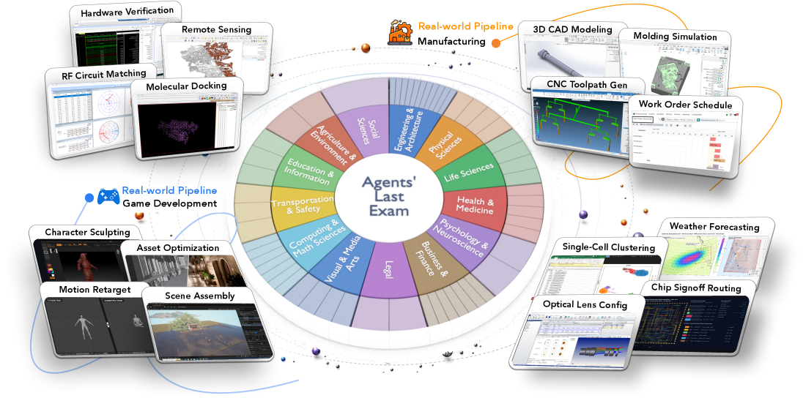
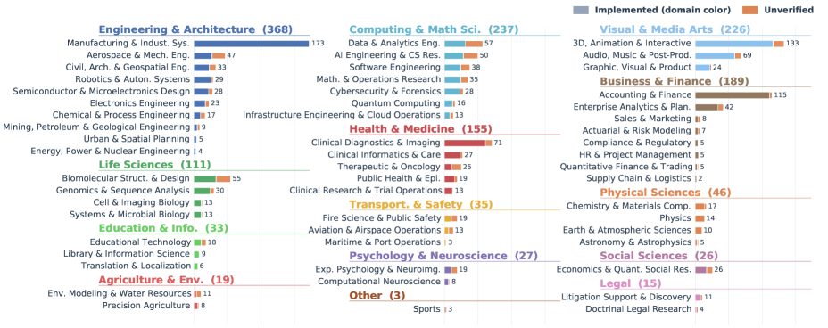
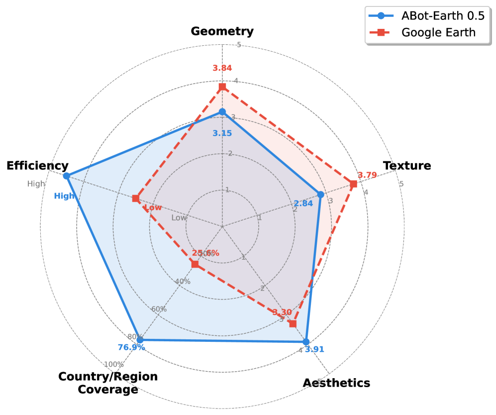
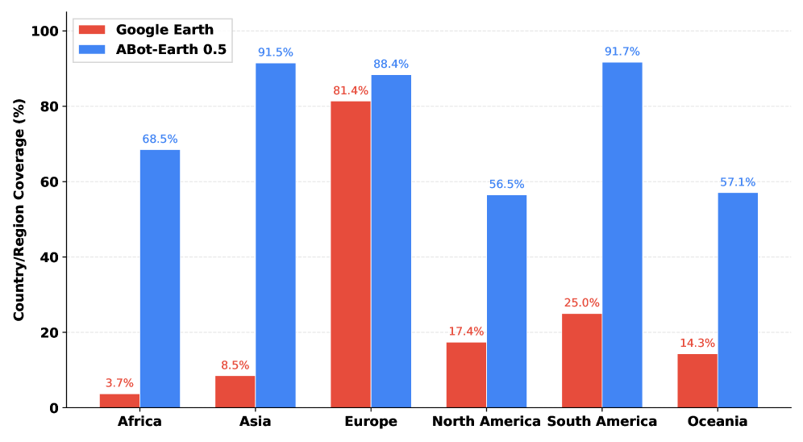
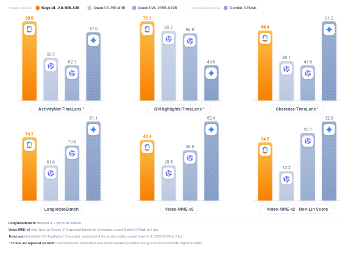

# HF Daily Papers Digest · 2026-05-29 ~ 06-12

> **Date**: 2026-06-12
> **Tags**: #digest #huggingface #weekly #agent-benchmark #peft #world-model #on-policy-distillation
> **Coverage**: 2026-05-29 ~ 2026-06-12（覆盖 11 个发布日，去重后共 **521 篇**论文，精选 **25 篇**，4 篇 deep dive）
> **上一份 digest**: [2026-05-28 (May 16-28)](2026-05-28-hf-daily-papers-may16-28.md)

## Context

这两周（含两个周末无发布）的 HF Daily Papers 出现了几个清晰的主线，与上一期的"agent harness 工程化"延续但重心上移：

1. **评测从"能力"转向"经济价值"**：本期榜首 Agents' Last Exam（#1，294 upvotes）由 250+ 行业专家共建，把 agent 放到真实、可验证、有经济价值的长流程工作上——最难档全通过率只有 **2.6%**，最强 Codex+GPT-5.5 在最易档也不到 50%。配套出现 ResearchClawBench（#17）、SWE-Explore（#13）、Claw-SWE-Bench（#37）等一批"拆解 agent 子能力"的 benchmark。

2. **PEFT 范式升格为"持久个人模型"基础设施**：On the Scaling of PEFT（#2，228 upvotes）把 adapter 从"省钱的微调替代"重新定义为强共享底座之上的**持久本地状态**，提出 Scale Up / Down / Out 三轴，指向"万亿参数底座 + 百万个个人适配器"。Code2LoRA（#18）、LatentSkill（#32）是同一思路的具体实例。

3. **世界模型走向"全模态 + 工业可用"**：Cosmos 3（#9）用单一 mixture-of-transformers 统一语言/图像/视频/音频/动作；ABot-Earth 0.5（#3，209 upvotes）直接在 3DGS 空间做生成式地球建模，**< 10 分钟/平方公里**；Latent Spatial Memory（#27）把 3D 记忆搬进 latent 空间。

4. **On-Policy Distillation（OPD）进入机理研究**：连续三篇——On the Geometry of OPD（#24）发现"subspace locking"现象、Trust-Region Behavior Blending（#25）、CollectionLoRA（#28）——开始拆解 OPD 在参数空间里的更新轨迹，与上一期 RLVR 的"显微镜化"趋势接续。

下文按主题分组：先论文总览表，再分主题详解，最后 4 篇 deep dive + 趋势分析 + Open Questions。

---

## 论文总览表（精选 25 篇）

| # | Paper | 主题 | Upvotes | 一句话 |
|---|------|------|---------|--------|
| 1 | [Agents' Last Exam](https://huggingface.co/papers/2606.05405) | Agent 评测 | 294 | 250+ 专家共建的经济价值长流程基准；最难档全通过率仅 2.6% |
| 2 | [Scaling of PEFT](https://huggingface.co/papers/2606.02437) | PEFT / 基础设施 | 228 | adapter = 强底座上的持久本地状态；Scale Up/Down/Out 三轴 |
| 3 | [ABot-Earth 0.5](https://huggingface.co/papers/2606.09967) | 3D 世界模型 | 209 | 卫星图直出 3DGS 地球，<10 分钟/km²，300+ 城市 |
| 4 | [Crafter](https://huggingface.co/papers/2605.30611) | Agent / 科研绘图 | 192 | 多 agent harness 生成**可编辑**科研插图，跨图类型/输入 |
| 5 | [Kwai Keye-VL-2.0](https://huggingface.co/papers/2606.10651) | 多模态 / 长视频 | 177 | 首个把 DeepSeek 稀疏注意力(DSA)用到多模态，256K 无损长视频 |
| 6 | [Domino](https://huggingface.co/papers/2605.29707) | 推理加速 / SD | 145 | 投机解码解耦因果建模与自回归起草，并行起草+轻量 refine |
| 7 | [AgentDoG 1.5](https://huggingface.co/papers/2605.29801) | Agent 安全 | 142 | 1k 样本训出 0.8B–8B 轻量安全对齐模型，逼近闭源 |
| 8 | [Qwen-VLA](https://huggingface.co/papers/2605.30280) | VLA / 具身 | 140 | 单一 VLA 统一操作/导航跨任务、环境、机器人形态 |
| 9 | [Cosmos 3](https://huggingface.co/papers/2606.02800) | 全模态世界模型 | 115 | 语言/图/视频/音频/动作统一进 mixture-of-transformers |
| 10 | [Imaginative Perception Tokens](https://huggingface.co/papers/2606.03988) | 空间推理 | 115 | IPT：外化"想象视角"中间表征，补强 VLM 空间推理 |
| 11 | [COLLEAGUE.SKILL](https://huggingface.co/papers/2605.31264) | Agent Skill | 111 | 把"人/角色"的异构痕迹蒸馏成可检查、可纠错的 skill 包 |
| 12 | [Audio Interaction Model](https://huggingface.co/papers/2606.05121) | 流式音频 | 108 | 统一在线 LALM：always-on 感知-决策-响应循环 |
| 13 | [SWE-Explore](https://huggingface.co/papers/2606.07297) | 编码 Agent 评测 | 108 | 专门隔离评测仓库探索能力，848 issues / 10 语言 |
| 14 | [GrepSeek](https://huggingface.co/papers/2605.29307) | 搜索 Agent | 106 | 让 agent 用 shell 命令直接"翻语料"，两阶段训练稳定 RL |
| 15 | [OCC-RAG](https://huggingface.co/papers/2606.00683) | SLM / RAG | 89 | 专用小模型做忠实 QA，3M 多跳合成数据 |
| 16 | [UnEmbedding as Feature Lens](https://huggingface.co/papers/2606.07502) | 文本嵌入 | 87 | LLM 的 unembedding 矩阵=特征透镜，EmbedFilter 抑制高频词 |
| 17 | [ResearchClawBench](https://huggingface.co/papers/2606.07591) | 自动科研评测 | 85 | 10 领域 40 任务端到端复现真实论文，最强 agent 仅 21.5 |
| 18 | [Code2LoRA](https://huggingface.co/papers/2606.06492) | 代码 / 超网络 | 83 | 超网络生成仓库专属 LoRA，零推理 token 开销，随 diff 演化 |
| 19 | [OmniRetrieval](https://huggingface.co/papers/2605.29250) | 检索 | 77 | 统一异构知识源检索，按源原生语言派发而非同质化 |
| 20 | [MoE Router via MPI](https://huggingface.co/papers/2606.12397) | MoE | 76 | 用流形幂迭代对齐 router 行与专家主奇异方向 |
| 21 | [Role-Agent](https://huggingface.co/papers/2606.10917) | Agent 自举 | 73 | 单 LLM 同时当 agent 和环境，双角色协同进化 |
| 22 | [Arbor / HTR](https://huggingface.co/papers/2606.11926) | 自动科研 | 70 | 假设树细化(HTR)：长寿命 coordinator + 短寿命 executor |
| 23 | [Geometry of OPD](https://huggingface.co/papers/2606.07082) | On-Policy 蒸馏 | 67 | OPD 更新存在 subspace locking，介于 SFT 与 RLVR 之间 |
| 24 | [Trust-Region Behavior Blending](https://huggingface.co/papers/2605.31159) | On-Policy 蒸馏 | 66 | TRB warmup：早期 rollout 换成信赖域内最接近 teacher 的策略 |
| 25 | [Latent Spatial Memory](https://huggingface.co/papers/2606.09828) | 视频世界模型 | 62 | Mirage：3D 记忆直接存 diffusion latent，省去像素回环 |

---

## 主题一 · Agent 评测：从"能力"到"经济价值"

本期最强信号是评测哲学的转向。社区开始承认一个尴尬事实：**agent 刷爆了各种 benchmark，却没在真实产业里产生对得上的经济价值**。这一期一口气出现多个直面该问题的基准。

### Agents' Last Exam（#1，294 upvotes）

ALE 的核心论点是"benchmark-成功 与 GDP-相关影响 之间的鸿沟本质是评测问题"。它和 250+ 行业专家共建，依据 O\*NET / SOC 2018 美国联邦职业分类，把非物理行业组织成 **13 个行业簇 / 55 个子领域 / 1000+ 任务**。关键设计：

- **真实工作流**：任务不是合成的，而是专家贡献的已完成项目（耗时数天到数周），经过五道质控门（专家征集 → 提交 → 一审 → 实现+工程师 dry-run → 委员会终审）。
- **可验证而不用人评**：围绕"交付物/里程碑"做结构化检查，最常见是 **gate-and-score**——先过二元前置条件（如"刀路无碰撞""文件可解析"），再算连续质量分；gate 不过直接 0 分。刻意避免 LLM-as-judge。
- **抗污染**：1490 个实例只公开 150 个（~10%），其余私有池滚动轮换。
- **评测对象**是 Generalist Computer-Use Agent（GCUA）——把能力拆成 Brain / Eyes / Body / Hands / Feet 五层，传统 CLI agent（SWE-agent）缺 Eyes，GUI agent 则 Body/Hands/Feet 浅。

详见下方 deep dive 的完整 Table 1 数据。

### SWE-Explore（#13）· ResearchClawBench（#17）· 子能力隔离评测

与 ALE 的"端到端"互补，这两篇走"拆解"路线：
- **SWE-Explore** 专门隔离**仓库探索**能力——给定 repo + issue，要求 explorer 在固定行预算内返回相关代码区域的排序列表，覆盖 848 issues / 10 语言 / 203 仓库，ground truth 从成功解决该 issue 的独立轨迹蒸馏而来。它指出 SWE-bench 把编码当"解决/未解决"二元预测，掩盖了 repo 理解、上下文检索、代码定位、bug 诊断等细粒度能力。
- **ResearchClawBench** 评测端到端自主科研：10 领域 40 任务，每个 grounded 在一篇真实论文上，评测时隐藏目标论文，用专家多模态 rubric 拆成加权标准。结果：最强自主 agent（Claude Code）平均仅 **21.5**，离可靠"再发现"还很远。

> 三个 benchmark 共同传递的信息：**通过率/解决率这种粗粒度指标已经饱和或失真**，下一代评测要么拉到真实经济价值（ALE），要么下钻到子能力（SWE-Explore）。

---

## 主题二 · PEFT 升格为"持久个人模型"基础设施

### On the Scaling of PEFT（#2，228 upvotes）

这篇把 PEFT 从"更便宜的全量微调"重新框定为**强共享底座之上的持久本地状态**：底座提供共享能力，adapter 承载实例特有行为（偏好、技能、工具习惯、类记忆更新）。三条 scaling 轴：

- **Scale Up**：底座越强，小的本地更新越有用；
- **Scale Down**：adapter 能小到什么程度仍可靠；
- **Scale Out**：大量持久化适配实例如何共存。

并给出基础设施样例 **MinT**，管理 adapter 的身份、版本、来源、评估与服务驻留。终极图景是"万亿参数底座 + 百万个个人模型"。

### Code2LoRA（#18）· LatentSkill（#32）· 同一思路的具象化

- **Code2LoRA** 用超网络为每个仓库生成专属 LoRA，**零推理 token 开销**注入仓库知识。两种用法：Static（单快照转 adapter，适合稳定代码库理解）、Evo（用 GRU 隐状态随 code diff 更新，适合活跃开发的演化代码库）。配套 RepoPeftBench。
- **LatentSkill** 把"in-context 文本技能"转成"in-weight 潜在技能"——技能不再只是 prompt，而是固化进权重。

这与上一期的 Agent Skill 热潮接上了：**skill / adapter / 个人状态正在收敛成同一个研究对象**——可版本化、可治理、可演化的本地能力载体。

---

## 主题三 · 世界模型：全模态化与工业可用

- **Cosmos 3（#9）**：NVIDIA 系，单一 mixture-of-transformers 联合处理与生成语言/图像/视频/音频/动作，把 VLM、视频生成器、世界模拟器、world-action 模型收进一个框架。后训练版本被 Artificial Analysis 评为最佳开源 T2I / I2V，RoboArena 上最佳策略模型。
- **ABot-Earth 0.5（#3，209 upvotes）**：直接在 3DGS 表征空间做**生成式地球建模**，仅凭卫星图就能合成 3D 场景，**< 10 分钟/平方公里**，已覆盖 190+ 国家 300+ 城市；内建多 LOD，可在 Web 地图引擎实时交互。详见 deep dive。
- **Latent Spatial Memory（#27，Mirage）**：视频世界模型维持 3D 一致性通常靠 RGB 空间显式点云记忆，既贵又有损（像素回环丢特征）。Mirage 把 3D 记忆直接存进 diffusion latent 空间，用深度引导反投影建记忆、latent 空间 warp 合成新视角，消除像素重建的信息损失。

---

## 主题四 · On-Policy Distillation 进入机理研究

延续上一期 RLVR 的"显微镜化"，本期焦点转向 OPD：

- **On the Geometry of OPD（#23）**：用参数空间诊断刻画 OPD 更新轨迹，发现它处于"relaxed off-principal regime"——比 SFT 影响更少权重、更避开主方向，比 RLVR 约束更松。最关键发现是 **subspace locking**：累计更新迅速进入一个狭窄低维通道；把训练约束在早期形成的子空间里能保住 OPD 性能，却会严重损害 SFT，说明该锁定子空间对 OPD 是功能充分的。
- **Trust-Region Behavior Blending（#24，TRB）**：OPD 早期 student rollout 质量差，teacher 监督被浪费在低质前缀上。TRB 在 warmup 阶段把早期 rollout 策略换成"信赖域内最接近 teacher"的行为策略，KL 预算退火到 0 后回归纯 student rollout。两个数学推理蒸馏设定上取得最强平均分。

> 这一组工作把 OPD 从"经验有效的技巧"推向"可解释的优化几何"，和 PEFT 那条线一样，都在追问**更新到底发生在参数空间的哪里**。

---

## 深入分析

### Deep Dive 1 · Agents' Last Exam（#1）—— 经济价值的"最后一场考试"

**问题动机**。过去几年 AI 刷过了棋类、奥数、竞赛编程，但"经济产出"这个最终指标几乎没动。作者把这称为 AI 的 *utility problem*：基准胜利积累得比真实产业转型快得多。而 benchmark 又强烈塑造研究方向（ImageNet 之于 CV）——金融、法律、电气工程、制造这些经济中枢行业缺乏可验证、被广泛采用的评测。ALE 就是要补这个洞。

**三大构建难点与对策**：

| 难点 | 现有做法的妥协 | ALE 的对策 |
|---|---|---|
| 长流程真实工作流采集贵 | 用更短的 computer-use 任务 / 合成环境 / 纯 QA | 专家贡献"耗时数天到数周"的真实已完成项目，5 道质控门 |
| 广行业覆盖难 | 只覆盖有限领域 | 250+ 专家咨询委员会按 O\*NET/SOC 映射工作流地形 |
| 异构输出难验证 | 依赖人工判断（GDPval、Remote Labor Index） | gate-and-score + 结构化交付物检查，避免 LLM-as-judge |

作者还做了覆盖度对比：把 16 个主流先前 benchmark 映射到 55 子领域坐标系，发现**即使取并集，仍有 13/55 子领域完全没被覆盖**。

**主结果（Table 1 节选，按 Overall Pass Rate 排序）**。每档报告全通过率 Pass(%) / 均分 Score(%)；三档难度分别约对应 Easy / Medium / Hard。注意成本与耗时之大：

| Agent (Backbone) | Easy Pass | Med Pass | Hard Pass | Overall Pass | 备注 |
|---|---|---|---|---|---|
| Codex (GPT-5.5) | 42.4 | 20.0 | 8.6 | **26.2** | 单任务最高，总成本 ~$594、耗时 82h |
| ALE-Claw (GPT-5.5) | 35.6 | 21.8 | 8.6 | 24.2 | |
| Cursor (GPT-5.5) | 36.4 | 20.0 | 2.9 | 22.5 | |
| GPT-5.5（固定 OpenClaw） | 39.0 | — | 2.9 | 22.8 | 同 backbone 横评第一 |
| GPT-5.4（固定 OpenClaw） | 34.7 | — | 5.7 | 22.3 | |
| Cursor (Opus 4.7) | 32.2 | — | 5.7 | 21.5 | |
| Droid (GPT-5.5) | 30.5 | — | 8.6 | 20.1 | |
| Claude Code (Sonnet 4.6) | 31.4 | 27.1 | 0.0 | 17.1 | |
| Gemini 3.1 Pro | 29.7 | 23.9 | 0.0 | 15.8 | token 消耗高达 2053M |
| Claude Code (Opus 4.7) | 23.7 | 30.6 | 0.0 | 14.1 | |
| Kimi K2.6 | 16.9 | 18.6 | 1.4 | 9.4 | |

**结论**：最强配置（Codex+GPT-5.5）已在 Terminal-Bench 拿到 82%，却在 ALE 最易档不到 50%、最难档不到 10%；多数主流 agent（含 Claude Code）在最难档接近 **零通过**。跨主流 harness×backbone 的平均全通过率仅 **2.6%**。ALE 被设计成"living benchmark"，任务池随新行业上线持续增长。

> **启示**：当一个领域被可验证、广泛采用的评测"捕获"后，进展往往加速、部署随之而来。ALE 赌的是——如果前沿 agent 能通过这场"最后的考试"，进展才会真正登记为经济转型。对从业者而言，这也是一份难得的"成本×耗时×token"真实账单（单任务跑一遍动辄上百美元、数十小时）。

### Deep Dive 2 · ABot-Earth 0.5（#3）—— 卫星图直出的生成式 3D 地球

**核心定位**。这是一个**直接在 3D Gaussian Splatting（3DGS）表征空间**做生成的框架，仅以地理参考的卫星影像为条件，合成大规模、近无缝的 3D 航拍场景，且不需要知道卫星图的精确拍摄角度或多视重叠。生成速率 **< 10 分钟/平方公里**，可在 Web 地图引擎上以多 LOD 实时交互。

**为什么不走"object-centric"或"视频世界模型"老路**：现有户外生成器要么依赖合成虚拟资产、要么靠不受约束的想象幻觉，因此缺乏真实物理与地理真实性，无法跨越 sim-to-real 鸿沟。ABot-Earth 主张"**直接在高质量真实重建上训练原生 3D 场景**"。

**数据引擎**四阶段：大规模多源影像采集 → ABot-3DGS 重建 → 空间分块 + 多视相机渲染产出训练 tile → tile/view/dataset 三级质量评估与筛选。三类互补数据源（部分公开数据集规模）：

| 数据集 | 影像数 | 覆盖面积 | 类型 | 视角 |
|---|---|---|---|---|
| DFC 2019 | 1K | 25 km² | Satellite | Off-nadir |
| UrbanScene3D | 128K | 55 km² | UAV | Any |
| UrbanBIS | 113K | 10.78 km² | UAV | Any |

其中卫星路径用 **FromOrbit2Ground** 模块解决轨道俯视与地面渲染之间的极端视角鸿沟：Z-Monotonic SDF 从稀疏俯视恢复 watertight 城市几何，扩散修复网络合成高保真立面纹理。

**意义**：作者把它定位成"超低成本、高效率"的全球数字地球方案，并直接指向下游具身 AI——比如闭环 UAV 导航的高保真仿真沙盒。原生 3DGS 还能与精细重建的地标模型**可组合共编辑**，做混合现实。

> 与 Cosmos 3、Latent Spatial Memory 放在一起看：**世界模型的"地基"正在从像素/视频转向显式 3D 表征**，而 3DGS 因其对植被、立面、镜面水体等非流形拓扑的原生捕捉，正在成为这条路线的事实标准表征。

### Deep Dive 3 · Kwai Keye-VL-2.0（#5）—— 把稀疏注意力带进多模态长视频

**模型**：Kwai Keye-VL-2.0-**30B-A3B**，开源 MoE 多模态基础模型，总参 30B、**激活仅 3B**。Vision Encoder 继承 Keye-VL-1.5-8B，Language Decoder 基于 Qwen3-30B-A3B-Thinking-2507。目标是把模型从"短视频感知"推到"长流程 agentic 推理"。

**两个核心创新**，对应两个瓶颈：

1. **极端上下文扩展（基础设施瓶颈）** — 首次把 **DeepSeek Sparse Attention（DSA）** 适配到基于 GQA 的多模态架构。标准 dense attention 在长视频上会导致 KV cache 灾难性膨胀、被迫激进抽帧而牺牲时序连续性。DSA 通过压缩+稀疏化视频特征聚合，把 KV cache 的线性增长约束住，从而**无损处理 256K 极长视频上下文**，把视频理解从"帧受限感知"变成"全局上下文推理"。配套的工程：可扩展视频 I/O、ViT-LM 异构并行、自定义 DSA kernel。

2. **多任务对齐的灾难性遗忘（算法瓶颈）** — 提出 **Cross-Modal Multi-Teacher On-Policy Distillation（MOPD）**：通过动态路由，让专用 teacher 对 student 生成的轨迹给出跨模态、跨任务的 dense token 级反馈，监督 on-policy rollout，把任务特定专长隔离后蒸馏回统一 MoE 底座。再叠加 Context-RL 与 Video-RL（bucket advantage scaling）稳定长序列决策、减少视觉幻觉。这套设计让 agent 能力（Code / Tool Use / Web Search）大幅提升的同时，保住 STEM/数学/语言推理基线。

**结果**：在 TimeLens 框架下的细粒度时序定位（ActivityNet、QVHighlights、Charades）多项设置上超过 Gemini-3-Flash；在 Video-MME-v2、LongVideoBench 等极长上下文评测上呈现"非线性能力跃升"。模型 checkpoint 已开源。

> 这是上一期 LongLive-2.0（长视频 infra）趋势的延续——但 Keye 把重点放在**算法层（稀疏注意力 + on-policy 蒸馏）而非纯 infra**，并且和本期 OPD 机理研究（#23/#24）、MoE router 研究（#20）形成呼应：MoE + 稀疏注意力 + on-policy 蒸馏正在成为开源多模态大模型的标准配方。

### Deep Dive 4 · On the Scaling of PEFT（#2）—— adapter 作为"持久个人状态"

**范式重述**。论文不把 PEFT 当"更便宜的全量微调"，而是当**强共享底座之上的持久本地状态**：底座 = 共享能力，adapter = 实例特有行为（偏好、技能、工具习惯、类记忆更新）。这把"微调"从一次性训练动作，变成了一种**长期存储介质**。

**三条 scaling 轴**：

| 轴 | 问题 | 含义 |
|---|---|---|
| **Scale Up** | 底座越强，小的本地更新是否越有用？ | 共享先验越好，少量本地更新越能撬动行为 |
| **Scale Down** | adapter 能小到什么程度仍可靠？ | 探索"个人状态"的最小存储成本 |
| **Scale Out** | 大量持久化适配实例如何共存？ | 走向"百万个个人模型" |

**基础设施 MinT**：管理 adapter 的身份、版本(revision)、来源(provenance)、评估与服务驻留(residency)——把 adapter 当成需要治理的一等公民资源，而不是临时产物。

**终极图景**：万亿参数的共享底座 + 百万级别的持久个人 adapter。这和本期 Code2LoRA（仓库级 adapter，随 diff 演化）、LatentSkill（in-context 技能固化进权重）、以及上一期的 Agent Skill 治理热潮，共同勾勒出一个方向——

> **"模型权重"正在分层**：底层是缓慢演化的共享底座，上层是大量小而持久、可版本化、可治理的个人/任务 adapter。这既是个人化（personalization）的工程路径，也是 agent "长期记忆"的另一种实现——把记忆写进权重而非上下文。

---

## 趋势分析

把这两周放在一起，可以看到几条相互咬合的主线：

1. **评测的"经济价值转向"**（ALE / ResearchClawBench / SWE-Explore / Claw-SWE-Bench / TASTE）。粗粒度通过率失效，下一代基准要么拉到真实 GDP 相关工作、要么下钻到子能力。一个反复出现的硬数据：**最强 agent 在真实长流程任务上的全通过率仍是个位数**。

2. **权重的分层化**（PEFT scaling / Code2LoRA / LatentSkill）。共享底座 + 持久个人 adapter 的双层结构正在成型，skill / memory / personalization 在这一层收敛。

3. **世界模型的 3D 化与全模态化**（Cosmos 3 / ABot-Earth / Latent Spatial Memory）。表征底座从像素/视频转向显式 3D（3DGS）；模态边界被 mixture-of-transformers 抹平。

4. **训练动态的"显微镜化"持续**（OPD geometry / TRB / MoE router via MPI / UnEmbedding lens）。研究重心从"堆训练量"转向"理解更新发生在参数空间何处、表征几何如何"。

5. **agent 自我改进闭环**（Role-Agent 双角色协同、Arbor 假设树、GrepSeek 直接语料交互）。agent 越来越多地"自己当环境、自己造任务、自己积累经验"。

---

## Open Questions

1. **ALE 会不会重蹈"被优化即失真"？** 滚动私有池能抗污染，但当各家开始针对 ALE 任务类型做工程优化，2.6% 这个数字多久会失真？"经济价值"能否真的被 gate-and-score 这类自动检查充分捕获？
2. **百万个 adapter 的 Scale Out 真实瓶颈在哪？** 路由、冲突、版本漂移、评估成本——MinT 提了框架，但大规模并发服务时 adapter 之间的干扰与组合泛化仍是未知数。
3. **3DGS 生成式世界模型的几何正确性如何验证？** ABot-Earth 强调渲染真实感，但下游具身导航更依赖几何/度量精度——"看起来真"与"测起来准"之间的 gap 有多大？
4. **subspace locking 是 OPD 的福还是祸？** 锁定低维子空间解释了 OPD 为何稳定，但是否也限制了它能学到的能力上限？能否主动设计/扩展这个子空间？
5. **稀疏注意力在多模态上的"无损"边界**：Keye 宣称 256K 无损，但稀疏化在何种视频内容（高动态、密集小目标）下会真正掉点，仍需独立第三方评测。

---

## References

**精选论文（按 upvotes）**
- [1] [Agents' Last Exam](https://huggingface.co/papers/2606.05405) · arXiv 2606.05405
- [2] [On the Scaling of PEFT](https://huggingface.co/papers/2606.02437) · arXiv 2606.02437
- [3] [ABot-Earth 0.5: Generative 3D Earth Model](https://huggingface.co/papers/2606.09967) · arXiv 2606.09967
- [4] [Crafter: Multi-Agent Harness for Editable Scientific Figures](https://huggingface.co/papers/2605.30611) · arXiv 2605.30611
- [5] [Kwai Keye-VL-2.0 Technical Report](https://huggingface.co/papers/2606.10651) · arXiv 2606.10651
- [6] [Domino: Decoupling Causal Modeling in Speculative Decoding](https://huggingface.co/papers/2605.29707) · arXiv 2605.29707
- [7] [AgentDoG 1.5: Agent Safety Alignment](https://huggingface.co/papers/2605.29801) · arXiv 2605.29801
- [8] [Qwen-VLA: Unified Vision-Language-Action](https://huggingface.co/papers/2605.30280) · arXiv 2605.30280
- [9] [Cosmos 3: Omnimodal World Models](https://huggingface.co/papers/2606.02800) · arXiv 2606.02800
- [10] [Imaginative Perception Tokens](https://huggingface.co/papers/2606.03988) · arXiv 2606.03988
- [11] [COLLEAGUE.SKILL](https://huggingface.co/papers/2605.31264) · arXiv 2605.31264
- [12] [Audio Interaction Model](https://huggingface.co/papers/2606.05121) · arXiv 2606.05121
- [13] [SWE-Explore](https://huggingface.co/papers/2606.07297) · arXiv 2606.07297
- [14] [GrepSeek](https://huggingface.co/papers/2605.29307) · arXiv 2605.29307
- [15] [OCC-RAG](https://huggingface.co/papers/2606.00683) · arXiv 2606.00683
- [16] [Your UnEmbedding Matrix is Secretly a Feature Lens](https://huggingface.co/papers/2606.07502) · arXiv 2606.07502
- [17] [ResearchClawBench](https://huggingface.co/papers/2606.07591) · arXiv 2606.07591
- [18] [Code2LoRA](https://huggingface.co/papers/2606.06492) · arXiv 2606.06492
- [19] [OmniRetrieval](https://huggingface.co/papers/2605.29250) · arXiv 2605.29250
- [20] [Redesign MoE Routers with Manifold Power Iteration](https://huggingface.co/papers/2606.12397) · arXiv 2606.12397
- [21] [Role-Agent](https://huggingface.co/papers/2606.10917) · arXiv 2606.10917
- [22] [Arbor: Hypothesis-Tree Refinement](https://huggingface.co/papers/2606.11926) · arXiv 2606.11926
- [23] [On the Geometry of On-Policy Distillation](https://huggingface.co/papers/2606.07082) · arXiv 2606.07082
- [24] [Trust-Region Behavior Blending](https://huggingface.co/papers/2605.31159) · arXiv 2605.31159
- [25] [Latent Spatial Memory for Video World Models](https://huggingface.co/papers/2606.09828) · arXiv 2606.09828

**数据来源**
- Hugging Face Daily Papers API: `GET /api/daily_papers?date=YYYY-MM-DD`（2026-05-29 ~ 06-12，11 个发布日）
- 全文与图表: `https://huggingface.co/papers/{id}.md` 及 `https://arxiv.org/html/{id}v1/`
- 去重基准: 上一份 digest [2026-05-28 (May 16-28)](2026-05-28-hf-daily-papers-may16-28.md)

