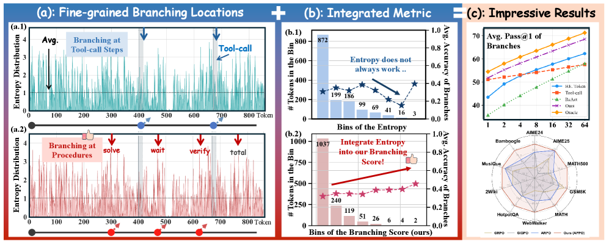
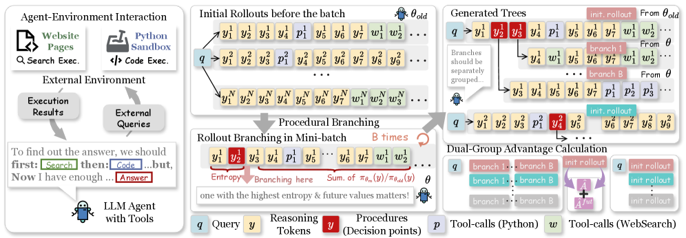
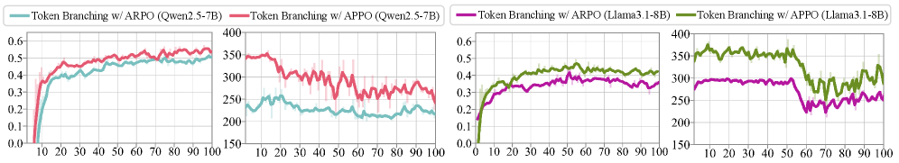
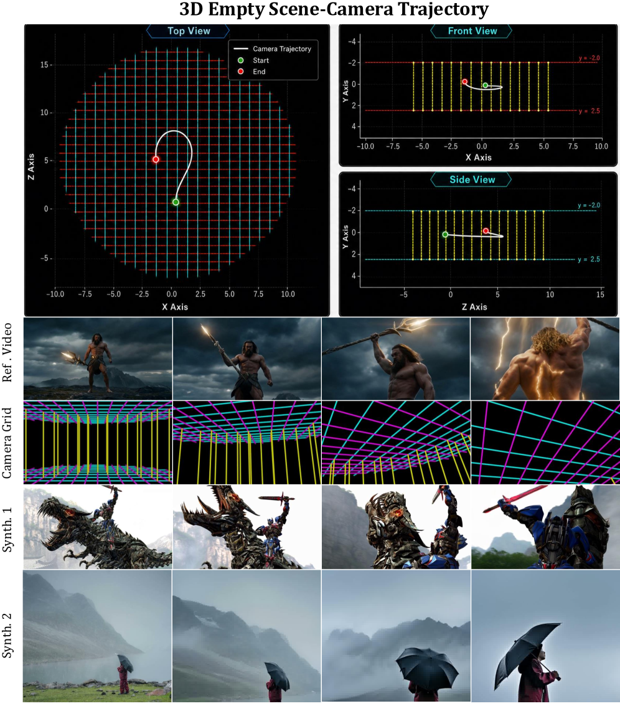
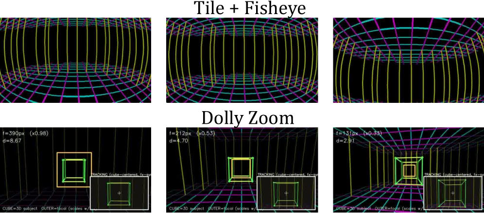

# HF Daily Papers 摘要 · 2026/06/13–06/16

> **覆盖范围**：2026-06-13 至 06-16（HF Daily Papers feed）。06/13–06/14 为周末，无新论文；实际论文集中在 06/15（48 篇）与 06/16（3 篇），合计 **51 篇**，已全部与上一份 digest（`2026-06-12-hf-daily-papers-may29-jun12.md`，覆盖 05/29–06/12）按 arXiv ID 去重，**无重叠**。
>
> **本期主线**：Agentic RL 的「信用分配粒度」之争（APPO 把 branching 从工具调用边界下沉到决策点）、Agent 记忆与上下文工程（图记忆重构、专用仓库探索子 agent）、视频生成的「可控性」（多镜头相机克隆、视频参考数字人）、以及 LLM 在高风险场景的认知韧性评测（医疗误导、AI 同行评审被操纵）。
>
> 本期精选 **25 篇**，深入分析 **2 篇**（APPO、OmniDirector），含 **8 张配图** 与多张数据表。

---

## 一、本期总览表（精选 25 篇）

| # | 论文 | arXiv | 👍 | 主题 | 一句话 |
|---|------|-------|----|------|--------|
| 1 | **OmniDirector** | [2606.13432](https://huggingface.co/papers/2606.13432) | 95 | 视频生成 | 用「相机网格视频」表示相机运动，无需 cross-paired 数据实现多镜头相机克隆 |
| 2 | **APPO** | [2606.12384](https://huggingface.co/papers/2606.12384) | 66 | Agentic RL | 把 branching/信用分配从工具边界下沉到「决策点」，13 benchmark +~4 分 |
| 3 | **MRAgent (Graph Memory)** | [2606.06036](https://huggingface.co/papers/2606.06036) | 60 | Agent 记忆 | 记忆是「重构」而非「检索」：Cue-Tag-Content 图 + 主动重构，最高 +23% |
| 4 | **From Chatbot to Digital Colleague** | [2606.14502](https://huggingface.co/papers/2606.14502) | 42 | 综述/范式 | LLM 从对话生成器走向持久自治的「数字同事」（Workspace+Skill） |
| 5 | **MedMisBench** | [2606.12291](https://huggingface.co/papers/2606.12291) | 40 | 安全评测 | 误导上下文下 LLM 医疗准确率从 71.1%→38.0%，攻击成功率 51.5% |
| 6 | **Orchestra-o1** | [2606.13707](https://huggingface.co/papers/2606.13707) | 37 | Agent 编排 | 全模态 agent 编排，OmniGAIA 上超次优 10.3%，DA-GRPO 训练 8B |
| 7 | **HarnessX** | [2606.14249](https://huggingface.co/papers/2606.14249) | 33 | Agent Harness | 可组合/可演化的 agent harness 工厂，5 benchmark 平均 +14.5% |
| 8 | **Rethinking RAG in Long Videos** | [2606.13141](https://huggingface.co/papers/2606.13141) | 32 | 多模态 RAG | V-RAGBench + CARVE：chunk 级自适应配置选择，超 8 个 VideoRAG 基线 |
| 9 | **From AGI to ASI** | [2606.12683](https://huggingface.co/papers/2606.12683) | 26 | 综述/前瞻 | 系统梳理 AGI→ASI 四条路径与瓶颈 |
| 10 | **OmniVideo-100K** | [2606.14702](https://huggingface.co/papers/2606.14702) | 23 | 多模态数据 | 实体锚定脚本 + 线索引导 QA，音视频推理微调最高 +20.59% |
| 11 | **S2L-PO** | [2605.30789](https://huggingface.co/papers/2605.30789) | 20 | RL 训练 | 小模型是天然探索者：用固定小模型引导大模型 GRPO，AIME24 +8.8% |
| 12 | **FastContext** | [2606.14066](https://huggingface.co/papers/2606.14066) | 16 | 编码 Agent | 专用「仓库探索」子 agent，分离探索与求解，token -60% / 解决率 +5.5% |
| 13 | **RedAct** | [2606.10813](https://huggingface.co/papers/2606.10813) | 15 | Agent 安全 | 重写 agent trace 防止「程序性技能」泄露，水印检测 93.6–100% |
| 14 | **PoLar (Program-of-Layers)** | [2606.06574](https://huggingface.co/papers/2606.06574) | 15 | 推理效率 | 训练自由地跳层/循环层，数学推理上更短执行即更高准确率 |
| 15 | **RepFusion** | [2606.14700](https://huggingface.co/papers/2606.14700) | 11 | T2I 生成 | 把 MLLM 当「带噪表征编码器」，为扩散提供更强先验 |
| 16 | **LLM Agents Can See Code Repos** | [2606.14061](https://huggingface.co/papers/2606.14061) | 11 | 编码 Agent | 仓库结构可视化图作为辅助模态，token -26%、解决率不降反升 |
| 17 | **iMaC (Image as Action)** | [2606.09813](https://huggingface.co/papers/2606.09813) | 9 | 具身世界模型 | 用图像本身作为「动作」表示，摆脱手工动作空间 |
| 18 | **Hy-Embodied-0.5-VLA** | [2606.14409](https://huggingface.co/papers/2606.14409) | 8 | 具身/VLA | 覆盖数据→预训练→RL→真机部署的全栈机器人学习系统 |
| 19 | **Pythagoras-Prover** | [2606.12594](https://huggingface.co/papers/2606.12594) | 8 | 形式化证明 | 4B 模型 pass@32 在 MiniF2F 上超 DeepSeek-Prover-V2-671B |
| 20 | **μ_0 (3D Interaction-Trace)** | [2606.13769](https://huggingface.co/papers/2606.13769) | 7 | 世界模型 | 预测 3D 交互轨迹而非像素，跨具身、可与动作专家拼接 |
| 21 | **Game AI Peer Review** | [2606.13044](https://huggingface.co/papers/2606.13044) | 7 | 安全评测 | 仅改「表述层」不改实验，3 个 AI 审稿人攻击成功率 75.1% |
| 22 | **MBench (Video World Memory)** | [2606.00793](https://huggingface.co/papers/2606.00793) | 7 | 世界模型评测 | 把视频世界模型「记忆」拆为实体/环境/因果一致性 12 子维度 |
| 23 | **VISTA (GUI Grounding)** | [2606.14579](https://huggingface.co/papers/2606.14579) | 6 | GUI Agent | 多视图自验证 GRPO，ScreenSpot-Pro 上 Qwen3-VL 大幅提升 |
| 24 | **The Arbiter Agent** | [2606.10747](https://huggingface.co/papers/2606.10747) | 6 | 多 Agent 安全 | 预算受限地实时监控多 agent 对话以检测涌现性失配 |
| 25 | **LoRA-α** | [2606.12883](https://huggingface.co/papers/2606.12883) | 5 | 微调 | 揭示 LoRA 缩放因子 α 才是优化主导，平方根律 + 大系数 |

> 其余 26 篇（含 Avatar V、RhymeFlow、World Tracing、UniDDT、ClinHallu、TokenPilot、StepPO、APT、AlloSpatial、P3D-Bench 等）见文末 References。

---

## 二、分主题详解

### 主题 A：Agentic RL —— 信用分配的「粒度」之争

本期最集中的研究线，是 **agentic RL 中「在哪里探索、如何分配信用」** 这一根本问题。

- **APPO（#2，66👍）** 是本期的核心论点：现有方法（ARPO 等）在工具调用边界或固定 workflow 这样的**粗粒度单元**上做 branching 与信用分配，但作者的 pilot 分析发现——**真正有影响力的决策点散布在整个生成序列中，而非集中于工具调用处**；且**单纯的 token 熵并不可靠地反映其对最终结果的影响**。APPO 因此把粒度下沉到「决策点」，用 Branching Score（token 不确定性 × 后续 continuation 的策略似然增益）选择分支位置，并引入 procedure-level advantage scaling。13 个 benchmark 上平均提升近 4 分。详见下方深入分析。

- **S2L-PO（#11，20👍）** 提供了另一个增加 rollout 多样性的维度：**同族小模型天生具备更高的「策略级多样性」**（随采样数增加，其 pass@k 反超大模型）。与 token 级噪声不同，这种多样性时间相关、保持逻辑一致性。S2L-PO 用固定小模型作为「天然探索者」引导大模型，配合从离线小模型 rollout 到大模型自采样的渐进退火，在 AIME24 上用 1.7B explorer 引导 8B 模型 **+8.8%**，同时降低 rollout 计算量。

- **VISTA（#23，6👍）** 把 GRPO 用于 GUI Grounding 时遇到的「分组全对/全错、无相对优势」问题，用**同一 GUI 实例的多个保目标裁剪视图**构造比较组解决——ScreenSpot-Pro 上把 Qwen3-VL 4B/8B/30B 从 55.5/52.7/53.7 提升到 **63.4/65.8/67.0**。

> 三篇共同指向同一个洞见：**GRPO 系方法的瓶颈不在算法本身，而在「探索信号从哪里来」**——决策点（APPO）、小模型策略（S2L-PO）、多视图（VISTA）都是在重新设计 rollout 的多样性来源。

### 主题 B：Agent 记忆、上下文与 Harness 工程

- **MRAgent / Graph Memory（#3，60👍）**：标题即论点——「记忆是被**重构**的，不是被**检索**的」。现有 memory-augmented agent 用静态 retrieve-then-reason 流水线，无法根据推理中途发现的证据动态调整记忆访问。MRAgent 用 **Cue-Tag-Content 关联图** + 主动重构机制，把 LLM 推理直接嵌入记忆访问，迭代探索/剪枝检索路径。LoCoMo / LongMemEval 上最高 **+23%**，同时大幅降低 token 与运行时开销。

- **HarnessX（#7，33👍）**：明确把「runtime harness（prompt、工具、记忆、控制流）」作为独立于模型规模的进步杠杆。它用 substitution algebra 组合 typed harness 原语，用 AEGIS（trace 驱动的多 agent 演化引擎）适配，并把轨迹同时转化为 harness 更新与模型训练信号。ALFWorld / GAIA / WebShop / τ³-Bench / SWE-bench Verified 五项平均 **+14.5%（最高 +44.0%）**，且 baseline 越低收益越大。

- **FastContext（#12，16👍，微软）**：编码 agent 的「仓库探索」是 token 黑洞。FastContext 把**探索与求解分离**——一个 4B–30B 的专用探索子 agent 按需被调用，并行发起工具调用，只返回精炼的文件路径 + 行号区间。集成进 Mini-SWE-Agent 后，SWE-bench Multilingual/Pro/SWE-QA 上端到端解决率 **+5.5%**，token 消耗最高 **-60%**。

- **LLM Agents Can See Code Repos（#16，11👍）**：与 FastContext 互补的另一个方向——给编码 agent 喂**仓库结构的可视化图**作为辅助模态。纯视觉会掉点（缺符号细节、反复视觉查询）；但「文本接口 + 结构图」混合可使输入 token **-26%**，解决率持平或更高，尤其在故障定位与自主控制探索深度时有用。

- **RedAct（#13，15👍）** 与 **The Arbiter Agent（#24，6👍）** 是 harness 的「安全侧」：前者把公开 agent trace 视为**安全接口**，重写 trace 防止程序性技能泄露（NST 从 44.7–67.1% 压到 no-skill 基线以下，水印检测 93.6–100%）；后者在受限 inspection budget 下实时监控多 agent 对话、检测涌现性失配，发现「权重诱导的失配」最难检测、「指令诱导的失配」即便被动观察也能可靠识别。

### 主题 C：视频生成与世界模型的「可控性」

- **OmniDirector（#1，95👍，本期最高）**：多镜头相机克隆。用「相机网格视频」把相机参数可视化为时空信号，million-scale 数据训练，配层级化 Prompt Expansion agent。详见深入分析。

- **Avatar V（#25 外，5👍）**：production 级数字人，不再把身份压成定长 embedding，而是直接 condition 在**参考视频的完整 token 序列**上，用 Sparse Reference Attention 实现线性复杂度长参考条件，1080p 无限时长，号称在身份保持/唇同步上超 Seedance 2.0 / Kling O3 Pro / Veo 3.1 / OmniHuman 1.5。

- **RhymeFlow（5👍）**：训练自由的视频生成加速——只对少量「关键帧」做完整密集去噪，非关键帧渐进跳步，再用 latent trajectory projection 模块维持时序一致性。

- **世界模型评测**：**MBench（#22）** 把视频世界模型的「记忆」拆成实体/环境/因果一致性 12 个子维度，揭示当前 SOTA 在长程状态保持上的系统性缺陷；**μ_0（#20）** 主张用 3D 交互轨迹（而非像素或具身相关动作标签）作为可扩展、跨具身的运动接口，frozen 后可与动作专家拼接，无动作预训练却能媲美 π_0。

### 主题 D：高风险场景的认知韧性 & 评测

- **MedMisBench（#5，40👍）**：高分≠安全。当把误导上下文注入到 LLM 原本答对的医疗题时，平均准确率从 **71.1%→38.0%**，攻击成功率 51.5%；最具破坏力的是「权威框架的虚假陈述」（69.5%）与「例外投毒」（64.1%）。7 国 14 人临床专家组判定 38.2% 案例存在严重潜在伤害。论点：现有 benchmark 测「模型知道什么」，却不测「在误导下能否守住正确判断」。

- **Game AI Peer Review（#21，7👍）**：比 prompt injection 更隐蔽的攻击——**不藏隐藏指令、不改方法/实验/图表/数据**，只改 abstract、贡献表述、related work、discussion 等「表述层」。3 个主流 AI 审稿人攻击成功率 **75.1%**，平均涨分 +1.21/10。揭示两个结构性失效：AI 审稿人「易被打动、难被说服」；会把「看起来回应了 limitation」误认为「真的解决了」。

- **ClinHallu / LoSoNA / AFFORDANCE20Q 等**（见 References）继续扩展「在特定情境下评测模型可靠性」的版图。

### 主题 E：训练与推理效率

- **PoLar（#14，15👍）**：揭示 LLM 存在训练自由的「层程序」——预训练层可被打包成模块并跳过或循环，为每个输入定制执行程序。多数输入用**更短的执行**即可达到同等或更好准确率，且原模型的错误预测可被「更少层的替代程序」纠正。
- **LoRA-α（#25，5👍）**：缩放因子 α 而非学习率才是 LoRA 优化的主导驱动；最优 α 与 rank 呈带「异常大系数」的平方根关系，揭示现有 rank-tied 启发式缩放不足。
- **Pythagoras-Prover（#19，8👍）**：4B 模型 pass@32 在 MiniF2F-Test 上 **86.1%** 超 DeepSeek-Prover-V2-671B（82.4%，参数少约 167×），32B 达开源 SOTA 93.0%。靠课程式 SFT + Augmented Lean Formalisation（ALF）扩充稀缺验证语料。

---

## 三、深入分析

### 深入分析 ① · APPO：把 agentic RL 的信用分配下沉到「决策点」

> arXiv [2606.12384](https://huggingface.co/papers/2606.12384) · 代码 [AMAP-ML/APPO](https://github.com/AMAP-ML/APPO) · 66👍

#### 动机：粗粒度信用分配的两个误区

agentic RL（如 ARPO）通常在**工具调用边界**或**固定 workflow** 这样的粗粒度单元上做 branching 和信用分配。APPO 的 pilot 分析揭示两点：

1. **有影响力的决策点散布在整个生成序列中**，并非集中在工具调用处——在工具边界 branching 会错过大量真正改变推理走向的位置；
2. **token 熵不可靠**：高熵 token 里固然有 "verify"、"sum"、"break" 这类推理关键词，但也混入大量罕见名词（"march"、"november"）——这些是词表长尾效应，其不确定性反映「绝对稀有度」而非「推理难度」，优化它们带不来可迁移的推理增益。

#### 方法：Branching Score + 过程级优势

- **Branching Score（BS）**：结合 token 不确定性与「后续 continuation 的策略诱导似然增益」——优先选择那些会在新旧策略间引起较大**下游分布漂移**的 token，即真正会重定向推理轨迹、决定 continuation 成败的位置。
- **过程级优势缩放**：把信用更细粒度地分配到分支 rollout 上；引入未来感知优势项 $\hat{A}^{\rm fut}$。
- **双组优势估计**：初始 rollout 与分支来自不同策略分布，应在各自组内比较。
- **理论支撑**：论文给出方差缩减（Thm 3.1）与策略改进界（Thm 3.2）两条定理。

#### 关键数据

**主结果（13 benchmark）**：相比此前最佳 agentic RL 方法，数学推理任务平均 **+2.45 分**；整体平均提升近 **4 分**。DeepSearch 任务上确立 8B/14B 两个规模的新 SOTA：

| 任务/规模 | 指标 | 此前最佳 | APPO |
|---|---|---|---|
| GAIA · Qwen3-8B | pass@1 | — | **42.7** |
| GAIA · Qwen3-14B | pass@1 | 43.7 | **46.1** |
| GAIA · Qwen3-14B | pass@5 | 61.2 | **64.0** |
| WebWalkerQA · Qwen3-14B | pass@1 | 40.5 | **42.7** |
| WebWalkerQA · Qwen3-14B | pass@5 | 62.0 | **66.8** |

> Pass@K 分析（Fig 3）显示：APPO 的优势**随 k 增大而扩大**——它改善的不只是 top-1，而是整个候选轨迹分布的多样性与质量。

**分支预算配置（M=16，Qwen2.5-7B-Instruct）**：在相同总预算下，**平衡配置** 优于两个极端——增大 N 提升初始轨迹多样性但留给高影响决策点扩展的预算变少；增大 B 加深关键点探索但全局覆盖下降：

| 配置 (N, B) | 含义 | 平均分 |
|---|---|---|
| (N=8, B=1) | 多根、浅分支 | 57.9 |
| **(N=4, B=3)** | **平衡（默认）** | **58.1** |
| (N=2, B=7) | 少根、深分支 | 56.1 |

**消融（Qwen2.5-7B，平均分）**：

| 变体 | 平均分 | 说明 |
|---|---|---|
| **完整 APPO** | **58.1** | — |
| BS → 熵 | 56.4（-1.7） | 纯熵无法定位高影响决策点 |
| 去掉 $\hat{A}^{\rm fut}$ | 54.7（-3.4） | 影响最大，证明未来感知信用关键 |
| 去掉双组优势估计 | 明显下降 | 不同分布的 rollout 不应混比 |

#### 评价

APPO 把「agentic RL 该在哪里探索」从工程启发式（工具边界）变成一个**有理论支撑、可度量（BS）的优化问题**，且实验同时给出 where（BS 定位）与 how（双组 + 未来优势）两层证据。局限：BS 需要对 continuation 做额外前向以估计似然增益，带来一定计算开销；其增益在「长 horizon、复杂工具使用」的 DeepSearch 上最明显，对短任务的边际收益待观察。

---

### 深入分析 ② · OmniDirector：用「相机网格」实现无需配对数据的多镜头相机克隆

> arXiv [2606.13432](https://huggingface.co/papers/2606.13432) · [项目页](https://ymlinfeng.github.io/OmniDirector.github.io/) · 95👍（本期最高）

#### 动机：相机控制的三难

视频生成里控制相机运动，现有路线各有硬伤：

- **文本描述**：无法精确定义细腻的运镜属性；
- **显式相机参数**（MotionCtrl 的 6DoF、CameraCtrl 的 Plücker embedding）：精确但用户门槛高，且从参考视频估计的平移在**不同场景尺度间存在歧义**，套到新场景常致几何畸变；
- **cross-paired 数据训练**（同运镜不同内容的视频对）：缓解尺度错配，但真实配对数据极稀缺，难以 scale；用游戏引擎合成又缺乏真实叙事语境，处理复杂运镜（突然切镜、复杂转场）困难。

#### 方法：相机网格 + 层级 Prompt Expansion Agent

1. **相机网格（Camera Grid）**：把真实世界抽象成只有 3D 网格线的「空房间」，在不同相机位姿下渲染——世界坐标网格端点经外参 $P_c=R_iP_w+t_i$ 变换、再投影到像平面，逐帧渲染合成时序运镜。由于它本质是与视频同构的时空信号，可走标准视频编码管线注入 MMDiT，**把相机控制与其他视觉属性完全解耦**。
2. **自重构目标**：30% 训练样本用相机网格自身作为重构目标（无任何外观/内容线索），迫使模型解析网格的几何结构与时序动态，而非把它当可忽略的弱提示。
3. **层级 Prompt Expansion Agent**（推理期）：把相机 prompt 分解为 **inter-shot（处理切镜间关系，保证多镜头语义连贯）** 与 **intra-shot（单镜头内运镜描述）**，再经 Qwen3-VL 用参考视频关键帧矫正位姿估计误差，最后语义融合相机运动、主体、物体运动。
4. **coarse-to-fine 去噪调度**：高噪声阶段注入相机网格建立全局空间结构，低噪声阶段引入其他控制信号细化局部内容。

#### 关键数据

在 1,094 个精选样本（涵盖广告、电影、复杂视效，含 in/cross-domain、单/多镜头、简单/复杂轨迹）上评测：

| 维度 | 结果 |
|---|---|
| 平移精度 T-Pre | 相对次优方法 CamCloneMaster **+39.3%** |
| 全部指标（相机精度 / 转场精度 / 泄露率） | **全面超越所有 baseline** |
| 内容泄露率 | **最低**（相机网格 + PE agent 完全解耦相机信号与参考视频内容） |
| 转场评测 | Tem-Pre（时序误差<3 帧，TransNet-V2 检测）+ Sem-Pre（Gemini 3.1 Pro 验证转场类型匹配） |
| GSB 人评（vs CamCloneMaster） | 三个维度（整体效果/生成稳定性）均明显占优 |

> 对比中，Seedance 2.0 与 CamCloneMaster 在多镜头视频上运动幅度违反人类视觉感知；LTX-LoRA 虽能执行切镜，但其「转场能力」实为**内容泄露**的副产物而非真正的相机控制。

#### 评价

OmniDirector 的核心贡献是一个**优雅的表示选择**：把相机参数渲染成「网格视频」，让相机控制变成与视频生成同构的问题，从而既绕开了显式参数的尺度歧义，又绕开了 cross-paired 数据的稀缺。配合 PE Agent 处理多镜头语义连贯，是本期可控视频生成方向最完整的工作。局限：依赖 million-scale 相机网格-视频对的构造管线，且 PE Agent 链路较长（位姿估计 + Qwen3-VL 矫正 + 人工标注），实际复现成本不低。

---

## 四、趋势分析

1. **「Harness/上下文工程」正在成为与「模型规模」并列的进步杠杆。** HarnessX 明说「agent 进步不必只来自模型 scaling」，FastContext 用专用子 agent 把 token 砍 60%，MRAgent 把记忆从「检索」改为「重构」——三者都在重新设计**模型之外的运行时接口**。本期甚至出现 "From Chatbot to Digital Colleague" 这类把 Workspace+Skill 范式系统化的综述，标志这一方向从工程技巧上升为研究范式（与 OpenClaw 式工作站系统呼应）。

2. **Agentic RL 进入「精细化信用分配」阶段。** 从粗粒度的工具边界（ARPO）转向决策点（APPO）、从 token 噪声转向策略级多样性（S2L-PO）、从单视图转向多视图（VISTA）——核心议题已不是「能否用 RL 训 agent」，而是「探索信号的来源与粒度如何设计」。

3. **可控视频生成从「能生成」转向「精确克隆+解耦控制」。** OmniDirector（相机）、Avatar V（身份+行为）都在追求把某一控制维度从内容中**完全解耦**；同时 MBench、μ_0 把注意力引向世界模型的「长程记忆/状态一致性」这一更难的功能性指标。

4. **「评测的盲区」成为安全研究的新前沿。** MedMisBench（误导上下文下的认知韧性）、Game AI Peer Review（表述层操纵）、RedAct（trace 技能泄露）、Arbiter（多 agent 涌现失配）共同指出：现有 benchmark 测「模型知道什么」，但不测「在对抗/误导/多 agent 交互下能否守住正确行为」——攻击面正从「显式 prompt injection」扩展到「表述结构」「执行轨迹」「agent 间交互」。

5. **小模型/低参数的「逆袭」叙事持续。** S2L-PO（小模型当探索者）、Pythagoras-Prover-4B（pass@32 超 671B）、FastContext（4B–30B 探索专家）都在说明：在特定环节用对了的小模型，能以远低的成本逼近甚至超越超大模型。

---

## 五、Open Questions

1. **APPO 的 Branching Score 需要额外前向估计似然增益——在更大规模 / 更长 horizon 下，其计算开销与收益如何权衡？** 决策点定位能否进一步用轻量代理模型预测，而非每步实算？
2. **「记忆重构」（MRAgent）与「图记忆」「外部向量库」是互补还是替代？** 主动重构在多跳、对抗性记忆任务上是否仍稳健？
3. **Harness 演化（HarnessX/AEGIS）把轨迹变成训练信号——这与直接 RL 微调模型相比，边界在哪里？** 「演化 harness」是否会过拟合到 benchmark 的特定 scaffolding？
4. **AI 同行评审被表述层操纵（75.1% 成功率）——在 AI 审稿进入真实流程前，如何让 reviewer 锚定科学内容而非表述？** 「contamination-free rolling benchmark」能否成为标准防线？
5. **相机网格这类「把控制信号渲染成同构视频」的思路，能否推广到光照、物理、布局等其他控制维度？** 多控制信号叠加时的解耦是否仍成立？

---

## References

**精选（按总览表序号）**

1. OmniDirector: General Multi-Shot Camera Cloning without Cross-Paired Data — [2606.13432](https://huggingface.co/papers/2606.13432)
2. APPO: Agentic Procedural Policy Optimization — [2606.12384](https://huggingface.co/papers/2606.12384)
3. Memory is Reconstructed, Not Retrieved: Graph Memory for LLM Agents — [2606.06036](https://huggingface.co/papers/2606.06036)
4. From Chatbot to Digital Colleague: The Paradigm Shift Toward Persistent Autonomous AI — [2606.14502](https://huggingface.co/papers/2606.14502)
5. Measuring Epistemic Resilience of LLMs Under Misleading Medical Context (MedMisBench) — [2606.12291](https://huggingface.co/papers/2606.12291)
6. Orchestra-o1: Omnimodal Agent Orchestration — [2606.13707](https://huggingface.co/papers/2606.13707)
7. HarnessX: A Composable, Adaptive, and Evolvable Agent Harness Foundry — [2606.14249](https://huggingface.co/papers/2606.14249)
8. Rethinking RAG in Long Videos: What to Retrieve and How to Use It? — [2606.13141](https://huggingface.co/papers/2606.13141)
9. From AGI to ASI — [2606.12683](https://huggingface.co/papers/2606.12683)
10. OmniVideo-100K: A Dataset for Audio-Visual Reasoning — [2606.14702](https://huggingface.co/papers/2606.14702)
11. Smaller Models are Natural Explorers for Policy-Level Diversity in GRPO (S2L-PO) — [2605.30789](https://huggingface.co/papers/2605.30789)
12. FastContext: Training Efficient Repository Explorer for Coding Agents — [2606.14066](https://huggingface.co/papers/2606.14066)
13. RedAct: Redacting Agent Capability Traces for Procedural Skill Protection — [2606.10813](https://huggingface.co/papers/2606.10813)
14. Skip a Layer or Loop It? Learning Program-of-Layers in LLMs (PoLar) — [2606.06574](https://huggingface.co/papers/2606.06574)
15. RepFusion: Leveraging Multimodal Priors for Denoising in Representation Space — [2606.14700](https://huggingface.co/papers/2606.14700)
16. LLM Agents Can See Code Repositories — [2606.14061](https://huggingface.co/papers/2606.14061)
17. iMaC: Translating Actions into Motion and Contact Images for Embodied World Models — [2606.09813](https://huggingface.co/papers/2606.09813)
18. Hy-Embodied-0.5-VLA — [2606.14409](https://huggingface.co/papers/2606.14409)
19. Pythagoras-Prover: Advancing Efficient Formal Proving via Augmented Lean Formalisation — [2606.12594](https://huggingface.co/papers/2606.12594)
20. μ_0: A Scalable 3D Interaction-Trace World Model — [2606.13769](https://huggingface.co/papers/2606.13769)
21. No Hidden Prompts Needed! You Can Game AI Peer Review with Presentation-Only Revisions — [2606.13044](https://huggingface.co/papers/2606.13044)
22. MBench: A Comprehensive Benchmark on Memory Capability for Video World Models — [2606.00793](https://huggingface.co/papers/2606.00793)
23. VISTA: View-Consistent Self-Verified Training for GUI Grounding — [2606.14579](https://huggingface.co/papers/2606.14579)
24. The Arbiter Agent: Continually Monitoring Multi-Agent Conversations — [2606.10747](https://huggingface.co/papers/2606.10747)
25. The Hidden Power of Scaling Factor in LoRA Optimization (LoRA-α) — [2606.12883](https://huggingface.co/papers/2606.12883)

**其余论文（06/15–06/16）**

- Avatar V: Scaling Video-Reference Avatar Video Generation — [2606.13872](https://huggingface.co/papers/2606.13872)
- RhymeFlow: Training-Free Acceleration for Video Generation — [2606.06309](https://huggingface.co/papers/2606.06309)
- TokenPilot: Cache-Efficient Context Management for LLM Agents — [2606.17016](https://huggingface.co/papers/2606.17016)
- ClinHallu: A Benchmark for Diagnosing Stage-Wise Hallucinations in Medical QA — [2606.14697](https://huggingface.co/papers/2606.14697)
- When is Your LLM Steerable? — [2606.11599](https://huggingface.co/papers/2606.11599)
- LoSoNA: A Benchmark for Local Social Norm Adaptation — [2606.14600](https://huggingface.co/papers/2606.14600)
- World Tracing: Generative Pixel-Aligned Geometry Beyond the Visible — [2606.13652](https://huggingface.co/papers/2606.13652)
- UniDDT: Unifying Multimodal Understanding and Generation with Decoupled Tokens — [2606.16255](https://huggingface.co/papers/2606.16255)
- AFFORDANCE20Q: Evaluating Affordance Reasoning from Physical Properties — [2606.14240](https://huggingface.co/papers/2606.14240)
- Dense Supervision, Sparse Updates: On the Sparsity and Geometry of On-Policy RL — [2606.13657](https://huggingface.co/papers/2606.13657)
- Benchmarking AI Agents for Addressing Scientific Challenges Across Scales — [2606.12736](https://huggingface.co/papers/2606.12736)
- P3D-Bench: Benchmarking MLLMs for Parametric 3D Generation — [2606.11152](https://huggingface.co/papers/2606.11152)
- An Enigma of Artificial Reason: Investigating the Production-Evaluation Gap — [2606.01462](https://huggingface.co/papers/2606.01462)
- StepPO: Step-Aligned Policy Optimization for Agentic RL — [2604.18401](https://huggingface.co/papers/2604.18401)
- APT: Action Expert Pretraining Improves Instruction Generalization — [2606.12366](https://huggingface.co/papers/2606.12366)
- AlloSpatial: Agentic Harness Framework for Spatial Reasoning — [2606.08952](https://huggingface.co/papers/2606.08952)
- Two-Fidelity Best-Action Identification for Stochastic Minimax Tree — [2606.01708](https://huggingface.co/papers/2606.01708)
- Steady-Forcing: Balancing Spatial Persistence and Motion Continuity — [2606.14732](https://huggingface.co/papers/2606.14732)
- AdaSR: Adaptive Streaming Reasoning with Hierarchical Relative Policy — [2606.14694](https://huggingface.co/papers/2606.14694)
- Squeeze-Release: Iterative Pruning with Exact Structural Minimization — [2606.14346](https://huggingface.co/papers/2606.14346)
- Quickest Detection of Hallucination Onset: Delay Bounds and Learned CUSUM — [2606.12476](https://huggingface.co/papers/2606.12476)
- WaveDiT: Distribution-Aware Wavelet Flow Matching for Efficient 3D Brain MRI — [2606.08670](https://huggingface.co/papers/2606.08670)
- ActiveMimic: Egocentric Video Pretraining with Active Perception — [2606.06194](https://huggingface.co/papers/2606.06194)
- Statistically Reliable LLM-Based Ranking Evaluation — [2606.05308](https://huggingface.co/papers/2606.05308)
- CARVE: Certified Affordable Repair of Vetoed Maneuvers via Envelopes — [2606.02641](https://huggingface.co/papers/2606.02641)
- FVSpec: Real-World Property-Based Tests as Lean Challenges — [2606.01008](https://huggingface.co/papers/2606.01008)

---

*生成于 2026-06-16 · 覆盖 HF Daily Papers 06/13–06/16（51 篇，精选 25，深入 2，配图 8）*
