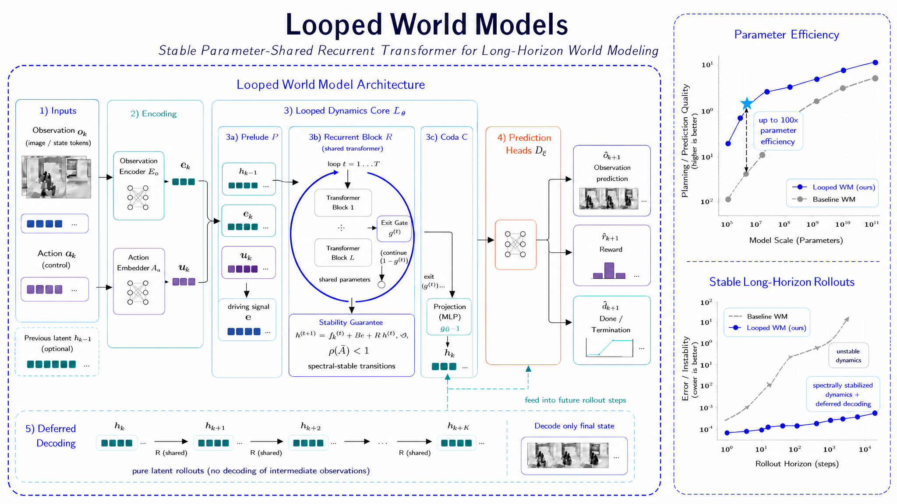
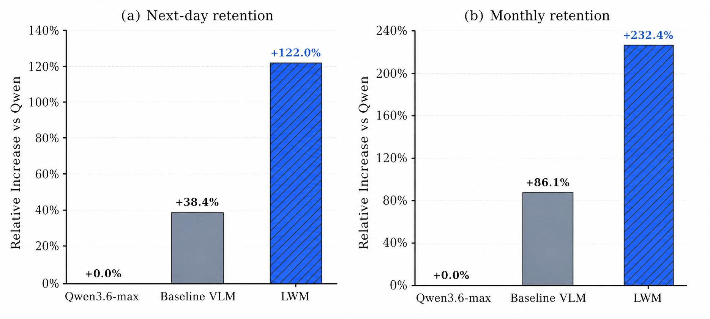
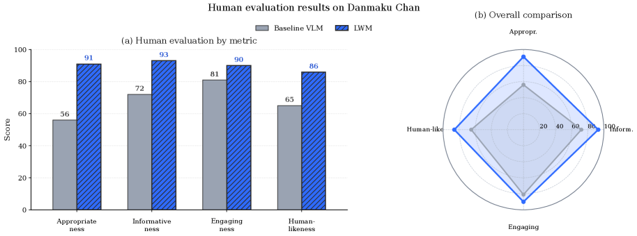
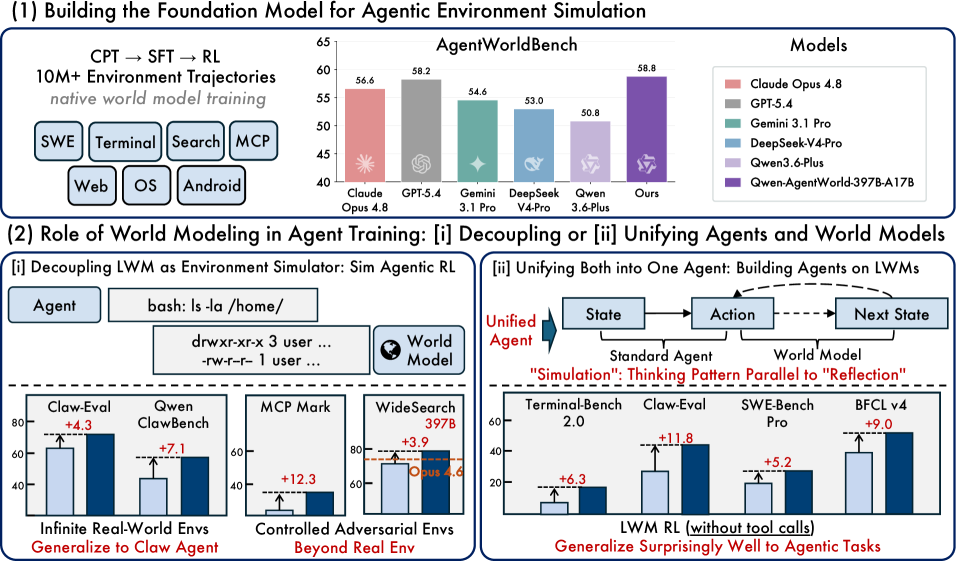
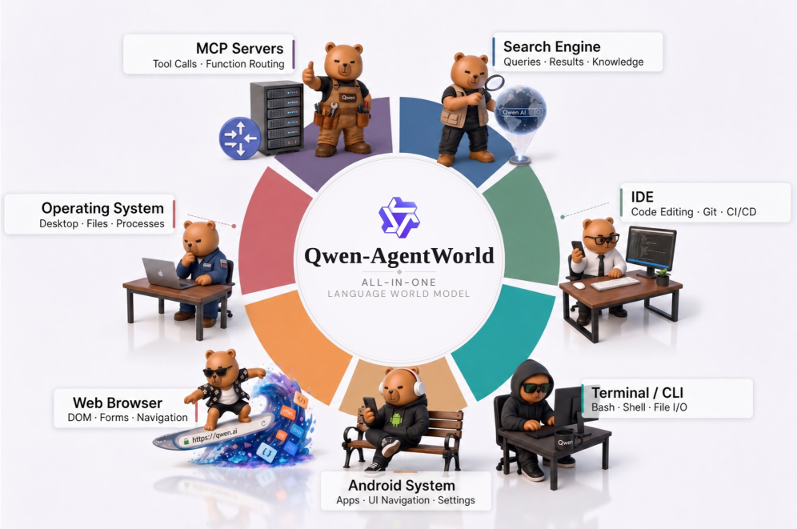
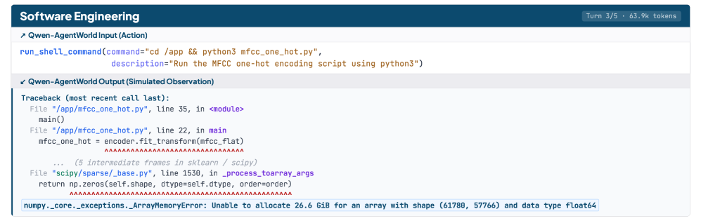
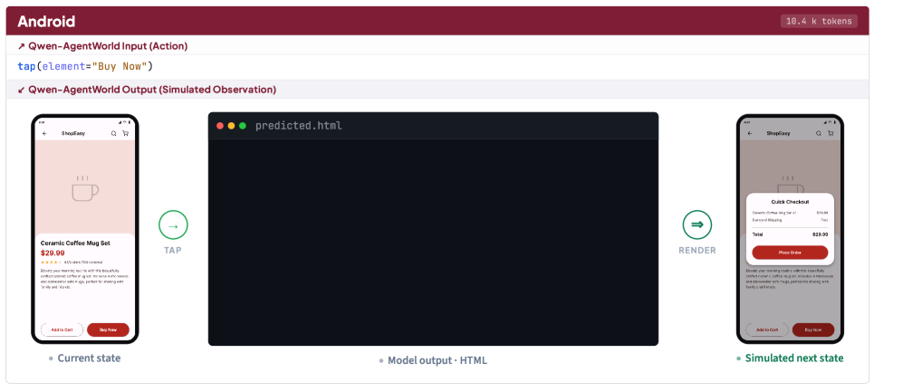

# Hugging Face Daily Papers Digest｜2026/06/17 – 06/25

> **覆盖范围**：2026-06-17 ~ 2026-06-25 共 9 天（06/20–06/21 周末 HF Daily Papers 无新增）。
> **数据来源**：Hugging Face `GET /api/daily_papers?date=...&limit=100`。9 天合计 **234 篇** 新论文（已剔除上一份 06/13–16 digest 已覆盖的 51 篇）。
> **排序口径**：按 HF Daily Papers `numUpvotes` 截至 06/26 01:35 UTC 的快照；同一篇论文若多日上 daily papers，取首次出现日期与最高票数。
> **精选**：Top **25**，重点关注 World Models（世界模型本周新一轮爆发）、Agent 系统与记忆/会话 runtime、Diffusion LLM 与 Looped Computation、Agent / Coding Benchmark。
> **Deep dives**：① **LoopWM**（首篇用 looped transformer 做世界模型，1B 参数对位 Claude Opus 4.6-max） ② **Qwen-AgentWorld**（Qwen 团队的语言世界模型 + 7 域 Sim RL，把"世界建模"重新定义为 agent foundation 训练）

---

## 0. 周观察 / Top-line takeaway

**主线一：World Model 周。** 本周从 #1 LoopWM、#4 Qwen-AgentWorld、#20 World Action Models（Survey）到 #32 Kairos，密集 4 篇直接命名"world model"，并伴随 #6 PlanBench-XL、#26 RNG-Bench、#11 DragMesh-2 等评测/接地工作——"agent 缺世界模型"这件事终于不只是 LeCun 单方面喊的口号，**Qwen 直接拿出 35B-A3B/397B-A17B 两个 native LWM** 把它做成产品级工具链。

**主线二：Looped / Recursive computation 成为新的 scaling 轴。** LoopWM（#1, 461 upvotes）和 LoopCoder-v2（#2, 204）两篇并列票仓前二都在做"循环 transformer"的事——把 inference 深度作为可变 scaling 维度。LoopWM 用 1B 参数打 Opus-4.6-max；LoopCoder-v2 发现"loop 两次最优，再多反而退化"。这是 ETD（encode-think-decode）思路在 world modeling / coding 上的两次有效复刻。

**主线三：Agent runtime + memory 系统化。** 不再是"agent + tool"的简单循环，本周出现一批**对 agent runtime 做工程化抽象**的论文：OpenRath（PyTorch-like session 抽象，fork/merge/replay，#10）、AOHP（Android 系统级 agent harness，#46）、MemGUI-Agent（ConAct context-as-action，#36）、OPD-Evolver（slow-fast co-evolution，#44）。同时 #7 "Are We Ready For An Agent-Native Memory System?" 直接对当前 agent memory 库做 benchmark。

**主线四：Agent benchmark 的代际更替。** 静态 leaderboard 被批"无 predictive validity"（#30）；新的评测从 "single benchmark" 走向"长视野/真实工作流/无注解"：EnterpriseClawBench（852 真实办公室任务，#8）、PlanBench-XL（大工具生态长视野）、GameCraft-Bench（端到端真游戏）、NatureBench（90 个 Nature 论文级科研复现，#18）、Multi-LCB（多语言 LiveCodeBench，#16）。

---

## 1. 论文总览表（Top 25 by HF upvotes）

| # | 日期 | ID | 标题 | u | 主题 |
|---|------|----|------|---|------|
| 1 | 06/17 | [2606.18208](https://huggingface.co/papers/2606.18208) | Looped World Models | 461 | World Model / Looped |
| 2 | 06/17 | [2606.18023](https://huggingface.co/papers/2606.18023) | LoopCoder-v2: Only Loop Once for Efficient Test-Time Computation Scaling | 204 | Code / Looped |
| 3 | 06/19 | [2606.19195](https://huggingface.co/papers/2606.19195) | Moebius: 0.2B Lightweight Image Inpainting w/ 10B-Level Perf. | 135 | Vision / Distill |
| 4 | 06/24 | [2606.24597](https://huggingface.co/papers/2606.24597) | Qwen-AgentWorld: Language World Models for General Agents | 116 | Agent / LWM |
| 5 | 06/22 | [2606.17162](https://huggingface.co/papers/2606.17162) | MemSlides: Hierarchical-Memory Agent for Slide Generation | 115 | Agent / Memory |
| 6 | 06/23 | [2606.22388](https://huggingface.co/papers/2606.22388) | PlanBench-XL: Long-Horizon Planning in Large Tool Ecosystems | 90 | Benchmark / Agent |
| 7 | 06/25 | [2606.24775](https://huggingface.co/papers/2606.24775) | Are We Ready For An Agent-Native Memory System? | 90 | Memory / Benchmark |
| 8 | 06/23 | [2606.23654](https://huggingface.co/papers/2606.23654) | EnterpriseClawBench: Benchmarking Agents from Real Workplace Sessions | 76 | Benchmark / Agent |
| 9 | 06/17 | [2606.18195](https://huggingface.co/papers/2606.18195) | Learning from the Self-future: On-policy Self-distillation for dLLMs | 74 | Diffusion LM |
| 10 | 06/23 | [2606.19409](https://huggingface.co/papers/2606.19409) | OpenRath: Session-Centered Runtime State for Agent Systems | 73 | Agent / Runtime |
| 11 | 06/19 | [2606.15133](https://huggingface.co/papers/2606.15133) | DragMesh-2: Plausible Dexterous Hand-Object Interaction | 72 | Robotics |
| 12 | 06/23 | [2606.21337](https://huggingface.co/papers/2606.21337) | DataClaw0: Agentic Tailoring Multimodal Data from Raw Streams | 70 | Data / Agent |
| 13 | 06/23 | [2606.20945](https://huggingface.co/papers/2606.20945) | Grouped Query Experts: MoE on GQA Self-Attention | 64 | Architecture / MoE |
| 14 | 06/17 | [2606.18216](https://huggingface.co/papers/2606.18216) | Zone of Proximal Policy Optimization (ZPPO) | 61 | RLHF / Distill |
| 15 | 06/22 | [2606.19534](https://huggingface.co/papers/2606.19534) | PerceptionDLM: Parallel Region Perception w/ Multimodal Diff. LM | 61 | Multimodal Diffusion |
| 16 | 06/19 | [2606.20517](https://huggingface.co/papers/2606.20517) | Multi-LCB: Multi-Lang LiveCodeBench | 58 | Benchmark / Code |
| 17 | 06/17 | [2606.17861](https://huggingface.co/papers/2606.17861) | GameCraft-Bench: Agents Building Playable Games End-to-End | 55 | Benchmark / Agent |
| 18 | 06/24 | [2606.24530](https://huggingface.co/papers/2606.24530) | NatureBench: Coding Agents vs. Nature-Family SOTA | 55 | Benchmark / Science |
| 19 | 06/25 | [2606.26058](https://huggingface.co/papers/2606.26058) | DomainShuttle: Subject-driven Open-Domain T2V | 55 | Video Gen |
| 20 | 06/23 | [2606.20781](https://huggingface.co/papers/2606.20781) | World Action Models: A Survey | 51 | World Model / Survey |
| 21 | 06/18 | [2606.18558](https://huggingface.co/papers/2606.18558) | MolmoMotion: Forecasting 3D Point Trajectories w/ Language | 50 | Robotics / Multimodal |
| 22 | 06/17 | [2606.17200](https://huggingface.co/papers/2606.17200) | ACE-Ego-0: Unifying Egocentric & Robotic Data for VLA | 49 | VLA / Embodied |
| 23 | 06/19 | [2606.19419](https://huggingface.co/papers/2606.19419) | Playful Agentic Robot Learning | 48 | Embodied / Play |
| 24 | 06/24 | [2606.24428](https://huggingface.co/papers/2606.24428) | Escaping Self-Confirmation Trap: Execute-Distill-Verify (EDV) | 48 | Agent / Self-improve |
| 25 | 06/18 | [2606.19338](https://huggingface.co/papers/2606.19338) | RNG-Bench: MLLMs in Controllable Non-Markov Games | 46 | Multimodal / Memory |

> **去重说明**：本周新论文 234 篇。已剔除上一份（2026-06-16-hf-daily-papers-jun13-16.md）覆盖的 51 篇 arXiv ID；本表为新增票数 Top 25。

---

## 2. 分主题详解

### 2.1 World Models — 从 LeCun 的口号到生产线

> 本周 4 篇 world-model 论文同时上榜（#1/#4/#20/#32），且都不是"video 生成"那一脉，而是**"agent / RL 的 simulated environment"**这一脉——延续 Dreamer/MuZero 思路但全面拥抱 transformer + 语言。

| ID | 论文 | 核心贡献 |
|----|------|---------|
| [2606.18208](https://huggingface.co/papers/2606.18208) | **Looped World Models (LoopWM)** | 首个把"循环 transformer"用于 world modeling 的工作。共享参数 transformer block 反复迭代 refine 隐式环境状态，**1B 参数 outperform Claude Opus 4.6-max**。论文将"迭代隐层深度"提为**全新 scaling 轴**，与模型规模/数据量正交。 |
| [2606.24597](https://huggingface.co/papers/2606.24597) | **Qwen-AgentWorld** | Qwen 团队的 35B-A3B / 397B-A17B 双版本 LWM，覆盖 7 个 agent 域（MCP / Search / Terminal / SWE / Android / Web / OS）。三阶段训练（CPT→SFT→RL）+ AgentWorldBench 评测套件。详见 §3.2 Deep dive。 |
| [2606.20781](https://huggingface.co/papers/2606.20781) | **World Action Models: A Survey** | 把 "predict-future-state for decision-making" 这一类模型统一命名为 World Action Models，把表征丰富度 vs. 计算约束作为分类轴。 |
| [2606.16533](https://huggingface.co/papers/2606.16533) | **Kairos** | 物理 AI 的"native world model stack"，引入 hybrid temporal attention 维护持久状态，强调跨硬件平台的高效部署。 |

**关联工作**：#11 DragMesh-2（物理可信的手-物体交互，dexterous manipulation 的下游验证）、#21 MolmoMotion（语言指令驱动 3D 点轨迹预测，机器人/视频生成共享 backbone）、#26 RNG-Bench（非马尔可夫多模态环境评测，专门考察"记忆 + 决策"——world model 的对立面：观察空间不足时怎么办）。

### 2.2 Agent 系统：runtime / memory / benchmark 三件套

**Runtime / 抽象**

- [#10 OpenRath](https://huggingface.co/papers/2606.19409)：提出 **Session** 作为多 agent 系统的核心 runtime 抽象（类比 PyTorch 的 `Tensor`），支持显式的 `fork` / `merge` / `replay`，记录完整执行状态。**这是 agent infra 第一次明确借鉴深度学习框架的"动态图"理念**。
- [#46 AOHP](https://huggingface.co/papers/2606.23449)：Android OS 级 agent harness，把 agent 提升为系统一等公民，专门优化任务完成率和成本。
- [#36 MemGUI-Agent](https://huggingface.co/papers/2606.19926)：用 **Context-as-Action (ConAct)** 主动管理 context，在长视野移动 GUI 任务上避免信息丢失。
- [#44 OPD-Evolver](https://huggingface.co/papers/2606.17628)：slow-fast co-evolution + on-policy 自蒸馏，让 agent 在 memory 管理和 policy 学习上同时演化。

**Memory**

- [#7 Are We Ready For An Agent-Native Memory System?](https://huggingface.co/papers/2606.24775)：把当前 agent memory 库（Mem0 / MemGPT / Letta...）当作"复杂数据管理系统"来 benchmark，跨多模块/多 workload 测性能。**结论：远未达到 production-ready**。
- [#5 MemSlides](https://huggingface.co/papers/2606.17162)：分层记忆 = 长期 user profile + working memory（session 约束）+ tool memory（可复用执行经验），专门解决个性化 slide 生成中的一致性问题。

**Benchmark / Evaluation 改革**

- [#8 EnterpriseClawBench](https://huggingface.co/papers/2606.23654)：852 个从**真实办公室 session** 复现的任务，强调多维评测而非单分数。
- [#6 PlanBench-XL](https://huggingface.co/papers/2606.22388)：大工具生态、有限可见性、动态扰动下的长视野规划。
- [#30 Beyond Static Leaderboards](https://huggingface.co/papers/2606.19704)：理论批评——单 aggregate 分数没有 predictive validity（rank 不稳定，部署相关维度不被捕捉），呼吁基于 OOD 准则的新评测范式。
- [#17 GameCraft-Bench](https://huggingface.co/papers/2606.17861)：让 agent 在真实游戏引擎里**从自然语言端到端做出可玩游戏**，按 engine grounding / artifact completeness / interactive verification 三轴评。
- [#18 NatureBench](https://huggingface.co/papers/2606.24530)：90 个 Nature 论文级科研任务，区分"复现 vs. 发现"——结论：**当前 coding agents 主要做"方法翻译"，而非真正发现**。
- [#16 Multi-LCB](https://huggingface.co/papers/2606.20517)：把 LiveCodeBench 推广到 12 种编程语言，保留 contamination 控制。

### 2.3 Looped Computation / 算力分配新范式

| ID | 论文 | 关键观察 |
|----|------|---------|
| [2606.18208](https://huggingface.co/papers/2606.18208) | **LoopWM** | 共享参数迭代 → adaptive depth + 100× parameter efficiency。 |
| [2606.18023](https://huggingface.co/papers/2606.18023) | **LoopCoder-v2** | 在 code 上验证：**两次 loop 就够了**，更多 loop 反而退化（positional mismatch 成本增加超过表征 refinement 收益）。 |
| [2606.18967](https://huggingface.co/papers/2606.18967) | **EfficientRollout** | RL rollout 期间的 system-aware self-speculative decoding，drafter 跟随 policy 演化。 |
| [2606.18195](https://huggingface.co/papers/2606.18195) | **d-OPSD** | diffusion LLM 的 on-policy 自蒸馏，self-teacher 适配非自回归特性。 |

> **趋势**：训练-时投入算力变贵 → 推理-时分配算力（test-time compute / iterative refinement）变成新的 scaling 范式。LoopWM 把这条线从语言推理（ETD）扩展到了 world model。

### 2.4 多模态 / Diffusion LM 进展

- [#15 PerceptionDLM](https://huggingface.co/papers/2606.19534)：多模态 diffusion LM 通过 structured attention masking 做**并行区域感知**，caption quality 不降而推理更快。
- [#37 Improved Large Language Diffusion Models](https://huggingface.co/papers/2606.25331)：full-bidirectional masked diffusion LM 在多 benchmark 上**已经超过同规模 autoregressive 模型**，是 diffusion LM 路线一个值得关注的回头看。
- [#9 d-OPSD](https://huggingface.co/papers/2606.18195)：diffusion LM 的 on-policy 蒸馏，self-teacher 构造适配非自回归性质。
- [#13 GQE (Grouped Query Experts)](https://huggingface.co/papers/2606.20945)：MoE × GQA：基于 token 内容选择性激活 query head，同时保留 GQA 的 KV cache 优势。
- [#19 DomainShuttle](https://huggingface.co/papers/2606.26058) + [#27 Wan-Streamer](https://huggingface.co/papers/2606.25041) + [#47 MVTrack4Gen](https://huggingface.co/papers/2606.26087)：视频生成本周三件套——subject-driven T2V、real-time interactive、几何监督多视点跟踪。

### 2.5 Robotics / Embodied AI

- [#22 ACE-Ego-0](https://huggingface.co/papers/2606.17200)：统一第一人称人类视频与机器人轨迹的 VLA 预训练，**reliability-aware** 训练抗异构噪声。
- [#23 Playful Agentic Robot Learning](https://huggingface.co/papers/2606.19419)：机器人通过**自主玩耍**学习可复用 skill，然后 zero-shot 应用到下游。
- [#21 MolmoMotion](https://huggingface.co/papers/2606.18558)：3D point motion forecasting，可迁移到机器人操作 + 视频生成。
- [#41 Guava](https://huggingface.co/papers/2606.18363)：embodied manipulation 的通用 harness，紧凑模型 + 外部模块。
- [#39 MobileForge](https://huggingface.co/papers/2606.19930)：mobile GUI agent 的**无注解**自适应训练，基于真实 app 交互 grounding 的分层 feedback PO。

### 2.6 Self-improvement / RLHF / 数据

- [#24 EDV (Execute-Distill-Verify)](https://huggingface.co/papers/2606.24428)：三阶段 + 多异构 agent 协作构造经验，**显式打破自确认陷阱**——LLM agent 自我学习时常把"自己生成的错误"当作正例。
- [#14 ZPPO (Zone of Proximal Policy Optimization)](https://huggingface.co/papers/2606.18216)：知识蒸馏新范式，**teacher 不在 gradient 里，而在 prompt 里**——通过重写 prompt 让 student 同时从对/错答案中学。
- [#12 DataClaw0](https://huggingface.co/papers/2606.21337)：multimodal 流式数据的 "agentic tailoring"，SFT + GRPO 训练 9B 模型在新 benchmark 上强对齐。
- [#34 OpenThoughts-Agent](https://huggingface.co/papers/2606.24855)：开源 agent 训练数据 curation pipeline，强调系统化实验。
- [#48 EvoEmbedding](https://huggingface.co/papers/2606.21649)：可演化 embedding 模型，维护持续更新的 latent memory，专门服务长上下文检索 + agentic memory。

---

## 3. Deep Dives

### 3.1 Deep Dive: Looped World Models (LoopWM) — 1B 参数 outperform Opus-4.6-max

> arXiv: [2606.18208](https://arxiv.org/abs/2606.18208) · HF: [papers/2606.18208](https://huggingface.co/papers/2606.18208) · 461 upvotes（本周 #1）

**问题**：world model 面临一个根本矛盾——**长视野模拟需要深计算**，但更深的模型部署贵 + 误差累积严重。已有解法（更大模型/更多数据）边际收益递减。

**核心想法**：用 **参数共享 + 迭代 refinement** 把"深度"从静态变成动态。每个 action 步内部，让同一个 transformer block 多次迭代 refine 隐式环境状态——一种"latent depth"，可以**根据每步预测复杂度自适应调整**。

> **图 1**：LoopWM 整体架构。同一 transformer block 在 latent space 内迭代 refine，预测下一观测时才解码到观测空间（**deferred decoding**）。这两个设计是 LoopWM 与 Dreamer/MuZero 的关键区别。

**关键架构创新：Deferred Decoding**。论文系统对比了几种 world model 的中间解码策略：

| 方法 | 重编码观测 | 每步用 reward/value head | 动态函数深度 |
|------|-----------|------------------------|------------|
| **Dreamer** | 不 | 是 | 固定 |
| **MuZero** | 不 | 是 | 固定 |
| **ETD** (语言推理) | 不适用 | — | looped |
| **LoopWM** | **不** | **不** | **looped + 自适应** |

LoopWM 把 looped transformer 的迭代 refinement **应用于每个 action step 的 latent space**（继承参数效率与谱稳定性），同时**把所有观测空间的计算都推迟到最终步**——彻底分离 "latent dynamics reasoning" 和 "observation grounding"。

**实验结果（ScienceWorld 5-action world modeling）**

> **图 3**：LoopWM (1B) vs. claude-opus-4-6-max。LoopWM 在 EM 上 **+21.2%** 平均提升；极端任务（Lifespan）从 0% → 100%。

| 模型 | 参数量 | ScienceWorld EM (avg) |
|------|--------|---------------------|
| qwen-3.5-flash | — | baseline |
| gemini-3-flash-preview | — | baseline |
| claude-opus-4-6-max | ~100×LoopWM | baseline |
| **LoopWM** | **~1B** | **+21.2% over Opus** |

**关键发现**：

1. **参数效率**：1B 参数模型 outperform 100× 更大的闭源 API 模型，证明"深度"比"宽度"在 world modeling 上更值。
2. **极端任务 0→100**：Lifespan 任务从 0% 直接到 100%——说明深度迭代在某些"硬"预测上是 enabling 而非 incremental。
3. **AlfWorld 互补结果**：BLEU 最高、EM/Token F1 第二；entity scores 偏低指出后续优化方向。
4. **新 scaling 轴**：论文宣称"iterative latent depth"是与"参数规模 / 训练数据"**正交**的第三轴。

> **图 2**：自适应深度行为示意——困难步分配更多 inner-loop 迭代，简单步则少迭代，整体计算自适应。

**意义**：LoopWM 把 ETD（encode-think-decode）路线**首次系统化地搬到 world modeling**。它和 #2 LoopCoder-v2 一起在本周给出**两个证据**：递归共享参数是 inference-time compute 的高效用法。

**Limitations / 待解决**：

- BLEU/Token F1 第二（AlfWorld）意味着在 NL 表征上仍有 gap；entity 维度需补强；
- 论文未公开模型/代码（截至发稿）；HF 页面只有 abstract。

---

### 3.2 Deep Dive: Qwen-AgentWorld — 把 World Model 做成 Agent Foundation

> arXiv: [2606.24597](https://arxiv.org/abs/2606.24597) · HF: [papers/2606.24597](https://huggingface.co/papers/2606.24597) · 116 upvotes（本周 #4）

**问题陈述**：当前 LLM agent 研究**几乎全押在 policy 侧**（state → action），world model 侧（(state, action) → next state）几乎空白。Qwen 团队援引 [Richens et al. 2025] 的证明——**任何能跨足够广任务泛化的 agent 必然内部学到了一个 world model**——直接把"language world model"作为通用 agent 的必要拼图。

> **图 1**：Qwen-AgentWorld 是覆盖 7 域的统一 native LWM；下游两条应用路径——**Decouple**（LWM 作 simulator）和 **Unify**（LWM 训练作 agent warm-up）。

**模型规模**：

- **Qwen-AgentWorld-35B-A3B**（MoE 总参 35B / 激活 3B）
- **Qwen-AgentWorld-397B-A17B**（总参 397B / 激活 17B）

**覆盖 7 个 agent 域**：MCP、Search、Terminal、SWE、Android、Web、OS。GUI 三域用 accessibility tree / UI hierarchy 而非像素帧。

> **图 2**：7 个域的 action 空间和观测空间各异，但通过统一的 (action, observation) 文本 schema 在单一模型内被统一建模。

**三阶段训练 pipeline**：

| 阶段 | 名称 | 目标 |
|------|------|------|
| Stage 1 | **CPT** (Continual Pretrain) | 注入 state-transition dynamics + 增强专业语料的"世界知识" |
| Stage 2 | **SFT** | 激活 next-state-prediction 的 thinking pattern（chain-of-thought + tool 使用模式） |
| Stage 3 | **RL** | 用 hybrid rubric-and-rule reward sharpen simulation fidelity |

**数据规模**：> 10M environment interaction trajectories，来自 5 个 frontier agent（Claude Opus 4.6 / DeepSeek-v4-Pro / 3 Qwen 模型）在 9 个 benchmark 上的真实执行。

**AgentWorldBench 评测套件**：5 维度（Format / Factuality / Consistency / Realism / Quality）+ 规则 verifier。**全 OOD** 评测——所有 query 都来自真实环境执行，与训练数据严格不相交。

> **图 4**：Qwen-AgentWorld-397B-A17B 在 AgentWorldBench 上五维平均最高，文本域优势明显，GUI 域具竞争力。

**两条下游应用：Decouple vs. Unify**

#### 3.2.1 Decouple — LWM 作为可控环境模拟器（Sim RL）

**Table 6** — Sim RL on 4k 个 OpenClaw 模拟环境：

| 模型 | Claw-Eval | QwenClawBench |
|------|-----------|--------------|
| Qwen3.5-35B-A3B (base) | 65.4 | 47.9 |
| Sim RL w/ Qwen3.6-Plus | 66.7 | 47.8 |
| **Sim RL w/ Qwen-AgentWorld-397B-A17B** | **69.7 (+4.3)** | **55.0 (+7.1)** |

**Table 7** — Controllable Sim RL on Tool Decathlon & MCPMark：

| 模型 | Tool Decathlon | MCPMark |
|------|---------------|---------|
| baseline | 32.4 | 51.0 |
| Sim RL (uncontrolled) | 31.5 ↓ | ~ |
| **Sim RL w/ AgentWorld controlled** | **+3.7** | **+12.3** |

**Table 8 + Figure 9** — Search 域：**Controllable Sim RL 超过 Real RL（真搜索引擎训练）**：

- WideSearch：**Controllable Sim RL 50.3%** vs. **Real RL 45.6%**
- WideSearch 指标增益：F1 by Item **+16.3**

**关键洞见**：标准 Sim RL（无控制指令）几乎无收益甚至倒退（Tool Decathlon 32.4 → 31.5），但**加入"controllable simulation"——让 simulator 主动注入 partial / hidden / 错误响应**——后获得显著增益。可控性比 fidelity 更重要。

#### 3.2.2 Unify — LWM 训练作为 Agent Foundation Warm-up

**Table 9** — LWM RL warm-up（单轮 next-state-prediction，无 tool call）→ 直接评测**多轮 agent 任务**（无额外 fine-tune）：

| Benchmark | Base | +LWM Warm-up | Δ |
|-----------|------|-------------|---|
| Terminal-Bench 2.0 | 33.25 | 39.55 | **+6.30** |
| SWE-Bench Verified | 64.5 | 67.9 | +3.4 |
| SWE-Bench Pro | 42.2 | 47.4 | +5.2 |
| WideSearch (F1 by Item) | 33.38 | 46.17 | **+12.79** |
| **Claw-Eval (OOD)** | **53.6** | **64.9** | **+11.3** |
| **QwenClawBench (OOD)** | **39.8** | **49.4** | **+9.7** |
| **BFCL v4 (OOD)** | **62.3** | **71.3** | **+9.0** |

**关键发现**：

1. **单轮 → 多轮 transfer**：LWM RL 只训练单轮无 tool call 的预测，却 transfer 到多轮 tool-use 任务。
2. **完全 OOD 域 generalize**：Claw / function-calling 数据**不在** LWM 训练里，但 +9～+11 分。
3. **机制假设**：LWM 训练把 next-state 预测内化为 **meta-reasoning pattern**——agent 在 commit action 前内部模拟环境响应。

> "An agent capable of predicting environment feedback prior to committing to an action can in principle perform no worse than its counterpart lacking such capacity." — 论文引用 [Richens et al. 2025]

**论文亮点 / 工程价值**：

- **首个开源声明的 native LWM**（35B-A3B 已在 Qwen pipeline 里训练完成，论文未明确说何时发模型）。
- **AgentWorldBench** 这个全 OOD、5-维 rubric 的评测，可能成为 LWM 方向的标准 benchmark。
- 提供了一个**完整 recipe**：CPT 数据格式、SFT 数据 / 拒绝采样、RL hybrid reward 设计、turn-level loss masking。
- 与 #1 LoopWM 对照：LoopWM 是"小模型 + iterative depth" 路线，Qwen-AgentWorld 是 "大 MoE + 多域语言 schema" 路线——两条都通向更强的 world modeling。

**Limitations**：

- GUI 域的 simulation 质量仍低于文本域（Figure 7）；
- Pixel 帧不在 schema 内，对真 visual agent 仍是 gap；
- Tool Decathlon 仅 +3.7（远低于 MCPMark +12.3），暗示工具调用密集任务的可控性还不够。

---

## 4. 趋势分析

**(1) "World Model" 走出 video generation，融进 agent 主路径。**
过去几个月 world model 主要被 video diffusion 圈占用（Sora、Genie 系列）；本周以 LoopWM、Qwen-AgentWorld、Kairos、World Action Models Survey 为代表，**"world model = agent 的 environment simulator + 内部预测模块"** 的定义正在收复地盘。值得追踪：开源社区是否会基于 Qwen-AgentWorld 的 recipe 复现 35B-A3B 量级的 LWM。

**(2) Iterative latent computation 成为 scaling 第三轴。**
LoopWM（world model）+ LoopCoder-v2（code）+ ETD（语言推理）三条独立路径都汇向同一结论：参数共享的 looped block 是 test-time compute 的高效用法。**LoopCoder-v2 给出关键边界条件**：loop 不是越多越好——2 次最优，positional mismatch 成本会反超。

**(3) Agent 评测从 "single benchmark" 进入 "deployment validity" 时代。**
本周 5 篇 benchmark（EnterpriseClawBench / PlanBench-XL / GameCraft-Bench / NatureBench / Multi-LCB）+ 1 篇评测方法论批评（#30），共同主题：
- 任务来源从合成 → 真实工作流 / 真实游戏引擎 / 真实科研 paper；
- 评测维度从单分数 → 多维度 / OOD / predictive validity；
- 难度从 single-turn → long-horizon（PlanBench-XL）/ end-to-end deliverable（GameCraft）。

**(4) Agent runtime 工程化。**
OpenRath（PyTorch-like session）+ AOHP（OS-level harness）+ MemGUI-Agent（context-as-action）+ #7 memory system benchmark：**agent infra 第一次像 ML infra 一样被认真讨论 invariant 与抽象**。这对应到工业实践，意味着接下来一年会出现一批"agent framework v2"——基于 session/fork/replay 而非 langchain-style 的 chain。

**(5) Self-improvement 的关键问题被命名："Self-Confirmation Trap"。**
#24 EDV 论文明确提出"agent 自我学习时把自己生成的错误当正例"这个长期未命名的隐患，给出 Execute-Distill-Verify 的解。结合 #14 ZPPO 把蒸馏 teacher 移到 prompt 里——RLHF / 自蒸馏的下一步可能不在 loss 函数，而在**数据流的拓扑结构**。

**(6) Diffusion LM 持续追平。**
#37 给出"masked diffusion LM 超过同规模 AR LM"的硬证据，#9 d-OPSD 解决 on-policy 蒸馏的难题，#15 PerceptionDLM 把 parallel region perception 做出来——三件事拼起来意味着 diffusion LM 在 2026 下半年可能进入 production。

---

## 5. Open Questions

1. **LoopWM 的 "iterative latent depth" 能否 transfer 到 LM？** 论文宣称是 scaling 第三轴，但只在 world modeling 任务上验证。如果在 chat / 推理任务上同样有效，应该会和 chain-of-thought + budget control 形成新组合。
2. **Qwen-AgentWorld 会不会开源？** 35B-A3B 已训练完毕，HF page 未挂模型 checkpoint。如果开源，会是首个 production-grade 多域 LWM。
3. **Controllable Simulation > Real Environment 这个反直觉结果有多 robust？** WideSearch 上 Controllable Sim RL（50.3）打 Real RL（45.6）——是否泛化到其他高维交互环境？是 RL 的"过拟合环境"问题？
4. **Agent-native memory 的"native"是什么意思？** #7 提出问题但还在 benchmark 阶段。memory 系统是否需要**模型内部结构**（如 retrieval-augmented attention）而不仅是外部 store？
5. **NatureBench "复现 vs. 发现" 区分能否成为科研 agent 的核心评测？** 目前 agent 主要做"方法翻译"，距真正发现还远。这个 framing 本身可能改变下一波 science agent 设计。
6. **Looped Transformer 的训练稳定性 / 谱性质** 论文提到"spectral stability"作为设计动机，但工程社区对此的复现还少——值得追后续 ablation。
7. **EnterpriseClawBench (852 真实办公室任务)** 接近"Claude / Operator / Manus 的真实战场"——会不会成为大厂 agent 模型的隐性标尺？

---

## 6. 引用 / References

### Top 25 论文

| # | arXiv | HF 页面 |
|---|-------|--------|
| 1 | [2606.18208](https://arxiv.org/abs/2606.18208) | [HF](https://huggingface.co/papers/2606.18208) |
| 2 | [2606.18023](https://arxiv.org/abs/2606.18023) | [HF](https://huggingface.co/papers/2606.18023) |
| 3 | [2606.19195](https://arxiv.org/abs/2606.19195) | [HF](https://huggingface.co/papers/2606.19195) |
| 4 | [2606.24597](https://arxiv.org/abs/2606.24597) | [HF](https://huggingface.co/papers/2606.24597) |
| 5 | [2606.17162](https://arxiv.org/abs/2606.17162) | [HF](https://huggingface.co/papers/2606.17162) |
| 6 | [2606.22388](https://arxiv.org/abs/2606.22388) | [HF](https://huggingface.co/papers/2606.22388) |
| 7 | [2606.24775](https://arxiv.org/abs/2606.24775) | [HF](https://huggingface.co/papers/2606.24775) |
| 8 | [2606.23654](https://arxiv.org/abs/2606.23654) | [HF](https://huggingface.co/papers/2606.23654) |
| 9 | [2606.18195](https://arxiv.org/abs/2606.18195) | [HF](https://huggingface.co/papers/2606.18195) |
| 10 | [2606.19409](https://arxiv.org/abs/2606.19409) | [HF](https://huggingface.co/papers/2606.19409) |
| 11 | [2606.15133](https://arxiv.org/abs/2606.15133) | [HF](https://huggingface.co/papers/2606.15133) |
| 12 | [2606.21337](https://arxiv.org/abs/2606.21337) | [HF](https://huggingface.co/papers/2606.21337) |
| 13 | [2606.20945](https://arxiv.org/abs/2606.20945) | [HF](https://huggingface.co/papers/2606.20945) |
| 14 | [2606.18216](https://arxiv.org/abs/2606.18216) | [HF](https://huggingface.co/papers/2606.18216) |
| 15 | [2606.19534](https://arxiv.org/abs/2606.19534) | [HF](https://huggingface.co/papers/2606.19534) |
| 16 | [2606.20517](https://arxiv.org/abs/2606.20517) | [HF](https://huggingface.co/papers/2606.20517) |
| 17 | [2606.17861](https://arxiv.org/abs/2606.17861) | [HF](https://huggingface.co/papers/2606.17861) |
| 18 | [2606.24530](https://arxiv.org/abs/2606.24530) | [HF](https://huggingface.co/papers/2606.24530) |
| 19 | [2606.26058](https://arxiv.org/abs/2606.26058) | [HF](https://huggingface.co/papers/2606.26058) |
| 20 | [2606.20781](https://arxiv.org/abs/2606.20781) | [HF](https://huggingface.co/papers/2606.20781) |
| 21 | [2606.18558](https://arxiv.org/abs/2606.18558) | [HF](https://huggingface.co/papers/2606.18558) |
| 22 | [2606.17200](https://arxiv.org/abs/2606.17200) | [HF](https://huggingface.co/papers/2606.17200) |
| 23 | [2606.19419](https://arxiv.org/abs/2606.19419) | [HF](https://huggingface.co/papers/2606.19419) |
| 24 | [2606.24428](https://arxiv.org/abs/2606.24428) | [HF](https://huggingface.co/papers/2606.24428) |
| 25 | [2606.19338](https://arxiv.org/abs/2606.19338) | [HF](https://huggingface.co/papers/2606.19338) |

### 旁路引用

- HF Daily Papers feed：<https://huggingface.co/papers>
- 评测争论的方法论 paper：[Beyond Static Leaderboards (2606.19704)](https://arxiv.org/abs/2606.19704)
- World Action Models Survey：[2606.20781](https://arxiv.org/abs/2606.20781)

### 注释

- 所有 upvote 数取自 HF API 截至 **2026-06-26 01:35 UTC** 的快照；
- HF 已索引但非 daily papers 的论文未纳入本期；
- 06/26 当日（今天）的 daily papers 因抓取窗口未结束，未纳入。

