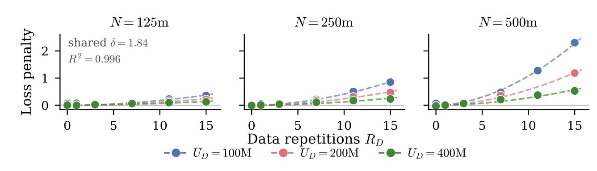

# Blog Deep Dive｜Lilian Weng "Scaling Laws, Carefully" (2026-06-24)

> **原文**：[Scaling Laws, Carefully](https://lilianweng.github.io/posts/2026-06-24-scaling-laws/) · Lil'Log · 25 min read
> **作者**：Lilian Weng（前 OpenAI Safety / Applied Research VP）
> **抓取**：2026-06-26
> **标签**：Foundation Model · Pretraining · Scaling Laws · Learning Dynamics
> **本笔记定位**：第一性原理 + 历史脉络梳理；不照搬原文，重点记录**作者立场、争议点、公式推导关键步**，以及我的反思。

---

## 0. TL;DR

这是一篇**用一篇文章把"scaling law 这个研究范式"完整复述一遍**的综述。Lilian 的标题"Carefully"是关键：scaling law 不是"训大模型的菜谱"，而是**一种把小规模实验外推到大规模的预测方法**——而且这种外推**对程序性细节高度敏感**（rounding、loss 求和方式、参数计数口径），稍有不慎就会得出完全不同的最优配置。

她把 scaling law 研究划分为四个阶段：

1. **Pre-2017**：Amari 1992 等用学习曲线理论推导出 4 类幂律形式（α ∈ {−2, −1, −1/2}）
2. **数据无限期** (Kaplan 2020 → Chinchilla 2022)：**为什么 Kaplan 和 Chinchilla 给出截然不同的 N_opt 推荐？** 看似数学错误，其实是参数计数口径 + 模型规模区间的实证差异
3. **数据有限期** (Muennighoff 2023 → Lovelace 2026)：**真实世界数据会用完**，怎么对"重复 + 容量过剩"建模
4. **拟合方法论** (Besiroglu 2024)：Chinchilla 自己的方法 3 都有 bug——L-BFGS 早停 + Huber loss 平均而非求和导致结论偏移

> **核心论断**：scaling laws ≠ recipe；scaling laws = **一种你必须 carefully 才能用好的预测工具**，因为它本质是在 log-log 空间外推数个量级。

---

## 1. 历史脉络（按时间梳理）

| 年份 | 论文 | 关键贡献 |
|------|-----|---------|
| 1992 | Amari et al. | 用 Bayes + annealed approximation 推出 4 类学习曲线，**所有都是 ε ~ c·D^α + E 的幂律形式** |
| 2017 | Hestness et al. | 跨 4 个领域（NMT / 图像 / LM / 语音）实证：**幂律指数是问题域属性，与架构无关；架构只影响偏移 E** |
| 2020 | Rosenfeld et al. | 把 L(N, D) 建模成 **A/N^α + B/D^β + E** 的联合幂律；用小实验外推大模型 |
| 2020 | Kaplan et al. | 把 scaling laws 正式带入 LM 圈；**N_opt ∝ C^0.73**（错误结论） |
| 2022 | Hoffmann et al. (Chinchilla) | **N_opt ∝ C^0.5**——三种独立方法互相印证；Chinchilla 70B 用 1.4T tokens **outperform** Gopher 280B / 300T tokens |
| 2022 | Hernandez et al. | 数据重复研究：**double-descent**——重复比例越大，loss 反而先升后降 |
| 2023 | Muennighoff et al. | 数据受限时的 scaling laws：**token 价值随重复次数指数衰减**，引入 D' 和 N' |
| 2023 | Michaud et al. | Quantization model：**技能离散块化，频率呈幂律**——解释 power-law 形状 |
| 2024 | Pearce & Song | **嵌入参数计数差异**部分解释了 Kaplan vs Chinchilla 的分歧 |
| 2024 | Besiroglu et al. | 重做 Chinchilla 方法 3：**L-BFGS 早停 + Huber loss 平均口径错** |
| 2026 | Lovelace et al. | 重新建模数据受限 scaling laws：**显式的 over-parameterization × repetition 惩罚项**，weight decay 可以缓解 |

---

## 2. 核心公式族（按理解链梳理）

### 2.1 通用幂律形式（Rosenfeld 联合形式）

$$
\hat{L}(N, D) \approx \frac{A}{N^\alpha} + \frac{B}{D^\beta} + E
$$

- A, B, E, α, β 是 5 个待拟合标量
- E 是 irreducible loss（数据噪声 + 模型能力上限）
- **关键直觉**：N 和 D 各自独占一项幂律，加 E 表示不可约误差——这是后续所有论文的 backbone

### 2.2 Kaplan 形式（**错误结论的源头**）

$$
\hat{L}(N,D) = \left[\left(\frac{a}{N}\right)^{\alpha/\beta} + \frac{b}{D}\right]^\beta
$$

- 含义：过拟合程度由 **N^(α/β) / D** 的比值决定
- 推论：**N_opt ∝ C^0.73**，建议"模型尺寸比数据增长快 5.5× vs 1.8×"
- **Lilian 评注**：实验区间小（768M–1.5B 参数），外推到 100B+ 时偏差巨大

### 2.3 Chinchilla 三种方法（结论 N_opt ∝ C^0.5）

> Lilian 特别强调："三种方法独立操作但结论一致"——这是 Chinchilla 被广泛接受的核心理由。

| 方法 | 操作 | 输出 |
|------|------|------|
| **方法 1** | 固定 N，扫不同 token 预算；记录每个 FLOP 预算下的最小 loss | 训练曲线包络的最小点 |
| **方法 2 (IsoFLOP)** | 固定 C，画 loss vs N 的抛物线；抛物线最低点 = compute-optimal N | log-log 空间一条幂律线 |
| **方法 3 (Parametric Fit)** | 直接拟合 Rosenfeld 联合形式，用 Huber loss + L-BFGS | 闭式 N_opt(C), D_opt(C) |

闭式解（方法 3，关键推导）：

$$
N_\text{opt} = \left(\frac{\alpha A}{\beta B}\right)^{\frac{1}{\alpha + \beta}} \left(\frac{C}{6}\right)^{\frac{\beta}{\alpha+\beta}}
$$

**结论**：当 α ≈ β 时，**模型大小与训练 token 应按相同速率增长**。


> 三种方法 agree（蓝/绿/红线）；Kaplan（紫线）斜率明显偏高 → 高估最优模型尺寸。

### 2.4 Pearce & Song：嵌入参数口径修正

$$
N = N_{\setminus E} + \omega \cdot N_{\setminus E}^{1/3}
$$

- N: 总参数；N_\E: 非嵌入参数；ω 是常数
- 性质：随 N 增大，N/N_\E → 1（嵌入参数占比 → 0）
- **当 C 小时，局部 power-law 指数 g 接近 0.73（Kaplan 体制）；当 C 大时收敛到 0.5（Chinchilla 体制）**


**Lilian 的洞察**：Kaplan 和 Chinchilla **都对**——只是分别拟合了同一曲线的不同区段。

### 2.5 数据受限：Muennighoff 形式

> 把"总 token 数 D"分解为唯一 token U_D 和重复次数 R_D：D = U_D(1 + R_D)

$$
\hat{L}(N, D) = \frac{A}{N'^\alpha} + \frac{B}{D'^\beta} + E
$$

$$
D' = U_D + U_D r_D \left(1 - \exp\left(-\frac{R_D}{r_D}\right)\right)
$$

- D' = "有效 token 数"，指数衰减到一个上限
- r_D = 学到的"半衰期"参数
- 对称地，N' = U_N + U_N r_N(1 - exp(-R_N / r_N)) 处理过参数化


**Lilian 的疑问**："为什么模型尺寸要和重复数据用对称形式建模？我没找到令人满意的解释。" → Lovelace 2026 改了这个假设。

### 2.6 Lovelace 2026：显式 overfitting 惩罚

$$
\hat{L}(N, U_D, R_D) = E + \frac{A}{N^\alpha} + \frac{B}{[U_D(1+R_D)]^\beta} + \color{red}{P \cdot R_D^\delta \cdot \left(\frac{N}{U_D}\right)^\kappa}
$$

- 红色项 = overfitting penalty，**同时随重复次数和容量比 N/U_D 增长**
- P, κ, δ 都是可学习参数
- **关键发现**：strong weight decay 能显著减少 overfitting penalty



---

## 3. 为什么是幂律？（理论层面）

Lilian 列出两条主要假设（坦言还有很多其他理论）：

1. **Sharma & Kaplan 2020 — 数据流形假说**：LM 本质是在一个低维数据流形上做回归。若模型规模 N 能把 d-维流形切成 O(N) 个区域，则典型分辨率 ~ N^(−1/d) → 自然幂律。
2. **Michaud 2023 / Brill 2024 — 量化模型假说**：知识/技能是离散块（"quanta"），其频率分布本身呈幂律。模型先学常见技能再学罕见技能 → loss 平滑幂律衰减。

> **我的笔记**：这两个假说**互不矛盾但出发点完全不同**——一个是几何（流形分辨率），一个是组合（技能频率）。Lilian 没倾向任何一边，留作 open question。

---

## 4. Lilian 强调的"Carefully"——真实拟合的陷阱

### 4.1 三个具体失败模式

1. **Loss precision**：rounding loss 到不同小数位 → 拟合参数明显变化
2. **Loss noise**：仅 0.001 量级的扰动 → 不同的 fit
3. **Fit-region sensitivity**：只拟合小模型 / 中模型 / 全部 → 三种不同的 apparent scaling law

> Lilian 在原文嵌入了一个 ChatGPT 生成的交互式滑块 widget 来演示这三种失败模式。**这一点非常 Lilian 风格**——她的博客一向用可交互可视化作为论证工具。

### 4.2 Besiroglu 2024 的 Chinchilla 复现失败

具体 bug：

- **L-BFGS-B 早停**：Huber loss 按样本平均而非求和 → loss 量级过大 → 求解器提前终止
- **α, β 被四舍五入到 2 位有效数字** → 派生的 A, B 看起来比实际偏移更大
- **后果**：报告的置信区间"窄到不合理"

> **我的笔记**：这条线值得记入"如果未来要在实际项目中拟合 scaling law，第一步必须 audit 优化器和 loss aggregation 口径"。

---

## 5. 我的反思 / Open Questions

1. **"Carefully" 是 Lilian 的核心立场**——她不是在科普 scaling law，而是在**反驳"scaling law 是 cookbook"的轻信**。这种立场对当前 frontier model 开发非常重要：大厂用小规模实验决定 100B+ 训练配置时，rounding 和拟合区间的选择可能价值数百万美元。

2. **Kaplan vs Chinchilla 不是错误 vs 正确**，而是**同一曲线的两段不同切线**。Pearce & Song 2024 的修正应该成为新的 baseline。但我没看到主流社区认真采用这个修正——是否因为大家更看重外推到大模型？

3. **数据受限是真问题**。Lovelace 2026 的 overfitting penalty 公式很美，但 **3 个 hyperparameter (P, κ, δ) 全靠 empirical fit**，没有第一性原理推导。Lilian 说"curious about more theoretical work"。

4. **Weight decay 能缓解 over-parameterization × repetition 的损失**——这一点对工程实践很重要：当数据有限被迫多 epoch 训练时，**WD 是首要的工程旋钮**。

5. **"为什么是幂律"还是开放问题**。流形维度和技能量化是两个相互无关的解释，都不完整。如果有人能给出第一性原理证明（比如从 NTK 或 mean-field theory 推出），将是一个 Bitter-Lesson 级别的理论突破。

6. **博客作为综述方式的优势**：Lilian 的这篇文章引用 15 篇核心论文，但**没有像 survey paper 那样僵硬列表**——而是用一条"问题驱动"的线索（K vs C 为什么矛盾？→ 嵌入口径 → 拟合方法 → 数据受限 → 真实陷阱）穿起来。可作为我未来写综述类内容的模板。

---

## 6. 引用关系图（值得跟进的论文）

| 论文 | arXiv | 为什么读 |
|------|-------|---------|
| Kaplan et al. 2020 | [2001.08361](https://arxiv.org/abs/2001.08361) | 必读原点 |
| Hoffmann et al. 2022 (Chinchilla) | [2203.15556](https://arxiv.org/abs/2203.15556) | 必读修正 |
| Pearce & Song 2024 | [reconciling](https://openreview.net/forum?id=lf32JtgPss) | 解释 K vs C 分歧 |
| Besiroglu et al. 2024 | [2404.10102](https://arxiv.org/abs/2404.10102) | 拟合方法论批判 |
| Muennighoff et al. 2023 | [2305.16264](https://arxiv.org/abs/2305.16264) | 数据受限 |
| Lovelace et al. 2026 | [2605.01640](https://arxiv.org/abs/2605.01640) | 数据受限新模型 |
| Michaud et al. 2023 (Quantization) | [2303.13506](https://arxiv.org/abs/2303.13506) | 为什么是幂律 |
| Hestness et al. 2017 | [1712.00409](https://arxiv.org/abs/1712.00409) | 域属性 vs 架构属性 |
| Hernandez et al. 2022 | [2205.10487](https://arxiv.org/abs/2205.10487) | 重复数据 double descent |

> 建议跟进路径：先 read Pearce & Song（修补 Kaplan/Chinchilla 直觉），再 read Lovelace（最新的 prescriptive scaling）。Besiroglu 的复现攻击作为方法论 audit reference。

---

## 7. 文献库登记

本文引用的 9 篇核心论文需要加入文献库（如果尚未有）：

```bash
uv run python3 scripts/add_paper.py \
  2001.08361 2203.15556 2404.10102 \
  2305.16264 2605.01640 2303.13506 \
  1712.00409 2205.10487
```

（Pearce & Song 2024 是 TMLR 论文非 arXiv，需手工补 bib）

---

## 8. References

- 原文：<https://lilianweng.github.io/posts/2026-06-24-scaling-laws/>
- Lil'Log 主页：<https://lilianweng.github.io/>
- 抓取归档：本仓库 `/tmp/lw-scaling.html`（未入库，下次重抓即可）
- 配图来源：原 blog 的 png（已下载到 `2026-06-26-lilian-weng-scaling-laws/`）
