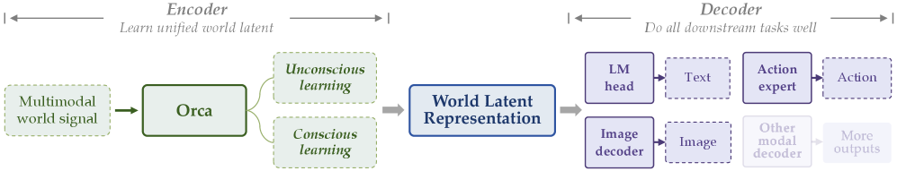
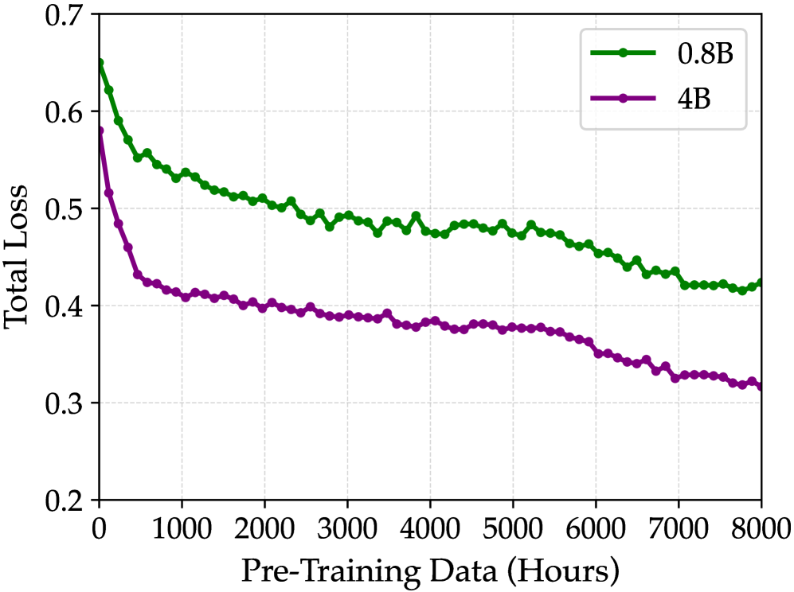
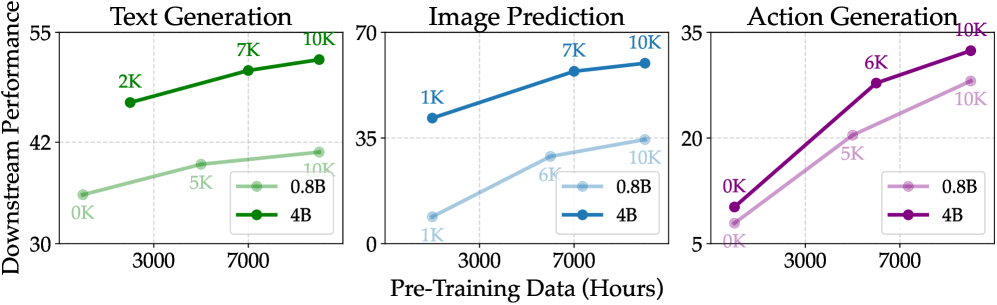
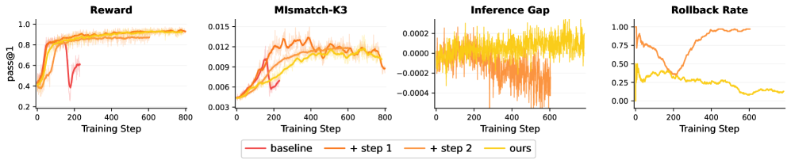

# HF Daily Papers Digest · 06/30–07/08 (2026-W27)

**日期**: 2026-07-08
**Tags**: #hf-daily-papers #weekly-digest #world-models #on-policy-distillation #agentic-rl #train-inference-mismatch #agent-abstention

## Context

本期覆盖 06/30 至 07/08 共 9 天的 HF Daily Papers。

- **新增论文**: 225 篇（去重后）— 06/30(48) / 07/01(38) / 07/02(33) / 07/03(27) / 07/04(0) / 07/05(0) / 07/06(13) / 07/07(40) / 07/08(26)
- **周末空档**: 07/04、07/05（周六周日）HF API 返回空数组，与此前观察到的周末投稿低谷一致
- **去重**: 与上一份 digest [`2026-06-29-hf-daily-papers-jun26-29.md`](2026-06-29-hf-daily-papers-jun26-29.md) 按 arXiv ID 去重，无重叠
- **本期精选**: 25 篇按 HF 社区 upvotes 排名
- **Deep dive (2 篇)**: ① **Orca**（智源 FlagScale 团队，通用世界基础模型，本期热度断层第一 306 票）② **The Mirage of Optimizing Training Policies**（天津大学 × 阿里，揭示 LLM RL 中"训练策略"和"推理策略"目标不一致的问题，156 票）
- **主线**: 本期最强信号是**世界模型进入"统一基础模型"阶段**（Orca 领衔，多篇 world-model/video-generation 论文跟进）；第二强信号是**LLM RL 训练稳定性的系统性反思**（training-inference mismatch、agentic abstention、on-policy distillation 变体集中出现）；agent 类论文（终端使用、GUI、长程记忆）持续保持高产出

---

## 论文总览表（按 upvotes 排序，Top 25）

| # | arXiv | 标题（中译） | upvotes | 主题 |
|---|-------|------|---------|------|
| 1 | [2606.30534](https://arxiv.org/abs/2606.30534) | **Orca**: 通用世界基础模型（Next-State-Prediction） | 306 | World Model 🔥 |
| 2 | [2606.29526](https://arxiv.org/abs/2606.29526) | **MIPU**: 训练策略优化的"幻觉"——推理策略才是真正目标 | 156 | RL 训练稳定性 🔥 |
| 3 | [2606.28733](https://arxiv.org/abs/2606.28733) | **Agentic Abstention**: Agent 是否知道何时该停手 | 146 | Agent 安全/评测 |
| 4 | [2607.02512](https://arxiv.org/abs/2607.02512) | **Program-as-Weights**: 模糊函数的编程新范式 | 116 | LLM 编程范式 |
| 5 | [2606.28436](https://arxiv.org/abs/2606.28436) | **Dockerless**: 无环境依赖的 coding agent 验证器 | 108 | Coding Agent |
| 6 | [2606.30626](https://arxiv.org/abs/2606.30626) | **DOPD**: 双路径 On-Policy 蒸馏 | 103 | On-Policy 蒸馏 |
| 7 | [2606.30616](https://arxiv.org/abs/2606.30616) | **Agents-A1**: 35B MoE agent 靠扩展 horizon 达到万亿参数级性能 | 94 | Agentic 模型 |
| 8 | [2606.26740](https://arxiv.org/abs/2606.26740) | **LiveEdit**: 实时 diffusion 流式视频编辑 | 82 | 视频生成 |
| 9 | [2606.31315](https://arxiv.org/abs/2606.31315) | **BlockPilot**: Diffusion 投机解码的实例自适应策略 | 76 | 推理加速 |
| 10 | [2606.19297](https://arxiv.org/abs/2606.19297) | VLA 模型微调后还记得常识吗？ | 75 | VLA 评测 |
| 11 | [2607.04033](https://arxiv.org/abs/2607.04033) | **OmniOpt**: 现代优化器的分类学、几何与基准测试 | 68 | 训练优化器 |
| 12 | [2607.04425](https://arxiv.org/abs/2607.04425) | **UI-MOPD**: 跨平台 GUI Agent 持续学习的多平台 On-Policy 蒸馏 | 65 | GUI Agent |
| 13 | [2607.02255](https://arxiv.org/abs/2607.02255) | **AgenticSTS**: 长程 LLM Agent 的有界内存测试床 | 60 | Agent 记忆 |
| 14 | [2606.29513](https://arxiv.org/abs/2606.29513) | **场景是物体，不是基元**: 无位姿视角的实例结构化 3D tokenization | 52 | 3D 表示 |
| 15 | [2607.04438](https://arxiv.org/abs/2607.04438) | **ResearchStudio-Reel**: 自动化论文→海报/视频/博客的"最后一公里" | 51 | 科研自动化 |
| 16 | [2607.02501](https://arxiv.org/abs/2607.02501) | **Embodied.cpp**: 异构机器人上的便携式具身 AI 推理运行时 | 50 | 具身 AI 系统 |
| 17 | [2607.05373](https://arxiv.org/abs/2607.05373) | **PixWorld**: 像素空间统一 3D 场景生成与重建 | 49 | 3D 生成 |
| 18 | [2607.06291](https://arxiv.org/abs/2607.06291) | **AlayaWorld**: 长程可玩视频世界生成 | 49 | World Model |
| 19 | [2607.02440](https://arxiv.org/abs/2607.02440) | **EvoPolicyGym**: 评测交互环境中的自主策略演化 | 48 | Agent 评测 |
| 20 | [2502.16886](https://arxiv.org/abs/2502.16886) | **ReFreeKV**: 无阈值 KV Cache 压缩 | 48 | 长上下文 |
| 21 | [2606.28480](https://arxiv.org/abs/2606.28480) | **TUA-Bench**: 通用终端使用 Agent 基准 | 47 | Agent 评测 |
| 22 | [2606.30562](https://arxiv.org/abs/2606.30562) | **Morphing into Hybrid Attention Models**: Transformer→混合注意力的迁移之道 | 46 | 模型架构 |
| 23 | [2606.08671](https://arxiv.org/abs/2606.08671) | **SkillHone**: 基于持久决策历史的 Agent 技能持续演化 harness | 43 | Agent 技能 |
| 24 | [2607.04439](https://arxiv.org/abs/2607.04439) | **ResearchStudio-Idea**: 基于 ML 会议结果的证据驱动研究构思套件 | 43 | 科研自动化 |
| 25 | [2606.28551](https://arxiv.org/abs/2606.28551) | **DataComp-VLM**: 改进版 VLM 开放数据集 | 42 | 数据集/VLM |

剩余精选见「其他值得关注的论文」节。

---

## 主题分组

### 主题 1 · World Model 进入"统一基础模型"阶段（4 篇）

本期最强主线。除 Deep Dive 1 的 **Orca** 外，另有 3 篇 world-model / video-generation 论文分别从不同角度扩展"世界模型"的能力边界：

| 论文 | 关键贡献 |
|------|---------|
| **Orca** [2606.30534](https://arxiv.org/abs/2606.30534) | Next-State-Prediction 统一范式，冻结 backbone 只训练轻量 readout，文本/图像/动作三路读出全面提升 |
| **AlayaWorld** [2607.06291](https://arxiv.org/abs/2607.06291) | 长程可玩视频世界生成，面向游戏世界的低成本可定制生产 |
| **PixWorld** [2607.05373](https://arxiv.org/abs/2607.05373) | 像素空间统一 3D 场景生成与重建，避开 latent 对齐难题 |
| **WorldDirector** [2607.02517](https://arxiv.org/abs/2607.02517) | 持久动态记忆机制，让世界模拟器保持长程一致性和可控性 |

共同信号：world model 研究正从"能不能生成"转向"能不能作为通用基础设施承载下游任务"（文本/图像/动作 readout，或游戏/机器人 policy 评测）。

### 主题 2 · LLM RL 训练稳定性的系统性反思（5 篇）

第二强信号。本期集中出现多篇质疑或修正标准 RLHF/RLVR pipeline 假设的论文：

| 论文 | 核心问题 |
|------|---------|
| **MIPU** [2606.29526](https://arxiv.org/abs/2606.29526)（Deep Dive 2） | 训练策略的"有效更新"未必让部署用的推理策略变好——目标本身错位 |
| **Agentic Abstention** [2606.28733](https://arxiv.org/abs/2606.28733) | Agent 训练目标里缺一个"该停手"的显式信号；更强的模型有时反而更晚放弃 |
| **DOPD** [2606.30626](https://arxiv.org/abs/2606.30626) | On-policy distillation 中"privilege illusion"——师生信息不对称被误认成可迁移能力 |
| **Evolution Fine-Tuning** [2606.29082](https://arxiv.org/abs/2606.29082) | 371 个优化任务上系统研究"如何微调让模型学会发现" |
| **AsyncOPD** [2606.24143](https://arxiv.org/abs/2606.24143) | On-policy distillation 能容忍多大程度的 staleness（异步延迟） |

这些论文的共同动作是：不再满足于"提出一个新 RL trick"，而是回头诊断现有训练目标/评测本身哪里"对不上"部署场景。

### 主题 3 · Agentic 系统 & 长程能力（6 篇）

| 论文 | 关键贡献 |
|------|---------|
| **Agents-A1** [2606.30616](https://arxiv.org/abs/2606.30616) | 35B MoE agent，靠扩展 agent horizon（而非参数量）达到万亿参数级性能 |
| **Dockerless** [2606.28436](https://arxiv.org/abs/2606.28436) | 无需 Docker/执行环境的 coding agent patch 验证器，AUC 超最强开源验证器 14.3 点 |
| **UI-MOPD** [2607.04425](https://arxiv.org/abs/2607.04425) | 跨平台 GUI agent 的多平台 on-policy distillation |
| **AgenticSTS** [2607.02255](https://arxiv.org/abs/2607.02255) | 有界内存下长程 agent 的测试床，探讨"每步决策该看多少上下文"的契约问题 |
| **TUA-Bench** [2606.28480](https://arxiv.org/abs/2606.28480) | 通用终端使用 agent 基准，超越 coding 任务的广义计算机使用能力 |
| **SkillHone** [2606.08671](https://arxiv.org/abs/2606.08671) | 基于持久决策历史的 agent 技能持续演化 harness |

### 主题 4 · LLM 编程范式 & 优化理论（3 篇）

| 论文 | 关键贡献 |
|------|---------|
| **Program-as-Weights** [2607.02512](https://arxiv.org/abs/2607.02512) | 把"模糊函数"（如日志告警、JSON 修复）当作可训练权重编程，而非规则代码或纯 LLM 调用 |
| **OmniOpt** [2607.04033](https://arxiv.org/abs/2607.04033) | 对 100+ 现代优化器做统一分类学、几何分析和基准测试 |
| **Morphing into Hybrid Attention Models** [2606.30562](https://arxiv.org/abs/2606.30562) | 系统研究 Transformer→混合注意力（部分层换线性注意力）迁移的有效性条件 |

### 主题 5 · 视频生成 / 推理加速（3 篇）

| 论文 | 关键贡献 |
|------|---------|
| **LiveEdit** [2606.26740](https://arxiv.org/abs/2606.26740) | 实时 diffusion 流式视频编辑，解决背景稳定性与低延迟的双重约束 |
| **BlockPilot** [2606.31315](https://arxiv.org/abs/2606.31315) | Diffusion 投机解码的实例自适应 draft 策略 |
| **ReFreeKV** [2502.16886](https://arxiv.org/abs/2502.16886) | 无阈值 KV cache 压缩，避开人工设定的压缩比超参 |

### 主题 6 · 具身智能 / VLA 评测（3 篇）

| 论文 | 关键贡献 |
|------|---------|
| VLA 常识评测 [2606.19297](https://arxiv.org/abs/2606.19297) | 系统测量 VLA 模型微调后对常识/世界知识的保留程度 |
| **Embodied.cpp** [2607.02501](https://arxiv.org/abs/2607.02501) | 异构机器人上便携式具身 AI 推理运行时，摆脱 model-specific Python 栈 |
| **场景是物体，不是基元** [2606.29513](https://arxiv.org/abs/2606.29513) | 无位姿视角下的实例结构化 3D tokenization |

### 主题 7 · 科研自动化（2 篇）

| 论文 | 关键贡献 |
|------|---------|
| **ResearchStudio-Reel** [2607.04438](https://arxiv.org/abs/2607.04438) | 自动化论文→海报/演讲视频/博客的"最后一公里"，避免重复从论文抽取信息 |
| **ResearchStudio-Idea** [2607.04439](https://arxiv.org/abs/2607.04439) | 基于 ML 会议结果的证据驱动研究构思套件 |

---

## Deep Dive 1 · Orca: The World is in Your Mind（本期热度断层第一 306 票）

**arXiv**: [2606.30534](https://arxiv.org/abs/2606.30534)

### 为什么值得 Deep Dive

- 本期热度断层第一（306 票，第二名 156 票），且是一篇明确定位为"通用世界基础模型"的系统性工作，而非单点技术改进
- 提出的 **Next-State-Prediction** 范式尝试统一 next-token / next-frame / next-action 三条路线，是本期"world model 统一化"主线信号最集中的代表
- 论文给出了 encoder 冻结 + 轻量 readout 探针实验，直接回答"更强的世界隐空间是否带来更强下游能力"这个方法论问题，而不只是刷榜

### 核心思路

Orca 的核心主张：智能不应只是 next-token（响应指令）、next-frame（生成图像/视频）或 next-action（生成动作）预测模型，而应该是围绕**状态转移建模**（state-transition modeling）统一起来的世界基础模型。

给定世界信号 $\mathcal{X}=\{X^m\}_{m\in\mathcal{M}}$，Orca 学习一个隐空间 $\mathcal{S}=f_\theta(\mathcal{X})$，并建模状态在隐式动力学 $z_t$ 和显式条件 $c_t$ 下的转移：

$$S_{t+\Delta}\sim p_\Theta(S_{t+\Delta}\mid S_t,z_t,c_t),\quad \Delta\in\mathbb{Z}_{\neq 0}$$

两种互补学习范式：
1. **Unconscious learning（无意识学习）**：从连续视频中学习密集、自然的状态转移，无需标注，靠预测下一帧隐空间的自监督完成
2. **Conscious learning（有意识学习）**：在语言描述的事件约束下学习稀疏、有意义的状态转移，同时训练 VQA 常识理解

预训练数据规模：125K 小时视频 + 160M 事件标注 + 11.5M VQA 数据（当前版本仅用了十分之一的视频数据）。预训练后 backbone 冻结，只训练文本（复用 LM head）、图像（MLP adaptor + LoRA on 冻结 SD3.5）、动作（DiT-based Action Expert）三条轻量 readout。

### 关键实验结果

**Q1: 范式是否随模型/数据规模有效扩展？** 答案是肯定的——0.8B 和 4B 两个尺寸下，总 loss 随视频数据量增加持续下降，且未出现快速收敛（下图）：

**Q2: 更强的隐空间是否带来更强下游表现？** 论文对 0.8B / 4B 两个规模在预训练过程中取多个 checkpoint 做探针实验，文本生成（4 个 benchmark 均值）、图像预测（PRICE-V0.1）、动作生成（5 个真实机器人 OOD 任务）三条读出曲线均随预训练数据量单调上升：

**文本生成对比**（MVBench / TemporalBench / 3DSRBench / SWITCH 均值，pass@1）：

| 模型 | 参数量 (B) | Avg. |
|------|-----------|------|
| Emu3 (world model) | 8 | 30.4 |
| Emu3.5 (world model) | 34 | 29.8 |
| Qwen3.5 (VLM, tiny) | 0.8 | 33.1 |
| MiniCPM-V-4.6 (VLM, tiny) | 2 | 37.9 |
| Qwen3.5 (VLM, small) | 4 | 46.7 |
| **Orca** | **4** | **51.8** |

Orca-4B 以相同参数规模超过 Qwen3.5-4B 5.1 分，也远超参数量大 2-8 倍的 world model 基线（Emu3/Emu3.5）。论文特别指出一个"意外"发现：**动作生成预训练阶段没有用任何带动作标签的数据**，但仍在动作 readout 上取得增益——纯视频数据学到的世界隐空间似乎能部分迁移到机器人动作生成，这对缓解机器人数据稀缺问题有潜在意义。

### 我的看法

Orca 最有价值的部分不是它的绝对性能（4B 模型不算大，基线选择也偏保守），而是它把"世界模型是否真的学到了可迁移的通用表征"这个问题设计成了一个**可检验的探针实验**——冻结 backbone、只训练轻量 readout，逼着模型证明隐空间本身的质量,而不是靠下游任务的大量微调掩盖表征缺陷。这个实验设计思路本身比 Orca 具体架构更值得借鉴。

但也要注意论文自己承认的局限：当前版本只用了十分之一的视频数据，动作 readout 只在 200 条轨迹的 5 个任务上验证，泛化性的证据链条还比较薄。"世界模型统一基础设施"这个愿景很有吸引力，但从"探针实验证明有效"到"真正可作为下游 policy 训练基座"之间，还有相当大的工程和数据规模差距——这与本期主题 1 中 AlayaWorld / PixWorld / WorldDirector 等论文所处的阶段类似：大家都在往"统一基础设施"方向走，但还没有一篇给出决定性的规模化证据。

---

## Deep Dive 2 · The Mirage of Optimizing Training Policies（天津大学 × 阿里，156 票）

**arXiv**: [2606.29526](https://arxiv.org/abs/2606.29526) · **Project Page**: [anitaleungxx.github.io/MIPU](https://anitaleungxx.github.io/MIPU/)

### 为什么值得 Deep Dive

- 直接命中本期主题 2「LLM RL 训练稳定性反思」的核心：论文指出一个此前被普遍忽视的**目标错位（objective misalignment）**问题——现有工作都在优化"训练策略"，但真正部署和 rollout 用的是"推理策略"，两者未必同向改善
- 不是又一个"缓解 training-inference mismatch"的工程补丁，而是从**目标函数层面**重新定义了 LLM RL 应该优化什么，理论贡献清晰（严格的单调改进分解）
- FP8 量化 rollout 这个"高错位"实验设置很有代表性——量化推理是当前工业界降本的标准做法，论文选在这个设置下验证方法有很强的现实意义

### 核心问题：训练策略 ≠ 推理策略

现代 LLM RL pipeline 把 rollout 生成（推理引擎，如 vLLM/SGLang）和梯度计算（训练引擎，如 FSDP/Megatron）分离。即使参数同步，精度、解码实现、serving backend 的差异也会导致训练策略 $\pi$ 和推理策略 $\mu$（实际部署使用的策略）对同一条轨迹给出不同概率——这就是 **training-inference mismatch**。

已有工作（矫正采样比率、过滤不稳定样本、学习率衰减等）都试图在训练侧稳定 $\pi$ 的优化过程。但论文指出一个被忽视的问题：**训练策略的有效更新不必然意味着推理策略的改善**。换句话说，大家一直在优化错误的那个目标。

论文提出新原则 **MIPI**（Monotonic Inference Policy Improvement）：应该保证的是推理策略 $\mu$ 的单调改进 $J(\mu_{k+1})-J(\mu_k)\geq 0$，而不是训练策略 $\pi$ 的改进。将这个目标分解为三项，通过两步实现：

- **Step 1**（sampler-referenced 候选更新）：训练引擎生成候选模型，理论上保证"半程"单调性 $J(\pi_{k+1})-J(\mu_k)\geq 0$
- **Step 2**（inference-gap-aware 接受判据）：用推理侧的 gap proxy 评估同步后的候选，保证剩余"半程"单调性 $J(\mu_{k+1})-J(\pi_{k+1})\geq 0$

两步共同覆盖 MIPI 分解的全部三项，构成完整的 **MIPU**（Monotonic Inference Policy Update）框架。

### 关键实验结果

实验设置：Qwen3-4B 和 Qwen3-1.7B，在 **FP8 量化 rollout**（inference-side 量化放大 training-inference 差异的高错位场景）下训练，5 个数学推理 benchmark（MATH-500 / AIME24 / AMC23 / Minerva / OlympiadBench）评估 pass@1。

| 模型 | 方法 | Avg. pass@1 | 训练稳定性 |
|------|------|-------------|-----------|
| Qwen3-4B | Baseline / MIS / LR-decay | 中等（有中间峰值） | ❌ 后期崩溃或急剧退化 |
| Qwen3-4B | **MIPU** | **66.71%** | ✅ 稳定至训练结束 |
| Qwen3-1.7B | Baseline 及变体 | 中等 | ❌ 不稳定 |
| Qwen3-1.7B | **MIPU** | **53.97%** | ✅ 稳定至训练结束 |

论文特别强调：部分 baseline 能达到有竞争力的**中间**性能，但这个峰值不能持续——训练更久之后会因错位误差累积而崩溃。这正是"只看单点评测分数会误导"的具体案例，MIPU 的价值主要体现在**长程训练稳定性**而非峰值分数本身。

Ablation 进一步拆解两步的角色：Step 1 单独用时能改善候选质量，但仍会接受每个同步后的候选，错位波动仍会累积；Step 2 单独用时能靠拒绝候选防止崩溃，但无法提升候选本身质量（当 baseline 很少产出有用候选时，Step 2 只是不断保留旧策略而无法带来真正提升）。两步组合才是完整方案。

### 我的看法

这篇论文的洞察本质上很简单但很有说服力：**你训练时优化的对象，和你部署时实际使用的对象，可能根本不是同一个策略**。这不是一个新的算法 trick 能修补的问题，而是需要在目标函数层面重新审视——这也是为什么论文标题用"mirage"（幻觉）这个词：大家以为自己在优化推理性能，实际上只是在优化一个训练侧的代理目标，二者的关系从未被保证。

与本期主题 2 的另外几篇论文（DOPD 的 privilege illusion、Agentic Abstention 的停手信号缺失）放在一起看,能看到一个共同的方法论转向：**LLM RL 领域正在从"设计更好的更新规则"转向"审查训练目标本身是否对齐真实部署场景"**。这比单纯堆更多的 RL trick 更根本，也更难——因为它要求重新定义"什么是好的更新"，而不是在已有定义下调参数。

一个值得关注的局限：论文的验证场景局限在 FP8 量化 rollout 这一种（虽然是有代表性的）高错位设置，且只在数学推理任务上验证。training-inference mismatch 在 agentic RL（多轮工具调用、长程 rollout）中可能表现更复杂，MIPI 原则是否能直接迁移到这些场景，是一个开放问题。

---

## 其他值得关注的论文

Top 25 之外，本期还有一批值得留意的方向性信号（按 upvotes 排序，一句话概括）：

- **Beyond IID** [2606.30410](https://arxiv.org/abs/2606.30410) — 追问表格基础模型在真正非 IID 场景下的泛化能力有多强
- **Trimming the Long-Tail** [2606.24256](https://arxiv.org/abs/2606.24256) — 反思视觉世界建模评测中的长尾问题
- **PerceptionRubrics** [2606.28322](https://arxiv.org/abs/2606.28322) — 把多模态评测校准到人类感知标准
- **Evolution Fine-Tuning** [2606.29082](https://arxiv.org/abs/2606.29082) — 371 个优化任务上系统研究"学会发现"的微调范式
- **Multi-Block Diffusion Language Models** [2606.29215](https://arxiv.org/abs/2606.29215) — 扩散语言模型的分块建模改进
- **AgenticDataBench** [2607.01647](https://arxiv.org/abs/2607.01647) — 面向数据 agent 的综合基准
- **GigaWorld-1** [2607.02642](https://arxiv.org/abs/2607.02642) — 构建面向机器人策略评测的世界模型路线图
- **AsyncOPD** [2606.24143](https://arxiv.org/abs/2606.24143) — On-policy distillation 能容忍多大的过期程度（呼应主题 2）
- **MemSyco-Bench** [2607.01071](https://arxiv.org/abs/2607.01071) — 评测 agent 记忆中的"迎合"（sycophancy）问题
- **Seed2.0 Model Card** [2607.00248](https://arxiv.org/abs/2607.00248) — 字节 Seed2.0 模型技术报告
- **DataEvolver** [2606.31537](https://arxiv.org/abs/2606.31537) — 自演化多智能体数据构建，用于富文本图像生成
- **Managing Procedural Memory in LLM Agents** [2606.23127](https://arxiv.org/abs/2606.23127) — 系统研究 agent 程序性记忆的控制、适配与评测
- **One-Step Gradient Delay** [2606.30634](https://arxiv.org/abs/2606.30634) — 大规模异步流水线并行预训练中梯度延迟不是障碍
- **ASPIRE** [2607.00272](https://arxiv.org/abs/2607.00272) — 机器人的 Agentic 技能发现

---

## 趋势分析

### Trend 1 · World Model 从"能生成"转向"能否成为通用基础设施"

Orca、AlayaWorld、PixWorld、WorldDirector、GigaWorld-1 五篇论文同时出现在一周窗口内，共同关注点已经不是"生成质量够不够好"，而是"这个隐空间/模拟器能不能承载下游任务"——文本/图像/动作三路读出（Orca）、机器人策略评测（GigaWorld-1）、长程可玩游戏世界（AlayaWorld）。这是一个从单点技术突破到基础设施化的明显阶段性转变。

### Trend 2 · LLM RL 领域开始"审查目标函数本身"而非只调 trick

MIPU 揭示训练策略与推理策略的目标错位，DOPD 揭示 on-policy distillation 中的 privilege illusion，Agentic Abstention 揭示"停手"这个决策维度长期被现有训练目标忽略。三篇论文的共同方法论姿态是：**不是加一个新的 loss 项或采样技巧,而是重新审视"我们究竟在优化什么"**。这比过去几周常见的"稳定性补丁"论文更根本。

### Trend 3 · Agent 评测持续细化到"何时不该行动"

Agentic Abstention（何时该停手）、AgenticSTS（有界内存下该看多少上下文）、TUA-Bench（通用终端使用边界）、EvoPolicyGym（策略演化怎么评测才不与"最终分数"混淆）——本期 agent 评测论文明显比"agent 能做什么"更关注"agent 的决策边界在哪里"，这是评测成熟度提升的信号。

### Trend 4 · On-Policy Distillation 家族持续分裂细化

继上期 DanceOPD、OPID 之后，本期又新增 DOPD（双路径路由）、UI-MOPD（跨平台）、AsyncOPD（异步容忍度）三个变体，说明 OPD 已经从"一个新范式"演变为一整个需要系统研究失效模式（privilege illusion、staleness、跨平台迁移）的子领域。

---

## Open Questions

1. **World model 的"统一基础设施"路线，需要多大规模的数据/模型才能真正取代 task-specific 模型？** Orca 承认只用了十分之一视频数据、动作 readout 仅验证 200 条轨迹——这个探针实验证明了范式有效，但离"可直接拿来训练机器人 policy"还有多远的规模化距离？
2. **MIPI 原则能否推广到 agentic RL（多轮工具调用、长程 rollout）？** 论文只在单轮数学推理任务上验证；training-inference mismatch 在长程 agent rollout 中可能因误差累积效应而表现出完全不同的动态。
3. **Agentic Abstention 的"该停手"信号，能否被建模为一个可训练的奖励项，而不只是 context engineering（如 convolve）的事后补救？** 目前论文的解法（distill 交互轨迹为 stopping rule）本质上仍是后处理,尚未看到把"及时止损"直接整合进 RL 训练目标的工作。
4. **On-Policy Distillation 家族（DOPD/UI-MOPD/AsyncOPD/DanceOPD/OPID）之间的失效模式（privilege illusion、staleness、跨平台迁移）是否存在统一的理论框架，还是各自独立的经验修补？**

---

## References

### 本期覆盖论文（Top 25 + 其他值得关注，共 40 篇，按 arXiv ID）

2502.16886, 2606.08671, 2606.19297, 2606.23127, 2606.24143, 2606.24256, 2606.26740, 2606.28322, 2606.28436, 2606.28480, 2606.28551, 2606.28733, 2606.29082, 2606.29215, 2606.29513, 2606.29526, 2606.30410, 2606.30534, 2606.30562, 2606.30616, 2606.30626, 2606.30634, 2606.31315, 2606.31537, 2607.00248, 2607.00272, 2607.01071, 2607.01647, 2607.02255, 2607.02440, 2607.02501, 2607.02512, 2607.02517, 2607.02642, 2607.04033, 2607.04425, 2607.04438, 2607.04439, 2607.05373, 2607.06291

### 上一份 digest（去重对照）

[`2026-06-29-hf-daily-papers-jun26-29.md`](2026-06-29-hf-daily-papers-jun26-29.md) — 覆盖 06/26–06/29（36 篇）

### 数据获取记录

- HF API: `https://huggingface.co/api/daily_papers?date=YYYY-MM-DD&limit=100&sort=publishedAt`，逐日调用 06/30–07/08
- 07/04、07/05（周六周日）API 返回空数组，与历史周末投稿低谷一致
- Deep dive 全文来源: `https://huggingface.co/papers/{ID}.md`（均 200 成功）
- 图片来源: `https://arxiv.org/html/{ID}v1/x{N}.png`（Orca 3 张 + MIPU 2 张，共 5 张，均下载成功）
