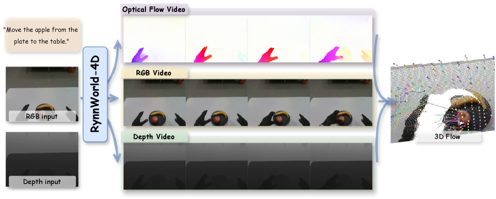
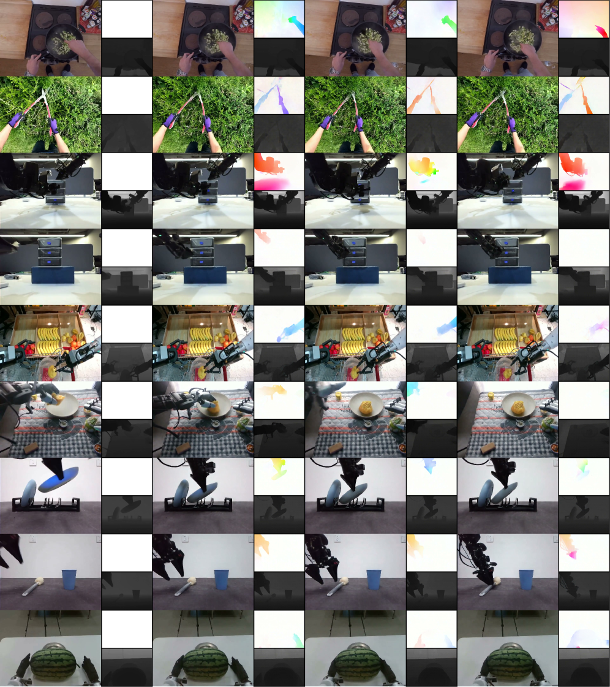
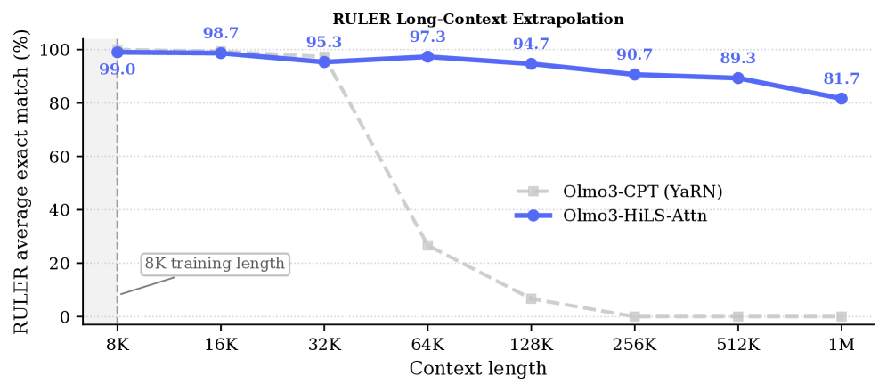

# HF Daily Papers Digest · 07/09 (2026-W28 补充)

**日期**: 2026-07-09
**Tags**: #hf-daily-papers #weekly-digest #world-models #embodied-ai #long-context #gemma4 #on-policy-distillation

## Context

本期覆盖窗口较特殊：上一份 digest（`2026-07-08-hf-daily-papers-jun30-jul8.md`）截止时 07/08 当日 HF API 仅返回 26 篇，但 HF Daily Papers 存在**滞后补录**现象——同一日期桶会随时间持续新增。本次重新拉取 07/08 桶（`date=2026-07-08`）发现已增长到 41 篇；07/09 当日桶截至抓取时刻（2026-07-09 01:53 UTC，约当日凌晨）仍为空（正常，当天投稿尚未开始）。

- **新增论文**: 40 篇（对照上一份 digest 引用的 arXiv ID 去重后的净新增）
- **去重方法**: 抓取 `date=2026-07-08` 全量 41 篇，与上一份 digest References 中的 40 个 arXiv ID 逐一比对，剔除 1 篇重叠（`2607.06291` AlayaWorld），保留 40 篇新增
- **本期精选**: 25 篇按 HF 社区 upvotes 排名
- **Deep dive (2 篇)**: ① **RynnWorld-4D**（阿里达摩院 + 港中文，4D 具身世界模型，本期热度榜首 72 票）② **Gemma 4 Technical Report**（Google，新一代开放权重多模态模型，31 票，技术报告体量最大）
- **主线**: 本期最强信号是**具身世界模型向"4D 表征"演进**（RynnWorld-4D 显式生成 RGB+Depth+Flow，RynnWorld-Teleop 用生成式世界模型替代物理遥操作，两篇出自同一团队、互补呼应）；第二强信号是**长上下文稀疏注意力的"训练时可学习检索"** 路线（HiLS-Attention）；第三是**开放权重多模态基座模型**的持续迭代（Gemma 4）

> **方法学说明**: 本期与常规"逐日窗口"不同，是针对同一天 API 桶的"补充抓取"窗口，反映的是 HF Daily Papers 数据源本身的滞后特性，非严格意义上的新一天投稿。后续 digest 仍会按日期推进正常窗口。

---

## 论文总览表（按 upvotes 排序，Top 25）

| # | arXiv | 标题（中译） | upvotes | 主题 |
|---|-------|------|---------|------|
| 1 | [2607.06559](https://arxiv.org/abs/2607.06559) | **RynnWorld-4D**: 面向机器人操作的 4D 具身世界模型 | 72 | World Model / 具身 🔥 |
| 2 | [2607.06558](https://arxiv.org/abs/2607.06558) | **RynnWorld-Teleop**: 数字遥操作的动作条件世界模型 | 67 | World Model / 数据引擎 🔥 |
| 3 | [2607.02980](https://arxiv.org/abs/2607.02980) | **HiLS-Attention**: 端到端可学习的层级稀疏注意力，迈向无限上下文 | 38 | 长上下文 / 注意力 🔥 |
| 4 | [2607.06560](https://arxiv.org/abs/2607.06560) | **Vision as Unified Multimodal Generation**: 视觉作为统一多模态生成的媒介 | 31 | 多模态生成 |
| 5 | [2607.02770](https://arxiv.org/abs/2607.02770) | **Gemma 4** 技术报告 | 31 | 开放基座模型 🔥 |
| 6 | [2607.05147](https://arxiv.org/abs/2607.05147) | **DSpark**: 置信度调度的半自回归推测解码 | 20 | 推理加速 |
| 7 | [2607.05511](https://arxiv.org/abs/2607.05511) | **Light-Omni**: 长程记忆下 agentic 视频理解的"反射优于推理" | 19 | 视频 Agent |
| 8 | [2607.03451](https://arxiv.org/abs/2607.03451) | **SkillOpt-Lite**: 一行 vibe 实现更好更快的 Agent 自演化 | 17 | Agent 自演化 |
| 9 | [2607.02963](https://arxiv.org/abs/2607.02963) | 全模态密集视频字幕的并行自回归解码 | 16 | 视频理解 |
| 10 | [2607.04412](https://arxiv.org/abs/2607.04412) | **LLM-as-a-Tutor**: 非可验证 RL 的策略感知提示适配 | 15 | RL 训练 |
| 11 | [2607.06403](https://arxiv.org/abs/2607.06403) | **从基座到应用**: 实践中改进 VLA 模型 | 11 | VLA |
| 12 | [2607.05804](https://arxiv.org/abs/2607.05804) | **TurnOPD**: 面向长程 Agent 训练的轮次感知 On-Policy 蒸馏 | 10 | On-Policy 蒸馏 |
| 13 | [2607.03530](https://arxiv.org/abs/2607.03530) | **MentalThink**: 在"心理 SVG 世界"中塑造思维 | 10 | 推理表征 |
| 14 | [2607.05465](https://arxiv.org/abs/2607.05465) | **CanvasAgent**: 通过视觉工具编排实现复杂图像创作与编辑 | 9 | 图像 Agent |
| 15 | [2607.03509](https://arxiv.org/abs/2607.03509) | **Flex-Forcing**: 统一自回归与双向视频扩散模型 | 9 | 视频生成 |
| 16 | [2607.05722](https://arxiv.org/abs/2607.05722) | **Nemotron-Labs-Diffusion**: 统一自回归/扩散/自投机解码的三模态语言模型 | 7 | 解码范式 |
| 17 | [2607.05339](https://arxiv.org/abs/2607.05339) | **TREK**: 蒸馏以探索，强化以精炼 | 7 | Agentic RL |
| 18 | [2607.03819](https://arxiv.org/abs/2607.03819) | **CGGS**: 一致性增强的第一人称 3D 场景几何高斯溅射生成 | 7 | 3D 生成 |
| 19 | [2607.02515](https://arxiv.org/abs/2607.02515) | **PointDiT**: 像素空间扩散的单目几何估计 | 7 | 几何估计 |
| 20 | [2607.05803](https://arxiv.org/abs/2607.05803) | 量化并扩展后期交互检索模型的理论容量 | 6 | 检索理论 |
| 21 | [2607.05992](https://arxiv.org/abs/2607.05992) | **PluraMath**: 将数学推理评测扩展到高资源语言之外 | 5 | 评测 / 多语言 |
| 22 | [2607.01897](https://arxiv.org/abs/2607.01897) | **Rank-Then-Act**: 基于帧序进度的无奖励控制 | 5 | 具身控制 |
| 23 | [2607.03738](https://arxiv.org/abs/2607.03738) | 逐 Token 关注多模态生成 | 4 | 多模态生成 |
| 24 | [2607.00394](https://arxiv.org/abs/2607.00394) | 经典缓存策略失效时：语义检索缓冲区的学习增强替换 | 4 | 系统 / 缓存 |
| 25 | [2606.31329](https://arxiv.org/abs/2606.31329) | **3D HAMSTER**: 用 3D 轨迹引导连接分层 VLA 的规划与控制 | 4 | VLA |

剩余 15 篇（SWE-Review / HunyuanOCR-1.5 / Is One Layer Enough / MuseBench / SIEVE / BPE-SMILES / SceneFrom3D / Layer-wise Depression Detection / JD Oxygen AIIC / Bibby AI / RuleChef / Cross-Space Distillation / Image2Sim / SiamJEPA / VIBE）见「其他值得关注」节。

---

## 主题分组

### 主题 1 · 4D/世界模型与具身数据引擎（本期最强信号 · 2 篇 + 关联）

RynnWorld-4D 与 RynnWorld-Teleop 出自同一团队（阿里达摩院 + 港中文具身智能实验室），互为"表征"与"数据"的两个面：前者定义了显式 4D（RGB+Depth+Flow）世界表征，后者用生成式世界模型替代物理遥操作来规模化产出训练数据。两篇一起读构成了当前"世界模型驱动具身智能"路线最完整的技术拼图。

| 论文 | 核心贡献 | 关键数字 |
|------|----------|----------|
| RynnWorld-4D | 三分支扩散架构同步生成 RGB/Depth/Optical-Flow，用作 inverse-dynamics 策略头的输入 | 几何 δ₁=0.610（4DNeX 0.327 的近 2 倍），控制频率 ~9Hz |
| RynnWorld-Teleop | 用手部姿态流驱动生成式世界模型合成第一人称视频，替代真实机器人遥操作 | 单卡 H100 40+ FPS 实时生成，zero-shot Sim2Real 迁移 |
| 3D HAMSTER (#25) | 用 3D 轨迹引导连接分层 VLA 的规划层与控制层 | — |
| Rank-Then-Act (#22) | 基于帧序进度信号的无奖励控制 | — |

### 主题 2 · 长上下文稀疏注意力：从"启发式选择"到"端到端可学习检索"

HiLS-Attention（Tencent HY Team）挑战了 chunk-wise 稀疏注意力的固有假设——多数方法用不可导的 top-K chunk 选择，导致选择质量无法被语言建模损失直接优化。HiLS 把 chunk 检索分数纳入前向注意力计算本身，使其可以随 LM loss 端到端训练。345M 规模模型仅用 8K 训练长度即可外推到 4M（512× 外推），在 needle-in-haystack 上保持 90%+ 准确率；7B 规模仅需 50B tokens 继续训练即可将全注意力模型转换为 HiLS，且在 LongBench 上超越全注意力基线。

这与近期反复出现的"稀疏注意力效率-性能权衡"主题一脉相承，但 HiLS 的定位更激进：不是逼近全注意力，而是声称在长上下文场景**超越**全注意力，同时保持推理效率优势。

### 主题 3 · 开放权重多模态基座模型迭代（Gemma 4）

Gemma 4 覆盖 2.3B–31B 参数（含 MoE 26B-A4B 变体），核心创新集中在三处：thinking mode（推理链）、encoder-free 统一架构（12B 模型直接摄入原始音频/图像 patch，无需独立编码器）、长上下文效率（5:1 局部/全局注意力比 + p-RoPE + KV cache 共享，减少 37.5% 全局 KV cache 占用）。31B dense 模型在 Arena Text 榜单上是开放 dense 模型第一。

### 主题 4 · On-Policy 蒸馏与 Agent 自演化的持续深耕

延续上期主线，本期仍有 3 篇聚焦训练范式打磨：TurnOPD（轮次感知的长程 agent on-policy 蒸馏）、SkillOpt-Lite（"一行 vibe" 实现的轻量 agent 自演化）、TREK（蒸馏探索 + 强化精炼的两阶段范式）。这类论文的持续高产表明 on-policy 蒸馏已从"新技巧"变成 agentic RL 训练流程的标准组件，工作重心转向针对不同场景（轮次、长程、GUI）的适配变体。

### 主题 5 · 视觉/视频生成的统一化尝试

三篇分别从不同角度推进"统一多模态生成"：Vision as Unified Multimodal Generation（把视觉当作统一生成媒介本身）、Flex-Forcing（统一自回归与双向视频扩散）、Nemotron-Labs-Diffusion（三模态解码：自回归+扩散+自投机）。这类工作的共同诉求是打破"文本用自回归、图像/视频用扩散"的架构割裂，代价是训练与推理复杂度显著上升。

### 主题 6 · Agent 系统的可靠性打磨（视频理解、编辑、代码审查）

Light-Omni 提出"反射优于推理"的 agentic 视频理解范式（在长程记忆场景下，快速反射式响应比深度推理更高效）；CanvasAgent 用视觉工具编排做复杂图像编辑；SWE-Review 把一次性 PR 生成改造成闭环审查流程。三者共同指向一个趋势：Agent 系统设计正从"单次生成"转向"生成+校验/审查的闭环"。

---

## 深入分析

### Deep Dive 1: RynnWorld-4D — 用"RGB+深度+光流"重新定义具身世界模型的表征

**论文**: [RynnWorld-4D: 4D Embodied World Models for Robotic Manipulation](https://arxiv.org/abs/2607.06559)（阿里达摩院 / 港中文具身智能实验室 / Hupan Lab，72 票榜首）

#### 问题：2D 像素视频世界模型的结构性缺陷

现有的视频扩散世界模型（Wan、CogVideoX 等）只在 2D 像素空间预测未来帧，这种表征丢失了关键的三维空间关系——无法支撑精确的 6-DoF 姿态估计和深度感知交互，也常常出现物体尺度漂移、形状"变形"等违反物理直觉的时序不一致问题。另一条路线是基于 NeRF/3DGS 的显式 4D 场景建模，但这类方法要么计算代价高、场景特定（优化式），要么局限于物体中心生成（前馈式），难以扩展到复杂场景级的开放世界操作任务。

#### 方法：三分支扩散架构同步生成 RGB-DF

RynnWorld-4D 提出用**同步的 RGB、深度、光流三元组（RGB-DF）**作为轻量级投影式 4D 表征：深度把每个像素提升到三维位置，深度配合光流可以反投影出三维场景流，提供逐点三维运动线索。相比纯 RGB 序列，这种表征让几何和运动变得显式；相比显式三维体或 4D 高斯，它仍停留在 2D 对齐格式，因此能继承大规模视频扩散预训练的可扩展性和生成先验。

架构上，RynnWorld-4D 把预训练的 Wan 视频扩散模型扩展为三分支 transformer：每个分支独立处理一种模态，但共享跨模态注意力的 key/value，并通过 Joint Cross-Modal Attention 模块（配合逐帧 3D RoPE）强制三模态在时空上保持一致。为解决大规模 4D 标注数据的缺失，团队构建了 **Rynn4DDataset 1.0**——超过 2.544 亿帧，融合人类第一人称操作视频（Epic-Kitchens、EgoVid）与机器人操作数据集（RoboMIND、RDT-1B、Galaxea、RoboCoin、AgiBot），并用 Qwen3-VL 生成字幕、单目深度模型和稠密光流模型产出高质量伪标注。

在此基础上，团队进一步提出 **RynnWorld-4D-Policy**：一个逆动力学头，直接消费 RynnWorld-4D 预测过程中的内部 4D 表征（单次前向传播，绕过昂贵的多步去噪），实现高频闭环机器人控制。

#### 结果：几何精度接近翻倍，dexterous 双臂任务全面领先

在 4D 世界建模质量上，RynnWorld-4D 的几何准确度 δ₁ 达到 **0.610**，几乎是 4DNeX（0.327）和 TesserAct（0.279）的两倍；光流 AEPE 低至 **0.170**，且是少数能提供同步显式光流预测的 4D 世界模型（多数基线根本不具备该能力）。

在真实世界双臂灵巧操作任务上（TIANJI M6 机械臂 + WUJI 20-DOF 灵巧手，54 自由度平台），RynnWorld-4D-Policy 全面超越 Diffusion Policy 与 π₀/π₀.₅ 等基础模型基线：在需要高空间精度的 Lid Placement 和 Bowl Stacking 任务上达到 65.71% 成功率，比次优基线（DP）高 8.57 个百分点；在涉及动态物体转移、对基础模型格外困难的 Hand-over 任务上优势更明显——论文指出这是因为多数基础模型的预训练数据偏向平行夹爪、缺乏灵巧手协调先验，且 2D 策略难以推理两个高自由度末端执行器之间的相对三维距离与自遮挡。

消融实验证明了每个设计选择的必要性：去掉 RynnWorld-4D 的预测性内部表征、换成标准 ResNet-18 图像编码器后，Dual Picking 任务成功率从 94.29% 骤降到 71.43%；去掉 Joint Cross-Modal Attention 中的 3D RoPE，δ₁ 从 0.610 跌到 0.450、AEPE 从 0.170 升到 0.210，证明 3D RoPE 是跨模态几何对齐的关键桥梁。

#### 我的看法

这篇论文最有意思的地方不是"4D 表征比 2D 更好"这个直觉（这早已是业界共识），而是它给出了一个**具体、可复现、且直接服务于下游策略学习的工程方案**：RGB-DF 的选择本质上是在"表达力"和"可扩展性"之间找到了一个巧妙的折中点——既显式编码了几何和运动信息，又没有脱离 2D 对齐格式因而能继续吃视频扩散预训练的生成先验红利。这种"戴着 2D 的壳做 4D 的事"的设计思路，可能会成为未来具身世界模型的一种范式模板。

与同期发布的 RynnWorld-Teleop 对照阅读会更有启发：前者解决"如何表征世界"，后者解决"如何规模化产出训练数据"——用生成式世界模型替代真实机器人遥操作，把数据采集从物理硬件约束中解耦出来。两篇论文合起来传递的信号是：具身智能的下一个瓶颈可能不再是"要不要用世界模型"，而是"用什么表征、配合什么数据引擎"这两个更细粒度的工程问题。值得关注的风险点是伪标注质量对下游的影响——2.544 亿帧的深度和光流全部来自伪标注模型，标注误差是否会在训练中被系统性放大，论文未做专门分析。

---

### Deep Dive 2: Gemma 4 Technical Report — 开放权重多模态模型的"效率优先"迭代

**论文**: [Gemma 4 Technical Report](https://arxiv.org/abs/2607.02770)（Google，31 票）

#### 定位：不追求最大规模，而是效率与推理能力的平衡

Gemma 4 延续 Gemma 系列"开放权重、可在边缘设备部署"的定位，模型规模覆盖 2.3B 到 31B 参数（dense 架构 2.3B/4.5B/12B/31B + 一个 MoE 变体 26B-A4B，即 26B 总参数、3.8B 激活参数）。相比追求参数规模的竞争路线，Gemma 4 的核心叙事是**计算效率与推理能力的同步提升**，这与 Gemma 3 时代的定位一致，但引入了几项实质性的架构与训练创新。

#### 三项关键设计

**Thinking mode（推理链）**：Gemma 4 引入生成推理轨迹后再输出答案的机制，在数学、编程等推理密集领域带来显著提升——AIME 2026（无工具）31B 模型达到 89.2 分，远超 Gemma 3 27B 的 20.8 分。

**长上下文效率优化**：长上下文场景下 KV cache 的显存爆炸是核心瓶颈。Gemma 4 保持 5:1 的局部滑动窗口/全局自注意力比（2.3B 模型为 4:1），采用 p-RoPE 位置编码，并结合 KV cache 共享与全局层"复用 key 作为 value"的技巧，将全局 KV cache 显存占用降低最多 37.5%。

**Encoder-free 统一架构（仅 12B 模型）**：Gemma 4 的 12B 版本采用统一的无编码器架构，直接将 40ms 音频片段和图像 patch 投影到 LLM 的嵌入空间，省去了独立的视觉/音频编码器，减少了显存碎片化。其余模型规模仍保留冻结的视觉（150M/550M ViT）和音频编码器。

此外，Gemma 4 还发布了面向 llama.cpp 等推理引擎优化的量化版本（mobile 量化的 int2/int4 混合精度 + Q4_0 blockwise 量化），并引入自回归多 token 预测（MTP）drafter head 用于推测解码加速。

#### 基准表现：31B dense 模型是开放模型 Arena 榜首

| 基准 | Gemma 4 31B | Gemma 4 26B-A4B (MoE) | Gemma 4 12B | Gemma 3 27B |
|------|------------|------------------------|-------------|-------------|
| MMLU Pro | 85.2 | 82.6 | 77.2 | 67.6 |
| AIME 2026 (无工具) | 89.2 | 88.3 | 77.5 | 20.8 |
| LiveCodeBench v6 | 80.0 | 77.1 | 72.0 | 29.1 |
| GPQA Diamond | 84.3 | 82.3 | 78.8 | 42.4 |
| Codeforces Elo | 2150 | 1718 | 1659 | 110 |
| MRCR v2 (128k, 8-needle) | 66.4 | 44.1 | 43.4 | 13.5 |

在 Arena Text 人类盲评排行榜（截至 2026 年 6 月 19 日）上，Gemma 4 31B 是开放 dense 模型第一名，26B-A4B（MoE）Elo 分数达到 1438，与 Qwen 3.5 397B-A17B（1444）、Kimi K2.5 Thinking（1450）等参数量远超自己的模型处于同一梯队——这是本报告最值得注意的效率信号：一个 26B 总参数（4B 激活）的 MoE 模型，在人类偏好评测上追平了千亿级参数的开源模型。

在音频方面，得益于量化训练（QAT），Gemma 4 音频编码器的磁盘占用从 Gemma 3n 的 390MB 压缩到 87MB（降低 78%），同时相对 Gemma 3n 同尺寸模型在语音翻译上提升 12%（E2B）/10%（E4B），转写任务提升 17%/12%。

#### 我的看法

Gemma 4 报告里最值得记住的数字不是任何一个基准分数，而是 **26B-A4B MoE 模型在 Arena Text 上追平数百亿参数模型**这件事——这再次印证了"MoE + 精心设计的训练配方"正在系统性瓦解"参数规模=能力"的朴素假设，也解释了为什么几乎所有主流开放模型家族（Qwen、DeepSeek、Gemma）都在同时押注 dense 和 MoE 两条产品线。

另一个值得关注的信号是 encoder-free 架构目前只应用在 12B 这一个尺寸——这更像是一次谨慎的技术验证，而非全系列的架构切换。如果这一设计在下一代扩展到全部尺寸，会是"统一 tokenization 处理多模态输入"路线（与本期主题 5 中 Vision as Unified Multimodal Generation 等论文呼应）向工业级产品的一次重要验证。对于关注端侧部署的读者，QAT 量化数据（尤其是音频编码器 78% 的压缩率）比头部跑分更有实操价值。

**补充说明**：本期第三高票论文 **HiLS-Attention**（38 票）未单独展开为完整 deep dive，但其技术贡献值得记录——它是首个提供强有力实证证据、证明"原生稀疏注意力"可以同时实现**优于全注意力的长上下文性能**和**更高效的长上下文推理**的工作。核心创新在于用一个基于一阶泰勒展开的可学习 chunk-mass 代理分数，把 chunk 检索决策直接接入前向注意力计算，使其能被语言建模损失端到端优化（而不是像现有方法那样，检索分数只用于筛选、之后就被丢弃）。345M 模型仅用 8K 训练长度就能外推到 4M 上下文（512× 外推）并保持 90%+ 检索准确率；7B 模型仅需 50B tokens 继续训练即可将现有全注意力模型转换为 HiLS-Attention，在 LongBench 上超越全注意力基线，也超越 YaRN 外推的基座模型。

---

## 其他值得关注的论文

- **SWE-Review**（3 票）：把一次性 PR 生成改造为闭环的 agentic 代码审查流程，解决 coding agent"提 PR 不审查"的开环问题
- **HunyuanOCR-1.5**（3 票）：轻量端到端 OCR 专用 VLM，统一文档解析、文字检测、信息抽取、图文翻译
- **Is One Layer Enough?**（3 票）：研究 RL 后训练对 LLM 各层的适配分布是否集中，探讨"单层训练能否匹配全参数 RL"
- **MuseBench**（3 票）：面向 MLLM 的意图层面视听艺术理解基准（电影、视觉艺术、舞台表演、游戏设计）
- **SIEVE**（2 票）：VLA 模仿学习中的结构感知数据选择——"更多数据不一定带来更好策略"
- **BPE/Unigram-LM on SMILES**（2 票）：首次系统审视化学语言模型继承自然语言 BPE 分词器的合理性
- **SceneFrom3D**（2 票）：几何条件的户外 3D 场景生成，通过视角调度实现物体级控制
- **Layer-wise Cross-Lingual Depression Detection**（2 票）：跨语言语音抑郁症检测的对比对齐分析
- **JD Oxygen AI Item Center**（2 票）：京东工业级 LLM/VLM 商品理解系统，服务 7 亿+ 用户、千亿级 SKU
- **Bibby AI**（1 票）：编辑器原生的学术研究/写作/发表 agentic 平台
- **RuleChef**（1 票）：用 LLM 生成可执行规则完成文本分类/NER 等 NLP 任务
- **Cross-Space Distillation**（1 票）：用现代扩散教师训练一步学生模型时的教师-学生分布不匹配问题
- **Image2Sim**（0 票）：通过生成式神经模拟器扩展具身导航
- **SiamJEPA**（0 票）：Siamese 学生编码器在 JEPA 框架中的作用分析
- **VIBE**（0 票）：面向大型音频语言模型的语音诱导开放式偏见评测

---

## 趋势分析

1. **具身世界模型正从"能不能生成"转向"生成什么表征"**。RynnWorld-4D 选择 RGB-DF 三元组、TesserAct 选择 RGB-DN（法线）、4DNeX 选择 XYZ 点云——不同团队在"2D 对齐格式 + 显式几何/运动信息"这个设计空间里探索不同投影方式，说明"用什么表征驱动下游策略学习"已经取代"要不要用世界模型"成为该领域的核心分歧点。

2. **数据获取本身正在被生成式方法"内化"**。RynnWorld-Teleop 用生成式世界模型替代物理遥操作系统，这与近期多篇论文（如上周的 Translation as a Bridging Action）共同指向一个趋势：机器人学习的瓶颈正从"算法"转移到"数据获取的规模化"，而生成模型正被用作解除这个瓶颈的工具，而不仅仅是终端产品。

3. **稀疏注意力的叙事从"效率换性能"转向"效率与性能双赢"**。HiLS-Attention 明确声称在长上下文场景**超越**全注意力（不只是逼近），这是对"稀疏必然牺牲精度"这一长期假设的直接挑战，值得后续持续关注其在更大规模模型上的复现情况。

4. **开放权重模型的"MoE 效率红利"持续兑现**。Gemma 4 26B-A4B 用 4B 激活参数追平数百亿参数模型的人类偏好评测分数，与近期 Qwen、DeepSeek 等家族的 MoE 路线形成交叉验证——"总参数规模"作为能力代理指标的有效性正在被系统性削弱。

## Open Questions

- RynnWorld-4D 的深度和光流标注全部来自伪标注模型（monocular depth + optical flow 预测器），2.544 亿帧规模下的伪标注误差是否会在训练中被系统性放大？论文未做专门的标注质量敏感性分析。
- HiLS-Attention 在 7B 规模的验证只用了 50B tokens 的继续训练，这一结论能否外推到更大规模（如 70B+）模型，以及从头训练（而非从全注意力模型转换）是否会有不同的收敛特性？
- Gemma 4 的 encoder-free 架构目前只应用在 12B 尺寸，其余尺寸仍保留独立编码器——这是否意味着该架构在小模型上存在尚未解决的性能损失，还是纯粹的产品化优先级选择？
- RynnWorld-4D-Policy 与 RynnWorld-Teleop 的组合（生成式世界模型同时提供训练数据和策略学习底座）尚未在论文中直接联合验证，两者结合的端到端效果如何仍待验证。

## References

### 本期覆盖论文（Top 25 + 其他值得关注，共 40 篇，按 arXiv ID）

2604.17248, 2606.28070, 2606.30026, 2606.31329, 2606.32020, 2607.00394, 2607.01232, 2607.01293, 2607.01897, 2607.02515, 2607.02770, 2607.02920, 2607.02963, 2607.02980, 2607.03451, 2607.03509, 2607.03530, 2607.03738, 2607.03819, 2607.04044, 2607.04412, 2607.04540, 2607.04884, 2607.05147, 2607.05339, 2607.05435, 2607.05465, 2607.05511, 2607.05691, 2607.05722, 2607.05765, 2607.05803, 2607.05804, 2607.05992, 2607.06065, 2607.06403, 2607.06442, 2607.06558, 2607.06559, 2607.06560

### 上一份 digest（去重对照）

[`2026-07-08-hf-daily-papers-jun30-jul8.md`](2026-07-08-hf-daily-papers-jun30-jul8.md) — 覆盖 06/30–07/08（225 篇），本期与其 arXiv ID 集合去重后剔除 1 篇重叠（2607.06291 AlayaWorld）

### 数据获取记录

- HF API: `https://huggingface.co/api/daily_papers?date=2026-07-08&limit=100&sort=publishedAt`，本次抓取时该桶已增长至 41 篇（上一份 digest 抓取时仅 26 篇，属 HF 数据源的滞后补录现象）
- `date=2026-07-09` 桶截至抓取时刻（01:53 UTC）返回空数组，属正常（当日投稿尚未开始）
- Deep dive 全文来源: `https://huggingface.co/papers/{ID}.md`（RynnWorld-4D、Gemma 4、HiLS-Attention 均成功获取；HiLS-Attention 走 `arxiv.org/html/{ID}` fallback）
- 图片来源: `https://arxiv.org/html/{ID}v1/x{N}.png`（RynnWorld-4D 2 张 + Gemma 4 1 张 + HiLS-Attention 1 张，共 4 张，均下载成功）

