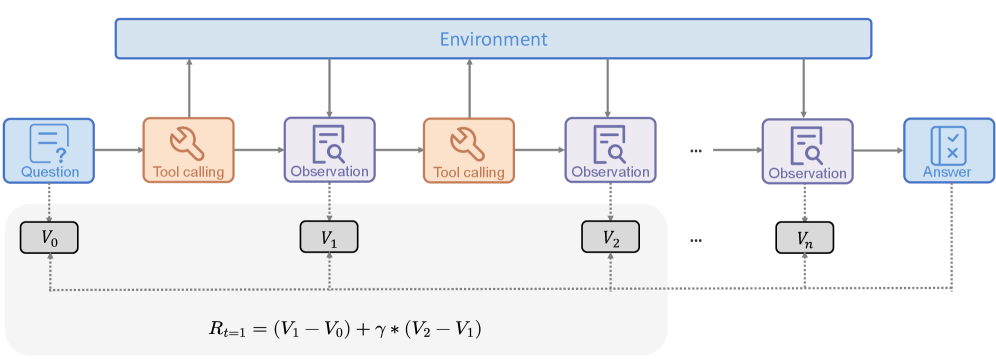
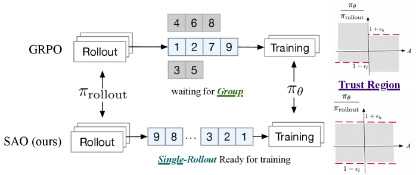
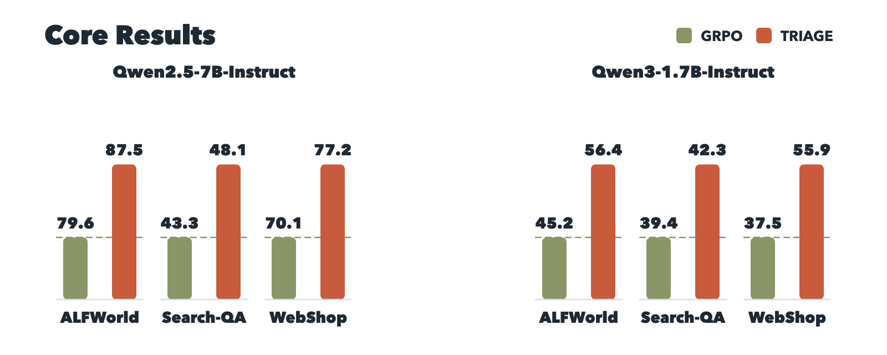
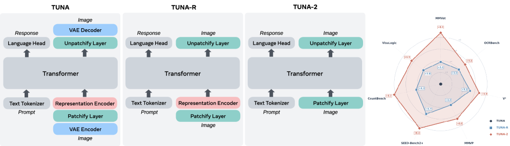

# 两条最新主线深读:Agentic RL 信用分配 & 统一多模态的扩散/去编码器化

- **Date:** 2026-07-17
- **Tags:** Agentic RL, 信用分配, 异步RL, GRPO, 长时域Agent, 统一多模态, 扩散LLM, encoder-free, VLM

## Context

用 HuggingFace + alphaXiv 交叉检索 2026 年最新论文(重点领域:LLM/Agent/多模态/图/金融),浮现出**两条信号极强的主线**。本笔记各挑标杆论文深读,均基于一手 PDF 全文,数据可核。

- **主线一:Agentic RL 的「信用分配(credit assignment)」爆发**。2026 Q2–Q3 单季度涌现 10+ 篇,核心矛盾统一:*长时域 agent 的轨迹级奖励太粗——一次失败 rollout 里可能有很多有用动作,outcome-only 训练却给它们同样的负 advantage*。与我上一篇 [[GLM-5.2 笔记]] 里的「异步 Agent RL」完全同源。
- **主线二:统一多模态(理解+生成)走向「扩散 LLM」与「去编码器化」**。两条技术路径同时挑战主流 AR + 独立 vision encoder 范式。

> [!NOTE]
> 强连接:主线一的 **SAO 论文(2607.07508)正是训练开源 GLM-5.2(750B-A40B)所用的异步 RL 算法**——作者来自清华 + Z.AI,直接补全了 GLM-5.2 技术报告里语焉不详的「异步 Agent RL」细节。

## 论文总览

| 论文 | arXiv | 日期 | 主线 | 一句话 |
|---|---|---|---|---|
| **TRACE** | 2607.13988 | 07-15 | Agentic RL | 冻结参考模型算 gold-answer 对数概率→TD 差分做 turn 级信用,无需 critic |
| **SAO** | 2607.07508 | 07-08 | Agentic RL | 单 rollout 异步优化;GLM-5.2 实际所用算法 |
| **TRIAGE** | 2606.32017 | 06-30 | Agentic RL | 给动作打「角色」标签(决定性/探索/无进展/倒退)按角色分信用 |
| **LLaDA2.0-Uni** | 2604.20796 | 04-22 | 多模态 | 离散扩散 LLM 统一理解+生成(HF 245👍) |
| **Tuna-2** | 2604.24763 | 04-27 | 多模态 | 像素 embedding 干掉 vision encoder,端到端 |

---

## 主线一:Agentic RL 的信用分配

### 问题本质

RLVR(可验证奖励 RL)在数学/代码等**单轮**任务上很成功:一个确定性 checker 判最终答案对错,给 clean outcome reward。但搬到 **agent** 上就不够——一条 rollout 可能有几十上百次 search/open/click/edit,单一 terminal reward 只说了"成没成",没说**哪一步搜集了关键证据、哪一步冗余、哪一步把 agent 带偏**。GRPO 的 group-relative advantage 仍然是**整条轨迹一个值**,无法区分同一轨迹内的好坏动作。三篇标杆给出三种正交解法。

### 标杆 1:TRACE —— 用冻结参考模型做「进度探针」(UW-Madison + Microsoft)

**核心洞见**:不训 critic、不要 step 标注、不用强 judge,而是把**冻结的参考模型**(策略初始化的副本)当作一个稳定的"探针",衡量**每个轨迹前缀是否让 gold answer 更可预测**。

**机制**(见 §3):
1. 在 tool-call 边界把 rollout 切成状态转移 $S_k \to S_{k+1}$。
2. 每个前缀 $S_k$ 用参考模型算 gold answer 的平均对数概率 $\bar\ell_k$,转成 log-ratio 状态值 $V(S_k)$。
3. 相邻状态值之差即 TD 信用:$\delta_k = V(S_{k+1}) - V(S_k) = \log\frac{d_k}{d_{k+1}}$。动作让答案更可预测→正信用,无用→≈0,带偏→负。
4. **telescoping 特性**:一步 TD 信用累加只依赖首尾端点,冗余中间步无法灌水,天然抑制"凑长度"。
5. K 步 look-ahead(K=3, γ=0.8)处理延迟证据(search 只给链接、后续 open 才暴露答案);末端用 GRPO outcome advantage 锚定。
6. 最终 per-token advantage 混合:$\hat A = \alpha_{out} A_{out} + \alpha_{turn} r_{turn}$($\alpha_{out}=1.0, \alpha_{turn}=0.2$)。

**结果**(纯 RL,无 SFT 冷启动/无 live-web 数据):

| Backbone | BrowseComp-Plus | 四基准均值 |
|---|---|---|
| Qwen3-4B base | 7.2 | 13.4 |
| Qwen3-4B **TRACE** | **35.6** | 34.0(GRPO 29.5) |
| Qwen3-30B-A3B base | 8.4 | 16.7 |
| Qwen3-30B-A3B **TRACE** | **42.6** | 38.1(GRPO 32.5) |

且收敛更早更快;学到的行为跨语言/跨语料迁移(开放 web 上 GAIA 52.0、中文 xbench 45.0)。**局限**:依赖"答案短、可精确匹配 gold",对代码补丁/开放式长输出这类任务,gold-output 对数概率是否还是可靠 value 代理尚不清楚。

### 标杆 2:SAO —— 单 rollout 异步优化(清华 + Z.AI;GLM-5.2 实际所用)

**问题**:主流 RL 是**同步 batch-interleaved**——策略生成一整批 rollout,全收齐才开始优化。agent/代码任务 rollout 长度差异极大,短的早完、长的拖尾,GPU 大面积空转。异步 RL 能缓解,但引入两个难题:(1) 一条轨迹可能由多个旧版本 rollout 模型生成,off-policy 更严重、训练不稳;(2) **GRPO 的 group 采样与异步天然不匹配**——group 得等最慢的那条,且在线环境常常每 prompt 只有一条反馈。

**SAO 三招**:
1. **DIS(Direct Double-sided Importance Sampling)**:直接用 rollout 的 log-prob 作行为代理($r_t = \pi_\theta/\pi_{rollout}$),**丢掉难追踪的 $\pi_{\theta_{old}}$**;严格双侧 token 级裁剪 $[1-\epsilon_\ell, 1+\epsilon_h]$,区间外 token 直接 mask 出梯度。比 IcePop 更简。(⚠️ 这正是 GLM-5 报告里提的 "Direct Double-sided Importance Sampling",在此有完整推导。)
2. **单 rollout 替代 group 采样**:每 prompt 一条,生成完立即进训练;为压方差配**更强的 value model**——critic 更新频率 K=2 > actor(TTUR),且 value model **冻结 attention、只训 MoE 投影**(发现不稳定主要来自 Full Attention 层)。
3. **Skip-Observation token 级 GAE**:agent 轨迹 $[a_0,o_0,a_1,o_1,...]$ 里 observation 不是模型生成的,跨 $a\to o$ 边界算 advantage 会引入噪声;SAO 把 Bellman target 改为**直接连接相邻 action**,跳过环境反馈 token。

**结果**(Qwen3-30B-A3B):

| Benchmark | Baseline | GRPO | **SAO** |
|---|---|---|---|
| AIME2025 (w/ python) | 80.4 | 84.2 | **97.3** |
| BeyondAIME | 53.3 | 54.8 | **74.8** |
| IMOAnswerBench | 53.3 | 55.8 | **74.0** |
| SWE-Bench Verified | 23.0 | 27.0(+DIS) | **29.8** |

关键:**vanilla GRPO 约 160 步崩溃**,SAO 能稳训 1000 步。在线学习模拟(动态切换写作风格奖励)中,SAO 的 value-based critic 比 running-mean baseline 适应更快——这正是 group-based 方法做不到的单轨迹在线场景。

### 标杆 3:TRIAGE —— 给动作打「角色」再分信用(LinkedIn + Harvard + JHU + GaTech)

**核心思路**:给 outcome 信用**加一根语义「角色」轴**。一个结构化 judge 把每个 segment 分成四类——**决定性进展 / 有用探索 / 无进展基础设施 / 倒退**,再用**固定的角色→有界过程奖励**规则映射。保留 verifier outcome 作为优化方向,只修正 outcome-only 的两个盲区(惩罚失败轨迹里的有用探索、奖励成功轨迹里的冗余/倒退)。

**理论**:证明了 role-conditioned 信用是"仅凭角色标签可表达的最优 segment 级修正"——即 per-segment advantage 残差在角色变量上的投影,judge 可靠时降低 advantage 估计误差、连接到更低方差的策略梯度。

**结果**:在 ALFWorld / Search-QA / WebShop 上,两个策略模型均超 GRPO,且优于"标量 judge 过程奖励"和"outcome-supervised 共享 backbone value"两个 baseline。消融显示**增益主要来自角色分型本身**(而非单纯加密集奖励):可靠识别成功轨迹里的**倒退**是最大贡献,探索信用是稳定的次要增益。附加收益:完成的 ALFWorld/WebShop rollout 里,**环境交互轮数分别再降 10.4% / 14.8%**(学会少做冗余动作)。

### 三篇对比

| | TRACE | SAO | TRIAGE |
|---|---|---|---|
| 信用来源 | 冻结参考模型的答案对数概率 TD | value model(critic) | 结构化 judge 的角色标签 |
| 要不要额外模型 | ❌ 无(critic-free) | ✅ value model | ✅ judge |
| 主攻 | search/deep-research | 异步稳定性 + 效率 | 通用 agent(含倒退检测) |
| 落地 | Qwen3 纯 RL | **GLM-5.2 生产** | LinkedIn agent 场景 |

---

## 主线二:统一多模态的两条新路径

主流统一多模态模型(理解+生成同一框架)有两个"包袱":(1) 骨干多用 **AR(自回归)**;(2) 视觉靠**预训练 vision encoder**,且理解/生成常用**两套不同视觉表示**,造成任务间错位、无法从原始像素端到端优化。两篇标杆分别从这两点开刀。

### 标杆 4:LLaDA2.0-Uni —— 用「离散扩散 LLM」统一(Inclusion AI / 蚂蚁)

**路径**:不用 AR,改用**离散扩散大模型(dLLM)**做骨干,理解与生成共享同一个 **block-level masked diffusion** 目标。

**三大组件**:
1. **SigLIP-VQ 全语义 tokenizer**:用预训练 SigLIP2-g ViT 提特征 + 向量量化(codebook 16384 词、维度 2048),把图像转成**纯语义离散 token**。区别于重构式 VQ-VAE——后者缺语义,理解性能差。
2. **16B MoE dLLM 骨干**(LLaDA-2.0-mini):扩词表纳入视觉 token;用 **block-wise attention**(非纯双向,避免退化)保并行解码;1D RoPE + `<height><width>` 特殊 token 支持任意分辨率。
3. **扩散解码器**(基于 6B Z-Image):把离散语义 token 当条件重建高保真图,经蒸馏做到 **8 步 CFG-free 推理**(相比 50 步提速 11.4×,质量几乎无损)。

**效率**:训练无关加速框架 **SPRINT**(稀疏前缀保留 + 非均匀 token 去掩码),生成 24.3→39.8 TPS(1.6×),均分仅掉 0.6。

**结果**:理解上**追平专用 VLM**(MMStar 64.1 vs Qwen2.5-VL-7B 63.9;逼近甚至个别反超);生成上 GenEval **0.89**、DPG 87.76、UniGenBench 79.63 均为**统一模型 SOTA**;WISE(推理型生成)0.68,开 thinking 再 +10% 到 0.78。原生支持**交错生成+推理**(下棋、物理题分步解)。**局限**:SigLIP-VQ 保语义但细节保真弱;RL 优化仍待完善。(注:该论文 arXiv HTML 未提供可直接抓取的插图,故本节以数据为主。)

### 标杆 5:Tuna-2 —— 「像素 embedding 打败 vision encoder」(Meta AI + HKU + Waterloo)

**大胆主张**:**预训练 vision encoder 不是必需的**。直接用简单 patch embedding 层编码原始像素,**完全丢弃 VAE 和 representation encoder**,理解与生成都在**像素空间**端到端做。

**演进三步**(消融即架构):Tuna(VAE+encoder)→ **Tuna-R**(去 VAE,留 representation encoder)→ **Tuna-2**(全去掉,纯 patchify + 单 transformer decoder)。生成用 JiT 的 **像素空间 flow matching**(x-prediction + v-loss)。为稳住高维像素空间训练,引入 **masking-based 特征学习**(生成时预测被掩码 patch、理解时在部分可见下做多模态推理,当正则)。

**关键发现(控制实验)**:
- **理解**:encoder-based 的 Tuna-R **早期收敛快**(SigLIP2 语义先验),但**大规模训练后 Tuna-2 反超**——尤其在细粒度感知基准(V*、CountBench、VisuLogic)。7B 级 native UMM 上 Tuna-2 拿下多项 SOTA(MMVP 77.3、CountBench 81.7)。
- **生成**:Tuna-R 全程略优于 Tuna-2(representation encoder 的语义先验有帮助),但差距随数据规模缩小,SFT 后几乎持平;GenEval 0.87 / DPG 86.54,与 BAGEL/Mogao 竞品相当。
- **鲁棒性**:注意力可视化显示 Tuna-2 在误导性语言先验 + 视觉干扰下(如"猫咖啡馆"实为狗、"踢足球"实为踢玻璃杯)定位更准。

**一句话洞见**:去掉预训练 encoder 的**归纳偏置**(固定分辨率、缺低层细节),反而更利于大规模学到强细粒度视觉表示。与并行工作 SenseNova-U1(NEO-Unify)呼应,也和 [[Inkling]] 的 encoder-free 音视频路线同频。

### 两条路径对比

| | LLaDA2.0-Uni | Tuna-2 |
|---|---|---|
| 挑战对象 | AR 骨干 | vision encoder |
| 骨干 | 离散扩散 dLLM(16B MoE) | 单 transformer decoder(Qwen2.5-7B) |
| 视觉表示 | SigLIP-VQ 语义离散 token | 原始像素 patch(pixel space) |
| 生成 | 扩散解码器(8 步蒸馏) | 像素空间 flow matching |
| 卖点 | 并行解码 + 交错推理 | 极简架构 + 细粒度感知更强 |

---

## 趋势分析

1. **信用分配是 2026 Agentic RL 的头号战场**。三种正交解法(冻结参考模型 TD / value model / judge 角色标签)都在回答同一问题:*outcome reward 太粗,如何在轨迹内部给动作分信用*。共同点:**都保留 outcome verifier 作为最终锚**,只在其上加密集信号——没人敢完全丢掉可验证奖励。

2. **异步 RL 基础设施与算法深度绑定**。SAO 证明:异步不只是工程提速,GRPO 的 group 采样本身与异步/在线**结构性不匹配**,必须回到 value-based 单 rollout。这与 GLM slime、Relax、ProRL 等系统工作共同构成"后训练工程即竞争力"的大趋势。

3. **统一多模态在拆两个"预训练包袱"**:AR 骨干(→扩散)和 vision encoder(→像素)。二者都指向**更端到端、更统一的单一目标训练**,且都发现**大规模训练后,简化架构反超带归纳偏置的复杂架构**(Tuna-2 > Tuna-R;dLLM 追平 AR VLM)。

4. **两条线在"encoder-free"上意外交汇**:Inkling(音视频 encoder-free)、Tuna-2(视觉 encoder-free)、LLaDA2.0-Uni(语义离散 token 统一)都在弱化/取消模态专用编码器,让统一骨干直接吞原始信号。

## Open Questions

- TRACE 的冻结参考模型 value 代理能否推广到**长/结构化输出**(代码补丁、开放式任务)?需要什么替代 state-value target?
- SAO 的单 rollout + value model 路线,能否推广到更小模型 / 非 agentic RLHF?value model 冷启动(需大规模 value 预训练)是不是新瓶颈?
- TRIAGE 的 judge 可靠性是上限——judge 出错时角色信用会不会反噬?judge 成本 vs TRACE 的无 critic,哪个更划算?
- 统一多模态:离散扩散(LLaDA2.0-Uni)vs 像素空间(Tuna-2),哪条路 scale 更好?细粒度细节保真(两者都承认的弱项)如何解?
- 主线一与二能否交汇——**统一多模态模型的 agentic RL 后训练**该如何做信用分配?(Relax 已在尝试 omni-modal 异步 RL)

## References

- Tao et al., "TRACE: Turn-level Reward Assignment via Credit Estimation for Long-Horizon Agents," arXiv:2607.13988 (2026-07-15)
- Hou et al., "Single-Rollout Asynchronous Optimization for Agentic Reinforcement Learning" (SAO), arXiv:2607.07508 (2026-07-08) — GLM-5.2 所用
- Xu et al., "TRIAGE: Role-Typed Credit Assignment for Agentic Reinforcement Learning," arXiv:2606.32017 (2026-06-30)
- Bie et al. (Inclusion AI), "LLaDA2.0-Uni: Unifying Multimodal Understanding and Generation with Diffusion Large Language Model," arXiv:2604.20796 (2026-04-22)
- Liu, Ren et al. (Meta AI), "Tuna-2: Pixel Embeddings Beat Vision Encoders for Multimodal Understanding and Generation," arXiv:2604.24763 (2026-04-27)
- 相关未深读但同主线:CompactionRL (2607.05378)、EnvRL (2606.17680)、Polar (2605.24220)、Relax (2604.11554)、Omni-Diffusion (2603.06577)、MUNI (2606.16408)、SenseNova-U1 (2605.12500)
- 检索工具:HuggingFace paper_search + alphaXiv discover_papers(2026-07-17)

> 引用须可验证:以上数字均来自各论文 arXiv 全文;第一方基准请谨慎横向比较。
