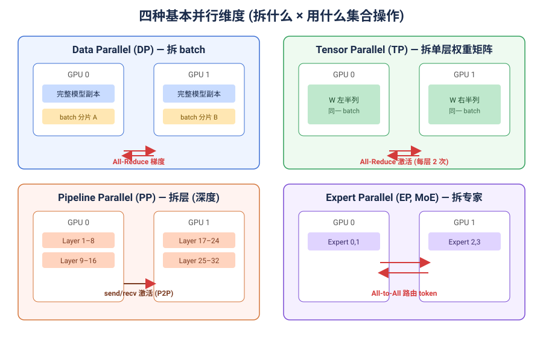
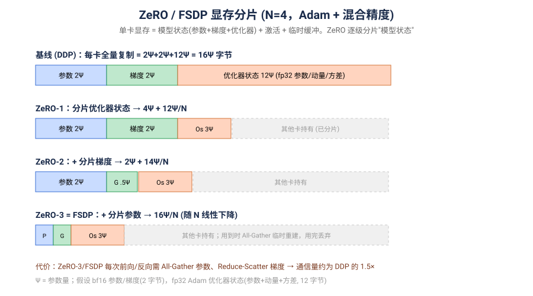
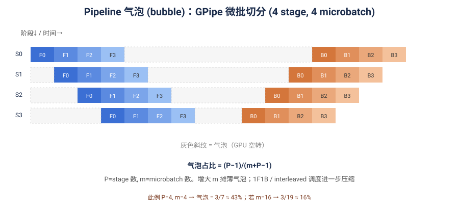
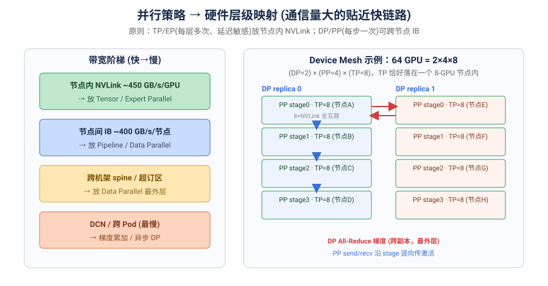
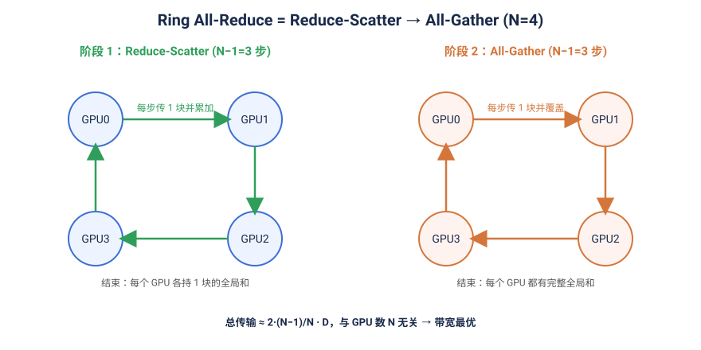

# 分布式训练系统全景：从并行策略到集合通信与集群拓扑

**日期**: 2026-07-20
**Tags**: #research-report #distributed-training #collective-operations #parallelism #tpu #gpu #nccl #topology #moe #zero #systems
**触发来源**: [Aleksa Gordić — Inside TPU and GPU Clusters](https://www.aleksagordic.com/blog/collective-operations)（2026-07）
**性质**: 以该博客的"集合通信 × 拓扑"深读为骨架，向上补齐分布式训练必备知识体系（并行策略原理、显存分析、通信-计算重叠、训练框架生态），构成一份自洽的技术研究报告。

## TL;DR

训练/服务大模型本质上是一个**大规模分布式系统问题**：单卡既装不下模型也算不过来，必须沿多个维度切分到成百上千块芯片上，而切分带来的**芯片间数据搬运**往往才是真正的瓶颈。本报告自底向上打通四层：

1. **为什么要并行** —— 显存墙与算力墙、模型状态的显存拆解；
2. **四种并行维度** —— DP / TP / PP / EP 的原理、切什么、代价，以及 ZeRO/FSDP、序列并行、3D 并行的组合；
3. **并行→集合通信** —— 每种并行落到哪个集合原语(All-Reduce / All-Gather / Reduce-Scatter / All-to-All)，以及通信-计算重叠；
4. **集合通信→硬件拓扑** —— 同一算法在 TPU 环面(torus)与 GPU 胖树(fat tree)上的不同最优实现，及 SHARP、rail、消息尺寸等落地陷阱。

一句话主线：**并行策略决定用哪个集合原语，集合算法的最优实现由硬件拓扑决定；三者必须一起看，脱离拓扑谈吞吐没有意义。**

## 全景图：一张表串起四层

| 并行维度 | 切分对象 | 关键集合操作 | 通信频率 | 首选放置层级 |
|---|---|---|---|---|
| 数据并行 DP | 输入 batch | **All-Reduce**(梯度) | 每 step 1 次 | 最外层 / 可跨节点 IB |
| 张量并行 TP | 单层权重矩阵 | **All-Reduce / All-Gather**(激活) | 每层 2 次 | 节点内 NVLink |
| 流水线并行 PP | 层(深度) | **send/recv**(P2P 激活) | 每 microbatch | 节点间 IB |
| 专家并行 EP | MoE 专家 | **All-to-All**(token 路由) | 每 MoE 层 2 次 | 节点内为主 |
| ZeRO/FSDP | 模型状态(参/梯/优化器) | **All-Gather + Reduce-Scatter** | 每层 | 视规模而定 |

---

# 第一部分：为什么必须分布式——显存墙与算力墙

## 1.1 单卡装不下什么

以混合精度 + Adam 训练一个参数量为 Ψ 的模型，**模型状态(model states)**的显存占用是(单位：字节)：

- bf16 参数：**2Ψ**
- bf16 梯度：**2Ψ**
- fp32 优化器状态(Adam 的 master 参数 + 一阶动量 + 二阶方差)：**4Ψ + 4Ψ + 4Ψ = 12Ψ**

合计 **16Ψ**。一个 70B 模型仅模型状态就需 ~1.1 TB，而单张 H100 只有 80 GB —— 这就是**显存墙**。除模型状态外，还有随 batch×seq 增长的**激活(activations)**、以及通信/临时缓冲。

> 关键区分：**模型状态**随参数量固定，可被 ZeRO/FSDP **分片**消除冗余；**激活**随 batch 与序列长度增长，靠**激活重计算(gradient checkpointing, Chen et al. 2016)**、序列并行、FlashAttention(Dao et al. 2022) 压缩。

## 1.2 三条降显存的正交手段

| 手段 | 省什么 | 代价 | 代表 |
|---|---|---|---|
| 分片模型状态 | 参数/梯度/优化器冗余 | 额外通信 | ZeRO-1/2/3、FSDP |
| 激活重计算 | 前向激活 | 多一次前向(~30% 算力) | gradient checkpointing |
| 卸载(offload) | 显存→CPU/NVMe | PCIe 带宽 | ZeRO-Offload / Infinity |

这三者与"并行"正交，可叠加使用。下面进入并行本身。

---

# 第二部分：四种并行策略的原理

## 2.1 数据并行 (Data Parallelism, DP)

**切什么**：把一个大 batch 切成若干子 batch，每张卡持有**完整模型副本**，各自算不同数据的前向/反向。

**为什么要通信**：不同卡看到不同数据 → 算出的梯度不同。为了让所有副本保持一致，反向后必须对梯度做 **All-Reduce**（求和后平均），再各自用同样的梯度更新。

- **DDP(PyTorch)**：梯度在反向计算的同时按 bucket 触发 All-Reduce，与反向计算重叠。
- **局限**：每卡都存 16Ψ 全量模型状态 → 不省显存，只扩吞吐。大模型必须叠加下面的分片。

**ZeRO / FSDP —— DP 的"去冗余"进化**（Rajbhandari et al. 2019, ZeRO；PyTorch FSDP, Zhao et al. 2023）：DP 的三份模型状态在 N 卡上完全冗余，ZeRO 逐级把它们分片：

- **ZeRO-1**：分片优化器状态 → 单卡 4Ψ + 12Ψ/N
- **ZeRO-2**：+ 分片梯度 → 2Ψ + 14Ψ/N
- **ZeRO-3 = FSDP**：+ 分片参数 → 16Ψ/N（随 N 线性下降）

代价：前向/反向用到某层参数时临时 **All-Gather** 重建完整权重、用完即丢；梯度用 **Reduce-Scatter** 分片规约。总通信量约为 DDP 的 1.5×，但显存随 N 线性下降——这是训练超大模型的主力手段。

## 2.2 张量并行 (Tensor Parallelism, TP)

**切什么**：把**单层内部的权重矩阵**按行/列切到多卡（Megatron-LM, Shoeybi et al. 2019）。同一份数据在所有 TP 卡上，但每卡只算矩阵的一部分。

以 Transformer MLP `Y = GeLU(X·A)·B` 为例：
- A 按**列**切 → 每卡算 `X·A_i`，无需通信即可各自过 GeLU；
- B 按**行**切 → 每卡算部分积，最后 **All-Reduce** 求和得到完整 Y。

一个 Transformer 层前向需 **2 次 All-Reduce**（Attention 块 + MLP 块各一次），反向再 2 次。

**特点**：通信频繁且在关键路径上（激活等着规约完才能继续）→ **必须放在带宽最高、延迟最低的节点内 NVLink**，TP 度数通常 ≤ 单节点 GPU 数(8)。

**序列并行 (Sequence Parallelism, Korthikanti et al. 2022)**：TP 未切分的 LayerNorm/Dropout 部分沿**序列维**再切一刀，把这部分激活也分摊，进一步降显存；它把 TP 的 All-Reduce 拆成 All-Gather + Reduce-Scatter 的组合，通信量不变。

## 2.3 流水线并行 (Pipeline Parallelism, PP)

**切什么**：把模型**按层(深度)**切成若干 stage，每张卡持有连续几层。数据像流水线一样逐 stage 前向，再逆序反向。stage 间只需 **point-to-point 的 send/recv** 传激活（通信量小，适合放较慢的节点间 IB）。

**核心问题——气泡(bubble)**：朴素流水线里，stage k 要等前 k−1 个 stage 算完才能开工，首尾存在大量空转。GPipe(Huang et al. 2018) 把 batch 切成 **m 个 microbatch** 填充流水线，气泡占比：

$$\text{bubble} = \frac{P-1}{m + P - 1}\quad(P=\text{stage 数})$$

增大 m 摊薄气泡；**1F1B / interleaved**(Narayanan et al. 2021, PipeDream/Megatron) 调度进一步压缩气泡并降激活显存峰值。

## 2.4 专家并行 (Expert Parallelism, EP)

**切什么**：MoE 模型里，把不同**专家(expert, FFN)**放到不同卡上（GShard, Lepikhin et al. 2020；Switch Transformer, Fedus et al. 2021）。每个 token 经 router 只激活 top-k 个专家。

**为什么用 All-to-All**：token 在哪张卡、要去的专家在哪张卡，通常不一致 → 需要一次 **All-to-All** 把 token 按路由**分发**到专家所在卡（dispatch），专家算完再一次 **All-to-All** 把结果**收回**(combine)。因此每个 MoE 层 2 次 All-to-All。

**痛点**：路由是**动态、不均衡**的（热门专家收到更多 token）→ 负载不均 + All-to-All 通信量难以预测，是 MoE 训练/推理系统的核心难题（见第四部分 NVL72）。

## 2.5 组合：3D / nD 并行与 Device Mesh

真实的大规模训练是多维并行的**笛卡尔积**（Megatron-LM 3D 并行，Narayanan et al. 2021）：

$$\text{总卡数} = \text{DP} \times \text{PP} \times \text{TP}\ (\times\ \text{EP} \times \text{SP})$$

放置原则由通信特性决定，与第四部分的带宽阶梯严丝合缝：

- **TP / EP**（每层多次、延迟敏感）→ 放**节点内 NVLink**；
- **PP**（每 microbatch 一次、量小）→ 放**节点间 IB**；
- **DP / ZeRO**（每 step 一次）→ 放**最外层**，可跨机架/Pod。

现代框架用 **device mesh** 抽象把逻辑并行维映射到物理拓扑轴，让上述放置自动化。

---

# 第三部分：并行落到集合通信原语

理解了"每种并行用哪个集合操作"后，本部分把这些集合原语本身讲透——它们是所有并行策略的公共底座。

## 一、四个核心集合操作

先用抽象定义把四个操作及其相互关系理清:

- **All-Gather**:每个芯片持有一个分片,操作结束后**每个芯片都拥有全部分片的拼接**。用于 FSDP 前向时把分片的权重聚合成完整权重。
- **Reduce-Scatter**:All-Gather 的**对偶(dual)**。数据在环上流动时**边搬运边规约(reduce,通常是求和)**,结束后每个芯片持有"全局规约结果的一个分片"。
- **All-Reduce**:每个芯片最终拿到"所有芯片数据的规约结果(完整)"。它被分解为 **Reduce-Scatter + All-Gather 两个阶段**,因此开销约为单个原语的 **2 倍**。这是数据并行梯度同步的核心。
- **All-to-All**:一种**分片转置(sharded transpose)**——每个芯片把自己持有的数据按目标重新分发给所有其他芯片。是 MoE 专家并行中 token 路由的核心。

关键洞察:**All-Reduce = Reduce-Scatter → All-Gather**,所以只要理解了后两者,All-Reduce 就是它们的组合。而 Reduce-Scatter 和 All-Gather 互为逆操作(通信模式相同,方向相反),真正需要吃透的其实只有一个。

**带宽最优性**：Ring All-Reduce 的总传输量 ≈ `2·(N−1)/N · D`，当 N 很大时趋于 `2D`，**与 GPU 数量 N 几乎无关**——这是它成为 DP 梯度同步默认算法的根本原因(Baidu 的 ring-allreduce 是 Horovod/NCCL 的基础)。

### 通信-计算重叠 (overlap)——把通信"藏"起来

集合通信在关键路径上就是纯开销，工程上的核心手段是**让它与计算重叠**，从而隐藏延迟：

- **DP/DDP**：梯度 All-Reduce 按 bucket 触发，反向还在算浅层时，深层梯度已经在 All-Reduce。
- **FSDP**：**prefetch** 下一层参数的 All-Gather，与当前层前向计算重叠；反向的 Reduce-Scatter 同理。
- **TP**：计算-通信融合（如 Megatron 的 sequence-parallel + 融合算子）尽量重叠 GEMM 与 All-Reduce。
- **PP**：1F1B 调度本质就是用 microbatch 的计算填住 send/recv 的等待。

判断能否隐藏的粗略标准：`T_compute ≳ T_comm` 时通信可被完全藏住，否则暴露为 exposed communication，直接拖慢吞吐。这把下一部分的**带宽/延迟模型**与端到端吞吐直接联系起来。

---

# 第四部分：集合通信落到硬件拓扑

以下是本报告的原始骨架（来自 Aleksa Gordić 的博客深读）：同一个集合算法，在 TPU 环面与 GPU 胖树上有完全不同的最优实现。

## 二、TPU 集群拓扑:环面 (Torus)

### 拓扑结构

TPU 采用**近邻直连(nearest-neighbor)**,没有交换机:每个芯片直接连到它的邻居。

- **2D torus**(4 邻居):v2、v3、v5e、v6e
- **3D torus**(6 邻居):v4p、v5p、TPU7x (Ironwood)

**Torus = mesh + wraparound(环绕/周期性边界)**。环绕连接把最边缘的芯片首尾相接,使每个轴成为一个环。一旦某个轴太小丢失环绕(如 2×2×2 退化成 mesh/path),沿该轴的环形集合操作会付出约 **2× 惩罚**——因为数据不能沿环双向流动,只能在链上折返。

### 带宽层级

数据离计算 die 越远越慢,形成清晰的带宽金字塔:

- **ICI(Inter-Chip Interconnect,片间互联)**:连接同一 Pod 内的芯片。最大的 ICI 连通孤岛就是一个 **Pod / superpod**。
- **DCN(Data Center Networking)**:连接不同 Pod,慢得多,且数据需经 **PCIe** 才能到达 DCN。

### 关键规格

| 代际 | 拓扑 | Pod 尺寸 | Pod 芯片数 |
|---|---|---|---|
| v5e | 2D torus,size-16 环绕 | 16×16 | 256 |
| v4 | 3D torus | 16×16×16 | 4096 |
| v5p | 3D torus | 16×20×28 | 8960 |

- **ICI 单向带宽 ≈ 45 GB/s**,**每跳延迟 ≈ 1 μs**
- 最小完整 3D torus 是 4×4×4;更小(如 2×2×2)会丢失环绕退化成 mesh
- v5e 每个 host 通过 PCIe 连一个 2×4 = 8 芯片的 block

**延迟 vs 带宽的经验法则**:45 GB/s × 1 μs = **45 KB**。即一条链路在 1 μs 内只能搬 45 KB。当消息尺寸接近这个量级时,通信是**延迟受限(latency-bound)**的,纯带宽近似模型失效。这解释了为什么小张量适合 tree、大张量适合 ring。

## 三、Ring 与 Tree:两种基本算法

### Ring(环形)—— 大消息首选

在一个 N 芯片的环上做 All-Gather / Reduce-Scatter:

- **单向环**:每步把自己的分片传给下一个邻居,**N−1 步**完成(N=4 → 3 步)。
- **双向环**:同时用两个方向,吞吐翻倍。
- **Chain / Path**(无环绕):只能单向折返,是丢失 wraparound 后的退化形态,约 2× 惩罚。
- **2D Ring**:在 2D torus 上同时用满 **4 条 ICI 链路**(两个轴各双向),相比单轴可得 **≈2× 加速**。

Ring 的优势是**完美流水线化(pipelining)**:大张量被切成许多小块,块在环上连续流动,任一时刻所有链路都在满负荷传输。因此 ring 能逼近链路的峰值有效带宽。

### Tree(树形)—— 小消息 / 延迟敏感首选

- 用 **log₂(N) 步**代替 ring 的 N−1 步。
- **All-Gather** 用 **recursive doubling(递归倍增)**:第 k 步与距离 2^k 的伙伴交换,数据量每步翻倍。
- **Reduce-Scatter** 用 **recursive halving(递归减半)**:对偶过程,数据量每步减半。

### Ring vs Tree 权衡

> 在**理想带宽模型**下,ring 与 tree 传输的**总字节数相同**。区别在于:
> - **Ring** 步数多(N−1)但每步流水线化好 → 大消息**有效带宽更高**。
> - **Tree** 步数少(log₂ N)→ **延迟复杂度更低**,小消息更快。

所以选择完全取决于消息尺寸相对于那条 45 KB 延迟/带宽拐点在哪一侧。

### 一个具体算例

- 把一个 `(2048, 2048)` bf16 矩阵(**8 MiB**)在 4×4 v5e mesh 上沿两条 ICI 路径搬运,每条 6 跳 → 约 **6 μs** 附加延迟。
- 一个 `(128K, 128K)` bf16 矩阵在 4×4 slice 上分片 → 每个芯片持有 `(32K, 32K)` 的子块。

这类"矩阵尺寸 → 跳数 → 微秒"的手算,是估算通信开销最实用的技能。

## 四、All-to-All:分片转置

All-to-All 是 MoE 专家并行的核心:token 需要按路由结果发到持有对应专家的芯片,再把计算结果发回。它相当于一个**分布式矩阵转置**——每个芯片把自己的第 j 块发给芯片 j。

- 在 torus 上,All-to-All 的通信量比 All-Reduce 更重,因为它没有"规约"带来的数据缩减,而是全量重分发。
- 后文会看到,**稀疏 MoE 路由**会打破"稠密均衡"的理想模型(见 NVL72 部分)。

## 五、NVIDIA GPU 集群拓扑:节点、SU、胖树

GPU 集群与 TPU 截然不同:不是无交换机的 torus,而是**基于交换机的分层胖树(fat tree)**。以 DGX H100 SuperPod(**1024 GPU**)为例:

### 三级组织单位

1. **Node(节点)**:8 张 H100,通过 **NVLink / NVSwitch** 全互联(all-to-all),**任意两 GPU 一跳可达**。
2. **Scalable Unit(SU)**:**32 个 node**,通过 InfiniBand(IB)leaf 交换机连接。
3. **Spine 交换机**:连接各 SU,构成胖树的树根。

### 胖树与全对分带宽

**Fat tree** 的特点是**越靠近树根链路越"胖"(带宽越高)**。一个满配(非超订)的胖树提供 **full bisection bandwidth(全对分带宽)**——把集群任意二等分,跨越切面的总带宽不衰减。

### 关键带宽规格

- 每 GPU 的 scale-out 链路 = **50 GB/s**;每 node 8 条 → **400 GB/s 单向注入带宽(injection bandwidth)**
- 节点内 NVLink ≈ **450 GB/s** 每 GPU
- **对分带宽算例**:
  - 节点内 4 GPU:4 × 450 = **1.8 TB/s**(双向 3.6 TB/s)
  - SU 内 16 node:16 × 400 = **6.4 TB/s**(双向 12.8 TB/s)
  - 集群 64/64 等分:64 × 400 = **25.6 TB/s**(双向 51.2 TB/s)
  - 88/40 不均等切分:受**较小一侧**限制 → 40 × 400 = **16 TB/s**
- **超订(oversubscription)**示例:注入 12.8 TB/s vs 上联 6.4 TB/s = 2:1 超订比

对分带宽由切面两侧**较小的一侧**决定,这是理解胖树容量的关键。

## 六、GPU 节点内集合:Ring、Tree 与 SHARP

由于节点内 8 GPU 经 NVSwitch **全互联**,这里的 "ring" 不再是物理路径,而是 **NVSwitch 交换结构上的逻辑排序**——软件在全互联 fabric 上模拟一个环。

### SHARP:网内规约(In-Network Reduction)

**SHARP(Scalable Hierarchical Aggregation and Reduction Protocol)** 让**交换机在数据传输途中直接做规约**,而不是把数据搬到 GPU 上算完再搬回。

- 收益:卸载 SM 计算周期和 HBM 带宽压力。
- 规格:NVLink 4 NVSwitch SHARP 有 **400 GFLOP/s** FP32 规约吞吐。
- **理论 All-Reduce 加速**:大 N 时逼近 **2×**;8-GPU node 上约 **1.75×**。
- SHARP 还能靠**硬件 multicast** 加速 All-Gather。
- **缺陷**:multicast 会把源 GPU 也算进去,H100 node 上因此**浪费 1/8 带宽**。

### 理论 vs 实际(重要现实检验)

> SHARP 理论上的 ~2× 加速**几乎从不出现**。实践中的加速**仅约 30%(~1.3×)**。

多位贡献者独立复现:在 **32-GPU H100 IB、NCCL 2.29.7、4 GB All-Reduce** 上都测到 ~1.3×,并指出"**这更多是 NCCL 的问题,而非 SHARP 的问题**"——即软件栈尚未榨出硬件的理论上限。这是全文最重要的落地提醒:**理论模型给上界,真实性能要靠 microbenchmark。**

## 七、GPU 跨节点集合:InfiniBand 上的分层算法

跨节点通信要跨越 IB(慢)与节点内 NVLink(快)两个带宽层级。分层算法的核心思想是**把慢的 scale-out(IB)流量与快的本地(NVLink)流量流水线化重叠**。

### 开销模型

- **一阶(粗略)**:`T_total ≈ D / BW_node = D / 400e9`
- **更精确**:`T_total ≈ max(D / BW_gpu, D / BW_node)`

即总时间由 GPU 本地带宽与节点注入带宽中的**瓶颈**决定。

### Rail Optimization(轨道优化)

节点的 400 GB/s 带宽**并非完全可互换(fungible)**——8 条链路对应 8 条独立的 IB "rail"。要达到峰值带宽,必须做 **rail-aware 的 rank 放置**,让通信模式对齐到物理 rail,否则会在某条 rail 上拥塞而其他 rail 闲置。

### NVL72 上的 All-to-All:稠密模型的失效

GB200 NVL72 有 72 GPU。当运行**稀疏 MoE**(如 8 个专家分布在 72 GPU 上)时,任一时刻只有约 **11% 的 GPU** 参与,"稠密均衡带宽"的理想模型直接失效。稀疏、不均衡的路由是当前 MoE 服务系统通信优化的前沿难题。

---

# 第五部分：训练框架生态

上面的并行策略与通信原语，工程上都由一层框架封装。了解各框架的定位有助于选型。

## 5.1 通信后端

- **NCCL**（NVIDIA）：GPU 集合通信事实标准，自动选择 ring/tree、集成 SHARP、拓扑感知。前述"实测 ~1.3×"的软件栈就是它。
- **Gloo**：CPU / 跨平台后备。
- **MPI**：HPC 传统方案，部分框架可选。
- **PyTorch `torch.distributed`**：统一 API（`all_reduce` / `all_gather` / `reduce_scatter` / `all_to_all`），后端可插 NCCL/Gloo。

## 5.2 并行训练框架

| 框架 | 定位 | 主打并行 |
|---|---|---|
| **PyTorch DDP** | 数据并行基线 | DP(All-Reduce 重叠反向) |
| **FSDP / FSDP2** | 原生分片 DP | ZeRO-3 等价，device mesh 组合 TP/PP |
| **DeepSpeed** | 微软，大模型全家桶 | ZeRO-1/2/3、Offload/Infinity、MoE |
| **Megatron-LM / Megatron-Core** | NVIDIA，极致 3D 并行 | TP + SP + PP(interleaved) + EP |
| **Megatron-DeepSpeed** | 二者结合 | 3D 并行 + ZeRO |
| **Accelerate** | HF，薄封装 | 统一 launch，桥接 DDP/FSDP/DeepSpeed |
| **JAX/XLA + GSPMD** | Google，编译式并行 | 声明 mesh + sharding，编译器插集合通信(TPU 主力) |
| **ColossalAI / Alpa** | 自动并行探索 | 自动搜索并行策略 |

**两种范式**：PyTorch 系是**命令式 + 手动/半自动**并行（显式写并行维、device mesh）；JAX/XLA 系是**声明式 + 编译式**并行（标注 sharding，由 GSPMD 编译器自动插入 All-Gather/Reduce-Scatter）——这也是为什么 TPU 生态天然与 XLA 绑定。

## 5.3 选型经验

- **模型能塞进单节点(≤8 卡)**：FSDP / DeepSpeed ZeRO-3 足矣，无需 TP/PP。
- **模型跨节点但 <100B**：ZeRO-3 + 激活重计算，或 TP(节点内) × DP(节点间)。
- **100B~万亿级 / MoE**：Megatron 式 3D+EP 并行，device mesh 精细映射到拓扑。
- **TPU**：JAX + GSPMD，用 mesh 声明 `('data','model')` 轴。

---

## 八、TPU vs GPU 对比总结

| 维度 | TPU | NVIDIA GPU |
|---|---|---|
| 互联拓扑 | 环面 torus(无交换机,近邻直连) | 分层胖树 fat tree(NVSwitch + IB) |
| 组织单位 | Pod / superpod(ICI 孤岛) | Node(8)→ SU(32 node)→ Spine |
| 主干带宽 | ICI 45 GB/s 单向,1 μs/跳 | 节点注入 400 GB/s;NVLink ~450 GB/s/GPU |
| 主要算法形态 | 物理 ring / tree over torus | fabric 上逻辑 ring + SHARP 网内规约 |
| 网内规约 | 无(GPU 独有 SHARP) | SHARP,理论 ~1.75–2×,实测 ~1.3× |
| 达峰消息尺寸 | **~10 MB 即接近峰值带宽** | **需多 GB;<100 MB 明显掉速** |
| 退化惩罚 | 丢失 wraparound → ~2× | 超订 / rail 未对齐 → 掉速 |

一个反直觉的结论:**TPU 在小得多的消息(~10 MB)上就能打满带宽,而 GPU 要多 GB 大消息才逼近峰值,低于 ~100 MB 明显下降**。这对"该用多大的通信桶(bucket size)"有直接工程含义。

---

# 全局 Takeaways

**分布式训练的知识栈（自底向上）：**

1. **动机**：显存墙(16Ψ 模型状态) + 算力墙，逼着沿多维切分；模型状态可分片，激活靠重计算/FlashAttention 压。
2. **四种并行**：DP(切 batch/All-Reduce) · TP(切权重矩阵/All-Reduce·节点内) · PP(切层/send-recv·气泡=(P−1)/(m+P−1)) · EP(切专家/All-to-All)。ZeRO/FSDP 是 DP 的去冗余进化(16Ψ/N)。
3. **组合**：真实训练是 DP×PP×TP×EP 的笛卡尔积，用 device mesh 映射到拓扑；放置原则 = 通信越频繁越贴近快链路。
4. **通信原语**：All-Reduce = Reduce-Scatter + All-Gather（~2× 单原语）；Ring All-Reduce 传输量 ~2D 与 N 无关；工程核心是**通信-计算重叠**把开销藏住。
5. **原语→拓扑**：算法离不开拓扑——同一 All-Reduce 在 TPU 环面是双向 ring、在 GPU 胖树是分层 ring + SHARP；Ring 打大消息、Tree 打小消息，拐点由"延迟×带宽"积决定。
6. **落地陷阱**：理论上界 ≠ 实测（SHARP 理论 ~2× vs NCCL 实测 ~1.3×）；TPU ~10 MB 达峰、GPU 需多 GB；rail 未对齐/超订都会掉速。**永远在自己集群上跑 microbenchmark。**

**一句话**：并行策略决定"用哪个集合原语"，集合算法的最优实现由"硬件拓扑"决定，而端到端吞吐取决于"通信能否被计算藏住"——三层必须一起看。

## Open Questions

- NCCL 无法兑现 SHARP 理论加速,究竟卡在软件栈的哪一层?后续版本是否会收敛到理论上界?
- 稀疏 MoE 的 All-to-All 在 NVL72 上的实际带宽利用率有多低?有哪些拓扑感知的路由/放置优化(expert placement、token dropping、capacity factor)正在被采用?
- Ironwood(TPU7x)等新一代 3D torus 的 ICI 带宽/延迟规格如何?环面在超大 Pod 下的 diameter(最大跳数)增长是否会成为新瓶颈?
- Rail optimization 在主流训练框架(如 Megatron / FSDP2)里是自动处理还是需要手工 rank 放置?
- 编译式并行(GSPMD/Alpa 的自动搜索)能否在 GPU 生态复刻 TPU 的"声明 mesh 即得最优通信"体验?

## References

**触发博客**
- Aleksa Gordić, *Inside TPU and GPU Clusters*(2026-07): https://www.aleksagordic.com/blog/collective-operations

**并行策略与显存(经典论文，均已入库 `references/references.bib`)**
- Shoeybi et al., *Megatron-LM: Training Multi-Billion Parameter Language Models Using Model Parallelism*(2019, arXiv:1909.08053) — 张量并行
- Rajbhandari et al., *ZeRO: Memory Optimizations Toward Training Trillion Parameter Models*(2019, arXiv:1910.02054)
- Zhao et al., *PyTorch FSDP: Experiences on Scaling Fully Sharded Data Parallel*(2023, arXiv:2304.11277)
- Huang et al., *GPipe: Efficient Training of Giant Neural Networks using Pipeline Parallelism*(2018, arXiv:1811.06965) — 流水线气泡
- Narayanan et al., *Efficient Large-Scale Language Model Training on GPU Clusters Using Megatron-LM*(2021, arXiv:2104.04473) — 3D 并行 / interleaved 1F1B
- Korthikanti et al., *Reducing Activation Recomputation in Large Transformer Models*(2022, arXiv:2205.05198) — 序列并行 + 选择性重计算
- Chen et al., *Training Deep Nets with Sublinear Memory Cost*(2016, arXiv:1604.06174) — 激活重计算
- Dao et al., *FlashAttention*(2022, arXiv:2205.14135)
- Micikevicius et al., *Mixed Precision Training*(2017, arXiv:1710.03740) — FP32 master + loss scaling

**MoE / 专家并行(均已入库)**
- Lepikhin et al., *GShard: Scaling Giant Models with Conditional Computation and Automatic Sharding*(2020, arXiv:2006.16668)
- Fedus et al., *Switch Transformers*(2021, arXiv:2101.03961)

**背景**：NCCL 集合通信、NVIDIA SHARP、Baidu ring-allreduce/Horovod、Google TPU ICI/torus 架构、DGX H100 SuperPod 参考架构、JAX GSPMD

> 文献库说明：以上 10 篇经典论文已通过 alphaxiv 核实元数据后写入 `references/references.bib`（arXiv 直连当时被 429 限流，改用 alphaxiv MCP 拿到可验证的作者/标题/年份）。

**相关笔记**
- [[2026-07-08-blog-harness-engineering]]（分布式系统视角下的 agent harness）
