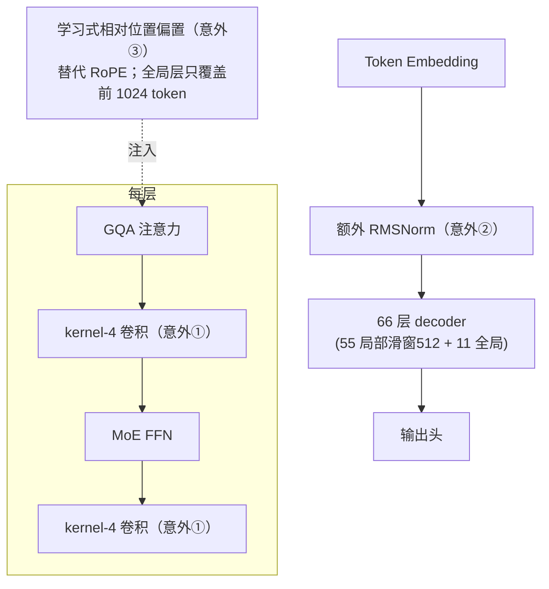

# Blog Deep Dive：Inkling —— DeepSeek-V3 配方上的三处"意外"（Raschka）

- **Date:** 2026-07-20
- **Tags:** #blog-deep-dive #moe #open-weight-models #architecture #position-encoding #inkling

## 来源

[Sebastian Raschka — Inkling: A New Open-Weight 975B MoE with a Few Surprises](https://sebastianraschka.com/blog/2026/inkling-architecture-benchmark-notes.html)（个人博客，2026-07-16）。基于 Thinking Machines Lab 07/15 的开源发布 + HF config + Transformers 实现（**原文未引用 arXiv 论文**，来源为官方公告与代码）。

> 本周 tech-blogs 周报 [`tech-blogs/2026-W30.md`](/tech-blogs/2026-W30.md) 的深读候选。与 [长上下文综述](/research-notes/2026-07-20-llm-long-context.md)（位置编码外推）、[推理努力度综述](/research-notes/2026-07-20-blog-reasoning-effort.md)（同作者、含 Inkling 连续 effort 案例）直接相关。

## TL;DR

Inkling 是 Thinking Machines Lab 突然开源的 **975B 总参 / 41B 激活（4.2%）稀疏 MoE，最长 1M 上下文**。整体沿用 **DeepSeek-V3 式大 MoE 配方**（常规 Transformer decoder + GQA，非 MLA、非 Mamba 混合），但有**三处不寻常设计**：小卷积层、embedding 后额外 RMSNorm、**学习式相对位置偏置替代 RoPE**。基准画像"有好有坏"（Raschka 称之 refreshingly honest），主打配合其 Tinker 平台做**微调与特化**。

## 核心：架构与三处"意外"

**总体规格**：66 decoder 层——**55 层局部滑窗注意力（窗口 512）+ 11 层全局**；全部常规 **GQA**；标准 MoE FFN。

| 维度 | Inkling | 对照 |
|---|---|---|
| 总参 / 激活 | 975B / 41B（**4.2%**） | Kimi K2.5 1T/32B（3.2%，更稀疏）；GLM-5.2 744B/40B |
| 注意力 | 常规 **GQA** | Nemotron 3 Ultra 走 Mamba-Transformer 混合；DeepSeek 系走 MLA |
| 位置编码 | **学习式、输入相关相对位置偏置** | 官方称比 RoPE 外推更好 |

**三处"意外"**：
1. **小卷积层**：K/V 投影后、以及注意力/MLP 分支输出上加 **kernel-4 短卷积**——廉价的局部 token 混合、注入短程归纳偏置。
2. **token embedding 后额外一个 RMSNorm**：独立于每块 pre-attention 的 RMSNorm（config 与 Transformers 实现里都启用了）。
3. **学习式相对位置偏置替代 RoPE**：全局层里偏置**只作用于前 1024 token**，超出后注意力实质变**内容驱动**（类似 NoPE 直觉）。官方称"表现更好、对更长序列外推更好"。

## 基准（发布时，vs GLM-5.2）

| Benchmark | Inkling | GLM-5.2 | 胜负 |
|---|---|---|---|
| IFBench | **79.8** | 73.3 | ✅ |
| SimpleQA Verified | **43.9** | 38.1 | ✅ |
| HLE（无工具） | 29.7 | **40.1** | ❌ |
| SWE-Bench Pro Public | 54.3 | **62.1** | ❌ |
| Terminal-Bench 2.1 | 63.8 | **82.7** | ❌ |

Raschka 提醒：发布时数字、混了内外部 harness，小差异别过度解读。对照还引用了 Nemotron 3 Ultra / Kimi K2.5 / GPT-5.6 Sol / Claude Fable 5。

## 我的反思

- **"抛弃 RoPE" 的又一个产品级实践**。Inkling 的**学习式相对位置偏置 + 滑窗为主**组合，是继 ALiBi、NoPE 之后，又一个在旗舰级模型上少依赖/不依赖 RoPE 的真实案例。这值得和我 [长上下文综述](/research-notes/2026-07-20-llm-long-context.md) §1（位置编码外推谱系）对照追踪——如果它的"1M 外推更好"被独立验证，会是对"RoPE 频率缩放"主流路线的一个有力挑战。
- **卷积回归 Transformer**。kernel-4 卷积做局部混合，让人想起早期 conv-augmented Transformer；配合 55/66 层都是滑窗，Raschka 推测正是这种"局部性偏重"的设计让学习式位置偏置好用——局部靠卷积+滑窗、长程靠稀疏全局层的内容驱动注意力。
- **"诚实的基准画像"是个信号**。Inkling 有明显弱项（Terminal-Bench 落后近 20 分），却照样发布。这与本周 Reddit 的 "benchmaxx" 质疑、以及我在 [长程 agent 整理](/research-notes/2026-07-20-long-horizon-agents.md) 里"harness 越强、模型 benchmark 越失真"的观察呼应：**当模型主打"可微调基座"（配 Tinker）而非"开箱屠榜"，刷单一榜单的动机就下降了**。
- **可信度提示**：本篇转写自 Raschka 博客（其信息又来自官方公告 + HF config/代码），**非同行评审、无 arXiv 论文**；架构图为我据文字描述自绘的 mermaid（非原文图）。基准数字为发布时口径，建议独立复核。

## Open Questions

1. 学习式相对位置偏置的"1M 外推更好"能否被**独立复现**？还是又一个"官方声称、社区待验"（对照长上下文综述里对名义窗口的怀疑）？
2. 4.2% 激活 + 常规 GQA 的组合，**解码吞吐**到底如何？Raschka 也存疑——激活footprint 比 Kimi K2.5 大，raw decoding 速度未必是优势。
3. kernel-4 卷积带来的短程归纳偏置，对**长程精确检索**（大海捞针类）是帮助还是干扰？滑窗为主的设计会不会牺牲跨百万 token 的精确回忆？

## 跟进阅读

- 同作者本周另一篇（已深读）：[推理努力度控制](/research-notes/2026-07-20-blog-reasoning-effort.md)（其中 Inkling 作为"连续 effort"案例出现）。
- [长上下文综述](/research-notes/2026-07-20-llm-long-context.md)（位置编码外推 / 稀疏注意力）。
- 本周 Reddit W30（Inkling/Kimi K3 在 r/datascience、r/LocalLLaMA 的讨论）。

> 说明：原文未引用 arXiv 论文，故本篇无新增文献入库。