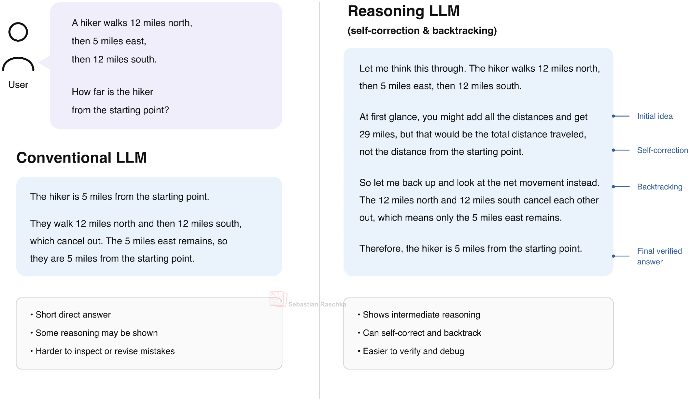
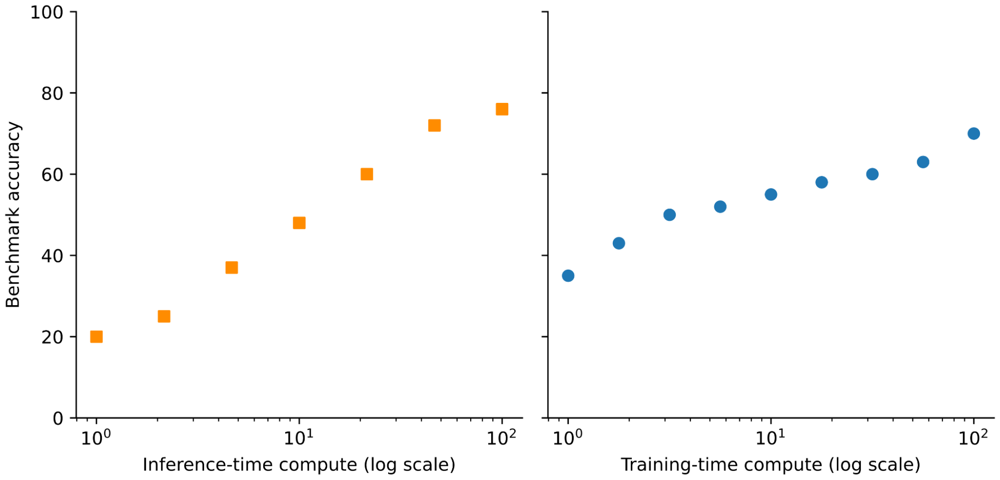
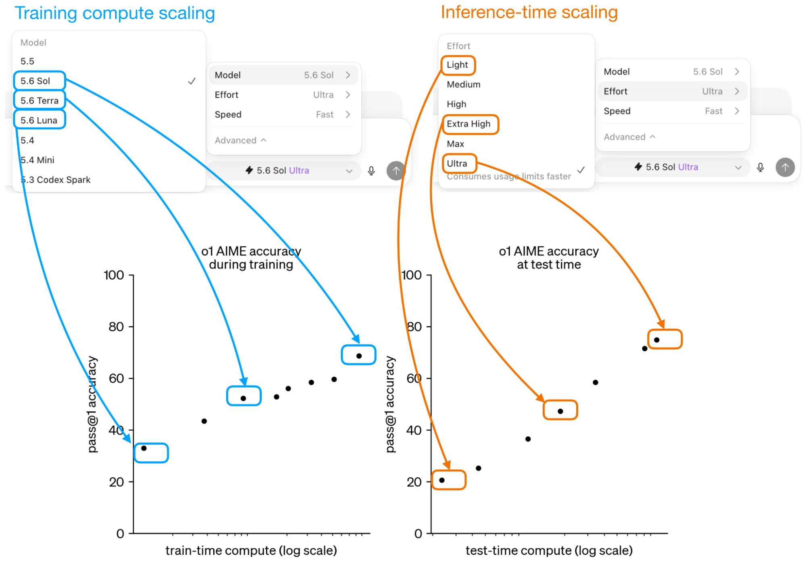
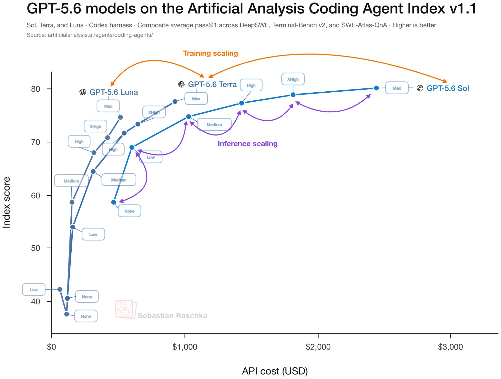

# Blog Deep Dive: Controlling Reasoning Effort in LLMs（Sebastian Raschka）

**日期**: 2026-07-20
**Tags**: #blog-deep-dive #reasoning #rlvr #inference-scaling #open-weight-models #reasoning-effort
**来源**: [Sebastian Raschka — Controlling Reasoning Effort in LLMs](https://magazine.sebastianraschka.com/p/controlling-reasoning-effort-in-llms)（*Ahead of AI*，发布于 2026-07-18）
**关联**: 本项目此前的推理模型综述与 [`research-notes/2026-07-08-blog-harness-engineering.md`](2026-07-08-blog-harness-engineering.md)（推理模型 + agent harness 视角）可对照阅读

## TL;DR

这是 Sebastian Raschka 对"**推理努力度（reasoning effort）如何被训练进模型、又如何在推理时被控制**"的一篇系统综述。核心问题：为什么 gpt-oss、GPT-5.6、DeepSeek V4、Qwen3 等模型能通过一个 `low/medium/high` 开关（或一段系统提示、一个连续标量）自由调节"想多久"？作者把答案拆成三层：

1. **推理模型是怎么来的**——DeepSeek-R1 式的 **RLVR（Reinforcement Learning with Verifiable Rewards）** 只对最终答案和格式打分（`R_total = R_accuracy + R_format`），完全不监督中间推理轨迹，却让模型自发学会回溯与自我纠错（"aha moment"）。
2. **两种正交的扩展轴**——**训练扩展（training scaling，选更大的模型）** vs. **推理扩展（inference scaling，让模型想更久）**。二者的性能曲线会重叠：一个小模型开高 effort 可以追平一个大模型开低 effort。
3. **effort 开关的具体实现**——本质是两类配方的组合：(a) 用**不同长度惩罚**的 RLVR 分别训练每档 effort；(b) 在 RLVR 之后做 **effort-conditioned SFT**。作者随后逐一拆解了 6 个开源权重模型（DeepSeek V4 / Nemotron 3 Ultra / Kimi K2.5 / GLM-5 / Qwen3 / Inkling）披露的机制。

作者的判断：目前**没有一个"最优"配方**（各家 checkpoint、数据、目标都不同）；真正的"圣杯"是**自动 effort 选择**（类似 GPT-5 被移除的 Auto 模式）。他预测 reasoning effort 未来仍会作为显式输入（走系统提示）保留，但路由层 / agent harness 会越来越多地自动推断合适档位，同时保留用户覆盖。

## 为什么值得深读

`low/medium/high` 这类开关已经是今天调用推理模型时最日常的旋钮，但"它到底改了什么、训练时怎么塞进去的"很少有人讲清楚。这篇文章难得地把**从 RLVR 训练原理 → 两种扩展轴的经济学 → 6 家开源模型的具体训练配方**串成一条完整链路，且几乎每个论点都配了自制示意图。对做 LLM 推理成本优化、agent harness 设计、或需要向他人解释"为什么开高 effort 更贵但边际收益递减"的工程场景，这是一份可直接引用的参考。

## 1｜什么是推理模型：中间推理轨迹

推理模型的定义很朴素：它在给出最终答案前，会输出一段**中间推理轨迹（intermediate reasoning trace）**——把任务一步步"想"出来。注意这里的"reasoning"是比喻，不等同于人类的推理。

## 2｜训练扩展 vs. 推理扩展：两条正交的轴

这是理解整篇文章的**总纲**。提升解题能力有两条路：

- **训练扩展（training scaling）**：投入更多训练算力 / 数据 / 参数量，得到能力更强的模型（选 Luna → Terra → Sol，或 GPT-5.6 各尺寸）。
- **推理扩展（inference scaling）**：模型训练好之后，在**推理时**花更多算力——也就是让它生成更长的推理轨迹、多次采样投票等。reasoning effort 开关调的正是这条轴。

关键洞察：**两条轴的性能曲线会重叠**——一个较小的模型开到高 effort，可以追平一个更大的模型开在低 effort。这也解释了为什么"选模型"和"选 effort"是**两个不同的菜单**、对应两个不同的扩展轴。

