# 综述：LLM 推理努力度控制（Controlling Reasoning Effort in LLMs）

**日期**: 2026-07-20
**Tags**: #survey #blog-deep-dive #reasoning #rlvr #inference-scaling #test-time-compute #efficient-reasoning #reasoning-effort
**起点**: [Sebastian Raschka — Controlling Reasoning Effort in LLMs](https://magazine.sebastianraschka.com/p/controlling-reasoning-effort-in-llms)（*Ahead of AI*，2026-07-18）
**关联**: [`research-notes/2026-07-08-blog-harness-engineering.md`](/research-notes/2026-07-08-blog-harness-engineering.md)（推理模型 + agent harness 视角）

> **说明**：本文以 Raschka 博客的**工业实践骨架**（RLVR → 两种扩展轴 → 6 家开源模型配方）为主线，向上叠加一层**学术文献综述**（§8–§12），把"推理努力度如何被控制"组织成一个可长期维护的分类法。所有 arXiv 引用均已核对并录入本项目 `references.bib`（遵循「引用须可验证」约束）。

## TL;DR

**推理努力度（reasoning effort）控制**指：在**不换模型**的前提下，通过一个开关 / 系统提示 / 连续标量 / token 预算，调节模型"想多久"（推理轨迹长度），从而在**准确率↔成本/延迟**之间移动工作点。它是"推理扩展（inference scaling）"这条轴上的用户可控旋钮。

一条贯穿全文的主线：**推理模型天生倾向"过度思考"（overthinking）**——对简单题也生成冗长轨迹，浪费算力（Sui et al. 2025 综述把这称为该领域第一性问题）。因此几乎所有 effort 控制方法，本质都是"在保住难题正确率的同时，把简单题的 token 压下来"。

围绕这条主线，本综述给出一个**分类法**：

| 层次 | 控制手段 | 代表方法 |
|---|---|---|
| **训练时** | 长度惩罚 RLVR / effort-conditioned SFT / 混合思考 | ALP、Adaptive Dual Reasoner、Qwen3 Thinking Mode Fusion |
| **推理时（L1 可控）** | 固定预算：control token、prompt 内 budget、硬截断 | BudgetThinker、Token-Budget-Aware、Nemotron truncated-trace |
| **推理时（L2 自适应）** | 按难度/置信度动态决定想多久、何时停 | ALP、Conformal Thinking、CoT2-Meta |
| **并行 vs 顺序扩展** | 多次采样投票 vs 单链加长 | self-consistency、Shortest Majority Vote |
| **表征层** | 把推理压进隐状态而非显式文本 | Implicit CoT、latent reasoning |
| **调度层** | 离线预算 / 路由自动选档 | Sleep-time Compute、自动 effort router |

Raschka 的核心判断：目前**没有单一"最优"配方**（各家 checkpoint、数据、目标都不同）；真正的"圣杯"是**自动 effort 选择**（类似 GPT-5 曾上线又移除的 Auto 模式）。学术界的两级分类法（L1 可控 / L2 自适应，Alomrani et al. 2025）与这一判断高度吻合。

## 为什么值得做成综述

`low/medium/high` 已是今天调用推理模型最日常的旋钮，但"它改了什么、训练时怎么塞进去、学界还有哪些做法"分散在工业技术报告和大量 arXiv 论文里。本文把 Raschka 讲清楚的**工业配方**与学界的**效率推理（efficient reasoning）/ test-time compute** 两大文献脉络缝合起来，供 LLM 成本优化、agent harness 设计、以及需要系统引用的场景直接取用。

## 1｜什么是推理模型：中间推理轨迹

推理模型的定义很朴素：它在给出最终答案前，会输出一段**中间推理轨迹（intermediate reasoning trace）**——把任务一步步"想"出来。注意这里的"reasoning"是比喻，不等同于人类的推理。

## 2｜训练扩展 vs. 推理扩展：两条正交的轴

这是理解整篇文章的**总纲**。提升解题能力有两条路：

- **训练扩展（training scaling）**：投入更多训练算力 / 数据 / 参数量，得到能力更强的模型（选 Luna → Terra → Sol，或 GPT-5.6 各尺寸）。
- **推理扩展（inference scaling）**：模型训练好之后，在**推理时**花更多算力——也就是让它生成更长的推理轨迹、多次采样投票等。reasoning effort 开关调的正是这条轴。

关键洞察：**两条轴的性能曲线会重叠**——一个较小的模型开到高 effort，可以追平一个更大的模型开在低 effort。这也解释了为什么"选模型"和"选 effort"是**两个不同的菜单**、对应两个不同的扩展轴。

## 3｜推理模型是怎么训出来的：RLVR

DeepSeek-R1 确立的范式是 **RLVR（Reinforcement Learning with Verifiable Rewards，可验证奖励强化学习）**：

- **只对可验证领域打二元奖励**（0 = 错，1 = 对）：数学题用 SymPy / WolframAlpha 核对答案；代码用编译器 / 单元测试判定。
- **中间推理轨迹本身不参与训练**——只有最终答案 + 输出格式决定奖励。这是全文最反直觉的一点：模型"想"的过程从不被直接监督，长链推理和自我纠错完全是被"答对"这个稀疏信号**间接催化**出来的。

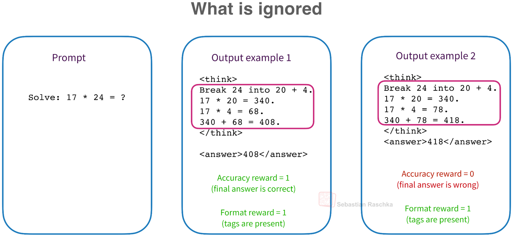

- **"Aha moment"**：仅靠输出奖励，模型就学会了中途发现错误并回溯纠正。
- **DeepSeek-R1-Zero** 证明可以**跳过 SFT，直接对预训练基座做 RLVR** 就涌现出推理行为（完整的 R1 则叠加了多阶段 SFT + RL 流水线）。
- 相关工作：**Kimi K1.5**（与 R1 同日 arXiv）、**Tülu 3**（更早提出 "RLVR" 这一术语）。

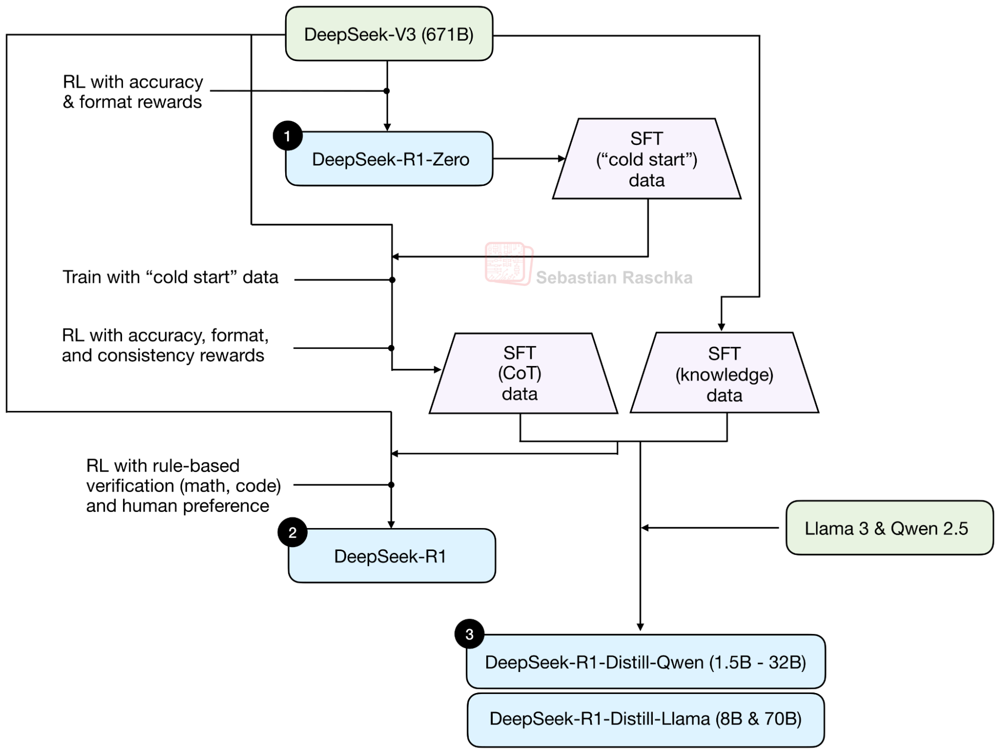

### 推理扩展（inference scaling）

训练好之后，还能在推理时继续加算力：

- **self-consistency（自洽 / 多数投票）**：对同一题多次采样，取出现最多的答案。
- **self-refinement（自我精炼）**：模型审阅并修正自己的草稿。
- 例：**DeepSeekMath-V2** 对数学奥赛题使用了极端的推理扩展（两种技术叠加）。

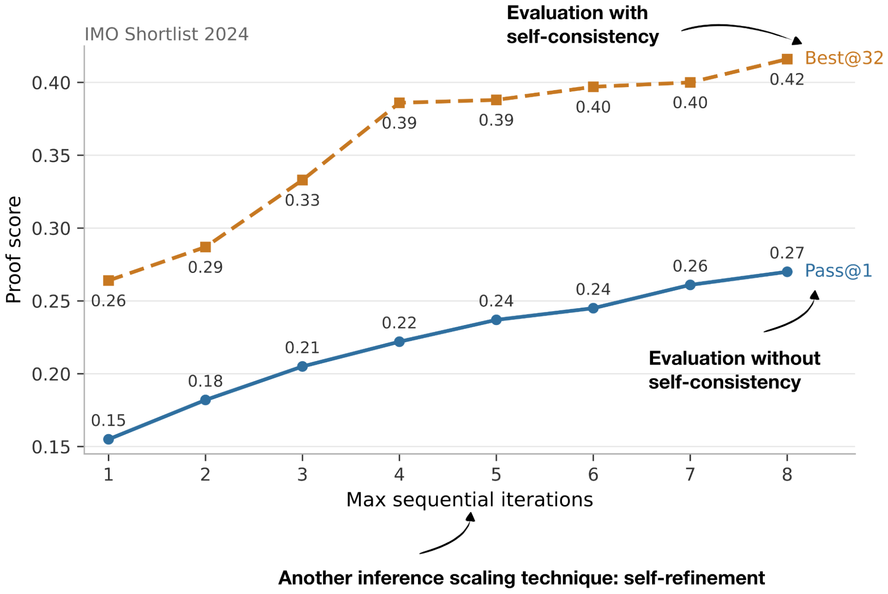

## 4｜Think Tokens：`<think></think>` 只是"化妆品"

作者强调一个常被误解的点：`<think></think>` 这类标签本身**不会提升推理能力**——它们只是给流水线 / UI 标记推理边界的"cosmetic"标记。模型之所以输出它们，是因为 RLVR 里有一项**格式奖励**（`R_total = R_accuracy + R_format`）在训练它遵守这个模板。

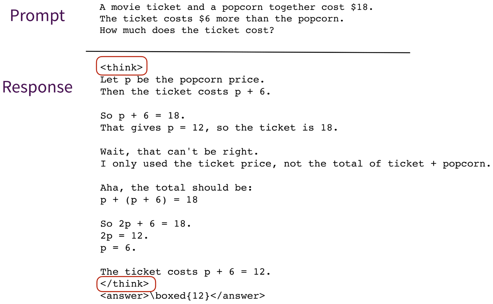

## 5｜推理模式开关：On/Off

第一代推理模型（R1）是**专用推理模型**——哪怕问它"1+1"也会长篇大论。

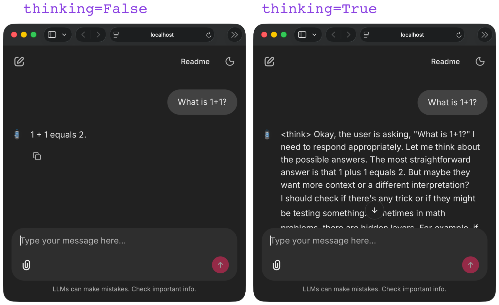

**Qwen3** 引入了混合式切换：`enable_thinking=True/False`。设为 `False` 时会插入一个**空的 `<think></think>` 块**（保持模板一致），模型直接给答案。这一开关是通过一个叫 **"Thinking Mode Fusion"** 的 SFT 阶段训练出来的——同时喂入带 `/think` 和 `/no_think` 的样本。

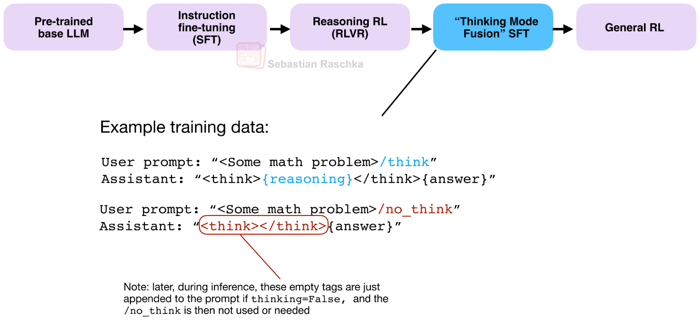

## 6｜从 On/Off 到"努力度档位"：effort 是怎么调的

从"开 / 关"进一步到"low / medium / high"甚至连续值，机制其实是同一套的推广。

### OpenAI gpt-oss：把 effort 写进系统提示

gpt-oss 通过在**系统消息**里插入一行 "Reasoning effort: low/medium/high" 来切换档位——chat template 会在发送前自动注入。

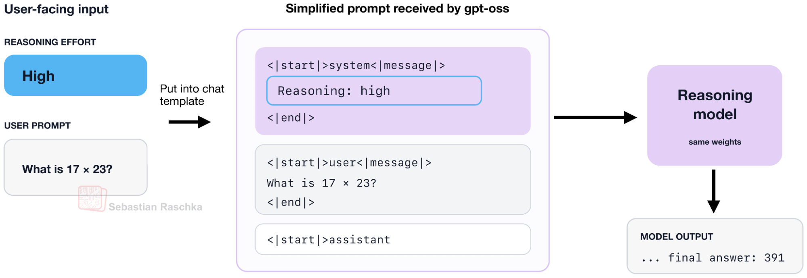

effort 越高 → token 用量越大、准确率越高，但**高档存在明显的边际递减 / 饱和**。

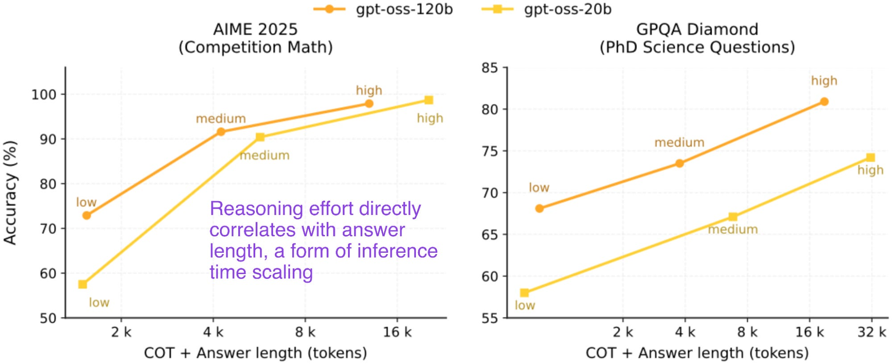

GPT-5.6 更进一步暴露了从 Light 到 Ultra 的**六档** effort。

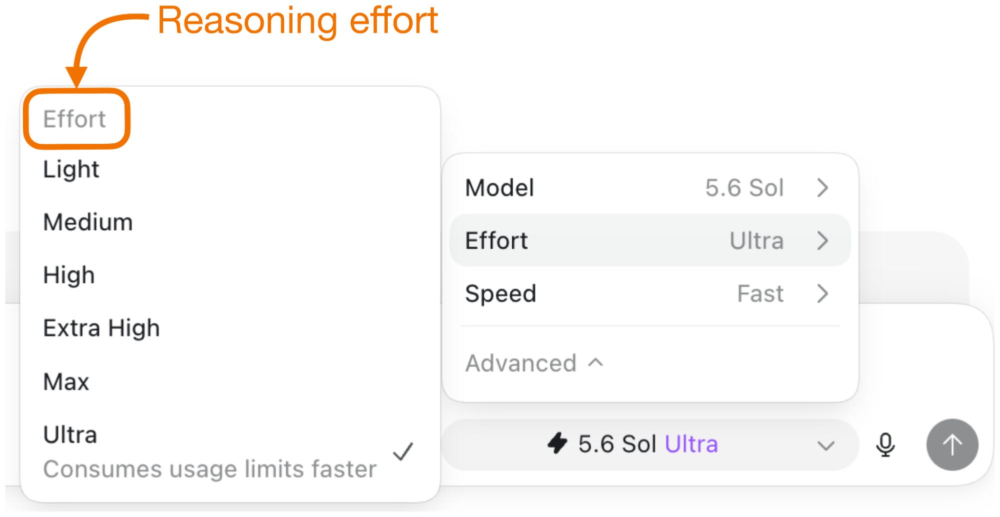

而 effort 的经济学是清晰的：**它同时抬高 API 成本和编码任务性能，但最高档收益递减**——这正是"该开多高"需要权衡的地方。

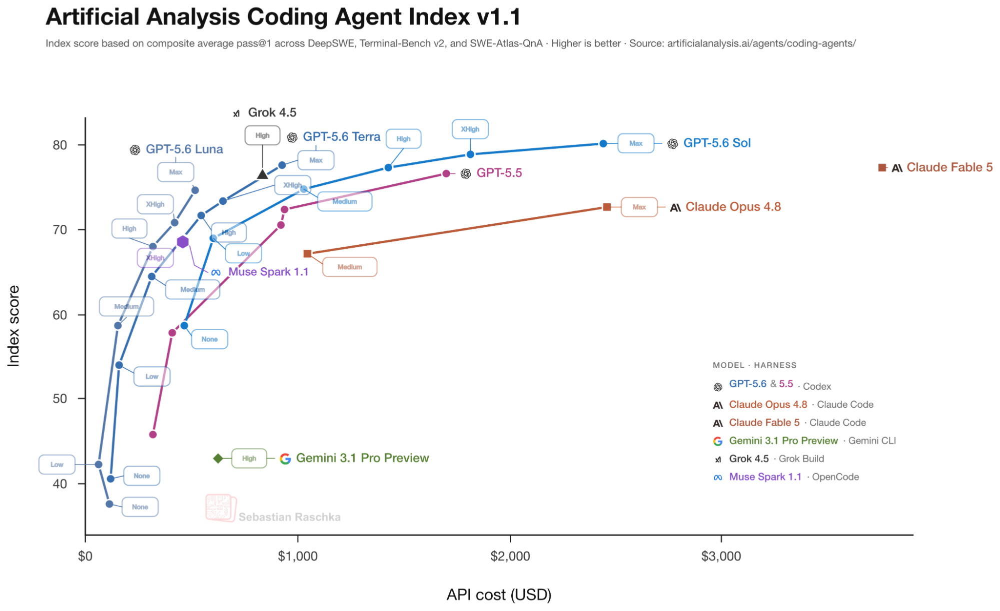

### 两类实现配方

作者把 effort 控制的训练归纳为两条（可组合）路径：

1. **带不同长度惩罚的 RLVR**：为每档 effort 单独用一个长度惩罚系数训练——低 effort = 每 token 惩罚更重，逼模型说得短。
2. **RLVR 之后的 effort-conditioned SFT**：先常规 RLVR，再用带 effort 标签的数据做条件化 SFT。

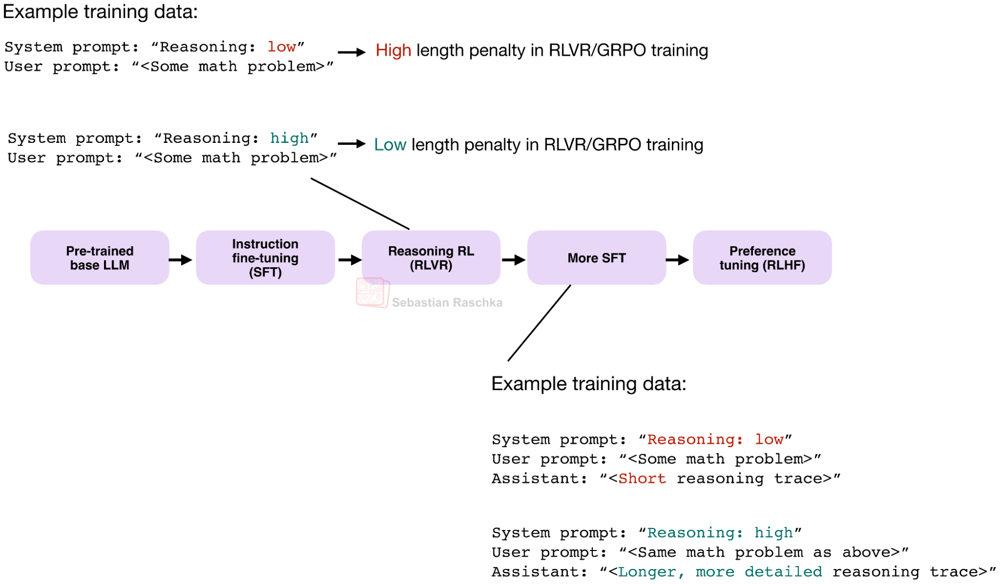

### Inkling 案例：连续 effort 值

不同于离散档位，**Inkling** 用**连续 effort 标量（0.2–0.99）**来条件化。其奖励形如：

$$R(e) = R_{\text{task}} - \lambda(e)\, N_{\text{tokens}}$$

其中 `λ(e)` 是 effort 相关的每 token 成本——effort 越低，`λ` 越大（每 token 越"贵"），从而压短输出。Inkling 通过大规模**异步 RL（30M+ rollouts）**训练这一连续条件化，effort 越高一般 token 越多、分数越高（但收益不均）。

## 7｜六个开源权重模型的具体配方（Bonus）

这是文章信息密度最高的一节。作者逐一拆解 6 个模型披露的 effort 训练机制：

| 模型 | 档位设计 | 关键训练机制 |
|---|---|---|
| **DeepSeek V4** | Non-think / Think High / Think Max（3 档） | 每档配**独立上下文窗口 + 长度惩罚**；从更大的教师池通过 **on-policy distillation** 蒸馏 |
| **Nemotron 3 Ultra** | reasoning-off / regular / medium-effort | medium-effort 用 **GPT-OSS-120B 教师轨迹 + RLVR（约 2.5% 提示）**训练；支持**硬预算**（truncated-trace SFT，随机预算截断） |
| **Kimi K2.5** | budgeted vs. unconstrained（"Toggle" 法） | 交替进行"有预算"和"无约束"RL 两阶段；**token 减少约 25–30% 而性能几乎不掉**。K3 追加 low/high/max（训练细节未披露） |
| **GLM-5** | interleaved / preserved / turn-level thinking | 通过 SFT 实现；turn-level = 逐轮 on/off 开关 |
| **Qwen3** | think / no_think + 推理时截断 | Mode Fusion（见上）+ **推理时截断**——"部分推理"行为是**涌现**的，并非显式训练 |
| **Inkling** | 连续 effort（0.0–1.0） | 异步 RL（30M+ rollouts）做连续 effort 条件化（见上） |

几个值得单独记住的细节：

- **DeepSeek V4** 把"三种 effort 模式"和"更大的教师池"写在报告的不同章节——它的高 effort 模式本质是蒸馏自更强教师。
- **Nemotron 3 Ultra** 的 medium effort 是"补"出来的一档：教师生成 SFT 数据 + 随机预算截断 + 一小撮 medium-effort RLVR 子集。它还支持**硬 token 预算**（靠 truncated-trace SFT 训出"被打断也能收尾"的鲁棒性）。

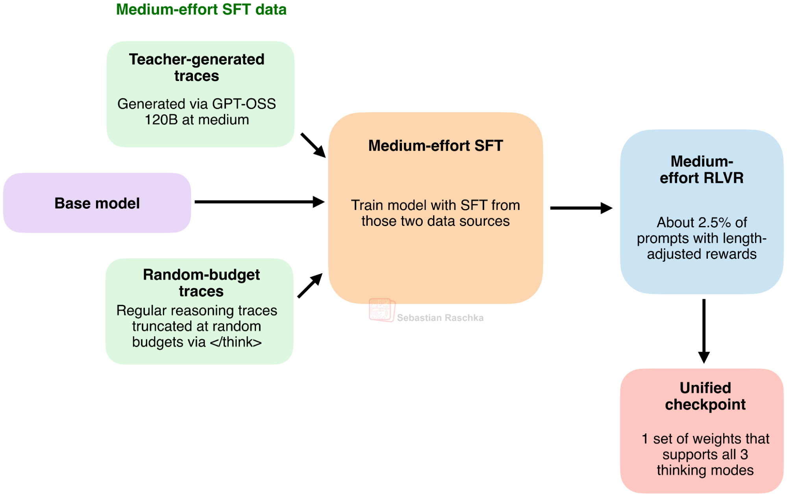

- **Kimi K2.5 的 "Toggle" 法**是本节最亮眼的结果：交替"有预算 / 无约束"两阶段 RL，让模型**token 效率大幅提升而 benchmark 性能基本持平**。

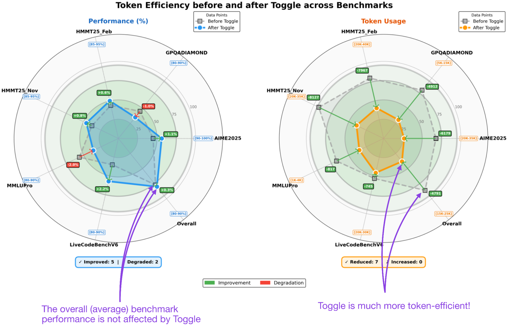

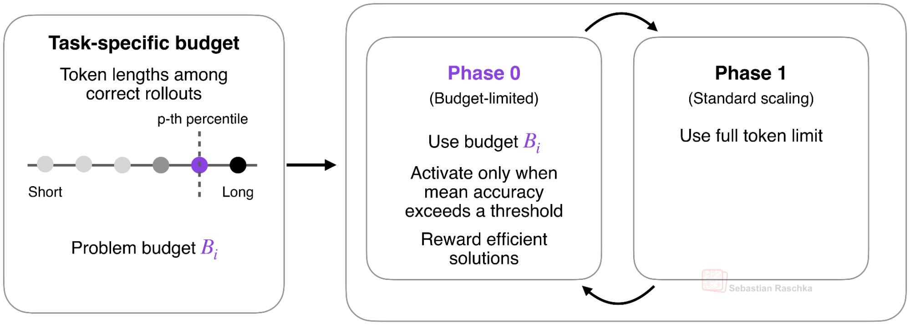

### 共通框架

尽管配方各异，作者总结出一个共同骨架：

1. **SFT + chat template** 引入 effort 控制（把档位塞进模板 / 系统消息）；
2. **mode-conditioned RL**，用不同的上下文窗口 / 长度惩罚区分各档；
3. **预算鲁棒性**：靠截断（truncation）或交替阶段（alternating phases）让模型在被打断时也能优雅收尾。

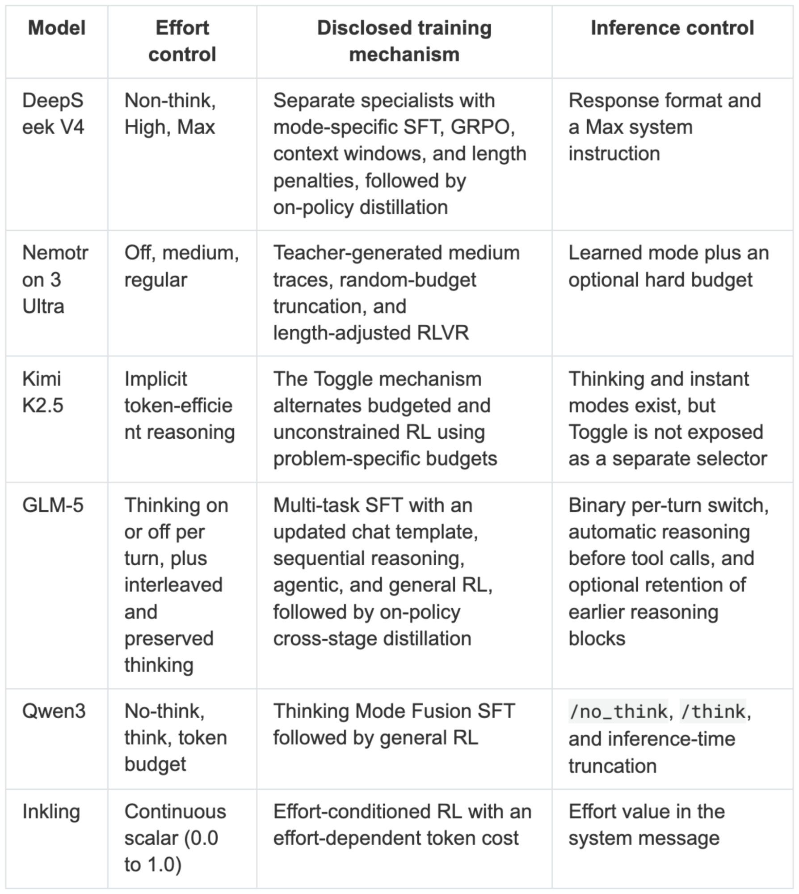

---

# 综述扩展：学术文献层

以上（§1–§7）是 Raschka 博客覆盖的**工业实践**。下面把这条主线接到学术界的两大文献脉络——**efficient reasoning（效率推理）** 与 **test-time compute（推理时算力）** 控制——补全一篇综述该有的分类法、方法谱系与评测视角。

## 8｜问题的根：过度思考（Overthinking）

effort 控制之所以成为一个独立课题，根源是 **overthinking phenomenon**：大型推理模型（LRM）倾向于对**所有**问题都生成冗长轨迹，即便是简单题——冗余 token 直接换算成成本与延迟。Sui et al. 的综述 *Stop Overthinking*（arXiv:2503.16419）把这确立为"效率推理"领域的第一性问题，并给出三分类：(1) **model-based**（把长推理模型优化/训练成简短推理模型）、(2) **reasoning-output-based**（推理时动态减少步数/长度）、(3) **input-prompt-based**（按输入难度/长度约束调节）。

一个反直觉但关键的实证（Zeng et al. *Revisiting the Test-Time Scaling of o1-like Models*，arXiv:2502.12215）：**o1 类模型的更长 CoT 并不单调提升准确率**——对同一道题，正确解往往比错误解更短；更长的轨迹里塞了更多"自我修订"，反而常常把对的改错。这为"该短则短"提供了直接证据，也是 effort 控制的正当性来源。

> Chen et al. 的 *Towards Reasoning Era: A Survey of Long CoT*（arXiv:2503.09567）从另一面梳理了 Long CoT 的三大特征（deep reasoning / extensive exploration / feasible reflection）与 overthinking、inference-time scaling 的关系，可作对照阅读。

## 9｜训练时控制：把"想多久"写进权重

§5–§7 的工业配方在学界有对应的、可复现的公开方法：

- **自适应长度惩罚 RLVR** — *Just Enough Thinking / ALP*（Xiang et al., arXiv:2506.05256）：训练中监控每个 prompt 的在线解题率，加一个**与解题率成反比的可微长度惩罚**——简单题（高解题率）多写就重罚，难题不受限。在 DeepScaleR-1.5B 上**平均 token 砍半而性能几乎不掉**，且把省下的预算重新分配给难题。这正是 Raschka 说的"每档不同长度惩罚"的一个透明实现。
- **混合思考 + 两阶段训练** — *Adaptive Dual Reasoner*（Zhang et al., arXiv:2510.10207）：SFT 冷启动注入 fast/slow 两种模式，再用熵引导的 RL（EHPO）+ 难度感知惩罚优化 effort，输出长度降 49.5%–59.3%。与 Qwen3 的 Thinking Mode Fusion（§5）是同一思路的不同实现。
- **control token + 课程式 RL** — *BudgetThinker*（Wen et al., arXiv:2508.17196）：推理中周期性插入特殊 control token 告知模型"剩余预算"，SFT 熟悉约束后再用**长度感知奖励**做课程 RL，实现对思考长度的**精确**控制。这是 Nemotron「硬预算」路线（§7）的公开对应物。

## 10｜推理时控制：不重训，直接调预算

不动权重、纯推理侧的控制方法，学界按 Alomrani et al.（*Reasoning on a Budget*，arXiv:2507.02076）的**两级分类法**组织最清晰：

- **L1-controllability（固定预算）**：调用方给死一个 token 预算，方法负责在预算内答完。
  - *Token-Budget-Aware LLM Reasoning*（Han et al., arXiv:2412.18547）：直接在 prompt 里写入一个"合理 token 预算"，并按题目复杂度动态选预算——几乎零成本地压缩 CoT。
  - *CROP*（Shah et al., arXiv:2604.14214）：用带长度正则的自动 prompt 优化，token 消耗降 80.6% 而准确率仅微降。
- **L2-adaptiveness（按难度/置信度自适应）**：方法自己决定想多久、何时停。
  - *Conformal Thinking*（Wang et al., arXiv:2602.03814）：把"设预算"重构成**风险控制**问题——用 distribution-free risk control 设置"够自信就停"的上阈值和"无解就早停"的下阈值，在用户指定风险上界下最小化算力。
  - *CoT2-Meta*（Ma et al., arXiv:2603.28135）：**免训练**的元认知控制器，在树搜索上决定何时扩展、剪枝、修复、停止、回退；同等预算下稳定超过单路径/采样/搜索基线。

这一 L1/L2 划分与 Raschka 的"离散档位 vs 连续 effort / 自动选档"叙述是同一结构的两种说法。

## 11｜并行 vs 顺序：花掉 effort 的两种花法

同样的 token 预算，可以花在**一条更长的链**（顺序扩展）上，也可以花在**多条链投票**（并行扩展 / self-consistency）上。Zeng et al.（arXiv:2502.12215）发现在 QwQ/R1/LIMO 上**并行扩展的覆盖率与可扩展性更好**，并提出 **Shortest Majority Vote**——结合并行采样与"正确解更短"的先验，显著优于普通多数投票。这给"高 effort 到底该怎么花"提供了一个与"单纯加长"不同的答案，也是 §3 里 self-consistency（DeepSeekMath-V2）在 effort 语境下的延伸。

## 12｜相邻方向：表征层与调度层

- **表征层（把推理藏进隐状态）** — *Implicit Chain of Thought*（Deng et al., arXiv:2311.01460）：从显式 CoT 教师蒸馏出"垂直"发生在各层隐状态间的隐式推理，无需吐出中间 token 就能解题、速度接近 no-CoT。这是 effort 控制的极端形态——把"想"的成本从输出 token 挪进前向计算，与本项目 [`2026-07-08-blog-global-workspace.md`](/research-notes/2026-07-08-blog-global-workspace.md) 里"模型没说出口的内部想法"呼应。
- **调度层（在会话/系统层面省 effort）** — *Sleep-time Compute*（Lin et al., arXiv:2504.13171）：让模型在 query 到来**之前**离线"预想"上下文、预计算有用量，把 test-time 算力需求降约 5×；对同一上下文的多个相关 query 摊薄成本再降 2.5×。这把"省 effort"从单次调用推广到了 agent/会话调度层。
- **宏观脉络** — RLVR 作为推理能力的驱动力，其在 LLM 全生命周期中的位置见 Liu et al. 的综述 *Reinforcement Learning Meets LLMs*（arXiv:2509.16679）；CoT 的开山之作是 Wei et al.（arXiv:2201.11903）。

## 综述作者视角 + 我的评述

- **最有工程价值的一点**是 effort 的经济学曲线（Fig 19 / 24）：高档 effort 边际收益递减，意味着"默认拉满"往往是浪费——真正省钱的做法是按任务难度**分档路由**。这与本项目上一篇 [`2026-07-08-blog-harness-engineering.md`](/research-notes/2026-07-08-blog-harness-engineering.md) 里"harness 承担越来越多决策"的趋势一致：effort 选择正在从"用户手动旋钮"往"harness/router 自动推断"迁移。
- **Kimi K2.5 的 Toggle 结果**（token −25~30% 而性能持平）值得单独关注——它说明当前推理模型在默认档位下存在大量"过度思考"的冗余 token，交替预算 RL 是一条可复现的压缩路径。
- 一个方法论提醒：文章里 effort-conditioned RLVR/SFT 的示意图（Fig 21）作者**明确标注是"可能的实现，非 OpenAI 官方确认"**——闭源模型的 effort 机制多为推测，只有开源权重模型（第 7 节 6 家）的机制是有技术报告背书的。引用时要区分这两类可信度。
- 文章使用了 2026 年的前瞻性命名（GPT-5.6、DeepSeek V4、Inkling 等），部分为作者的框架化叙述而非全部已发布产品——转述时需注明。

## Open Questions

1. **自动 effort 选择（"圣杯"）**能否稳健实现？GPT-5 曾上线又移除 Auto 模式说明这不简单——难点在于"预判一道题需要多少思考"本身可能就需要思考。router 层的轻量分类器（L2 自适应）vs. 让模型自己决定，哪条路更实际？Conformal Thinking 的"风险控制"框架是否给出了一条可证明的中间路线？
2. Kimi Toggle 的"token −25~30% 性能持平"能否推广到**代码 / agent 长程任务**？现有结果（含 ALP、Adaptive Dual Reasoner）多在数学 / 通用 benchmark 上，长程任务对"想够不够久"更敏感。
3. **连续 effort（Inkling）vs. 离散档位**在实际部署中的取舍：连续值给了更细的成本控制，但对调用方和缓存 / 路由基础设施更复杂——哪种会成为 API 事实标准？
4. 硬 token 预算（Nemotron truncated-trace SFT / BudgetThinker）训出的"被打断也能收尾"能力，会不会诱导模型学会"敷衍式收尾"、在预算内牺牲正确性？如何在奖励里平衡"守预算"与"守正确性"？
5. **并行 vs 顺序**扩展的最优配比是否依赖任务？Shortest Majority Vote 表明并行覆盖率更好，但并行扩展与"单条长链的自我修订"在难题上的收益结构可能不同——effort 旋钮应不应该同时暴露"链数"和"链长"两个维度？
6. 表征层的隐式推理（Implicit CoT / latent reasoning）能把多少 effort 从输出 token 挪进前向计算而不损失可解释性与可监控性？这与安全监控（读出模型没说出口的想法）是否存在张力？

## 文献地图（均已入 `references.bib`，可验证）

**工业配方（Raschka 博客主线，§1–§7）**
- **DeepSeek-R1** — arXiv:2501.12948（`DeepSeekAI2025Deepseek`）：RLVR 范式、R1-Zero
- **Kimi K1.5** — arXiv:2501.12599：与 R1 同期的 RL 推理工作
- **Tülu 3** — arXiv:2411.15124（`Lambert2024Tulu`）：更早提出 "RLVR" 术语
- **Qwen3** — arXiv:2505.09388（`Yang2025Qwen3`）：Thinking Mode Fusion、enable_thinking 开关
- **DeepSeekMath-V2** — arXiv:2511.22570（`Shao2025Deepseekmath`）：极端推理扩展

**综述 / 分类法（§8, §10）**
- **Stop Overthinking** — arXiv:2503.16419（`Sui2025Stop`）：效率推理综述，三分类
- **Reasoning on a Budget** — arXiv:2507.02076（`Alomrani2025Reasoning`）：test-time compute 综述，L1/L2 两级分类法
- **Towards Reasoning Era (Long CoT Survey)** — arXiv:2503.09567（`Chen2025Towards`）
- **RL Meets LLMs** — arXiv:2509.16679（`Liu2025Reinforcement`）：RLVR 在全生命周期中的位置

**训练时控制（§9）**
- **ALP / Just Enough Thinking** — arXiv:2506.05256（`Xiang2025Just`）：自适应长度惩罚 RLVR
- **Adaptive Dual Reasoner** — arXiv:2510.10207（`Zhang2025Adaptive`）：fast/slow 混合思考 + EHPO
- **BudgetThinker** — arXiv:2508.17196（`Wen2025Budgetthinker`）：control token + 课程 RL

**推理时控制（§10）**
- **Token-Budget-Aware Reasoning** — arXiv:2412.18547（`Han2024Token`）
- **CROP** — arXiv:2604.14214（`Shah2026Crop`）：长度正则的 prompt 优化
- **Conformal Thinking** — arXiv:2602.03814（`Wang2026Conformal`）：风险控制式早停
- **CoT2-Meta** — arXiv:2603.28135（`Ma2026Cot2`）：免训练元认知控制

**并行/顺序 & 表征/调度（§11–§12）**
- **Revisiting Test-Time Scaling of o1-like Models** — arXiv:2502.12215（`Zeng2025Revisiting`）：Shortest Majority Vote、"更长≠更准"
- **Implicit CoT** — arXiv:2311.01460（`Deng2023Implicit`）：隐式推理
- **Sleep-time Compute** — arXiv:2504.13171（`Lin2025Sleep`）：离线预算调度
- **Chain-of-Thought Prompting** — arXiv:2201.11903（`Wei2022Chain`）：CoT 开山之作

> 闭源 / 仅技术报告的模型（DeepSeek V4、Nemotron 3 Ultra、Kimi K2.5、GLM-5、Inkling、gpt-oss、GPT-5.6）依据官方技术报告 / 模型卡，非 arXiv，故未入库；引用时应指向对应技术报告。Raschka 文中的部分模型名为 2026 前瞻性叙述，转述时需注明。

## 延伸阅读

- 起点原文：[Controlling Reasoning Effort in LLMs](https://magazine.sebastianraschka.com/p/controlling-reasoning-effort-in-llms)（含全部 33 张配图与作者 *Build a Reasoning Model (From Scratch)* 一书链接）
- [`2026-07-08-blog-harness-engineering.md`](/research-notes/2026-07-08-blog-harness-engineering.md)（Lilian Weng，推理模型 + self-improvement harness）——"如何调度推理能力"
- [`2026-07-08-blog-global-workspace.md`](/research-notes/2026-07-08-blog-global-workspace.md)（Anthropic，模型未说出口的内部想法）——与 §12 隐式推理 / 安全监控张力相关
