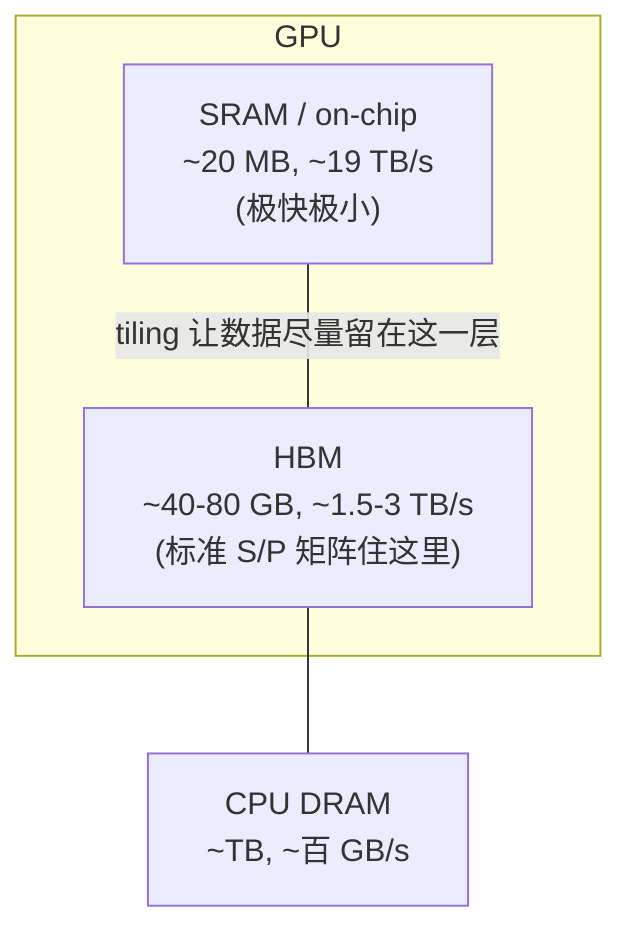
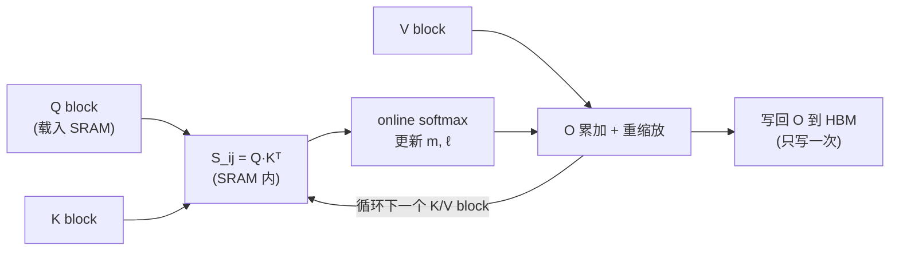

# 综述：FlashAttention 与高效注意力机制（IO-aware / 长上下文 / 推理服务）

- **Date:** 2026-07-20
- **Tags:** #survey #attention #flash-attention #io-aware #long-context #kv-cache #gpu-kernels #inference-serving

## Context

自注意力（self-attention）是 Transformer 的核心，也是它在长序列上的**瓶颈**：时间与显存都随序列长度 $N$ **二次增长**（$O(N^2)$）。过去几年围绕"如何让注意力更快、更省显存、又不牺牲精度"形成了几条清晰的技术路线，其中 **FlashAttention 系列**（v1/v2/v3）是最具影响力的一支——它不改变注意力的数学定义（**精确注意力，exact attention**），而是从 **GPU 访存（IO）** 的角度重写了算法。

本综述以 FlashAttention 为主轴，向外辐射到三个相邻方向：**数值基础**（online softmax）、**推理服务侧的显存/带宽优化**（MQA/GQA、PagedAttention、Ring Attention）、以及作为对照的**近似注意力**（Longformer/Reformer/线性注意力）。所有 arXiv 引用均已核对并录入本项目 `references.bib`（遵循「引用须可验证」约束）。

## Main Content

### 1｜为什么标准注意力慢：不是算力，是访存

给定 $Q, K, V \in \mathbb{R}^{N\times d}$，标准注意力是：

$$S = QK^\top \in \mathbb{R}^{N\times N},\quad P = \mathrm{softmax}(S),\quad O = PV$$

朴素实现会把中间矩阵 $S$ 和 $P$（都是 $N\times N$）**物化（materialize）到 GPU 高带宽显存（HBM）**。问题不在浮点运算量，而在**访存**：

- **显存**：$O(N^2)$——序列一长就爆显存。
- **访存量**：反复把 $N\times N$ 的矩阵写出 HBM 再读回，HBM 访问次数是 $O(N^2)$ 级。

关键事实是 GPU 的**存储层级**带宽差异巨大——片上 SRAM 比 HBM 快一个数量级以上，但容量极小。标准注意力的瓶颈是 **memory-bound**（受 HBM 带宽限制），而非 compute-bound。

FlashAttention 的核心洞察（Dao et al. 2022, `Dao2022Flashattention`）：**让注意力算法 IO-aware**——显式地减少 HBM↔SRAM 之间的读写次数，哪怕多做一些重复计算也值得。

### 2｜数值基础：Online Softmax

要在**不物化整行** $S$ 的前提下算 softmax，需要**增量式（online）softmax**。softmax 为数值稳定要减去行最大值 $m$：$\mathrm{softmax}(x)_i = e^{x_i-m}/\sum_j e^{x_j-m}$。

当分块逐步看到新的一段分数时，维护两个**运行统计量**：运行最大值 $m$ 与运行归一化和 $\ell$。每来一个新块，更新 $m^{\text{new}}=\max(m^{\text{old}}, \tilde m)$，并把**已累积的输出与归一化和**按 $e^{m^{\text{old}}-m^{\text{new}}}$ 重新缩放，再并入新块贡献。这样即可在只保留 $O(d)$ 状态的情况下得到与全量 softmax **数值等价**的结果。

> Online softmax 是 Milakov & Gimelshein（2018）提出的技巧，FlashAttention 把它从"逐元素"推广到"逐块（tile）"，是整个算法能成立的数学前提。Rabe & Staats（2021, `Rabe2021Self`）几乎同期用同一思想证明了 *"Self-attention Does Not Need $O(n^2)$ Memory"*——注意力可在 $O(\log N)$ 额外显存内计算，是 FlashAttention 的直接理论前驱。

### 3｜FlashAttention v1：Tiling + Recomputation

论文 *FlashAttention: Fast and Memory-Efficient Exact Attention with IO-Awareness*（Dao et al. 2022, `Dao2022Flashattention`，arXiv:2205.14135）。两大技术：

1. **Tiling（分块 + kernel fusion）**：把 $Q,K,V$ 切成能塞进 SRAM 的小块，在 SRAM 内完成"$QK^\top$ → online softmax → 乘 $V$ 累加"的整条链路，**从不把 $N\times N$ 的 $S/P$ 写回 HBM**。整个前向是一个融合的 CUDA kernel。
2. **Recomputation（重计算，省反向显存）**：反向传播本需要 $S,P$。FlashAttention 前向**只存输出 $O$ 和统计量 $(m,\ell)$**，反向时用它们在 SRAM 里**重算** $S,P$。用少量重复计算换掉了 $O(N^2)$ 的激活显存。

**IO 复杂度**：HBM 访问从标准的 $\Theta(N^2)$ 降到 $\Theta(N^2 d^2 / M)$（$M$ 为 SRAM 大小），论文证明这在一定 SRAM 范围内是**最优**的。

**效果**：BERT-large 端到端加速 15%（超 MLPerf 1.1 记录）、GPT-2 加速 3×、long-range arena 2.4×；显存从二次降到线性，首次让 Transformer 在 Path-X（序列 16K）上取得优于随机的成绩。

### 4｜FlashAttention-2：把 GPU 喂饱

论文 *FlashAttention-2: Faster Attention with Better Parallelism and Work Partitioning*（Dao 2023, `Dao2023Flashattention`，arXiv:2307.08691）。v1 虽省显存，但 GPU 利用率仍不高（A100 上约 25–40%）。v2 从**并行度与工作划分**下手：

1. **减少非矩阵乘（non-matmul）FLOPs**：GPU 的 Tensor Core 对 matmul 极快，但 softmax 里的缩放/指数是"慢"运算。v2 重排计算（例如把重缩放推迟、循环末尾再做一次归一化），尽量让热路径都是 matmul。
2. **在序列长度维度上并行**：v1 主要按 batch×heads 并行；序列很长、batch 很小时并行度不足。v2 额外**沿序列维切分并行**，把更多 thread block 铺满 SM。
3. **更好的 warp 间工作划分**：调整 $Q$ 与 $K/V$ 在 warp 间的分配，减少共享内存的读写与同步。

**效果**：比 v1 再快约 **2×**，A100 上达到约 **50–73%** 的理论峰值利用率，接近 GEMM 效率。

### 5｜FlashAttention-3：拥抱 Hopper 的异步与低精度

论文 *FlashAttention-3*（Shah et al. 2024, `ShahndFlashattention`，arXiv:2407.08608）。背景：FA2 在 H100（Hopper）上只有约 35% 利用率，因为没用上新硬件特性。三招：

1. **Warp-specialization（生产者/消费者 + TMA）**：用 Hopper 的 Tensor Memory Accelerator 异步搬数据，让"搬数据"和"算"的 warp 分工重叠，**overlap 计算与数据移动**。
2. **交错 matmul 与 softmax**：块级 GEMM 与 softmax 交替流水，用 Tensor Core 的异步性把 softmax 的延迟藏进 matmul。
3. **FP8 低精度 + block quantization + incoherent processing**：借硬件 FP8 支持提吞吐，用分块量化和"非相干处理"（对 $Q,K$ 乘随机正交矩阵，摊平离群值）压低量化误差。

**效果**：H100 上比 FA2 快 **1.5–2.0×**，FP16 达 **740 TFLOPs/s（75% 利用率）**，FP8 接近 **1.2 PFLOPs/s**，且 FP8 数值误差比基线 FP8 注意力低 **2.6×**。

> 三代主线可总结为：**v1 解决"要不要物化"（省显存、减 IO）→ v2 解决"并行够不够"（喂饱 SM）→ v3 解决"用没用上新硬件"（异步 + FP8）**。三者都是**精确注意力**，不改变模型输出分布（FP8 除量化误差外）。

### 6｜推理服务侧：KV cache 才是自回归的大头

FlashAttention 主要优化**单次注意力算子**（训练 + prefill 都受益）。但在**自回归解码（decode）**阶段，瓶颈换成了 **KV cache**：每生成一个 token 都要读一遍历史所有 token 的 $K,V$。这是纯 memory-bound 的场景，衍生出另一条优化线。

**(a) 共享 KV 头：MQA → GQA**
- **Multi-Query Attention（MQA）**（Shazeer 2019, `Shazeer2019Fast`，arXiv:1911.02150）：让所有 query 头**共享同一组** $K,V$ 头。KV cache 显存和读带宽按头数倍缩小，大幅加速解码——但质量有损、训练易不稳。
- **Grouped-Query Attention（GQA）**（Ainslie et al. 2023, `Ainslie2023Gqa`，arXiv:2305.13245）：折中——把 query 头分成若干组，每组共享一组 KV。MQA 是"1 组"、MHA 是"$H$ 组"的两端，GQA 取中间。它以接近 MHA 的质量拿到接近 MQA 的速度，已成 Llama-2/3 等主流模型的默认配置。

**(b) 显存管理：PagedAttention**
- **PagedAttention / vLLM**（Kwon et al. 2023, `Kwon2023Efficient`，arXiv:2309.06180）：借鉴操作系统**虚拟内存分页**思想管理 KV cache。传统做法为每个请求预留连续大块显存，导致严重的**内部/外部碎片**和无法共享。PagedAttention 把 KV cache 切成固定大小的 **block（页）**，按需分配、非连续存储、用"页表"索引，还能在 beam search / 并行采样间**共享**公共前缀的页（copy-on-write）。显存浪费从 60–80% 降到 <4%，吞吐相对此前系统提升数倍。这是 **vLLM** 的核心。

**(c) 序列并行：Ring Attention**
- **Ring Attention with Blockwise Transformers**（Liu et al. 2023, `Liu2023Ring`，arXiv:2310.01889）：把长序列的 $K,V$ 块**分散到多张设备**，各设备算本地块，同时把 KV 块沿"环形"拓扑传给下一张卡，**用计算掩盖通信**。理论上上下文长度随设备数线性扩展，达到"近乎无限上下文"。与 FlashAttention 正交、可叠加（每张卡内部仍用 Flash 算子）。

### 7｜对照组：近似注意力（approximate attention）

在 FlashAttention 之前，主流思路是**改注意力的数学定义**换取次二次复杂度。这类方法与 FlashAttention 本质不同——**牺牲精确性**，且常常"理论 FLOPs 降了但 wall-clock 没快"。列为对照：

| 方法 | 机制 | 复杂度 | 代价 |
|---|---|---|---|
| **Longformer**（Beltagy 2020, `Beltagy2020Longformer`） | 滑窗 + 全局 token 的**稀疏**注意力 | $O(N)$ | 稀疏模式需人工设计；非精确 |
| **Reformer**（Kitaev 2020, `Kitaev2020Reformer`） | LSH 把相似 query 分桶 + 可逆层 | $O(N\log N)$ | 近似检索误差；实现复杂 |
| **Linear Attention / Transformers-are-RNNs**（Katharopoulos 2020, `Katharopoulos2020Transformers`） | 核特征映射，去掉 softmax，改写成线性递推 | $O(N)$ | 表达力/质量下降 |
| **Performers**（Choromanski 2020, `Choromanski2020Rethinking`） | FAVOR+ 随机特征无偏逼近 softmax 核 | $O(N)$ | 随机逼近方差；长序列质量波动 |

FlashAttention 的历史意义正在于：它证明了**不必牺牲精确性**——只要把访存问题解决好，精确注意力就能又快又省，从而让上面大半近似方法在通用场景下"退场"。近似/稀疏注意力如今主要活跃在**超长上下文**（几十万~百万 token）等 Flash 也扛不住的极端场景。

### 8｜前沿延伸：Differential Transformer

- **Differential Transformer**（Ye et al. 2024, `Ye2024Differential`，arXiv:2410.05258）：不是为了"快"，而是改注意力**质量**——用两个 softmax 注意力图相减（类比降噪耳机的差分），抵消对无关上下文的注意力噪声，缓解长上下文里的"lost in the middle"与幻觉。列此说明"高效注意力"之外，注意力机制本身仍在演进；它与 FlashAttention 正交（差分的每一支仍可用 Flash 算子实现）。

### 9｜怎么选（实践速查）

- **训练 / prefill 长序列** → FlashAttention（有 Hopper 用 v3，否则 v2）；单算子直接换，精确无损。
- **单卡装不下上下文** → Ring Attention（跨卡序列并行）叠加 Flash 算子。
- **高并发推理服务** → vLLM 的 PagedAttention 管 KV cache + 模型本身用 GQA。
- **要压 KV cache 显存/带宽** → 模型层面选 GQA（新训）或 MQA（激进）。
- **百万级超长上下文、可容忍近似** → 才考虑稀疏/线性注意力。

## 我的评述

- **FlashAttention 的方法论价值 > 具体 kernel**：它把"注意力慢"从一个"算法复杂度"问题重新定义为"**访存/IO**"问题，这个视角（roofline / memory-bound 分析）现在几乎是所有 GPU 算子优化的默认起点。记住结论"是访存不是算力"，比记住 tiling 的具体循环更重要。
- **精确 vs 近似的胜负手是 wall-clock**：2020 年前后一大批 $O(N)$/$O(N\log N)$ 近似注意力，理论 FLOPs 漂亮但实际不快，正是因为忽视了访存常数与硬件利用率。FlashAttention 用"精确但 IO 最优"证明了硬件感知的工程胜过纸面复杂度——这是对整个领域的一次校正。
- **训练算子 ≠ 推理瓶颈**：初学者常把 FlashAttention 当成"注意力优化"的全部。但自回归 decode 的瓶颈是 KV cache 的读带宽与显存，那是 GQA/PagedAttention 的战场。二者正交、要分开看——真实系统（如 vLLM + GQA + FlashAttention）是它们的叠加。
- **一个可信度提醒**：三代 FlashAttention 与 PagedAttention 都有 arXiv 论文和开源实现，可复现性强；性能数字（TFLOPs、利用率）依赖具体 GPU/序列长度/dtype，转述时应连同硬件条件一起给，不要脱离上下文引用峰值数。

## Open Questions

1. FA3 的 **FP8 + incoherent processing** 在训练（而非仅推理）中能否稳定？低精度注意力对训练动力学（尤其长上下文下的梯度）的影响仍缺乏系统评测。
2. FlashAttention（精确、IO 最优）与**稀疏/线性注意力**（近似、次二次）在百万级上下文上的交叉点在哪？是否会出现"Flash 打底 + 稀疏兜超长尾部"的混合算子成为标准？
3. PagedAttention 的分页思想能否推广到 KV cache 的**跨请求/跨会话持久化与共享**（prefix caching 已是雏形）？页级共享 + 量化 KV 的组合上限是多少？
4. Ring Attention 的通信-计算重叠在**异构/跨节点**网络（非理想环形拓扑、带宽不均）下的实际扩展效率如何？与 FSDP/张量并行的最优组合是什么？
5. 硬件迭代（Blackwell 及以后）会不会让"手写 IO-aware kernel"被编译器/DSL（Triton、CUTLASS 抽象）自动生成取代？FlashAttention 是否终将成为编译目标而非手写库？

## References

> 均已录入 `references/references.bib`（arXiv 可验证）。

**FlashAttention 主线**
- FlashAttention（v1）— Dao et al. 2022，arXiv:2205.14135（`Dao2022Flashattention`）
- FlashAttention-2 — Dao 2023，arXiv:2307.08691（`Dao2023Flashattention`）
- FlashAttention-3 — Shah et al. 2024，arXiv:2407.08608（`ShahndFlashattention`）
- Self-attention Does Not Need $O(n^2)$ Memory — Rabe & Staats 2021，arXiv:2112.05682（`Rabe2021Self`）
- Attention Is All You Need（原始 Transformer）— Vaswani et al. 2017，arXiv:1706.03762（`Vaswani2017Attention`）

**推理服务侧（KV cache）**
- Fast Transformer Decoding / MQA — Shazeer 2019，arXiv:1911.02150（`Shazeer2019Fast`）
- GQA — Ainslie et al. 2023，arXiv:2305.13245（`Ainslie2023Gqa`）
- PagedAttention / vLLM — Kwon et al. 2023，arXiv:2309.06180（`Kwon2023Efficient`）
- Ring Attention — Liu et al. 2023，arXiv:2310.01889（`Liu2023Ring`）

**对照：近似 / 稀疏 / 线性注意力**
- Longformer — Beltagy et al. 2020，arXiv:2004.05150（`Beltagy2020Longformer`）
- Reformer — Kitaev et al. 2020，arXiv:2001.04451（`Kitaev2020Reformer`）
- Transformers are RNNs（线性注意力）— Katharopoulos et al. 2020，arXiv:2006.16236（`Katharopoulos2020Transformers`）
- Performers — Choromanski et al. 2020，arXiv:2009.14794（`Choromanski2020Rethinking`）

**前沿延伸**
- Differential Transformer — Ye et al. 2024，arXiv:2410.05258（`Ye2024Differential`）

> Online softmax 的原始出处 Milakov & Gimelshein (2018, *Online normalizer calculation for softmax*, arXiv:1805.02867) 为数值技巧短文；如需引用可另行 `add_paper.py` 收录。
