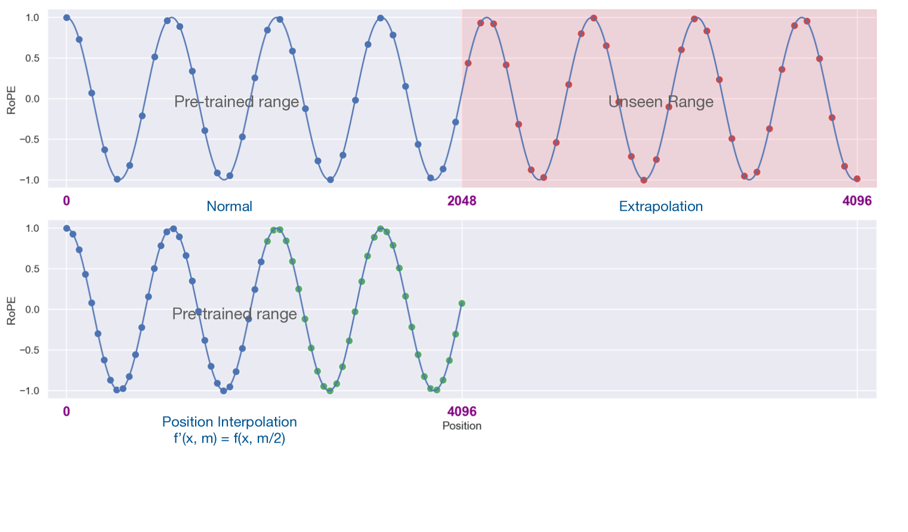
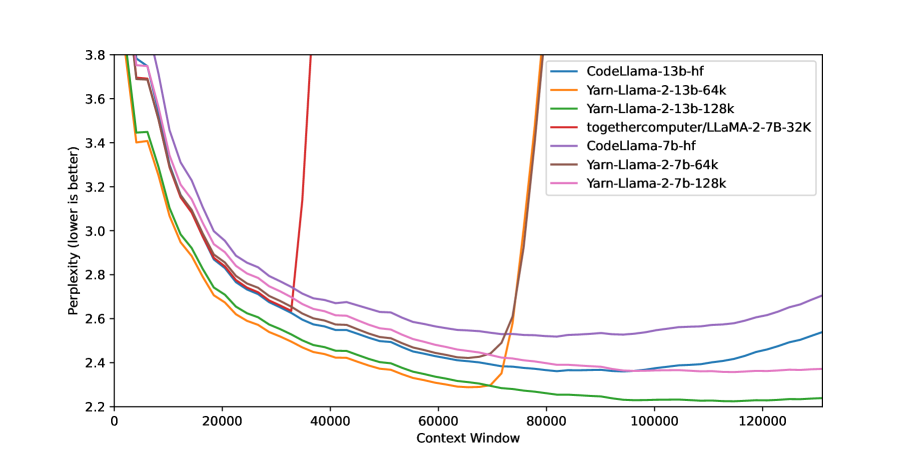
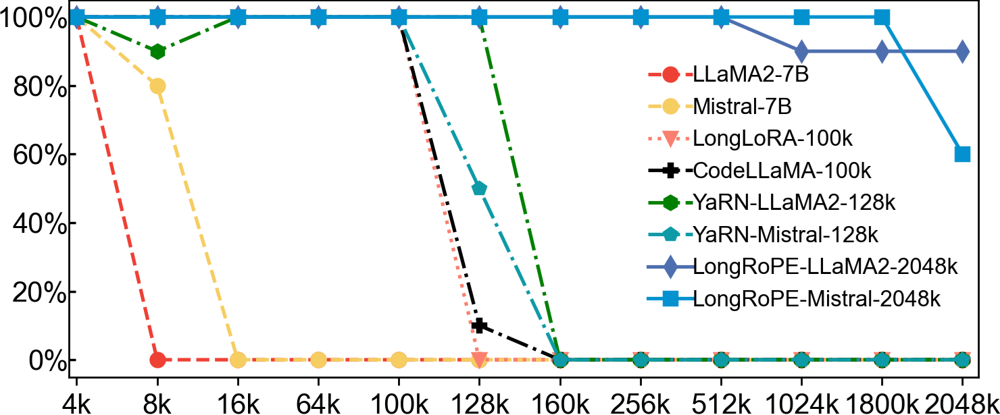
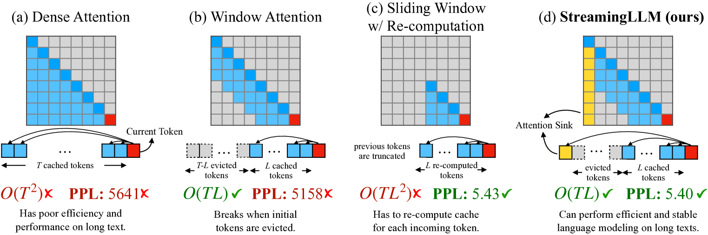
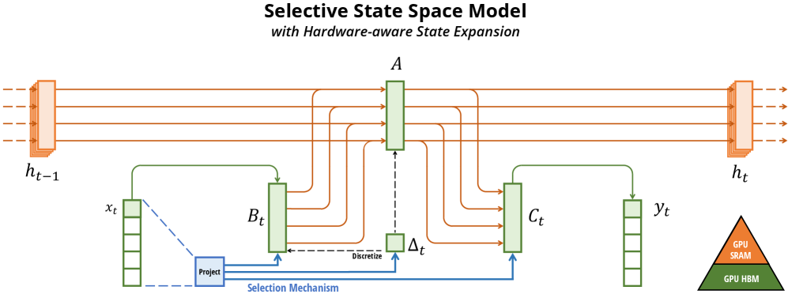
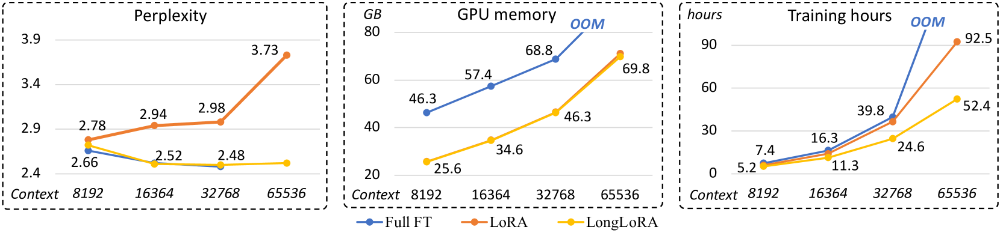
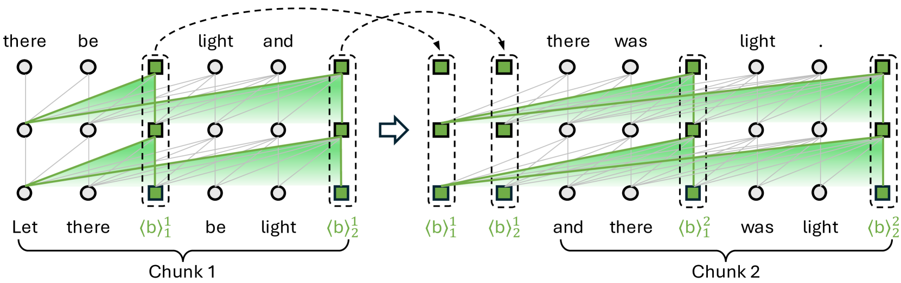
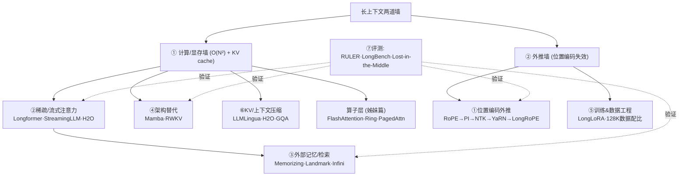

# 综述：LLM 长上下文是如何做到的（位置外推 / 稀疏注意力 / 记忆 / 架构 / 训练 / 评测）

- **Date:** 2026-07-20
- **Tags:** #survey #long-context #rope #position-extrapolation #sparse-attention #kv-cache #ssm #retrieval #evaluation

## Context

"上下文窗口"从 GPT-3 的 2K 一路涨到今天的 128K、1M 甚至 10M token。但把窗口做长有两道**本质障碍**：

1. **计算/显存墙**——自注意力对序列长度 $N$ 是 $O(N^2)$，且自回归解码的 KV cache 随 $N$ 线性膨胀（见姊妹篇 [`2026-07-20-flash-attention-efficient-attention.md`](/research-notes/2026-07-20-flash-attention-efficient-attention.md)，本篇不重复算子层面）。
2. **长度外推墙**——模型在短序列上训练，直接喂更长序列时**位置编码失效、注意力被稀释**，性能崩塌。

本综述聚焦"**怎么让模型真的用得了长上下文**"，把方法组织成六条技术线 + 一条评测线。所有 arXiv 引用均经 `scripts/add_paper.py` 从 arXiv 核验入库（遵循「引用须可验证」）。

> **与 FlashAttention 篇的分工**：那篇回答"注意力算子怎么更快更省"（IO-aware、KV cache 管理），是**系统/硬件**视角；本篇回答"上下文怎么变长且模型学得会"（位置编码、外推、记忆、架构、训练数据），是**建模/算法**视角。两者正交互补，Ring Attention、KV cache、GQA 是共同接点。

## Main Content

### 0｜全景分类

| 技术线 | 核心思路 | 代表工作 |
|---|---|---|
| **①位置编码与外推** | 改位置表示，让训练短、测试长 | RoPE、ALiBi、位置插值(PI)、NTK、YaRN、LongRoPE |
| **②稀疏 / 流式注意力** | 不看全部 token，只看局部+少量全局 | Longformer、BigBird、StreamingLLM、LM-Infinite、H2O |
| **③外部记忆 / 检索** | 把历史存进可检索的记忆库 | Transformer-XL、Memorizing Transformer、Landmark、Infini-attention |
| **④架构替代** | 用次二次架构取代注意力 | Mamba(SSM)、RWKV、线性注意力 |
| **⑤训练 & 数据工程** | 用长数据+高效微调把窗口"训"长 | 位置插值微调、LongLoRA、128K 数据工程 |
| **⑥上下文/KV 压缩** | 压缩输入或 KV，等效延长 | LLMLingua、Activation Beacon、H2O |
| **⑦评测** | 检验"名义窗口 vs 真实可用长度" | Lost-in-the-Middle、RULER、LongBench |

### 1｜位置编码与长度外推（最主线）

长上下文的第一战场是**位置编码**。Transformer 本身对顺序无感，靠位置编码注入次序；一旦测试长度超过训练长度，位置编码就进入"没见过的区域"。

**RoPE（旋转位置编码）**（Su et al. 2021, `Su2021Roformer`，arXiv:2104.09864）是当今主流 LLM（Llama、Qwen、GLM…）的默认方案：把位置信息编码成**对 query/key 向量的旋转**，相对位置天然体现在两个向量的夹角里。RoPE 的问题是**外推能力差**——超出训练长度后注意力分数剧烈波动。围绕 RoPE 的外推衍生出一整个家族：

- **位置插值 PI（Position Interpolation）**（Chen et al. 2023, `Chen2023Extending`，arXiv:2306.15595）：不外推，而是把超长位置**线性压缩**回训练见过的范围（如把 8K 位置除以 4 映射到 2K），只需少量微调即可把 2K 窗口扩到 8K+。简单有效，是后续方法的基线。

- **NTK-aware / RoPE 缩放**（社区提出，理论见 `Liu2023Scaling` arXiv:2310.05209 *Scaling Laws of RoPE-based Extrapolation*）：PI 对所有频率均匀缩放会损失高频（局部）信息；NTK 思路按频率**非均匀**缩放——高频少动、低频多插，兼顾局部细节与长程覆盖。
- **YaRN**（Peng et al. 2023, `Peng2023Yarn`，arXiv:2309.00071）：在 NTK 基础上分频段处理 + 引入注意力温度校正，用极少的继续训练（约 0.1% token）就把窗口扩到 128K，是开源社区扩窗的常用配方。

- **LongRoPE**（Ding et al. 2024, `Ding2024Longrope`，arXiv:2402.13753）：用进化搜索找最优的**非均匀 RoPE 缩放**，配合渐进扩展，首次把 LLM 上下文推到 **2M+ token**。

**ALiBi（Attention with Linear Biases）**（Press et al. 2021, `Press2021Train`，arXiv:2108.12409）是另一条路线：干脆不用位置嵌入，而是给注意力分数加一个**随距离线性衰减的偏置**——离得越远惩罚越大。它天生具备外推性（train short, test long），但长程建模能力弱于 RoPE 系，现较少用于旗舰模型。

**NoPE / 架构承载位置信息（2026-07 更新）**——一条正在浮现的**第三条路线**：干脆**不用任何显式位置编码**，让位置信息由架构本身承载。
- **Kimi K3**（技术报告 2026-07-27，见 [精读](/research-notes/2026-07-27-kimi-k3-report.md)）：明确采用 **NoPE**，位置信息隐含在 **KDA（Kimi Delta Attention）的递归门控与逐通道衰减**里；报告称因此"**直接外推到 1M 上下文，无需任何位置编码修改（如 RoPE 重缩放或插值）**"。
- **Inkling**（Thinking Machines 975B MoE，见 [深读](/research-notes/2026-07-20-blog-inkling-moe.md)）：用**学习式、输入相关的相对位置偏置**替代 RoPE；全局层里偏置只覆盖前 1024 token，超出后注意力实质变**内容驱动**（NoPE 直觉）。
- **值得追踪的信号**：两个旗舰级开源模型**同期宣告"不要 RoPE"**。若其长程外推能力被独立复现（如 RULER 类多针测试），这对下面 PI→YaRN→LongRoPE 的主流路线是实质挑战。目前二者的外推主张**均来自厂商自述、缺同条件对照**，宜谨慎。

> **小结**：位置编码路线的精髓是"**用最少的（或零）训练，把短窗口模型的能力迁移到长窗口**"。PI→NTK→YaRN→LongRoPE 是同一思想（RoPE 频率缩放）不断精细化的谱系；ALiBi 与 NoPE/架构承载则是**绕开 RoPE** 的另两条路——2026 年中后者开始进入旗舰级实践。

### 2｜稀疏 / 流式注意力：不看全部 token

既然全注意力是 $O(N^2)$，那就**只算一部分**注意力。

**固定稀疏模式**——早期长文档 Transformer：
- **Longformer**（Beltagy et al. 2020, `Beltagy2020Longformer`，arXiv:2004.05150）：**滑动窗口（局部）+ 少量全局 token**，复杂度降到 $O(N)$。
- **BigBird**（Zaheer et al. 2020, `Zaheer2020Big`，arXiv:2007.14062）：局部 + 全局 + **随机**注意力，理论证明是图灵完备的 $O(N)$ 注意力近似。

这类需要预先设计稀疏模式、且多用于编码器。真正让**解码器 LLM** 处理无限流的是下面两个"免训练"方法：

- **StreamingLLM**（Xiao et al. 2023, `Xiao2023Efficient`，arXiv:2309.17453）：关键观察是"**attention sink**"——模型会把大量注意力堆到序列**最开头的几个 token** 上（哪怕它们语义无关），仅仅因为 softmax 需要一个"泄压阀"。于是只需保留**开头少数 sink token + 最近的滑动窗口** KV，就能让模型**无限流式生成**而不崩，显存恒定。
- **LM-Infinite**（Han et al. 2023, `Han2023Lm`，arXiv:2308.16137）：几乎同期、同思想——用"$\Lambda$ 形注意力掩码"（保留起始 token + 局部窗口）实现零样本的极端长度泛化。

**动态稀疏 / KV 驱逐**：
- **H₂O（Heavy-Hitter Oracle）**（Zhang et al. 2023, `Zhang20232o`，arXiv:2306.14048）：发现少数"重度命中"token 贡献了绝大部分注意力质量。据此**动态驱逐**不重要的 KV，只保留 heavy-hitters + 近期 token，大幅压缩 KV cache 而基本不掉分。这既是稀疏注意力，也是 KV 压缩（见 §6）。

> **代价与本质**：稀疏/流式注意力多为**近似**（StreamingLLM 甚至会"忘掉"窗口外的中段内容——它是"能一直说下去"而非"记住全部"）。要区分两种目标：**恒定显存的无限流式**（StreamingLLM）vs. **真正利用全部长上下文**（需 §1/§5）。

### 3｜外部记忆与检索：把历史存起来

与其把所有 token 塞进注意力，不如把远处历史**存进一个可检索的记忆库**，用时再取。

- **Transformer-XL**（Dai et al. 2019, `Dai2019Transformer`，arXiv:1901.02860）：分段递归 + **缓存上一段的隐状态**作为额外上下文，并提出相对位置编码。是"段级记忆"的开山。
- **Memorizing Transformers**（Wu et al. 2022, `Wu2022Memorizing`，arXiv:2203.08913）：给某一层配一个 **kNN 检索的外部 KV 记忆库**，前向时从数十万 token 的记忆里检索最相近的键值并入注意力——不需反向传播进记忆。
- **Landmark Attention**（Mohtashami et al. 2023, `Mohtashami2023Landmark`，arXiv:2305.16300）：给每个 KV 块学一个"**地标 token**"作为代表，注意力先选地标块、再取块内细节，实现对超长上下文的**随机访问**。
- **Infini-attention**（Munkhdalai et al. 2024, `MunkhdalaindLeave`，arXiv:2404.07143）：在标准注意力里嵌入一个**压缩记忆**，把超出局部窗口的信息累积进固定大小的记忆矩阵，理论上支持**无限上下文**且显存有界。

> 这条线与 **RAG（检索增强生成）** 精神相通，但记忆是**模型内部**的 KV/隐状态而非外部文档库——粒度更细、无需重新编码。

### 4｜架构替代：抛弃二次注意力

如果注意力本身就是瓶颈，能不能换掉它？这一线用**次二次、且推理时状态恒定**的架构，长上下文的显存/时间随长度**线性**增长。

- **状态空间模型 Mamba**（Gu & Dao 2023, `Gu2023Mamba`，arXiv:2312.00752）：基于 SSM（状态空间模型），引入**选择性机制**（让状态转移依赖输入），线性时间、推理时 KV 状态恒定，在长序列上媲美同规模 Transformer。是近年最受关注的注意力替代。

- **RWKV**（Peng et al. 2023, `Peng2023Rwkv`，arXiv:2305.13048）：把 Transformer 改造成**可并行训练、可 RNN 式推理**的形式——训练像 Transformer，推理像 RNN（状态恒定、无 KV cache 膨胀）。
- **线性注意力**（Katharopoulos et al. 2020，见 FlashAttention 篇 `Katharopoulos2020Transformers`）：去掉 softmax、用核特征映射把注意力改写成线性递推，是这条线的理论源头。

> **权衡**：这类架构在"精确长程回忆"（如大海捞针）上历史上弱于全注意力 Transformer，故当前旗舰多走**混合架构**（少数全注意力层 + 多数 SSM/线性层），兼顾长程精确检索与线性效率。

### 5｜训练与数据工程：把窗口"训"长

位置编码给了外推的**可能**，但要模型真正**学会**用长上下文，还得训练。

- **位置插值 + 继续训练**（Chen et al. 2023, `Chen2023Extending`）：PI 之后用少量长序列微调，是最早的实用扩窗配方。
- **LongLoRA**（Chen et al. 2023, `Chen2023Longlora`，arXiv:2309.12307）：用 **shifted sparse attention（S²-Attn）** 做高效微调 + LoRA，在单机上把 Llama 扩到 100K，训练成本大幅下降。

- **数据工程**（Fu et al. 2024, `Fu2024Data`，arXiv:2402.10171 *Data Engineering for Scaling to 128K*）：关键发现——扩窗**不需要海量长数据**，而需要**长短混合、领域均衡**的数据配比；用约 5 亿 token 精心配比的继续预训练即可稳定扩到 128K。强调"**数据配比 > 数据量**"。
- **训练-free 扩展**（An et al. 2024, `An2024Training`，arXiv:2402.17463）：完全不训练，靠推理时的位置重映射/分块也能扩窗，作为低成本基线。
- **旗舰实践**：如 **Qwen2.5**（`Qwen2024Qwen2`，arXiv:2412.15115）等技术报告披露了 YaRN/双块注意力等组合把原生窗口扩到 128K–1M 的工程细节。

### 6｜上下文 / KV 压缩：等效延长

另一条路是"**信息压缩**"——不加长窗口，而是把要塞进窗口的东西压小。

- **提示压缩 LLMLingua 系列**（Jiang et al. 2023, `Jiang2023Longllmlingua`，arXiv:2310.06839）：用小模型识别并**删除 prompt 中低信息量的 token**，把长 prompt 压缩数倍再喂给大模型，在长上下文 QA 上几乎不掉分还降本提速。
- **Activation Beacon**（Zhang et al. 2024, `Zhang2024Longa`，arXiv:2401.03462）：训练特殊的"beacon token"把一段上下文的激活**压缩成少量摘要状态**，滚动累积以扩展有效上下文。

- **KV cache 压缩**：H₂O（§2）、量化 KV、GQA（见 FlashAttention 篇）等，都是在**推理侧**把 KV 显存压下来，等效支持更长上下文/更大 batch。

### 7｜评测：名义窗口 ≠ 真实可用长度

长上下文最大的陷阱是"**声称 128K，实际只用得好前 8K**"。评测这条线专门戳破它：

- **Lost in the Middle**（Liu et al. 2023, `Liu2023Lost`，arXiv:2307.03172）：里程碑式发现——模型对**放在上下文中间**的关键信息利用率显著下降，呈"**U 形**"（首尾好、中间差）。这说明"能塞进去"不等于"用得上"。
- **RULER**（Hsieh et al. 2024, `Hsieh2024Ruler`，arXiv:2404.06654）：升级版"大海捞针"——多针、多跳、变量追踪、聚合等合成任务，测出模型的**真实有效上下文长度**往往远小于宣称值（很多"128K 模型"实际只在 32K 内可靠）。
- **LongBench**（Bai et al. 2023, `Bai2023Longbench`，arXiv:2308.14508）：双语、多任务（QA、摘要、代码、few-shot）的真实长文档基准，比合成针测更贴近实用。

> **方法论提醒**：评估长上下文模型必须**同时看合成压力测试（RULER）和真实任务（LongBench）**，并检查位置敏感性（Lost-in-the-Middle）。只报名义窗口长度是误导。

### 8｜主流大模型实际用了什么？（开源 vs 闭源）

把上面的技术线落到真实模型上——**开源模型有技术报告可查，闭源旗舰的具体配方大多未公开**，只能从官方文档、少量博客和第三方评测推断。下表**明确区分可验证程度**：

**开源 / 开放权重（有技术报告，方法基本可查）**

| 模型 | 上下文 | 已披露的长上下文做法 |
|---|---|---|
| **Llama 2** | 4K | RoPE，原生短窗；社区用 PI/YaRN/LongLoRA 扩窗 |
| **Llama 3.1** | 128K | RoPE + 分阶段继续预训练扩窗；长短数据混合 |
| **Qwen2.5**（`Qwen2024Qwen2`, arXiv:2412.15115）| 128K（1M 变体）| RoPE + **YaRN + Dual Chunk Attention (DCA)** 做推理时外推；长数据继续训练 |
| **Mistral / Mixtral** | 32K | RoPE + **滑动窗口注意力（SWA）** |
| **DeepSeek-V3** | 128K | RoPE + YaRN 式扩窗；**MLA（多头潜在注意力）** 压 KV cache |
| **GLM-4** | 128K–1M | RoPE 扩窗 + 长数据继续训练 |
| **Kimi K3**（2026-07）| 1M | **NoPE**（位置信息由 KDA 递归门控承载）+ 3:1 KDA/MLA 混合注意力 + 四阶段渐进扩展（8K→64K→256K→1M）+ **合成"必须跨全窗口才能解"的长上下文数据** |
| **Inkling**（2026-07）| 1M | **学习式相对位置偏置替代 RoPE** + 55/66 层局部滑窗(512) |

> 共性：**开源阵营几乎清一色 RoPE + (YaRN/PI 类频率缩放) + 长数据继续训练**；差异主要在注意力变体（Mistral 走 SWA、DeepSeek 走 MLA 压 KV、Qwen 走 DCA）。

**闭源旗舰（具体机制未公开，以下为官方声明的能力 + 合理推断，非确证配方）**

| 模型 | 声称上下文 | 公开信息 / 推断 |
|---|---|---|
| **GPT-4 Turbo / GPT-4o** | 128K | 机制未公开；业界普遍推测 RoPE 类外推 + 大规模长数据训练 |
| **Claude 3/3.5** | 200K（企业更长）| 机制未公开；Anthropic 未披露位置编码/注意力细节 |
| **Gemini 1.5** | **1M–10M** | 官方技术报告强调是 **MoE + 长上下文架构创新**，但**未披露**具体注意力/位置编码方案；10M 为已展示上限 |

> **可信度红线**：闭源模型这一栏我**只列官方声明的窗口长度**，不声称知道它们的内部方法——任何"GPT-4 用了 XX"的具体断言，除非有官方来源，都应视为推测。这与本项目「引用须可验证」一致。

**跨阵营的共同趋势**：
1. **RoPE + 频率缩放外推**已是事实标准（开源确证、闭源高度疑似）。
2. **训练侧靠长短数据混合的继续预训练**把窗口"坐实"，而非纯靠架构。
3. **KV cache 压缩**（GQA/MLA/MQA）是长上下文能落地服务的必要条件——几乎所有旗舰都用了某种 KV 头共享（见 [FlashAttention 篇](/research-notes/2026-07-20-flash-attention-efficient-attention.md)）。
4. **评测与宣称脱节**：无论开源闭源，RULER 类测试普遍显示**真实有效长度 < 名义窗口**。

### 9｜技术线之间的关系

实践中一个真实的长上下文模型往往是**多线叠加**：如"RoPE + YaRN 扩窗（①）→ 128K 数据继续训练（⑤）→ 推理用 FlashAttention 算子 + GQA 压 KV（算子层/⑥）→ 用 RULER 验证有效长度（⑦）"。

## 我的评述

- **位置编码外推是性价比之王**：YaRN/LongRoPE 用 <1% 的训练量就能把窗口翻几十倍，这是当前工业界扩窗的默认第一步。理解 RoPE 频率缩放这一条主线，就抓住了 80% 的长上下文扩窗实践。
- **"能塞进去" ≠ "用得上"**是最重要的认知**纠偏**。Lost-in-the-Middle 和 RULER 反复证明名义窗口严重虚高。任何"我们支持 1M 上下文"的说法，都该先问"RULER 上有效长度多少"。
- **StreamingLLM 的 attention sink 是个漂亮的机理发现**，但它常被误解——它解决的是"**恒定显存无限流式生成**"，不是"记住百万 token"。选型时要分清"无限流"和"长回忆"两种需求。
- **架构替代（Mamba/RWKV）短期难独占旗舰**：精确长程检索仍是全注意力的强项，故混合架构是现实解。但推理侧"状态恒定"的诱惑极大，值得持续跟踪。
- **一个可信度提醒**：本篇按技术方向组织，部分方法（NTK-aware）源于社区帖子而非正式论文，我引用的是其理论化论文（`Liu2023Scaling`）；闭源旗舰（GPT/Claude/Gemini）的长上下文具体配方未公开，本篇只据开源论文与技术报告叙述。

## Open Questions

1. **有效长度 vs 名义长度的差距**能否被训练消除？还是说这是全注意力 softmax 的固有缺陷（中段信息被稀释），必须靠架构或检索绕过？
2. **位置编码外推的极限**在哪？LongRoPE 到 2M 后，继续缩放频率是否会碰到分辨率/数值精度的硬墙？
3. **混合架构（注意力 + SSM）的最优配比**是什么？多少比例的全注意力层才够支撑精确长程检索，同时享受 SSM 的线性效率？
4. **长上下文 vs RAG** 的边界：当上下文能到 1M+，检索还有必要吗？还是二者互补（长上下文处理已取回的文档、RAG 负责从海量库里筛）？
5. KV cache 压缩（H₂O/量化）在**多轮 agent 长程任务**上的信息损失是否可接受？驱逐掉的 token 会不会正是几十轮后需要的？

## References

> 均已录入 `references/references.bib`（arXiv 可验证）。

**①位置编码与外推**
- RoFormer / RoPE — Su et al. 2021，arXiv:2104.09864（`Su2021Roformer`）
- ALiBi（Train Short, Test Long）— Press et al. 2021，arXiv:2108.12409（`Press2021Train`）
- Position Interpolation — Chen et al. 2023，arXiv:2306.15595（`Chen2023Extending`）
- Scaling Laws of RoPE-based Extrapolation（NTK 理论）— Liu et al. 2023，arXiv:2310.05209（`Liu2023Scaling`）
- YaRN — Peng et al. 2023，arXiv:2309.00071（`Peng2023Yarn`）
- LongRoPE（2M+）— Ding et al. 2024，arXiv:2402.13753（`Ding2024Longrope`）

**②稀疏 / 流式注意力**
- Longformer — Beltagy et al. 2020，arXiv:2004.05150（`Beltagy2020Longformer`）
- BigBird — Zaheer et al. 2020，arXiv:2007.14062（`Zaheer2020Big`）
- StreamingLLM（attention sink）— Xiao et al. 2023，arXiv:2309.17453（`Xiao2023Efficient`）
- LM-Infinite — Han et al. 2023，arXiv:2308.16137（`Han2023Lm`）
- H₂O（Heavy-Hitter Oracle）— Zhang et al. 2023，arXiv:2306.14048（`Zhang20232o`）

**③外部记忆 / 检索**
- Transformer-XL — Dai et al. 2019，arXiv:1901.02860（`Dai2019Transformer`）
- Memorizing Transformers — Wu et al. 2022，arXiv:2203.08913（`Wu2022Memorizing`）
- Landmark Attention — Mohtashami et al. 2023，arXiv:2305.16300（`Mohtashami2023Landmark`）
- Infini-attention（Leave No Context Behind）— Munkhdalai et al. 2024，arXiv:2404.07143（`MunkhdalaindLeave`）

**④架构替代**
- Mamba — Gu & Dao 2023，arXiv:2312.00752（`Gu2023Mamba`）
- RWKV — Peng et al. 2023，arXiv:2305.13048（`Peng2023Rwkv`）
- （线性注意力 Katharopoulos et al. 2020，见 FlashAttention 篇 `Katharopoulos2020Transformers`）

**⑤训练 & 数据工程**
- LongLoRA — Chen et al. 2023，arXiv:2309.12307（`Chen2023Longlora`）
- Data Engineering for 128K — Fu et al. 2024，arXiv:2402.10171（`Fu2024Data`）
- Training-Free Long-Context Scaling — An et al. 2024，arXiv:2402.17463（`An2024Training`）
- Qwen2.5 Technical Report — 2024，arXiv:2412.15115（`Qwen2024Qwen2`）

**⑥上下文 / KV 压缩**
- LongLLMLingua — Jiang et al. 2023，arXiv:2310.06839（`Jiang2023Longllmlingua`）
- Activation Beacon — Zhang et al. 2024，arXiv:2401.03462（`Zhang2024Longa`）

**⑦评测**
- Lost in the Middle — Liu et al. 2023，arXiv:2307.03172（`Liu2023Lost`）
- RULER — Hsieh et al. 2024，arXiv:2404.06654（`Hsieh2024Ruler`）
- LongBench — Bai et al. 2023，arXiv:2308.14508（`Bai2023Longbench`）

**姊妹篇**
- [`2026-07-20-flash-attention-efficient-attention.md`](/research-notes/2026-07-20-flash-attention-efficient-attention.md) —— 算子/系统层（FlashAttention、KV cache、Ring Attention、PagedAttention）

> 说明：NTK-aware scaling 最初源于社区帖子，本篇引用其理论化论文；闭源旗舰（GPT/Claude/Gemini）的长上下文具体配方未公开，本篇据开源论文与技术报告叙述。
