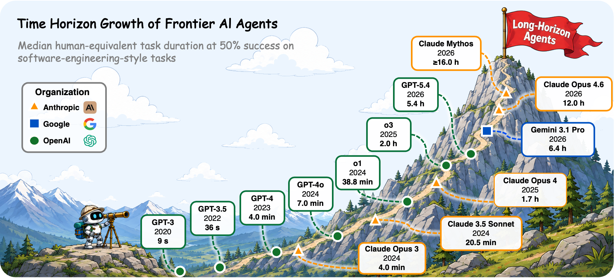
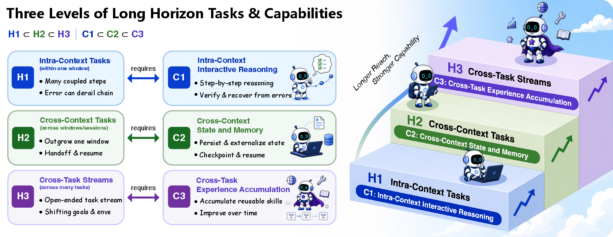
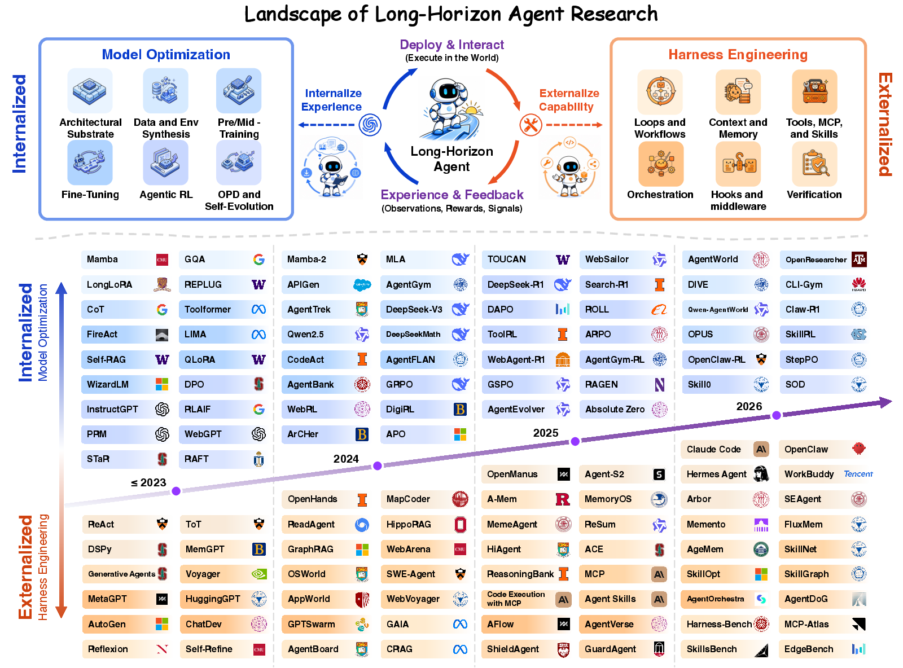
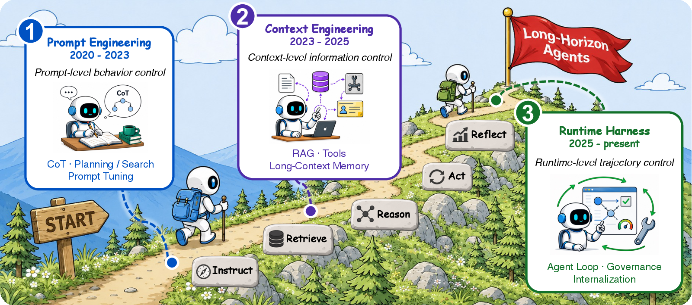
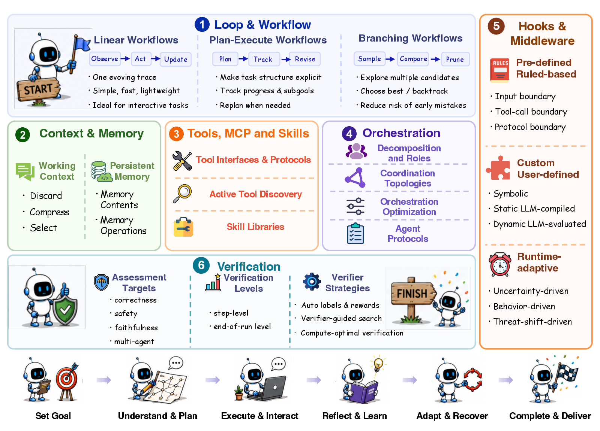
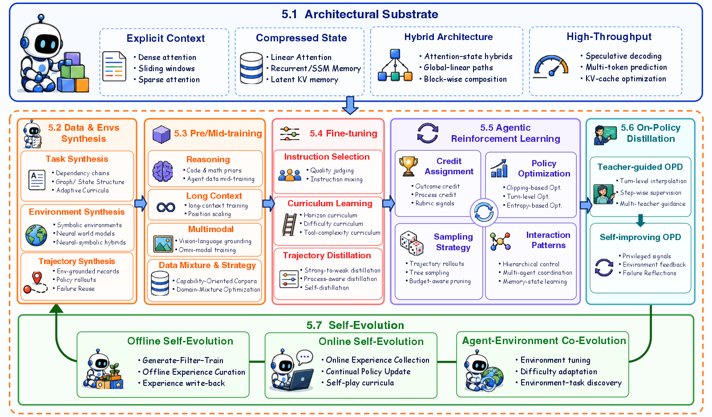
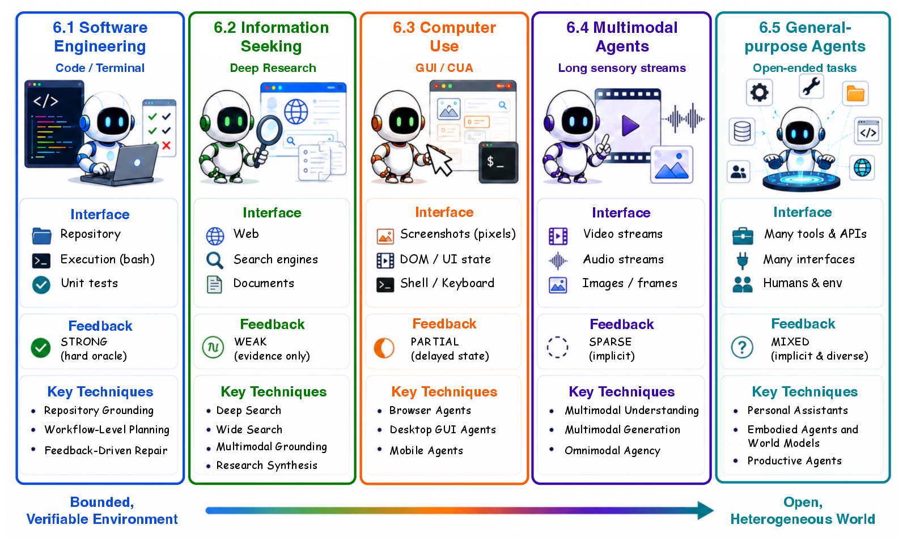

# 深度整理：Long-Horizon Agents（长程智能体）研究路径全景

- **Date:** 2026-07-20
- **Tags:** #survey #long-horizon-agents #agent #harness-engineering #agentic-rl #memory #orchestration #self-evolution

## Context

**整理对象**：人大 NLPIR 组的 [Awesome-Long-Horizon-Agents](https://github.com/RUC-NLPIR/Awesome-Long-Horizon-Agents) 仓库及其配套综述 *Towards Long-Horizon Agents: A Survey*。本文在其分类骨架上做**深度整理 + 我的分析 + 相关工作扩充**，所有 arXiv 引用均经 `scripts/add_paper.py` 从 arXiv 核验入库（遵循「引用须可验证」）。

**什么是 long-horizon agent（长程智能体）**：LLM 已从"单轮聊天机器人"变成"自主智能体的决策核心"。综述给出的定义是——**在推理、工具调用、观察、修正之间跨越许多相互依赖的步骤持续迭代**（persistent iteration over many interdependent steps）。核心经验事实：**前沿 agent 能独立完成的任务时长正在指数级增长**。

> **与本项目已有笔记的关系**：这份整理是 agent 主线的"总纲"。它与我此前的 [`2026-05-25-agent-harness-engineering-survey.md`](/research-notes/2026-05-25-agent-harness-engineering-survey.md)（harness 工程）、[`2026-07-08-blog-harness-engineering.md`](/research-notes/2026-07-08-blog-harness-engineering.md)（Lilian Weng harness）、[`2026-07-20-longstraw-longcontext-rl.md`](/research-notes/2026-07-20-longstraw-longcontext-rl.md)（长上下文 RL）、以及推理努力度综述互为补充——那些是"点"，本篇是把它们串起来的"面"。

## TL;DR

综述的核心框架：**长程智能体 = 基础策略 + 外围 harness**（$\mathrm{Agent}=\pi_\theta \oplus \mathcal{H}$），其能力由**两股力量共同塑造、且协同演化（co-evolve）**：

- **外化的 harness 工程（Pillar I）**：循环/工作流、上下文/记忆、工具/MCP/技能、编排、hooks/中间件、验证——把长程能力"搭"在模型外面。
- **内化的模型优化（Pillar II）**：架构、数据/环境合成、预训练/中训练、微调、agentic RL、on-policy 蒸馏、自进化——把长程能力"训"进模型里。

**关键洞察**：harness 里显式实现的能力，后续会被**内化**进模型策略；更强的策略又能撑起更复杂的 harness。二者螺旋上升。

难度被组织成**三层嵌套（H1 ⊂ H2 ⊂ H3）**：

| 层级 | 任务视界 | 所需能力 |
|:---:|:---|:---|
| **H1** | 单上下文窗口内（~分钟） | **C1** 上下文内交互式推理 |
| **H2** | 跨窗口/会话（~小时–天） | **C2** 跨上下文状态与记忆 |
| **H3** | 跨任务、开放式任务流 | **C3** 跨任务经验积累 |

## Main Content

### 1｜Foundations：把"长程"形式化

综述用 [METR](https://arxiv.org/abs/2503.14499)（`Kwa2025Measuring`）的"任务完成时间视界"作为**经验标尺**——衡量 agent 在固定成功率（如 50%）下能完成多长的任务。这把"长程智能体"和几个相邻但不同的概念区分开：

- **长程（long-horizon）** ≠ **长时运行（long-running execution）**：后者只是跑得久，未必需要跨步骤的推理依赖。
- **长程** ≠ **自主性（autonomy）**：自主是"少人干预"，长程是"多步相互依赖"。
- **长程** ≠ **自进化（self-evolution）**：自进化是能力随时间提升，是长程的一个子目标（H3/C3）。

$\mathrm{Agent}=\pi_\theta\oplus\mathcal{H}$ 这个形式化是全篇的锚：**策略 $\pi_\theta$ 和 harness $\mathcal{H}$ 是两个可独立优化、又相互约束的对象**。

### 2｜Evolution：从 Prompting 到 Runtime 的三阶段

综述把长程能力的实现方式按时间线分三阶段，每一阶段把"智能"往外推一层：

- **Stage I — Prompt Engineering（2020–2023）**：靠提示词激发能力。代表：CoT（思维链）、Self-Consistency、**ReAct**（`Yao2022React`，推理+行动交织）、Tree of Thoughts、RLHF/InstructGPT。此阶段"长程"体现在单次生成里的多步推理。
- **Stage II — Context Engineering（2023–2025）**：把外部信息喂进上下文。代表：RAG、Self-RAG、Toolformer/ToolLLM（工具调用）、**MemGPT**（`Packer2023Memgpt`，把 LLM 当 OS 管理分层记忆）、Generative Agents、Lost-in-the-Middle。长程开始跨越单窗口。
- **Stage III — Runtime Harnesses（2025–现在）**：围绕模型建**运行时**。代表：**Reflexion**（`Shinn2023Reflexion`，语言化的自我反思强化）、Self-Refine、MetaGPT/AutoGen（多智能体）、OpenHands/SWE-agent（软件工程 harness）、Search-R1、MCP 协议、AGENTS.md。长程成为一个系统工程问题。

> **我的观察**：这三阶段本质是"**智能的载体不断外移**"——从 prompt（一次性）→ context（一个窗口）→ runtime（一个持续系统）。这与 Lilian Weng 的 harness engineering 论述（见 [`2026-07-08-blog-harness-engineering.md`](/research-notes/2026-07-08-blog-harness-engineering.md)）完全同构。

### 3｜Pillar I：Harness — 把长程能力"外化"

这是综述最系统的一块，把 harness 拆成**六个组件**：

1. **循环与工作流（Loops & Workflows）**：三种范式——**线性**（Observe→Act→Update，如 ReAct，轻量适合交互）、**Plan-Execute**（Plan→Track→Revise，显式任务结构，如 ReWOO/ADaPT）、**分支**（Sample→Compare→Prune，探索多候选再剪枝，如 LATS/Tree of Thoughts）。
2. **上下文与记忆（Context & Memory）**：工作上下文（丢弃/压缩/选择）+ 持久记忆（记忆内容 + 记忆操作）。代表：**MEM1**（`Zhou2025Mem1`，记忆与推理协同）、Mem0、**HippoRAG**（`Gutirrez2024Hipporag`，神经生物学启发的长期记忆）、A-Mem、ReasoningBank、Voyager。
3. **工具、MCP 与技能（Tools/MCP/Skills）**：工具接口与协议、主动工具发现、技能库。评测代表：**τ-bench**（`Yao2024Bench`，工具-agent-用户交互）、MCP-Universe、DeepAgent、Alita。
4. **编排（Orchestration）**：任务分解与角色、协调拓扑、编排优化、agent 协议（A2A/ACP/MCP）。代表：CAMEL、ChatDev、**Magentic-One**（`Fourney2024Magentic`）、**AFlow**（`Zhang2024Aflow`，自动生成 agentic 工作流）、GPTSwarm。
5. **Hooks 与中间件（Hooks & Middleware）**：预定义规则型（输入/工具调用/协议边界）+ 自定义（符号/静态编译/动态评估）+ 运行时自适应（不确定性/行为/威胁驱动）。代表：NeMo Guardrails、Llama Guard、LlamaFirewall。
6. **验证（Verification）**：评估目标（正确性/安全/忠实性/多智能体）+ 验证层级（step-level / end-of-run）+ 验证器策略（自动标签奖励、验证器引导搜索、计算最优验证）。代表：**Let's Verify Step by Step**（`Lightman2023Let`，过程监督）、Math-Shepherd、CRITIC、ReST-MCTS*。

### 4｜Pillar II：Optimization — 把长程能力"内化"

另一半是把能力训进模型。综述拆成七条子线：

1. **架构基座（Architectural Substrate）**：支撑长上下文/高效推理的骨架。Longformer、Mamba、DeepSeek-V3、Jamba（混合）、Qwen3。← 与我的[长上下文综述](/research-notes/2026-07-20-llm-long-context.md)、[FlashAttention 篇](/research-notes/2026-07-20-flash-attention-efficient-attention.md)直接相接。
2. **数据与环境合成（Data & Environment Synthesis）**：造训练任务与可交互环境。TaskCraft、WebShaper、SWE-Gym、**WebArena**（`Zhou2023Webarena`）、**OSWorld**（`Xie2024Osworld`）、AgentGym-RL、WebSailor。
3. **预训练/中训练**：Qwen2.5、Kimi K2、YaRN、LongLoRA。
4. **微调（Fine-tuning）**：AgentTuning、**LIMI**（`Xiao2025Limi`，"Less is More for Agency"——少量高质数据即可）、LIMO、s1、FireAct。
5. **Agentic RL**：这是当前最热的一支。GRPO/DeepSeekMath、Search-R1（`Jin2025Search`）、**ToolRL**（`Qian2025Toolrl`）、Tool-Star、**DAPO**（`Yu2025Dapo`，开源大规模 RL 系统）、DeepSeek-R1、**WebDancer**（`Wu2025Webdancer`，自主信息检索）、WebRL。
6. **On-Policy 蒸馏**：把强 teacher 的策略蒸给 student（MAD-OPD、SOD、TCOD 等 2026 新作）。
7. **自进化（Self-Evolution）**：agent 自我改进的终极形态。**STaR**（`Zelikman2022Star`，用自己的推理 bootstrap）、rStar-Math、R-Zero/Absolute Zero（零数据自博弈）、**Darwin Gödel Machine**（`Zhang2025Darwin`，开放式自我改进）、**Self-Adapting LMs**（`Zweiger2025Self`）。综述另附一篇专门的自进化 survey（`Fang2025Comprehensive`）。

### 5｜Applications：五大落地场景

综述按应用域组织了大量系统与 benchmark：

| 场景 | 代表系统 | 代表 benchmark |
|---|---|---|
| **软件工程** | SWE-agent（`Yang2024Swe`）、OpenHands | SWE-bench、SWE-Gym |
| **信息检索** | WebDancer、Search-R1、WebSailor | WebArena、BrowseComp |
| **计算机使用（Computer Use）** | Agent S2、UI-TARS | **OSWorld**（`Xie2024Osworld`）、WindowsAgentArena |
| **多模态 agent** | 各类 VLM agent | 多模态 agent benchmark |
| **通用 agent** | Magentic-One、AutoGPT 系 | **TheAgentCompany**（`Xu2024Theagentcompany`，真实职场任务） |

### 6｜Frontiers：四轴九向开放问题

综述把开放问题组织成**四条轴、九个方向**，反复强调的一条主线是：**下一步的进步很大程度上要发生在 harness 上，而不只是模型**。

| 轴 | 前沿方向 | 核心开放挑战 |
|:---|:---|:---|
| **I. 演化** | 自进化 harness/agent | 目标是手设指标；增益停在分布内；长程运行会过拟合/漂移 |
| | Harness 可迁移性 | 模型绑死单一 harness；跨厂商排名剧烈波动；无标准协议 |
| | 持续/终身学习 | 外部记忆太浅；内部更新有遗忘风险 |
| **II. 有效性** | 真实世界环境交互 | 无法在活系统里直接训练；合成/世界模型面临保真度考验 |
| | 数字→具身 | 时间尺度冲突；物理/维度鸿沟；反馈粗细不匹配 |
| **III. 效率** | 成本/预算感知 | 预算盲；无校准的成本感；无运行时上限；无"预算↔成功"定律 |
| | 多模态/全模态 harness | 多模态是"硬接上去"的；视觉 token 预算靠启发式；跨模态验证不可靠 |
| **IV. 可信** | 反思与错误鲁棒性 | 失败检测太晚；内在自纠不可靠；错误累积成目标漂移 |
| | 安全与治理 | 注入错误/有害经验被复用；无统一安全标准；自进化侵蚀不变量 |

代表性前沿引用：LLM 尚不能自我纠错（`arXiv:2310.01798`）、测试时计算最优扩展（`arXiv:2408.03314`）、TheAgentCompany（`Xu2024Theagentcompany`）、Darwin Gödel Machine（`Zhang2025Darwin`）。

## 我的分析与扩充

综述给了完整的"地图"，下面是我的批判性解读，以及几处我认为值得补强的连接。

### A. 两支柱框架的真正洞见：能力会"下沉"

综述最有价值的论断不是分类本身，而是 **harness ⇄ model 的协同演化**——今天用外部脚手架实现的能力（如显式的 plan-execute 循环、外挂记忆），明天会被训进模型权重。历史已多次印证：CoT 从"提示技巧"变成模型"默认会 think"；工具调用从 Toolformer 的外部注入变成原生 function calling；反思从 Reflexion 的外部循环走向 RL 训练出的内在自纠。**判断一项 harness 技术的长期价值，要看它能否被内化**——纯外部的、模型学不会的技巧终将被淘汰。

### B. 一个我认为综述弱化了的张力：harness 越强，评测越失真

综述在 Frontiers 提了"harness 可迁移性"，但我认为这背后有个更尖锐的问题：**当能力越来越多地来自 harness 而非模型，"模型 benchmark"就越来越测不准真实能力**。同一个基座模型，配不同 harness 在 SWE-bench 上能差几十个点。这与我在[长上下文综述](/research-notes/2026-07-20-llm-long-context.md)里记的"名义窗口≠有效长度"、以及推理努力度里的"RULER 揭穿虚标"是**同一类问题的不同侧面**——评测必须报告完整的 agent 配置（模型 + harness + 预算），否则数字无意义。

### C. 与本项目其它笔记的接点（扩充连接）

这份地图恰好把我此前几篇"点状"笔记连成网：

- **Pillar II 的架构基座** ← [长上下文综述](/research-notes/2026-07-20-llm-long-context.md)（RoPE/YaRN/Mamba/MLA）+ [FlashAttention 篇](/research-notes/2026-07-20-flash-attention-efficient-attention.md)（算子）。长程 agent 的超长轨迹（H2/H3）直接吃长上下文技术的红利。
- **Pillar II 的 Agentic RL** ← [LongStraw 深读](/research-notes/2026-07-20-longstraw-longcontext-rl.md)。LongStraw 正是"如何在固定预算下对超长 agent 轨迹做 GRPO"的系统答案——它填的正是本综述"H2/H3 的 RL 训练"这一格。
- **Harness 的循环/验证** ← [harness engineering 综述](/research-notes/2026-05-25-agent-harness-engineering-survey.md) + [Lilian Weng harness](/research-notes/2026-07-08-blog-harness-engineering.md)。
- **效率轴的"预算感知"** ← [推理努力度综述](/research-notes/2026-07-20-blog-reasoning-effort.md)。综述说 agent"预算盲、无成本感"，而 reasoning effort 控制正是在单模型层面解决这个问题——把它抬到 agent 编排层就是"成本感知 agency"。

### D. 我补充的一条主线：H3（跨任务经验积累）是真正的分水岭

综述把 H1/H2/H3 平铺，但我认为 **H3 才是"agent"和"长程 agent"的真正分界**。H1/H2 本质仍是"把一个任务做完/做长"，而 H3（开放任务流里积累经验、越用越强）要求**跨任务的记忆写回 + 策略更新**——这正是自进化（STaR、Darwin Gödel Machine、Self-Adapting LMs）和终身学习的战场，也是当前最不成熟、最容易"漂移/遗忘/被污染"的一层。我判断未来 2 年的主要突破会集中在 H3。

## Open Questions

1. **能力内化的边界在哪？** harness ⇄ model 协同演化里，哪些能力**必须**留在 harness（如涉及外部系统状态、安全护栏），哪些终将内化？有没有一条"什么该外化/内化"的原则，而非事后追认？
2. **如何评测一个 harness（而非模型）？** 当能力来自模型+harness 的组合，需要一套能解耦二者贡献的评测协议。TheAgentCompany、τ-bench 是尝试，但"同模型跨 harness 排名剧烈波动"说明还没解决。
3. **H3 的经验积累如何不漂移、不遗忘、不被污染？** 外部记忆太浅、内部更新会遗忘、注入的坏经验会被复用——自进化在"越用越强"和"越用越坏"之间如何保证单调改进？
4. **预算↔成功率有没有 scaling law？** 综述指出 agent"预算盲"。能否像推理努力度那样，给出"多少 token/工具调用/wall-clock 换多少成功率"的可校准曲线，让编排层做成本最优决策？
5. **数字 agent 到具身 agent 的迁移**：时间尺度（毫秒级物理 vs 秒级 LLM）、维度、反馈粒度的鸿沟，是靠世界模型合成环境弥合，还是需要根本不同的架构？

## References

> 均已录入 `references/references.bib`（arXiv 可验证）。仓库收录论文数百篇，此处仅列本文重点引用者。

**基础与标尺**
- METR: Measuring AI Ability to Complete Long Tasks — Kwa et al. 2025，arXiv:2503.14499（`Kwa2025Measuring`）

**Evolution（三阶段代表）**
- ReAct — Yao et al. 2022，arXiv:2210.03629（`Yao2022React`）
- Reflexion — Shinn et al. 2023，arXiv:2303.11366（`Shinn2023Reflexion`）
- MemGPT — Packer et al. 2023，arXiv:2310.08560（`Packer2023Memgpt`）

**Harness（Pillar I）**
- MEM1 — Zhou et al. 2025，arXiv:2506.15841（`Zhou2025Mem1`）
- HippoRAG — Gutiérrez et al. 2024，arXiv:2405.14831（`Gutirrez2024Hipporag`）
- τ-bench — Yao et al. 2024，arXiv:2406.12045（`Yao2024Bench`）
- Magentic-One — Fourney et al. 2024，arXiv:2411.04468（`Fourney2024Magentic`）
- AFlow — Zhang et al. 2024，arXiv:2410.10762（`Zhang2024Aflow`）
- Let's Verify Step by Step — Lightman et al. 2023，arXiv:2305.20050（`Lightman2023Let`）

**Optimization（Pillar II）**
- ToolRL — Qian et al. 2025，arXiv:2504.13958（`Qian2025Toolrl`）
- DAPO — Yu et al. 2025，arXiv:2503.14476（`Yu2025Dapo`）
- WebDancer — Wu et al. 2025，arXiv:2505.22648（`Wu2025Webdancer`）
- Search-R1 — Jin et al. 2025，arXiv:2503.09516（`Jin2025Search`）
- LIMI — Xiao et al. 2025，arXiv:2509.17567（`Xiao2025Limi`）
- STaR — Zelikman et al. 2022，arXiv:2203.14465（`Zelikman2022Star`）
- Darwin Gödel Machine — Zhang et al. 2025，arXiv:2505.22954（`Zhang2025Darwin`）
- Self-Adapting LMs — Zweiger et al. 2025，arXiv:2506.10943（`Zweiger2025Self`）
- Self-Evolving AI Agents Survey — Fang et al. 2025，arXiv:2508.07407（`Fang2025Comprehensive`）

**Applications & Benchmarks**
- SWE-agent — Yang et al. 2024，arXiv:2405.15793（`Yang2024Swe`）
- WebArena — Zhou et al. 2023，arXiv:2307.13854（`Zhou2023Webarena`）
- OSWorld — Xie et al. 2024，arXiv:2404.07972（`Xie2024Osworld`）
- TheAgentCompany — Xu et al. 2024，arXiv:2412.14161（`Xu2024Theagentcompany`）

**相关综述**
- A Survey of Context Engineering — Mei et al. 2025，arXiv:2507.13334（`Mei2025Survey`）

**姊妹笔记（本项目）**
- [`2026-07-20-longstraw-longcontext-rl.md`](/research-notes/2026-07-20-longstraw-longcontext-rl.md) —— 固定预算下的长上下文 agent RL
- [`2026-07-20-llm-long-context.md`](/research-notes/2026-07-20-llm-long-context.md) —— 长上下文建模
- [`2026-07-20-flash-attention-efficient-attention.md`](/research-notes/2026-07-20-flash-attention-efficient-attention.md) —— 高效注意力算子
- [`2026-07-20-blog-reasoning-effort.md`](/research-notes/2026-07-20-blog-reasoning-effort.md) —— 推理努力度控制（对应效率轴）
- [`2026-05-25-agent-harness-engineering-survey.md`](/research-notes/2026-05-25-agent-harness-engineering-survey.md) —— harness 工程综述

> 说明：本文基于 RUC-NLPIR/Awesome-Long-Horizon-Agents 仓库 README 与其配套综述整理，7 张配图取自该仓库 assets（已注明来源）。仓库为 MIT 许可、持续更新，收录论文远多于本文重点引用；未展开的分支（如 On-Policy Distillation 的 2026 新作 MAD-OPD/SOD/TCOD）可回查原仓库。