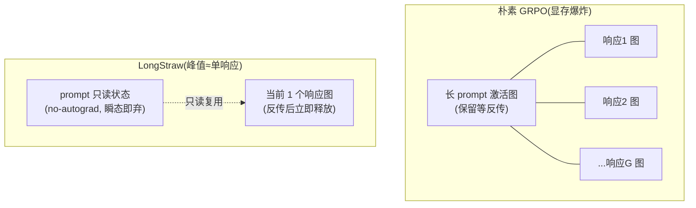

# 论文深读：LongStraw —— 固定 GPU 预算下突破 2M token 的长上下文 RL 后训练

- **Date:** 2026-07-20
- **Tags:** #paper-deep-dive #long-context #reinforcement-learning #rl-post-training #grpo #memory-optimization #systems #kv-cache

## Context

**论文**：*LongStraw: Long-Context RL Beyond 2M Tokens under a Fixed GPU Budget*（Zhou et al. 2026, `Zhou2026Longstraw`，[arXiv:2607.14952](https://www.alphaxiv.org/abs/2607.14952)，MindLab / 复旦大学）

**它解决的痛点**：推理系统已逼近百万 token 上下文，但 **RL 后训练（RL post-training）却普遍卡在 256K 甚至更低**——训练时用短上下文，部署时靠"长度泛化"硬撑。对需要处理超长轨迹（工具输出、文档、历史决策累积）的 **AI agent**，这个训练-推理鸿沟尤其致命。LongStraw 的目标是：**在一组固定、有限的 GPU 上（不靠堆卡）**，把 RL 后训练的上下文推到 2M+ token。

> **与本项目已有综述的关系**：这是长上下文系列的自然延伸。[`2026-07-20-llm-long-context.md`](2026-07-20-llm-long-context.md) 讲"模型怎么把上下文做长"（建模视角），[`2026-07-20-flash-attention-efficient-attention.md`](2026-07-20-flash-attention-efficient-attention.md) 讲"注意力算子怎么快省"（推理/前向系统视角）。**本篇补上第三块拼图：训练（尤其 RL 后训练）阶段的长上下文系统工程**——这是前两篇都没覆盖、也是最难的一块（训练要保留反向图）。

## TL;DR

RL 后训练比推理难在**必须为反向传播保留计算图与激活**，而 GRPO（Group Relative Policy Optimization）又要对**同一个长 prompt** 生成一组（group）响应做对比——朴素实现会把 prompt 的激活图 + 全部响应图**同时**驻留显存，峰值随 prompt 长度 × group size 爆炸。

LongStraw 的核心是一套"**捕获一次、逐个重放后缀（Capture Once, Replay the Suffix）**"的执行栈：
1. 把共享 prompt **只前向一次、且关掉 autograd**，只保留后续 token 必需的"模型专属状态"（KV pages / 循环状态 / 潜在页），瞬态张量立即释放；
2. 把 prompt 状态当**只读**，逐个 group 成员**串行重放**其短响应分支、反传、立即释放该成员的图——**任一时刻只有一个响应图存活**。

代价是**串行重放 → 时间变长**，换来的是**峰值显存与 group size 几乎解耦**。实测：Qwen3.6-27B 在 **8 张 H20** 上做到 **2.09M token**（原生窗口的 8 倍），group size 从 2 加到 8，峰值显存只多 **0.208 GB（0.2%）**；GLM-5.2 在 32 张 H20 上做到 2.1M。作者诚实地把成果限定为"**执行能力（execution capacity）**"，并明确列出了梯度同步等尚未达标的部分。

## Main Content

### 1｜为什么 RL 后训练的长上下文比推理难

推理（尤其 decode）在 prefill 后可以**丢掉前向图**、只留 KV cache；但训练必须**保留计算图和激活**以便反传。三个叠加的显存瓶颈：

1. **注意力的二次成本**：前向+反向都随序列长度二次增长。
2. **长寿命的反向状态**：整条 prompt+response 的激活都要留着等反传。
3. **GRPO 的成组特性**：一组响应共享同一个长 prompt，朴素实现让 prompt 图 + **所有**响应图同时存活——显存 ∝ prompt 长度 × group size。

### 2｜核心执行设计：Capture Once, Replay the Suffix

每次成组更新是一个四阶段事务：

1. **Prompt Capture（捕获）**：用当前策略参数 $\theta_k$ 对共享 prompt $x_{1:P}$ 前向一次，**关闭自动微分**。隐藏态、FFN 中间量、注意力 scratch、MoE 路由缓冲等**瞬态张量立即释放**，只保留"后续响应 token 需要的模型专属条件状态"。
2. **Pre-step Scoring（预打分）**：把保留的 prompt 状态当**只读**，为每个 group 成员算 old-policy（$\pi_{old}$）与 reference-policy 的响应 log-prob。此阶段参数不动。
3. **Policy Replay（策略重放）**：对每个成员，在 autograd 下**重建其短响应路径** $R_i$——串行复用只读 prompt 状态、反传该成员损失、**立即释放该成员的图**，保证任一时刻只有一个响应图存活；梯度累加进同一 adapter。
4. **Optimizer Transaction（优化器事务）**：所有成员处理完、梯度累加后，每个 worker **发一次** optimizer.step 更新到 $\theta_{k+1}$——这使捕获的 prompt 状态失效（下轮需重新捕获）。

> **本质**：把"活的训练图"从"整条 prompt+response"压缩成"任一时刻单条 response 分支"。**用串行重放的时间，换峰值显存的坍缩**——这与 FlashAttention 的 recomputation（用重算换显存）是同一哲学，只是搬到了 RL 训练的图管理层面。

### 3｜两个模型的具体落地（架构感知）

LongStraw 的关键论点：固定预算的容量，**来自对张量生命周期（tensor lifetime）的精细管理，而非单纯稀疏**。两个架构差异极大的模型验证了通用性：

**① Qwen3.6-27B（混合循环 + 全注意力）**
- **架构**：48 层 Gated DeltaNet（GDN 循环层）+ 16 层全 GQA 注意力，全部 dense gated FFN。
- **持久 prompt 状态**：GDN 层保留**固定大小的循环状态**；全注意力层保留 **KV pages**（存储随 prompt 长度线性增长）。都放 GPU。
- **内存管理**：逻辑 KV page 分片**拷进恰好大小的物理分配**以确保释放；用上下文并行 **CP8**，每个 rank 拥有 block-cyclic 的一部分页。
- **响应重放**：一条响应切成 4 个 2048-token 块，policy pass **逆序**遍历、恢复 GDN 状态并追加当前块的 KV pages；整层 checkpointing 控激活。
- **Adapter**：NF4 QLoRA（rank 16），116.7M 可训练参数。

**② GLM-5.2（压缩注意力 + MoE）**
- **架构**：78 层，Multi-head Latent Attention（MLA）+ Dynamic Sparse Attention（DSA）索引；75 个 FFN 是路由 MoE（256 专家，top-8 + 1 shared），前 3 个是 dense。
- **持久 prompt 状态**：MLA 潜在页 + DSA 索引键页（21 个索引层），**移到 CPU 内存**。
- **内存管理**：Megatron zigzag 上下文并行 **CP32**，每 rank 持 1024 页（65536 token）；响应重放时**只把当前层需要的页 stage 到 GPU、用完即释放**；整层可重入 checkpointing 控 MoE 路由/分发/FFN 的激活。
- **并行**：TP1/CP32/EP32/ETP1/PP1，32 张 H20。CP32 分布注意力状态，EP32 分布路由专家。
- **Adapter**：rank-8 LoRA（注意力投影 + FFN + 输出头）；base 权重、embedding、norm、DSA 索引器、router 全部冻结。

### 4｜实验结果：显存与 group size 解耦

**Qwen3.6-27B @ 8× H20**——达到 **2,097,152 positions**（2,088,960 prompt + 8,192 response），是原生窗口 262,144 的 **8 倍**：

| Group size | 端到端耗时 | 峰值显存/rank |
|---|---|---|
| G=2 | 5,198.8 s | 97.503 GB |
| G=8 | 6,785.2 s | 97.711 GB |
| **Δ(2→8)** | **+1,586 s** | **+0.208 GB（+0.2%）** |

**核心结果**：group 从 2 加到 8，峰值显存只多 0.2%，代价是墙钟时间线性增加——**串行重放把 group size 从峰值显存里彻底解耦**。共享 prompt 捕获（约 4,656 s）占大头，但可被所有成员**摊销**。

**压力测试**：同样 8 张 H20 上把执行包络推到 **4.46M positions**（4,448,256 prompt + 8,192 response），G=8 重放 21,750 s、峰值 82.96 GB/rank；在"prefix-frozen、只训响应"参数化下，连跑 8 步 G=8（64 次成员重放）峰值 83.894 GB/rank。

**GLM-5.2 @ 32× H20**——达到 **2,097,152 positions**（纯 prompt）+ 两条短响应，是其公布窗口 1,048,576 的 **2 倍**。全 78 层的执行路径在 G=2 下验证通过（32 rank 各跑两次 78 层反向 + 终端分布式 optimizer）；CPU 常驻存储 prompt 的 MLA 潜在页 + DSA 索引键页，共 5.8125 GiB/rank（全 32 rank 186 GiB），逐层 stage 到 GPU。

### 5｜诚实的边界：四级证据

论文最值得称道的一点是**不吹**。它定义了长上下文 RL 系统的**四级证据**，并明确自己只坐实了第一级：

| 级别 | 含义 | LongStraw 状态 |
|---|---|---|
| **① Execution capacity** | 能在固定预算跑完 2M+ 的成组更新 | ✅ 已确立 |
| **② Response-operator fidelity** | 响应算子在数值上正确复现全局注意力 | ⚠️ 前向正确，但… |
| **③ Distributed-update consistency** | CP/EP 各 rank 的更新一致 | ❌ 未达标 |
| **④ Full-gradient parity** | 与全图训练梯度完全一致 | ❌ 未达标 |

已知具体局限：
- **prompt 状态被 detach（stop-gradient）**——梯度不流经 prompt。
- **Qwen**：K/V adapter 梯度未在 CP 各 rank 完全同步（只 all-reduce 了 dQ）；AdamW 每 rank 本地调用，复制参数可能**各自漂移**。
- **GLM**：DSA 算子是**每 CP 分片本地** top-2048（在本地 65536 token 内选，而非全局 2M）；自定义常驻路径绕过了 Megatron 的 `finalize_model_grads`，CP-复制的非专家 adapter 梯度在优化器步前**未归约**。

换句话说：**LongStraw 目前证明的是"这么大的上下文能在有限卡上把 RL 更新跑完"，而不是"跑出来的梯度和全图训练等价"**。作者把后者列为明确的 roadmap。

### 6｜与相关工作的定位

- **省显存/算力的单点技术**：FlashAttention（`Dao2022Flashattention`）、LoRA（`Hu2021Lora`）、QLoRA（`Dettmers2023Qlora`）——LongStraw 用了它们（NF4 QLoRA 等），但论证这些**本身不足以**在固定预算下支撑 2M RL（因为 prompt 图 + 多响应图 + 缓存 + 通信的显存是叠加的）。
- **"scale-out"路线（靠堆卡加长）**：Ring Attention（`Liu2023Ring`，32×A100 训 4M）、DeepSpeed-Ulysses（`JacobsndDeepspeed`，256×A100 训 1M）、ByteScale（1024 GPU 训 2M）、USP 等。**LongStraw 的差异化正在于"固定预算"**——不问"堆多少卡能更长"，而问"给定一组有限的卡能做到多长"。
- **目标函数**：专门针对 GRPO（`Shao2024Deepseekmath` 提出）——多响应共享一个 prompt 的对比式 RL。
- **架构接点**：Qwen 用的 GDN 循环层呼应 Mamba/SSM（`Gu2023Mamba`）"推理时状态恒定"的思想（见长上下文综述 §4）；GLM 的 MLA 是 DeepSeek 系压 KV 的做法（见长上下文综述 §8）。

## 我的评述

- **它的贡献是"民主化"而非"新 SOTA 能力"**。scale-out 派证明了"有 1024 张卡能训 2M"，LongStraw 证明"只有 8 张 H20 也能把 2M 的 RL 更新跑完"。对没有超大集群的学术团队/小公司，这是把长上下文 RL 从"看得见摸不着"变成"能上手实验"的一步。
- **最漂亮的工程点是 group size 与峰值显存解耦**（+0.2% 显存换 G 从 2→8）。这直接命中 GRPO 的结构性痛点：GRPO 天生要多响应，而多响应正是朴素实现显存爆炸的源头。串行重放把"成组"的成本从空间挪到了时间。
- **诚实的四级证据框架值得单独表扬**，也是我读这篇最认可的地方。系统论文最容易犯的错是"能跑通"就宣称"训练有效"。它明确区分"执行能力 / 前向保真 / 分布式更新一致 / 全梯度对齐",并承认自己只到第一级——这种 transparency 让后续工作能站在真实的地基上,而不是被夸大的结论误导。
- **一个务实的疑问**:prompt 被 detach、K/V adapter 梯度不同步、DSA 本地 top-k 而非全局——这些"为了跑通而做的妥协"会**多大程度损害训练的有效性**?论文坦承这是 execution capacity 而非 gradient parity,但"能跑"和"训得对"之间的鸿沟有多大、能否补上,是这条路线成立与否的关键,目前还是开放的。
- **可信度提示**:本篇基于 alphaXiv 的结构化报告转写,论文为 2026-07 新作、暂无 arXiv HTML 版,故用 mermaid 自绘机制图(非论文原图)。数字(2.09M/4.46M positions、显存、耗时)来自报告,引用时应回查原文核对。

## Open Questions

1. **execution capacity → gradient parity 的距离有多远?** prompt detach + 局部梯度不同步下训出来的策略,和全图 GRPO 相比性能差多少?论文没给下游任务的效果对比(只给了系统指标)——这是最关键的缺口。
2. **串行重放的时间成本随 group size 线性增长**(G=8 比 G=2 多 1586 s)。当 GRPO 需要大 group(如 16/32)时,墙钟时间会不会成为新瓶颈?能否部分并行化重放而不炸显存?
3. GLM 的 **DSA 本地 top-2048 vs 全局 2M** 是个实质性近似——本地选出的"重要 token"未必是全局重要的。这对长程依赖任务(需要跨越百万 token 的检索)影响多大?
4. 这套"capture once, replay suffix"能否推广到 **GRPO 之外的 RL 目标**(PPO/DPO 变体),以及**多轮 agent 轨迹**(不只是单 prompt 多响应,而是交错的 obs-action 序列)?
5. 与 scale-out 路线(Ring/Ulysses)是否**正交可叠加**?"固定小集群 + LongStraw 图管理 + 适度序列并行"的组合能不能进一步拉高固定预算下的上限?

## References

> 均已录入 `references/references.bib`（arXiv 可验证）。

**本篇**
- LongStraw — Zhou et al. 2026，arXiv:2607.14952（`Zhou2026Longstraw`）

**目标函数与高效微调**
- GRPO / DeepSeekMath — Shao et al. 2024，arXiv:2402.03300（`Shao2024Deepseekmath`）
- LoRA — Hu et al. 2021，arXiv:2106.09685（`Hu2021Lora`）
- QLoRA — Dettmers et al. 2023，arXiv:2305.14314（`Dettmers2023Qlora`）

**长上下文系统（相关/对照）**
- FlashAttention — Dao et al. 2022，arXiv:2205.14135（`Dao2022Flashattention`）
- Ring Attention — Liu et al. 2023，arXiv:2310.01889（`Liu2023Ring`）
- DeepSpeed-Ulysses — Jacobs et al. 2023，arXiv:2309.14509（`JacobsndDeepspeed`）
- Mamba（GDN/SSM 接点）— Gu & Dao 2023，arXiv:2312.00752（`Gu2023Mamba`）

**姊妹综述**
- [`2026-07-20-llm-long-context.md`](2026-07-20-llm-long-context.md) —— 长上下文建模（位置外推/稀疏/记忆/架构/训练/评测）
- [`2026-07-20-flash-attention-efficient-attention.md`](2026-07-20-flash-attention-efficient-attention.md) —— 高效注意力算子/系统层

> 说明：本篇基于 alphaXiv 结构化报告转写；论文为 2026-07 新作、暂无 arXiv HTML 版，机制图为 mermaid 自绘（非论文原图）。核心数字来自报告，引用时建议回查原文。
