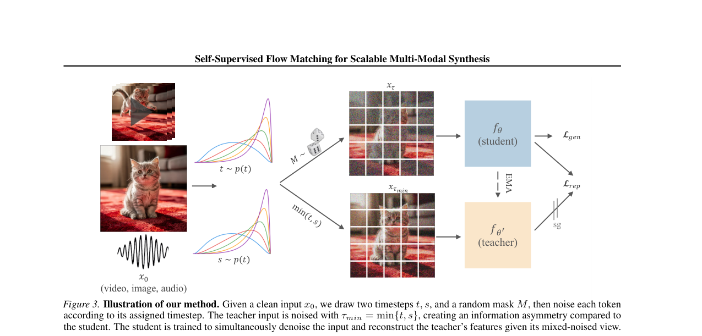

# FLUX.3 与 Self-Flow:BFL 的多模态统一基础模型

- **Date:** 2026-07-24
- **Tags:** FLUX, Black-Forest-Labs, 多模态, flow-matching, 扩散模型, 表征学习, REPA, 视频生成, 具身智能, Self-Flow
- **来源:** [bfl.ai/blog/flux-3](https://bfl.ai/blog/flux-3)(2026-07-23 公告)+ **Self-Flow 论文 [arXiv:2603.06507](https://arxiv.org/abs/2603.06507) 全文精读**

## Context

Black Forest Labs(BFL,Stable Diffusion / FLUX 原班团队)于 **2026-07-23** 发布 **FLUX.3**,从"文生图模型"跃升为**多模态基础模型**——在统一架构里联合学习**图像 / 视频 / 音频**,底层方法叫 **Self-Flow**。

> [!WARNING]
> **可信度边界:** FLUX.3 **产品页**是发布公告,产品级参数量、训练数据/算力规模、视频胜率基准均标 "preliminary"、官方未给完整数字。**但底层方法 Self-Flow 已有完整 arXiv 论文([2603.06507](https://arxiv.org/abs/2603.06507)),第二节为其全文精读**(方法/公式/全部基准实测数字均来自论文正文,已核实)。注意:论文实验最大到 1B 参数,FLUX.3 产品的实际规模未公开——**别把论文里的模型尺寸等同于 FLUX.3 产品**。

> [!UPDATE]
> 本笔记 2026-07-24 二次更新:此前 Self-Flow 论文尚未上 arXiv,只能凭标题推断;现已拿到全文 PDF(37 页),第二节整段改写为**逐公式精读 + 全部基准数字 + 方法图**,并入库 arXiv:2603.06507。

## 一、FLUX.3 是什么

| 维度 | 内容 |
|---|---|
| 发布 | 2026-07-23,现 Early Access |
| 定位 | 多模态基础模型,"real-world visual intelligence" |
| 底层 | **Self-Flow**(multimodal flow matching),统一架构联合学图/视频/音频 |
| 变体 | FLUX 3 Video / Image / **FLUX-mimic(Action)** / **FLUX 3 Dev(开放权重,计划中)** |

### 四个变体

- **FLUX 3 Video** — 视频+原生音频生成/编辑;单次最长 **20 秒**;文/图/视频→视频、关键帧→视频、多语对话、片段的 **agentic 串联**。(Early Access:API + 私有权重)
- **FLUX 3 Image** — 多风格/比例/分辨率,复杂 prompt + **多语言高精度文字渲染**改进。(未来几周开放)
- **FLUX-mimic / FLUX 3 Action** — 与 mimic robotics 合作的视频-动作模型;两条路线:①动作预测**原生集成进 FLUX 3**;②把预训练视频骨干当**动力学感知基座**,专用动作模型少量数据微调。
- **FLUX 3 Dev** — 开放权重多模态骨干,**尚未发布**(FLUX.2 是 Apache-2.0,可期待)。

### 基准(preliminary,视频胜率偏好)

| 对手 | FLUX 3 胜率 |
|---|---|
| Luma Ray 3.2 | **93%** |
| Runway Gen-4.5 | 77% |
| Grok Imagine Video | ≤69% |
| Kling v3 Pro | 60% |
| Seedance 2.0 / Gemini Omni Flash | 52% |

另有 Self-Flow 内部基准:生成误差(Fréchet 距离)归一到 **FM=100**(越低越好)+ 四类任务组的操作成功率(微调后,越高越好)——**具体数值在图中,未提取为文本**。

## 二、Self-Flow 论文(全文精读,arXiv:2603.06507)

- **标题:** *Self-Supervised Flow Matching for Scalable Multi-Modal Synthesis*
- **作者:** Hila Chefer\*、Patrick Esser\*、Dominik Lorenz、Dustin Podell、Vikash Raja、Vinh Tong、Antonio Torralba、Robin Rombach(BFL × **MIT**)
- **arXiv:** [2603.06507](https://arxiv.org/abs/2603.06507)(cs.CV,2026-03-06;文献库 cite key `Chefer2026Self`)
- **一句话:** **让流模型在"学生成"的同时"自己长出"强语义表征,彻底甩掉外部编码器(如 DINO)**——靠一个只改"怎么加噪"的机制 Dual-Timestep Scheduling。

> 📌 **给非专业读者的背景**:文生图/视频模型(扩散、flow)本质是"从一团噪声里逐步还原出图像"。近两年发现一个 trick:训练时让模型的内部特征去**模仿一个现成的图像理解模型(如 DINO)**,能让它学得更快更好——这叫"外部表征对齐"(代表方法 **REPA**)。Self-Flow 说:这个 trick 有天花板,我们不借别人的,让模型自己学。

### 2.1 动机:外部对齐(REPA)的三宗罪

| 问题 | 具体表现 | 为什么致命 |
|---|---|---|
| **违反 scaling law** | 换更强的外部编码器(DINOv2-B→L→DINOv3-H+),生成 FID **反而单调变差**——最弱的 DINOv2-B 最好 | 外部编码器成了固定瓶颈,模型再大也被它拖住 |
| **不跨模态** | 视频/音频上,对齐外部编码器(连视频专用的 V-JEPA2、Depth Anything3)**反而伤性能** | 统一多模态模型(=FLUX.3)根本没法用 |
| **不可预测** | SigLIP2 有文本监督,做文生图却不如 DINOv2 | 事先没法知道该配哪个编码器 |

**根因诊断(全文最关键的一句):** 流模型的训练目标(去噪)**本身不激励学语义**——很多去噪靠局部像素相关性就能糊弄过去。所以才不得不"外借"表征。

### 2.2 核心机制:Dual-Timestep Scheduling(双时间步调度)

**直觉:** 标准做法给所有 token(图像小块)加**同一档**噪声。Self-Flow 故意给不同 token 加**两档**噪声,制造"信息不对称"——有的 token 干净、有的很脏,**逼模型用干净的去推断脏的**,从而学会"全局关系"而不是"局部抄近路"。

**做法(每个训练样本三步):**
1. 采**两个**时间步 $t, s \sim p(t)$(时间步 = 噪声强度,1=纯噪声,0=干净);
2. 采随机掩码 $M$(掩码率 $R_M \le 0.5$,即最多一半 token 用"另一档"噪声);
3. 逐 token 组装噪声强度向量:$\tau_i = s$(若 token $i$ 在掩码里)else $t$,再按 $x_\tau = \mathrm{diag}(1-\tau)x_0 + \mathrm{diag}(\tau)x_1$ 加噪。

**为什么这样设计(权衡):** 比"全同噪声"(学不到全局关系)强,又比"每 token 完全独立噪声 / 全掩码"(制造训练-推理不一致、反而伤生成)稳——因为它**保持了每个 token 单看的边际噪声分布不变**。妙处:**光加这个调度、不加任何额外损失,生成质量就已经略升**(因为输入里有干净上下文,帮模型去噪,隐式逼它看全局)。

### 2.3 Self-Flow = 双时间步 + EMA 师生自蒸馏

在 2.2 的信息不对称之上,加一个**自蒸馏表征损失**(见方法图):
- **Student** $f_\theta$:看**混合噪声**的 $x_\tau$(脏);
- **EMA Teacher** $f_{\theta'}$:是 student 的指数滑动平均副本,看**更干净**的 $x_{\tau_{min}}$(所有 token 都用两档里较低那档噪声)。
- **表征损失**(cosine 相似度):让 student 从它"残缺、被污染"的视图,去**预测 teacher 在更干净视图下产生的中间特征**:

$$\mathcal{L}_{rep} = -\mathbb{E}\,\cos\!\big(h^{(l)}_\theta(x_\tau,\tau),\ f^{(k)}_{\theta'}(x_{\tau_{min}},\tau_{min})\big),\quad l<k$$

- **总损失:** $\mathcal{L} = \mathcal{L}_{gen} + \gamma\cdot\mathcal{L}_{rep}$($\mathcal{L}_{gen}$ 是标准 flow matching 的速度回归损失)。

> **精髓:teacher 就是 student 自己的 EMA——全程零外部模型、零外部标注。** 本质是把 **MAE(掩码重建)** 和 **DINO(EMA 师生蒸馏)** 两个自监督经典思路,焊进了 flow matching 的生成目标里。$l<k$ 指"用 student 的浅层去对齐 teacher 的深层"(深层语义更强)。

### 2.4 实验结果(全部实测数字)

统一设置:ImageNet 用 SiT-XL;其余用 **FLUX.2 transformer** 骨干,默认 ~625M 参数。T2I 训 2000 万图文对、T2V 用 Wan2.2 自编码器 + 600 万视频、T2A 用 Songbloom 自编码器。

| 任务 | 指标 | **Self-Flow** | 最强 baseline | 亮点 |
|---|---|---|---|---|
| **ImageNet 256** | FID↓ | **5.70** | REPA 5.89(用了 DINOv2) | 首次证明**自监督 > 外部对齐**,且用更少步(4M vs 依赖外部) |
| + RAE 表征自编码器 | FID↓ | **2.95** | RAE 3.24 | 对自编码器选择鲁棒 |
| **文生图 T2I** | FID↓ | **3.61** | REPA 3.92 / SRA 3.70 | 连 FD-DINOv2 都赢 REPA(167.98 vs 173.35)——**尽管 REPA 直接对齐 DINOv2!** CLIP 分也最高 |
| **文生视频 T2V** | FVD↓ | **47.81** | REPA 49.59 | 视频专用编码器 V-JEPA2/DepthAnything3 全是**负作用** |
| **文生音频 T2A** | FAD↓ | **145.6** | MERT 无增益 | 外部对齐同样无用 |

**收敛速度:** 比 REPA **快约 2.8×**,且 REPA 会触顶(plateau),Self-Flow 持续下降(Fig 1a)。

**Scaling(全文最强卖点,Fig 6):** 训 290M→420M→625M→1B 四个尺度——**Self-Flow 与 REPA 的差距随规模持续拉大**;**625M 的 Self-Flow 就超过 1B 的 REPA**。REPA 随算力递减,Self-Flow 遵循正常 scaling law。这直接坐实了"外部编码器是 scaling 瓶颈"的诊断。

**多模态(Fig 8a):** 单模型联合训图/视频/音频,任意模态权重下都一致改进——证明能在一个骨干里"和谐"三种差异极大的模态。

**具身(Fig 7/8b,FLUX-mimic 的技术根基):** 从视频加权模型初始化,在 RT-1 机器人数据(73.5k episodes)微调,SIMPLER 仿真评测。**Self-Flow 在复杂多物体/序列任务(Move Near、Open and Place)大幅领先** vanilla flow matching(后者在 Open and Place 上直接归零)。说明它学到的表征更利于"复杂视觉推理"。

**Linear probing(Fig 4b):** 直接量到 Self-Flow 的早/中层表征质量显著高于 vanilla flow matching——"表征真的变强了",不是玄学。

**消融(Fig 11):** 去掉掩码、去掉 $\mathcal{L}_{rep}$、把 cosine 换成 $\ell_1$ 都更差 → 三个设计缺一不可。

## 三、技术背景与相关技术(理解 Self-Flow 的前置知识)

### 1. Flow Matching(流匹配)——FLUX 的生成范式基座

- **是什么:** 一种训练连续生成模型的框架。不像 DDPM 那样学"逐步去噪",而是直接学一个**速度场(velocity field)** $v_\theta(x_t, t)$,把噪声分布沿一条概率路径"流"向数据分布。
- **Rectified Flow / 线性路径:** FLUX/SD3 系用的是把噪声 $x_0$ 与数据 $x_1$ 用**直线插值** $x_t = (1-t)x_0 + t x_1$,训练目标是回归速度 $v = x_1 - x_0$(简单、少步采样友好)。本周 HF digest 里 **Tuna-2 的像素空间 flow matching**、**LLaDA2.0-Uni 的扩散解码器**都是同一族。
- **为什么重要:** flow matching 采样步数少、训练目标干净,是当前视觉生成的主流(取代了纯 DDPM),也是 FLUX.3 "multimodal flow matching model" 的字面含义。

### 2. 从单模态扩散 → 统一多模态

FLUX.3 的核心跳跃是"图/视频/音频统一在一个架构 + 一个 flow matching 目标"。这条路线的相关技术:

- **统一 token 化:** 把不同模态编码成可在同一序列里处理的表示(图像 patch、视频时空 token、音频频谱/波形 token)。呼应本周 [[2026-07-21-raschka-llm-architecture-comparison]] 里 **Inkling 的 encoder-free 多模态**(dMel 音频 + 40×40 图像块)与 **LLaDA2.0-Uni 的 SigLIP-VQ 语义离散 token**。
- **生成 × 理解统一:** Self-Flow 的卖点是"生成与理解同架构对齐"。业界同期做法有 **LLaDA2.0-Uni**(扩散 LLM 统一理解+生成)、**Tuna-2**(像素空间统一)、**DiffusionGemma**(Google 离散扩散)——见 [[2026-07-21-raschka-llm-architecture-comparison]] 补充四。**FLUX.3 是从"视觉生成侧"切入统一,而非从 LLM 侧。**
- **"Self-Supervised" 的含义(已由论文证实,见第二节):** 指用**模型自身的 EMA 副本(teacher)在更干净视图下的特征**作监督信号,让 student 从被污染的视图去预测——即 MAE(掩码重建)+ DINO(EMA 师生蒸馏)融进 flow matching。**零外部模型、零标注。**

### 3. 视频/世界模型 → 具身动作(FLUX-mimic 的脉络)

FLUX.3 把视频生成骨干当机器人**动力学基座**——这是 2026 的明确主线,与本周多篇呼应:

- **世界模型:** [[2026-07-24-hf-daily-papers-jul21-24]] 的 **ABot-World-0**(单卡无限交互世界)、AlayaWorld;
- **具身基座:** 同篇的 **RynnBrain 1.1**(跨本体 VLA,建在 Qwen3.5);
- **共同逻辑:** 视频模型隐式学到了"世界如何随动作演变"的动力学,因此可作为动作预测/机器人策略的预训练基座——FLUX-mimic 走的正是"视频骨干 → 少量数据微调出动作模型"这条路。

### 4. FLUX 家族演进

| 版本 | 时间 | 定位 | 开放权重 |
|---|---|---|---|
| FLUX.1 | 2024 | 文生图 DiT(dev/pro/schnell) | dev 开放 |
| FLUX.2 | ~2026 上半 | 图像(klein-4B/9B) | Apache-2.0(HF 有大量社区 LoRA) |
| **FLUX.3** | 2026-07 | **多模态(图/视频/音频)+ 具身** | Dev 计划中,未发 |

## 我的看法

1. **Self-Flow 的真正贡献是"诊断 + 根治"**:先用 scaling 实验证明主流的外部对齐(REPA)有天花板(越强的编码器越拖后腿、不跨模态),再给出零外部依赖的替代。REPA 是过去两年生成加速的主流技巧,Self-Flow 相当于宣告它走不远——而且**只改"怎么加噪",不加新模块/新数据/新编码器**,这种改动最容易被全行业采纳。
2. **BFL 转型多模态是被 Sora/Veo/Kling 逼出来的战略升维**,而 Self-Flow 是其技术前提:"外部对齐不跨模态"恰是统一多模态模型的死穴,所以 BFL **必须自研 Self-Flow 才能把图/视频/音频塞进一个骨干**。
3. **"生成与理解统一"是 2026 全行业共识**,路径分两派:LLM 派(LLaDA2.0-Uni/DiffusionGemma 从语言侧长)vs 视觉派(FLUX.3/Tuna-2 从生成侧长)。Self-Flow 给了视觉派一个强论证:表征可以在生成目标内部自己长出来,不必外借。
4. **视频→具身是最被低估的一条线**:论文里 RT-1/SIMPLER 的机器人实验(Self-Flow 在复杂序列任务大幅领先)就是 FLUX-mimic 的直接根基;与 RynnBrain、ABot 从不同起点汇向"用视频动力学驱动机器人"。

## Open Questions

- Self-Flow 论文最大只训到 1B;**FLUX.3 产品的实际尺寸/训练规模仍未公开**,EMA teacher 在超大规模下的稳定性如何?
- 掩码率 $R_M\le0.5$、$\gamma$、$l<k$ 层选择的敏感性(论文附录有消融,但最优区间随模态/骨干是否漂移?)
- 既然 linear probing 证明表征变强了,**Self-Flow 骨干能否直接用于理解任务**(检索/分类/VQA)?——这正是"生成×理解统一"的终极验证。
- FLUX-mimic 的动作预测是 VLA 式(直接出动作 token)还是 world-model 式(先想象后规划)?论文的 RT-1 实验是"联合预测未来帧 + 动作",偏后者。
- FLUX 3 Dev 何时发、什么协议?能否像 FLUX.1/.2 那样催生开源生态?

## References

- **Self-Flow 论文** — Chefer, Esser et al., *Self-Supervised Flow Matching for Scalable Multi-Modal Synthesis*, [arXiv:2603.06507](https://arxiv.org/abs/2603.06507)(BFL × MIT,2026-03-06;文献库 `Chefer2026Self`)
- FLUX.3 发布公告 — https://bfl.ai/blog/flux-3(2026-07-23)
- Self-Flow 研究页 — https://bfl.ai/research/self-flow
- FLUX.2 开放权重(佐证家族谱系)— https://hf.co/black-forest-labs/FLUX.2-klein-9B
- 对比方法:REPA(Yu et al. 2024,外部对齐)、SRA(Jiang et al. 2025,无外部对齐)、DINOv2/v3、SigLIP 2、V-JEPA 2
- 相关本仓库笔记:[[2026-07-21-raschka-llm-architecture-comparison]](统一多模态/扩散 LM)、[[2026-07-24-hf-daily-papers-jul21-24]](世界模型×具身)

> 引用须可验证:Self-Flow 方法与全部基准数字来自 arXiv:2603.06507 全文 PDF(已精读);FLUX.3 产品数据来自 BFL 官方页并标注 preliminary;未凭记忆编造参数或基准数值。
