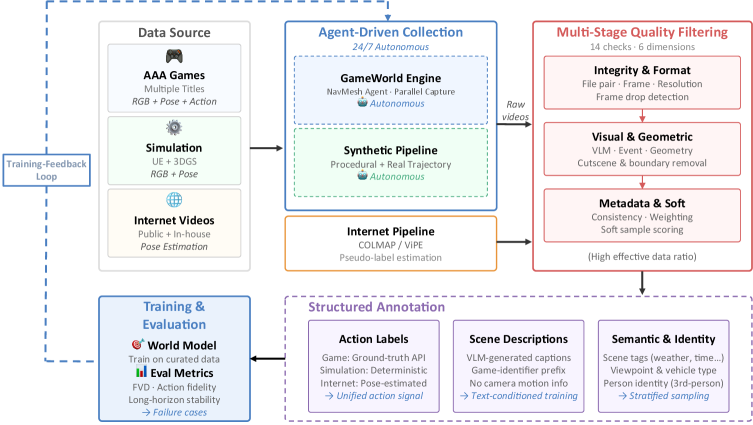
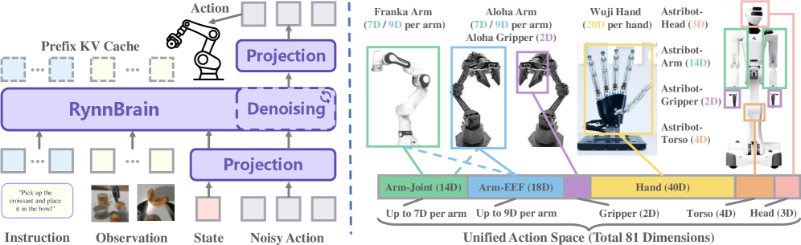

# HF Daily Papers 周报 · 2026-07-21 ~ 07-24

- **Date:** 2026-07-24
- **Tags:** HF-Daily-Papers, 世界模型, 具身智能, 视频生成, Agent, 扩散模型, RL, digest
- **覆盖范围:** 2026-07-21 ~ 07-24（4 天,承接上一份 [[2026-07-20-hf-daily-papers-jul10-20]]）

## Context

- **数据获取:** HF `daily_papers` API 逐日抓取,4 天共 **96 篇新论文**(07-21: 37 / 07-22: 25 / 07-23: 20 / 07-24: 14),已按 arXiv ID 对照上一份 digest 去重。
- **精选:** 按 upvotes 降序取 **Top 25**。
- **主线信号(本周极强):** **世界模型 / 具身智能全面爆发**——Top 10 里过半是 world model 或 embodied(ABot-World-0、RynnBrain、EvolvingWorld、Open-AoE、Generative World Renderer),且出现"单卡跑无限世界"(ABot 在 RTX 5090 上 16 FPS)与"跨本体具身基座"(RynnBrain 122B)两个标志性成果。次线是**视频时序理解**(TimeLens2)与**数据/Agent 工程化**(DataFlow-Harness)。

> [!NOTE]
> 本周 deep dive 两篇都命中"世界模型 × 具身"主线:**ABot-World-0**(单桌面 GPU 无限交互世界)与 **RynnBrain 1.1**(跨本体具身基座,基于 Qwen3.5——与本周 [[2026-07-21-raschka-llm-architecture-comparison]] 里补录的 Qwen3.5 呼应)。

## 论文总览表(Top 25 by upvotes)

| # | 论文 | ▲ | 日期 | 主题 |
|---|---|---|---|---|
| 1 | [ABot-World-0: 单桌面 GPU 无限交互世界 rollout](https://hf.co/papers/2607.19191) | 203 | 07-22 | 世界模型 |
| 2 | [RynnBrain 1.1: 更强更通用的具身基础模型](https://hf.co/papers/2607.17977) | 191 | 07-21 | 具身智能 |
| 3 | [TimeLens2: 多模态 LLM 通用视频时序定位](https://hf.co/papers/2607.17423) | 162 | 07-21 | 视频理解 |
| 4 | [DataFlow-Harness: 可编辑 LLM 数据管线的代码 Agent 平台](https://hf.co/papers/2607.16617) | 124 | 07-22 | 数据/Agent |
| 5 | [DeepSearch-World: 可验证环境里深度搜索 Agent 的自蒸馏](https://hf.co/papers/2607.07820) | 87 | 07-21 | Agent/RL |
| 6 | [EvolvingWorld: 角色扮演 Agent 与世界模型协同进化](https://hf.co/papers/2607.17250) | 86 | 07-21 | 世界模型 |
| 7 | [SWE-Pruner Pro: Coder LLM 早已知道该剪什么](https://hf.co/papers/2607.18213) | 74 | 07-21 | 代码/效率 |
| 8 | [文本模板 token 是扩散 Transformer 的隐式语义寄存器](https://hf.co/papers/2607.19139) | 70 | 07-22 | 扩散/可解释 |
| 9 | [Generative World Renderer at the Speed of Play](https://hf.co/papers/2607.18703) | 67 | 07-22 | 世界模型 |
| 10 | [Open-AoE: 开放第一人称操作数据集与工具链](https://hf.co/papers/2607.14183) | 64 | 07-21 | 具身数据 |
| 11 | [Mage-Flow: 高效原生分辨率图像生成与编辑基座](https://hf.co/papers/2607.19064) | 60 | 07-22 | 图像生成 |
| 12 | [HOMIE: 人-物中心视频个性化](https://hf.co/papers/2607.18217) | 54 | 07-21 | 视频生成 |
| 13 | [SLAI T-Rex: 昇腾 SuperPOD 上 DeepSeek-V4 全参后训练](https://hf.co/papers/2607.20145) | 54 | 07-23 | 训练系统 |
| 14 | [AlayaWorld: 交互式长时域世界建模(完整技术报告)](https://hf.co/papers/2607.18367) | 49 | 07-22 | 世界模型 |
| 15 | [Apple-π: 面向物理智能的"看视频思考"基准](https://hf.co/papers/2607.16401) | 41 | 07-21 | 物理/评测 |
| 16 | [AREX: 递归自我改进的深度研究 Agent](https://hf.co/papers/2607.21461) | 37 | 07-24 | Agent |
| 17 | [Subliminal Clocks: 扩散语言模型的潜时间建模](https://hf.co/papers/2607.01774) | 36 | 07-22 | 扩散/可解释 |
| 18 | [FlowMimic: 无掩码像素对扭曲流的在线视频编辑](https://hf.co/papers/2607.18227) | 35 | 07-21 | 视频编辑 |
| 19 | [GigaChat Audio: 时间感知的大音频语言模型](https://hf.co/papers/2607.10387) | 35 | 07-21 | 音频 |
| 20 | [Stale but Stable: 异步 RL 的陈旧度自适应信赖域](https://hf.co/papers/2607.18722) | 31 | 07-22 | RL 系统 |
| 21 | [GigaAM Multilingual: 弱资源语言基础模型](https://hf.co/papers/2607.10371) | 30 | 07-21 | 语音/多语 |
| 22 | [Self Gradient Forcing: 原生长视频外推](https://hf.co/papers/2607.20368) | 29 | 07-23 | 视频生成 |
| 23 | [Group Entropy-Controlled Policy Optimization](https://hf.co/papers/2607.16850) | 28 | 07-21 | RL |
| 24 | [ReflectWorld-MM: 开放视频流的实体导向多模态记忆](https://hf.co/papers/2607.09759) | 26 | 07-21 | 记忆/多模态 |
| 25 | [SeerGuard: 用世界模型预测保护移动 GUI Agent](https://hf.co/papers/2607.15550) | 24 | 07-21 | Agent 安全 |

## 分主题详解

### 🌍 世界模型(本周最强 cluster,7 篇)

- **ABot-World-0**(203▲):把交互式世界建模当**系统工程**而非单一生成目标,单张 RTX 5090 上 720P/16 FPS 无限 rollout(见 Deep Dive)。
- **EvolvingWorld**(86▲):开放 schema 框架,让角色扮演 Agent 与世界模型在交互式文学世界里**协同进化**——世界状态与角色行为互相塑造。
- **Generative World Renderer at the Speed of Play**(67▲):主打"游玩速度"的生成式世界渲染器,与 ABot 同攻实时性瓶颈。
- **AlayaWorld**(49▲):交互式**长时域**世界建模的完整技术报告,长 horizon 一致性是核心。
- **ReflectWorld-MM**(26▲):面向开放视频流的**实体导向多模态记忆**系统,解决世界模型的长期记忆漂移。
- **SeerGuard**(24▲):反向用世界模型——**预测** GUI Agent 动作后果来做安全护栏。

> 一句话:世界模型这周从"能生成"卷到"能实时、能长时、能记住、能协同、能当安全预言机"。

### 🤖 具身智能(4 篇)

- **RynnBrain 1.1**(191▲):2B/9B/122B-A10B 三尺度、跨 Unitree G1 / Astribot-S1 / 天玑无极三本体的具身基座,基于 Qwen3.5(见 Deep Dive)。
- **Open-AoE**(64▲):开放**第一人称(egocentric)操作数据集**+工具链,补具身学习的数据缺口。
- **Apple-π**(41▲):"看视频思考"基准,面向**物理定律 grounding** 的物理智能评测。

### 🎬 视频理解与生成(5 篇)

- **TimeLens2**(162▲):多模态 LLM 做**通用视频时序定位(temporal grounding)**——本周探花,把"第几秒发生了什么"做成 generalist 能力。
- **HOMIE**(54▲):人-物中心的视频个性化。
- **FlowMimic**(35▲):无掩码、用像素对扭曲流场做在线视频编辑数据生成。
- **Self Gradient Forcing**(29▲):原生**长视频外推**,缓解自回归视频漂移。

### 🧩 Agent / RL(5 篇)

- **DataFlow-Harness**(124▲):把 LLM 数据管线做成**可编辑的代码 Agent 平台**——数据工程的 harness 化。
- **DeepSearch-World**(87▲):可验证环境里深度搜索 Agent 的**自蒸馏**(呼应本周 [[2026-07-17-agentic-rl-credit-and-unified-multimodal]] 的信用分配主线)。
- **AREX**(37▲):**递归自我改进**的深度研究 Agent。
- **Stale but Stable**(31▲)/ **Group Entropy-Controlled PO**(28▲):异步 RL 稳定性(陈旧度自适应信赖域)与熵控策略优化——延续 SAO 那条异步 RL 主线。

### 🎨 扩散模型可解释性(2 篇有意思的小发现)

- **Text Template Tokens Are Implicit Semantic Registers**(70▲):发现扩散 Transformer 里**文本模板 token 充当隐式语义寄存器**——机理级洞察。
- **Subliminal Clocks**(36▲):扩散语言模型里存在**潜在的时间建模**("阈下时钟")。

### 🔊 音频 / 训练系统(其余)

- **GigaChat Audio**(35▲)/ **GigaAM Multilingual**(30▲):Sber 的时间感知大音频模型 + 弱资源语言基座。
- **SLAI T-Rex**(54▲):昇腾 SuperPOD 上对 **DeepSeek-V4** 家族做全参后训练——与本周架构笔记里 DeepSeek-V4-Pro 呼应,国产算力+国产模型的后训练实践。
- **Mage-Flow**(60▲):高效原生分辨率图像生成/编辑基座。
- **SWE-Pruner Pro**(74▲):Coder LLM "早已知道该剪什么"——用模型自身信号做代码上下文剪枝。

## Deep Dive 1:ABot-World-0 —— 把"无限交互世界"塞进一张桌面显卡

**一句话:** 交互式世界模型的瓶颈不是"能不能生成",而是**数据、意图表示、历史漂移、实时部署**四个耦合的系统问题;ABot-World-0 用一套工程栈让 720P 世界能在**单张 RTX 5090 上 16 FPS** 无限跑。

**方法(基于 Wan2.2 DiT 骨干):**
- **动作条件**:以**原始键盘输入**为唯一交互信号——8 维 multi-hot(WASD 移动 + IJKL 旋转),4 个打包成 32 维 token 对齐 VAE 时间压缩,在 patch-embedding 处加性注入。
- **身份保持**:reference-character 记忆模块把标准图编码成 identity token,用**固定负 temporal RoPE 索引** + 非对称注意力(视频 token 看记忆、反之不看)。
- **训练四段式**:双向 teacher(全 horizon)→ **teacher forcing** 转因果自回归 student → **ODE 蒸馏**压到 few-step → **LongForcing**(长 horizon 分布匹配,抗漂移)。
- **效率栈**:LightVAE 轻量解码器 + 内存感知调度 + FP8 低比特 DiT + SageAttention2 + Fast-RoPE + **有界局部 KV cache(滚动淘汰,cache 与 rollout 时长无关)**。

**关键数据(单卡 RTX 5090):**

| 配置 | FPS | 峰值显存 |
|---|---|---|
| Base / 仅 SageAttention2 | OOM | — |
| + LightVAE(首个可行) | 9.117 | 20.491 GiB |
| + FP8(DiT 1191→845ms) | 12.405 | 15.925 GiB |
| + Fast-RoPE | 13.269 | 19.281 GiB |
| **系统全开** | **最高 16** | **~19 GiB** |

- 动作到首帧延迟 **1.2s**;分辨率 1280×704。
- WorldRoamBench 上对比 Genie 3 / HappyOyster / LingBot-World / HY-World 1.5,动作保真、轨迹跟随、物理机制、记忆分均强;LongForcing 在 60 秒 rollout 后段的 HPSv3 与伪影指标明显优于 Causal-Forcing baseline。
- 涌现物理:碰撞、水痕、雪地脚印、墙体阻挡;支持小时级/天级 rollout。

**我的看法:** 这篇的价值不在单点模型,而在**把世界模型当系统问题拆解**——四段式训练(尤其 LongForcing 抗漂移)+ 有界 KV cache(让 cache 不随时长膨胀)是"无限 rollout"能成立的关键。19 GiB 显存意味着**消费级单卡可跑**,这是把 Genie 类能力平民化的一步。局限也诚实:过度锚定会限制运动、复杂/连续/语义指令还没上。

## Deep Dive 2:RynnBrain 1.1 —— 跨本体的具身基座(建在 Qwen3.5 上)

**一句话:** 用**统一时空 + 物理 grounding** 框架,把具身感知/空间推理/定位/规划做进一个 2B–122B 的模型族,并跨三种真实机器人本体部署。

**架构与训练:**
- **建在 Qwen3.5** 上的 decoder-only 视觉-语言设计(vision encoder + VL projector + LLM),三尺度共享架构,用 **DeepStack + Interleaved MRoPE** 做多模态融合与长时空建模。
- 两大预训练原则:**时空记忆** + **物理世界 grounding**。图像坐标映射到 [0,1000] 整数当文本 token 预测;3D grounding 预测 9 维框(中心/尺寸/朝向)。
- **跨本体**:81 维统一动作空间 + 本体专属 masking,部署到 Unitree G1 / Astribot-S1 / 天玑无极。
- 相比 1.0 新增:**接触点预测**(中心+角度,替代旧的四角抓取框)+ 2B/9B 的**原生 3D grounding**。

**关键基准:**

| 基准 | 成绩 |
|---|---|
| VSI-Bench / MMSI / RefSpatial(122B-A10B) | 75.0 / 52.0 / 79.1,**全面 SOTA** |
| MindCube(9B) | 56.6 → **86.9** |
| RefSpatial 随规模 | 2B 58.5 → 9B 67.2 → 122B 79.1 |
| 3D Grounding SUN RGB-D | 2B 34.28 → 9B 41.12 AP@15 |
| 真机成功率 | RynnBrain-VLA **86.67%** vs Qwen-based-VLA 60.00%;通用版 **91.67%** |

- **最惊艳的发现**:具身预训练下,推理密集型 cognition **随规模正向 scaling(+38.6%)**,而原始 Qwen3.5 在同任务上**负 scaling(−39.2%)**——说明具身预训练改变了 scaling 行为。

**我的看法:** 这篇实证了"具身预训练能扭转 scaling 曲线"——普通 VLM 在空间认知上越大越差,加了时空+物理 grounding 后反而越大越好,这对"要不要为具身单独 scale"是强证据。建在 Qwen3.5 上也印证了 [[2026-07-21-raschka-llm-architecture-comparison]] 里的判断:Qwen3.5 已是国产具身/Agent 的默认基座。81 维统一动作空间是跨本体泛化的工程关键。

## 趋势分析

1. **世界模型从"生成"卷到"系统"。** 本周 world model 占 Top 10 的一半,焦点全在生成之外的维度:实时(ABot 单卡 16 FPS、Generative World Renderer)、长时域(AlayaWorld、Self Gradient Forcing)、记忆(ReflectWorld-MM)、协同进化(EvolvingWorld)、甚至反用作安全预言机(SeerGuard)。**"能不能生成世界"已不是问题,"能不能实时/长时/记得住地交互"才是。**

2. **具身基座开始"扭转 scaling 曲线"。** RynnBrain 的 +38.6% vs −39.2% 对比是本周最重要的单点发现:通用 VLM 越大空间认知越差,而具身预训练让它越大越好。配合 81 维统一动作空间跨三本体,具身正从"每个机器人单独训"走向"一个基座打全场"。

3. **国产栈自成闭环。** RynnBrain(Qwen3.5)、SLAI T-Rex(昇腾 SuperPOD 训 DeepSeek-V4)、GLM/Kimi 系——模型基座、算力、后训练、具身落地正在国产内部形成完整链路,与本周架构横评笔记互为印证。

4. **异步 RL 稳定性仍是活跃战场。** Stale but Stable(陈旧度自适应信赖域)、Group Entropy-Controlled PO 延续了 SAO 那条"异步 RL 怎么稳"的主线——后训练工程持续是竞争焦点。

## Open Questions

- ABot 的"有界 KV cache + LongForcing"能否推广到**非游戏、开放世界**的连续/语义控制?消费级单卡跑世界模型后,下一步是端侧吗?
- RynnBrain"具身预训练扭转 scaling"是否普适?换掉 Qwen3.5 基座、换任务分布还成立吗?
- 世界模型(ABot/AlayaWorld)与具身基座(RynnBrain)何时合流——**用世界模型当具身 agent 的训练环境**已是明显方向(SeerGuard 已在预测动作后果)。
- 扩散 Transformer 的"隐式语义寄存器 / 潜时间"(#8/#17)这类机理发现,能否反哺可控生成?

## References

- ABot-World-0 — https://hf.co/papers/2607.19191
- RynnBrain 1.1 — https://hf.co/papers/2607.17977
- TimeLens2 — https://hf.co/papers/2607.17423
- DataFlow-Harness — https://hf.co/papers/2607.16617
- DeepSearch-World — https://hf.co/papers/2607.07820
- EvolvingWorld — https://hf.co/papers/2607.17250
- SWE-Pruner Pro — https://hf.co/papers/2607.18213
- Text Template Tokens as Semantic Registers — https://hf.co/papers/2607.19139
- Generative World Renderer — https://hf.co/papers/2607.18703
- Open-AoE — https://hf.co/papers/2607.14183
- Mage-Flow — https://hf.co/papers/2607.19064
- HOMIE — https://hf.co/papers/2607.18217
- SLAI T-Rex — https://hf.co/papers/2607.20145
- AlayaWorld — https://hf.co/papers/2607.18367
- Apple-π — https://hf.co/papers/2607.16401
- AREX — https://hf.co/papers/2607.21461
- Subliminal Clocks — https://hf.co/papers/2607.01774
- FlowMimic — https://hf.co/papers/2607.18227
- GigaChat Audio — https://hf.co/papers/2607.10387
- Stale but Stable — https://hf.co/papers/2607.18722
- GigaAM Multilingual — https://hf.co/papers/2607.10371
- Self Gradient Forcing — https://hf.co/papers/2607.20368
- Group Entropy-Controlled Policy Optimization — https://hf.co/papers/2607.16850
- ReflectWorld-MM — https://hf.co/papers/2607.09759
- SeerGuard — https://hf.co/papers/2607.15550

> 引用须可验证:以上均为 HF Daily Papers 真实链接;deep dive 数据引自各自 arXiv 全文。
