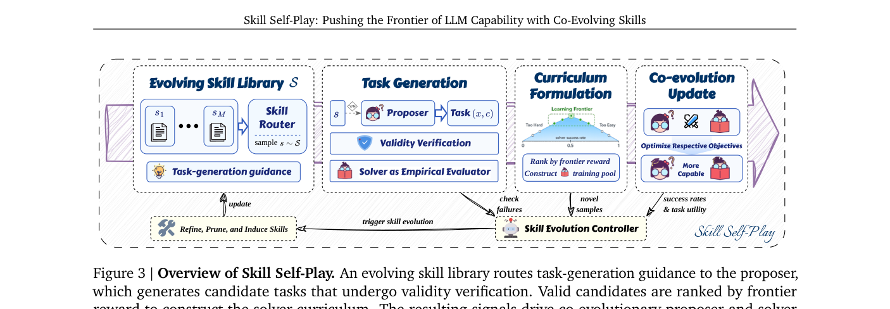
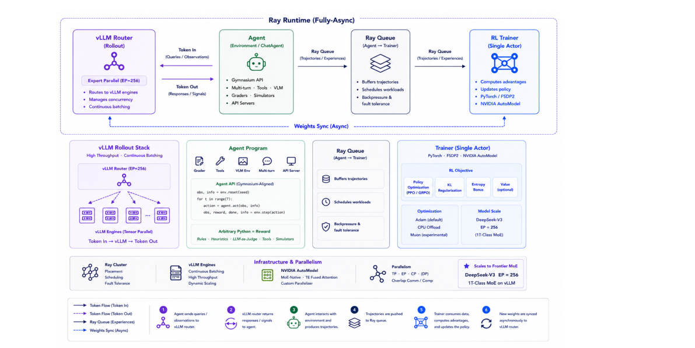

# HF Daily Papers 周报 · 2026-07-25 ~ 07-27

- **Date:** 2026-07-27
- **Tags:** HF-Daily-Papers, Agent, self-play, 强化学习, RL框架, 多模态, 数据工程, digest
- **覆盖范围:** 2026-07-25 ~ 07-27(承接 [[2026-07-24-hf-daily-papers-jul21-24]])

## Context

- **数据获取:** HF `daily_papers` API 逐日抓取。**07-25(周六)、07-26(周日)均为 0 篇**(周末投稿空档,常态),**07-27(周一)11 篇**。
- **去重:** 对照上一份 digest 的 25 个 arXiv ID 比对,**11 篇全部为新增,无重叠**。
- **本期特点(诚实说明):** 这是一个**只有周一单日**的窄窗口,总量仅 11 篇,且周一论文的 upvotes 还在累积中(最高仅 16▲,远低于上期 203▲)。因此本期**不做 Top 25 截取——11 篇全部收录**,并据技术含量而非票数挑 deep dive。
- **主线信号:** 尽管量少,方向高度集中在 **Agent 自我进化 + Agentic RL 基础设施**——两篇 deep dive 恰好是这条线的"算法侧"(Skill Self-Play)与"系统侧"(Molt)。

## 论文总览表(本期全部 11 篇)

| # | 论文 | ▲ | 主题 |
|---|---|---|---|
| 1 | [Skill Self-Play: 用协同进化的技能推高 LLM 能力上限](https://hf.co/papers/2607.22529) | 16 | Agent 自进化 ⭐ |
| 2 | [DataPrep-Bench: 把 LLM 当训练数据准备者来评测](https://hf.co/papers/2607.20465) | 14 | 数据工程/评测 |
| 3 | [Molt: 可扩展的 PyTorch 原生 Agentic RL 训练框架](https://hf.co/papers/2607.21653) | 10 | RL 系统 ⭐ |
| 4 | [Scaling Native Multimodal Pre-Training From Scratch](https://hf.co/papers/2607.22043) | 9 | 原生多模态预训练 |
| 5 | [LAMAR: 开放的语言感知多语对齐 reranker](https://hf.co/papers/2607.22042) | 6 | 多语/检索 |
| 6 | [Agentic Context Management: 把 Agent 记忆与成本当同一问题解](https://hf.co/papers/2607.21503) | 5 | Agent 上下文 |
| 7 | [Multi-Head Latent Control: LLM Agent 决策的统一接口](https://hf.co/papers/2607.14277) | 4 | Agent 决策 |
| 8 | [SceneActBench: Agent 能对它看到的 3D 场景采取行动吗?](https://hf.co/papers/2607.22393) | 3 | 具身/评测 |
| 9 | [IDEAgent: 研究想法生成的 Agentic 质量-多样性搜索](https://hf.co/papers/2607.22375) | 3 | 科研 Agent |
| 10 | [Closing the Loop: 自回归生成的免训练 revisit 一致性](https://hf.co/papers/2607.21848) | 2 | 生成一致性 |
| 11 | [VisCo: 把 LLM 当视觉 token 的内在编码器](https://hf.co/papers/2607.12756) | 1 | 多模态 |

## 分主题详解

### 🔄 Agent 自我进化(本期最强方向)

- **Skill Self-Play**(16▲,Qwen Applications):把"技能库"当自我进化的中间层,解决"任务多样性 vs 验证可靠性"的根本张力(见 Deep Dive 1)。
- **IDEAgent**(3▲):用**质量-多样性搜索**做研究想法生成——不只求好,还求想法之间有差异度。
- **Multi-Head Latent Control**(4▲):给 LLM Agent 决策做**统一接口**(名字明显致敬 MLA)。

### ⚙️ Agentic RL 基础设施

- **Molt**(10▲,NVIDIA NeMo):**8.6K 行**的 PyTorch 原生 agentic RL 框架,对标 verl(~62K 行)/ slime(~25K 行),核心主张"精简不损吞吐"(见 Deep Dive 2)。
- 延续了我近期追踪的异步 RL 主线([[2026-07-17-agentic-rl-credit-and-unified-multimodal]] 的 SAO/TRACE/TRIAGE)——**从算法卷到框架**。

### 🧠 Agent 记忆与上下文

- **Agentic Context Management**(5▲):把 **Agent 记忆问题与成本问题当作同一个问题**来解——长程 agent 的上下文膨胀既是能力瓶颈也是账单瓶颈,这个视角很实用(呼应上期 CompactionRL)。

### 🖼️ 多模态

- **Scaling Native Multimodal Pre-Training From Scratch**(9▲):从零做原生多模态预训练的 scaling 研究——与上期 Inkling/Tuna-2 的"encoder-free / 原生多模态"同线。
- **VisCo**(1▲):把 LLM 本身当视觉 token 的**内在编码器**,又一个"去掉独立 vision encoder"的尝试。

### 📊 数据工程 / 评测

- **DataPrep-Bench**(14▲,本期第二高):评测 **LLM 作为"训练数据准备者"** 的能力。这个切口有意思——数据管线正在被 agent 化(呼应 tech-blogs 周报里的 DataFlow-Harness)。
- **SceneActBench**(3▲):agent 能否对看到的 3D 场景真正**采取行动**(感知→行动的落差评测)。
- **LAMAR**(6▲):开放的多语对齐 reranker。

## Deep Dive 1:Skill Self-Play —— 用"技能库"破解自我进化的死结

**一句话:** 自我进化 LLM 面临一个两难——**绑定环境**能拿到可靠验证但领域受限,**开放生成**领域够广但会让"误导性奖励污染训练回路"。Skill-SP 指出**agent skills 是完美的中间地带**:每个技能在自己的场景里支持可验证执行,而在技能之间路由又保住了任务多样性。

**三个角色的自博弈循环:**
1. **Proposer** $\pi_{propose}$:从采样到的技能出发,合成**处在 solver 学习前沿**的难任务;
2. **Solver** $\pi_{solve}$:搜索候选解,拓展自己的能力边界;
3. **Skill Evolution Controller**:用执行反馈**精炼 / 剪枝 / 归纳(induce)** 技能,让技能库持续生长而不膨胀。

任务形式化为 $(x, c)$——$x$ 是 solver 可见的 prompt,$c$ 是**隐藏的机器可读验证契约**(单元测试/参考答案),只由环境评估,返回 $\mathcal{R}_{solve}\in[0,1]$。

**训练配置:** 5 轮迭代,GRPO 优化(4 proposer + 5 solver rollouts);工具调用每轮 8000 任务池($\alpha=0.5$、$K=10$ 探针),推理域 1920 任务用确定性 checker。结果报 avg@8。**技能精炼与归纳只靠 backbone 自己,不用更强的外部 teacher。**

**主结果(工具调用,avg@8):**

| Backbone | 基线 Avg | +Unguided SP | **+Skill-SP** |
|---|---|---|---|
| Qwen3-4B-Instruct | 60.2 | 64.1 (+3.9) | **66.7 (+6.5)** |
| Qwen3-8B | 69.4 | 71.0 (+1.6) | **72.2 (+2.8)** |
| **Ministral-3-8B** | 20.7 | 20.8 (+0.1) | **63.6 (+42.9)** 🔥 |
| Ministral-3-14B | 22.2 | 59.0 (+36.8) | **64.5 (+42.3)** |
| Granite-4.1-3B | 57.2 | 58.2 (+1.0) | **62.5 (+5.3)** |

- 论文自报:工具使用最高 **+42.9** 点、逻辑推理最高 **+12.0** 点。
- **最值得注意的对比**:Ministral-3-8B 上 **unguided self-play 完全无效(+0.1)**,而 Skill-SP 拿到 **+42.9**——证明增益来自"技能引导",不是"自博弈"本身。论文称之为对"初始未对齐模型的惊人翻转"。
- 另一个关键观察:unguided 生成在复杂任务(如合成有效逻辑谜题)上**结构性崩塌**,根本 bootstrap 不起来,所以在推理域只能评 Skill-SP。

**我的看法:** 这篇的洞察很锋利——**验证可靠性与任务多样性的张力,可以用"技能"这个粒度来解耦**:技能内部可验证,技能之间保多样。Ministral 那组数据(+0.1 vs +42.9)几乎是对"裸自博弈无用论"的直接证据。局限:技能库的初始种子 $S^{(0)}$ 仍需人工给,且实验规模限于 3B–14B。

## Deep Dive 2:Molt —— 8.6K 行的 Agentic RL 框架(NVIDIA)

**一句话:** Agentic RL 研究的真实成本是**"不停改算法"**——改一次估计器/流水线/rollout 方案,就要在 trainer、分布式后端、rollout 管道三处同步改。Molt 主张用**一个人能装进脑子、也能被 AI 编码助手整体读完**的精简代码库来消掉这个开销。

**核心设计原则:**
- **Agent 就是普通程序**(不是框架特殊构件)——subclass `Env` 或 `ChatAgent` 一个 Python 文件、返回 `Result(reward=...)` 即可训练,无环境 DSL、无注册表;
- **单个异步循环**同时训练多模态与 MoE 策略;
- **正确性保证:"永不在自己没生成的 token 上训练"**,在 token、策略版本、模型语义三个层面保持一致;
- 引擎是**组合**而非 fork——上游 vLLM 的优化"当天以 flag 形式到达"。

**代码规模对比(Table 1,按 import 图统计 RL 路径):**

| 框架 | RL 代码行数 | 设计中心 |
|---|---|---|
| **Molt** | **~8.6K** | 可读的 agentic 研究 |
| OpenRLHF | ~7.2K | RLHF 覆盖面 |
| verl | ~62K | 生产级广度 |
| slime | ~25K | Megatron 吞吐 |

**性能主张:** 在**匹配的全异步协议**下,Molt 与"最先进的 Megatron 栈"**统计上可比**——即"精简不以吞吐为代价"。实测配方为 Qwen3.6-35B-A3B(多模态 MoE)+ 32K 多轮工具使用任务,2 节点(8 训练 + 8 rollout GPU)。⚠️ 摘要与正文均为**定性/统计可比**表述,未给绝对吞吐数字。

**我的看法:** 这是"研究者体验"导向的框架设计,和 GLM 的 slime、字节的 verl 是不同价值取向——**verl 求广、slime 求吞吐、Molt 求可改**。8.6K vs 62K 的对比很有说服力,而且它明确把"能被 AI 编码助手整体读完"写成设计目标,这个考虑在 2026 很务实。需要观察的是:精简是否会在更极端规模(千卡、万亿参数)下露出短板——论文只测到 2 节点。

## 趋势分析

1. **Agentic RL 的战场从"算法"扩到"框架"。** 上期是 TRACE/SAO/TRIAGE 卷信用分配算法,本期 Molt 直接卷框架可维护性(8.6K 行)。**后训练基础设施已成显式竞争维度**——GLM 有 slime、NVIDIA 有 Molt。

2. **自我进化找到了"可验证性"的落点。** Skill-SP 的核心贡献是用**技能粒度**同时拿到可验证与多样性,这比"纯开放生成"和"绑死环境"都更可持续。Ministral 上 +0.1 vs +42.9 的对照说明:自博弈要有效,**结构化引导是必需的**。

3. **数据管线正在 agent 化。** DataPrep-Bench(评 LLM 当数据准备者)+ 上周 tech-blogs 的 DataFlow-Harness——"让 agent 造训练数据"从工程实践走向有基准可评。

4. **去独立 vision encoder 继续。** VisCo(LLM 当内在视觉编码器)+ Scaling Native Multimodal——延续 Inkling/Tuna-2 那条 encoder-free 线。

## Open Questions

- Skill-SP 的初始技能库 $S^{(0)}$ 仍需人工种子:能否让技能**完全从零冷启动**?技能库长期是否会漂移/退化?
- Molt 的"精简"在千卡级/万亿参数下还成立吗?(只测到 2 节点 16 GPU)
- "永不在自己没生成的 token 上训练"这条约束,与部分 rollout / 陈旧策略的效率诉求如何权衡?(呼应上周 Stale-but-Stable)
- Agentic Context Management 把记忆与成本统一建模——这个框架能否吸收 CompactionRL 那类上下文压缩 RL?

## References

- Skill Self-Play — https://hf.co/papers/2607.22529 · [arXiv:2607.22529](https://arxiv.org/abs/2607.22529) · [code](https://github.com/Qwen-Applications/skill-self-play)
- DataPrep-Bench — https://hf.co/papers/2607.20465
- Molt — https://hf.co/papers/2607.21653 · [arXiv:2607.21653](https://arxiv.org/abs/2607.21653) · [code](https://github.com/NVIDIA-NeMo/labs-molt)
- Scaling Native Multimodal Pre-Training From Scratch — https://hf.co/papers/2607.22043
- LAMAR — https://hf.co/papers/2607.22042
- Agentic Context Management — https://hf.co/papers/2607.21503
- Multi-Head Latent Control — https://hf.co/papers/2607.14277
- SceneActBench — https://hf.co/papers/2607.22393
- IDEAgent — https://hf.co/papers/2607.22375
- Closing the Loop — https://hf.co/papers/2607.21848
- VisCo — https://hf.co/papers/2607.12756

> 引用须可验证:以上均为 HF Daily Papers 真实链接;两篇 deep dive 的方法与数字引自各自 arXiv PDF 全文(已精读),配图从 PDF 渲染。本期窗口仅周一单日、总量 11 篇,upvotes 仍在累积,不宜与往期票数横向比较。
