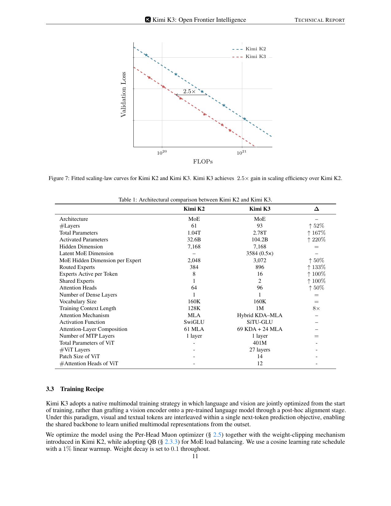
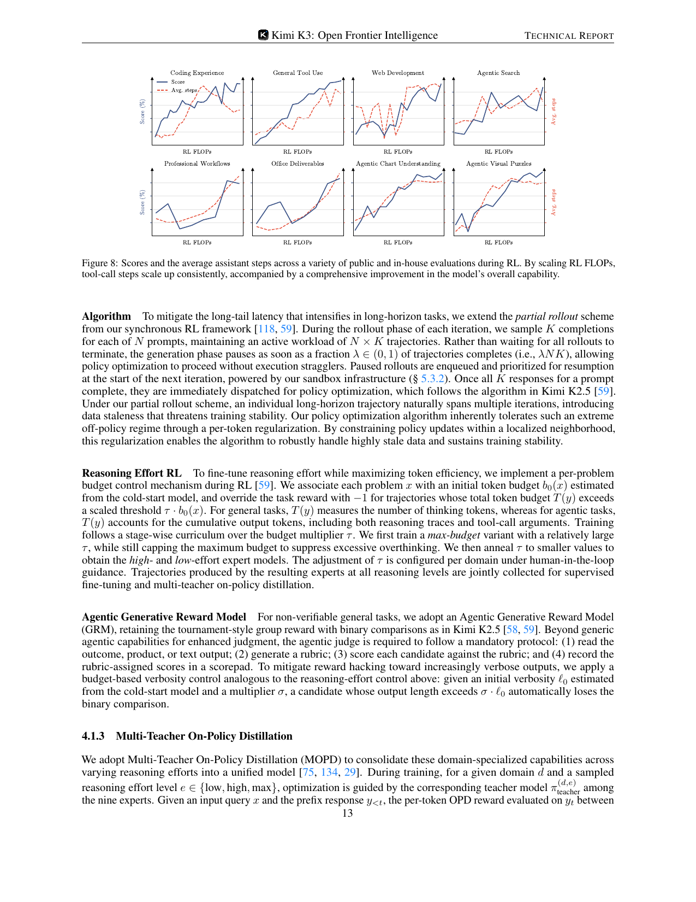
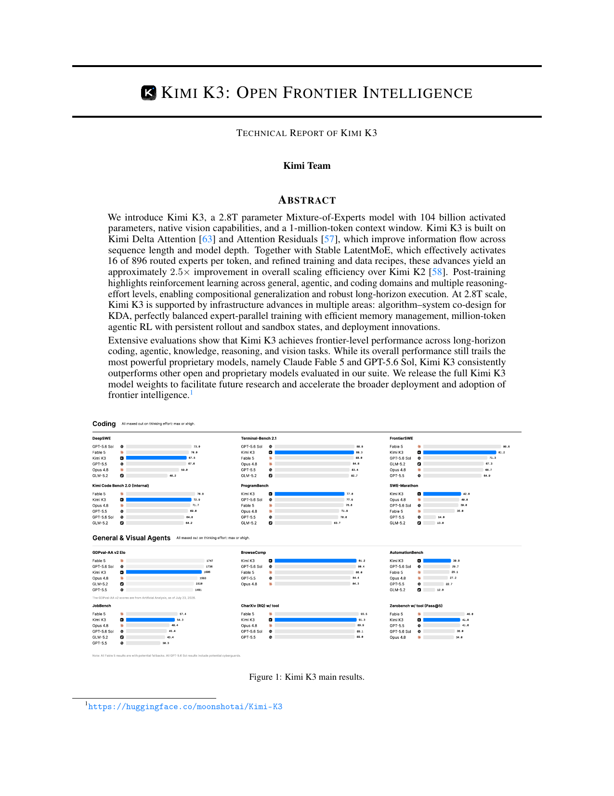
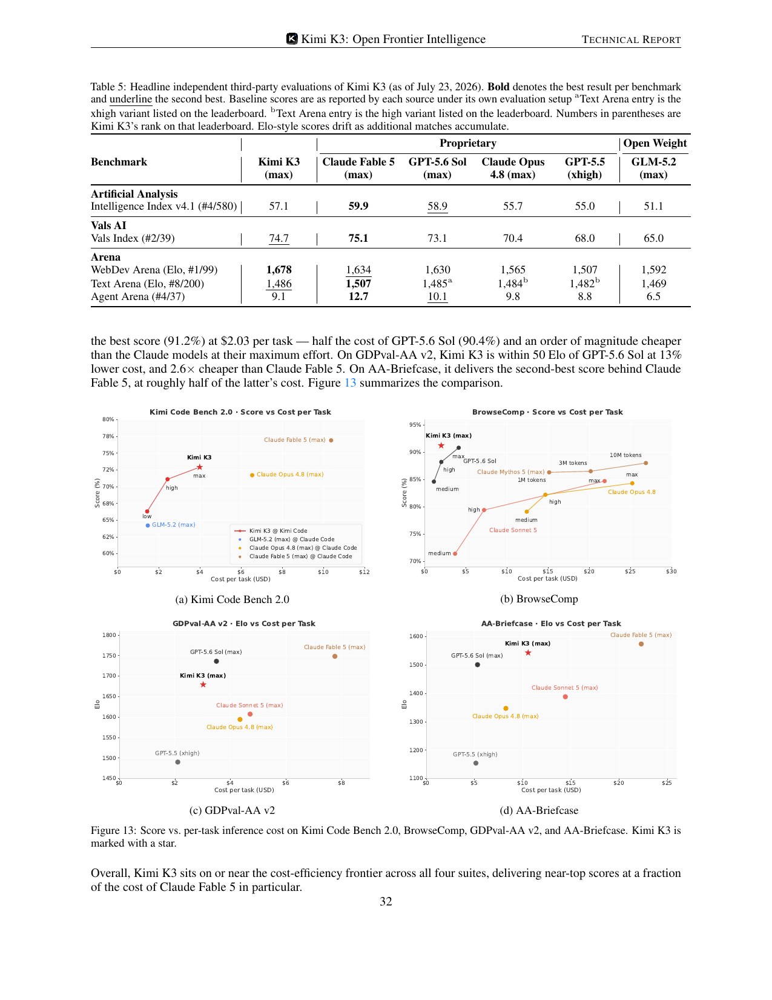

# 技术报告精读：Kimi K3 —— Open Frontier Intelligence（2.8T MoE / 1M 上下文 / NoPE）

- **Date:** 2026-07-27
- **Tags:** #tech-report #moe #kimi #long-context #nope #kda #agentic-rl #reasoning-effort #open-weight-models

## Context

**来源**：*Kimi K3: Open Frontier Intelligence — Technical Report of Kimi K3*（Kimi Team，2026-07-27），[alphaXiv `2607.kimi-k3-report`](https://www.alphaxiv.org/abs/2607.kimi-k3-report)，权重 [moonshotai/Kimi-K3](https://huggingface.co/moonshotai/Kimi-K3)。

> ⚠️ **来源性质须先说明**：这是**厂商自己的技术报告，非同行评审**，且**未被 arXiv 收录**（`arxiv.org/abs/2607.kimi-k3-report` 返回 404；该 ID 也不是标准 `YYMM.NNNNN` 格式，是 alphaXiv 自有标识）。故**未入 `references.bib`**（遵循「只登记可验证 arXiv/DOI 标识」的约束）。本文所有数字均取自 PDF 正文（下载后 `pdftotext` 抽取全文核对），非我推断；配图为 PDF 页面渲染。

**为什么值得精读**：它同时命中本项目几条主线——[长上下文](/research-notes/2026-07-20-llm-long-context.md)（**NoPE + 1M 外推**）、[推理努力度控制](/research-notes/2026-07-20-blog-reasoning-effort.md)（3 档 effort × 3 域 = 9 专家）、[长程 agent](/research-notes/2026-07-20-long-horizon-agents.md)（百万 token agentic RL）、以及本周三份 digest 共振的"开源 MoE 屠榜周"。

## TL;DR

Kimi K3 = **2.8T 总参 / 104B 激活的原生多模态 MoE，1M 上下文**，靠"沿**序列 / 深度 / 宽度**三个维度同时扩展信息流"拿到相对 Kimi K2 约 **2.5× 的 scaling 效率**。开源全部权重。

三个我认为最有价值的技术点：
1. **NoPE**——**完全不用显式位置编码**，位置信息隐含在 KDA 的递归门控与衰减里，因此"无需 RoPE 重缩放/插值就直接外推到 1M"。
2. **Attention Residuals**——把 Transformer 对序列做的"选择性访问"**搬到深度方向**：每层用可学习 pseudo-query 对所有前层输出做 softmax 注意力，而非均匀累加残差。
3. **9 专家蒸馏**——3 域 × 3 档 reasoning effort 各训一个 RL 专家，再用多教师 on-policy 蒸馏（MOPD）合并回单模型。

报告**坦承整体仍落后 Claude Fable 5 与 GPT-5.6 Sol**，但主打**成本效率**：BrowseComp 上拿到最高分 91.2% 且每任务仅 $2.03（GPT-5.6 Sol 的一半、Claude max effort 的 1/10 量级）。

## Main Content

### 1｜架构：沿三个维度扩「信息流」

全篇的组织逻辑非常清晰——把"信息怎么流动"拆成三个正交维度分别攻击：

| 维度 | 机制 | 具体做法 |
|---|---|---|
| **序列（token mixing）** | Hybrid Attention | 每块 **3 层 KDA + 1 层 Gated MLA**（3:1），backbone 末尾再加一层 MLA，**保证最后一层是全局注意力** |
| **深度（layer mixing）** | **Attention Residuals (AttnRes)** | 每层选择性检索**所有前层**表示，而非顺序累加 |
| **宽度（channel mixing）** | **Stable LatentMoE** | **896 路由专家，每 token 激活 16 个**（稀疏度 56） |
| 视觉 | MoonViT-V2 + 轻量 projector | 原生多模态，视觉 token 映射进共享 embedding 空间 |

**KDA（Kimi Delta Attention）**：把 delta-rule 递推加上**逐通道遗忘门**：

$$S_t = \left(I - \beta_t k_t k_t^\top\right)\mathrm{Diag}(\alpha_t)\,S_{t-1} + \beta_t k_t v_t^\top,\qquad \tilde o_t = S_t^\top q_t$$

其中 $\alpha_t \in (0,1)^{d_k}$ 是**逐通道的一步保留因子**、$\beta_t$ 控制 delta-rule 写入强度。q/k 经 ShortConv + Swish + L2Norm，v 经 ShortConv + Swish。计算上采用 **块间递归、块内并行** 的 chunkwise 形式。

**Attention Residuals** 是我认为最漂亮的设计。作者的论证是：标准残差把所有前层信息压进单一状态 $h_l$，是**"深度方向的 RNN 瓶颈"**——而 Transformer 早已用注意力取代了序列方向的递归，那深度方向为何不能？于是每层定义可学习 pseudo-query $q_l = w_l$，keys/values 取各前层输出（含 token embedding），用 softmax 核 $\phi(q,k)=\exp(q^\top \mathrm{RMSNorm}(k))$ 算权重（RMSNorm 防止大幅值层主导）。

工程上用 **Block AttnRes** 把开销从 $O(Ld)$ 降到 $O(Nd)$：L 层切成 N 块、块内求和、块间才做全注意力。K3 取 **8 块 × 12 层**（含 embedding 层共 9 个源）。

**Stable LatentMoE** 解决极端稀疏引发的两个失效模式：
- **激活爆炸**：路由路径 $W_\downarrow \to$ 门控多分支专家 FFN $\to W_\uparrow$ 近似四个连乘矩阵，在 2.8T 规模下内部激活爆炸。对策：up-projection 前加 **RMSNorm** + 自创 **SiTU-GLU**（Sigmoid Tanh Unit GLU，有界：$|f(x)| \le \beta_1\beta_2$，K3 取 $\beta_1{=}4,\beta_2{=}25$ 即上界 100；近原点处贴合 SwiGLU）。
- **近千专家的负载均衡**失控（超出 auxiliary-loss-free bias 更新的适用区间）。对策：**Quantile Balancing (QB)**。

### 2｜K2 → K3：变了什么（报告 Table 1）

| | Kimi K2 | Kimi K3 | Δ |
|---|---|---|---|
| 层数 | 61 | **93** | ↑52% |
| 总参 / 激活 | 1.04T / 32.6B | **2.78T / 104.2B** | ↑167% / ↑220% |
| Hidden dim | 7,168 | 7,168 | = |
| Latent MoE dim | — | 3,584 (0.5×) | — |
| 路由专家 / 每 token 激活 | 384 / 8 | **896 / 16** | ↑133% / ↑100% |
| 共享专家 | 1 | 2 | ↑100% |
| 注意力头 | 64 | 96 | ↑50% |
| 训练上下文 | 128K | **1M** | **8×** |
| 注意力机制 | 全 MLA (61 层) | **69 KDA + 24 MLA** | — |
| 激活函数 | SwiGLU | **SiTU-GLU** | — |
| ViT | — | 401M / 27 层 / patch 14 | — |

注意**宽度没变**（hidden 7168 不变），增长全来自**深度（+52%）与专家数（+133%）**——这与"扩信息流而非单纯堆宽"的叙事一致。

### 3｜Scaling Law：2.5× 效率增益

报告为新架构**重新调了 batch size、学习率、TPP（tokens-per-parameter）与模型形状**，在 held-out OOD 验证集上拟合 scaling law，得到相对 K2 约 **2.5× 的整体 scaling 效率增益**。

一个方法论细节值得记：他们**选 cosine decay 而非 WSD**，理由不是"cosine 更好"，而是——**两种 schedule 的最优超参差异很大**，若用同一组超参比较会不公平地偏向其中一方；于是**各自独立做 scaling-law 搜索**，在各自最优设置下 cosine 的最终 loss 更低。这是个诚实的实验设计说明。

### 4｜长上下文：NoPE + 合成数据 + 四阶段扩展

这是本报告对我[长上下文综述](/research-notes/2026-07-20-llm-long-context.md)最有冲击的一节。

- **位置编码：NoPE**。报告原文：K3 **不使用显式位置嵌入**，位置信息通过 **KDA 的递归门控与衰减机制隐式编码**；因此模型"**直接外推到 1M 上下文，无需任何位置编码修改（如 RoPE 重缩放或插值）**"。
- **长上下文数据**：天然长文档/视频噪声大（近重复、二进制块、截断文件、无效机器日志），故走专门清洗流水线（精确+模糊去重、视频帧感知哈希、启发式与分类器质量过滤、结构校验），并**上采样**长样本。
- **关键论断**：**"光有长度不带来长程能力"**（Length alone does not confer long-range capability）。因此他们**合成**长上下文数据——刻意置换、拼接多模态文档与子任务，使嵌入的任务**只能靠注意分散在整个 1M 上下文的信息才能解**，以此"在目标尺度上训练注意力、防止其退化成局部模式"。
- **四阶段渐进扩展**：预训练 **8K → 64K**，冷却期 **256K → 1M**。把昂贵的长序列计算集中在总预算的一小部分。

### 5｜后训练：3 域 × 3 档 effort = 9 专家，再蒸成一个

三阶段流水线：**SFT 冷启动 → RL 训领域专家（分 effort 档）→ MOPD（Multi-Teacher On-Policy Distillation）合并**。

- **SFT**：用前代 Kimi 的领域专精模型合成轨迹 + 多阶段验证 + human-in-the-loop 标注；用自研 **XTML**（eXtensible Token Markup Language）chat template 序列化复杂 agentic 轨迹。**从 SFT 阶段起就开 QAT**（MXFP4 权重 / MXFP8 激活）——量化是设计前提而非事后压缩。
- **RL 三域**：(i) 通用任务（含视觉、推理、忠实性、搜索、知识工作）；(ii) 通用 agent（长程助理、deep research、段落级写作）；(iii) 编码 agent（SWE、coding experience、kernel、web 开发）。
- **3 档 effort**：`{low, high, max}`。**三域 × 三档 = 9 个专家模型**，最后蒸馏回单一模型。

> **我读到的关键实证**：RL FLOPs ↑ → **工具调用步数 ↑ 且能力全面 ↑**。这为[长程 agent 整理](/research-notes/2026-07-20-long-horizon-agents.md)里"Pillar II 内化"提供了直接证据：长程执行不只靠 harness 外挂，是**可以被 RL 训进策略的**。

### 6｜基础设施：为 KDA 与 1M agentic RL 定制

- **KDA 算法-系统协同设计**：KDA 用**固定大小递归状态**替代增长的 KV cache，代价是串行更新与 GPU 宽并行偏好冲突。对策是**分执行阶段各写一个 kernel**——训练/prefill 用 **FlashKDA**（CUTLASS 实现的 chunkwise kernel，把块内计算与跨块状态传播**重叠**，显著超过 Triton 参考实现，已作为 flash-linear-attention 的后端自动派发）。
- **1M agentic RL**：co-located RL 训练把每个 1M 上下文实验控制在**几百张 GPU**内；用 **partial rollouts** 降超长轨迹的尾延迟。核心矛盾是"要为下轮保留的 rollout KV cache"与"训练所需显存"争抢——对策是**外部 KV cache 池**：活跃解码块留 GPU，可复用的空闲前缀在被逐出时**写回 CPU DRAM**、下次复用前预取；**KDA 状态与对应 MLA KV 块一起卸载/预取，保持生命周期对齐**。
- 另有 3T 级预训练的均衡专家并行与显存管理、以及推理/在线服务优化。

### 7｜评测：承认落后，赢在成本

报告自测的主结果（全部在 max/xhigh effort 下）：编码类 Kimi K3 在 **Terminal-Bench 2.1 (88.3)、ProgramBench (77.8)、SWE-Marathon (42.0)** 领先或接近第一，但 **DeepSWE (67.5)** 落后 GPT-5.6 Sol(73.0)/Fable 5(70.0)；agentic 类在 **BrowseComp (91.2)、AutomationBench (30.8)、Zerobench w/tool (46.0)** 居首，**GDPval-AA v2 Elo (1686)** 次于 Fable 5(1747)/GPT-5.6 Sol(1736)。

**第三方独立评测**（截至 2026-07-23，报告 Table 5）：

| Benchmark | **Kimi K3** (max) | Claude Fable 5 (max) | GPT-5.6 Sol (max) | Opus 4.8 (max) | GLM-5.2 (max) |
|---|---|---|---|---|---|
| AA Intelligence Index v4.1 | 57.1 (#4/580) | **59.9** | 58.9 | 55.7 | 51.1 |
| Vals Index | 74.7 (#2/39) | **75.1** | 73.1 | 70.4 | 65.0 |
| **WebDev Arena (Elo)** | **1,678 (#1/99)** | 1,634 | 1,630 | 1,565 | 1,592 |
| Text Arena (Elo) | 1,486 (#8/200) | **1,507** | 1,485 | 1,484 | 1,469 |
| Agent Arena | 9.1 (#4/37) | **12.7** | 10.1 | 9.8 | 6.5 |

**成本效率是真正的卖点**：

| 套件 | 结果 |
|---|---|
| Kimi Code Bench 2.0 | 落后 Fable 5 **4.0 分，但只花 38% 成本**；**high effort 即追平 Opus 4.8 的 max effort**，成本约 **1/3** |
| BrowseComp | **最高分 91.2%，$2.03/任务** —— GPT-5.6 Sol(90.4%) 的**一半**成本，比 Claude 系 max effort **便宜一个数量级** |
| GDPval-AA v2 | 距 GPT-5.6 Sol **50 Elo 内**，成本低 13%，比 Fable 5 **便宜 2.6×** |
| AA-Briefcase | 第二名（次于 Fable 5），成本约其**一半** |

## 我的评述

- **NoPE + 线性注意力递归是本报告最值得追的技术线**。它与本周 Inkling 的"学习式相对位置偏置替代 RoPE"（见 [Inkling 深读](/research-notes/2026-07-20-blog-inkling-moe.md)）**同周出现**——两个旗舰级开源模型都在宣告"不要 RoPE"。若 K3 的 1M 直接外推被独立复现，这对我 [长上下文综述](/research-notes/2026-07-20-llm-long-context.md) §1 记录的"RoPE 频率缩放（PI→NTK→YaRN→LongRoPE）"主流路线是**实质挑战**：位置信息可以由**架构的递归结构**承载，而不必由位置编码显式提供。
- **"光有长度不带来长程能力"这句话值得抄下来**。它精确对应我综述 §7 的评测主线（名义窗口 ≠ 有效长度）——而 K3 的应对是**在数据侧合成"必须跨全窗口才能解"的任务**。这比单纯上采样长文档高明，是把"评测的批评"直接转化成"训练的方法"。
- **9 专家 × effort 再蒸馏，是后训练工程化的极致**。它把[推理努力度综述](/research-notes/2026-07-20-blog-reasoning-effort.md)里"每档 effort 单独训"的配方与**领域**做了笛卡尔积，比我综述里记录的任何一家（DeepSeek V4 三档、Nemotron 三模式、Kimi K2.5 Toggle）都更彻底。也再次印证本周 HF Papers 的主线（Direct-OPD / SEED）：**大模型 RL 太贵 → "分头训 + 蒸回单模型"成为标准范式**。
- **定位诚实**。明说落后 Fable 5 与 GPT-5.6 Sol，把叙事放在成本效率上——这比宣称全面 SOTA 可信得多，也与本周 Reddit 的 "benchmaxx" 质疑、Inkling "refreshingly honest" 的基准画像形成同一趋势：**开源阵营的竞争焦点正从"刷榜"转向"诚实画像 + 性价比"**。
- **可信度提醒（重要）**：厂商自述、非同行评审、arXiv 未收录。内部 benchmark（Kimi Code Bench 2.0 内部测；成本部分自测 vs 引用他人图表）**存在口径不一致，报告自己也标注了**（如 SWE-Marathon 用 H20 校准分支、PostTrainBench 用 H20 而非官方 H100、Fable 5 在 35% 任务触发 fallback）。**引用时建议只用第三方那张表（AA/Vals/Arena）的数字**，内部数字须连同口径一起转述。

## Open Questions

1. **NoPE + KDA 的 1M 外推能否被独立复现？** 报告的"直接外推、无需任何位置编码修改"是强主张，但缺少与 RoPE-scaling 基线在同等条件下的对照实验（如 RULER 类多针测试）。
2. **2.5× scaling 效率增益如何归因？** 报告把它归给"架构 + 数据 + 训练配方"整体，但没给 ablation——AttnRes、KDA hybrid、SiTU-GLU/QB 各贡献多少？这对想借鉴单点设计的人最关键。
3. **9 专家蒸馏后，各档 effort 的行为是否仍可靠区分？** MOPD 把 9 个策略压进一个模型，effort 档位的"边界"会不会模糊（对照我推理努力度综述里 Qwen3"部分推理是涌现而非训练"的现象）？
4. **Attention Residuals 的推理开销**：Block 版把内存降到 $O(Nd)$，但 8 块的跨块注意力在 1M 上下文的长解码里累积成本如何？报告提到用 online softmax 合并块间/块内结果，但没给端到端延迟分解。
5. **固定大小递归状态（KDA）在超长程精确检索上的上限**：线性注意力的固定状态天然有信息瓶颈，3:1 的 KDA:MLA 配比是否足以支撑 1M 级的"大海捞针"？报告未给该类专项结果。

## References

- 报告：[Kimi K3: Open Frontier Intelligence](https://www.alphaxiv.org/abs/2607.kimi-k3-report)（alphaXiv `2607.kimi-k3-report`，2026-07-27，Kimi Team）
- 权重：[moonshotai/Kimi-K3](https://huggingface.co/moonshotai/Kimi-K3)
- 报告内引用的关键前作（其编号见原文参考文献）：Kimi Linear / KDA [63]、Attention Residuals [57]、LatentMoE [32]、DeepSeekMoE [23]、Kimi K2 [58]

**本项目关联笔记**
- [长上下文综述](/research-notes/2026-07-20-llm-long-context.md) —— NoPE 这条线已补进 §1（位置编码外推）
- [推理努力度控制综述](/research-notes/2026-07-20-blog-reasoning-effort.md) —— 9 专家 × effort 配方
- [长程 agent 研究路径](/research-notes/2026-07-20-long-horizon-agents.md) —— 1M agentic RL / Pillar II 内化
- [Inkling 深读](/research-notes/2026-07-20-blog-inkling-moe.md) —— 同周另一个"弃用 RoPE"的开源 MoE
- [LongStraw 深读](/research-notes/2026-07-20-longstraw-longcontext-rl.md) —— 长上下文 agentic RL 的系统侧

> 说明：本篇**未向 `references.bib` 入库**——该报告无 arXiv/DOI 标识，不符合本项目「引用须可验证」的登记标准。配图为报告 PDF 页面渲染（已注明来源页/图号）。