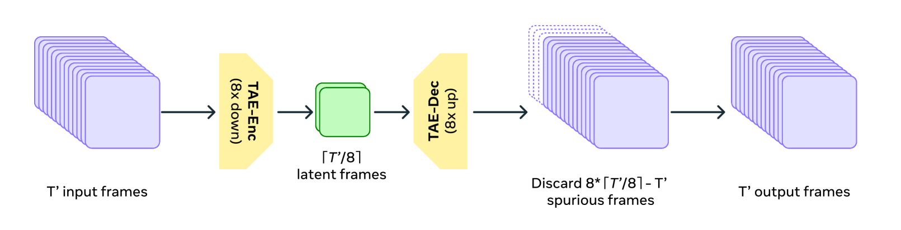
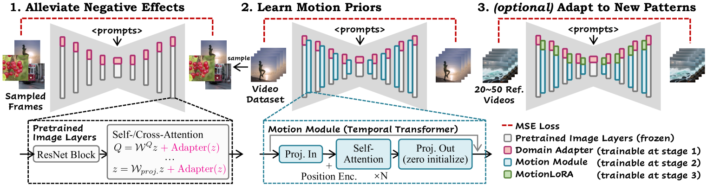
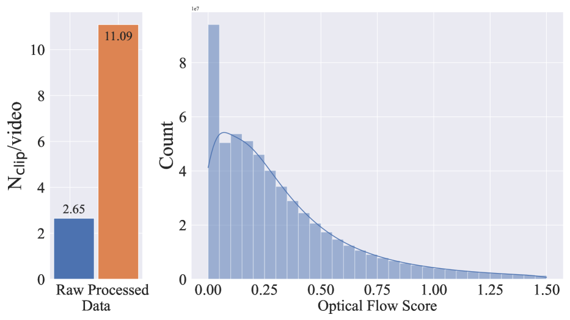
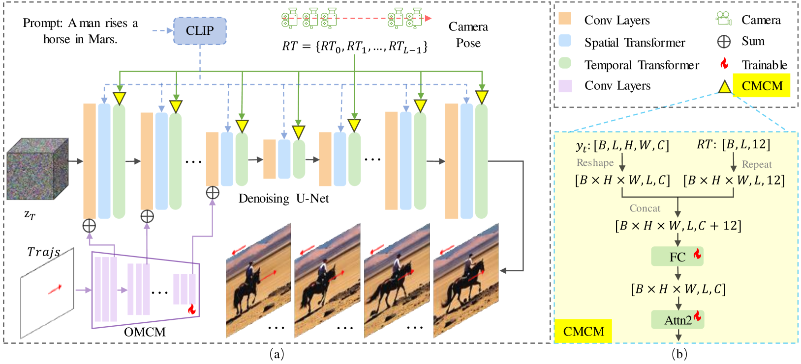

# Text2Video / Image2Video 技术深度调研（第六版：技术机制扩充）

- **Date:** 2026-07-28
- **Tags:** #survey #video-generation #text2video #image2video #diffusion #dit #flow-matching #vae

## 关于本版

本版在你第五版的基础上做**技术机制深挖**，保留原报告最有价值的两个特质：
1. **披露状态标注体系**（〔已披露〕/〔部分披露〕/〔未披露/推测〕）——继续严格执行；
2. **不做无横评数据支撑的排名**、不保证版本时效性。

**本版新增的是"技术详解"**：对**有论文可查证**的模型，补齐从 VAE 压缩 → 骨干架构 → 训练目标 → 条件注入 → 数据工程的完整机制链；对无可核验来源的商用模型，**继续只标注"未披露"、不做架构推测**。

> ⚠️ **两条纪律不变**：(a) 未公开架构的商用模型（Sora 2 / Veo / Kling / Runway / Seedance / Hailuo / Pika / Luma / PixVerse 等）**本版依旧不补架构细节**——不是没查，而是查不到可核验来源，编出来会比留白更糟；(b) 所有本版新增的技术断言均来自论文原文（我逐篇核对了 arXiv 摘要/正文），配图取自论文 HTML 版并注明出处。

---

## 1. 先建立一个统一的技术坐标系

第五版的一个结构性短板是：技术路线（§2）与模型清单（§3）是两张割裂的表，读者无法回答"某个模型在每一层分别做了什么选择"。本版先给一个**五层分解框架**，后文所有模型都按这个框架对齐。

任何一个现代视频生成系统，可以拆成五个可独立选择的层：

| 层 | 要决定的问题 | 常见选项 |
|---|---|---|
| **L1 压缩（Latent）** | 在什么空间做生成？ | 逐帧 2D VAE / **3D (Causal) VAE**（时空同时压缩）/ 离散 token（VQ） |
| **L2 骨干（Backbone）** | 用什么网络去噪或预测？ | U-Net（+时间层）/ **Transformer（DiT 类）** / 自回归 Transformer |
| **L3 训练目标（Objective）** | 学什么？ | **Diffusion loss**（DDPM/EDM 等）/ **Flow Matching** / 下一 token 预测（CE loss） |
| **L4 条件注入（Conditioning）** | 怎么听指令？ | 文本 cross-attn / **参考图 latent 拼接 + CLIP 语义** / 姿态骨骼 / 相机位姿 / 物体轨迹 |
| **L5 分辨率与时长策略** | 怎么把视频做长做清晰？ | 单阶段直出 / **级联超分+插帧** / 渐进式训练 + 多分辨率打包 |

**为什么必须分层看**：第五版正确指出"CogVideoX 是 DiT、Movie Gen 不是"，但没说清二者差在哪一层——答案是**只差 L3（训练目标）**：两者 L2 都是 Transformer，CogVideoX 用 diffusion loss，Movie Gen 用 Flow Matching。分层框架能让这类区分变得精确而非口号。

---

## 2. 技术路线详解（有论文可查证的部分）

### 2.1 Latent 扩散：为什么必须先压缩

原始视频的维度是 $T \times H \times W \times 3$，直接在像素空间做扩散在算力上不可行。**Latent Diffusion**（Rombach et al., *High-Resolution Image Synthesis with Latent Diffusion Models*, arXiv:2112.10752）的核心贡献是把生成搬到 VAE 的低维 latent 空间——这是后续几乎所有视频扩散模型的共同地基。

视频场景下的关键升级是**从 2D VAE 到 3D VAE**：

- **逐帧 2D VAE** 的问题：每帧独立压缩，时间维完全没被压缩，且帧间 latent 不连续 → 闪烁。
- **3D Causal VAE**（CogVideoX，arXiv:2408.06072）：**同时沿空间与时间维压缩**。论文原文的表述是"propose a 3D Variational Autoencoder (VAE) to compress videos along both spatial and temporal dimensions, to improve both compression rate and video fidelity"。
  - "**Causal**"的含义：时间维卷积是**因果**的（只看过去帧不看未来帧），这样才能支持**变长/流式**处理，且拼接长视频时边界一致。

Movie Gen 的 **TAE（Temporal AutoEncoder）** 给了这层一个很直观的图示——**时间维 8× 压缩**：

这张图说明了时间压缩的两个工程现实：(a) 压缩比直接决定 token 数（8× 时间压缩意味着 Transformer 要处理的序列短了 8 倍，这是能做到 73K token / 16 秒的前提）；(b) 非整除时会产生**冗余帧需在解码端丢弃**——细节虽小，却是长视频拼接时边界不一致的常见来源。

> 〔已披露〕仅 CogVideoX 明确说明 3D Causal VAE；Movie Gen 明确说明 TAE（时间自编码器）。**其他商用模型是否用同类结构，官方未公开——本版维持第五版判断，不做推测性归类。**

### 2.2 从 U-Net 到 DiT：骨干的演化，以及"时空注意力"的三种排布

**(a) U-Net + 时间层（Video LDM 路线）**

代表工作：*Align your Latents: High-Resolution Video Synthesis with Latent Diffusion Models*（Blattmann et al., arXiv:2304.08818）。做法是拿预训练好的图像 U-Net，**冻结空间层、插入并只训时间层**，把 T2I 模型"扩"成视频模型。这条路线的优势是能复用图像模型的巨量先验；代价是时空建模能力受 U-Net 的局部性限制。

**(b) DiT（Diffusion Transformer）**

*Scalable Diffusion Models with Transformers*（Peebles & Xie, arXiv:2212.09748）证明了把 U-Net 换成 Transformer 后，**生成质量随计算量（Gflops）平滑提升**——这是视频模型转向 Transformer 骨干的理论依据。

**(c) 时空注意力的三种排布**（理解视频骨干的关键）

| 排布 | 做法 | 代价/收益 |
|---|---|---|
| **分离式（spatial + temporal 分开）** | 先在帧内做空间注意力，再跨帧做时间注意力 | 便宜（$O(HW)^2 + O(T)^2$），但时空耦合弱 |
| **3D 全注意力（full 3D attention）** | 把所有时空 token 拉平做一次全注意力 | 最强的时空一致性，代价 $O((THW)^2)$ |
| **混合/因子化** | 部分层分离、部分层全注意力 | 折中 |

CogVideoX 属于走向 3D 全注意力一侧（配合 3D VAE 大幅压缩 token 数使其可行）；Animate Anyone 等 U-Net 系则是典型的**分离式**（下图可见 spatial-attention / cross-attention / temporal-attention 三种块串联）。

### 2.3 训练目标：Diffusion loss vs Flow Matching（第五版这条区分是对的，这里补机制）

这是第五版最准确的一个判断，值得把机制讲透。

**Diffusion（以 DDPM 为例）**：定义一个逐步加噪的前向过程，训练网络预测被加的噪声 $\epsilon$：

$$\mathcal{L}_{\text{diff}} = \mathbb{E}_{x_0,\epsilon,t}\left[\lVert \epsilon - \epsilon_\theta(x_t, t, c)\rVert^2\right]$$

**Flow Matching**：不定义加噪马尔可夫链，而是直接学一个**从噪声分布到数据分布的连续速度场** $v_\theta$。最简形式（rectified flow）取直线路径 $x_t = (1-t)x_0 + t\,\epsilon$，训练目标是回归其速度：

$$\mathcal{L}_{\text{FM}} = \mathbb{E}_{x_0,\epsilon,t}\left[\lVert v_\theta(x_t,t,c) - (\epsilon - x_0)\rVert^2\right]$$

**Movie Gen**（arXiv:2410.13720）明确采用 Flow Matching + Transformer 骨干（LLaMA3 设计空间），**论文未将自己定义为 diffusion transformer**——第五版这个提醒是准确的，实践中常被误传。

实践含义：Flow Matching 的路径更"直"，通常**更少采样步数**即可得到好结果，且训练更稳定；这是近两年视频/图像大模型（含 SD3 系）转向它的主要动机。

### 2.4 参考图条件注入：I2V 的机制细节

第五版正确区分了"参考图条件"与"首帧条件"，本版补**注入通道**。以 **DynamiCrafter**（arXiv:2310.12190）为例，它用的是**双路注入**：

1. **语义路**：图像经 CLIP 图像编码器 → 通过 **query transformer** 投影成一组 context token → 由 cross-attention 注入去噪网络（提供"这是什么"）；
2. **像素路**：把图像的 VAE latent **与噪声在通道维拼接（concat）** 一起进网络（提供"长什么样、在哪个位置"）。

> 为什么需要两路：只给 CLIP 语义会丢失精确外观与构图（生成的第一帧对不上原图）；只给 latent 拼接则缺乏高层语义引导。第五版已正确指出它**不是光流引导**——这点常被误传，本版保留该纠正。

**Stable Video Diffusion**（arXiv:2311.15127）的 `img2vid` / `img2vid-xt` checkpoint 属同类（参考图条件 + 时序层）。SVD 论文本身最大的贡献其实**不在架构而在数据与训练分期**（见 §2.6）。

### 2.5 T2I 底座 + 运动模块：AnimateDiff 的机制（以及为什么它不是原生 I2V）

**AnimateDiff**（arXiv:2307.04725）的做法是：**冻结**预训练 T2I（如 SD）的所有图像层，只在其中**插入一个 motion module（时间 Transformer）并单独训练**。训练完成后，这个 motion module 可以即插即用地挂到同底座的各种个性化 T2I 权重（LoRA/DreamBooth）上。

图里有三个值得注意的工程细节：
- **Proj-Out 零初始化**：保证插入模块的初始状态是恒等映射，不破坏原 T2I 能力（与 ControlNet 的零卷积同思路）；
- **Domain Adapter**：视频帧的画质分布（压缩、模糊、水印）与高质图像不同，用 adapter 吸收这种域差，避免把"劣质感"学进 motion module；
- **MotionLoRA**：只用 20–50 段参考视频就能适配特定运镜。

**为什么不是原生 I2V**：整条链路的运行时条件是**文本 prompt**，没有"输入图像"这个入口。第五版把它移出 I2V 表、归入"基于 T2I 底座的动画方法"是**正确的分类**，本版沿用。

### 2.6 数据工程：被严重低估的一层

SVD 论文（arXiv:2311.15127）的核心贡献是把"视频数据怎么洗"系统化。论文识别出**三个训练阶段**：**text-to-image 预训练 → 视频预训练 → 高质量视频微调**，并证明**每一阶段的数据策划都显著影响最终质量**。

关键数据清洗手法（论文附录有大量实证）：
- **切镜检测（cut detection）**：原始视频里未检出的转场会让模型学到"瞬间跳变"。论文报告经过处理后**每视频的片段数从 2.65 上升到 11.09**——说明原始切分严重漏检。
- **光流过滤**：用光流分数剔除**几乎静止**（分数≈0，图中最左侧那根异常高的柱子）与剧烈抖动的片段。
- **合成字幕 + OCR 过滤**（去水印/字幕污染）、美学评分过滤。

> **这一节是我认为第五版最值得补的部分**：公开模型之间的质量差距，很多时候不来自架构差异，而来自数据管线。而数据管线恰恰是商用模型**最不会披露**的部分——这也解释了为什么"架构未披露"的模型没法靠猜架构来理解。

### 2.7 可控性：姿态 / 相机 / 轨迹的注入机制

**(a) 姿态驱动的人物动画 —— Animate Anyone**（arXiv:2311.17117）

第五版只说"参考图 + 姿态条件"，机制其实很有代表性：它用**双 U-Net**结构。

三个设计要点：
- **ReferenceNet 与去噪 UNet 同构**：所以能逐层、逐分辨率地对齐外观特征，比只用 CLIP 向量保真得多（这是"人物一致性"的关键）；
- **空间注意力里做特征拼接**（图右：$h\times w$ 与 ReferenceNet 的 $h\times w$ 拼成 $h \times 2w$ 再做注意力）——让每个位置都能"查"参考图的对应区域；
- **Pose Guider 轻量**：姿态是强空间先验，不需要大网络。

**MagicAnimate**（arXiv:2311.16498，NUS Show Lab + ByteDance）是同期独立工作，同属"参考图 + 姿态"路线。第五版已正确标注二者是**独立项目**，本版沿用。

**(b) 相机与物体轨迹 —— MotionCtrl**（arXiv:2312.03641）

机制上的关键洞察：**相机运动是全局的、物体运动是局部的**，所以两者注入方式不同——相机位姿（每帧 12 维：3×3 旋转 + 3 平移）注入**时间注意力层**（影响全帧），物体轨迹以**空间对齐的特征图**加到卷积特征上（影响局部）。这个"全局 vs 局部分开注入"的思路，是可控性研究里可迁移的设计原则。

> 第五版指出 MotionCtrl **主要处于研究阶段、未见主流商用产品公开采用同名机制** —— 本版维持该判断。商用产品的"运镜控制"功能是否用同类机制，官方未披露。

### 2.8 级联 vs 单阶段：把视频做长做清晰的两条路

第五版已正确纠正了两个常见误传（Imagen Video 不是"先生成关键帧"、Make-A-Video 的组件构成），本版补一层对比：

| 策略 | 代表 | 做法 | 代价 |
|---|---|---|---|
| **级联超分/插帧** | **Imagen Video**（arXiv:2210.02303）：基础模型出低分辨率低帧率 → 串联多个空间/时间超分模型逐步提升；**Make-A-Video**（arXiv:2209.14792）：decoder + 帧插值模型 + 两个超分模型 | 每级模型独立训练、可分别优化 | 管线长、误差逐级累积、显存与延迟高 |
| **单阶段 + 渐进训练** | **CogVideoX**：**progressive training + 多分辨率 frame pack** | 端到端一致性更好 | 训练策略更复杂，需精心设计课程 |
| **联合分期训练** | **Movie Gen**：T2I(256px) → T2I+T2V 联合预训练(256→768px, 至 16s/16fps) → 各任务微调 | 复用图像先验，逐步升分辨率 | 需要大规模多阶段调度 |

**Movie Gen 的可核验规格**（论文摘要原文）：最大视频模型为 **30B 参数 Transformer，最大上下文 73K video tokens，对应 16 秒 @ 16fps 的生成**；音频由**独立的 Movie Gen Audio（13B）**生成——第五版关于"视频模型 + 独立音频模型，而非单一模型联合生成"的判断，与论文一致。

### 2.9 自回归 / Token 化路线（补充说明）

第五版提到 VideoPoet 作为代表。机制上的要点是 **L1 用离散化（VQ）而非连续 VAE**：视频被量化成离散 token，然后用 **自回归 Transformer + 交叉熵损失**（而非 diffusion/flow loss）预测下一 token。

- **优势**：与 LLM 完全同构，天然统一多模态（文本/图像/视频/音频同一词表），可复用 LLM 全套基础设施；
- **劣势**：逐 token 解码 → 长视频推理慢；离散化有量化损失上限；误差沿序列累积。
- 相关基础工作：**Phenaki**（arXiv:2210.02399 系列工作，可变长视频 + token 化）、**MAGVIT**（arXiv:2212.05199 系）。这条线近期与"扩散 + 自回归混合"方向交汇，值得单独追踪。

> 说明：VideoPoet 的官方论文/技术报告细节请以 Google 官方发布为准；本版不对其内部规格做推测。

---

## 3. 按五层框架对齐的模型表（仅列有可核验来源者）

**这是本版对第五版最大的结构性改进**：把"技术路线"与"模型清单"合并成一张可对照的表。**只收录有论文/官方技术报告的模型**——无可核验来源者见 §4 单列。

| 模型 | L1 压缩 | L2 骨干 | L3 目标 | L4 条件 | L5 分辨率/时长策略 | 来源 |
|---|---|---|---|---|---|---|
| **CogVideoX** | **3D Causal VAE**（时空同压） | **Expert Transformer**（DiT 类；expert adaptive LayerNorm 做文-视深度融合） | Diffusion | 文本（深度融合而非仅 cross-attn） | 渐进训练 + 多分辨率 frame pack；**10s / 16fps / 768×1360** | arXiv:2408.06072〔已披露〕 |
| **Movie Gen Video** | latent（论文详述） | **Transformer（LLaMA3 设计空间）** | **Flow Matching**（论文明确非 diffusion loss） | 文本；另支持图像个性化、指令编辑 | T2I 256px → T2I+T2V 联合 256→768px；**30B / 73K tokens / 16s@16fps** | arXiv:2410.13720〔已披露〕 |
| **Stable Video Diffusion** | 图像 LDM latent | U-Net + **插入时序层** | Diffusion | **参考图（img2vid/img2vid-xt）** | 三阶段：T2I 预训练→视频预训练→高质微调；**数据策划为核心贡献** | arXiv:2311.15127〔已披露〕 |
| **Video LDM / Align your Latents** | 图像 LDM latent | U-Net，**冻结空间层只训时间层** | Diffusion | 文本 | 时间超分/插帧 | arXiv:2304.08818〔已披露〕 |
| **DynamiCrafter** | latent | 预训练 T2V diffusion prior | Diffusion | **双路参考图**：CLIP→query transformer→cross-attn ＋ latent 通道拼接 | — | arXiv:2310.12190〔已披露〕 |
| **AnimateDiff** | T2I latent | **冻结 T2I + 插入 motion module** | Diffusion | **仅文本**（故非原生 I2V） | MotionLoRA 适配运镜 | arXiv:2307.04725〔已披露〕 |
| **Animate Anyone** | latent | **双 U-Net**（ReferenceNet + 去噪 UNet） | Diffusion | **参考图 + 姿态序列**（spatial 拼接 + Pose Guider） | — | arXiv:2311.17117〔已披露〕 |
| **MagicAnimate** | latent | U-Net | Diffusion | 参考图 + 姿态 | — | arXiv:2311.16498〔已披露〕 |
| **MotionCtrl** | latent | U-Net（时空分离） | Diffusion | **相机位姿（CMCM，注入时间注意力）+ 物体轨迹（OMCM，加到卷积特征）** | — | arXiv:2312.03641〔已披露〕 |
| **Imagen Video** | 像素域级联 | U-Net ×N | Diffusion | 文本 | **基础模型 + 多个空间/时间超分级联**（非"先生成关键帧"） | arXiv:2210.02303〔已披露〕 |
| **Make-A-Video** | — | U-Net | Diffusion | 文本（利用 T2I 先验，无需配对文本-视频数据） | decoder + **帧插值模型** + **两个超分模型** | arXiv:2209.14792〔已披露〕 |
| **Wan / 万相** | 官方仓库+技术报告 | 官方披露 | 官方披露 | T2V 与 **I2V（参考图/首帧）** 双分支 | 以 Wan2.2 仓库为准 | 官方 GitHub / 技术报告〔已披露〕；**权重 Apache-2.0** |
| **Sora（2024 报告）** | 未完全公开的 visual encoder 压缩至 latent | Transformer 去噪 | Diffusion | 文本 | **latent 切分为 spacetime patches**（patch 化作用于已压缩 latent，非压缩本身） | 2024 技术报告〔部分披露〕**仅适用于该版本** |

**表内几处必须保留的精确性**（延续第五版的严谨）：
- **Sora**：patch 化是对"已压缩 latent"的切分，**不是压缩过程本身**；且该描述**只适用于 2024 版报告**，不外推至 Sora 2。
- **CogVideoX vs Movie Gen**：L2 都是 Transformer，**只差 L3**（diffusion loss vs flow matching）——不应统称"DiT"。
- **AnimateDiff**：L4 只有文本，故**不列入 I2V**。

---

## 4. 无可核验架构来源的商用模型（本版维持"不推测"）

以下模型**官方未发布可核验的架构技术报告**。本版**不补架构细节**，只提示核验路径。

| 模型/产品 | 机构 | 架构状态 | 建议核验方式 |
|---|---|---|---|
| Sora 2 | OpenAI | 〔未披露/推测〕不外推自 2024 版 | 官方 system card / 产品页 |
| Veo 系列 | Google DeepMind | 〔未披露/推测〕 | 官方产品页 / model card |
| Runway Gen-3/4/4.5 | Runway | 〔未披露/推测〕 | 官方发布页 |
| 可灵 Kling | 快手 | 〔未披露/推测〕"DiT+3D VAE"为**行业推测**，非官方 | 官方页 |
| Seedance / 即梦 | 字节跳动 | 〔未披露/推测〕 | 官方页 |
| Seaweed | 字节跳动 | 与 Seedance/即梦 对应关系**未能独立核实** | — |
| 海螺 Hailuo | MiniMax | 〔未披露/推测〕 | 官方页 |
| Pika 1.5/2.0 | Pika Labs | 〔未披露/推测〕 | 官方页 |
| Luma Ray 系列 | Luma AI | 〔未披露/推测〕 | 官方产品页 |
| Vidu | 生数科技 | 〔部分披露，需核实〕 | 官方页 |
| PixVerse | 主体机构【待确认】 | 〔未披露/推测〕 | 官方页 |

> **为什么坚持留白**：本版新增的所有机制细节都能追到论文原文。对这批模型，把公开研究里的机制（如"3D VAE + DiT"）套上去写成它们的架构，会把**推测伪装成事实**——这比留白危害更大。第五版这个纪律是对的。

---

## 5. 技术趋势（在第五版基础上补机制层判断）

1. **L3 正在从 diffusion 向 flow matching 迁移**。Movie Gen 已明确采用；图像侧（SD3 系）同向。动机是采样步数更少、训练更稳。**这是比"都用 Transformer"更有区分度的观察点**。
2. **L1 的 3D VAE 化是长视频一致性的前提**。时间维不压缩 → token 数爆炸 + 帧间 latent 不连续（闪烁）。CogVideoX 的 3D Causal VAE 是公开可查的范本。
3. **可控性的机制共识：全局条件与局部条件分开注入**。MotionCtrl 的 CMCM（相机→时间注意力）vs OMCM（轨迹→空间特征）是清晰范例；Animate Anyone 的 ReferenceNet（外观→逐层空间拼接）vs Pose Guider（姿态→轻量注入）同理。
4. **数据管线可能比架构更决定质量**（SVD 的实证：切镜检测使片段数 2.65→11.09、光流过滤剔除静止片段）。这也解释了架构公开但质量仍有差距的现象。
5. **"世界模型"仍是产品定位表述**。第五版判断准确——Sora/Veo 宣传材料里的"隐式学习世界模型"**无公开基准验证**，本版继续只作趋势提及。
6. **许可证必须逐模型核实**：Wan2.2 仓库/权重 **Apache-2.0**；CogVideoX-5B 为**自定义 CogVideoX License**（商用需登记、有月访问量上限）；SVD 为 **Stability AI Community License**（商用另查条款）。三者开放程度不同。

---

## 6. 局限性（延续并强化第五版）

- 本报告是**非穷尽**的技术概览，**不做"最领先/第一梯队"排名**（无第三方横评数据支撑）。
- **不保证版本时效性**：商用产品迭代远快于本报告节奏，任何版本相关决策请在使用当天打开官方页面确认。
- 〔未披露/推测〕标注**仅表示找不到可核验来源**，不代表该模型技术路线一定如此或一定不同。
- 本版新增的机制细节均来自论文；**商用模型的架构一律未补**（见 §4 说明）。
- Seaweed 与 Seedance/即梦 的对应关系、以及各产品的原生时长/分辨率/价格仍**待逐一核验**。

## 7. 若要用于正式选型（建议的下一步）

1. **按五层框架填表**：对每个候选模型，逐层确认 L1–L5 的可核验来源；填不出来的格子就是风险点。
2. **License 逐一开原文**：Apache-2.0 / 自定义 License / Community License 的商用约束差别很大（见 §5.6）。
3. **实测横评单独立项**：画质/一致性/可控性的优劣，必须自测，不依赖厂商宣传材料。
4. **区分原生能力与社区工作流**：如"AnimateDiff + 图像条件插件"实现的类 I2V，**不等同于原生 I2V**（第五版这个提醒很重要，选型时须写明）。

## References

> 以下为本版所有技术断言的来源（均为 arXiv，可验证）。核心事实我逐篇核对了摘要/正文原文。

**基础与骨干**
- Latent Diffusion (LDM) — arXiv:2112.10752
- DiT: Scalable Diffusion Models with Transformers — arXiv:2212.09748
- Align your Latents (Video LDM) — arXiv:2304.08818

**T2V 代表**
- CogVideoX: Text-to-Video Diffusion Models with An **Expert Transformer** — arXiv:2408.06072
- Movie Gen: A Cast of Media Foundation Models — arXiv:2410.13720
- Imagen Video — arXiv:2210.02303
- Make-A-Video — arXiv:2209.14792
- Sora 2024 技术报告（OpenAI 官方，非 arXiv）

**I2V / 参考图条件**
- Stable Video Diffusion — arXiv:2311.15127
- DynamiCrafter — arXiv:2310.12190

**T2I 底座动画 / 可控性**
- AnimateDiff — arXiv:2307.04725
- Animate Anyone — arXiv:2311.17117
- MagicAnimate — arXiv:2311.16498
- MotionCtrl — arXiv:2312.03641

**开放权重**
- Wan / 万相 — 官方 GitHub 仓库与技术报告（Apache-2.0）

> 配图说明：6 张配图均取自对应论文的 arXiv HTML 版（已在图注标明出处）。Sora/Veo/Kling 等无公开架构的模型**无配图**——因为没有可引用的官方架构图。
