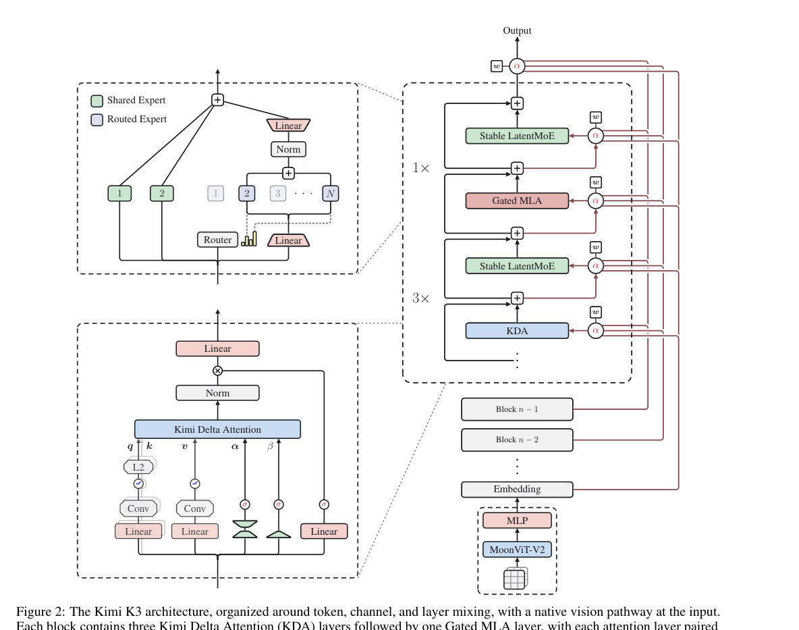

# HF Daily Papers 周报 · 2026-07-28 ~ 07-29

- **Date:** 2026-07-29
- **Tags:** HF-Daily-Papers, Kimi-K3, MoE, 线性注意力, Agent, 具身智能, 奖励建模, digest
- **覆盖范围:** 2026-07-28 ~ 07-29 + 07-27 桶的迟到补录(承接 [[2026-07-27-hf-daily-papers-jul25-27]])

## Context

- **数据获取:** HF `daily_papers` API 逐日抓取——07-28: **31 篇**、07-29: **15 篇**;另 07-27 桶再次增长(14→17),3 篇迟到条目一并纳入。
- **去重:** 对照上一份 digest 的 14 个 arXiv ID 剔除,**共 49 篇新增**,按 upvotes 降序取 **Top 25**。
- **主线信号:** **Kimi K3 技术报告以 301▲ 断层第一**——这是我在 [[2026-07-17-inkling-glm52-kimik3]] 与 [[2026-07-21-raschka-llm-architecture-comparison]] 里反复标注"未披露/待技术报告"的那份文档,**今天终于拿到了**。次线是 **agent harness 与长时域执行**(JarvisHub / StateAct / 多教师 on-policy 蒸馏)和**具身奖励建模**(Progress Reward 综述 / HiFi-UMI / Data Pyramid)。

> [!IMPORTANT]
> 本期最大价值:**Kimi K3 技术报告补全了此前所有"未披露"字段**——93 层、104.2B 激活参数、160K 词表、69 KDA + 24 MLA、MoonViT-V2 视觉塔。下方 Deep Dive 1 有完整 K2→K3 架构对比表。

## 论文总览表(Top 25 by upvotes)

| # | 论文 | ▲ | 日期 | 主题 |
|---|---|---|---|---|
| 1 | [**Kimi K3: Open Frontier Intelligence**](https://hf.co/papers/2607.24653) | **301** | 07-28 | 前沿模型 ⭐⭐ |
| 2 | [JarvisHub: 画布原生多模态创意 Agent 的开放 harness](https://hf.co/papers/2607.23588) | 113 | 07-28 | Agent harness |
| 3 | [**机器人学习的进度奖励建模:综述**](https://hf.co/papers/2607.21655) | 112 | 07-28 | 具身/奖励建模 ⭐ |
| 4 | [从闭源到开源:用多 Agent 协议蒸馏弥合分布差距](https://hf.co/papers/2607.24280) | 73 | 07-28 | Agentic 搜索/蒸馏 |
| 5 | [HiFi-UMI: 仅用高保真 UMI 数据学习可部署操作策略](https://hf.co/papers/2607.25895) | 70 | 07-29 | 具身操作 |
| 6 | [重新思考 on-policy 扩散蒸馏中的 CFG](https://hf.co/papers/2607.24731) | 68 | 07-28 | 扩散/蒸馏 |
| 7 | [相关性的新角色:引导 agentic 搜索中的语料交互](https://hf.co/papers/2607.24223) | 68 | 07-29 | Agentic 搜索 |
| 8 | [StateAct: 长时域计算机使用 Agent 应先看程序状态而非像素](https://hf.co/papers/2607.22798) | 55 | 07-28 | 计算机使用 Agent |
| 9 | [ReDesign: 用 agentic 分解从图像恢复可编辑设计结构](https://hf.co/papers/2607.25565) | 35 | 07-29 | 多模态/设计 |
| 10 | [Data Pyramid for Embodied Manipulation](https://hf.co/papers/2607.24744) | 32 | 07-28 | 具身数据 |
| 11 | [Sol-Attn: 即时注意力稀疏化加速视频生成推理](https://hf.co/papers/2607.24027) | 29 | 07-28 | 视频/稀疏注意力 |
| 12 | [OmniVAE: 跨模态对齐的音视频 VAE](https://hf.co/papers/2607.23855) | 23 | 07-28 | 多模态生成 |
| 13 | [多轮长时域规划的"物理学":从预训练到后训练的单/多教师 on-policy 蒸馏](https://hf.co/papers/2607.24720) | 22 | 07-28 | 长时域规划 |
| 14 | [Oxygen-TryOn: 时尚原生的任意单品虚拟试穿基座](https://hf.co/papers/2607.21694) | 22 | 07-28 | 多模态应用 |
| 15 | [Keep It InMind: Agent 记忆的隐式关联盲区基准](https://hf.co/papers/2607.24368) | 20 | 07-29 | Agent 记忆 |
| 16 | [Interactive Training 2: 实时模型训练的可审计控制平面](https://hf.co/papers/2607.18314) | 18 | 07-27 | 训练系统 |
| 17 | [Mage-VL: 高效 codec 原生流式多模态基座](https://hf.co/papers/2607.24904) | 14 | 07-29 | 多模态 |
| 18 | [O-VAD: 面向工业的物体中心视频异常检测](https://hf.co/papers/2607.18142) | 9 | 07-27 | 视觉/工业 |
| 19 | [dRAE: 超球面码的表征自编码器](https://hf.co/papers/2607.22148) | 9 | 07-28 | 表征学习 |
| 20 | [用外部知识做历史文档修复(RAG)](https://hf.co/papers/2607.21936) | 9 | 07-28 | RAG/应用 |
| 21 | [ClinFusion: 视觉中心的多模态医疗 LLM 系统](https://hf.co/papers/2607.24743) | 7 | 07-28 | 医疗多模态 |
| 22 | [Chamaileon: 跨上下文 binder 设计](https://hf.co/papers/2607.23518) | 7 | 07-28 | AI4Science |
| 23 | [Wonder: Video World Model Done Better](https://hf.co/papers/2607.26037) | 7 | 07-29 | 世界模型 |
| 24 | [ID-V2V: 保身份的视频重风格化](https://hf.co/papers/2607.22830) | 6 | 07-27 | 视频生成 |
| 25 | [Reasoning Denoiser: 为幻觉检测去噪推理轨迹](https://hf.co/papers/2607.22098) | 6 | 07-28 | 推理/幻觉 |

## 分主题详解

### 🏔️ 前沿模型:Kimi K3 技术报告(本期绝对主角)

**Kimi K3**(301▲)——权重 07-27 释出、技术报告 07-28 上 HF,断层第一。见 Deep Dive 1。

### 🤖 Agent harness 与长时域执行(4 篇,延续本月最强主线)

- **JarvisHub**(113▲):**画布原生(canvas-native)** 多模态创意 Agent 的开放 harness——把"创意工作"当 agent 环境来标准化,呼应本周 tech-blogs 里 GitHub 那篇「The harness is all you need (mostly)」。
- **StateAct**(55▲):主张长时域计算机使用 Agent 应**先看程序状态、再看像素**——与 GUI agent 纯视觉路线对立,思路和 SeerGuard(用世界模型预测动作后果)互补。
- **多轮长时域规划的"物理学"**(22▲):从预训练到后训练,用**单教师/多教师 on-policy agentic 蒸馏**;与 #4 的多 Agent 协议蒸馏同属"把闭源 agent 能力蒸馏进开源模型"这条线。
- **Keep It InMind**(20▲):Agent 记忆的**隐式关联盲区**基准——记忆不只是"存得下",还要能建立隐含关联。

### 🦾 具身智能:奖励建模成为焦点(3 篇)

- **Progress Reward Modeling 综述**(112▲):见 Deep Dive 2。**这是本周 agentic RL 信用分配主线在机器人侧的镜像。**
- **HiFi-UMI**(70▲):仅靠高保真 UMI(通用操作接口)数据就能学出**可部署**策略——降低真机数据门槛。
- **Data Pyramid for Embodied Manipulation**(32▲):具身操作的数据金字塔结构。

### 🔍 Agentic 搜索与蒸馏(2 篇)

- **From Proprietary to Open-Source**(73▲):用**多 Agent 协议蒸馏**弥合开源与闭源在 agentic 搜索上的分布差距——非常务实的追赶路线。
- **A New Role for Relevance**(68▲):重新定义"相关性"在 agentic 搜索中的作用——从排序信号变为**引导语料交互**的信号。

### 🎬 生成与效率

- **Rethinking CFG in On-Policy Diffusion Distillation**(68▲):重审 classifier-free guidance 在 on-policy 蒸馏里的角色。
- **Sol-Attn**(29▲):**即时(on-the-fly)注意力稀疏化**加速视频生成——延续稀疏注意力主线(与 GLM 的 DSA/IndexShare 同族)。
- **OmniVAE**(23▲)音视频联合 VAE、**Mage-VL**(14▲)codec 原生流式多模态、**dRAE**(9▲)超球面码表征自编码器。
- **Wonder**(7▲):视频世界模型,承接上周 ABot-World-0 的世界模型主线。

### 🏥 应用与 AI4Science

**ClinFusion**(医疗)、**Chamaileon**(蛋白 binder 设计)、**Oxygen-TryOn**(虚拟试穿)、**历史文档修复 RAG**、**O-VAD**(工业视频异常检测)、**Interactive Training 2**(可审计训练控制平面)、**Reasoning Denoiser**(推理轨迹去噪做幻觉检测)。

## Deep Dive 1:Kimi K3 技术报告 —— 终于拿到全部架构数字

**背景:** 我在此前三篇笔记里都标注过 Kimi K3 的"未披露清单"(层数/tokenizer/激活参数)。权重 07-27 释出,**技术报告 07-28 公开**(47 页),这些空缺全部补齐。

### K2 → K3 架构对比(技术报告 Table 1,全部为一手数字)

| 维度 | Kimi K2 | **Kimi K3** | Δ |
|---|---|---|---|
| 层数 | 61 | **93** | ↑52% |
| 总参数 | 1.04T | **2.78T** | ↑167% |
| **激活参数** | 32.6B | **104.2B** | ↑220% |
| Hidden 维度 | 7,168 | 7,168 | = |
| Latent MoE 维度 | — | 3584(0.5×) | 新增 |
| 每专家 MoE hidden | 2,048 | 3,072 | ↑50% |
| 路由专家数 | 384 | **896** | ↑133% |
| 每 token 激活专家 | 8 | **16** | ↑100% |
| 共享专家 | 1 | 2 | ↑100% |
| 注意力头 | 64 | 96 | ↑50% |
| **词表** | 160K | 160K | = |
| **训练上下文** | 128K | **1M** | **8×** |
| 注意力机制 | MLA | **Hybrid KDA–MLA** | — |
| 激活函数 | SwiGLU | **SiTU-GLU** | — |
| **注意力层构成** | 61 MLA | **69 KDA + 24 MLA** | — |
| MTP 层 | 1 | 1 | = |
| ViT(MoonViT-V2) | — | **401M / 27 层 / patch 14 / 12 heads** | 新增 |

### 架构三个维度的设计逻辑

技术报告把 K3 讲成"沿三个互补维度扩展信息流":

1. **序列维度 — Hybrid Attention**:每 block **3 层 KDA + 1 层 Gated MLA**(即 69:24)。KDA 做高效长序列混合,周期性插入的 Gated MLA 保留全局交互。
2. **深度维度 — Attention Residuals(AttnRes)**:用**学习到的伪查询 $w$** 对 embedding 与所有前序 block 输出计算注意力权重 $\alpha$,让每层能**选择性检索任意先前层的表征**——突破了传统顺序残差累积。
3. **宽度维度 — Stable LatentMoE**:896 路由专家、每 token 激活 16,配合 normalization、**SiTU-GLU** 与 **Quantile Balancing** 在极端稀疏下稳住优化。
- 另有 **Per-Head Muon** 优化器、**MoonViT-V2** 原生视觉塔(图像/视频→轻量 projector→共享 embedding 空间)。

### 训练与效率

- **scaling 效率比 K2 提升约 2.5×**(Fig 7 拟合曲线);为此重调了 batch size、学习率、**TPP(tokens-per-parameter)** 与模型形状。
- **一个方法论细节值得记**:scaling-law 研究**一致偏好 cosine decay 而非 WSD**。作者指出以往"WSD 匹敌或超过 cosine"的结论可能不公平——两者的**最优峰值学习率与 batch size 差异很大**,用共享超参对比会偏向其中一方。他们为两种 schedule **各自独立搜索最优超参**后,cosine decay 的最终 loss 一致更低。
- **QAT 自 SFT 阶段起**:MXFP4 权重 + MXFP8 激活。
- **后训练**:跨 general / agentic / coding 三大域 + **多个 reasoning-effort 档位**做 RL,每域每档训一个 expert,追求**组合泛化**与长时域稳健执行。环境含可验证搜索、专业知识工作、软件工程与 kernel 优化、**视觉在环的工具使用**、持久助手工作流、Web 开发、自主执行。
- **基础设施**:KDA 的算法-系统协同设计、完美均衡的专家并行训练、**百万 token 级 agentic RL(持久 rollout 与 sandbox 状态)**。

### 我的看法

1. **这份报告让我此前三篇笔记的"未披露"全部落地**——尤其 **104.2B 激活参数**(此前只知 16/896 专家)与 **69 KDA + 24 MLA** 的精确配比。**KDA 从 Kimi Linear(48B)→ K3(2.8T)完成了跨两个数量级的验证**,这是线性注意力最强的规模化证据。
2. **AttnRes 是我认为最被低估的部分**:让每层用伪查询去"检索"任意前序层表征,等于把深度方向也变成一次注意力操作。这与 DeepSeek-V4 的 mHC、Motif-3 的 Modified mHC 同属"重构残差连接"这条新兴主线(见 [[2026-07-21-raschka-llm-architecture-comparison]])。
3. **cosine vs WSD 那段是极好的实验方法论示范**:两个方案的最优超参不同,共享超参对比本身就是不公平的。这个陷阱在很多"A 优于 B"的论文里都存在。
4. ⚠️ 仍需注意:**报告为第一方**,基准表未在此逐条核验;"frontier-level"的表述需第三方评测(Artificial Analysis 等)确认。

## Deep Dive 2:机器人进度奖励建模综述 —— Agentic RL 信用分配的机器人镜像

- **arXiv:** [2607.21655](https://arxiv.org/abs/2607.21655)(cs.RO + cs.CL,2026-07-22,11 位作者)
- **项目页:** [Awesome-Progress-Models](https://github.com/sterzhang/Awesome-Progress-Models)

**问题设定(和我这两周追的主线惊人一致):** 机器人在动态环境、巨大行为空间中学习,而**终止成功信号只告诉它"完成了没有"**,无法区分当前行为是**在推进、原地不动、还是在撤销此前的进展**。所以近期研究转向**执行过程中的 dense progress reward**。

> 这正是 [[2026-07-17-agentic-rl-credit-and-unified-multimodal]] 里 TRACE/TRIAGE 攻的同一个问题(轨迹级奖励太粗),**只不过战场在机器人**。TRIAGE 的"倒退(regression)"标签与这里的"undoing earlier progress"几乎是同一概念——**两个社区独立收敛到了同一诊断**。

**核心批评:** 现有文献**缺少共享框架**——各家在 observations、goal specifications、output signals、supervision sources、evaluation protocols **五个维度**上各行其是,导致难以互相比较,也说不清"它们的结果究竟验证了什么"。

**提出的统一视角(三步,由外而内再到实证):**

| 层 | 内容 | 作用 |
|---|---|---|
| ① **Interface** | 黑箱式外部刻画:模型吃什么输入、吐什么形式的进度信号 | "从外部定义问题" |
| ② **Internal methods** | 信号本身如何构造 | 暴露进度估计与奖励生成背后**不同的假设与机制** |
| ③ **Data & benchmarks** | 进度监督如何获取、特定评测**真正测的是什么** | 实证基础 |

三层合起来回答:"进度模型**是什么**、**怎么造**、**质量如何被验证**"。

**开放问题:** 作者总结现有方法的主要局限并讨论未来方向,框架本身指向两个关切——**跨异构设置的可比性**,以及**有效性**(某个评测究竟确立了什么)。

**我的看法:** 综述类工作的价值在于"把混乱变成坐标系",这篇的三层划分(接口/机制/验证)是可直接拿来用的分析工具。**更有意思的是跨领域共振**:LLM agent 侧(TRACE/TRIAGE/SAO)与机器人侧(本篇)在同一个月里,对"terminal reward 不够用"给出了几乎相同的诊断。这暗示**信用分配可能是当前所有长时域学习系统的公共瓶颈**,而非某个领域的特有问题。⚠️ 局限:摘要页未列出三层下的具体子类目与评测建议细节,需读 PDF 或项目页。

## 趋势分析

1. **Kimi K3 完成了"权重 → 报告"的完整交付,且把 KDA 推到 2.8T 验证。** 线性/delta 注意力从 Kimi Linear(48B)一路到 2.8T 主力模型,加上 Solar Open 2 等第三方采用(见 [[2026-07-27-blog-raschka-open-weight-roundup]]),**delta 类注意力已成为可复用标准组件**。

2. **信用分配是跨领域的公共瓶颈。** LLM agent 侧(TRACE/TRIAGE/SAO)与机器人侧(Progress Reward 综述)本月独立收敛到同一诊断:**terminal reward 说不清"是否在推进"**。TRIAGE 的"倒退"与本篇的"undoing earlier progress"是同一概念的两次发现。

3. **"把闭源 agent 能力蒸馏进开源"成为显式赛道。** #4 多 Agent 协议蒸馏、#13 单/多教师 on-policy agentic 蒸馏——不再是泛泛的知识蒸馏,而是**针对 agentic 行为分布差距**的专门方法。这与本周 Amodei 立场文里点名的"工业规模蒸馏"形成有趣的技术-政策对照。

4. **残差连接正在被重构。** K3 的 AttnRes(伪查询检索任意前序层)+ DeepSeek-V4 的 mHC + Motif-3 的 Modified mHC——**深度方向的信息流成为新的架构创新点**,不再只是"加一条捷径"。

5. **Agent harness 从工程话题进入论文。** JarvisHub(画布原生创意 agent)、StateAct(先状态后像素)——上周还只在 GitHub/NVIDIA 博客讨论的 harness,本周已有论文级工作。

## Open Questions

- K3 报告的"frontier-level"表述需第三方验证:Artificial Analysis 等独立评测何时补齐?与 Fable 5 / GPT 5.6 Sol 的同口径对比?
- **AttnRes 的额外开销**:让每层对所有前序 block 算注意力,推理时的显存与延迟代价多大?报告未在此展开。
- cosine vs WSD 的结论是否普适?"各自独立搜超参才公平"这个方法论要求,会不会推翻其它已发表的 schedule 对比结论?
- 进度奖励综述的三层框架能否**反向用于 LLM agent**?即把 TRACE/TRIAGE 也放进"接口/机制/验证"坐标系比较?
- StateAct 的"先程序状态后像素"与纯视觉 GUI agent 路线,哪条在真实桌面环境更稳健?

## References

- **Kimi K3: Open Frontier Intelligence** — https://hf.co/papers/2607.24653 · [arXiv:2607.24653](https://arxiv.org/abs/2607.24653)
- **Progress Reward Modeling for Robotic Learning (Survey)** — https://hf.co/papers/2607.21655 · [arXiv:2607.21655](https://arxiv.org/abs/2607.21655) · [项目页](https://github.com/sterzhang/Awesome-Progress-Models)
- JarvisHub — https://hf.co/papers/2607.23588
- From Proprietary to Open-Source (多 Agent 协议蒸馏) — https://hf.co/papers/2607.24280
- HiFi-UMI — https://hf.co/papers/2607.25895
- Rethinking CFG in On-Policy Diffusion Distillation — https://hf.co/papers/2607.24731
- A New Role for Relevance — https://hf.co/papers/2607.24223
- StateAct — https://hf.co/papers/2607.22798
- ReDesign — https://hf.co/papers/2607.25565
- Data Pyramid for Embodied Manipulation — https://hf.co/papers/2607.24744
- Sol-Attn — https://hf.co/papers/2607.24027
- OmniVAE — https://hf.co/papers/2607.23855
- The Physics of Multi-Turn Long-Horizon Planning — https://hf.co/papers/2607.24720
- Oxygen-TryOn — https://hf.co/papers/2607.21694
- Keep It InMind — https://hf.co/papers/2607.24368
- Interactive Training 2 — https://hf.co/papers/2607.18314
- Mage-VL — https://hf.co/papers/2607.24904
- O-VAD — https://hf.co/papers/2607.18142
- dRAE — https://hf.co/papers/2607.22148
- 历史文档修复 RAG — https://hf.co/papers/2607.21936
- ClinFusion — https://hf.co/papers/2607.24743
- Chamaileon — https://hf.co/papers/2607.23518
- Wonder: Video World Model Done Better — https://hf.co/papers/2607.26037
- ID-V2V — https://hf.co/papers/2607.22830
- Reasoning Denoiser — https://hf.co/papers/2607.22098

> 引用须可验证:以上均为 HF Daily Papers 真实链接;Kimi K3 架构表与训练细节引自技术报告 PDF 全文(47 页,已精读),配图从 PDF 渲染;Progress Reward 综述数据引自 arXiv 摘要页(PDF 未逐节精读,已标注局限)。K3 基准为第一方自报,待第三方复现。
