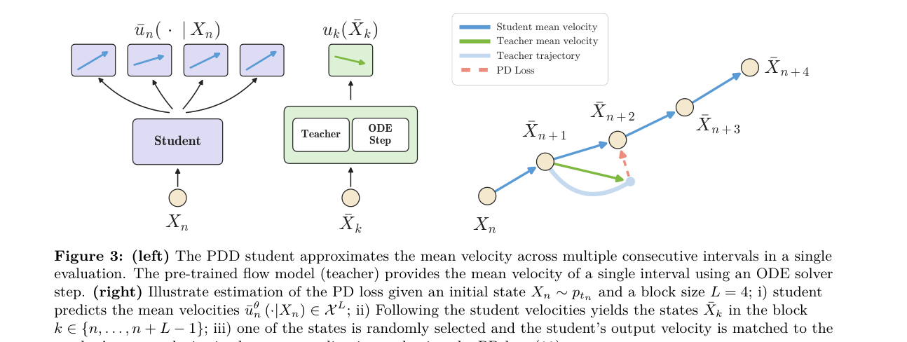

# Parallel Decoding Distillation (PDD) 精读 —— 用"回归"取代对抗式蒸馏

- **Date:** 2026-07-30
- **Tags:** 扩散模型, flow-matching, 蒸馏, 少步生成, 视频生成, 多样性, NVIDIA, paper-deep-dive
- **论文:** [Parallel Decoding Distillation for Fast Image and Video Generation](https://arxiv.org/abs/2607.26004)(arXiv:2607.26004,34 页,2026-07-29)
- **作者:** Neta Shaul¹²、Chao Liu¹、**Arash Vahdat**¹、**Julius Berner**¹(¹NVIDIA、²Weizmann Institute;后两位 equal advising)
- **项目页:** https://research.nvidia.com/labs/genair/pdd
- **抓取方式:** arXiv HTML 未发布,用 **PDF + pymupdf** 兜底(45MB PDF → 101654 字符),配图从 PDF 渲染。此法已写入 CLAUDE.md。

## TL;DR

**把扩散/flow 模型的少步加速,从"难训的对抗式蒸馏"换回"简单的回归式蒸馏"。** 一次网络前向预测**多个**去噪步,既不需要 JVP / 有限差分,也不需要 VSD 或 GAN 损失,同一套权重支持**可变 NFE**,还顺手修好了对抗式蒸馏导致的**视频多样性崩塌**。

## 一、动机:现有加速方法的两个真实痛点

视频扩散/flow 采样慢是老问题。当前 SOTA 加速主要靠 **VSD(变分分数蒸馏)+ 对抗损失**,论文直指其两处要害:

1. 这些损失**"出了名地难优化"**(notoriously hard to optimize)
2. **会 mode collapse** → 后果是**视频多样性丢失、缺少运动**(生成的视频"不动")

另一类**基于轨迹**的方法(蒸馏 mean velocity)在图像上不错,但:
- 在大规模**视频**模型上做不出高质量少步生成
- 常依赖 **JVP 或有限差分** —— 在大模型上算不起,或训练动态不稳

## 二、方法

### 核心机制

**一次网络评估,预测多个去噪步:**

1. 把 flow 的时间域离散成 **$N$ 个区间**:$0=t_0<t_1<\cdots<t_N=1$
2. 分组成大小 **$L$ 的 block**(起始步 $n$,索引 $\{n,\dots,n+L-1\}$)
3. **Parallel decoder** $\bar u_n^\theta(\cdot|X_n)\in\mathcal{X}^L$ 用**一次前向**预测 block 内所有区间的 mean velocity:
   $$\bar u_n^\theta(k\mid X_n)\approx u_k(X_k),\quad k=n,\dots,n+L-1$$
4. **采样(block-step rule)** —— 一次推进 $L$ 个区间:
   $$\bar X_{n+L}=X_n+\sum_{k=n}^{n+L-1}(t_{k+1}-t_k)\,\bar u_n^\theta(k\mid X_n)$$
   递归 $N/L$ 次即得样本 → **NFE = $N/L$**

### 训练目标(纯回归,Eq 11)

$$\mathcal{L}_{\text{PD}}(\theta)=\mathbb{E}\Big[\big\|\bar u_n^\theta(k\mid X_n)-u_k\big(\mathrm{sg}(\bar X_k)\big)\big\|^2\Big]$$

- teacher 的 mean velocity $u_k$ 用 **Runge-Kutta 一步**近似(实践中用 **Euler 或 Midpoint**)
- $\mathrm{sg}(\cdot)$ 是 stop-gradient;$\bar X_k$ 来自 **on-policy** 的 parallelized process(即在 student 自己产生的状态上估计 teacher 速度)
- block 起始索引 $n$ 与 block 内索引 $k$ **均匀采样**

### 关键设计:Layer Fusion(为什么能免 JVP)

这是全文最精巧的一处。训练时需要 block 内**各个**方向 $W_k^\theta H^\theta_{t_n}(X_n)$;但生成时只需要**加权平均方向**:

$$\bar X_{n+L}=\bar X_n+(t_{n+L}-t_n)\,W^\theta_{n:n+L}H^\theta_{t_n}(\bar X_n),\qquad W^\theta_{n:n+L}=\sum_{k=n}^{n+L-1}\Delta_k W^\theta_k$$

于是:
- **共享 backbone $H^\theta_{t_n}$ 学到的正是区间 $[t_n,t_{n+L}]$ 上 mean velocity 的一个表示**
- 但不用 JVP 或有限差分去回归它的导数,而是用**可学习的线性映射 $W_k^\theta$ 把 mean-velocity 预测分解成并行的子区间预测**;训练时通过共享 backbone 的梯度**在期望意义上恢复了全区间 mean-velocity 的训练信号**
- **推理时只需每 block 保留一个 fused linear layer**,避开放大最终层的额外计算

**可变 NFE 从哪来:** 用 $N$(网格大小)而非恰好 $L$ 个线性层,使得**单一模型能预测任意 block size,无需引入第二个时间坐标**(flow maps 类方法需要)。实践中定义 $L_{\min}\le L_{\max}$,训练时按 $L_{\min}$ 的倍数取 $n$、在 block 内采样 $k$。

### 不需要什么(这是它的主要卖点)

| ❌ 不需要 | 对比对象 |
|---|---|
| JVP / 有限差分 | Eulerian/Lagrangian flow maps |
| VSD / GAN 损失 | DMD2、VSD 系 |
| 多阶段训练 | Progressive Distillation |
| 额外 policy head | Pi-Flow |
| 额外网络 | FreeFlow |
| 额外 time conditioning | flow maps |

### 与最近方法的差异(论文 Table 1)

| | Eulerian/Lagrangian Flow Maps | Pi-Flow | **PDD** |
|---|---|---|---|
| NFE | 可变 | **固定** | **可变** |
| JVP/有限差分 | **必需** | 免 | 免 |
| 推理 head | Linear | 高斯混合 | **Fused-linear** |

## 三、结果

### ImageNet-256 单步(NFE=1,teacher = SiT-XL+REPA,guidance 2.9)

| 方法 | FID↓ |
|---|---|
| Pi-Flow | 2.85 |
| **PDD - Euler** | 2.73 |
| **PDD - Midpoint** | 2.69 |
| FreeFlow(SOTA) | **1.45** |

⚠️ **要诚实读:单步 FID 上 PDD 没有超过 FreeFlow**(2.69 vs 1.45)。论文的论点是"很有竞争力,同时 (i) 目标更简单(无高斯混合、无额外网络),(ii) 支持多 NFE 预算"。**卖点是"更简单 + 更灵活",不是"分数最高"。**

### Wan 文生视频(VBench,Self-Forcing prompt set)—— 这才是主场

多样性 = 同一 prompt 生 5 个视频,算 **V-JEPA 2 / VideoMAE V2** 特征的平均两两距离。

**Wan 1.3B(NFE=4,teacher 为 50×2 步 UniPC):**

| 方法 | VBench Overall↑ | Quality↑ | V-JEPA2 Cosine↑(多样性) |
|---|---|---|---|
| UniPC(Teacher, 50×2) | 83.77 | 84.90 | 0.1254 |
| AnyFlow | 84.45 | 85.22 | 0.0704 |
| DMD2 (FastGen) | 84.69 | 86.14 | 0.0833 |
| PDD - Euler | 84.44 | 85.99 | **0.1018** |
| **PDD - Midpoint** | **84.94** | **86.45** | **0.1032** |

**Wan 14B(NFE=4):**

| 方法 | Overall↑ | V-JEPA2 Cosine↑ |
|---|---|---|
| AnyFlow | **84.95** | 0.0786 |
| DMD2 (FastGen) | 84.40 | 0.0568 |
| PDD_short - Midpoint | 84.92 | 0.0791 |
| PDD_long - Midpoint | 84.69 | **0.0846** |

**读表要点(这里比摘要更有信息量):**
- **多样性上 PDD 明显赢**:1.3B 上 PDD 的 V-JEPA2 cosine **0.1032 vs DMD2 的 0.0833、AnyFlow 的 0.0704**,而且**最接近 teacher 的 0.1254** —— 印证了"对抗式蒸馏丢多样性"的诊断。14B 上 DMD2 只有 0.0568,PDD_long 达 0.0846。
- **VBench 总分只是持平或小胜**:1.3B 上 PDD-Midpoint 84.94 最高;但 **14B NFE=4 时 AnyFlow(84.95)略高于 PDD(84.92)**。
- 有个内部权衡:**PDD_long 多样性更好但 Overall 略低**(84.69 vs 84.92),PDD_short 反之。

### 其它规模验证
- **4–8 NFE 达到 SOTA**:LTX-2.3 文生视频/音频、Wan 14B 文生视频、**Qwen-Image 20B 文生图**
- Qwen-Image 在 **OneIG / DPG-Bench / GenEval** 三基准的 overall 指标上最好(基线含 QwenLightning-v2/DMD2、Pi-Flow、TwinFlow,均为官方 checkpoint 复评)
- FID 随 NFE 增加普遍改善 → **验证权重在不同 NFE 间成功共享**;8-NFE 有一处 FID 上升,可用更低 guidance 缓解(代价是低 NFE 时变差)
- 附录 Fig 17 验证 parallel decoder 能学到**非平凡轨迹**(与 teacher 轨迹曲率对比)

## 我的看法

1. **贡献是"换掉复杂度",不是刷分。** 单步 FID 输给 FreeFlow,作者也没藏。真正的价值在:**纯回归目标(好训)+ 一套权重支持可变 NFE + 兼容任意预训练模型 + 推理时只需 fused linear layer**。工程上这四点加起来远比 1 个 FID 点值钱。

2. **Layer Fusion 是我认为最漂亮的一手。** "训练时用分解的子区间方向、生成时用它们的加权平均"——同一组参数在两个阶段承担不同角色,由此**绕开了 JVP**。这类"用结构换计算"的技巧比堆模块更有复用价值。

3. **把多样性当一等指标测,这个方向对。** VSD/GAN 蒸馏让视频"不动"是公认痛点却少被量化。用 V-JEPA 2 特征两两距离衡量,并**以 teacher 的多样性为上界参照**,是可复用的评测设计。而 PDD 的数据确实支撑了它的动机叙事(0.1032 vs 0.0833/0.0704)。

4. **与本周其它线索的呼应:**
   - 同期 HF digest 里 **「Rethinking Classifier-Free Guidance in On-Policy Diffusion Distillation」(68▲)** 也在重审蒸馏中的 CFG —— **扩散蒸馏的训练目标正在被系统性重新检查**(见 [[2026-07-29-hf-daily-papers-jul28-29]])
   - 与 **Self-Flow**(BFL,只改加噪方式、不加新模块;见 [[2026-07-24-flux-3-self-flow]])审美一致:**在既有框架内简化,而非堆新部件**
   - 蒸馏对象是 **Qwen-Image、LTX-2.3** —— 正是本周 r/StableDiffusion 热议的模型(NVIDIA 发 Qwen-Image-Flash、LTX-2.3 工作流),**论文与社区实践同步**(见 [[2026-W31e-reddit-hot]])

5. **NVIDIA 的站位值得记:** 既发 Qwen-Image-Flash(优化别家开源模型),又发 PDD(通用加速方法)。**硬件厂商正在成为开源模型下游优化的主力** —— 与 Kimi K3 一天内被 Modal / 九章云极适配是同一模式。

## Open Questions

- 单步 FID 落后 FreeFlow 的差距(2.69 vs 1.45),在**视频**任务上是否同样存在?论文只在 ImageNet 单步做了这个对比。
- **$L_{\min}/L_{\max}$ 怎么选**?训练时变化 block size 的代价(训练时长、稳定性)论文未量化。
- 免 JVP 的代价是"用 Runge-Kutta 在 teacher 上近似目标"——这个近似误差在**超长视频**(LTX-2.3 十秒级)上会累积吗?
- **PDD_short vs PDD_long 的质量-多样性权衡**由什么决定?能否在推理时调节而非训练时固定?
- 8-NFE 那处 FID 上升需靠调 guidance 缓解,说明**不同 NFE 间仍有未解耦的权衡**。

## 引用关系与跟进

- **最相关:Pi-Flow**(同样利用预训练模型的观察,但 NFE 固定、需高斯混合 head)、**FreeFlow**(单步 SOTA,但需额外网络)、**DMD2 / FastGen**(VSD 系基线)、**AnyFlow**、**rCM**(未放 checkpoint,故无多样性对比)
- **上游:** Progressive Distillation(首个成功蒸馏 flow ODE 轨迹)、Consistency Models 系、flow map(Eulerian/Lagrangian)方法
- **本仓库关联:** [[2026-07-24-flux-3-self-flow]](flow matching 内部改进)、[[2026-07-29-hf-daily-papers-jul28-29]](同期 CFG 重审)、[[2026-W31e-reddit-hot]](Qwen-Image/LTX-2.3 社区生态)
- **文献库:** 已入库(2026-07-29 HF digest 补录时注册)

> 引用须可验证:方法公式、Table 1/2/5 数字均引自 arXiv:2607.26004 PDF 全文(34 页,已精读),配图从 PDF 渲染;单步 FID 落后 FreeFlow、14B 上 AnyFlow 略高等**不利于本文的结果也已如实列出**。
