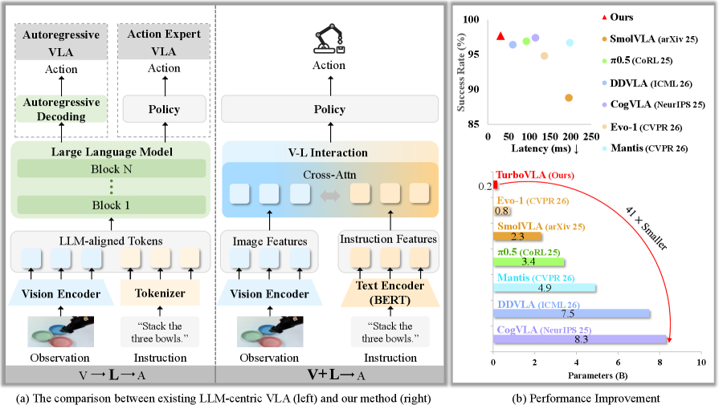

# HF Daily Papers 中文摘要：2026-07-30 ~ 07-31（含前期未覆盖补录）

- **Date:** 2026-07-31
- **Tags:** #hf-daily-papers #digest #vla #embodied #agent #rubric-rl #evaluation #video

## Context

- **覆盖范围**：07/30–07/31 抓取窗口（上一份 digest 覆盖至 07/29）。同时**回溯补录**了 HF 日期桶里此前 8 份 digest 均未选入的论文（多为 07/06–07/17 投稿）。
- **数据获取**：逐日调用 HF `daily_papers` API（07/29 复查 29 篇、07/30 23 篇、07/31 10 篇）。
- **去重方式（本期有修正）**：HF 的日期桶会**回溯包含旧论文**，只对照上一份 digest 去重会把 Harness Handbook（201▲）、LongStraw（180▲）等已覆盖论文误当新增。本期改为**对照最近 8 份 HF digest 的累计 241 个 arXiv id 去重**。
- **体量**：窗口内唯一论文 **203 篇**，累计去重后 **新增 160 篇**。按 upvotes 取 **Top 25 精选**。
- **主线信号**：**Agent/工具/评测基建（47 篇）** 与 **视频多模态（37 篇）** 领先；**具身/VLA（12）** 与 **RL/自进化（10）** 虽篇数少但占据榜首——本期第 1、3、4、5 名全部来自这两类。核心张力是「**把能力做小做快**」（TurboVLA 0.2B/32Hz）与「**把奖励做细**」（CoRT token 级信用分配）。

> **联动**：本期主线与本项目 [长程 agent 整理](/research-notes/2026-07-20-long-horizon-agents.md)（Pillar II 内化）、[推理努力度综述](/research-notes/2026-07-20-blog-reasoning-effort.md)（信用分配/长度控制）直接相接。

## 论文总览表（Top 25 by upvotes）

| # | arXiv | 标题 | ▲ |
|---|---|---|---|
| 1 | [2607.27205](https://huggingface.co/papers/2607.27205) | **TurboVLA**：RTX 4090 上 32Hz、<1GB 显存的实时 VLA | 122 |
| 2 | [2607.25431](https://huggingface.co/papers/2607.25431) | CodeNib：为编码 agent 供给仓库上下文的多视图数据系统 | 79 |
| 3 | [2607.25659](https://huggingface.co/papers/2607.25659) | **CoRT**：反事实重放做 token 级 rubric 引导的策略优化 | 77 |
| 4 | [2607.27180](https://huggingface.co/papers/2607.27180) | HumanCLAW：视觉语言模型能"通过身体"行动吗？ | 66 |
| 5 | [2607.25675](https://huggingface.co/papers/2607.25675) | DecoEvo：文本空间中 solver 与 rubric 生成器的分数解耦协同进化 | 55 |
| 6 | [2607.11643](https://huggingface.co/papers/2607.11643) | Xiaomi-Robotics-U0：世界基座模型驱动的统一具身合成 | 43 |
| 7 | [2607.25294](https://huggingface.co/papers/2607.25294) | CLBench-V：从 grounding 到知识获取的多模态上下文学习评测 | 40 |
| 8 | [2607.08758](https://huggingface.co/papers/2607.08758) | Ideas Have Genomes：科学谱系推理与谱系接地的想法生成 | 39 |
| 9 | [2607.13705](https://huggingface.co/papers/2607.13705) | AgentCompass：agent 能力的统一评测基础设施 | 39 |
| 10 | [2607.05910](https://huggingface.co/papers/2607.05910) | PolicyShiftGuard：策略自适应图像护栏的评测与改进 | 37 |
| 11 | [2607.14202](https://huggingface.co/papers/2607.14202) | KeyFrame-Compass：关键帧条件视频生成的综合评测 | 37 |
| 12 | [2607.08770](https://huggingface.co/papers/2607.08770) | LongE2V：长程事件式视频重建/预测/插帧 | 36 |
| 13 | [2607.15330](https://huggingface.co/papers/2607.15330) | Xiaomi-Robotics-1：用 10 万+ 小时真实轨迹扩展 VLA | 36 |
| 14 | [2607.14530](https://huggingface.co/papers/2607.14530) | xHC：扩展超连接（Expanded Hyper-Connections） | 36 |
| 15 | [2607.12000](https://huggingface.co/papers/2607.12000) | MetaView：尺度感知隐式几何先验的单目新视角合成 | 35 |
| 16 | [2607.08768](https://huggingface.co/papers/2607.08768) | UniClawBench：真实任务上主动型 agent 的通用基准 | 34 |
| 17 | [2607.04751](https://huggingface.co/papers/2607.04751) | Trust Region Policy Distillation | 33 |
| 18 | [2607.07964](https://huggingface.co/papers/2607.07964) | KronQ：Kronecker 分解 Hessian 的 LLM 量化 | 32 |
| 19 | [2607.11849](https://huggingface.co/papers/2607.11849) | AdvancedMathBench：高等数学证明生成与验证基准 | 32 |
| 20 | [2607.14076](https://huggingface.co/papers/2607.14076) | From Pixels to States：把交互式世界模型重思为游戏引擎 | 32 |
| 21 | [2607.14189](https://huggingface.co/papers/2607.14189) | MultiRef-Compass：多参考到音视频生成的综合评测 | 32 |
| 22 | [2607.15314](https://huggingface.co/papers/2607.15314) | Cura 1T：面向 agentic 医疗的专用万亿模型 | 32 |
| 23 | [2607.08317](https://huggingface.co/papers/2607.08317) | Blind-Spots-Bench：评测多模态模型的盲区 | 31 |
| 24 | [2607.16051](https://huggingface.co/papers/2607.16051) | Loop the Loopies！ | 31 |
| 25 | [2607.11683](https://huggingface.co/papers/2607.11683) | RAGU：带紧凑领域适配 LLM 的多步 GraphRAG 引擎 | 31 |

## 分主题详解

### 主题一：具身 / VLA —— 从"大模型居中"转向"轻量直连"（本期最强）

- **TurboVLA**（#1, ▲122，见 Deep Dive 1）：把主流的 `V→L→A`（视觉投影进 LLM 再解码动作）改成 **`V+L→A` 直接映射**，0.2B 参数在 LIBERO 拿 97.7% 成功率、**31.2ms 延迟 / 0.9GB 显存**（消费级 RTX 4090）。
- **HumanCLAW**（#4, ▲66）："VLM 能通过身体行动吗？"——直接拷问视觉语言模型的具身执行能力。
- **Xiaomi-Robotics-1 / U0**（#13/#6, ▲36/43）：一条用 **10 万+ 小时真实轨迹**扩 VLA，一条用**世界基座模型**做统一具身合成——同一家的两条路线并行。
- **GigaWorld-Policy-0.5**（▲27）：世界-动作模型（WAM）加速版。

### 主题二：Rubric 化 RL 与信用分配（篇数少但榜位高）

这是本期我认为**信息密度最高**的一簇，三篇构成完整链条：
- **CoRT**（#3, ▲77，见 Deep Dive 2）：GRPO 把 rubric 判断压成**单一标量、再均匀广播给所有 token**，导致无法在 response 内分配信用。CoRT 用**反事实重放**（同一回答分别在"带 rubric"与"去掉 rubric"的 prompt 下重打分）得到 token 级权重，平均 **+4.4 个百分点**。
- **DecoEvo**（#5, ▲55）：让 **solver 与 rubric 生成器在文本空间协同进化**，且分数解耦——rubric 本身也在演化。
- **CAST**（▲30）：把博弈求解器当**回合级教师**来训 LLM agent。
- **Trust Region Policy Distillation**（#17, ▲33）：给策略蒸馏加信任域约束。

> 三篇合起来说明一个转向：**奖励不再是"一个数"，而是"一套可演化、可细分到 token 的结构"**。

### 主题三：Agent 评测与基础设施（篇数第一）

- **CodeNib**（#2, ▲79）：**多视图数据系统**，专门为编码 agent 供给仓库上下文——把"给 agent 喂什么代码"当数据系统问题解。
- **AgentCompass**（#9, ▲39）/ **UniClawBench**（#16, ▲34）：前者做统一评测基建，后者专测**主动型（proactive）agent** 在真实任务上的表现。
- **Cura 1T**（#22, ▲32）：agentic 医疗专用万亿模型——垂直域 agent 开始出现专用基座。
- **RAGU**（#25, ▲31）：多步 GraphRAG + 紧凑领域适配 LLM。

### 主题四：视频与多模态生成（37 篇，最大类）

- **KeyFrame-Compass**（#11）/ **MultiRef-Compass**（#21）/ **CLBench-V**（#7）/ **Blind-Spots-Bench**（#23）：**"Compass/Bench" 评测系列继续井喷**——关键帧条件生成、多参考音视频、多模态上下文学习、模型盲区各有专测。
- **LongE2V**（#12, ▲36）：长程事件式视频的重建/预测/插帧统一框架。
- **MetaView**（#15, ▲35）：尺度感知隐式几何先验做单目新视角合成。
- **From Pixels to States**（#20, ▲32）：把交互式世界模型**重思为游戏引擎**——从"生成像素"转向"维护状态"。

### 主题五：效率与架构

- **xHC（Expanded Hyper-Connections）**（#14, ▲36）：残差连接的推广形式。
- **KronQ**（#18, ▲32）：用 Kronecker 分解的 Hessian 做量化。
- **Loop the Loopies!**（#24, ▲31）：循环结构探索（标题俏皮，内容待考）。

### 主题六：科学与数学

- **Ideas Have Genomes**（#8, ▲39）：**科学谱系推理**——benchmark 模型能否追溯想法的"基因",并生成谱系接地的新想法。这是"AI 做科研"里少见的**溯源**视角。
- **AdvancedMathBench**（#19, ▲32）：高等数学**证明生成与验证**基准。

## Deep Dive 1：TurboVLA —— 把 LLM 从 VLA 的中心位置挪走（▲122，本期榜首）

[arXiv:2607.27205](https://huggingface.co/papers/2607.27205)

**它挑战的定式**：主流 VLA 模型走 **`V→L→A`** 路径——视觉观测先被投影进 LLM 的表示空间，再解码成机器人动作。有效，但**每次策略调用都要付一次大模型的计算与显存开销**。对需要高频控制的机器人，这是硬伤。

**TurboVLA 的做法**：重构成 **`V+L→A` 直接映射**——
1. 视觉与语言**各自独立编码**（视觉编码器 + BERT 文本编码器，不再让 LLM 居中）；
2. 二者通过**轻量双向 vision-language 交互**（cross-attention）直接交换信息；
3. 用一个**紧凑解码器**直接预测**连续动作块（action chunks）**。

**LIBERO 上的关键数据**：

| 指标 | TurboVLA | 对比 |
|---|---|---|
| 平均成功率 | **97.7%** | 匹配或超过大得多的 VLA 策略 |
| 参数量 | **0.2B** | CogVLA 8.3B（**41× 更小**）、DDVLA 7.5B、Mantis 4.9B、π0.5 3.4B |
| 推理延迟 | **31.2 ms**（≈32 Hz） | 其余多在 100–250 ms |
| 推理显存 | **0.9 GB** | 消费级 RTX 4090 即可本地部署 |

**我的看法**：这篇的价值不在某个新模块，而在**质疑一个被默认接受的架构假设**——"VLA 必须以 LLM 为感知与动作的中枢"。作者的论证是：如果任务条件化的表示可以**直接从视觉+语言特征构造**，那 LLM 这个中间层就是纯开销。结果相当有说服力：**0.2B 打平 8.3B**，且延迟进入实时控制区间（32 Hz）。

这与本期第二条主线（CoRT 把奖励做细）构成有趣的对照：**一边在减架构，一边在加奖励结构**——都是在"哪里值得花复杂度"上做重新分配。需要留意的边界是：LIBERO 是仿真基准，**去掉 LLM 后在开放世界指令泛化上的损失**论文没有充分回答——这类"小而快"的方案是否牺牲了语言理解的长尾，值得追踪。

## Deep Dive 2：CoRT —— 用"反事实重放"给 token 分配信用（▲77）

[arXiv:2607.25659](https://huggingface.co/papers/2607.25659)

**问题**：Rubric-based RL（按明确标准评判输出）本该提供丰富信号，但在 **GRPO 式流水线**里，这些结构化判断被**压成一个 response 级标量奖励**、再转成 response 级 advantage、**均匀广播给该回答的所有 token**。结果是：即使不同评判标准分别锚定在不同的片段、格式决策、语义选择上，也**没有任何机制在回答内部分配信用**。

**CoRT 的巧思**——不训额外的 token 打分模型，而用 **counterfactual replay（反事实重放）**：
1. 把**同一个已采样的回答**，分别在「**带 rubric 的原始 prompt**」与「**匹配的 criteria-free prompt**」下重新打分；
2. 两者的 **token 级 log-likelihood 差值** $\ell_t^+ - \ell_t^-$，作为该 token「**对 rubric 上下文的依赖度**」的代理；
3. 把差值映射成**有界、response-归一化**的权重，用它把带符号的 GRPO advantage **重新分配到各 token**——**不引入辅助打分器、也不改变 response 级奖励**。

**效果**：跨多个指令微调模型与不同奖励粒度，CoRT 在**绝大多数对比中优于匹配的 response 级 GRPO**，平均 **+4.4 个百分点**；且与**已学习的 token 级信用基线相当**，却省掉了单独的相关性学习阶段。

**我的看法**：这篇的优雅之处是**用策略自身当探针**——不额外训模型，只靠"同一回答在有/无 rubric 两种条件下的似然差"就定位出"哪些 token 是被标准驱动的"。配图那个例子很直观:格式类 token（`*`、"P.S."、"三个"）对 rubric 高度依赖,而内容词几乎不依赖。

它正好补上我在 [推理努力度综述](/research-notes/2026-07-20-blog-reasoning-effort.md) 里记录的一个空缺:那篇讲的是**如何控制推理长度**,而 CoRT 讲的是**长回答内部如何分配奖励**——两者是"信用分配"这个问题的时间维与结构维。也与上一期 digest 的信用分配主线（机器人进度奖励）跨领域呼应。

一个待验证点:反事实重放需要**每个回答多跑一次前向**（criteria-free 重打分）,论文未充分讨论这个额外开销在大规模 RL 里的占比。

## 其他值得关注（精选剩余，一句话）

- **CodeNib**（#2, ▲79）：把"给编码 agent 喂哪些仓库上下文"当成**数据系统**问题——多视图供给，而非简单检索。
- **PolicyShiftGuard**（#10, ▲37）：图像护栏要能**随策略变化自适应**，并给出评测。
- **Cura 1T**（#22）：垂直域（医疗）开始出现 agentic 专用万亿模型。
- **Ideas Have Genomes**（#8）：给"AI 生成科研想法"加上**谱系溯源**要求——不只要新，还要说清从哪来。
- **UniVR**（▲29）/ **OpenCoF**（▲28）：前者"在视觉空间里思考"做统一视觉推理，后者**通过视频生成学推理**。
- **From Pixels to States**（#20）：世界模型的评价标准从"画得像"转向"状态维护得对"。

## 趋势分析

1. **具身智能的复杂度正在"下移"**。TurboVLA（0.2B/32Hz/0.9GB）把 LLM 从 VLA 中枢移走，Xiaomi 两条线（10 万小时真实轨迹 vs 世界模型合成）分头攻数据来源。**共同点是不再假设"更大的 LLM 居中"是必须的**——对需要高频闭环的机器人，延迟与显存是一等约束。
2. **奖励从"标量"走向"可演化的结构"**。CoRT（token 级信用）+ DecoEvo（rubric 生成器协同进化）+ CAST（博弈求解器当回合级教师）+ Trust Region Policy Distillation 四篇同期，指向同一件事：**GRPO 的"一个标量广播给所有 token"是当前瓶颈**，而拆细信用分配不必依赖额外的打分模型。
3. **评测基建化、且开始"专测盲区"**。Compass/Bench 系列（KeyFrame/MultiRef/CLBench-V/Blind-Spots/UniClaw/AgentCompass/AdvancedMath）本期至少 7 篇。值得注意的是重心从"测能力"转向**"测失效模式"**（Blind-Spots-Bench、PolicyShiftGuard）——这与我在 [长程 agent 整理](/research-notes/2026-07-20-long-horizon-agents.md) 里记的"harness 越强、评测越失真"是同一忧虑的另一面。
4. **世界模型的评价范式在换轨**。From Pixels to States 主张把交互式世界模型当**游戏引擎**（维护状态）而非视频生成器（渲染像素）——若这个视角站住，世界模型的 benchmark 会从画质指标转向状态一致性。

## Open Questions

1. TurboVLA 去掉 LLM 中枢后，**开放世界的语言指令泛化**损失多少？LIBERO 是仿真基准，长尾指令理解未被充分检验。
2. CoRT 的**反事实重放开销**（每回答多一次前向）在大规模 RL 中占比多少？与训一个轻量 token 打分器相比，总成本孰优？
3. 本期评测论文再度井喷（≥7 篇），**评测碎片化**是否在稀释信号？仍缺一个像 RULER 之于长上下文那样能"戳穿虚标"的统一 agent 评测。
4. "把 rubric 也一起进化"（DecoEvo）如何避免**评判标准与被评判者共同漂移**（solver 学会取巧、rubric 迎合 solver）？这是自进化系统的经典风险。

## References

> 本期新增覆盖 160 篇，已用 `scripts/add_paper.py`（默认 `--delay 3` 限速）入 `references.bib`：**新增 88 篇入库、72 篇此前已在库**（库现 1834 条）。以下列 Top 25 的 HF link。

- TurboVLA — https://huggingface.co/papers/2607.27205
- CodeNib — https://huggingface.co/papers/2607.25431
- CoRT — https://huggingface.co/papers/2607.25659
- HumanCLAW — https://huggingface.co/papers/2607.27180
- DecoEvo — https://huggingface.co/papers/2607.25675
- Xiaomi-Robotics-U0 — https://huggingface.co/papers/2607.11643
- CLBench-V — https://huggingface.co/papers/2607.25294
- Ideas Have Genomes — https://huggingface.co/papers/2607.08758
- AgentCompass — https://huggingface.co/papers/2607.13705
- PolicyShiftGuard — https://huggingface.co/papers/2607.05910
- KeyFrame-Compass — https://huggingface.co/papers/2607.14202
- LongE2V — https://huggingface.co/papers/2607.08770
- Xiaomi-Robotics-1 — https://huggingface.co/papers/2607.15330
- xHC — https://huggingface.co/papers/2607.14530
- MetaView — https://huggingface.co/papers/2607.12000
- UniClawBench — https://huggingface.co/papers/2607.08768
- Trust Region Policy Distillation — https://huggingface.co/papers/2607.04751
- KronQ — https://huggingface.co/papers/2607.07964
- AdvancedMathBench — https://huggingface.co/papers/2607.11849
- From Pixels to States — https://huggingface.co/papers/2607.14076
- MultiRef-Compass — https://huggingface.co/papers/2607.14189
- Cura 1T — https://huggingface.co/papers/2607.15314
- Blind-Spots-Bench — https://huggingface.co/papers/2607.08317
- Loop the Loopies! — https://huggingface.co/papers/2607.16051
- RAGU — https://huggingface.co/papers/2607.11683

> 说明：deep-dive 配图取自各自 arXiv HTML 版（已在图注标明）。本期**去重方式有修正**：因 HF 日期桶会回溯包含旧论文，改为对照最近 8 份 digest 的累计 241 个 id 去重，避免把 Harness Handbook / LongStraw 等已覆盖论文误报为新增。
