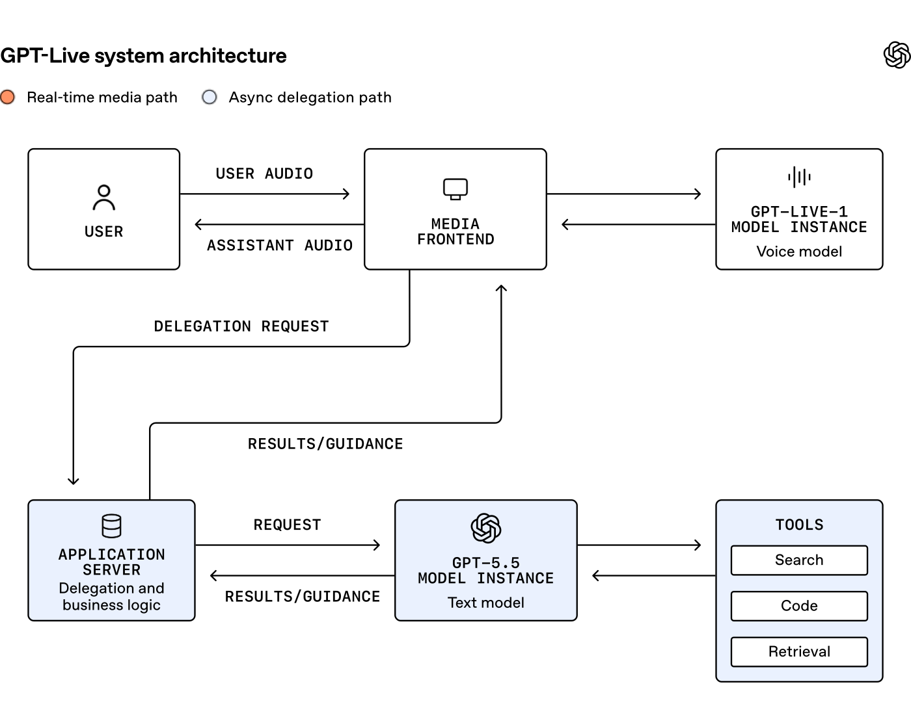
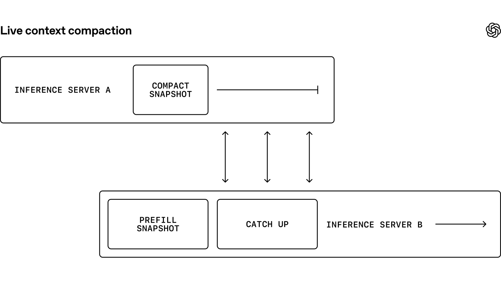

# OpenAI《六个月内建成响应式语音 AI 实时系统》精读(GPT-Live)

- **Date:** 2026-08-04
- **Tags:** 语音AI, GPT-Live, 实时系统, WebRTC, WARP, full-duplex, 上下文压缩, 系统工程, blog-deep-dive
- **原文:** [How we built a realtime system for responsive voice AI in six months](https://openai.com/index/continuous-voice-interaction-with-gpt-live/)(OpenAI Engineering,2026-08-03)
- **作者:** **Justin Uberti**、**Zahan Malkani**(Members of Technical Staff)—— Uberti 是 WebRTC 的创造者之一,这个署名本身就说明了文章重心
- **抓取说明:** `openai.com/index/*` 有 **Cloudflare bot challenge**;curl / WebFetch 403,**本地 headless Chromium 也卡在 "Just a moment..."**。最终用 **AgentCore 云浏览器**(真实浏览器指纹的 Firecracker microVM)取到 **HTTP 200 + 全文 18517 字符 + 三张 CDN 原图**。

## TL;DR

这不是模型论文,而是一篇**系统工程复盘**:如何把语音 AI 从"回合制(turn-based)"改造成"**流式 + 全双工**",并让它在 ChatGPT 规模下保持亚秒响应。

**一句话总结全文主旨:** 作者自己写的 —— **"the voice must flow"(语音必须流动)**。所有设计都服从这一条:把一切可能阻塞媒体流的东西移出实时路径。

**四个关键动作:**
1. **移除音频路径上的 turn detector** —— 语音模型改为 **full-duplex**(边听边说)
2. **异步委派(delegation)** —— 深度推理交给 GPT-5.5,**不阻塞对话**
3. **有状态推理 + 无缝实例切换** —— 让上下文压缩在"活路径"之外完成
4. **协议层优化** —— 自研 **WARP**,把 WebRTC 启动从 **6 个 RTT 压到 1 个**

## 一、问题:回合制架构的两难

> "对语音 AI 来说,**知道何时该说话比听起来要难**。"

人类交谈的接话间隔在**几分之一秒**,而以往语音 AI 跟不上这个节奏。原因在架构:

- 依赖一个叫 **turn detector 的小模型**来判断用户说完了没有
- 这个任务是"不讨好的(unenviable)":**猜早了打断用户,猜晚了显得迟钝**
- 更糟的是**串行依赖**:只有 detector 做出决定之后,大得多的 LLM 才能开始干活

演进的三代:
| 代际 | 做法 | 问题 |
|---|---|---|
| **级联式(cascaded)** | STT → LLM → TTS 串行 | 累加延迟;**丢掉语调与节奏线索** |
| **Speech-to-speech** | 直接处理音频,保留转写会丢的细节 | 仍**依赖 turn detector 决定何时开始推理**——"模型承担更多,但交互仍是回合制" |
| **GPT-Live(第三代)** | **把 turn detector 从音频路径移除**,语音模型 full-duplex | —— |

## 二、系统架构

**核心是两条路径的分离:**
- **实时媒体路径(fast path)**:用户音频 → Media Frontend → GPT-Live-1 语音模型 → 助手音频。**这条路径小、可预测、只做必须实时的事。**
- **异步委派路径**:Media Frontend 发出 delegation request → Application Server(委派与业务逻辑)→ GPT-5.5 → 工具(搜索/代码/检索),结果作为 **RESULTS/GUIDANCE** 回注。

> **关键工程判断(原文):** "一个慢的工具调用或后端服务可以延迟它自己的结果,**但不能拖住媒体流动**。"

这个边界还有个附带好处:**应用可以改工具、策略、后端行为,而不影响负责保持音频流动的媒体前端** —— 定制化与响应性解耦。

### 一个具体的工程数字

> **媒体前端与推理逻辑用 Go 重写,替换了原先的 Python asyncio 实现。这显著改善了帧交付的平滑度——新系统的 p95 达到了旧系统的 p50。**

这是全文最硬的一个性能数字:**p95 = 旧 p50**,意味着尾延迟改善了整整一个分位档次。

## 三、有状态推理:把"重活"挪出活路径

有状态推理带来运营上的两难:**语音会话可能长时间保持活跃,但上下文持续增长,而模型实例会随需求起停。**

### 无缝实例切换(seamless handoff)

做法:
1. 在现有实例旁**预热一个替代实例**
2. 用当前会话上下文**预填(prefill)** 它
3. **两个实例并行推理**
4. 新实例完全就绪后**切过去**

### 动态上下文压缩(dynamic context compaction)

**问题链条讲得很清楚:**
- 对话变长 → 上下文最终会超出模型上下文上限
- 压缩能把它压回限内,**但压缩本身耗时**
- 更麻烦的是:压缩**改变了过去的上下文,从而使 KV cache 失效**
- 重建这个状态需要**重新 prefill**,又引入延迟

**解法:把压缩也当成一次"受管理的切换"** —— 原实例继续聊天,系统在旁边压缩上下文并准备好替代实例;新实例就绪后无媒体中断地切换。

> "重活留在活路径之外,所以**即使在切换过程中,对话也不会漏掉一个节拍**。"

## 四、异步委派:把"说话"和"思考"解耦

GPT-Live 能调用现有前沿模型,**有效地把"talking"与更深的"thinking"解耦**。但要让这个双模型架构感觉像**一个系统**,得解决两个问题。

### 问题 1:委派要足够快

语音模型能"暂时把对话撑住"让前沿模型推理或用工具,**但它掩盖不了任意慢的响应**。所以整条委派回路(路由 → prompt 处理 → 推理 → 工具调用)都算进**响应性预算**。

优化手段:
- **提前准备**:语音会话一开始,应用服务器就为前沿模型创建推理会话,并**用初始对话上下文预填**,确保首次委派请求之前 prompt 已完全处理完
- **会话保持**:整个语音对话期间保留该推理会话,后续请求用**稳定的 session affinity**;配合 **prompt caching** 改善延迟,同时 worker 故障仍易恢复
- **调节杠杆**:reasoning effort、输出上限、工具 schema、模型-工具往返次数

### 问题 2:从连续语音里"切出"离散回合

这是我觉得**最精彩的一节** —— 因为周边系统(ChatGPT 会话 UI、分析与安全基础设施)仍然按"用户/助手回合"工作,所以应用服务器必须把**重叠的、时而含糊的对话**拆成离散消息。

做法:
- 用**部分转写 + 时序信号**推断谁"持有话语权(has the floor)",构建消息队列
- **最新的消息保持临时(provisional)状态** —— 它的文本、时序、说话人归属都可能随更多语音到来而改变
- 只有当某说话人**持有话语权足够久、归属可靠**时,才最终确定该消息

**说话人重叠让问题更复杂:**
- 用户说话时助手的简短应答("mm hmm""okay")**不应该**自成一条消息
- 但助手实质性的插话**通常应该**
- 用户中途插话时,也要**优先保证显示的助手回复的连贯性**

> **每种分段策略都在"新鲜度"与"确定性"之间权衡:提交太早会产生碎片化历史与不稳定排序;等太久则延迟转写和依赖它的功能。**

**最终方案:系统维护对话的两个视图**
| 视图 | 用途 |
|---|---|
| **speculative(推测)视图** | 当前状态;应用 UI 用它(UI 能处理更新) |
| **authoritative(权威)记录** | 说过什么的最终记录;分析管线需要最终转写 |

这样"**给 ChatGPT 其余部分一个稳定的对话视图,而不把回合制强加到实时语音路径上**"。

## 五、协议层:WARP 把 6 个 RTT 压到 1 个

**问题诊断很到位:** WebRTC 是很好的实时基础,但启动一个 vanilla WebRTC 会话需要**惊人数量的协议握手与网络往返**。原因是 **WebRTC 早于 QUIC 那种"最小化往返"的设计思潮**,其底层各协议**各自带一套 anti-DoS 机制**,组合使用时会重复劳动。

**WARP(WebRTC Abridged Roundtrip Protocol)** —— 把媒体与数据启动**从 6 个网络往返减到 1 个**,靠四项向后兼容的改进:
1. **把 DTLS 握手搭载在 ICE 上**(SPED)
2. 使用更快的 **DTLS 1.3** 握手
3. **预协商 SCTP 握手**(SNAP)
4. **预协商 data channel**,而不用 DCEP

**生态动作值得注意:** WARP 被设计成**一组开放规范**,与 WebRTC 社区协作者共同推进,正在走 **IETF TSVWG 工作组**;**libwebrtc 与 Pion 都已加入 WARP 支持**,其它实现在推进中。

### Instant Connect:把 SDP 交换也移出关键路径

优化完媒体握手后,剩下的显著延迟是**连接前交换 SDP 参数的 signaling**。他们做了 **Instant Connect**:**提前协商这些参数,既不预留服务器容量,也不需要改动现有 WebRTC 实现**。

- 它与标准 signaling 流程**并行**运行
- 预协商参数有效 → 服务器在**第一个媒体包到达时**就把会话具体化
- 参数过期或无效 → signaling 流程已在进行中,客户端**无额外延迟地回退**

**合起来的效果:客户端现在可以用「一个 UDP 包」启动一个会话**,服务器立即响应。

## 六、生产环境静默测试:比"跑分"更有价值的一节

> "一个系统可以在纸面上看起来很快,**却在真实语音流量下卡住**。"

**做法:** 在让 GPT-Live 与用户对话之前,做了一次**静默测试(silent test)** —— 把一小部分(逐步增加)生产 ChatGPT Voice 会话**同时路由**给现有 Advanced Voice Mode 与新系统;AVM 照常服务用户,而**影子路径以只读模式跑推理**。这样在**不改变用户听到的内容**的前提下,把系统暴露给真实客户端、网络、会话长度与地理分布。

**四个教训(每一条都很实在):**

1. **容量不能简化为 GPU 吞吐。** 语音会话长时间保持并持续发帧,所以 **CPU 侧的流处理器、队列、网络路径必须与推理一同扩展**。真实负载下**某个支撑组件比压测估计更早饱和**,导致推理请求堆积、延迟复合。
   > 于是他们把容量问题从"**一块 GPU 能处理多少请求?**"改成"**系统能维持多少并发会话、同时让每一帧都按时?**"

2. **地理成为一等问题。** 把会话路由到远处容量会在启动与流式的多个环节增加延迟。他们开始**把模型上线与区域容量、流量调度配置一起验证**,并按来源地理拆解延迟。**把推理挪近用户有帮助,但更大的教训是:端到端响应性取决于路径上的每一个服务,而不只是模型服务器。**

3. **有些故障只在真实的会话生命周期里出现。** 长会话暴露内存与持久化压力;重连考验压缩与状态恢复;**普通的客户端断连揭示了关闭握手中的竞态**。这些问题在短压测里很少出现,因为它们依赖**时间、累积状态、跨服务边界的行为**。

4. **被迫改善可观测性与发布控制。** 他们发现了**混淆不同延迟来源的指标**、**聚合值掩盖了个别不健康引擎的仪表盘**、以及**测试系统与部署系统之间的配置漂移**。对策:更细粒度的遥测、对照已知良好配置做校验、分阶段放量、以及快速隔离或禁用单条路径的能力。
   > "静默测试成了一次早期的发布演练——不只演练系统能接多少流量,**还演练我们能多快检测、遏制并从故障中恢复**。"

## 我的看法

1. **这是一篇"把架构约束当第一性原理"的范文。** 全文只有一条中心律令——**the voice must flow** —— 然后所有决策都从它推出:媒体路径与业务逻辑分离、委派异步化、压缩做成实例切换、协议握手压缩。**这种由单一硬约束反推整套架构的写法,比堆技术名词有说服力得多。**

2. **"移除 turn detector"是模型能力换系统复杂度的经典案例。** 以前用小模型猜边界(便宜但两难),现在让 full-duplex 语音模型自己掌控对话(贵但消除了两难)。**但注意它并没有真的消除"回合"这个概念** —— 只是把它从**音频路径**赶到了**应用层**(第四节的 speculative/authoritative 双视图)。**回合制没有消失,而是被降级为一个下游的表示问题。** 我觉得这是全文最容易被忽略的洞察。

3. **上下文压缩当"实例切换"处理,这个思路可复用。** 压缩会失效 KV cache → 需要重新 prefill → 引入延迟。他们的解法是**用空间换时间**:旁边起个新实例慢慢准备,好了再切。这与我最近读的 agent 记忆论文(LazyMem / MemTX / Addressable Recall Compaction,见 [[tech-blogs/2026-W31f]])是同一问题的**系统侧答案** —— 论文在讨论"压缩什么",这篇在解决"压缩时怎么不卡住"。

4. **WARP 是这篇里最有长期价值的部分。** 6 RTT → 1 RTT 不是调参,而是**发现了协议组合时的冗余**(每层各自的 anti-DoS)。更值得记的是他们**把它做成开放规范推进 IETF,libwebrtc 与 Pion 已支持** —— 一家 AI 公司给整个实时通信生态留下了基础设施改进。这比模型本身活得更久。

5. **静默测试那节应该被更多人读。** "容量不是 GPU 吞吐而是并发会话数"、"端到端响应性取决于路径上每个服务"、"故障只在真实会话生命周期里出现"—— 这些是**只有真跑过生产的人才写得出的东西**,而且与模型能力完全无关。它提醒我们:**语音 AI 的瓶颈很大程度上在分布式系统工程,不在模型。**

6. **署名值得注意:Justin Uberti 是 WebRTC 的创造者之一。** OpenAI 把 WebRTC 的原作者招进来做语音基础设施,然后产出了对 WebRTC 协议栈本身的改进 —— 这个人事-技术对应关系很能说明他们对实时语音的投入程度。

## Open Questions

- **没有给出绝对延迟数字。** 全文唯一的量化性能对比是"新系统 p95 = 旧系统 p50",以及 WARP 的 6→1 RTT。**端到端首字延迟、打断响应时间等关键指标一个都没披露** —— 对一篇讲"响应性"的文章来说,这是个明显的留白。
- **GPT-Live-1 这个语音模型本身几乎没讲。** full-duplex 怎么训练?音频如何 token 化?模型多大?**全文是纯系统视角,模型侧是黑盒。**
- 委派给 GPT-5.5 时,**语音模型如何决定"该委派"?** 这个路由决策的机制没有展开。
- speculative / authoritative 双视图的**分段策略参数**(多久算"持有话语权足够久")如何调优?这直接影响转写质量与 UI 体验。
- **GPT-Live API** 文中说"upcoming",定价与开放时间未提。

## 关联

- **本仓库:** [[tech-blogs/2026-W31f]](同期 agent 记忆/上下文压缩论文潮;OpenAI GPT-5.6 效率文)、[[2026-07-27-claude-opus-5-system-card]](对照:Anthropic 的系统卡是安全文档,这篇是工程复盘)
- **原文提到的延伸:** WARP 规范(IETF TSVWG)、SPED、SNAP、DTLS 1.3、[rebuilt our voice infrastructure](https://openai.com/index/)(前作)
- **相关前作:** ChatGPT Voice 与 Realtime API 的基础设施重建

> 引用须可验证:以上所有引述、数字(p95=p50、6→1 RTT)与四节教训均出自原文全文(18517 字符,经 AgentCore 云浏览器取得);三张配图为原文 CDN 原始 SVG 转 PNG。**文中未披露绝对延迟数字与模型细节,已在 Open Questions 明确标注,未做任何补白。**
