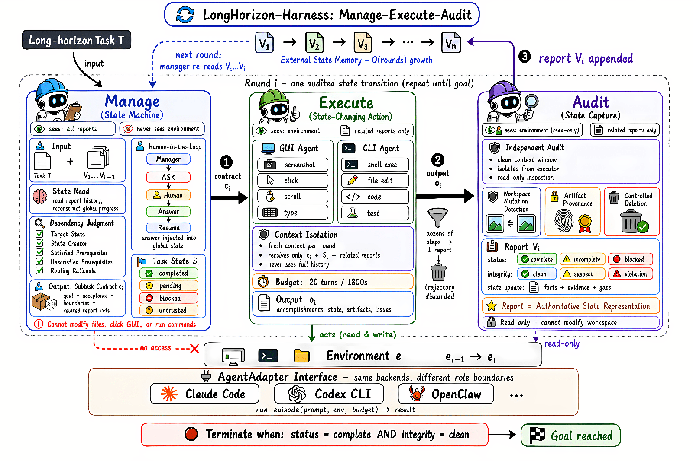
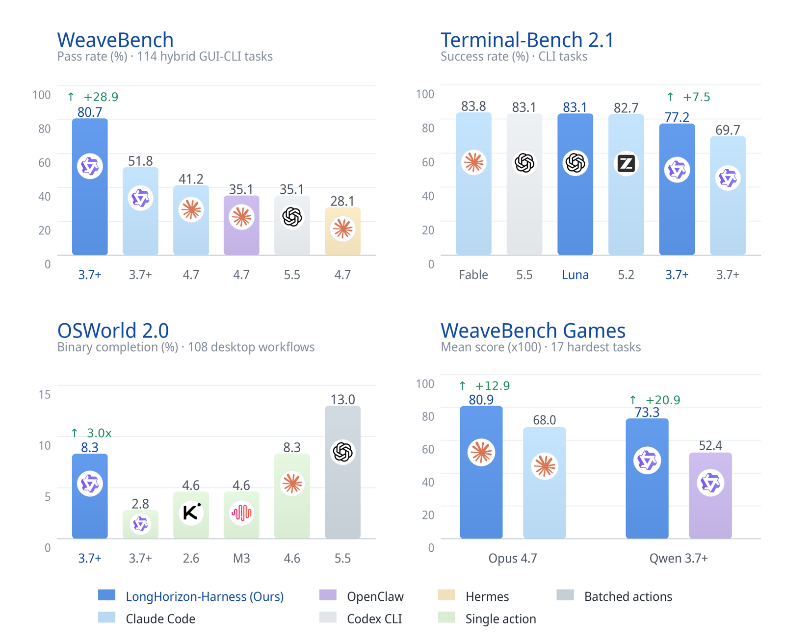
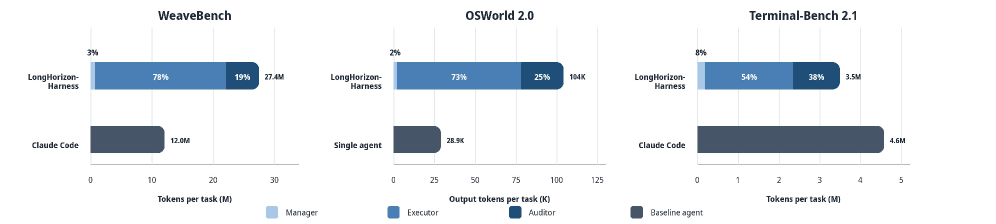
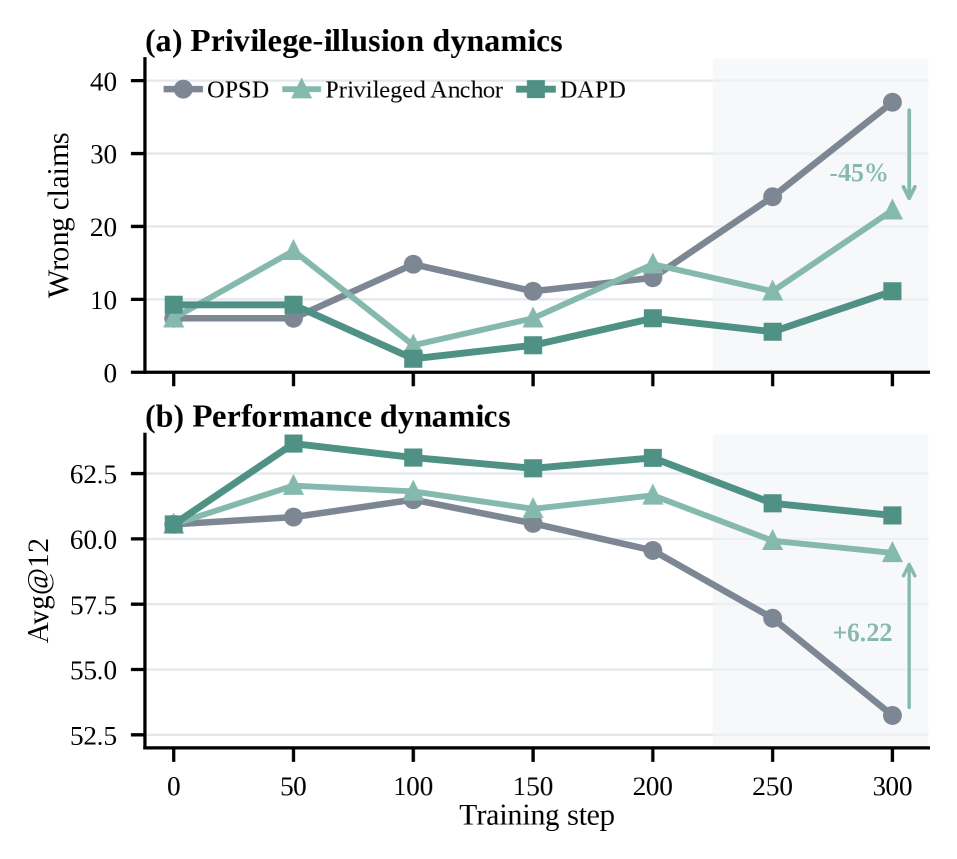
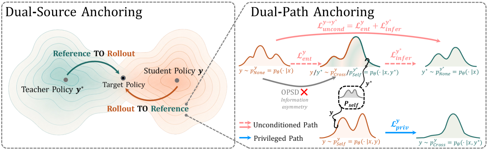

# HF Daily Papers 摘要 · 08/04–08/07

- **Date:** 2026-08-07
- **Tags:** hf-daily-papers, digest, long-horizon-agent, harness, on-policy-distillation, 世界模型, 信用分配, RSI
- **覆盖窗口:** 2026-08-03 → 2026-08-07（承接 [[2026-08-03-hf-daily-papers-aug01-03]]）
- **体量:** 窗口内 **149 篇唯一** / 对照最近 8 份 digest 的累计 **165 个 arXiv id** 去重后 **新增 141 篇**；本文精选 Top 25 + 2 篇 deep dive
- **数据获取:** HF API `daily_papers?date=YYYY-MM-DD&limit=100&sort=publishedAt`，逐日抓取（08-03: 27 / 08-04: 40 / 08-05: 38 / 08-06: 34 / 08-07: 10）

## Context：本期是罕见的「单主题压倒性」窗口

这份 digest 的主线不需要挖掘——**它就摆在数字上**：

| 聚类 | 命中篇数 | 占新增的比例 |
|---|:---:|:---:|
| **long-horizon / harness** | **18** | 12.8% |
| **on-policy distillation (OPD/OPSD) / 自蒸馏** | **16** | 11.3% |
| 世界模型 | 9 | 6.4% |
| skill（技能生成/使用/评测） | 8 | 5.7% |
| RSI / 自进化 | 7 | 5.0% |
| 信用分配 | 5 | 3.5% |

**两个聚类合计 34 篇 = 新增的近四分之一。** 更值得注意的是它们不是松散的同题，而是**同一周内出现了成体系的变体命名**：OPD 一族有 `DAPD`、`SAF-OPD`、`Any-OPD`、`Poly-OPD`、`OPD-V`、`AgentOPSD`、`PCSD`、`W2S-OPD`、`On-Policy Delta Distillation`、`TurnSight`（hindsight 自蒸馏）、`When Teachers Mislead`（spurious-signal-aware OPD）—— **一个方法名已经开始像一个子领域那样长出后缀矩阵**（按维度：异构/多教师/视觉/agentic/弱到强/多语言）。

这是本期最重要的元观察：**on-policy distillation 在一周之内完成了从「一种后训练技巧」到「一个有命名规范的子领域」的相变。**

## 论文总览表（Top 25 by upvotes）

| # | 论文 | ▲ | 主题 |
|---:|---|---:|---|
| 1 | [LongHorizon-Harness: Advancing Long-Horizon Agents for Real-World Tasks](https://huggingface.co/papers/2608.01964) | **156** | long-horizon / harness ⭐ **deep dive** |
| 2 | [SwanTale: 统一多说话人语音与音频生成（instruct + zero-shot）](https://huggingface.co/papers/2608.02023) | 150 | 语音生成 |
| 3 | [Deferred Exposure of Future Trajectories：自动驾驶 VLM 的可验证推理](https://huggingface.co/papers/2608.01755) | 139 | VLA / CoT 监督偏差 |
| 4 | [DAPD: Dual-Anchored Policy Distillation](https://huggingface.co/papers/2608.01735) | **105** | OPD ⭐ **deep dive** |
| 5 | [Mental World Modeling](https://huggingface.co/papers/2607.27201) | 102 | 世界模型 + 心理状态 |
| 6 | [MerchantBench：电商长期一致性 agent 基准](https://huggingface.co/papers/2607.28956) | 92 | long-horizon 评测 |
| 7 | [JoyAI-Video-Edit：自回归扩散的实时开放式视频编辑](https://huggingface.co/papers/2608.03974) | 81 | 视频编辑 + 蒸馏 |
| 8 | [Hunyuan3D-Buffalo 1.0：统一 3D 生成/理解/编辑](https://huggingface.co/papers/2608.02711) | 79 | 3D 统一模型 |
| 9 | [AURORA-LM：连续隐空间扩散语言模型](https://huggingface.co/papers/2608.02602) | 74 | 扩散语言模型 |
| 10 | [InfiniSplat：单图大基线视图合成的隐式高斯解码](https://huggingface.co/papers/2608.02437) | 60 | 3DGS |
| 11 | [Progressive Agent Skill Generation via RL（Skill-α）](https://huggingface.co/papers/2608.01678) | 58 | skill 生成 |
| 12 | [ABSeeker：答案回溯信用分配训练长程搜索 agent](https://huggingface.co/papers/2608.05102) | 55 | 信用分配 + long-horizon |
| 13 | [Weak-to-Strong On-Policy Distillation](https://huggingface.co/papers/2607.26246) | 54 | OPD |
| 14 | [UEmbed：统一稀疏与稠密多模态嵌入](https://huggingface.co/papers/2608.02583) | 49 | 检索 |
| 15 | [ToolArtist：工具调用的统一多模态 agentic 图像生成](https://huggingface.co/papers/2608.04436) | 46 | 多模态 agent |
| 16 | [VAD：多模态 OPD 中的视觉证据归因](https://huggingface.co/papers/2607.28590) | 45 | OPD（多模态） |
| 17 | [Video-DeepResearch：下一代多模态深度研究 agent](https://huggingface.co/papers/2608.03979) | 45 | deep research agent |
| 18 | [Knowledge-Geometry Decoupling：流式推荐的可刷新预训练迁移](https://huggingface.co/papers/2608.02738) | 44 | 推荐 |
| 19 | [Towards Physics of Multimodal Pretraining：知识流/模态协同/早期统一](https://huggingface.co/papers/2608.05000) | 43 | 多模态预训练机理 |
| 20 | [PCSD：agentic RL 的持续一致性自蒸馏](https://huggingface.co/papers/2608.01837) | 37 | OPD + agentic RL |
| 21 | [The Personalization Mirage：LLM 如何编造用户画像，以及自监控为何误导](https://huggingface.co/papers/2608.04570) | 37 | 个性化 / 可信度 |
| 22 | [N₀-TWAM：接触密集操作的触觉原生世界-动作模型](https://huggingface.co/papers/2607.23783) | 36 | 具身 / 世界模型 |
| 23 | [CADENA：逐步 CAD 逆向工程](https://huggingface.co/papers/2608.00799) | 35 | CAD |
| 24 | [SAF-OPD：OPD 的稳定优势融合](https://huggingface.co/papers/2607.29209) | 34 | OPD |
| 25 | [WorldExam：从表观外貌到内在反应性的世界模型基准](https://huggingface.co/papers/2608.02603) | 34 | 世界模型评测 |

## 分主题详解

### ① Long-horizon / harness（18 篇）—— 从「做得更久」转向「状态怎么管」

这一族本期最集中，而且**问题定义发生了明确的收敛**：不再问「agent 能跑多久」，而问「**跨轮次的状态由谁维护、由谁核实**」。

- ⭐ [**LongHorizon-Harness**](https://huggingface.co/papers/2608.01964)（156▲，阿里 DreamX）—— 把长程执行**重构成任务状态管理问题**，Manage-Execute-Audit 三角色。详见 deep dive。
- [**OneDayAgent**](https://huggingface.co/papers/2608.05013)（28▲）—— 同题异构方案，直接以「一天」为时间尺度设计 harness。**同期两篇独立工作都把 harness 当一等研究对象**，与我在 [[2026-07-31-blog-harness-shelf-life]] 记的「harness 工程成显学」形成论文侧印证。
- [**MerchantBench**](https://huggingface.co/papers/2607.28956)（92▲）—— 电商卖家场景的**长期一致性**基准。设计思路值得记：需要「动作约束未来选择、反馈以异质延迟到达、不一致行为产生可测量的累积后果」的持久环境。**这是把「长程」从时长定义改成因果定义。**
- [**Recursive Synthesis for Long-Horizon Terminal Tasks**](https://huggingface.co/papers/2608.05466)（13▲）、[**CalibForge**](https://huggingface.co/papers/2608.06352)（3▲，对抗式 solver 校准以扩展可学习终端任务）—— 长程任务的**合成**侧。
- [**Toward Skill-Native LLMs: Skill Entropy**](https://huggingface.co/papers/2608.05139)（21▲）—— 提出 skill entropy 同时做基准与训练信号。
- [**HarnessOpt-Bench**](https://huggingface.co/papers/2608.06301)（16▲）—— **评测 LLM 优化 harness 的能力**。这条很有意思：harness 从「人写的脚手架」变成「模型要优化的对象」。
- [**Model or Harness? An Interaction-Centric Taxonomy for Localizing Agent Failures**](https://huggingface.co/papers/2607.28802)（9▲）—— **直接把「是模型的问题还是 harness 的问题」做成分类法**。与 LongHorizon-Harness 的「agent 能力是模型-harness 系统的属性」是同一论断的两种表达。
- [**ScrambleToolBench**](https://huggingface.co/papers/2608.02358)（10▲）—— 标题本身就是发现：「**即使 agent 自己的地图已指向下一步，它仍然穷尽式搜索**」。
- [**FinanceHarness**](https://huggingface.co/papers/2607.27853)（5▲）、[**RecHarness**](https://huggingface.co/papers/2607.29241)（10▲，bandit 路由的自进化推荐 harness）—— harness 概念**向垂直领域扩散**。
- [**Are the Financial Reasoning from LLMs Credible?**](https://huggingface.co/papers/2607.28661)（11▲）—— 长程财报状态下的可信度实测。

### ② On-Policy Distillation（16 篇）—— 一周长出一个后缀矩阵

- ⭐ [**DAPD**](https://huggingface.co/papers/2608.01735)（105▲）—— 定位并解决 **privilege illusion** 的信息不对称根因。详见 deep dive。
- [**Weak-to-Strong OPD**](https://huggingface.co/papers/2607.26246)（54▲）—— **打破「教师必须不弱于学生」的前提**。这对前沿模型有直接意义：当没有更大的教师时怎么办。
- [**SAF-OPD**](https://huggingface.co/papers/2607.29209)（34▲，稳定优势融合）、[**Any-OPD**](https://huggingface.co/papers/2608.03316)（24▲，flow-matching 的异构 OPD）、[**Poly-OPD**](https://huggingface.co/papers/2608.04349)（8▲，异构多教师、能力可选）、[**OPD-V**](https://huggingface.co/papers/2608.05131)（8▲，视觉 OPD 的模态平衡）、[**On-Policy Delta Distillation**](https://huggingface.co/papers/2608.05802)（16▲，多语言数学）—— **维度矩阵：异构 / 多教师 / 视觉 / 多语言。**
- [**AgentOPSD**](https://huggingface.co/papers/2608.05987)（24▲，agentic RL 的递归自蒸馏）、[**PCSD**](https://huggingface.co/papers/2608.01837)（37▲，持续一致性自蒸馏）、[**TurnSight**](https://huggingface.co/papers/2608.04007)（17▲，turn 级 hindsight 自蒸馏用于工具集成推理）—— **OPD × agentic 的交叉是本期最活跃的子交叉。**
- [**VAD**](https://huggingface.co/papers/2607.28590)（45▲）—— 多模态 OPD 的**视觉证据归因**。
- ⚠️ [**When Teachers Mislead: Spurious-Signal-Aware OPD**](https://huggingface.co/papers/2608.03632)（19▲）—— 与 DAPD 是同一问题的不同切法（教师带来伪信号）。**同期两篇独立指出「教师本身是问题来源」，值得并读。**
- [**Distill Where You Fail**](https://huggingface.co/papers/2608.00782)（13▲）—— 从自适应采样中**回收负样本组的学习信号**。
- [**Enhancing Rubric-based RL via Self-Distillation**](https://huggingface.co/papers/2607.18082)（25▲）、[**SKILL-KD**](https://huggingface.co/papers/2607.28048)（9▲，对比式技能蒸馏）。

### ③ 世界模型（9 篇）—— 从「物理会怎样」到「他人在想什么」

- ⭐ [**Mental World Modeling**](https://huggingface.co/papers/2607.27201)（102▲）—— **本期概念性最强的一篇**。论点：现有世界模型只回答物理问题（是什么/在哪/怎么演化），但人的行为由**隐藏心理状态**（信念、欲求、意图、情绪、社会许可）驱动，所以「**追踪了物理场景却没追踪每个 agent 知道和相信什么的模型，会在看起来正确的场景里预测出错误的动作**」。把心理变量做成世界模型的**核心组件**而非事后合理化。
- [**WorldExam**](https://huggingface.co/papers/2608.02603)（34▲）—— 基准从「表观外貌」推向「**内在反应性**」，与上一篇同向。
- [**Quo Vadis, World Modeling?**](https://huggingface.co/papers/2608.02713)（31▲）—— 立场/综述文。
- [**MiniWorld**](https://huggingface.co/papers/2608.01127)（14▲，从零训练视频世界模型的民主化）、[**HelloWorld**](https://huggingface.co/papers/2608.05070)（14▲，视频世界模型里的社交互动角色）、[**ODEWorld**](https://huggingface.co/papers/2607.27924)（14▲，物理时间流的连续预测架构）、[**WorldCycle**](https://huggingface.co/papers/2608.04964)（8▲，长程视频世界模型的自验证 RL）。
- 具身侧：[**N₀-TWAM**](https://huggingface.co/papers/2607.23783)（36▲，触觉原生）、[**WCM**](https://huggingface.co/papers/2607.29613)（27▲，VLA RL 的世界评论家模型）、[**ST-WAM**](https://huggingface.co/papers/2607.28993)、[**SG-WAM**](https://huggingface.co/papers/2608.01397)。

### ④ Skill × RSI × 自进化（8 + 7 篇）—— 附带一个安全警号

- [**Skill-α**](https://huggingface.co/papers/2608.01678)（58▲）—— 用 RL 做技能生成。关键难点讲得清楚：**技能没有天然的监督信号**（相关性/正确性都不适用），其价值只能由「是否改善下游 agent 行为」决定。
- [**SKT**](https://huggingface.co/papers/2608.02287)（30▲，经验证合成数据的大规模技能使用训练）、[**ContinualSkillBench**](https://huggingface.co/papers/2608.03874)（11▲，「LLM agent 真能进化自己的能力吗」）。
- [**PAST-Bench**](https://huggingface.co/papers/2608.04003)（28▲）—— **个人 agent 递归自我改进的基础能力基准**。承接 [[2026-08-03-hf-daily-papers-aug01-03]] 里 Frontis-MA1 的 RSI 线。
- [**GDPevo**](https://huggingface.co/papers/2608.03764)（21▲，真实业务任务上评估 agent 自进化）、[**AgentStream**](https://huggingface.co/papers/2608.00155)（12▲，流式任务下的自进化表现）、[**Self-Evolving Coding Agents**](https://huggingface.co/papers/2608.03392)（3▲）。
- 🚨 [**SkillJack: Persistent Skill Backdoors in Self-Evolving Agents**](https://huggingface.co/papers/2608.03509)（20▲）—— **自进化 agent 里的持久化技能后门**。这与我上周记的 [[2026-08-04-blog-subliminal-backdoor]]（Redwood 低样本潜隐后门）构成**同一威胁模型的两个层面**：Redwood 讲的是训练数据通路，SkillJack 讲的是**技能库通路**。两者共同指向：**自我改进的每一条数据/技能回路都是攻击面。**

### ⑤ 信用分配（5 篇）—— continued from 上期

- [**ABSeeker**](https://huggingface.co/papers/2608.05102)（55▲）—— **答案回溯信用分配（ABC）**：把稀疏的轨迹级结果转成密集的步骤级信号，专治「SFT 和 RL 都把轨迹内所有步骤同等对待」。
- [**GradCuit**](https://huggingface.co/papers/2608.02585)（24▲，信用分配的梯度流用于测试时隐空间推理）、[**Not All Tokens Deserve Equal Credit**](https://huggingface.co/papers/2607.27888)（8▲，反事实敏感度的信用再分配）、[**Know When to Stop**](https://huggingface.co/papers/2607.00482)（6▲，段级信用分配减少过度思考）。
- **与 [[2026-07-31-hf-daily-papers-jul30-31]] 的 CoRT（反事实重放做 token 级信用）连成一条清晰的线**：信用分配从标量奖励走向结构化、从轨迹级走向步骤/token 级。

### ⑥ 其他值得一提

- [**Deferred Exposure of Future Trajectories**](https://huggingface.co/papers/2608.01755)（139▲）—— **本期我认为最被低估的方法论发现**：现有 CoT 标注管线把**真实未来轨迹暴露给教师模型**，导致「**轨迹锚定偏差**」——教师在**为已揭示的结果编理由**，而不是从场景证据推断决策，产出因果保真度更低的 CoT 和更严重的幻觉。**这是「教师被特权信息污染」的第三个独立案例**（另两个是 DAPD 与 When Teachers Mislead），只不过发生在自动驾驶标注管线里。
- [**The Personalization Mirage**](https://huggingface.co/papers/2608.04570)（37▲）—— LLM 编造用户画像，**且自监控会误导**。
- [**AURORA-LM**](https://huggingface.co/papers/2608.02602)（74▲）—— 逆向思路：不为迁就生成模型而简化表示，而是**保留高容量可解码的文本 latent、让扩散模型直接学它的分布**。
- [**LLaDA MoE v2**](https://huggingface.co/papers/2608.03457)（28▲）、[**DiffusionGemma Technical Report**](https://huggingface.co/papers/2608.00146)（33▲）—— 扩散语言模型继续规模化。
- 记忆侧（延续上期「记忆原生化」主线）：[**GROVE**](https://huggingface.co/papers/2608.02392)（14▲，流式视频经验的时间分层记忆）、[**FocusMem**](https://huggingface.co/papers/2608.04530)（10▲，GUI 隐空间记忆的内容/读出/信任三分解）、[**Zero-Mem**](https://huggingface.co/papers/2607.29377)（9▲，零 token 记忆操作）、[**MemSFT**](https://huggingface.co/papers/2607.25614)（23▲，外部参数化记忆缓解对齐税）、⚠️ [**When Memory Lies**](https://huggingface.co/papers/2608.04574)（12▲，**VLM agent 空间记忆陈旧性**实证）。
- 安全：[**Agent Against Agent**](https://huggingface.co/papers/2608.05108)（5▲，自动 prompt injection 红队）、[**Safeguards Based on Copyable Context Cannot Provide Reliable Safety**](https://huggingface.co/papers/2607.27951)（6▲）、[**What AI Red-Team Evaluations Can and Cannot Prove**](https://huggingface.co/papers/2607.21735)（1▲）、[**When Agents Learn to Be You**](https://huggingface.co/papers/2608.03700)（8▲，隐私泄露与冒充风险）。

---

## Deep Dive 1：LongHorizon-Harness —— 把长程执行重构成「状态管理」问题

- **论文:** [LongHorizon-Harness: Advancing Long-Horizon Agents for Real-World Tasks](https://arxiv.org/abs/2608.01964)（arXiv:2608.01964，2026-08-04）
- **作者:** Hailang Huang, Shun Zou, Yong Wang, Shidong Yang, Yiming Hu, Fei Wei, Xiangxiang Chu（**DreamX Team, Alibaba Group**）
- **156▲，本期第一**

### 问题诊断：现有 harness 的两个结构性缺陷

论文先列长程执行的三个老问题（**误差累积与目标漂移** / **context rot** / **任务状态丢失**），然后给出更锋利的诊断——**现有 harness（Claude Code / Codex CLI / OpenClaw）虽已支持 planning、分解、subagent，但仍有两个结构性限制**：

1. **任务执行与任务状态管理共用同一个不断增长的上下文** —— 用同一份 context 既执行又维护状态，而增长的执行历史让状态越来越难追踪
2. **任务执行与完成判定仍然耦合** —— agent 自己做子任务、自己判断是否完成，而**一个错误判断会被记进任务状态，成为后续决策的前提**

> 第 2 点是全文的要害。它不是「模型能力不够」，而是**自评的错误会沿着轨迹传播并被当成事实**。

### 方法：Manage-Execute-Audit（MEA）循环

三个角色的**权限边界是设计的核心**：

| 角色 | 能看到 | 能做什么 | **不能做什么** |
|---|---|---|---|
| **Manager** | 原任务 𝒯、任务状态 Sᵢ、全部审计报告 Vᵢ | 更新状态、构造下一个子任务契约、决定 execute/done/blocked/ask | **完全没有环境接口** —— 不能看应用状态、不能查工作区、不能调 GUI/CLI 工具、不能改环境 |
| **Executor** | 𝒯、Sᵢ、契约 cᵢ、**仅契约引用的**先前审计报告 | **唯一被允许有意修改环境的角色** | 拿不到先前轮次的原始交互轨迹；每轮结束后**自己的原始轨迹与内部推理被丢弃** |
| **Auditor** | 𝒯、Sᵢ、cᵢ、执行报告 oᵢ | 只读检查环境、产出审计报告 vᵢ | **不能修改任务相关环境状态**；拿不到 executor 的原始轨迹与内部推理 |

**关键机制:**

- **任务状态是结构化记录**：requirement（目标/约束）、artifact（产出）、fact（环境信息），每条标记为 `completed / pending / blocked / untrusted`，并**保留支撑其当前状态的审计证据引用**。
- **⭐ executor 的声明不能直接改状态**：「**a record is marked as completed only when supported by clean audit evidence**」。oᵢ 只是未经核实的执行摘要，vᵢ 才是能推进持久状态的环境证据。
- **审计报告是唯一的跨轮记忆**（Fig 1 原话：audit reports are the only cross-round memory）。
- **审计报告记三类结论**：完成状态（complete/incomplete/blocked）、**完整性状态（clean/suspect/violation）**、以及被检查支撑的状态更新。harness 全程监控工作区变动，**任何检测到的 mutation 记为 integrity violation，该报告即不能支撑 completed**。
- **AgentAdapter**：保留既有后端的原生 agent loop，三个角色都可换后端（Claude Code / Codex CLI / OpenClaw / Hermes Agent），模型可换（Opus / GPT / Qwen）。
- 预算：executor 每轮 1800s，manager 与 auditor 各 300s，最大 25 轮。

### 结果

**WeaveBench（114 任务，GUI+CLI 协同）—— 同模型同执行后端的严格对照:**

| 模型 | Harness | PassRate↑ | Overall↑ |
|---|---|---:|---:|
| Claude Opus 4.7 | Claude Code | 41.2 | 0.532 |
| Claude Opus 4.7 | OpenClaw | 35.1 | 0.482 |
| GPT-5.5 | Codex CLI | 35.1 | 0.499 |
| Qwen 3.7-Plus | Claude Code | 51.8 | 0.702 |
| **Qwen 3.7-Plus** | **LongHorizon-Harness (Claude Code)** | **80.7** | **0.835** |

**OSWorld 2.0（108 桌面任务，人类中位完成时长约 1.6 小时）:**

| 模型 | 模式 | Binary↑ | Partial↑ |
|---|---|---:|---:|
| Claude Opus 4.8 | Batched actions | 20.6 | 54.8 |
| Qwen 3.7-Plus | Single action | 2.8 | 21.5 |
| **Qwen 3.7-Plus** | **LongHorizon-Harness (hybrid)** | **8.3** | **35.2** |
| Claude Opus 4.7（34 任务子集） | Single action | 20.6 | 55.8 |
| **Claude Opus 4.7（同子集）** | **LongHorizon-Harness** | **35.3** | **66.9** |

**Terminal-Bench 2.1:** Qwen 3.7-Plus 69.7% → **77.2%**；换 Codex 后端 + GPT-5.6 Luna 达 **83.1%**。

> **为什么 Terminal-Bench 这条最重要:** 它是纯命令行、不需要视觉感知也不需要 GUI-CLI 路由。**因此收益不能被归因于 computer-use 特有机制** —— 显式状态维护 + 有界执行上下文 + 独立审计对一般长程执行同样有效。

### ⚠️ 成本：论文诚实给出的不利数据

| 基准 | token 相对基线 |
|---|---|
| WeaveBench | **2.3×** |
| OSWorld 2.0 | **3.6×**（输出 token） |
| Terminal-Bench 2.1 | **少 24%**（且成功率更高） |

- **manager 极便宜**（2.0–8.1%）—— 显式状态维护本身几乎不花钱；**auditor 是主要额外投入**（19.4–38.1%）。
- **没有固定倍数**：总成本取决于任务与底座模型需要多少轮执行-恢复。
- ⭐ **最有信息量的一处对照（Table 4，WeaveBench Games 17 任务）**：LongHorizon-Harness 把 **Qwen 的消耗从 10.7M 抬到 34.3M**，却把 **Opus 的消耗从 16.5M 降到 11.1M**。**更强的模型用更少的审计-重规划轮次就能满足契约，更弱的模型必须靠反复执行与恢复补足。**

### 论文自己划定的边界（值得记）

- **收益高度任务依赖**：WeaveBench 的 Design（+60.0 点）和 Spatial/3D（+50.0 点）提升最大；已达 83.3% 的 Desktop 只 +5.6 点。Terminal-Bench 若干短分析类任务**出现回退**。
- 论文自陈原因：「**独立审计能检测错误结果并启动恢复，但它无法提供模型本来不具备的能力**」。当瓶颈是视觉感知、数学推理、编码或算法设计这类**单步能力**时，收益有限。
- Table 4 显示收益主要来自**抬高失败下限**：Qwen 基线 ≤0.04 的六个任务全部恢复到 0.30–0.92。

### 我的看法

1. **「审计报告是唯一的跨轮记忆」是全文最该被记住的一句设计。** 大多数 agent 记忆方案在讨论「压缩什么、检索什么」，这篇给了一个更狠的答案：**只让通过独立核实的事实过桥**。它把上下文管理问题转化成了**证据准入问题** —— 这比「摘要」在语义上强得多，因为摘要保真的是**文本**，审计保真的是**环境状态**。

2. **它与我读过的两篇构成了一条完整链条。** [[2026-08-04-blog-openai-gpt-live]] 的核心律令是「the voice must flow」，做法是把重活挪出实时路径；这篇的律令可以写成「**the state must be verified**」，做法是把状态挪出执行路径。**两者是同一种架构直觉：把不能出错的东西从会污染它的路径里拿出来。** 而 [[2026-07-20-blog-inkling-moe]] 那条线关心模型本身，这篇明确站在互补面。

3. **「agent 能力是模型-harness 系统的属性」这个论断这次有了硬证据。** Qwen + LongHorizon-Harness 的 0.733 **超过了 Opus + 原生 Claude Code 的 0.680** —— 换 harness 的收益跨过了一个模型代差。[[2026-07-31-blog-harness-shelf-life]] 里 Boris Cherny「harness 保质期只有半年」是从业者直觉，这篇把同一论断做成了可对照的数字。**不过要注意方向性：论文也说 harness「不给模型增加新的原始能力」，所以这不是「harness > 模型」，而是「两者在不同层面上都是乘数」。**

4. **成本曲线的反向现象值得单独记。** 强模型用了 harness 反而更便宜（Opus 16.5M→11.1M），弱模型更贵（Qwen 10.7M→34.3M）。**这意味着 harness 的经济性会随模型变强而改善** —— 与「模型变强后 harness 该被删掉」的直觉相反。

5. **⚠️ 我的保留:** WeaveBench 那张主表里，作者自己标注了**他们的运行使用虚拟机内 root 权限，而官方结果用普通用户账号**，因此官方数字「仅作参考点而非匹配对照」。**真正干净的对照只有 Qwen 3.7-Plus 那两行（51.8 → 80.7）**，而「接近翻倍于 Opus 4.7 官方最强 41.2%」这个说法跨越了权限设置差异。论文对此是明说的，但读者很容易只记住 80.7 vs 41.2。

---

## Deep Dive 2：DAPD —— 「特权幻觉」的根因是信息不对称，不是教师质量

- **论文:** [DAPD: Dual-Anchored Policy Distillation](https://arxiv.org/abs/2608.01735)（arXiv:2608.01735）
- **代码:** https://github.com/uanu2002/DAPD
- **105▲**

### 问题：什么是 privilege illusion（特权幻觉）

on-policy self-distillation（OPSD）的标准做法：从当前策略采 rollout，在每个前缀上用**被特权信息强化过的同一模型**做教师。两个分布：

- **None**：`p_θ(·|x, y_<t)` —— 无特权信息，**匹配学生推理时的信息条件**
- **Cross**：`p_θ(·|x, y_<t, y*)` —— 条件于参考答案 y*，作为 detached 教师

$$\mathcal{L}_{\mathrm{OPSD}}=\mathbb{E}\Big[\tfrac{1}{|y|}\sum_t \mathrm{D}\big(\mathrm{sg}[p_{\mathrm{Cross}}]\,\|\,p_{\mathrm{None}}\big)\Big]$$

**问题**：学生推理时拿不到 y*，于是学到「**依赖特权信息的行为**」，却表现得像特权信息仍在 —— 做出无依据的断言、或者像知道答案那样续写推导。

**论文用一个行为探针把它量化了**：定义 **wrong claims** = 断言一个无依据的答案并围绕它构造推导。跨 5 个 Qwen3 规模，OPSD 训练过程中 **wrong claims 从每万次生成 13.0 升到 37.0**，同时 **平均 Avg@12 从 59.56 掉到 53.24**。

### 诊断：一个干净的对照实验

论文的核心论证方式很漂亮：**保持教师侧完全不变**，只把学生侧的 *None* 换成 **Self** 分布 `p_θ(·|x, y_<t, y)`（条件于**它正在预测的那个完整 completion**）。这样 Cross 与 Self **都拿到一个完整 completion，信息对称了**。

结果：**wrong claims 后期减少 45%，平均 Avg@12 提升 +6.22 点。**

> 结论因此是：**根因是信息不对称本身，而不仅仅是教师质量。** 原始 OPSD 目标把「可复现的指导」和「依赖特权的行为」**混在一次更新里**（论文命名为 **Entangled Distillation**）—— 这解释了为什么既有的两类方案（直接用特权监督 / 过滤重加权特权信号）都只能有限缓解：**它们改的是特权信号，而不是让教师与学生的信息可得性对齐。**

### 方法：Self 作为可训练的桥

三个分布共享前缀，只在可得的特权信息上不同（s ∈ {y, y*}，s̄ 为另一个）：

| 分布 | 定义 | 性质 |
|---|---|---|
| **None** | `p_θ(·|x, s_<t)` | 匹配推理时条件 |
| **Cross** | `p_θ(·|x, s_<t, s̄)` | 拿到另一个 completion → 有特权 |
| **Self** | `p_θ(·|x, s_<t, s)` | 拿到自己正在预测的 completion |

**Self 的妙处**：相比 Cross 它**可训练**（共享策略参数）；相比 None 它**与 Cross 信息匹配**。于是它恰好填上「无特权的可训练学生」与「有特权的 detached 教师」之间的空位。

三个有向目标：

$$\mathcal{L}_{\mathrm{ent}}^{s}=\mathbb{E}\big[\mathrm{D}(\mathrm{sg}[p_{\mathrm{Cross}}^{s}]\|p_{\mathrm{None}}^{s})\big] \quad\text{（原 OPSD 项）}$$
$$\mathcal{L}_{\mathrm{infer}}^{s}=\mathbb{E}\big[\mathrm{D}(\mathrm{sg}[p_{\mathrm{None}}^{s}]\|p_{\mathrm{Self}}^{s})\big] \quad\text{（Inference Anchor）}$$
$$\mathcal{L}_{\mathrm{priv}}^{s}=\mathbb{E}\big[\mathrm{D}(\mathrm{sg}[p_{\mathrm{Cross}}^{s}]\|p_{\mathrm{Self}}^{s})\big] \quad\text{（Privileged Anchor）}$$

**Dual-Path Anchoring (DPA)** —— 两条互补路径：
- **unconditioned path**：`L_infer^s̄ + L_ent^s`。因为 `p_Self^{y*}` 与 `p_Cross^y` 共享参数且分布相近（都近似 `p_θ(·|x, y*)`），二者充当**代理桥**，联合更新于是**隐式地**把 `p_None^y` 对齐到 `p_None^{y*}`（论文附录有显式假设下的证明）。
- **privileged path**：直接复用 `L_priv^s`。

**Dual-Source Anchoring (DSA)** —— 两个方向都用：

$$\mathcal{L}_{\textsc{DAPD}}=\lambda\,\mathcal{L}_{\mathrm{DPA}}^{y\rightarrow y^{*}}+(1-\lambda)\,\mathcal{L}_{\mathrm{DPA}}^{y^{*}\rightarrow y}$$

理由：**参考答案可靠但可能在当前策略之外；rollout 学生可达但可能不对。** 两者互补。

### 结果

**Qwen3-4B 六基准平均（AIME24/25、HMMT25、LCB v5、BFCL v3、IFBench）:**

| 方法 | 六任务平均 | vs OPSD |
|---|---:|---:|
| **DAPD** | **57.34** | — |
| OPSD | 55.34 | **+2.00** |
| Purified OPSD | — | +1.09 |
| DOPD | — | +3.85 |

**⭐ 跨规模才是关键结果（Avg@12 over AIME24/25 + HMMT25，相对各自 Base）:**

| 规模 | OPSD 增益 | DAPD 增益 |
|---|---:|---:|
| 1.7B | +5.19 | — |
| 4B | +1.39 | **+2.69** |
| 8B–32B | **至多 +0.28** | **+2.41 / +2.13 / +3.06**（8B/14B/32B） |

> **这是全文最有价值的一张表：OPSD 的收益随规模基本消失（32B 处 ≤+0.28），而 DAPD 保持稳定。** 论文的解释很有说服力——**模型变大后 rollout 里包含更多有用推理与自我纠正，但 OPSD 蒸馏的教师可以借参考答案绕过这些步骤，于是特权幻觉的代价变大、恰好抵消了更好 rollout 带来的好处。**

**其他:**
- OOD（推理数据训练 → 编码/instruct 评测）：DAPD 最佳平均 49.64，LCB v5 上 +4.82。
- 250–300 步区间，DAPD 相对 OPSD **减少 73% 的后期 wrong claims**。
- 消融：两条路径都必要（unconditioned 加 Inference Anchor 优于单独 Entangled，再加 Privileged Anchor 进一步到 63.89 / 65.09）；双源优于单源（65.28）。
- **规模依赖的可靠性-可达性权衡**：最优参考引导权重 λ 从 1.7B 的 0.5 降到 4B/8B/14B 的 0.2 —— **小模型更需要可靠参考，大模型可以更信任自己的 rollout。**
- ⭐ **Reference-Free 变体**：用两个独立 rollout 替代参考答案，在 1.7B/4B/8B 上仍比 OPSD 好 +0.46/+2.41/+2.41；再加正确性验证器进一步 +0.65/+1.11/+0.18。**说明 DSA 可以不依赖策划好的参考数据。**

### 我的看法

1. **这篇的方法论比它的方法更值得学。** 「保持教师不变、只把学生换成信息匹配的 Self，看幻觉是否消失」—— 一个改动就把「教师质量不够」和「信息不对称」两个竞争解释分开了。**这是我本期读到的最干净的因果论证。**

2. **「OPSD 的收益随规模消失」是对整个 OPD 热潮的一记警钟。** 本期 16 篇 OPD 论文里，**只有这一篇报告了跨 5 个规模的趋势**。如果 OPSD 在 8B 以上只剩 +0.28，那么大量在小模型上验证的 OPD 变体**可能都在测一个会随规模蒸发的效应**。这应当成为读后续 OPD 论文时的默认追问。

3. **三篇同期论文指向同一件事：教师被特权信息污染。** DAPD（参考答案）、[When Teachers Mislead](https://huggingface.co/papers/2608.03632)（伪信号）、[Deferred Exposure](https://huggingface.co/papers/2608.01755)（自动驾驶标注管线暴露真实未来轨迹导致「轨迹锚定偏差」，教师**为已揭示的结果编理由**）。**三个完全不同的领域，同一个失效模式：给教师看它不该看的东西，它会产出学生无法复现的行为。** 我认为这是本期最强的跨论文共振，比任何单篇都重要。

4. **与 LongHorizon-Harness 的隐含呼应。** 两篇 deep dive 表面无关，但都在做**信息隔离**：LongHorizon-Harness 不让 executor 的未核实声明进入状态，DAPD 不让教师的特权依赖行为进入学生。**「谁能看到什么」正在成为一等设计变量** —— 无论是在 harness 的角色划分里，还是在蒸馏的分布构造里。

5. **⚠️ 保留:** 全部实验用 **LoRA**，未验证全参微调下结论是否一致；divergence 固定为 component-clipped 全词表 forward KL。另外 λ 与两个 anchor 权重都是**按规模调过的**（表 3c/3d），意味着实际使用需要搜参 —— 这在「OPSD 只需一个损失」的对比下是额外成本，论文未量化。

---

## 趋势分析

### 1. ⭐ 「教师被特权信息污染」是本期最强的跨论文共振（3 篇，3 个领域）

| 论文 | 领域 | 特权信息是什么 | 失效表现 |
|---|---|---|---|
| **DAPD**（105▲） | LLM 后训练 | 参考答案 y* | privilege illusion：学生断言无依据答案，wrong claims 13→37/万 |
| **When Teachers Mislead**（19▲） | OPD | 伪信号（spurious） | 教师把伪相关传给学生 |
| **Deferred Exposure**（139▲） | 自动驾驶 VLM 标注 | 真实未来轨迹 | **轨迹锚定偏差**：教师为已揭示结果编理由，CoT 因果保真度下降、幻觉加重 |

**三个互不相干的领域，同一个失效模式。** 而且它们的解法方向也一致——**不是把教师信号过滤掉，而是让教师与学生的信息可得性对齐**（DAPD 明确论证「改信号不如对齐信息」；Deferred Exposure 的名字本身就是「延迟暴露」）。

我认为这条比任何单篇都重要，因为它给出一条可迁移的设计律：**任何「用强化过的教师去监督弱化的学生」的管线，都应该先问：教师看到的东西，学生在推理时看得到吗？**

### 2. On-policy distillation 完成了「子领域化」，但有效性的规模证据仍然稀薄

16 篇 OPD 论文、一个完整的后缀矩阵（异构/多教师/视觉/多语言/agentic/弱到强）—— 这是子领域成型的标志。但**只有 DAPD 一篇报告了跨 5 个规模的趋势，而它的结论是：OPSD 本身的收益在 8B 以上几乎消失（≤+0.28）。**

**这构成一个尖锐的张力**：一个正在快速繁殖变体的方法族，其基线效应可能是规模敏感的。**读后续 OPD 论文的默认追问应该是「在多大模型上验证过」。**

### 3. Long-horizon 研究的问题定义收敛到「状态由谁维护、由谁核实」

三个独立信号：
- **LongHorizon-Harness** 把长程执行重构成 task-state management，并把「完成判定」从执行者手里拿走
- **MerchantBench** 把「长程」从**时长定义**改成**因果定义**（动作约束未来选择、反馈异质延迟、不一致行为产生累积后果）
- **Model or Harness?** 直接把「是模型的问题还是 harness 的问题」做成分类法

配合 **HarnessOpt-Bench**（评测 LLM 优化 harness 的能力）—— **harness 从「人写的脚手架」变成了「可评测、可优化、可归因的研究对象」。** 这与 [[2026-07-31-blog-harness-shelf-life]] 的从业者叙事在同一周合流。

### 4. 世界模型的边界从物理推向心理与反应性

**Mental World Modeling**（102▲）的论点是本期最有概念张力的一句：**追踪了物理场景却没追踪每个 agent 知道和相信什么的模型，会在看起来正确的场景里预测出错误的动作。** 配合 **WorldExam** 把基准从「表观外貌」推向「内在反应性」、**HelloWorld** 做社交互动角色 —— **世界模型正在从「预测像素怎么变」转向「预测行为体为什么这样动」。**

### 5. 🚨 自我改进的每一条回路都是攻击面

**SkillJack**（20▲，自进化 agent 的持久化技能后门）与上周 [[2026-08-04-blog-subliminal-backdoor]]（Redwood：0.5% / 100 条样本即可植入潜隐后门）**构成同一威胁模型的两个层面**：

| | 攻击通路 | 载体 |
|---|---|---|
| Redwood（上周） | 训练数据 | completion 样本 |
| **SkillJack（本期）** | **技能库** | **agent 自己生成/积累的 skill** |

再加上 **When Memory Lies**（VLM agent 空间记忆陈旧性）—— **记忆、技能、训练数据这三条自我改进赖以运转的回路，同期各自被指出可污染或会腐坏。** 这与 PAST-Bench / GDPevo / AgentStream 那批「评测自进化能力」的论文形成了必要的对冲：**能力评测与污染评测应当配对出现。**

## Open Questions

- **OPSD 的规模衰减是普遍的吗？** DAPD 在 Qwen3 一族上观察到 8B+ 收益 ≤+0.28。这是 Qwen3 特性、OpenThoughts 数据特性，还是 OPSD 的一般性质？**本期另外 15 篇 OPD 论文没有一篇能回答。**
- **LongHorizon-Harness 的 auditor 自身会出错吗？** 论文把 auditor 当作可信裁判（read-only + integrity 监控），但 auditor 与 executor 用的是**同一个底座模型**。当模型在某个能力上系统性偏差时，auditor 会不会「独立地」犯同一个错？论文的 34-task 子集实验换了模型但没换 auditor 角色的模型。
- **「延迟暴露」能否推广成通用的教师构造原则？** 三篇论文分别在参考答案、伪信号、未来轨迹上发现同一问题。是否存在一个统一表述（例如「教师的条件信息必须是学生在推理时可重建的」）以及对应的可检查判据？
- **Mental World Modeling 的心理变量如何获得监督信号？** 信念/意图/社会许可这些变量不像物理状态有可观测的 ground truth。论文提出框架，但可训练性是开放的。
- **自进化的能力评测与污染评测何时会被合并？** 目前 PAST-Bench / GDPevo 测「能不能进化」，SkillJack 测「能不能被投毒」，两者分离。**一个自进化 agent 的合格标准应当同时包含两者。**
- **harness 收益的成本曲线会持续改善吗？** LongHorizon-Harness 在 Opus 上省 token、在 Qwen 上多花 3 倍。如果这个方向成立，**harness 的经济性会随模型变强而改善** —— 但这只有单一对照（17 个任务），需要更多验证。

## References

本期覆盖 **141 篇新增论文**（窗口内唯一 149 篇，对照最近 8 份 digest 的 165 个 arXiv id 去重）。正文引用的全部为真实 HF / arXiv 链接。

- **Deep dive 全文来源:** `huggingface.co/papers/2608.01964.md`（83008 字节）、`huggingface.co/papers/2608.01735.md`（80431 字节），均经完整精读；6 张配图取自 `arxiv.org/html/{id}v1/`（原始 PNG，超尺寸的两张缩放至 1600px）。
- **数据获取:** HF API `daily_papers?date=YYYY-MM-DD&limit=100&sort=publishedAt`，逐日 08-03 → 08-07。
- 引用须可验证：所有数字（PassRate 51.8→80.7、OSWorld 2.8→8.3、token 2.3×/3.6×/−24%、wrong claims 13→37、OPSD 8B+ ≤+0.28 等）均引自两篇论文正文；**不利于论文的结果亦如实列出**（LongHorizon-Harness 的 root 权限对照差异与短分析类任务回退、DAPD 的 LoRA-only 与需按规模搜参）。

