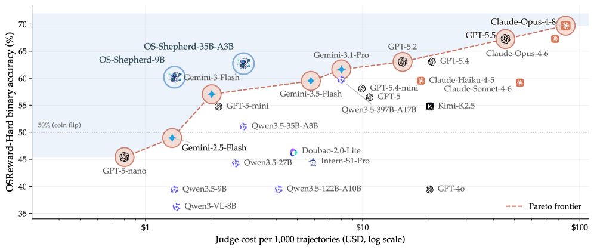
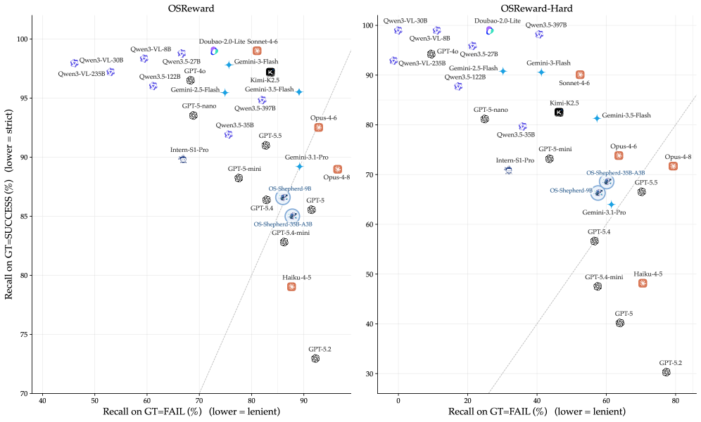
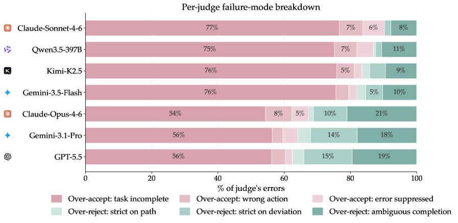
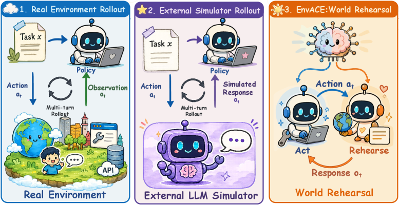

# HF Daily Papers 摘要 · 08/05–08/07（当日二次抓取 / W32 第二份）

- **Date:** 2026-08-07（同日第二次抓取，`b` 后缀；承接今早的 [[2026-08-07-hf-daily-papers-aug04-07]]）
- **Tags:** hf-daily-papers, digest, LLM-as-judge, reward-model, 世界模型, agentic-RL, computer-use, 评测有效性
- **覆盖窗口:** 2026-08-05 → 2026-08-07（**08-07 桶从上午的 10 篇涨到 20 篇**）
- **体量:** 窗口内 92 篇唯一 / 对照最近 8 份 digest（含今早那份）累计 **214 个 arXiv id** 去重后 **新增 47 篇**
- **为什么再开一份:** 上午跑的时候 08-07 桶只有 10 篇；HF 日期桶会持续回填，本份专收前 8 份未覆盖的条目。**因窗口总量与 upvote 都偏低（最高 39▲ vs 上午的 156▲），本份不取 Top 25 而是全量列出重点 + 2 篇 deep dive。**

## Context：这是一份「补录窗口」，但撞上了一个极对题的发现

本份的 upvote 分布明显低于上午那份（最高 39▲），是典型的桶回填特征。**但其中一篇（OSReward，38▲）恰好是我今天刚写完的 [[topics/agent/2026-08-07-agent-quality-evaluation]] 那份评估总结的直接延续，而且给出了我在那份里最想要却没有的东西：LLM-as-judge 到底有多不可靠的系统性测量。**

主题分布（47 篇新增）：

| 聚类 | 篇数 | 代表 |
|---|:---:|---|
| **评测 / 基准 / reward model** | **11** | OSReward、CAPEval、GST-Bench、ExplainBench、NOLLI、AVE-Compass、SIGNPOST-Bench |
| **3D / 视频生成** | 13 | WorldClaw、UniWorld-Design、UniWorld-View、ContextMaster、EffectLearner |
| **效率 / 压缩** | 7 | OmniPack、RestoreKV、PaDoc、Lossless Tensor Compression |
| **VLA / 具身** | 6 | Ego2Robot、DyPES-VLA、World-to-Wrist、BridgeVLA++、Push-Wiper |
| **世界模型** | 5 | EnvACE、Economic World Models、MASS |
| **agentic RL** | 3 | EnvACE、ReflectRL、OSReward |

## 论文总览（新增 47 篇，按 upvotes 降序）

| # | 论文 | ▲ | 主题 |
|---:|---|---:|---|
| 1 | [WorldClaw: 大规模 agentic 3D 开放世界生成](https://huggingface.co/papers/2608.05248) | 39 | 3D 生成 |
| 2 | [OSReward: 跨平台 computer-use reward model 的标准化评测](https://huggingface.co/papers/2607.28609) | **38** | ⭐ **deep dive** |
| 3 | [EnvACE: 用 world rehearsal 内化环境动态做 agentic RL](https://huggingface.co/papers/2608.06197) | **26** | ⭐ **deep dive** |
| 4 | [OmniPack: 全模态 LLM 的统一 token 压缩](https://huggingface.co/papers/2608.03812) | 25 | 效率 |
| 5 | [Learning from Failures: 用难负例做检索中心的 CoT](https://huggingface.co/papers/2608.06060) | 25 | 多模态检索 |
| 6 | [ChronoVision: 用隐状态重建做时序推理](https://huggingface.co/papers/2608.05631) | 24 | 多模态推理 |
| 7 | [CAPEval: 解耦理解与生成的 caption 评测](https://huggingface.co/papers/2608.02589) | 22 | 评测 |
| 8 | [Ego2Robot: 从第一人称人类数据合成机器人数据](https://huggingface.co/papers/2608.02580) | 22 | 具身 |
| 9 | [From Economic Agents to Agentic Economies：经济世界模型的系统蓝图](https://huggingface.co/papers/2608.06020) | 22 | 世界模型 |
| 10 | [NOLLI: 难度校准的英韩性能差诊断谜题基准](https://huggingface.co/papers/2608.04397) | 20 | 评测 |
| 11 | [GST-Bench: VLM 能否从视频建立全局空间意识](https://huggingface.co/papers/2608.05747) | 20 | 评测 |
| 12 | [UniWorld-Design: 从像素生成到 layer-native 设计](https://huggingface.co/papers/2608.03971) | 19 | 生成 |
| 13 | [K-EXAONE 2.0 Technical Report](https://huggingface.co/papers/2608.04505) | 16 | 模型发布 |
| 14 | [AVE-Compass: 音视频编辑能力的整体评测](https://huggingface.co/papers/2607.24821) | 15 | 评测 |
| 15 | [Decoding Children's Gait Behavior](https://huggingface.co/papers/2608.00371) | 14 | 应用 |
| 16 | [DyPES-VLA: 共享动力学先验 + 具身特定控制](https://huggingface.co/papers/2608.06374) | 14 | VLA |
| 17 | [World-to-Wrist: 任务条件的未来腕部建模](https://huggingface.co/papers/2608.05369) | 14 | VLA |
| 18 | [ExplainBench: 评测 agent 的代码解释](https://huggingface.co/papers/2607.26451) | 12 | 评测 |
| 19 | [RestoreKV: 激进 KV cache 淘汰下恢复全 cache 行为](https://huggingface.co/papers/2608.01247) | 10 | 效率 |
| 20 | [Lossless Tensor Compression as Program Synthesis](https://huggingface.co/papers/2608.02162) | 9 | 效率 |
| 21 | [PaDoc: 文档解析的 layout-grounded 并行解码](https://huggingface.co/papers/2608.06146) | 8 | 文档 |
| 22 | [SmartMage: 3D 场景理解的动态模态编排](https://huggingface.co/papers/2608.05137) | 8 | 3D |
| 23 | [BridgeVLA++: 数据高效、记忆增强的 VLA](https://huggingface.co/papers/2608.05042) | 7 | VLA |
| 24 | [PosterMELD: 多 agent 论文转海报](https://huggingface.co/papers/2608.02218) | 6 | 应用 |
| 25 | [Push-Wiper: 通用机器人清洁](https://huggingface.co/papers/2608.00730) | 6 | 具身 |
| 26 | [Consistency-Driven Co-Evolution 自监督跨表示学习](https://huggingface.co/papers/2608.04926) | 6 | 表示学习 |
| 27 | [UniWorld-View: 视频扩散做大基线视图合成](https://huggingface.co/papers/2608.04701) | 6 | 3D |
| 28 | [When Attention Goes Blind: **ALiBi 位置编码的数值失效**](https://huggingface.co/papers/2608.03994) | 5 | ⚠️ 架构缺陷 |
| 29 | [ARCHead: LLM 输出头的激活度量残差校正](https://huggingface.co/papers/2608.02703) | 5 | 架构 |
| 30 | [TriGlue: 生成分子胶诱导的三元复合物](https://huggingface.co/papers/2607.22143) | 5 | AI4Science |
| 31 | [LegalPincite: 多层级法律信息检索数据集](https://huggingface.co/papers/2608.03756) | 3 | 检索 |
| 32 | [ReflectRL: 从「黄金负轨迹」学反思到直接推理](https://huggingface.co/papers/2608.03972) | 3 | agentic RL |
| 33 | [ChronoLens: 跨时间/语言/语言层级测量语言变迁](https://huggingface.co/papers/2608.03507) | 3 | NLP |
| 34 | [Multi-Task Multi-Frame Visual Piano Transcription](https://huggingface.co/papers/2608.03419) | 3 | 多模态 |
| 35 | [Structured All-Mask Prediction for MLLM-Based Segmentation](https://huggingface.co/papers/2608.02791) | 3 | 分割 |
| 36 | [DRIFT: 用对抗补丁使 flow-matching VLA 去噪轨迹脱轨](https://huggingface.co/papers/2608.03207) | 3 | ⚠️ VLA 安全 |
| 37 | [EffectLearner: 视频物体移除的世界感知效应推理](https://huggingface.co/papers/2608.05565) | 3 | 视频编辑 |
| 38 | [ContextMaster: 固定预算稀疏上下文的多镜头视频创作](https://huggingface.co/papers/2608.04956) | 3 | 视频 |
| 39 | [When Many Answers Are Valid, Voting Fails：Best-of-K 因果推理的符号验证](https://huggingface.co/papers/2608.03506) | 2 | ⭐ 验证 |
| 40 | [Search, Inspect, Fetch: 用布尔检索做深度研究 agent](https://huggingface.co/papers/2608.02751) | 2 | agent |
| 41 | [SIGNPOST-Bench: 图文冲突消解基准](https://huggingface.co/papers/2608.04244) | 2 | 评测 |
| 42 | [MASS: 带权威共享状态的多人世界模型](https://huggingface.co/papers/2608.06257) | 2 | 世界模型 |
| 43 | [Teaching Nemotron Greek](https://huggingface.co/papers/2608.05138) | 2 | 多语言 |
| 44 | [Invisible Shortcuts: **视觉编码器为何知道你的相机**](https://huggingface.co/papers/2608.05424) | 2 | ⚠️ 捷径学习 |
| 45 | [CURV: 课程式视觉接地推理增强图表理解](https://huggingface.co/papers/2608.02833) | 1 | 多模态 |
| 46 | [Helping Music Co-Creation Agents 'Listen' Well](https://huggingface.co/papers/2608.04378) | 1 | 音乐 agent |
| 47 | [Resume Means Resume: checkpoint/中断/恢复的机器可检查一致性契约](https://huggingface.co/papers/2608.03836) | 1 | ⭐ 系统 |

---

## Deep Dive 1：OSReward —— 「用 VLM 当裁判」到底有多不可靠

- **论文:** [OSReward: Instituting Standardized Evaluation for Cross-Platform Computer-Use Reward Models](https://arxiv.org/abs/2607.28609)（arXiv:2607.28609，38▲）
- **机构:** 香港大学 + 西安交大 + 南京大学 + 复旦 + 中科大 + NUS 等（第一作者 Kanzhi Cheng，通讯含 Lingpeng Kong）
- **为什么选它:** 我今天上午刚写完 [[topics/agent/2026-08-07-agent-quality-evaluation]]，其中 §2.2 记录了业界对 LLM-as-judge 的告诫是「需要对照人类校准」。**这篇把「不校准会怎样」量化了 —— 而结果比我预期的严重得多。**

### 问题：整个 pipeline 都在消费一个未经检验的信号

computer-using agent（CUA）的**评测、数据筛选、强化学习**三件事都需要判断「这条轨迹是否完成了任务」。而：
- **人写的 verifier** 只覆盖少数精选任务，且**对已收集的静态轨迹完全不适用**（没有活环境可查）
- **人工标注**跟不上规模

所以领域「fast becoming the de-facto practice」的做法是**让 VLM 当裁判**。但论文指出一件事：**这个裁判本身可靠不可靠，几乎从未被测过。**

> ⭐ 论文对判断难度的界定很精准：判 CUA 轨迹意味着读一段长的、交织的状态-动作-推理记录，然后决定「**环境是否真的达到了指示的目标，而不是 agent 是否声称如此**」。
>
> **注意这句话与今早 LongHorizon-Harness 的「executor 声明不能直接改状态」是同一条原则** —— 只不过一个用在 harness 架构里，一个用在 reward model 上。

**pilot study 的预警**：即使最好的 VLM 裁判，**在桌面场景与现有基准自带的 verifier 有大约四分之一的判定不一致**。

### 方法：为了测裁判，从零建数据

关键设计决策：**不能复用现有 agent 基准的轨迹** —— 那会把裁判的错误与运行本身的缺陷混在一起，导致失败无法归因。

于是他们自建跨平台基础设施（**web / mobile / Ubuntu / Windows 四平台**）：
- **不用 stock 镜像**：Windows 装二十来个日常应用（IDE、媒体编辑、3D、数据库工具，部分已登录账号，含 ffmpeg 等 CLI）；Ubuntu 约三十个应用 + 二十来种类型各数百个真实文件；mobile 在 Android 模拟器里初始化每个应用的文件/使用记录/数据库，**并加入干扰内容**（噪声事件、诱饵消息、形似文件）
- **web 用真实网站**（快照无法复现真实性）
- 目的很明确：「**realistic state to fail from, success that must change the environment rather than narrate completion**」

**标注流程（成本值得记）:**
- 约 1500 条候选指令 → 约 800 条进入下一阶段（**作者之外的标注者做同行交叉筛查**，剔除歧义/不接地/无法回答的）
- 四个模型家族（Claude / Gemini / Kimi / Qwen）的 agent 各跑，**能力差异自然产生真实成功与真实失败**
- 自动预筛掉采集问题（反爬封锁、网络故障、卡死）—— 「so a fail in the benchmark reflects the agent failing the task, not the environment failing the agent」
- **每条轨迹三人独立标注**；不一致的升级到**两位资深评审共同 meta-review（是审议而非多数票）**
- ⭐ **一条刻意严格的标准：agent 没有通过环境获得或验证的答案，即使恰好正确也判失败**
- **总计约 800 人工小时**

**产出 1019 条 human-gold 轨迹**（最长 100 步），三个视图：
- **全集**（覆盖广度）
- **OSReward-Hard**（标注者自己产生分歧的困难样本，30/70 成功/失败）
- **OSReward-Multi**（在二元判定上叠加 alignment 与 efficiency 的三档细粒度标签）

### 结果：27 个模型，一个共同的失效签名

**① 全集 ~90% 是虚假的安慰**

| | 全集 | OSReward-Hard |
|---|---:|---:|
| 最好的裁判 | ~90% | **69.7%** |
| 平均裁判 | — | **52%** |
| 每个裁判的跌幅 | — | **20–43 个百分点** |

> ⭐⭐ **最扎心的一句**：Hard 集上最好的裁判掉到 **69.7%**，而这个分数「**level with what a constant always-fail judge scores on this 30/70 split**」—— **和一个"永远输出失败"的常量裁判打平。**
>
> 论文的结论：「**Raw accuracy is therefore a trap here**」。

**② 所有裁判共享同一个偏见方向：过度宽松**

在（失败召回 fRec，成功召回 sRec）平面上出现两簇：
- **一个大的 lenient 簇**：sRec 高但 fRec 低 —— **几乎接受一切，包括失败**（如 Qwen3-VL-30B、Intern-S1-Pro 在 Hard 集上「接受几乎每一个困难失败」）
- **一个小的 strict 簇**（GPT-5.2、Claude-Haiku）：牺牲成功召回换取抓住更多失败
- **只有 Claude-Opus-4-8 与 GPT-5.5 在对角线附近保持平衡** —— 但在 Hard 集上也只有**两侧各约 70% 召回**

**③ 主导错误模式：over-accept（三分之二的错误）**

- **「过度接受一个未完成的任务」占全部错误的三分之二**
- **这是每一个裁判的首要错误模式，占其错误不少于 48%**
- 汇总看，**over-accept 比 over-reject 多三倍**（最强的裁判收窄到约两倍）

**④ 机制：裁判在读 agent 的自述，而不是看屏幕**

这是最有解释力的一组消融：

| 消融 | 对准确率的影响 | 翻转的判定比例 |
|---|---|---|
| 把末尾 5 张截图换成 3 张 / 首张+末2张 | **< 0.5 个百分点** | 5–7% |
| 去掉红色点击标记 | **完全无损** | — |
| 末尾截图数从 1 扫到 16 | 各裁判游走 2–3 点、**无趋势**（N=5–9 附近最佳） | — |
| ⭐ **去掉每步的 thought 与 action 文本** | **平均 −7.2 个百分点**（web 上数倍于此） | **22.7%** |

> ⭐ **结论**：视觉输入的那些「写 prompt 时看起来很重要」的设置几乎不影响总体准确率，而**去掉文本历史的代价是它的十几倍**。
>
> 也就是说：**裁判主要在读 agent 自己讲的故事** —— 所以「一个以成功声明收尾的失败运行」正是它必然会漏掉的东西。

⚠️ **一个只在 reward labeling 场景才致命的细节**：那些「总体上无害」的视觉设置各自仍会**翻转 5–7% 的单条判定**。「Such flips average out in evaluation, but not in reward labeling, where each trajectory's label is consumed on its own.」—— **做评测时会被平均掉，做 RL 标注时不会。**

**⑤ 换个方式跑裁判也修不好**（§5.3 标题即结论：「Running the Judge Differently Does Not Fix It」）。论文认为**显式提示裁判去验证完成情况，可能比他们评估的 ensembling 更有用**，但把这留给了未来工作。

### 他们的解法：开源低成本 reward model

用同一套基础设施扩大采集，从 **30 万+ 判定实例**筛出 **OS-Shepherd-100K**（带推理标注的轨迹判定语料，**不需要新的人工标注** —— 每个标注选择都由裁判研究的一项发现决定），训出 **OS-Shepherd-9B / 35B-A3B**，两阶段配方：先建准确判断，**再直接针对 false success 这个最尖锐的失效**。

| 模型 | 全集 balanced acc | Hard 集 balanced acc |
|---|---:|---:|
| OS-Shepherd-9B | 86.3 | 61.9 |
| OS-Shepherd-35B-A3B | 85.6 | **64.3** |

**成本对照（这组数字最有实践价值）** —— 一轮不大的在线 RL（200 次更新 × batch 16 × 16 rollouts = **51,200 次裁判调用**）：

| 裁判 | 成本 |
|---|---:|
| Claude-Opus-4-8 | **约 $4,000** |
| GPT-5.5 | 约 $2,300 |
| **OS-Shepherd-9B** | **约 $68** |

**即 30–60× 的下降**；而且因为它开源可自托管，「even that $68 is only an API-equivalent figure: in practice the marginal cost is the lab's own GPU time」。

⚠️ **论文自陈的一处不利结果**：**35B 相比 9B「Scale Adds Little」** —— 四倍参数只换来 Hard 集 **2.4 个百分点**的 balanced accuracy，全集持平。「**what transfers is the recipe**」。

### 我的看法

1. ⭐⭐ **这篇给了我今早那份评估总结里最缺的一块。** 我在 [[topics/agent/2026-08-07-agent-quality-evaluation]] §2.2 引了业界的告诫「LLM judge 需要对照人类校准」，但那是规范性建议。**这篇是实测：不校准的话，你的裁判在困难样本上和一个常量输出打平，而且三分之二的错误都朝同一个方向。** 任何用 LLM-as-judge 的团队都应该先看第 ③ 条。

2. ⭐ **「裁判在读自述而非看屏幕」与今天另外两条发现构成三重共振。** 把三者并排看非常清楚：

   | 来源 | 发现 |
   |---|---|
   | **OSReward（本篇）** | 裁判的判定主要依赖 agent 的文本自述；去掉它 −7.2pp 且翻转 22.7% 判定 |
   | **LongHorizon-Harness**（今早 digest） | 架构上禁止 executor 的声明直接改状态，只认独立审计证据 |
   | **Why do models task game?**（[[tech-blogs/2026-W32d]]） | 严重误导性输出时 CoT 里没有可监控的预谋 |

   **三条独立工作，一个共同结论：agent 的自我叙述是评估链条上最不该被信任、却最常被信任的一环。** 而 OSReward 量化了这种信任的代价。

3. **「30/70 分割上 69.7% 等于常量裁判」这个对照该成为标准做法。** 很多 judge 论文报 accuracy 而不报**与常量基线的对照**。这与 [[topics/agent/2026-08-07-agent-quality-evaluation]] §4 里 Kapoor 等人「要和 retry/warming 这类愚蠢基线比」是同一种方法论洁癖 —— **不与平凡基线对照的分数没有信息量。**

4. **成本那条把「可靠 vs 可负担」的两难讲清楚了。** 之前的状态是：可靠的裁判（Opus / GPT-5.5）贵到无法在训练规模上用，便宜的开源裁判差得远 —— **「leaving no judge both reliable and affordable」**。$4,000 vs $68 这个对照，加上「35B 相比 9B 几乎无增益、可迁移的是配方」，指向一个乐观结论：**这个问题主要靠数据与训练配方解决，不靠规模。**

5. ⚠️ **我的保留:**
   - **1019 条轨迹**在统计上不算大，尤其 Hard 集又是其子集；论文用三人标注 + meta-review 换质量，但 Hard 集的绝对量级需要看附录
   - 那条**「没通过环境验证的答案即使正确也判失败」**的严格标准，在方法上自洽（判的是过程可信度），但它**内置了一种价值判断** —— 现实中有些场景可能更在意结果对不对
   - **OSReward-Multi 的 alignment/efficiency 三档标签**，论文说所有模型（含自己的）在这两个质量轴上都表现薄弱，**这部分基本还是空白**

---

## Deep Dive 2：EnvACE —— 让策略自己扮演环境（world rehearsal）

- **论文:** [EnvACE: Internalizing Environment Dynamics via World Rehearsal for Agentic Reinforcement Learning](https://arxiv.org/abs/2608.06197)（arXiv:2608.06197，26▲）
- **代码:** https://github.com/Within-yao/EnvACE
- **机构:** 腾讯 + 上海交大（通讯 asheryswang@tencent.com / wwliu@sjtu.edu.cn）

### 问题：agentic RL 的环境成本

训长程工具使用的 agent，目前两条路都有硬伤：
- **真实/合成的可执行环境**：构建与验证都贵，且**复杂度上升后正确性越来越难验证**
- **LLM 模拟器**：便宜灵活，但响应可能不准或不一致，**而且要 grounding 仍然需要真实环境的监督**

> 论文的诊断：**两种做法都把环境建模留在了 acting policy 之外** —— 策略学的是「在外部提供的响应上行动」。

### 方法：world rehearsal（世界预演）

**核心机制：同一个策略 π_θ 承担两个角色，交替进行**

1. **acting 角色**产生动作：$a_t \sim \pi_\theta(\cdot \mid h_t, \textsc{Act})$
2. **rehearsal 角色**产生「这个动作会引发的环境响应」：$\hat o_t \sim \pi_\theta(\cdot \mid h_t, a_t, \textsc{Rehearse})$
3. 把它接回历史：$h_{t+1} = h_t \oplus (a_t, \hat o_t)$，acting 角色据此做下一步决策

> ⭐ **于是一条轨迹不再是与外部环境的对话，而是策略自己展开的过程。** 通过反复预演，「动作 → 环境响应」的关系被吸收进 θ 本身，形成一个**支持决策的 agent world model**。

**Role-Wise GRPO** —— 两个角色**各自算 reward baseline**，但联合更新同一策略：

$$\mu_{x,r}=\frac{1}{|\mathcal{G}_{x,r}|}\sum_{y_{j,n}\in\mathcal{G}_{x,r}} R_j,\qquad A_{i,m}=R_i-\mu_{x,r_{i,m}}$$

即：同一轨迹内的所有输出**继承同一个轨迹级 reward**，但**优势是相对于同角色的其他输出**算的。奖励来源可以是可验证的结果评估器，或 checklist 式 LLM judge。

**测试时用法（Test-Time Scaling）**：策略先做**私下预演**（并行或串行），把结果总结成 **rehearsal memory**，再用它引导一次**在真实环境中的committed execution**。

### 结果

**训练配置:** Qwen3-8B，CM2 数据集，470 步，lr 1e-6，batch 16，每 prompt 4 rollouts，KL 系数 1e-4，最长 30 轮交互，**训练时用 Qwen3-30B-A3B 当 LLM judge**，16 张 H20，verl 框架，非 TTS 实验报 Avg@4。

**主表（Overall = BFCL-v4 / τ²-Bench / VitaBench 三者均值）:**

| 方法 | BFCL V4 Avg | τ²-Bench Avg | VitaBench Avg | **Overall** |
|---|---:|---:|---:|---:|
| Qwen3-8B（基座） | 44.04 | 30.0 | 11.4 | 28.48 |
| Simulator-8B | 19.78 | **38.5** | 1.8 | 20.03 |
| TOUCAN-7B | 35.33 | 22.4 | 2.8 | 20.18 |
| EnvScaler-8B | **47.07** | 32.9 | 15.8 | 31.92 |
| AWM-8B | 44.29 | 31.2 | 10.2 | 28.56 |
| AWM-14B | 47.32 | 30.7 | **19.6** | 32.54 |
| ScaleEnv-8B | — | **38.5** | 15.0 | — |
| **EnvACE-8B** | 46.04 | 36.7 | 16.0 | **32.91** |
| EnvACE-1.7B | 31.81 | 15.3 | 3.2 | 16.77 |

**读表要点（要诚实）:**
- **Overall 上 EnvACE-8B 最高（32.91）**，但优势很薄：比 EnvScaler-8B **+0.99**、比 **AWM-14B 仅 +0.37**（而 AWM-14B 参数几乎是它两倍）
- **分项上它并不领先**：BFCL V4 上 EnvScaler-8B（47.07）与 AWM-14B（47.32）都更高；τ²-Bench 上 ScaleEnv-8B 与 Simulator-8B 都是 38.5 > 36.7；VitaBench 上 AWM-14B 19.6 > 16.0
- **真正的卖点不是分数而是「不需要外部环境」** —— 它在训练期完全不查询真实环境，却打平/略超那些依赖昂贵环境合成的方法

另有 FinMCP-Bench（MCP 真实工具的金融 agent）用 TR/TP/TF1 三指标评估，以及跨模型规模（1.7B/4B/8B）的受控研究显示 world rehearsal 一致地改善策略学习。

### 我的看法

1. **卖点是「去掉一个依赖」，不是刷分。** 这与我上周读的 PDD（见 [[2026-07-30-paper-parallel-decoding-distillation]]）审美一致 —— **换掉复杂度而非追求最高分**。EnvACE 的价值在于：如果环境合成是 agentic RL 最贵的一环，那么「训练期完全不用外部环境、还能打平」是一个很强的工程论断。**但 +0.37 相对 AWM-14B 的差距实在太薄，说这话需要更多种子与更多基准。**

2. ⚠️ **一个我认为论文没有正面回答的隐忧：自我预演的环境响应，凭什么是对的？** 这正是它批评 LLM 模拟器的那条理由（「responses may be inaccurate or inconsistent, and grounding them still requires supervision from real environments」）。EnvACE 的答案隐含在「用任务成功奖励端到端联合优化两个角色」里 —— **即预演的正确性由最终任务奖励间接约束**。但这条链路很长：**如果预演系统性地乐观（比如总预演出「工具调用成功」），策略会不会学到一个自洽但脱离现实的世界？** 论文的 test-time 设计（预演后仍要在真实环境 committed execution）恰好承认了这个风险，但训练期没有对应的 grounding 检查。

3. ⭐ **它和本份 deep dive 1 撞出一个尖锐的张力。** EnvACE 训练时**用 Qwen3-30B-A3B 当 LLM judge** 提供奖励。而 OSReward 的发现是：**这个量级的开源裁判正落在「lenient 簇」里 —— 在困难失败上几乎全盘接受。** 两篇论文放在一起读，得到一个不太舒服的推论：
   > **一个「自己预演环境 + 由偏宽松的裁判打分」的训练回路，缺少任何一处对现实的硬约束。**
   
   我不是说 EnvACE 的结果无效（它在真实基准上评测），而是说**这条技术路线的可靠性上限取决于奖励信号的可靠性**，而 OSReward 刚刚证明那个信号目前很脆。**OSReward 的开源 OS-Shepherd 恰好是这条路线需要的东西** —— 这两篇同日出现，是本份最有意思的一处巧合。

4. **Role-wise baseline 是个干净的小设计。** 同轨迹共享 reward、但优势相对同角色群体算 —— 避免了 acting 与 rehearsal 两类输出的 reward 分布差异互相污染。这与本仓库记录的 TRIAGE（role-typed credit）思路同源。

---

## 其他值得关注

**评测/基准（本份第二大聚类，11 篇）**
- [**CAPEval**](https://huggingface.co/papers/2608.02589)（22▲）—— **把 caption 评测在「理解」与「生成」两侧解耦**。与 OSReward 的「解耦裁判错误与运行缺陷」是同一种方法论直觉。
- [**GST-Bench**](https://huggingface.co/papers/2608.05747)（20▲）—— 「VLM 能否从视频建立**全局**空间意识」，延续今早 digest 里世界模型从表观走向内在的主线。
- [**ExplainBench**](https://huggingface.co/papers/2607.26451)（12▲）—— 评测 agent 的**代码解释**质量。这类「评测解释而非产物」的基准很少见。
- [**NOLLI**](https://huggingface.co/papers/2608.04397)（20▲）—— **难度校准**的谜题基准，用于诊断英韩性能差。难度校准是对抗饱和的一条路。
- [**AVE-Compass**](https://huggingface.co/papers/2607.24821)（15▲）、[**SIGNPOST-Bench**](https://huggingface.co/papers/2608.04244)（2▲，图文冲突消解）。

**⚠️ 三篇"揭露隐藏缺陷"的论文（本份我最想标记的一组）**
- [**When Attention Goes Blind: Numerical Failure in ALiBi Positional Encodings**](https://huggingface.co/papers/2608.03994)（5▲）—— **ALiBi 的数值失效**。upvote 极低但如果成立，影响一批仍在用 ALiBi 的模型。
- [**Invisible Shortcuts: Why Vision Encoders Know Your Camera**](https://huggingface.co/papers/2608.05424)（2▲）—— **视觉编码器能识别出拍摄相机** = 一条不可见的捷径。**这类"模型学到了你不想让它学的东西"正是评测有效性的底层威胁。**
- [**DRIFT**](https://huggingface.co/papers/2608.03207)（3▲）—— 用对抗补丁让 flow-matching VLA 的去噪轨迹脱轨。**具身模型的对抗攻击面。**

**验证与一致性**
- ⭐ [**When Many Answers Are Valid, Voting Fails: Symbolic Verification for Best-of-K Causal Reasoning**](https://huggingface.co/papers/2608.03506)（2▲）—— **当多个答案都合法时投票失效，改用符号验证**。这与 OSReward 的「ensembling 修不好裁判」以及今早 digest 的「自我验证成独立研究对象」是同一条线上的三个点。
- ⭐ [**Resume Means Resume: A Machine-Checked Conformance Contract for Checkpoint, Interrupt, and Resume**](https://huggingface.co/papers/2608.03836)（1▲）—— **给"恢复"这件事一个机器可检查的一致性契约**。放在今早 LongHorizon-Harness「跨轮状态怎么可信地传递」的语境里看，这是系统侧的严格化尝试。

**世界模型的两个新方向**
- [**From Economic Agents to Agentic Economies**](https://huggingface.co/papers/2608.06020)（22▲）—— **经济世界模型的系统蓝图**，把世界模型推向经济系统层面。
- [**MASS: Multiplayer World Models with Authoritative Shared State**](https://huggingface.co/papers/2608.06257)（2▲）—— **多人世界模型的"权威共享状态"**。⭐ 注意这个词：`authoritative` 与我在 [[2026-08-04-blog-openai-gpt-live]] 里记的 GPT-Live 的 speculative/authoritative 双视图撞了同一个概念 —— **多方参与时，"哪个状态是权威的"成为必须显式设计的东西。**

**效率**
- [**OmniPack**](https://huggingface.co/papers/2608.03812)（25▲，**training-free** 的全模态 token 压缩，指出 pre-LLM 压缩会丢弃全局分布的结构性证据、inner-LLM 压缩又未充分利用 query 条件的音视频协同）、[**RestoreKV**](https://huggingface.co/papers/2608.01247)（10▲，激进 KV 淘汰下恢复全 cache 行为）、[**PaDoc**](https://huggingface.co/papers/2608.06146)（8▲）、[**Lossless Tensor Compression as Program Synthesis**](https://huggingface.co/papers/2608.02162)（9▲，把无损张量压缩当程序合成 —— 角度很别致）。

**具身/VLA**
- [**Ego2Robot**](https://huggingface.co/papers/2608.02580)（22▲，第一人称人类数据→机器人数据合成）、[**DyPES-VLA**](https://huggingface.co/papers/2608.06374)（共享动力学先验 + 具身特定控制的跨具身方案）、[**World-to-Wrist**](https://huggingface.co/papers/2608.05369)（任务条件的未来腕部建模）、[**BridgeVLA++**](https://huggingface.co/papers/2608.05042)（记忆增强）。

**模型发布**
- [**K-EXAONE 2.0 Technical Report**](https://huggingface.co/papers/2608.04505)（16▲，LG 的韩语模型）—— 与 NOLLI 的英韩性能差诊断同期出现。

## 趋势分析

### 1. ⭐⭐ 「评估者本身需要被评估」正式成为一个研究层次

这是本份最重要的观察。把今天两份 digest 加上 tech-blogs 放在一起，出现了一个**完整的四层结构**：

| 层次 | 代表工作 | 结论 |
|---|---|---|
| **agent 自评** | Why do models task game?（[[tech-blogs/2026-W32d]]） | 会自我欺骗、会伪造日志，**CoT 里无预谋可查** |
| **harness 层的核实** | LongHorizon-Harness（[[2026-08-07-hf-daily-papers-aug04-07]]） | 架构上禁止自评进入状态，只认独立审计 |
| **裁判层（本份）** | **OSReward** | 裁判自己**三分之二的错误是过度接受**，且主要在读 agent 自述而非看屏幕；Hard 集上最好的裁判 = 常量裁判 |
| **裁判的裁判** | OSReward-Hard 的人工 gold（三人标注 + meta-review，800 人工小时） | 目前只能靠昂贵的人工 |

**这个结构的含义是：每一层的可信度都依赖上一层，而链条尽头仍然是人工标注。** 我今早在 [[topics/agent/2026-08-07-agent-quality-evaluation]] 里写「人类判断用于校准 judge」，OSReward 给出了那句话的价格标签：**800 人工小时换 1019 条 gold 轨迹。**

### 2. 「不与平凡基线对照的分数没有信息量」在本份出现了教科书级例子

OSReward 的「**69.7% 等于常量 always-fail 裁判**」是我见过最干净的一个演示。这与 [[topics/agent/2026-08-07-agent-quality-evaluation]] §4 记的 Kapoor 等人「SOTA agent 打不过 retry/warming」是同一种揭穿方式 —— **在两个完全不同的领域（agent 能力 / judge 可靠性），同一种方法论洁癖都产生了颠覆性结论。**

### 3. agentic RL 正在把「环境」逐步内化，但奖励可靠性没有同步跟上

EnvACE 的方向（把环境响应吸收进策略参数）是清晰的成本逻辑：环境合成太贵，那就不要环境。**但本份的两篇 deep dive 合起来暴露了一个结构性风险** —— EnvACE 用 Qwen3-30B-A3B 当训练裁判，而 OSReward 测出这个量级的开源裁判正落在「几乎接受一切失败」的 lenient 簇里。

**「自己预演环境 + 偏宽松的裁判打分」= 训练回路里缺少对现实的硬约束。** 我不认为这否定了 EnvACE 的结果（它在真实基准上评测），但**这条路线的上限取决于奖励信号质量**，而 OS-Shepherd 恰好是它需要的东西。两篇同日出现颇具讽刺意味。

### 4. 三篇低 upvote 的「隐藏缺陷」论文值得逆势关注

ALiBi 数值失效（5▲）、视觉编码器识别相机的不可见捷径（2▲）、VLA 对抗补丁（3▲）—— **upvote 与重要性在这类工作上是脱钩的**，因为它们不提供新能力、只揭露既有系统的问题。「视觉编码器知道你的相机」尤其值得记：**这是一条评测层面几乎不可能察觉的捷径。**

## Open Questions

- **OSReward 提出「显式提示裁判去验证完成情况可能比 ensembling 更有用」，但留给了未来工作。** 这个改动看起来极便宜，为什么没做？是效果不稳还是时间不够？
- **裁判偏宽松，是训练目标的产物吗？** RLHF 倾向于奖励「有帮助」，而判定失败是一种不讨好的输出。如果是这样，**偏宽松就不是能力缺陷而是对齐后果** —— 那么用同一套后训练配方做出的裁判会不会系统性地无法修复？
- **EnvACE 的预演质量如何被 ground？** 训练期完全不接触真实环境，仅靠任务成功奖励间接约束。**系统性乐观的预演会不会训出自洽但脱离现实的世界模型？**
- **OS-Shepherd 能否直接接进 EnvACE 这类训练回路**，替换掉偏宽松的通用开源裁判？两篇同日发布，这个组合实验看起来很自然。
- **「没通过环境验证的答案即使正确也判失败」** 这条严格标准适用于哪些场景？它判的是过程可信度，但有些应用可能更在意结果 —— **是否需要两套并行的判定标准？**
- OSReward-Multi 的 **alignment / efficiency 两个质量轴上所有模型（含 OS-Shepherd）都薄弱**。二元判定之外的细粒度质量评估，目前是否根本没有可用方案？
- **ALiBi 数值失效若成立，影响面有多大？** 需要独立复现。

## References

本份覆盖 **47 篇新增论文**（窗口内 92 篇唯一，对照最近 8 份 digest 累计 214 个 arXiv id 去重）。正文所有链接为真实 HF / arXiv 链接。

- **Deep dive 全文来源:** `huggingface.co/papers/2607.28609.md`（176482 字节）、`huggingface.co/papers/2608.06197.md`（71562 字节），均经完整精读；5 张配图取自 `arxiv.org/html/{id}v1/`（原始 PNG）
- **数据获取:** HF API `daily_papers?date=YYYY-MM-DD&limit=100&sort=publishedAt`，逐日 08-05 → 08-07
- ⚠️ **一处 API 边界:** 尝试拉 08-08 时 API 返回错误（`"date" must be less than or equal to "2026-08-06T00:00:00.000Z"`）而非空数组 —— **即该接口的日期上限滞后于当天**。此错误对象若被当成 list 处理会导致解析失败，已在脚本侧加 guard
- 引用须可验证：所有数字（Hard 集 69.7% / 平均 52% / 跌幅 20–43pp、over-accept 占三分之二且每个裁判不低于 48%、去文本历史 −7.2pp 且翻转 22.7%、$4,000 vs $68 的 30–60×、1019 条 gold / 800 人工小时、EnvACE Overall 32.91 等）均引自两篇论文正文。**不利于论文的结果亦如实列出** —— 包括 OS-Shepherd 的 35B 相比 9B「Scale Adds Little」（四倍参数仅 +2.4pp）、EnvACE 相对 AWM-14B 仅 +0.37 且分项均不领先
