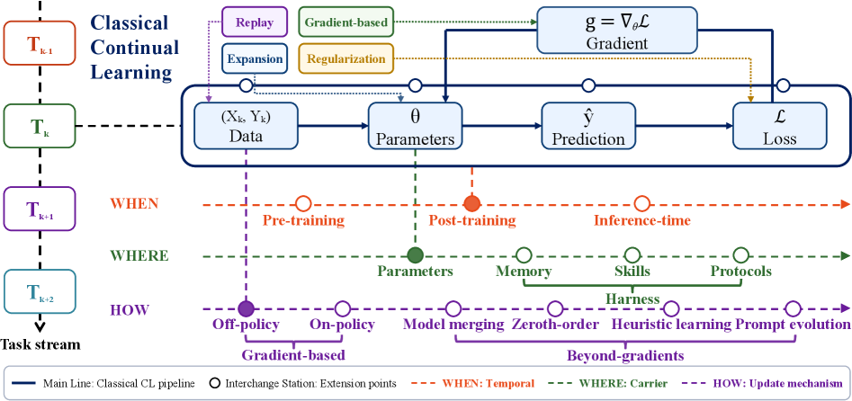
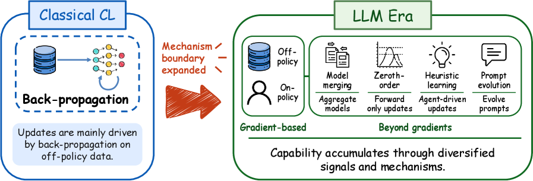
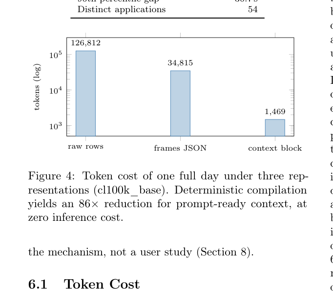

# HF Daily Papers 摘要 · 08/08–08/09（周末空档 + 08-07 桶回填）

- **Date:** 2026-08-09（周日）
- **Tags:** hf-daily-papers, digest, 周末空档, continual-learning, agent-memory, harness, 数据agent
- **覆盖窗口:** 2026-08-06 → 2026-08-09（承接 [[2026-08-07-hf-daily-papers-aug05-07b]]）
- **体量:** 窗口内 64 篇唯一 / 对照最近 8 份 digest 累计 **221 个 arXiv id** 去重后 **新增仅 10 篇**
- **⚠️ 周末空档已核实:** **08-08 与 08-09 两天 HF Daily Papers 均为 0 篇**（API 正常返回空数组，非抓取失败）。本份的 10 篇新增**全部来自 08-07 桶的持续回填** —— 该桶从首次抓取的 10 篇 → 二次的 20 篇 → 现在 **30 篇**。

## Context：一份小体量但有两篇硬货的补录

**这是典型的周末窗口:量极小(10 篇),upvote 也低(最高 59▲)。** 但其中两篇的分量与本周主线高度契合,值得完整深读:

| 特征 | 本份 | 对比：08-07 首份 |
|---|---|---|
| 新增篇数 | **10** | 141 |
| 最高 upvote | 59▲ | 156▲ |
| 主题集中度 | 分散（无聚类） | long-horizon 18 篇 + OPD 16 篇 |

⭐ **但本份撞上了一篇「把本周主线形式化」的综述** ——《Continual Learning in Transition》提出的三轴框架,恰好给我这一整周反复记录的「harness ⊕ model」提供了一个学术坐标系。**这是小窗口里的高价值发现。**

## 论文总览（新增 10 篇全列）

| # | 论文 | ▲ | 主题 |
|---:|---|---:|---|
| 1 | [Interpretable MEG Decoding of Perceived Speech](https://huggingface.co/papers/2608.01481) | 59 | 神经解码 |
| 2 | [DataSpace: 异构工作区上可验证分析的数据 agent 基准](https://huggingface.co/papers/2608.03451) | 26 | 数据 agent 评测 |
| 3 | [**Activity Frames: 确定性屏幕活动编译为 agent 记忆与重放**](https://huggingface.co/papers/2608.05784) | 18 | ⭐ **deep dive** |
| 4 | [KVAE: 多模态生成模型的 tokenizer 家族](https://huggingface.co/papers/2608.05798) | 15 | tokenizer |
| 5 | [MameLoshnLM: 意第绪语模型与评测基准](https://huggingface.co/papers/2608.05850) | 14 | 低资源语言 |
| 6 | [**Continual Learning in Transition**](https://huggingface.co/papers/2608.06216) | 14 | ⭐ **deep dive** |
| 7 | [Weights or Skills? 机器人学习技术综述](https://huggingface.co/papers/2608.01851) | 6 | 具身综述 |
| 8 | [FactorJEPA: 拥挤混乱的全球南方城市世界模型](https://huggingface.co/papers/2608.01049) | 6 | 世界模型 |
| 9 | [Task-Conditional Flow Matching 多语言嵌入适配](https://huggingface.co/papers/2608.05785) | 5 | 多语言嵌入 |
| 10 | [GaussianSelector: 3DGS 中轻量人工引导的物体选择](https://huggingface.co/papers/2608.01492) | 4 | 3DGS |

---

## Deep Dive 1：Continual Learning in Transition —— 给「harness ⊕ model」一个学术坐标系

- **论文:** [Continual Learning in Transition](https://arxiv.org/abs/2608.06216)（arXiv:2608.06216，14▲）
- **为什么选它:** upvote 只有 14,但**它把我这一整周反复记录的现象形式化了**。本周从 [[2026-08-07-hf-daily-papers-aug04-07]] 的 long-horizon/harness 18 篇聚类、到 [[weekly/2026-W32b]] Arc 3 的「agent 从函数变成有状态长期进程」,一直缺一个统一的框架来定位这些工作。**这篇给了。**

### 核心主张：从「参数中心」转向「系统级适应」

**经典持续学习(CL)的问题设定:** 数据以任务序列 𝒯₁,…,𝒯_K 到来,每个任务有自己的分布与损失;在步骤 k 更新参数 θ 时,历史数据不可访问或仅受限可用。中心障碍是**灾难性遗忘**,经典的两组权衡是**可塑性-稳定性**与**任务内/任务间泛化性**。

**论文指出:LLM 时代有三件事把 CL 的范围彻底改变了。**

| 变化 | 含义 |
|---|---|
| **on-policy learning** | 扩展了「更新机制」的空间 |
| **test-time training** | 把 CL 从训练阶段延伸到**推理阶段** |
| ⭐ **外部 harness 组件**（记忆、技能库、交互协议） | **把能力演化的边界推到静态参数空间之外** |

> 结论:「这些发展共同表明,**从参数中心的学习转向系统级的适应**。」

### 三轴框架（When / Where / How）

| 轴 | 问的问题 | 取值 |
|---|---|---|
| **When** | 能力演化发生在生命周期的哪个阶段 | pre-training / post-training / **inference-time** |
| **Where** | 能力存储与更新在哪里 | **内部参数** vs **外部结构约束** |
| **How** | 更新机制是什么 | off-policy / on-policy / **beyond-gradient** |

### ⭐ Where 轴：能力载体从参数扩展到 harness

论文对 harness 载体的性质描述很精准:

> 这些外部载体是**显式的、可编辑的、可检索的、可调用的**(explicit, editable, retrievable, callable),使持续学习**不只通过权重更新**,还能通过**可累积可修订的持久非参数对象**来运作。

**参数侧的变化则是「粒度」** —— 全参微调在规模下成本高且易干扰,所以转向参数高效模块(LoRA 系,如 O-LoRA 用正交约束减少任务间覆写)。

### ⭐⭐ §4.2 是全文最锋利的一节：「harness 层的累积还不够」

论文提了一个我觉得非常值得记的问题:**现在做在 harness 上的工程进展,是否已经在某种程度上算是持续学习?**

它列举的例子很日常:**编码助手里的规则文件、agent 框架里 system prompt 的演化、工具库的稳步增长** —— 这些都不来自学术意义上的学习算法,而来自迭代的工程实践。

**论文的立场(三条理由,我认为都成立):**

| 理由 | 论证 |
|---|---|
| **① 外部可编辑 ≠ 自我累积** | 规则文件或工具清单可以被反复修订使系统持续改善,**但修订的主体是人**,不构成由系统自身经验驱动的闭环。「持续学习」意味着主体**自主地**通过与环境交互获取并更新能力 |
| **② 少数真闭环的方法尚不成熟** | Promptbreeder / Voyager / AgentEvolver 确实让 harness 层承载了真正意义的持续学习,**但更新机制是进化搜索或 RL,在评测、稳定性、可复现性上远未成熟** |
| ⭐ **③ harness 上的能力强耦合于上下文、迁移性差** | **为一个项目写的规则文件、为一个框架积累的技能库,绑定在特定上下文里,难以无损迁移** —— 而参数里的能力迁移性更好 |

> ⭐ **一句话总结论文立场:harness 上的工程进展在功能层面已经达成了持续学习的一部分目标,但在机制层面没有取代它。**

**其余未来方向(章节标题本身就有信息量):**
- 4.1 From Longer Context to Persistent Capability(从更长上下文到持久能力)
- 4.3 Coordinating Memory, Skills, Protocols, and Parameters(**四种载体的协调** —— 论文说这个协调「今天基本是手工做的」)
- 4.4 **Long-Horizon Agents as the Real Testbed**(长程 agent 是真正的试验场)
- 4.5 Continual Learning as a Priority on the Path to AGI

### 我的看法

1. ⭐⭐ **这篇解决了我这周的一个表述困难。** 我在 [[weekly/2026-W32b]] 里反复写「harness ⊕ model」「能力是系统属性」,但一直没有一个能定位各篇工作的坐标系。**三轴框架(When/Where/How)正好补上** —— 比如今早那份 digest 里:
   - **LongHorizon-Harness** = Where 轴的外部结构(状态记录)+ How 轴的 beyond-gradient
   - **DAPD / OPD 那 16 篇** = How 轴的 on-policy + When 轴的 post-training
   - **SkillJack / 技能污染** = Where 轴外部载体的**安全性问题**
   
   **同一个框架能把本周三条看似无关的线放到一张图上,这就是好综述的价值。**

2. ⭐ **§4.2 的第 ③ 条理由是我本周读到最有用的一个论断:「harness 上的能力强耦合于上下文、迁移性差」。**
   > 这条直接解释了 [[2026-07-31-blog-harness-shelf-life]] 里 Boris Cherny 的主张（「harness 保质期只有半年,每半年该删掉重写 CLAUDE.md/skills/hooks」）—— **不是因为 harness 会腐坏,而是因为它承载的能力本来就绑定在特定上下文里,上下文变了它就失效。**
   >
   > **两件事一直在我的笔记里分开放着,这篇给了它们一个共同的机制解释。**

3. **「修订的主体是人」这一条划出了一条清晰的界线。** 这解释了为什么 RSI(递归自我改进)是个独立的、更难的问题 —— 我在 [[2026-08-03-hf-daily-papers-aug01-03]] 记的 Frontis-MA1、以及本周的自进化论文,做的正是把这个"人"换成系统自己。**而论文诚实指出:少数真闭环的方法在评测/稳定性/可复现性上都远未成熟。**

4. ⚠️ **保留:** 这是综述而非实证工作,三轴框架的**划分边界会有争议** —— 例如 test-time training 到底算 When 轴的新阶段还是 How 轴的新机制,论文自己在 §3.5 用「跨维度方法画像」处理这种重叠。**框架的价值在于组织文献,不在于给出可判定的分类。** 另外 upvote 只有 14,说明社区关注度远低于它的实际组织价值。

---

## Deep Dive 2：Activity Frames —— 用「零模型」编译屏幕活动作为 agent 记忆

- **论文:** [Activity Frames: Deterministic Screen-Activity Compilation for Agent Memory and Replay](https://arxiv.org/abs/2608.05784)（arXiv:2608.05784，18▲）
- **抓取说明:** arXiv HTML 版**无配图**（Figure 4 是矢量图表,不是嵌入位图,`x{N}.png` 全部 404）。改用 **PDF + pymupdf 渲染指定区域**取得配图 —— CLAUDE.md 兜底链的又一次验证。

### 问题：agent 的记忆记的是「用户说了什么」,不是「用户做了什么」

论文的开场诊断很到位:

> Computer-use agent **付出完整的前沿推理成本去重新推导用户已经做过的常规操作**,因为 **agent 今天的记忆记录的是用户说了什么,而不是用户做了什么**。

### 方法：确定性、零模型的编译管线

把被动采集的屏幕活动**编译**成 agent 记忆 —— 关键是**全程没有模型参与**:

| 设计 | 内容 |
|---|---|
| **分段** | 把本地采集流切成**带类型的 activity frames** —— 有界的 episode,携带应用、站点、时序、输入量、以及**指回原始行的证据指针** |
| ⭐ **零模型** | 「no model in the loop」,所以输出是**逐字节相同的、可缓存的、可机械审计的**(byte-identical, cacheable, mechanically auditable) |

> ⭐ **「byte-identical + mechanically auditable」是这篇的核心卖点** —— 与本周所有基于 LLM 的记忆方案形成鲜明对照。

### 结果

**语料规模:** 一位专业人士的单用户语料,**128,756 帧 / 51 个活跃日**。

**① token 压缩(一整天的数据):**

| 表示 | token 数 |
|---|---:|
| raw rows（原始采集行） | **126,812** |
| frames JSON | 34,815 |
| ⭐ **context block**（prompt-ready） | **1,469** |

**即 86× 压缩,耗时 68 ms,且零推理成本。** 论文强调这个量级**小到可以放进每一个 system prompt**。

**② 问答准确率(对照独立 oracle):**

| 方案 | 准确率 |
|---|---|
| ⭐ **agent 读 context block** | **98.4%**（Wilson 95% CI 91.7–99.7%） |
| LLM 对同一采集数据做摘要 | **66–80%** |

⭐ **而且论文指出:读 context block 的中档模型能与前沿模型打平** —— 即好的记忆表示可以替代模型能力。

**③ 顺带测出两个此前没人测过的成本参数:**

论文的一个副产品很有意思 —— 它把这个编译器**当作需求侧的成本测量仪**,从**被动的、委派前的人类活动**读出两个「agent 成本模型假设存在但据作者所知从未被测量」的参数:

| 参数 | 值 |
|---|---|
| **Routine Overhead Ratio (R)** | **60–343×**（建模上界） |
| **可委派的常规复现率 h** | 样本内 **9.0%** / 样本外 **7.7%** |
| 由此推出的全队 token 上限 | **约 8%** |

**④ 确定性重放:** 编译出的常规操作可以**确定性重放,模型完全不在回路里** —— 论文演示了一次 guard-matched 命中下的**零模型 token** 重放。

**Schema、编译器、评测 harness 均开源。**

### 我的看法

1. ⭐ **「零模型」这个选择是本篇最值得记的设计决策。** 本周我读到的记忆方案(Metis 把记忆做进 backbone、CogniFold、FocusMem、Zero-Mem…)全都是**用模型处理记忆**。这篇反过来:**记忆的构建完全不用模型,换来三个硬性质 —— 逐字节可复现、可缓存、可机械审计。**
   > **而"可机械审计"恰好是本周主线最需要的东西。** 我在 [[weekly/2026-W32b]] Arc 1 记的四个环节(教师/自评/harness 状态/裁判)都在解决"如何不依赖不可信的自我报告",而**这篇给出了一个更彻底的答案:让这条链路上根本没有模型,就没有什么可不可信的。**

2. ⭐ **98.4% vs 66–80% 这个对照很有说服力,而且方向反直觉。** 通常我们假设"让 LLM 摘要"比"结构化压缩"更聪明。这里结果相反 —— **确定性编译的结构化上下文,准确率高出 18–32 个百分点。** 加上"中档模型读 block 能打平前沿模型",指向一个工程结论:**在记忆这一环,表示的质量比模型的强度更重要。**

3. **把编译器当"需求侧成本测量仪"是个聪明的复用。** R = 60–343× 意味着**agent 重新推导用户已做过的事,成本是直接重放的几十到几百倍**;而可委派复现率只有 7.7–9.0%,推出全队 token 上限约 8%。**这两个数字合起来是对"agent 能省多少钱"的一个自下而上的估计**,与我在 [[topics/agent/2026-08-07-agent-eval-methods-appendix]] 里整理的成本模型互补 —— 那份算的是"跑一次多少钱",这篇算的是"有多少活值得委派"。

4. ⚠️ **保留(比较重要):**
   - **单用户语料(n=1)**。128,756 帧看起来很多,但都来自**一位专业人士的 51 天** —— 常规操作的分布高度个人化,R 与 h 的外部有效性未知。论文自己也说这是「mechanism, not a user study」。
   - **98.4% 的置信区间下界是 91.7%**,样本量不大;而 66–80% 那个对照区间较宽,说明 LLM 摘要方案的方差也大。
   - **隐私是绕不开的**:被动采集全屏活动的方案,在企业环境里的合规门槛远高于技术门槛。论文的"证据指针指回原始行"设计对审计友好,但也意味着原始数据必须留存。

---

## 其他值得关注（其余 8 篇）

**⭐ 评测**
- [**DataSpace**](https://huggingface.co/papers/2608.03451)（26▲,本份最高 upvote 的 agent 相关工作）—— **异构工作区上的数据 agent 基准**。规格值得记:**410 个跨语言任务、7,439 个 artifact、15.01 GB**,覆盖 CSV / JSON / SQLite / Markdown / PDF / **视频**。
  > **要点:它要求「可验证的表格结果」+ 确定性评估**,把此前分散的三件事(结构化查询 / 检索 / 开放式分析)统一起来。**这正是我在 [[topics/agent/2026-08-07-agent-eval-briefing-for-sharing]] §2.1 主张的"验收断言"在数据分析场景的落地形态** —— 输出是表格,可逐格核对。它还担任了某项官方评测的基准(原文提及 official e…,截断处未展开)。

**具身与世界模型**
- [**Weights or Skills?**](https://huggingface.co/papers/2608.01851)（6▲）—— 机器人学习综述,**围绕"权重 vs 技能"这个轴组织**:一边是把能力烧进冻结权重的 VLA,一边是**自己编写并改进可执行技能(代码)的 agent**。核心贡献是**按自我改进程度排列 code-as-policy 方法**:零样本程序合成 → 闭环自修复 → 持久技能记忆 → ⭐**最稀疏的那一格:执行反馈 + 技能记忆 + 进化搜索合成一个开放式循环**(只有 ASPIRE / ENPIRE 等极少数近期系统)。
  > **这与 Deep Dive 1 的 Where 轴是同一件事在机器人领域的表述** —— 参数载体 vs 外部技能载体。**同一份窗口里两篇独立综述用同一个轴切自己的领域,这个巧合本身值得记。**
- [**FactorJEPA**](https://huggingface.co/papers/2608.01049)（6▲）—— 世界模型进入**全球南方的拥挤混乱城市环境**（论文称 DENSEWORLD）:软空间边界、极端 agent 异质性、持续遮挡、混合交通下的快速社会协商。**首个该场景的大规模数据集(1,000 小时驾驶数据)**。⭐ **值得记的是问题意识:现有评测被低密度、车道结构化的场景主导** —— 这是一条被忽略的分布外泛化维度。

**tokenizer 与模型发布**
- [**KVAE**](https://huggingface.co/papers/2608.05798)（15▲）—— 一族 tokenizer:**KVAE-Audio**（连续全频带 48 kHz,50 Hz latent / 64 通道）、**KVAE-3D**（两个因果视频 tokenizer,4×16×16 与 4×8×8 压缩）、**KVAE-2D**（图像,8× 压缩 / 32 通道）。论文的立论:tokenizer **是生成过程本身的组成部分**,影响学习速度、样本质量,并为后续应用奠基。
- [**MameLoshnLM**](https://huggingface.co/papers/2608.05850)（14▲）—— **首个专为意第绪语构建的开源 8B 模型**,配 Oytser 预训练语料与 Kashes 多任务基准。⭐ **它对现有多语言语料的批评值得记:「往往是该语言的糟糕代理,含大量噪声、机器翻译、错误分类的文本」** —— 这是低资源语言评测的一个普遍陷阱。

**其他**
- [**Interpretable MEG Decoding**](https://huggingface.co/papers/2608.01481)（59▲,本份最高）—— 从非侵入式脑磁图解码感知到的语音。方法上的两个改动值得记:**把作用在展平传感器布局上的空间注意力,换成定义在三维 MEG 头盔几何上的球谐函数**;并把被试特定表示从 **270 个分支减到 25 个**。**卖点是可解释性 —— 让权重能映射到电生理量。**
- [Task-Conditional Flow Matching](https://huggingface.co/papers/2608.05785)（5▲）—— **只对翻译任务用 Flow Matching**,检索/分类/配对分类各用更契合其学习动态的目标;在 Indic MTEB 上取得 SOTA。**"不同任务需要不同优化策略"这个观察本身比方法更有价值。**
- [GaussianSelector](https://huggingface.co/papers/2608.01492)（4▲）—— **training-free** 的 3DGS 交互式物体选择,从稀疏视角 + 稀疏涂画引导;把稠密高斯粗化成几何一致的 superpoint 再建连续性加权图。

---

## 趋势分析

### 1. ⭐ 本周主线在周末拿到了学术坐标系

我这一整周(见 [[weekly/2026-W32b]])反复记录「harness ⊕ model」「能力是系统属性」,但缺一个框架。**《Continual Learning in Transition》的三轴(When / Where / How)正好补上**,而且它的 §4.2 给出了本周最有用的一个机制解释:

> **harness 上的能力强耦合于上下文、迁移性差** → 这直接解释了「harness 保质期只有半年」为什么成立。

**同时它划出了一条清晰的界线:「修订的主体是人」的不算持续学习。** 这让 RSI 成为一个界定明确的、更难的问题。

### 2. ⭐ 「零模型」作为一条与主流相反的技术路线

本周的记忆方案几乎全是"用模型处理记忆"。**Activity Frames 反其道而行:确定性编译、零模型、逐字节可复现、可机械审计** —— 而且效果更好(98.4% vs 66–80%),中档模型读它能打平前沿模型。

> ⭐ **把它放进本周主线里看,它提供了一个更彻底的答案:** Arc 1 讲的四个环节都在解决"如何不信不可信的自我报告",而这篇说 —— **让链路上根本没有模型,就没有可不可信的问题。** 这条路线的适用范围有限(只适合可结构化的活动流),但方向上值得单列。

### 3. 两篇独立综述用同一个轴切自己的领域

- **Continual Learning in Transition**:Where 轴 = 参数载体 vs harness 载体
- **Weights or Skills?**:权重(VLA)vs 技能(自己写代码)

**同一份 10 篇的小窗口里,LLM 领域与机器人领域各出一篇综述,而组织轴是同一个。** 这不像巧合,更像是**"能力该放在参数里还是放在外部可编辑对象里"已经成为跨领域的共同问题**。

### 4. 评测继续朝「可验证的结构化输出」收敛

**DataSpace** 要求"可验证的表格结果 + 确定性评估",把结构化查询 / 检索 / 开放式分析统一。这与本周 OSReward(评裁判本身)、以及 AWS 的"成功断言按意图判定"是同一方向:**让判定尽可能落在可机械核对的对象上。**

---

## Open Questions

- **三轴框架能否用来做定量的方法归因?** 目前它组织文献很好用,但 test-time training 究竟算 When 轴的新阶段还是 How 轴的新机制,论文用"跨维度画像"回避了。**框架要变成工具,需要可判定的分类规则。**
- ⭐ **「harness 能力迁移性差」有办法缓解吗?** 论文指出为一个项目写的规则文件绑定在特定上下文里。**这是否意味着 harness 层的能力天生不可积累,只能定期重写?** 若如此,Boris Cherny 的"半年重写"就不是权宜之计而是必然。
- **Activity Frames 的 R = 60–343× 和 h = 7.7–9.0% 在多用户上稳定吗?** 单用户 51 天的语料,常规操作分布高度个人化。**这两个数是"agent 能省多少钱"的关键参数,亟需多用户复现。**
- **「零模型记忆」的适用边界在哪?** 它依赖活动流可被确定性分段。**对话、创作、探索性研究这类没有明确 episode 边界的活动,这条路线还成立吗?**
- **DataSpace 的 15.01 GB / 含视频的异构工作区,评测成本如何?** 确定性评估解决了判定可靠性,但 410 个跨语言任务 × 多次运行的算力开销未知。
- **FactorJEPA 指出的"低密度车道结构化场景主导评测"** —— 这类分布覆盖偏差在其他领域(不只自动驾驶)有多普遍?

## References

本份覆盖 **10 篇新增论文**（窗口内 64 篇唯一,对照最近 8 份 digest 累计 221 个 arXiv id 去重）。正文所有链接为真实 HF / arXiv 链接。

- **周末空档已核实:** 08-08 与 08-09 的 HF API 均返回**空数组**（非 error 对象、非抓取失败）。10 篇新增全部来自 **08-07 桶的持续回填**（10 → 20 → 30 篇）。
- **Deep dive 全文来源:** `huggingface.co/papers/2608.06216.md`（80229 字节）、`huggingface.co/papers/2608.05784.md`（106112 字节），均经完整精读。
- **配图:** Continual Learning 两张取自 `arxiv.org/html/2608.06216v1/`（原始 PNG）；**Activity Frames 的 Figure 4 因 arXiv HTML 版无嵌入位图（`x{N}.png` 全部 404、图为矢量图表），改用 PDF + pymupdf 渲染页面区域取得** —— 兜底链的又一次验证。
- 引用须可验证：所有数字（86× 压缩 / 1,469 vs 126,812 token / 68 ms / 98.4% 与 Wilson CI 91.7–99.7% / 对照 66–80% / R 60–343× / h 9.0% 与 7.7% / 128,756 帧 51 天 / DataSpace 410 任务 7,439 artifact 15.01 GB / KVAE 各规格）均引自两篇论文与各篇摘要原文。**不利或限制性信息亦如实列出** —— Activity Frames 的单用户语料（n=1）与作者自陈「mechanism, not a user study」、Continual Learning 综述的框架边界争议与低 upvote。
