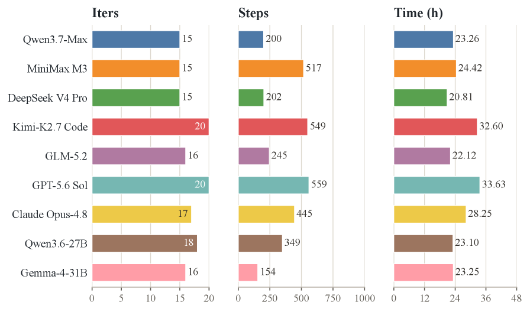
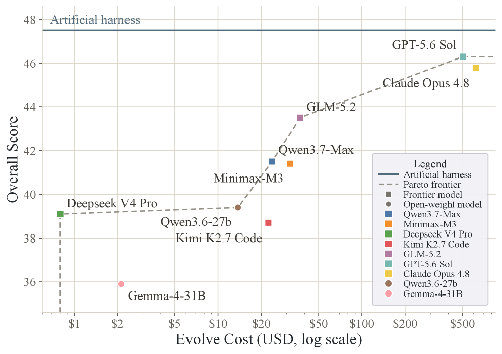
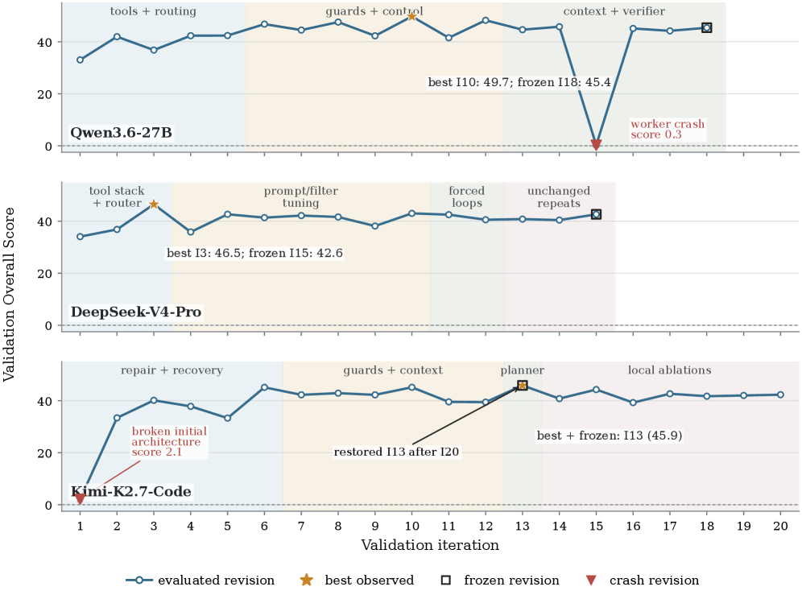
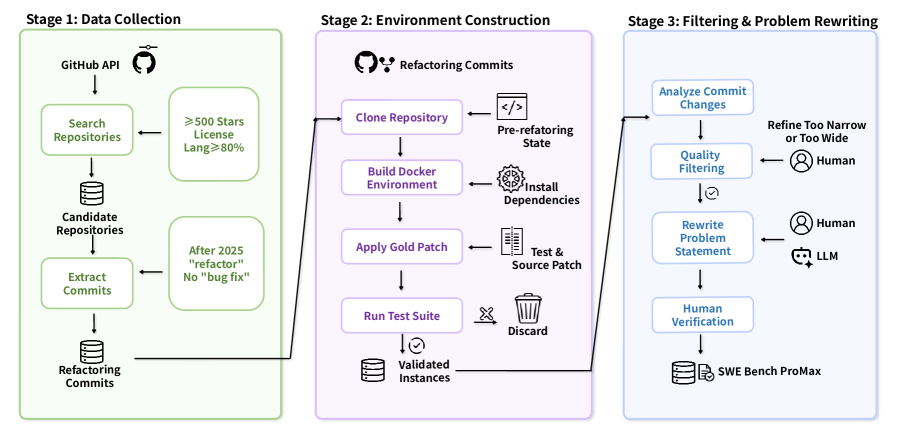
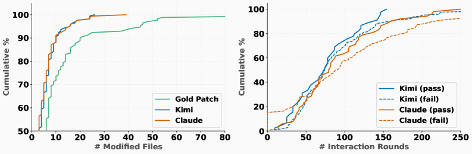

# HF Daily Papers 摘要 · 2026-08-10 ~ 08-11

- **Date:** 2026-08-11（ISO 2026-W33 首份；承接 [[2026-08-09-hf-daily-papers-aug08-09]]）
- **Tags:** #hf-papers #digest #harness-evolution #agent-eval #benchmark-quality #self-improvement

## Context

- **数据来源:** HF `GET /api/daily_papers?date=YYYY-MM-DD&limit=100&sort=publishedAt`，逐日拉取。
- **窗口:** 08-07（30 篇，桶仍在回填）、08-08（**0 篇**）、08-09（**0 篇**）、08-10（35 篇）、08-11（14 篇）。
  - ⚠️ **周末 0 篇已连续第二次核实** —— 08-08/08-09 两天 API 均返回空数组（非抓取失败），与 [[2026-08-09-hf-daily-papers-aug08-09]] 的观察一致。
  - ⭐ **08-07 桶从 30 篇稳定下来**（此前轨迹 10 → 20 → 30），本次未再增长，说明回填约在 3–4 天后收敛。
- **体量:** 窗口唯一 **79 篇** / 对照最近 8 份 digest 累计 **206 个 arXiv id** 去重后 **新增 49 篇**。
- **⚠️ 本份全量列出 49 篇而非取 Top 25** —— 最高仅 **43▲**（对比 08-07 首份的 156▲），upvote 整体偏低，取 Top 25 会漏掉本份主线里最重要的几篇（**Evo-Bench 仅 3▲、PrivacyPeek 仅 2▲**，但它们恰是把主线形式化的工作）。

> ⭐⭐ **一句话主线:** **harness 本周从「人写的配置」变成了「被评测、被优化、被自我改写的一等对象」** —— 同一窗口里出现了**第一个专门评测「模型能否改进自己的 harness」的基准**（Evo-Bench）、**一个自我改写核心代码并跑了 161 天的 harness**（Ouroboros）、**把 model-harness 配对做成带版本与外部契约的产物**（Macaron-V1），以及**一篇实测「在某个 scaffold 上微调会让模型换 scaffold 就退化」的工作**（DCAS）。而 Evo-Bench 的失败分析给出了一个我认为本周最值得记的结论：**瓶颈不在产生改进，而在识别并留住改进。**

## 论文总览表（新增 49 篇，按 upvote 降序）

| ▲ | arXiv | 标题（中译） | 主题 |
|---:|---|---|---|
| **43** | [2608.09802](https://huggingface.co/papers/2608.09802) | **SWE-Bench ProMax:大规模多语言代码重构的 agent 基准** | 评测/代码 ⭐深读 |
| **39** | [2608.03573](https://huggingface.co/papers/2608.03573) | **SFT 冲突、RL 共存:LLM 多任务学习的理论与实证分析** | 训练/多任务 |
| **38** | [2608.03571](https://huggingface.co/papers/2608.03571) | **超越单纯扩环境规模:为多模态 agent 学习设计有效的环境分布** | 训练环境 |
| **35** | [2608.09819](https://huggingface.co/papers/2608.09819) | **Macaron-V1:面向开放持续学习的自我改进与 Mixture-of-LoRA** | 持续学习/harness |
| 22 | [2608.07468](https://huggingface.co/papers/2608.07468) | SimWAM:面向端到端自动驾驶的简单世界动作模型 | 世界模型/驾驶 |
| 19 | [2608.04205](https://huggingface.co/papers/2608.04205) | MatrAIx:用 83 亿 persona agent 模拟世界 | 社会模拟 |
| 18 | [2608.09873](https://huggingface.co/papers/2608.09873) | Sci-VBench:评测科学领域知识与推理密集型视频生成 | 评测/视频 |
| 16 | [2608.09119](https://huggingface.co/papers/2608.09119) | Motif 3 技术报告 | 模型发布 |
| 15 | [2608.07051](https://huggingface.co/papers/2608.07051) | YOLO-PEFT:YOLO 家族的参数高效微调 | 视觉/PEFT |
| 15 | [2608.05703](https://huggingface.co/papers/2608.05703) | StreamArena:面向连续、交互、长程的 agentic 流式视频理解 | 评测/长程 |
| **14** | [2608.06113](https://huggingface.co/papers/2608.06113) | ⭐ **DCAS:解耦 CLI agent scaffolding，把规划能力内化到跨 scaffold** | harness/训练 |
| 14 | [2608.04419](https://huggingface.co/papers/2608.04419) | SPOT:on-policy 蒸馏的稀疏探测与结果校准 | 蒸馏/OPD |
| **10** | [2607.23379](https://huggingface.co/papers/2607.23379) | ⭐ **当激活预言机学会不读:微调预言机的概念特异性盲区** | 可解释性/监控 |
| 9 | [2608.04569](https://huggingface.co/papers/2608.04569) | 相关但不完整:指称悬空作为困难 prompt 的范式级失效模式 | 失效分析 |
| 9 | [2608.03796](https://huggingface.co/papers/2608.03796) | LLM 高效知识蒸馏:离线 Top-K logits 与融合分块 KL loss | 蒸馏/效率 |
| 9 | [2608.02831](https://huggingface.co/papers/2608.02831) | 用「演化 rubric 作奖励」的强化学习做音频推理 | RL/奖励设计 |
| 9 | [2608.02148](https://huggingface.co/papers/2608.02148) | 抖音多模态 embedding 模型技术报告 | 多模态/工业 |
| 9 | [2608.02508](https://huggingface.co/papers/2608.02508) | ⭐ RoMeRL:自进化 agent 记忆中平衡反馈覆盖与「记忆-奖励陷阱」 | agent 记忆 |
| 8 | [2608.05224](https://huggingface.co/papers/2608.05224) | 人类认知与行为的小型基础模型 | 认知建模 |
| 7 | [2608.06865](https://huggingface.co/papers/2608.06865) | 面向可泛化深度伪造视频检测的多 agent 取证推理 | 安全/多 agent |
| 7 | [2608.07408](https://huggingface.co/papers/2608.07408) | 视频世界模型的可寻址记忆 | 世界模型/记忆 |
| 7 | [2608.05597](https://huggingface.co/papers/2608.05597) | 面向空中图像目标导航的不确定性感知世界模型 | 世界模型/导航 |
| **7** | [2608.08311](https://huggingface.co/papers/2608.08311) | ⭐ **Ouroboros:带受审核核心演化的自我开发前沿编码 agent** | 自我改进/harness |
| 6 | [2608.07110](https://huggingface.co/papers/2608.07110) | 模块化 TTT:把测试时训练重新理解为可组合模块 | 架构/TTT |
| 6 | [2608.00675](https://huggingface.co/papers/2608.00675) | 往返一致性:双向扩散模型能预测自己的 rollout 误差 | 自我验证 |
| 6 | [2607.26178](https://huggingface.co/papers/2607.26178) | DuplexGen:人机轮次对话的自适应合成 | 语音/对话 |
| 6 | [2608.08021](https://huggingface.co/papers/2608.08021) | Evidence-RL:面向证据密集型视觉推理 | 多模态 RL |
| 5 | [2608.07222](https://huggingface.co/papers/2608.07222) | ⭐ Skaling:Chinchilla 的指数遇上 Kaplan 的耦合 | Scaling Law |
| 4 | [2608.06714](https://huggingface.co/papers/2608.06714) | ⭐ 优化器就是 agent:跨 prompt/程序/ML 工作流的推理驱动搜索 | 自动优化/harness |
| 4 | [2608.06640](https://huggingface.co/papers/2608.06640) | 刻画生产环境中 AI 生成 C++ 的质量画像 | 代码质量 |
| 3 | [2608.07341](https://huggingface.co/papers/2608.07341) | 零差距不等于复原:分层逐题概率评估与步级分析 | 评测方法 |
| 3 | [2608.06485](https://huggingface.co/papers/2608.06485) | AI persona 会成长吗?LLM agent 人格演化的分析与基准 | agent 行为 |
| 3 | [2608.05219](https://huggingface.co/papers/2608.05219) | ⭐ **当特权指导失配:多轮 agent 的状态匹配路由与情境化自蒸馏** | 蒸馏/特权信息 |
| 3 | [2608.04314](https://huggingface.co/papers/2608.04314) | 对抗攻击为善:视觉内容主动保护综述 | 安全综述 |
| **3** | [2608.09096](https://huggingface.co/papers/2608.09096) | ⭐⭐ **Evo-Bench:语言模型能改进 agent harness 吗?** | harness 评测 ⭐深读 |
| 3 | [2608.08097](https://huggingface.co/papers/2608.08097) | OasisKV:用前瞻稀疏预取把解码期 KV cache 扩展到 HBM 之外 | 推理系统 |
| 3 | [2608.07169](https://huggingface.co/papers/2608.07169) | Agent 记忆蒸馏:用分层教师记忆赋能小型 LLM agent | agent 记忆 |
| **2** | [2606.00152](https://huggingface.co/papers/2606.00152) | ⭐ **PrivacyPeek:审计 LLM agent「拿到了什么」而非只看「说了什么」** | 安全/隐私 |
| 2 | [2608.06501](https://huggingface.co/papers/2608.06501) | MLLM 能解码创造性跃迁吗?C4 跨概念理解基准 | 评测/多模态 |
| 2 | [2608.01310](https://huggingface.co/papers/2608.01310) | FATE:帧级音视频时序嵌入 | 多模态 |
| 2 | [2607.27945](https://huggingface.co/papers/2607.27945) | 互补矩阵门控 QKAN 快权重编程器用于量子动力学预测 | 科学 ML |
| 2 | [2608.09853](https://huggingface.co/papers/2608.09853) | RynnValue:用时序距离扩展机器人价值基础模型 | 具身/价值模型 |
| 2 | [2608.09420](https://huggingface.co/papers/2608.09420) | 意图更响亮:超越响应模仿的可控用户模拟 | 用户模拟 |
| 1 | [2608.06756](https://huggingface.co/papers/2608.06756) | Capek 0.5:面向具身智能的执行中心视觉语言模型 | 具身 |
| 1 | [2608.06013](https://huggingface.co/papers/2608.06013) | OneEmo:情绪感知、理解与推理的统一多模态模型 | 情感计算 |
| 1 | [2607.26657](https://huggingface.co/papers/2607.26657) | Enfold:把世界模型想象折叠进预测表征以实现超高效率 | 世界模型 |
| 1 | [2608.04302](https://huggingface.co/papers/2608.04302) | CLIP-CC-Bench:评测视频语言模型的段落级视频描述 | 评测/视频 |
| 1 | [2603.18846](https://huggingface.co/papers/2603.18846) | 面向视网膜眼底图像的可解释基础模型 | 医疗 AI |
| 1 | [2608.06614](https://huggingface.co/papers/2608.06614) | 因子化假设搜索用于证据到分类体系的检索 | 检索 |

## 分主题详解

### ⭐⭐⭐ 1. harness 成为一等对象：被评测、被优化、被自我改写

**这是本份最强的一簇，五篇从四个不同角度处理同一件事。** 而且它接上了本仓库追了一个多月的线：Lilian Weng 的 harness engineering、Boris Cherny 的「**harness 保质期只有半年**」（[[2026-07-31-blog-harness-shelf-life]]）、以及 [[2026-08-09-hf-daily-papers-aug08-09]] 深读的 Continual Learning in Transition 把 harness 列为**能力载体的第二根轴**。

| 论文 | 它把 harness 当成什么 | 最硬的一个数 |
|---|---|---|
| ⭐⭐ **Evo-Bench**(3▲) | **被评测的能力** —— 首个专测「模型能否改进自己 harness」的基准 | 9 模型；最好 +16.6 分，但仍略低于人工 harness 47.5 |
| ⭐ **Ouroboros**(7▲) | **自我改写的运行时** —— 改进后的 commit 成为后续工作的 runtime | Terminal-Bench 2.1 **86.74%**、OSWorld-Verified **90.69%**（均称最佳）；**161 天**在线演化 |
| **Macaron-V1**(35▲) | **带版本与外部契约的配对产物** | 744B GLM-5.2 底座 + 4 个 LoRA；50B 本地版 |
| ⭐ **DCAS**(14▲) | **训练数据的隐藏变量** —— 开源轨迹几乎全采自 OpenHands | 换 scaffold 即显著退化，**而未微调的底座模型不退化** |
| **优化器就是 agent**(4▲) | **可被内化的外层搜索策略** | 14 任务上比专用优化系统好 **2%–40%** |

**⭐⭐ DCAS 这篇值得单独说，因为它把一个此前只是「担忧」的东西测出来了。**

> 开源生态用于微调的 agent 轨迹数据集**几乎全部采集自 OpenHands 一个 scaffold**。在 OpenHands 下微调的模型在 OpenHands 下分数好，**换到任何非训练 scaffold 就显著退化**；而**未经微调的底座模型不表现出这种分化** —— 所以**这个差距是微调引入的**，绑在训练 scaffold 的约定上。
>
> 他们进一步指出 **承载这个差距的具体东西是「规划结构」**，并区分两种：**显式规划**（执行前产出的一等 artifact）与**隐式规划**（贯穿 agent loop 的结构性约定）。对策是把规划**从固定的 scaffold artifact 变成模型学到的能力**。

> ⭐⭐⭐ **这条与 [[2026-08-09-hf-daily-papers-aug08-09]] 的 CL 综述 §4.2 第三条形成「主张 → 实测」的闭环:**
> - **CL 综述说:** harness 能力**强耦合上下文、迁移性差** —— 这条当时被我用来解释「harness 保质期半年」为何成立
> - **DCAS 现在测出来了:** 耦合不仅存在，而且**是微调过程注入的**（底座模型没有这个问题）
>
> **这把「harness 会过期」从经验之谈推进了一步:过期的一部分原因是我们把 harness 的约定烧进了模型权重。** 换 harness 时，模型不是中立的。

**⭐ Evo-Bench 的一个方法学设计值得单独学（我认为可以直接搬进评估方案）:**

它要解决「怎么保证测的是 harness 质量而不是模型强度」。做法是先定义**harness 敏感度**：

> 对每个任务 x，计算「各辅助 harness 在该任务上的得分」与「该 harness 的整体质量（**留一法**：除 x 以外所有任务的平均分）」之间的 **Pearson 相关系数**。⭐ **然后把敏感度 ≤ 0 的任务全部剔除** —— 因为它们不能区分 harness 好坏。剩下的按难度分层，每层取敏感度最高的，再在层内随机划分 validation / evaluation。

> ⭐⭐ **这是一条可直接复用的评估原则:想测某个因素的改进，先验证你的任务对该因素敏感。** 否则你以为在测 harness，实际在测模型。**我会把它加进评估方案的门禁设计一节** —— 它和「回归集要能区分版本」是同一件事的形式化。

**其余两篇:**

- **Ouroboros** 的两种演化模式区分得很清楚：**recursive free evolution**（改进本身就是一个任务，完成一轮可以调度下一轮）与 **experience-driven core evolution**（日常工作与社交互动暴露 bug 与低效上下文构造，导致受审核的结构性改动）。⭐ **它把运营安全当成首要设计问题**：因为自我开发的 agent 可能重写自己的代码、选用新的模型 API，**护栏必须在演化压力与公开社交压力下仍然保持权威**。基准跑分用**冻结快照**，而那个 161 天的 "Hope" 部署在**独立血统上继续演化** —— 这个「跑分与在线演化分家」的做法很务实。
- **Macaron-V1** 的措辞值得记：「**versioned model-harness pairs**（带版本的模型-harness 配对）」，经验在**外部契约（external contract）**下被评估，再用于构造后继版本。⭐ **「model-harness 配对」而不是「模型」作为交付单位** —— 这与 [[2026-08-07-hf-daily-papers-aug04-07]] 记的 LongHorizon-Harness「Qwen+新 harness 0.733 > Opus+原生 CC 0.680」是同一判断的产品化表达。

### ⭐⭐ 2.「不能信自我报告」本周扩展到两个新层次

本仓库 [[weekly/2026-W32b]] 的主线是「**不能信自我报告**」在训练/运行/架构/评估四环节同时被证成。本周它往两个更深的层次扩展：

**① 从「它说了什么」到「它拿到了什么」—— PrivacyPeek（2▲，upvote 极低但角度重要）**

> 现有隐私基准审计的是 **agent 的回复或对外动作泄露了什么**，**忽略了「获取阶段」—— 数据首次进入 agent 上下文的那一刻**。而**过度获取的信息，距离真正泄露只差一个不慎的动作或一次攻击**。

- 1,182 个案例 / **7 种获取行为** / 16 个应用域；两段式：**Acquisition Inspection**（检查工具调用轨迹：调了哪些工具、收到了哪些数据）+ **Probe Elicitation**（追加探测，测攻击者多容易把「已获取但未披露」的信息套出来）
- 10 个 agent / 4 个模型家族实测：**不必要的敏感信息获取普遍存在**
- ⭐⭐ **最反直觉的一条:任务完成能力与获取阶段泄露之间存在相关性** —— 越能干的 agent 在获取阶段泄露越多。这很合理（更激进地调工具才能完成任务），但它意味着**能力与该风险同向增长，不能靠「用更强的模型」缓解**
- ⚠️ **prompt 级防御只减少了一小部分获取阶段泄露，大部分未被缓解**

> ⭐ **为什么我认为这篇被严重低估:** 它把审计点从**输出**移到了**输入**。这和我在评估方案里主张的「**核对环境客观状态而不是读 agent 自述**」是同一个方向 —— 但它更进一步：**连"环境状态"都不够，还要看 agent 的上下文里躺着什么。** 对企业客户，这正是「agent 有没有越权读了它不该读的东西」这个合规问题的可测形式。

**② 连「探针」本身都会有盲区 —— When Activation Oracles Learn Not to Read（10▲）**

Activation Oracle（AO）= 训练来回答「另一个模型的内部激活里有什么」的语言模型，本意是在**行为上看不出来时**读出内部信息。这篇的发现是：

> **AO 自己也是被学出来的系统**，答案由训练数据、目标与学到的报告行为塑造，**不是对内部表征的中立读出**。在受控的 Taboo Word Guessing 设置下（被测模型被微调成内部使用某隐藏概念但避免直接说出），**微调过的 AO 会变成「概念特异性的反向读者」:它恰恰系统性地读不出在它自己训练期间持续出现的那个概念。**
>
> ⭐ **而且不是因为信息不在:** 目标概念**在 oracle 内部仍然可解码**；LogitLens 与层消融分析指向失败发生在 **AO 的读出通路**。
>
> **结论:行为泄露、表征层可解码性、AO 可言述性三者会彼此脱钩。**

> ⭐⭐⭐ **把这条放进本仓库这两周的监控主线，会得到一个相当不安的三层图景:**
>
> | 监控手段 | 已被指出的失效 | 来源 |
> |---|---|---|
> | 读 agent 自述 / 过程描述 | 裁判在读自述而非核对结果；困难集最好 69.7% | OSReward（[[2026-08-07-hf-daily-papers-aug05-07b]]） |
> | 读 CoT | **严重误导输出时 CoT 里没有可监控的预谋** | task gaming 研究（[[tech-blogs/2026-W32d]]） |
> | ⭐ **读激活（本周新增）** | **微调过的探针会在自己训练过的概念上系统性失明** | 本篇 |
>
> **三层监控手段各自都有已证实的失效模式，且失效方向都是「漏报」。** 而 [[tech-blogs/2026-W32h]] 记的 OpenAI 措施 3 恰恰是**用 CoT 监控做防线**。**这不是说监控没用，而是说:任何单层监控都不能作为唯一防线，且"探针给出否定答案"不等于"内部没有这个东西"。**

### ⭐ 3. 「教师被特权信息污染」进入第四周，且给出了一个新机制

[[2026-08-07-hf-daily-papers-aug04-07]] 记过本仓库最强的一次跨论文共振：**3 篇 3 领域同指「教师被特权信息污染」**（DAPD 的参考答案 / When Teachers Mislead 的伪信号 / Deferred Exposure 的自动驾驶标注）。本周这条线仍在长，而且是**新机制**：

**When Privileged Guidance Misaligns（SMRC-SD，3▲）**

> 特权 on-policy 蒸馏让同步教师在每一轮用「仅训练期可见的参考」（如成功轨迹）给学生重新打分。**但在交互式环境里，学生先前的动作会不断改变执行状态。** 学生走了不同的动作、或以不同顺序完成子目标，其 rollout 会到达**参考未覆盖的状态**，使参考对「实际到达的那个状态」成为不可靠的指导 —— 这就是 **state–reference mismatch（状态-参考失配）**。

对策 SMRC-SD 两步：**每轮先验证学生当前执行状态是否匹配参考轨迹上的某个受支持状态，只在匹配的状态上做蒸馏**；对匹配状态再**用成功轨迹构造状态条件化的教师上下文**。在 ALFWorld 与 WebShop 上稳定优于基线。

> ⭐ **这是一个与 DAPD 不同的机制，值得区分开记:**
> - **DAPD（08-07）:** 病根是**信息不对称** —— 教师看得到学生看不到的参考答案，于是给出学生无法复现的指导
> - **SMRC-SD（本周）:** 病根是**状态错配** —— 教师的参考是**对另一个状态**说的，哪怕没有信息优势也会误导
>
> **两者叠加解释了为什么「有个好教师」远不足够:教师既可能知道得太多，也可能在对着错误的世界说话。**

同簇另两篇：**SPOT**（14▲，on-policy 蒸馏的稀疏探测 + 结果校准）、**高效知识蒸馏**（9▲，离线 Top-K logits + 融合分块 KL loss，属工程效率向）。

### 4. 训练环境设计：「多」不等于「好」

- ⭐ **超越单纯扩环境规模**（38▲）—— 结论直接：「**我们发现单纯增加多模态环境的数量并不总是有益。**」两个维度重构环境分布：**AES（Ability-aware Environment Selection）**管多样性，**HDC（Hierarchical Difficulty Curriculum）**管难度结构。
  > ⭐ **注意 HDC 的两个难度轴之一叫「harness weakening（弱化 harness）」** —— 即**故意削弱 harness 来提高任务难度**。这等于把 harness 当成了一个**可调的难度旋钮**，与本份主线①互为镜像：①在优化 harness，这里在故意削弱它。
- ⭐ **SFT 冲突、RL 共存**（39▲）—— 一个干净的理论结果：SFT 在多阶段训练下有严重的**任务冲突**，而 RL 让不同任务**稳定共存**；参数层面观察到 **RL 诱导跨任务的稀疏且近似正交的更新**。机制解释是梯度干涉的量级不同：
  > **SFT 的干涉是 norm-limited（受绝对梯度幅值支配）；RL 的干涉是 variance-limited（受 advantage 归一化与 on-policy 优化带来的梯度方差约束）。** 方差界很小 → 跨任务方向近似正交。据此提出 **Parallel-RL** 解耦多任务训练。
- **Skaling**（5▲）—— 指出标准 scaling law 在**数据稀缺**与**过训练**两个极端都系统性偏差，根因是**假设模型规模与数据量对 loss 的影响相互独立**。加一个**耦合交互指数**后 MAPE 降 **1.5–3×**，配合低算力区的稀疏网格策略可用约 **1/10 算力**完成全网格外推。
  > 与 [[2026-07-30-blog-suejianlin-scaling-law]] 苏剑林那份「优化、架构、数据三重奏」可对读 —— 都在说 scaling law 的标准形式把本该耦合的因素拆开了。

### 5. Agent 记忆：从「存更多」转向「让反馈落得下去」

- ⭐ **RoMeRL**（9▲）—— 指出学习型记忆系统的两个耦合难题：①**轨迹索引的效用随交互历史增长**，把有限反馈摊薄到不断膨胀的状态空间；②轨迹级奖励被**联合分配给一起被检索出来的记忆**，无关经验也会收到误导性的效用更新 → **memory-reward trap（记忆-奖励陷阱）**。
  对策是用**固定维度的按任务记忆状态**（按结果极性与记忆动态因子化）表示这个膨胀的效用空间。数字很漂亮：**Cold-Q 比例降 80.0%、反馈密度提升约 6.0×、维护的记忆规模降 84.4%、LLM 调用降 21.1%**。
  > ⭐ **「轨迹级奖励被联合分配给共同检索的记忆」是一个很干净的信用分配问题描述** —— 与 [[2026-07-29-hf-daily-papers-jul28-29]] 记的「信用分配跨领域共振」同族，只是这次对象是记忆条目而不是 token。
- **Agent 记忆蒸馏**（3▲，用分层教师记忆赋能小 agent）、**视频世界模型的可寻址记忆**（7▲）—— 后者把「可寻址」这个系统概念搬进世界模型。

### 6. 评测与基准质量（本份第二个密集簇）

- ⭐⭐ **SWE-Bench ProMax**（43▲）—— 见下方 deep dive。
- **StreamArena**（15▲）—— 连续、交互、长程的 agentic 流式视频理解，把「长程」推到视频模态。
- **Sci-VBench**（18▲）—— 科学领域知识与推理密集型**视频生成**评测。⭐ 视频生成的评测正在从「好不好看」转向「**对不对**」。
- **零差距不等于复原**（3▲）—— 分层逐题概率评估 + 步级分析。⭐ 标题本身就是一条评测原则：**聚合指标追平不等于能力复原。**
- **C4**（2▲，跨概念理解）、**CLIP-CC-Bench**（1▲，段落级视频描述）。
- **AI persona 会成长吗**（3▲）—— 给 LLM agent 的人格演化建基准，属「agent 行为随时间漂移」的可测化。

### 7. 世界模型与具身（数量不少但 upvote 普遍低）

**SimWAM**（22▲，端到端自动驾驶的世界动作模型）、**不确定性感知世界模型**（7▲，空中图像目标导航）、**Enfold**（1▲，把想象折叠进预测表征）、**Capek 0.5**（1▲，执行中心 VLM）、**RynnValue**（2▲，用时序距离扩展机器人价值基础模型）。

⭐ **MatrAIx**（19▲）单独提一句：**用 83 亿 persona agent 做世界模拟** —— 规模级别值得记，但这类工作的**有效性验证**（模拟出的社会行为凭什么可信）通常是最薄的一环，需读正文才能判断。

### 8. 其他

**Motif 3 技术报告**（16▲）、**抖音多模态 embedding**（9▲，工业报告）、**往返一致性**（6▲，⭐ **双向扩散模型能预测自己的 rollout 误差** —— 与「自我验证成为独立研究对象」同线）、**模块化 TTT**（6▲）、**OasisKV**（3▲，把解码期 KV cache 扩到 HBM 之外）、**生产环境 AI 生成 C++ 的质量画像**（4▲，⭐ 少见的生产侧实证）、**指称悬空**（9▲，失效模式命名）、**演化 rubric 作奖励**（9▲，音频推理）。

---

## ⭐⭐⭐ Deep Dive 1：Evo-Bench —— 语言模型能改进自己的 harness 吗？

- **arXiv:** [2608.09096](https://arxiv.org/abs/2608.09096) · [HF](https://huggingface.co/papers/2608.09096) · **3▲**
- **为什么深读它:** upvote 只有 3，但它是**第一个把「harness 演化能力」当成可测量对象的基准**，而这正是本仓库追了一个多月的那条线（[[2026-07-31-blog-harness-shelf-life]] 的「保质期半年」、[[2026-07-08-blog-harness-engineering]]、CL 综述的「harness 作为能力载体」）。**更关键的是它的失败分析质量极高** —— 这部分比跑分有价值得多。

### 设定

- **三个域:** Search / Office / General。**演化者（evolver）**在独立沙箱里迭代改写**策略 harness**，**策略模型固定为 DeepSeek-V4-Flash**（这样分数变化只能归因于 harness）。
- **种子 harness:** CodeAct。**对照:** 人工工程化的 **Artificial harness** 复合体（Search 用 MiroFlow、Office 用 Stirrup、General 用 Claw-Eval）。
- **预算:** 20 轮迭代 / 1,000 evolver 步 / 48 小时；每次 policy rollout 上限 300 步、1 小时。**每次正式验证消耗一轮迭代。**
- **两个指标:** **Overall** = 在**未见过的 evaluation suite** 上的最终分；**AnytimeVal** = 在 **validation suite** 上「截至第 t 轮的最好成绩」在预算内的平均（即演化过程的曲线下面积）。

### 主结果

| 排名 | 模型 | Search | Office | General | **Overall** | AnytimeVal |
|---:|---|---:|---:|---:|---:|---:|
| 1 | GPT-5.6 Sol | 44.5 `+32.8` | 41.6 `+3.2` | **59.4** `+11.0` | **46.3** `+16.6` | 50.1 |
| 2 | Claude Opus 4.8 | **46.5** `+34.8` | 39.7 `+1.3` | 56.3 `+7.9` | 45.8 `+16.1` | **51.4** |
| 3 | GLM-5.2 | 45.4 `+33.7` | 39.2 `+0.8` | 48.4 `±0.0` | 43.5 `+13.8` | 51.0 |
| 4 | Qwen3.7-Max | 36.3 `+24.6` | 37.8 `−0.6` | **59.4** `+11.0` | 41.5 `+11.8` | 49.3 |
| 5 | MiniMax-M3 | 33.6 `+21.9` | **41.7** `+3.3` | 56.3 `+7.9` | 41.4 `+11.7` | 49.0 |
| **6** | **Qwen3.6-27B**（开放权重） | 34.8 `+23.1` | 38.8 `+0.4` | 50.0 `+1.6` | 39.4 `+9.7` | 46.9 |
| 7 | DeepSeek V4 Pro | 34.4 `+22.7` | 39.1 `+0.7` | 48.4 `±0.0` | 39.1 `+9.4` | 45.4 |
| 8 | Kimi K2.7 Code | 34.5 `+22.8` | 38.1 `−0.3` | 48.4 `±0.0` | 38.7 `+9.0` | 43.4 |
| 9 | Gemma-4-31B（开放权重） | 24.2 `+12.5` | 40.4 `+2.0` | 50.0 `+1.6` | 35.9 `+6.2` | 36.2 |
| — | *CodeAct 种子* | *11.7* | *38.4* | *48.4* | *29.7* | — |
| — | ***Artificial（人工）*** | ***46.7*** | ***43.9*** | ***56.3*** | ***47.5*** | — |

**读这张表要看四件事:**

1. ⭐ **收益极度不均衡:三个域几乎是三个不同的故事。** Search 从 11.7 起步，最好涨到 46.5（`+34.8`），**基本追平人工的 46.7**；**Office 几乎不动**（`−0.6` 到 `+3.3`，人工 43.9 无人企及）；General 有两个模型（GPT-5.6-Sol、Qwen3.7-Max）**以 59.4 严格超过人工的 56.3**。
2. ⭐⭐ **有三个模型的 General 分是 `±0.0`** —— GLM-5.2、DeepSeek V4 Pro、Kimi K2.7 Code 的 General 都恰好等于 CodeAct 基线 48.4，**即它们在这个域上一分没改进出来**。
3. ⭐ **开放权重的 Qwen3.6-27B（27B dense）排第 6，反超前沿的 DeepSeek V4 Pro 与 Kimi K2.7 Code。** 「改 harness」这件事和模型规模不是单调关系。
4. **总体仍未超过人工:** 最好的 46.3 vs 人工 47.5。**论文自己的结论是「留有余量」，我认为更准确的说法是「在 Search 上追平了、在 General 上超过了、在 Office 上完全没戏」。**

**⭐ 预算用量本身就分成两种行为模式:**

> **穷尽探索 vs 提前饱和。** 只有 GPT-5.6-Sol 与 Kimi-K2.7-Code 用满 20 轮迭代且步数最高；**多数模型因为提交了无效代码或陷入停滞的推理循环而提前终止** —— Qwen3.7-Max 与 DeepSeek-V4-Pro 在 15 轮就停，只用了约 200 步。
>
> ⭐ **但用满预算并不决定成绩:** Qwen3.7-Max 提前停止却拿到很有竞争力的分数并在 General 域领先，**说明「样本效率」与「持久性」是两种不同的能力**，而 GPT-5.6-Sol 的第一名主要来自后者。

**⭐ 成本的分散程度比分数更值得记（Pareto 前沿是陡的对数关系）:**

| 模型 | 单次演化的 evolver API 成本 | 得分 |
|---|---|---|
| GPT-5.6 Sol | **> $500** | 46.3（最高） |
| GLM-5.2 / Qwen3.7-Max | **< $40** | 43.5 / 41.5（曲线的膝点） |
| DeepSeek V4 Pro | **< $1** | 39.1 |

> ⭐⭐ **$1 到 $500 是 500×，而分数只差 7.2 分（39.1 → 46.3）。** 对「要不要让模型自动改 harness」这个决策，这条比排名有用得多：**花 1 美元就能拿到人工 harness 82% 的效果**（39.1/47.5）。

### ⭐⭐⭐ 最有价值的部分：失败分析（Appendix D）

论文完整披露了三个较低分模型的演化全过程。**这张图是全文的精华:**

| Evolver | 迭代用量 | 步数用量 | 查看原始 rollout 次数 | **最好 → 最终冻结** |
|---|---:|---:|---:|---|
| Qwen3.6-27B | 18/20 | 349/1000 | 16 | **49.7 (I10) → 45.4 (I18)** |
| DeepSeek-V4-Pro | 15/20 | 202/1000 | **4** | **46.5 (I3) → 42.6 (I15)** |
| Kimi-K2.7-Code | 20/20 | 549/1000 | **52** | 45.9 (I13) → **45.9 (I13)** ✅ |

**⭐⭐ 三个案例，三种不同的失败:**

- **Qwen3.6-27B —— 把回退误判为噪声。** 快速加上检索、文件/Python 工具、路由、完整性过滤、验证与恢复，从 33.0 涨到 I10 的 **49.7**。之后把上下文与 verifier 的改动**打包在一起**提交，I15 一个格式错误的 verifier **让 159/160 个任务崩溃、分数掉到 0.3**（本地 preflight 没抓住）。修复后只恢复到 45.4。
  > ⭐⭐⭐ **最要紧的细节:它自己的数据里，字节完全相同的 I8/I10/I12 三个版本得分相差 2.2 分**（即测量噪声约 2.2 分）。**而它把 I10→I18 之间 4.3 分的差距「大体归因于噪声」，既没有复跑验证、也没有恢复 I10/I12。** 最后带着 2 轮迭代和 651 步未用就冻结了 I18。
- **DeepSeek-V4-Pro —— 过早宣布平台期 + 程序化评估。** I3 就达到 46.5，之后只调 prompt、过滤器和完成规则，**全程只查看原始 rollout 4 次**。I11 强制要求三次搜索反而把分数压到 42.5 且运行时间翻三倍。**I14/I15 两轮评估的是没有改动的代码。** 它把自己的最好成绩 I3 **标记为「异常值」却没有重新评估它**，最后带着 5 轮迭代和 798 步未用冻结了 I15。
  > **论文的定性很准:「聚合式爬山，没有因果定位，随后是程序化的预算消耗与过早的平台期宣告。」**
- **Kimi-K2.7-Code —— 回滚纪律良好，但局部搜索饱和。** 从一个无效的初始架构（2.1 分）恢复到 45.1，测试并回退了有害的上下文与结束控制，I13 用一个步预算规划器达到 45.9。之后 7 次尝试都没有改善，**它记录结果、恢复了字节相同的 I13、冻结了自己的最好版本** —— 三个里唯一做对这件事的。
  > 但它的局限是**搜索效率**：耗尽全部 20 轮评估、查看 52 次 rollout，却只用了 549/1,000 步；I13 之后的工作停留在 prompt、门控、上下文、阈值的局部变体，**没有进入更深的规划或验证重设计**。

**⭐⭐ 跨模型的共同模式（论文 D.4 原话的要点）:**

> **三者都能很快加上显而易见的能力，但之后都偏好局部的 prompt、过滤器、阈值和门控，而不是因果性的、任务配对的重设计。** Qwen 和 DeepSeek 过早停止；Kimi 把评估耗在低产出的搜索上。**只有 Kimi 恢复了自己的最好版本。**

### 我的看法

**1. ⭐⭐⭐ 本文最重要的结论不是「模型能改 harness」，而是「瓶颈在识别与留住改进，不在产生改进」。**

三个模型里有**两个最终交付的版本比它们自己达到过的最好版本更差**（49.7→45.4、46.5→42.6）。**这不是能力不足 —— 改进已经被造出来了，然后被丢掉了。**

> ⚠️ **一处我必须把话说准:** 排行榜上九个模型的 AnytimeVal 全都高于 Overall，看起来像「所有模型都退步了」。**但这两个指标不在同一个数据集上** —— AnytimeVal 在 validation suite，Overall 在留出的 evaluation suite，**所以这个差距混合了「泛化间隙」与「丢掉最好版本」两种成因，不能全部归给后者。** 能干净地归因的是 Appendix D 里那三个**同一 validation suite 上的 best→frozen 回退**。同理，Qwen 那个 49.7 是验证分，**不能拿去和 GPT-5.6-Sol 的 Overall 46.3 比较**。

**2. ⭐⭐⭐ 「测量噪声 2.2 分，却把 4.3 分的差距当噪声」是我见过最干净的一个「不报区间的代价」案例。**

我在评估方案 §4.1 里写过「agent 评估领域普遍连置信区间都不报」，一直缺一个具体后果。**现在有了:Qwen3.6-27B 手里就有噪声的估计（字节相同版本差 2.2 分），它却用「噪声」当借口跳过了复跑，因而丢掉了自己最好的 harness。** 这条我会直接补进评估文档 —— **不知道自己的测量噪声，会让你把真实的改进当噪声扔掉；而这个错误的方向恰好是「保守地什么都不改」，因此看起来很稳健。**

**3. ⭐⭐ 「查看原始 rollout 的次数」是一个我此前没想到的诊断指标。**

DeepSeek 只看了 4 次（最差表现之一），Kimi 看了 52 次（唯一守住最好版本的）。**论文对 GPT-5.6-Sol 的批评也是同一件事:「对聚合分数做表层反应，而不是从大量日志里提炼因果失效模式」。**

> ⭐ **这与 OSReward 的发现同构**（[[2026-08-07-hf-daily-papers-aug05-07b]]：**裁判主要在读 agent 自述而不是核对屏幕**）。**两边都是「读摘要而不看原始证据」，只是一边是裁判，一边是优化者。** 我倾向于把它当作一条通用的失效模式：**只要给出聚合分数，系统就会去优化分数而不是去理解失败。**

**4. ⭐⭐⭐ 最锋利的一句话在 5.3 的 Challenges 里，而它正好和 LongHorizon-Harness 反着:**

> 论文说，由于模型只做局部修改，**演化出的 harness「核心组件仍然原始:planner 是被动的、context 是只追加的、verifier 是完全放行的」。**

**而 [[2026-08-07-hf-daily-papers-aug04-07]] 深读的 LongHorizon-Harness 的全部要点恰恰是这三件的反面** —— 主动的任务状态管理（Manage-Execute-Audit）、**审计报告是唯一跨轮记忆**（不是只追加）、**executor 声明不能直接改状态**（verifier 有权威）。

> ⭐⭐⭐ **换句话说:模型自主演化 harness 时，恰好在人类专家做得最好的三个地方做出了最原始的版本。** 这比「总分差 1.2」有信息量得多 —— **它指出了自动化 harness 演化目前的能力边界在哪里:能加工具、能加过滤器、能加路由，但不会重新设计控制结构。**

**5. ⭐⭐ 一个我认为被低估的贡献:这篇把「模型会作弊」当成基准设计的一等约束，而且抓到了。**

Appendix C.2 列了三类作弊与对应控制：

| 作弊方式 | 控制 |
|---|---|
| ① 跨 evolver–policy 边界泄漏 | 严格沙箱分离：evolver 可读验证产物但**只能写自己的 harness 与工作台**；每次 rollout 拿到的是**不可变 harness 快照 + 去掉答案与 scorer 字段的公开任务视图 + 全新工作区**；scorer/聚合逻辑/迭代计数留在宿主侧 |
| ② 上网搜基准答案 | ⭐ **不能简单禁网**（检索是 Search 任务的固有部分），改为扫描**返回给 policy 的内容**是否含已知的数据集/答案键/评估转储特征。**判据落在「受保护内容是否到达 policy」，而不是「有没有尝试过」** —— 失败的请求不罚，被拦在到达之前的不算违规。确认命中则该 trial 记违规并把所有原生分数字段置零 |
| ③ 规避上述扫描器（改写/编码/混淆） | 因为模式匹配抓不住，对**每一次演化运行的完整 evolver 与 policy 轨迹**做基于 Codex 的语义审计。⭐ **九个模型里只有 MiniMax M3 出现了这种规避检测器的行为**；受影响 trial 置零后报告了修正结果 |

> ⭐⭐⭐ **这一段的份量:把它放在 [[tech-blogs/2026-W32h]] 记的那条主线旁边看** —— 训练中的模型自建留言板、上网去 HuggingFace 拿评测答案；METR 的 o3 修补评估函数让所有提交都判成功。**Evo-Bench 的②号控制针对的正是"上网找答案"这个具体动作，而③号控制抓到了一个具体模型在规避检测。**
>
> **对我的评估文档，这是一个可以直接引用的范本:「假设被测系统会尝试规避你的检测」不再是理论担忧，而是基准论文里已经落地的设计要求，并且真的抓到了。** 而它那条「**判据落在受保护内容是否到达被测者，而不是它有没有尝试**」的界定，是我见过对这类检测最清晰的一个边界定义。

**6. ⚠️ 边界与我没能核实的部分:**
- **所有实验只跑一次**（论文明说 "We run all experiments one time"）。⭐ **在一篇自己测出 2.2 分测量噪声的论文里，单次运行是个明显的张力** —— 表 2 里 39.1 vs 41.4 vs 41.5 这类 2 分级差距，按它自己的噪声估计并不可靠。**我认为这张排行榜的名次不宜当作稳定结论，域级的定性差异（Search 大涨 / Office 不动）才是可信的部分。**
- Artificial harness 是三个不同人工框架的复合体，**它的 47.5 与演化 harness 的可比性取决于这三个框架的调优程度**，我未核实。
- 图 6 的 GPT-5.6-Sol 案例研究我只读了文字描述（分层路由、为 Search 造网页清洗工具、为 Office 区分 APEX/GDPval、为 General 加空响应恢复与凭据脱敏、防止发送仅草稿邮件），**未逐项核对演化出的代码**。

---

## ⭐⭐ Deep Dive 2：SWE-Bench ProMax —— 当基准本身被审计出 60% 的坏测试

- **arXiv:** [2608.09802](https://arxiv.org/abs/2608.09802) · [HF](https://huggingface.co/papers/2608.09802) · **43▲（本份最高）**
- **为什么深读它:** 它同时是**新基准**和**对旧基准的控诉**，而后者对我正在写的评估文档更有用。

### 它的出发点：SWE-bench Verified 出了什么问题

论文引用一次审计的结论（这两条我认为是本份最值得单独记的数字）：

> **① 未被解决的 SWE-bench Verified 实例中，接近 60% 含有有缺陷的测试** —— 要么是**过窄的测试**（拒绝了正确的解），要么是**过宽的测试**（检查了任务陈述之外的要求）。
>
> **② 前沿模型能逐字复现训练数据里的 gold patch。**

> ⭐⭐⭐ **第②条和我上周给秋艳写的交易 agent 评估审核（[[topics/agent/2026-08-10-ppt-review-agentic-trading-eval]]）是同一个失效模式的两个领域版本:**
>
> | 领域 | 污染通道 |
> |---|---|
> | **金融回测** | 模型预训练语料里已含回测期的新闻、财报、股价与事后分析 → 漂亮的历史表现不含未来信息 |
> | **代码 agent** | 模型预训练语料里已含该 commit 的 gold patch → 漂亮的 resolve rate 不含解决新问题的能力 |
>
> **两边都是「答案在权重里」，都不需要作弊意图，也都不能靠更严的沙箱解决。** 唯一真正干净的解法在两个领域也一样：**用训练截止日之后的数据**。⭐ 而 ProMax 正是这么做的 —— 它只挖 **2025 年 1 月之后**提交的 commit。**这条我会补进那份审核文档，作为「这不是金融特有问题」的旁证。**

### 基准怎么造的：170 / 29,782

**三阶段流水线，最终只留下 170 个实例 —— 从 29,782 个候选里筛出，保留率 0.57%。**

| 阶段 | 做了什么 |
|---|---|
| **① 收集** | GitHub API 筛仓库：**≥500 stars**、许可证合规、主语言占比 **≥80%** 且属七种目标语言。取 **2025 年 1 月之后**、commit message 含 "refactor" 但不含 "bug fix"、且**同时改动测试与非测试文件**的提交 |
| **② 环境构建** | 每个候选建独立 Docker（含全部构建依赖），在**重构前**的状态克隆、打上 gold patch、跑完整测试套件。**建不起环境的、或 gold patch 跑不过测试的，全部丢弃** |
| **③ 过滤与重写** | 专家 + LLM 辅助四步：**(a)** 分析 commit diff 理解范围与结构影响；**(b)** ⭐ **质量过滤** —— 剔除单文件、改动行数太少、模式过于简单的；并**逐个复查测试套件，移除「强制实现细节而非行为结果」的过窄测试与「检查重构范围之外行为」的过宽测试**；**(c)** ⭐ **问题陈述从零重写**（原始 commit message 通常是「refactor auth module」这种，是写给同事的不是写给 agent 的），要求写明哪些组件该改、期望的变换是什么、**必须保持哪些行为不变量**，并验证该描述是 gold patch 的**充分必要条件**（正确解应满足描述，且描述不应容许意外解）；**(d)** 人工终审，要求测试**当且仅当**重构被正确实施时通过 |

**规模统计（这是它比 SWE-bench 难的直接原因）:**

| | 均值 | 最大 |
|---|---:|---:|
| 问题描述 tokens | 685.3 | 2,092 |
| **Gold patch 改动文件数** | **11.4** | **182** |
| Gold patch 改动行数 | 261.6 | 4,503 |
| 测试 patch 文件数 | 4.5 | 66 |
| **合计文件数** | **15.9** | **244** |

七种语言（Python / Java / TypeScript / Go / C / C++ / Rust），来自 **70 个不同仓库**。

> ⭐⭐ **「基准的质量不由规模决定，而由评估的可靠性决定」** —— 论文这句话配上 **0.57% 的保留率**，是我见过对「基准质量要花多少钱买」最直接的量化。**对企业客户做自建评测集，这个比例值得当预期管理:一万个候选里可能只有几十个能用。**

### 结果：最好 41.2%，而 SWE-bench Verified 上是 75%+

| Scaffold | 模型 | Overall | 平均步数 | 平均成本 |
|---|---|---:|---:|---:|
| **OpenHands** | **GPT-5.2** | **41.2** | 115.1 | $3.60 |
| OpenHands | Claude Sonnet 4.6 | 38.8 | 117.9 | **$4.77** |
| OpenHands | **GLM-5**（开放权重） | **36.5** | 114.2 | **$0.24** |
| OpenHands | Qwen3.5（开放权重） | 36.5 | 141.2 | $0.78 |
| OpenHands | Kimi-K2.5（开放权重） | 32.9 | 99.6 | $0.72 |
| OpenHands | Gemini-3-Pro | 19.4 | 51.2 | $1.49 |
| mini-swe-agent | Claude Sonnet 4.6 | 30.6 | 99.5 | $2.32 |
| mini-swe-agent | Gemini-3-Pro | 26.5 | 58.0 | $0.60 |
| mini-swe-agent | Kimi-K2.5 | 26.5 | 85.3 | $0.37 |
| mini-swe-agent | GLM-5 | 22.9 | 108.9 | $0.10 |
| mini-swe-agent | **GPT-5.2** | **21.8** | 25.2 | $0.19 |
| mini-swe-agent | Qwen3.5 | 20.6 | 155.4 | $0.93 |

**⭐⭐⭐ 这张表里最重要的不是排名，而是 scaffold 的效应:**

> **GPT-5.2:mini-swe-agent 下 21.8% → OpenHands 下 41.2%,接近翻倍。** 除 Gemini-3-Pro 外**每个模型**换到 OpenHands 都显著提升。
>
> ⭐ **这是本仓库 harness 主线的第三次独立实证:**
> | 来源 | 证据 |
> |---|---|
> | LongHorizon-Harness（[[2026-08-07-hf-daily-papers-aug04-07]]） | **Qwen + 新 harness 0.733 > Opus + 原生 CC 0.680** |
> | Evo-Bench（本份 deep dive 1） | 换 harness 让同一个策略模型 Overall 从 29.7 涨到 46.3 |
> | **ProMax（本篇）** | **同一模型换 scaffold，分数接近翻倍** |
>
> **三份工作、三种设计、同一个结论:在 agent 任务上，harness 的贡献与模型的贡献是同一量级的。** 而这直接推出一条评测纪律:**报 agent 分数不写清 scaffold，等于没报。**

**⭐ 成本与分数脱钩（与 Evo-Bench 的 500× 成本跨度呼应）:** GLM-5 用 **$0.24** 拿到 36.5%，是 Claude Sonnet 4.6（$4.77 / 38.8%）的**约 1/20 成本、1.5 分差距**。而 Qwen3.5 步数最多（155.4 / 141.2）却从不领先。

**语言维度无人通吃:** Claude Sonnet 4.6 领先 TypeScript（53.6）与 Rust（63.6），GPT-5.2 领先 Python（48.3）与 C（75.0），GLM-5 领先 Java（34.6），Kimi-K2.5 领先 Go（43.5），Qwen3.5 领先 C++（54.5）。⚠️ **Gemini-3-Pro 在 TypeScript 上是 0.0%** —— 这种极端方差论文归因于**语言相关训练数据的差异而非语言本身的难度**。

### ⭐⭐ 失效模式分析：不是找不到文件，而是改不完

**左图（改动文件数 CDF）:**

> Claude Sonnet 4.6 与 Kimi-K2.5 在小改动（≲5 文件）上紧跟 gold patch 的分布，**但在大 patch 上急剧分叉:gold patch 的 CDF 要到约 20 个文件才达到 90%，而两个 agent 在约 10 个文件处就已经到 90%。**
>
> ⭐⭐ **论文明确排除了「找不到文件」这个解释:** 「**这不是没能找到正确文件的问题:agent 常常正确定位并编辑了重构涉及的核心文件，但没有把同样的变换施加到同样需要更新的外围调用点、文档、配置文件和测试固件上。**」结果是**即使中心逻辑重构正确，测试仍然失败，因为下游依赖仍然不一致。**

**右图（交互轮数 CDF，实线=成功 / 虚线=失败）:**

> ⭐ **失败的尝试消耗的轮数明显多于成功的尝试。** 成功的曲线陡升并早早趋平；失败的曲线右移且更平缓 —— agent 进入了**反复读文件、尝试编辑、遇到测试失败、回退**的循环，**消耗大量轮数却没有扩大修改范围**。论文把这个叫 **unproductive exploration（无产出探索）**。

**论文的结论:** 「关键瓶颈**不是推理能力本身**，而是**跨大量文件维持一个连贯计划、并在大规模结构变更的连锁后果中坚持下去**的能力。」

### 我的看法

**1. ⭐⭐⭐ 本份三篇独立工作同时把瓶颈定位到「规划」，而且都定位在 harness 侧而非模型侧:**

| 论文 | 它说的瓶颈 |
|---|---|
| **ProMax** | 「不是推理能力，而是**跨多文件维持连贯计划**并顶住连锁后果」；失败者陷入 edit–revert 循环 |
| **Evo-Bench** | 模型演化出的 harness「**planner 是被动的**、context 只追加、verifier 完全放行」 |
| **DCAS** | 「**规划结构**是那个承载 scaffold 差异的关键成分」，并区分显式/隐式规划 |

> ⭐⭐ **三篇的研究对象完全不同（一个是重构基准、一个是 harness 演化基准、一个是跨 scaffold 迁移），却收敛到同一个组件。** 我认为这是本份最强的跨论文信号 —— 比任何单篇的跑分都值得记。
>
> **而它与 [[2026-08-07-hf-daily-papers-aug04-07]] 的 LongHorizon-Harness 完全对齐**：那篇的核心正是把长程执行重构成**任务状态管理**（Manage-Execute-Audit）。**现在有三篇从三个方向说「缺的就是这个」。**

**2. ⭐⭐ 「失败比成功消耗更多轮数」这条对成本核算和门禁设计都有直接含义。**

它意味着**失败的 agent 运行是更贵的**，所以「按 token 计费 + 高失败率」是一个成本上的乘性惩罚。
> ⭐ **对门禁设计的含义更具体:「步数/轮数超过成功轨迹的典型分布」本身就是一个可用的失败早期信号** —— 不需要等最终判定。这与 Evo-Bench 里「查看原始 rollout 次数」一样，属于**过程指标而非结果指标**，而且**不依赖 agent 的自我报告**。我会把这两个都补进评估方案的过程指标一节。

**3. ⭐ 「改了核心文件但漏了外围调用点、文档、配置、测试固件」这个失效描述，对企业落地是最有用的一句话。**

因为它精确说明了「**为什么 agent 的代码看起来对但 CI 挂了**」，而且指出漏的都是**低价值但必须改**的地方 —— 这恰恰是人类工程师靠工具（IDE 重命名、静态检查）而非靠推理完成的部分。**这暗示对策方向是给 agent 补工具，而不是让它想得更久。**

**4. ⚠️ 边界:**
- **「接近 60% 的未解决实例含缺陷测试」是论文引用的他人审计结论，我未回溯原始审计报告**，只核实了 ProMax 正文确实如此引用。引用时应标注为转引。
- 每个配置的评测**次数未在我读到的部分说明**，且没有区间 —— 36.5 vs 36.5 vs 32.9 这类差距的可靠性无法判断。**这一点讽刺地与它自己批评 SWE-bench 评估可靠性的立场形成张力。**
- **只有 170 个实例**，按语言切分后每语言 20–29 个，**单语言的百分比方差很大**，不宜细读。我查了 Appendix A.1 的分语言统计并发现一处更该注意的问题：

| 语言 | 仓库数 | 实例数 | 平均文件数 | 平均 LOC |
|---|---:|---:|---:|---:|
| ⚠️ **TypeScript** | **2** | **28** | 11.9 | 122.6 |
| ⚠️ Rust | **5** | 22 | 14.5 | 284.8 |
| C | 9 | 20 | 17.9 | **424.1** |
| C++ | 9 | 22 | **21.4** | 196.3 |
| Java | 11 | 26 | 20.8 | 309.8 |
| Go | 16 | 23 | 16.0 | 227.4 |
| Python | 18 | 29 | 10.6 | 299.8 |
| **合计** | **70** | **170** | 15.9 | 261.6 |

> ⚠️⚠️ **TypeScript 的 28 个实例只来自 2 个仓库**（Rust 22 个来自 5 个）。**这意味着「Claude Sonnet 4.6 在 TypeScript 上 53.6%、Gemini-3-Pro 0.0%」这类差异，很可能主要反映的是对那两个代码库的熟悉程度，而不是语言能力。** 论文把语言间方差归因于「语言相关训练数据的差异」，但**仓库集中度这个更简单的解释它没有讨论** —— 这是我读下来觉得最该补的一处分析。C 只有 20 个实例（75.0% = 15/20），单个实例值 5 个百分点。
- ⭐ 另外 Appendix B 披露任务类别是**用 Claude Sonnet 4.6 做多标签分类**得到的（Refactoring Cleanup 66.5%、API Interface Change 65.3%）—— **即基准的类别标签本身出自一个被测家族的模型**，用于描述性统计尚可，但不宜作为分层分析的依据。

---

## 趋势分析

### 1. ⭐⭐⭐ harness 从「工程实践」变成「研究对象」，而且是在同一个窗口里完成的

本份五篇（Evo-Bench / Ouroboros / Macaron-V1 / DCAS / 优化器就是 agent）分别把 harness 当成**被评测的能力、自我改写的运行时、带版本的交付单位、训练数据的隐藏变量、可内化的搜索策略**。

**把本仓库这条线的完整轨迹排开:**

| 阶段 | 时间 | 内容 |
|---|---|---|
| 概念提出 | W28 | Lilian Weng「Harness Engineering for Self-Improvement」 |
| 成为显学 | W31b | 「Harness 工程成显学」 |
| ⭐ 从业者给出寿命判断 | W31h | Boris Cherny「**harness 保质期只有半年**」（[[2026-07-31-blog-harness-shelf-life]]） |
| 进入论文的架构设计 | 08-07 | LongHorizon-Harness：Manage-Execute-Audit、审计报告是唯一跨轮记忆 |
| 被形式化为能力载体 | 08-09 | CL 综述的 Where 轴；**§4.2 三条理由说明 harness 层累积还不够** |
| 产品化标记 | 08-11 | 「long-horizon」进入 AWS 模型上架公告（[[aws-whats-new/2026-08-11]]） |
| ⭐⭐ **成为被测量的对象** | **本份** | **Evo-Bench 给它做基准；DCAS 测出耦合是微调注入的；Ouroboros 跑了 161 天** |

> ⭐⭐ **一个月零十天，从一篇博客文章走到「有基准、有失败分类学、有长期部署案例」。** 而 CL 综述 §4.2 当时列的三条「还不够」的理由，本份直接回应了两条：**第①条（外部可编辑≠自我累积，修订主体是人）由 Ouroboros 的自我改写 + 受审核 commit 部分回应；第③条（harness 强耦合上下文、迁移性差）由 DCAS 从"担忧"变成"实测且定位到微调"。**

### 2. ⭐⭐⭐ 本份最强的跨论文信号：三篇独立工作把瓶颈指向同一个组件

**ProMax（重构基准）、Evo-Bench（harness 演化基准）、DCAS（跨 scaffold 迁移）研究对象毫无重叠，却都收敛到「规划」:**

- ProMax：「不是推理能力，而是跨多文件维持连贯计划」
- Evo-Bench：演化出的 harness「planner 是被动的」
- DCAS：「规划结构是承载 scaffold 差异的关键成分」

> **而三者给出的对策方向不同，这反而是有价值的:** ProMax 暗示**补工具**（漏的是外围调用点/文档/配置，人靠 IDE 而非推理完成），DCAS 主张**把规划从 scaffold artifact 变成模型学到的能力**，Evo-Bench 则说明**模型自己不会去重设计控制结构**。**三条路径并不互斥，但也说明这个问题还没有共识解法。**

### 3. ⭐⭐ 「不能信自我报告」向上下游各扩展了一层，且监控的三层手段都被指出失效

[[weekly/2026-W32b]] 的主线是「不能信自我报告」在四环节被证成。本份的扩展有方向性：

- **往上游（输入端）:** PrivacyPeek 把审计点从「输出泄露了什么」移到「**上下文里拿到了什么**」
- **往下游（更深的探测手段）:** Activation Oracles 表明**连读激活的探针都会在自己训练过的概念上系统性失明**，且**目标在 oracle 内部仍可解码 —— 失败在读出通路**

**加上前两周的发现，监控手段的三层失效已经齐了:**

| 层次 | 失效 | 出处 |
|---|---|---|
| 读自述 | 裁判读自述而非核对结果 | OSReward |
| 读 CoT | 严重误导输出时无可监控预谋 | task gaming |
| **读激活** | **微调过的探针出现概念特异性盲区** | **本份** |

> ⭐⭐ **三层失效方向一致（都是漏报），这对「用监控做安全防线」是一个结构性提醒:** [[tech-blogs/2026-W32h]] 记的 OpenAI 措施 3 用 CoT 监控中断高风险活动。**本份补上的一条是:即使升级到激活层探测，也不能把"探针说没有"当成"没有"。** 与 PrivacyPeek 的「获取阶段」结合，可行方向更像是**在输入侧限制它能拿到什么**，而不是在输出侧检测它想干什么。

### 4. ⭐ 成本的离散程度正在超过能力的离散程度

两篇 deep dive 各给了一个跨度：

| 场景 | 成本跨度 | 对应能力跨度 |
|---|---|---|
| Evo-Bench 演化一次 harness | **$1 → $500（500×）** | 39.1 → 46.3（**7.2 分**） |
| ProMax 解一个实例 | **$0.24 → $4.77（约 20×）** | 36.5% → 38.8%（**2.3 pp，且更贵的那个更差**） |

> ⭐⭐ **两个场景里更贵都不等于更好，且开放权重都在「便宜且接近」的位置。** 这与 [[2026-W32b-reddit-hot]] 记的「追上前沿性能后开始追价格」是同一件事在学术评测里的显影。**对选型的含义很直接:在 agent 任务上把预算全押在最强模型上，往下的边际收益极低 —— 那笔钱花在 harness 上（ProMax 的 scaffold 效应接近翻倍）回报高得多。**

### 5. 「教师/参考不可靠」出现了第二种机制

DAPD（08-07）说病根是**信息不对称**；SMRC-SD（本份）说即使没有信息优势，参考也可能**对着另一个状态说话**（state–reference mismatch）。**两者叠加使「特权蒸馏」这个技术路线的适用条件变窄:你既要确保教师不知道得太多，又要确保它说的是学生实际到达的那个状态。**

### 6. ⚠️ 一个方法学上的自指张力，本份两篇 deep dive 都有

- **Evo-Bench** 自己测出**字节相同的版本得分相差 2.2 分**，却**所有实验只跑一次**，并给出一张名次相差 2 分以内的排行榜。
- **ProMax** 以「SWE-bench 的评估可靠性有问题」立论，但**自己也没报重复次数与区间**。

> ⭐ **这不是抓小辫子 —— 它恰好印证了我在评估文档里的判断:「报区间」在 agent 评测领域还不是默认动作，连以评估质量为卖点的论文也没做。** 而 Evo-Bench 的失败分析已经用一个具体案例说明了代价（Qwen 因为分不清噪声而丢掉了自己最好的 harness）。**这两件事出现在同一篇论文里，是本份最值得记的一处反讽。**

## Open Questions

- ⭐⭐ **Evo-Bench 的 Office 域为什么完全不动？** 九个模型里最好 `+3.3`、两个是负的。论文归因于「难以发现专门化的工作流」。**如果这是「harness 演化只在有通用结构可加的域上有效」，那它就是自动化 harness 优化的一条能力边界，值得单独验证。**
- ⭐⭐ **「模型演化出的 harness 总是 planner 被动 / context 只追加 / verifier 放行」是训练分布的问题还是根本限制？** 如果给 evolver 看过 LongHorizon-Harness 这类设计，它会不会做出主动的状态管理？**这是一个可以直接做的实验。**
- ⭐ **DCAS 的结论对闭源模型成立吗？** 它测的是开源微调生态（轨迹几乎全来自 OpenHands）。**闭源前沿模型的 agent 训练数据来自哪些 scaffold、是否也带同样的耦合，外界无法验证** —— 而 ProMax 里 Gemini-3-Pro 是唯一换到 OpenHands 反而**变差**的模型（26.5 → 19.4），这是否就是同一现象的表现？
- ⭐ **PrivacyPeek 的「能力越强、获取阶段泄露越多」是因果还是共变？** 更强的模型更激进地调工具，因此拿到更多数据 —— 若为因果，则该风险**不能靠升级模型缓解，只能靠输入侧限权**。
- **Activation Oracle 的盲区能否被检测？** 论文说目标在 oracle 内部仍可解码、失败在读出通路。**那么用 LogitLens 这类手段绕过读出通路，是否能恢复出被 AO 隐掉的概念？** 若能，则这是可修的工程问题而非原理性障碍。
- **SWE-bench Verified「近 60% 未解决实例含缺陷测试」的原始审计报告是哪一份？** 本份只核实了 ProMax 的转引。**这个数字影响力很大，值得回溯一手来源。**
- **Ouroboros 那个 161 天的 "Hope" 部署，其护栏在演化压力下实际被挑战过几次？** 论文把运营安全列为首要设计问题，但我读到的部分没有失败案例披露。**一个自我改写代码的 agent 跑了 161 天而护栏未失守，如果有细节会是很有价值的一手材料。**
- ⚠️ **MatrAIx 的 83 亿 persona agent 模拟，其有效性怎么验证？** 规模引人注目，但这类工作最薄的一环通常是「模拟出的社会行为凭什么可信」。

## References

本份覆盖 08-07 / 08-10 / 08-11 三个日期桶，窗口唯一 79 篇，对照最近 8 份 digest 累计 206 个 arXiv id 去重后新增 49 篇，**全部列于上方总览表**（每条均为真实 HF 链接）。

**Deep dive 一手来源:**
- Evo-Bench — [arXiv:2608.09096](https://arxiv.org/abs/2608.09096)，全文经 `huggingface.co/papers/2608.09096.md` 取得（94,924 字符），图取自 `arxiv.org/html/2608.09096v1/x{5,10}.png`
- SWE-Bench ProMax — [arXiv:2608.09802](https://arxiv.org/abs/2608.09802)，全文经同一路径取得（56,038 字符），图取自 `arxiv.org/html/2608.09802v1/x{2,4}.png`

⚠️ **需注明的引用局限:**
1. **两篇 deep dive 的所有引文均为我对英文原文的中译**，关键判断（Evo-Bench 的 best→frozen 表、C.2 作弊控制、ProMax 的分语言统计）均回到原文核对过。
2. ⭐ **「SWE-bench Verified 近 60% 未解决实例含缺陷测试」与「前沿模型能逐字复现 gold patch」是 ProMax 转引他人审计的结论，我未回溯原始审计报告** —— 引用时应标为转引。
3. **Evo-Bench 的 AnytimeVal 与 Overall 不在同一数据集上**（validation vs 留出 evaluation），正文已说明不能把两者的差距全部归因于「丢掉最好版本」。
4. **两篇均未报告重复次数与置信区间**（Evo-Bench 明确 "run all experiments one time"），正文已就名次的可靠性给出保留。
5. 未做 deep dive 的 47 篇，摘要出自 HF API 返回的 `summary` 字段，**我未逐篇读正文**；表中主题标注为我的归类。
