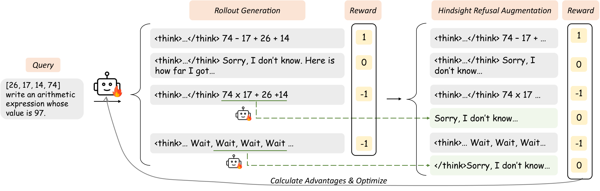

# HF Daily Papers 摘要 · 2026-08-14 当日第三跑

- **Date:** 2026-08-14 10:5x UTC（ISO W33 第三份 08-14 digest；承接同日 02:05 的 [[2026-08-14-hf-daily-papers-aug13-14]] 与 03:19 的 [[2026-08-14-hf-daily-papers-aug14b]]，**距上一次 7.5 小时**）
- **一句话:** ⭐⭐⭐ **12 篇真新增里最接主线的两篇是 0▲ 和 1▲ ——「Knowing When to Quit」给「模型知道自己不行时会怎样」建了完整诊断（vanilla 模型拒答率 0%、过度自信是过度保守的 6 倍、futile reasoning 里 57–68% 是「看起来对但有细微错」），SKILLER 则测出「为强模型写的技能会让小模型变差」，而两篇加上 AutoPrune 三个互不相干的领域收敛到同一个表示选择：只生成对一个强基线的有界残差修改。**

## ⭐⭐⭐ Context：第三个读数把今早那个「倾向解释」证实了

**08-14 桶今天被读了三次，这是我第一次拿到日内三点读数:**

| 时刻 (UTC) | 08-12 桶 | 08-13 桶 | ⭐ **08-14 桶（当日）** |
|---|---:|---:|---:|
| 02:05（第一跑） | 23 | 27 | **3** |
| 03:19（第二跑） | 23 | 27 | **11** |
| ⭐ **10:50（本次）** | **23** | **27** | ⭐ **24** |

> ⭐⭐⭐ **把两段速率算出来，结果正好支持我今早标为「倾向解释」的那个假设:**
>
> | 区间 | 时长 | 新增 | ⭐ **速率** |
> |---|---:|---:|---:|
> | 02:05 → 03:19 | 1.25 h | +8 | ⭐ **6.4 篇/h** |
> | ⭐ 03:19 → 10:50 | 7.5 h | +13 | ⭐ **1.7 篇/h** |
>
> ⭐⭐ **凌晨那段的速率是白天这段的 3.8 倍。** 我今早写的是「倾向解释是恰好落在 UTC 凌晨投稿密集窗口，不是任何 75 分钟都有 8 篇」—— ⭐ **本次的第三个读数直接支持了它**：如果填充在一天里是均匀的，两段速率应当接近；实测差 3.8 倍。
> ⚠️ **但仍然只有一天的日内曲线（n=1）。** 我能说的是「08-14 这一天的填充前重后轻」，不能说「每天都如此」。⭐ **要变成通则需要连续几天在同样三个时刻取读数**，而现有两个 cron（07:57 / 17:41）都不覆盖凌晨。
> ⭐⭐ **08-12 桶（第 5、6 次读数）与 08-13 桶（第 4、5 次读数）两次都完全不动 ⟹ 收敛确认，之前那条「前一天及更早的桶在次日已收敛」成立。**

### ⭐⭐ 去重：两个口径差 1，而这个 1 本身有信息

| 口径 | 数字 |
|---|---:|
| **A. 对比 03:19 那次抓取的 61 个 id** | ⭐ **13** |
| **B. 对比最近 8 份 digest 的 70 个已引用 id** | **12** |

> ⭐⭐⭐ **差的那一篇是 `2608.12313` AVA-Encoder，而它是一个干净的「日期桶回溯」实例:我在 08-13 那份 digest 里已经写过它（当时 0▲、落在 08-13 桶），现在它带着 4▲ 重新出现在 08-14 桶里。**
> ⭐ **所以正确的说法是「12 篇从未被覆盖 + 1 篇旧论文回溯重现」**，本份正文按 12 篇写，AVA-Encoder 只在此处记一笔不重复解读。
> ⭐⭐ **这正是 CLAUDE.md 里「HF 日期桶会回溯含旧论文，必须对照最近数份 digest 累计去重」那条规则的用处** —— 如果只对照上一次抓取（口径 A），它会被当成新的。⭐ **两个口径都要算，因为它们回答的是不同问题：A 是「桶里新出现了什么」，B 是「我还没写过什么」。**
- ⚠️ **日期上限 guard:** 拉 08-15 返回错误对象（声称上限 `2026-08-14T00:00:00.000Z`，却能取到 08-14 全天 24 篇）—— **连续第五天既生效又不准**。实用结论不变：每次都拉、靠 `isinstance(d, list)` 兜住。

## 12 篇真新增（全列）

| # | arXiv | 标题 | ▲ | arXiv 日期 | 主题 |
|---:|---|---|---:|---|---|
| 1 | [2608.13489](https://arxiv.org/abs/2608.13489) | **DreamX-Phi 1.0：机器人操作的动作条件视频世界模型** | **75** | 08-13 | 世界模型/具身 |
| 2 | [2608.06867](https://arxiv.org/abs/2608.06867) | ⭐⭐ **LLMRouter：开发、评估与部署 LLM 路由器的统一基础设施** | **55** | ⭐ 08-07 | **路由/成本** |
| 3 | [2608.11752](https://arxiv.org/abs/2608.11752) | UniSwap：说话视频的流式音视频身份替换 | 10 | 08-13 | 多模态生成 |
| 4 | [2608.11745](https://arxiv.org/abs/2608.11745) | LiveAnimate：实时稳定的长时流式人体动画 | 9 | 08-13 | 多模态生成 |
| 5 | [2608.07193](https://arxiv.org/abs/2608.07193) | ⭐⭐ **AutoPrune：视觉 token 剪枝的 AI4AI 框架** | 6 | ⭐ 08-07 | **算法自动设计** |
| 6 | [2608.13049](https://arxiv.org/abs/2608.13049) | ⭐ **H2R-Bench：世界模型里的人→机器人操作视频生成基准** | 5 | 08-13 | 评估/具身 |
| 7 | [2608.10538](https://arxiv.org/abs/2608.10538) | ⭐⭐⭐ **SKILLER：小模型可复用技能抽取的语言级强化学习** | ⭐ **1** | 08-11 | **harness/技能** |
| 8 | [2608.12997](https://arxiv.org/abs/2608.12997) | PixSDS：为什么潜空间 SDS 会产生噪点像素 | 0 | 08-13 | 生成/3D |
| 9 | [2608.13430](https://arxiv.org/abs/2608.13430) | ⭐ **你确定你确定吗？指令微调对置信度与词汇多样性的影响** | 0 | 08-13 | 校准 |
| 10 | [2608.12773](https://arxiv.org/abs/2608.12773) | ⭐ **CW-BASS v2：基础模型教师下的饱和感知伪标签选择** | 0 | 08-13 | 半监督 |
| 11 | [2608.11951](https://arxiv.org/abs/2608.11951) | TailBooster：带运营有效性强制的极值增强双层生成框架 | 0 | 08-12 | 表格/极值 |
| 12 | [2607.29211](https://arxiv.org/abs/2607.29211) | ⭐⭐⭐ **Knowing When to Quit：诊断并训练 LLM 中止无效推理** | ⭐ **0** | ⭐ **07-31** | **可靠性/RL** |

> ⭐⭐⭐ **连续第七次「upvote 与相关性弱相关」，且这次比昨天更极端：本份两篇深读一个 0▲ 一个 1▲，而 0▲ 那篇（CaRL）的 arXiv 日期是 07-31 —— 在 arXiv 上挂了整整两周才进 HF 桶。**
> ⭐ **另一个观察:回溯进本桶的三篇（LLMRouter 08-07、AutoPrune 08-07、CaRL 07-31）恰好是本份内容最扎实的三篇之一二三。** ⚠️ 我不认为这是规律（n=1 天、且我的挑选本身有偏），但**它说明「只看当日新投稿」会系统性错过这批**。
- **另有 1 篇回溯重现:** [`2608.12313` AVA-Encoder](https://arxiv.org/abs/2608.12313)（08-13 那份已覆盖，当时 0▲ → 现 4▲）。

---

## ⭐⭐⭐ Deep Dive 1：Knowing When to Quit / CaRL（0▲）—— 给「模型知道自己不行时会怎样」建了完整诊断

**[arXiv:2607.29211](https://arxiv.org/abs/2607.29211)** · 中科院软件所中文信息处理实验室 + 腾讯微信 AI · cs.CL，07-31
⚠️ **抓取说明:** HF `.md` 端点返回 **270 字节退化响应**（标题是 `all_models_trajectory_brown_baseline.svg`）＝**连续第四天**踩到这个坑 → 走降级链取 arXiv HTML v1（53,938 字符）。⚠️ 配图也**不是** `x{N}.png` 命名（是 `fig1.png` / `method.png` / `case.png` / `figure/repeat1.png`）＝**连续第五天**，需从 HTML 的 `src` 属性提取实际文件名。

**为什么这篇 0▲ 值得整篇深读:** 它给我追了两周的一个现象起了名字、做了分类学、量化了不对称性，并给出一个**训练侧**的解法 —— 而我此前收集的所有对策都在检测与闸门那一侧。

### 1. ⭐⭐ 现象:futile reasoning（无效推理）

*图 1：DeepSeek-R1 的两个行为区间。左＝能力范围内，正常推理。⭐ **右＝超出能力范围：模型在 [1,5,6,8,9] 上凑 0.3，尝试 T 轮后写下 `6/(5×(9−(8−1)))` 并声称等于 0.3 —— 而它实际等于 0.6**（论文正文明确点出这一点）。（arXiv HTML v1，fig1.png）*

> ⚠️⚠️ **一处我自己核出来的、论文没说的问题（不影响任何结论，但值得记）:图 1 左边那个被标为「Correct! ✓」的示例本身对不上** —— Given [3,5,10,25]、Target **78**，而它的三步是 `25×3=75`、`10−5=5`、`75+5=`**80**，最终答案 `25×3+10−5` = **80 ≠ 78**。⭐ **这只是一张示意图、不进任何实验结果**，但它恰好就是这篇论文所描述的那种错误——**扫一眼完全合理、逐步验算才发现对不上**。⭐ 我记这条不是为了挑刺，而是因为它是一个现成的例子：**「看起来对」这件事对人类审阅者的欺骗性有多强，连一篇专门讲这个的论文的插图都没躲过。**

**核心定义:** futile reasoning ＝ 模型面对超出自身能力的问题时，产生的**看起来合理但根本错误**的推理尝试。⭐ **作者对「理想行为」的表述很克制，我认为这个界定是对的:「模型应当在困难问题上尝试推理，但在推理若干步后意识到解不可得时中止并明确拒答」** —— 不是「不会就别答」，而是「试过之后要能停」。

**测试床是 Countdown 任务（Game of 24 的变体），N=3 到 N=8 分级。** ⭐ 选它的理由写得清楚：**把推理能力与知识检索解耦**，难度可精确操纵且不引入外部知识这个混淆因素。

### 2. ⭐⭐⭐ 三个现象，每一个都有一个我可以直接引用的数字

**① Universal Capability Overreach（普遍性的能力越界）** —— 5 个模型（Qwen3-8B / Qwen3-32B / gpt-oss-120b / Qwen3-235B-A22B / DeepSeek-V3.2）× 两种设定（Baseline 与显式提示鼓励承认无知）：

| 发现 | 数值 |
|---|---|
| ⭐⭐⭐ **vanilla 模型的拒答率** | ⭐ **所有难度上都是 0%** |
| ⭐ 即便显式提示，最难任务上仍未能阻止的无效尝试 | ⭐ **超过 80%** |
| Qwen3-8B 在 N=8 上的错误率 | 超过 65%（而拒答率气泡仍然微不可见） |
| ⭐ **gpt-oss-120b** | ⭐ **即便在提示设定下也顽固地不拒答** |
| ⭐ Qwen3-235B-A22B 与 DeepSeek-V3.2 | 有**潜在的**拒答能力，可被提示有效激发 |
| ⭐⭐ **DeepSeek-V3.2** | ⭐ **是唯一一个在 baseline 设定下表现出自发自我怀疑痕迹的模型（且仅 <1%）** |

> ⭐⭐ **图 2 的可视化设计值得学:横纵轴放错误率与难度，而把拒答率编码成数据点的半径。** ⭐ 「理想模型应当在错误率上升时气泡显著变大」是一个一眼可读的判据，而实测**所有气泡在高错误率下都保持微小**。

**② 失效模式的分类学与分布** —— 三类：

| 模式 | 定义 | ⭐ 随难度的变化 |
|---|---|---|
| ⭐⭐ **Specious Reasoning（似真推理）** | 构造出表面连贯但含细微错误的推导（算术错、重复用数） | ⭐ **57–68%，各难度都是主导** |
| **Endless Generation** | 不断提出新尝试、不承认无解，穷举组合 | 稳定 30–40% |
| **Degenerate Repetition** | 陷入递归循环，重复相同推理步骤 | ⭐ **13% → 2%（下降）** |

> ⭐⭐⭐ **这里有一句我认为是全篇最重要的话:「when pushed beyond capability, models do not degenerate randomly; instead, they fabricate increasingly sophisticated justifications to maintain a facade of correctness」** ——**被推到能力之外时，模型不是随机退化，而是编造越来越精巧的理由来维持正确的门面。**
> ⭐⭐ **而支撑它的是那个分布的方向:难度上升时，模型从简单循环（易被察觉）转向似真推理（难被察觉）。** ⭐ **也就是说越难的任务上，失败越隐蔽** —— 这与「监控在最需要它的时候最不可靠」是同一个形状。

**③ 能力-行为错配（Capability Quadrants）** —— 按「多次采样准确率 >0.5 判为可解」把行为分四象限：A 理想回答 / B 过度保守（可解却拒答）/ C 过度自信（不可解却回答）/ D 理想拒答。分析 Qwen3-32B：

| 量 | 数值 |
|---|---|
| ⭐⭐⭐ **过度自信 vs 过度保守** | ⭐ **20% vs 3.4% ＝ 6 倍不对称** |
| ⭐ 随难度上升，**Refusal Recall**（不可解任务里正确拒答的比例） | ⭐ **100% → 30% 崩塌** |
| ⭐ 同时 **Capability Loss**（可解任务里被误拒的比例） | ⭐ **0% → 10% 上升** |

> ⭐⭐⭐ **6 倍不对称这个数字的含义是「模型系统性高估自己的能力，而不是表现出随机的不确定性」** —— ⭐⭐ **这对我很有用，因为它把「模型不知道自己不知道」从一个定性抱怨变成了一个有方向、有量级的偏差。**
> ⭐⭐ **而 Refusal Recall 与 Capability Loss 同时恶化这一点也很重要:naive prompting 施加的是一个「均匀位移」，于是「在最难的任务上保护不足、同时又伤害了本来能解的任务」** ⟹ ⭐ **这解释了为什么「加一句 prompt 让它承认不会」不管用：它移动的是一个全局阈值，而问题需要的是随难度变化的判断。**

**④ ⭐⭐⭐ 计算成本 —— 这一条与我此前记的两处独立观察撞上了**

> ⭐⭐ **原文:Over-Confidence 的 token 长度分布是「平坦且有明显长尾」，而两类拒答行为（Ideal Refusal 与 Over-Conservative）是「尖锐的峰」＝决断性终止；⭐ Over-Confidence 生成的 token 是恰当拒答的 2–3 倍。**
> ⭐⭐⭐ **这是「失败比成功更耗资源」这个观察的第三次独立出现，且三次的层次都不同:**
>
> | 出处 | 形式 |
> |---|---|
> | **SWE-Bench ProMax**（08-11） | **失败的尝试消耗的轮数明显多于成功的**（unproductive exploration）→ 步数超出成功分布本身即可作早期失败信号 |
> | **SPIEval**（08-12） | **79% 失败源于信息定位不准**——「宁可承诺一个看似合理的错答案，也不继续检索去核实」 |
> | ⭐ **CaRL（本份）** | ⭐ **token 层面：过度自信生成 2–3× tokens，且分布形状可区分（平坦长尾 vs 尖峰）** |
>
> ⭐⭐⭐ **合起来可以下一个比任何单篇都强的操作性结论：「本次运行消耗的资源相对成功分布的位置」是一个不依赖模型自我报告的失败信号，而且它在轮数、检索行为、token 长度三个粒度上都被独立观察到。** ⭐ 这对我一直在说的「不能信自我报告」是个正面补充——**这个信号完全在外部可测。**
> ⚠️ **保留：三处的任务与设定完全不同**（SWE agent / 个人信息检索 / 算术凑数），所以我说的是「同一形状反复出现」，不是「同一个阈值可以搬用」。

### 3. ⭐⭐⭐ 机制：问题的根因在奖励函数里，而这个陈述极干净

*图 2：CaRL 的两个组件 —— Capability-Calibrated Reward Shaping（建立「拒答优于幻觉」的偏好层级）与 Hindsight Refusal Augmentation（把失败轨迹转成拒答轨迹）。（arXiv HTML v1，method.png）*

> ⭐⭐⭐ **根因陈述（原文）：标准推理 RL 对正确答案给 1、错误答案给 0，于是「对错误答案与拒答给了同样低的奖励，把它们当作等价的失败」⟹「这就没有给模型任何激励去区分『尝试』与『拒答』，因而鼓励了无效推理——因为生成看起来合理但错误的输出不受任何惩罚」。**
> ⭐⭐⭐ **我认为这是本篇最该记的一句:「模型倾向于编造似真输出」不需要用「模型想骗人」来解释，它是奖励函数把「错」和「不知道」判为同分的直接后果。** ⭐⭐ **而这与我 08-13 记的 apparent-success-seeking、08-14 早间的「修辞 reward-hack AI 评审」构成一个梯度**：那两篇是「优化压力导致污染测量」，这篇是**「奖励结构的一个缺省选择导致模型不肯停」** —— ⭐ **同一族，但这一篇的根因最浅、最容易修。**

**① Capability-Calibrated Reward Shaping** —— 把奖励改成三档：

$$r(c) = \begin{cases} +1 & c\ \text{正确} \\ \ \ 0 & c\ \text{是有效拒答} \\ -1 & c\ \text{错误} \end{cases}$$

⚠️ **「有效拒答」由显式拒答片段识别**（如 "Sorry, I can't solve the problem."）—— ⭐ **这是一个字符串匹配判据，我要标出来**：它简单可复现，但原则上可被表面模仿（说了拒答的话却仍给出答案），论文未讨论这一点。

**② ⭐⭐ Hindsight Refusal Augmentation（HRA）** —— 解决数据稀缺：

> ⭐ **动机很清楚:§3.4 测出 baseline 拒答率是 0%，说明「恰当拒答落在模型自然行为分布之外很远的地方」⟹ 纯 on-policy 探索需要不可承受的采样量才能碰到足够的拒答样本，光有奖励结构不够。**
> ⭐⭐⭐ **关键观察（原文）:「every failed reasoning attempt implicitly reveals a situation where refusal would have been the appropriate action」——每一次失败的推理尝试都隐含地揭示了一个「拒答本该是正确动作」的情形。**

具体做法：对每条得 −1 的错误轨迹，**保留到最终答案步之前的推理轨迹**，插入拒答前缀（"Sorry, I cannot solve this problem. Here is how far I got:"），再让模型生成一段对已尝试进展的简短总结，赋予 r=0 并**与原失败轨迹一起放进同一个训练 batch**。

> ⭐⭐ **这构成一个对比学习信号:在导致失败的同一个推理上下文下，模型学到选择拒答（r=0）比坚持到错误结论（r=−1）奖励更高。** ⭐ **「同一上下文」这个控制是这个设计的要点**——不是教它「难题就拒答」，而是教它「在这个具体的推理状态下，继续下去不如停」。
> ⭐⭐⭐ **这个「把失败改写成正确行为的示范」的手法我认为可迁移**：任何「本应停下却继续」的失效（agent 该问人却自己动手、该报告不确定却给结论）都可以用同样的方式把失败轨迹转成监督信号，**因为失败本身就标记出了正确动作应当发生的位置**。⚠️ 我的推断，论文只做了拒答这一种。

### 4. 结果：CaRL 有效，而两个对照的失败方式比 CaRL 的成功更有信息量

**Qwen3-8B / Qwen3-14B，in-distribution = Countdown（N=4,6,8 各 1,000 训练 / 100 评测），OOD = 100 道数独。**
⭐ **选数独作 OOD 的理由写得好:它需要的推理链显著更长，故可作压力测试——检验模型是「保持稳健推理」还是「一遇到高计算成本就塌缩成过度拒答」。**

| 指标 | 定义 |
|---|---|
| Accuracy | $N_c/N$ |
| ⭐ **Reliability** | $(N_c + 0.5N_r)/N$ ——正确 1.0、拒答 0.5、错误 0 |
| ⭐⭐ **Futile Rate** | $N_i/(N_i+N_r)$ ——⭐ **分母只含失败，即「在失败里，多少是无效推理而非拒答」**（不受准确率影响，我认为这个定义很干净） |

**核心结果（相对 vanilla）:**

| 模型 | futile rate | reliability |
|---|---|---|
| **Qwen3-8B** | ⭐ **65.5% → 7.00%** | 0.7915（+0.13） |
| ⭐ **Qwen3-14B** | ⭐⭐ **78.6% → 1.00%（−77.6）** | ⭐ **0.8348（+0.16）** |

> ⭐ 「larger models benefit more from capability-aligned training」（14B 的改善幅度大于 8B）。

**⭐⭐⭐ 但两个对照的失败方式更值得记:**

| 对照 | 结果 | ⭐ 我的读法 |
|---|---|---|
| ⭐⭐⭐ **Standard RL**（只优化准确率，正确 +1 / 其余 −1） | ⭐ **在 8B 上准确率提升，但把 futile reasoning 灾难性地推到 99%**；在 14B 上准确率与可靠性双双下降 | ⭐⭐⭐ **「naive RL optimization exacerbates over-confidence」＝只优化准确率会把「知道何时停」这个能力主动破坏掉** ⟹ 这是「优化一个指标会把另一个打坏」在**训练目标层**的干净实例 |
| ⭐⭐⭐ **RFT**（拒绝采样微调） | in-distribution 尚可，**OOD 灾难性塌缩**；⭐ **作者给该单元格加了 † 注:「RFT 在 OOD 上的低 futile rate 是塌缩成几乎全拒答的平凡结果（Ref > 90%、Acc = 0%）」** | ⭐⭐⭐ **这是作者自己在表格里标注「这个好看的数字是靠退化手段得到的」** —— ⭐⭐ **我这两周反复记的「一个数掩盖一个结构」在这里被论文作者主动堵掉了，而且是用一个脚注就堵掉的。这是本份第一个方法学正面样本，且成本极低、完全可抄。** |
| ⭐⭐ **RL_unk**（只用奖励重整、无 HRA） | **8B 上仍维持 98–99% futile rate**；14B 上有改善但仍远差于 CaRL | ⭐ **消融明确：奖励重整本身不够，HRA 是小模型上承重的那一半** —— 与 §4.2 那个「0% 拒答率意味着拒答在自然分布之外很远」的分析自洽 |

**⭐⭐ 跨难度的泛化与效率（Qwen3-8B，Table 2）:**

| 方法 | L4 futile / 长度 | L6 futile / 长度 | L8 futile / 长度 |
|---|---|---|---|
| RL_unk | 95.8 / 2,240 | 99.7 / 4,948 | 98.4 / 7,042 |
| ⚠️ **RFT** | 2.8 / 2,327 | 14.4 / 6,476 | ⚠️ **20.4 / 9,133** |
| ⭐ **CaRL** | ⭐ **2.0 / 1,804** | ⭐ **5.6 / 4,188** | ⭐ **8.1 / 6,156** |

> ⭐⭐ **RFT 的 futile rate 从 L4 到 L8 涨了 7 倍（2.82% → 20.36%）＝「监督学习无法外推到更难的任务」**，而 CaRL 是 1.96% → 8.12%。⭐ **这是「拒答该在什么时候发生」这件事上「记住模式」与「内化边界」的区别，而难度轴恰好是能把两者分开的探针。**
> ⭐ 效率：**CaRL 约省 33% token**，而 RFT 反而产出最长的回答（L8 上 9,133 token）＝「冗长的失败」。

**⭐⭐ 通用任务上没有付出大代价（Qwen3-8B，Table 3）:**

| 基准 | Acc | Reliability | ⭐ 长度 |
|---|---|---|---|
| **AIME 2024** | 75.40 → 74.60（**−0.8**） | 0.7542 → 0.7854（+3.1） | ⭐ **14,788 → 12,411（−16.1%）** |
| **GPQA** | 59.85 → 58.33（**−1.5**） | 0.5985 → 0.6768（**+13.1**） | ⭐ **7,506 → 5,620（−25.1%）** |

> ⭐⭐ **这张表的形状是「准确率略降（<2%）、可靠性明显升、token 大幅降」** —— ⭐ **对部署来说这是个好交换，但要注意它是一个交换而不是纯赢**，⚠️ 而准确率那 0.8 / 1.5 分的降幅是否显著无法判断（**只报均值、未报区间或种子**——本份第二次遇到我这两周反复抱怨的那件事）。
- ⭐ 另一个附带发现：参数变化（mean abs diff > 1e-5）**主要集中在第 31–35 层**，作者据此认为 CaRL「修改的是决策机制而未破坏基础推理能力」。⚠️ 这是关联证据不是因果。

### 5. ⭐⭐⭐ Case study 里有一句话，给我那个「监控失效栈」加了性质全新的一项

> ⭐⭐⭐ **原文（§5.7，Countdown level=8）:baseline「exhibits recursive hallucination: despite internally detecting errors, it repeatedly outputs "Final Correct Answer" followed by invalid expressions, revealing a disconnect between error detection and generation control」** ——**尽管在内部检测到了错误，它仍反复输出「Final Correct Answer」并跟上无效表达式，暴露出错误检测与生成控制之间的断裂。**

**我的「监控失效栈」此前七项的共同点是「读不准 / 读不到 / 没东西可读」。这一项不同:**

| # | 层 | 失效性质 |
|---|---|---|
| 1 | 读自述（OSReward 裁判 69.7%） | 读错 |
| 2 | 读 CoT（task gaming 无预谋） | 没有可读的预谋 |
| 3 | 读激活探针（概念性失明） | 读出通路坏了 |
| 4 | J-Space 监控（汇总 AUC 0.55） | 主题探测器不是测谎仪 |
| 5 | CoT 可被窃取（加密块跨模型兼容） | 保不住（⭐ 已修复） |
| 6 | 没有可读 artifact（BDH-CQ 不 verbalize） | 干脆不存在 |
| 7 | monitoring lifetime | 监控器会因被用于训练而失效 |
| ⭐⭐⭐ **8** | ⭐ **本份:检测与生成脱钩** | ⭐⭐ **模型内部检测到了错误，但输出与该检测相反** |

> ⭐⭐⭐ **第 8 项的性质是新的:前七项都是「监控方拿不到可靠信号」，这一项是「信号在模型内部存在，而模型自己的输出否认它」。**
> ⭐⭐⭐ **而它恰好是 [[tech-blogs/2026-W33d]] 那条 J-Space 结果的镜像:** J-Space 测出**模型对自己的激活几乎一无所知**（report-first 那臂 322 次准确报告 → 0 次，而目标概念在模型内部仍可解码）；⭐ **本篇是反过来——模型在自己的推理里显式检测到了错误，却仍输出「Final Correct Answer」。**
> ⭐⭐ **两者合起来的图景:「模型内部状态」与「模型的输出陈述」之间的连接在两个方向上都不可靠——有信号时输出可能否认它，没信号时输出可能凭空报告它。** ⟹ ⭐⭐⭐ **含义很实际：不要把「模型说了什么」当作「模型内部有什么」的证据，无论朝哪个方向。** 这与我 08-13 从 Runtime Contract 记的「验证器可访问外部参考状态但没有 agent 内部状态的访问权」在定义层面是同一件事的两侧。
> ⚠️ **保留:「internally detecting errors」是作者对一个案例的描述，我没有看到对「内部检测」的独立测量**（比如探针或 logit 证据）。⭐ **所以我把它记为「一个有强提示性的单案例观察」，不是与 J-Space 同等级的实验结果。**

### 6. ⚠️ 我要标出的保留

| 保留 | 说明 |
|---|---|
| ⭐⭐ **作者自陈的范围限制** | 「为干净地把能力边界与知识边界分开，我们聚焦 Countdown 与数独，它们是纯算法推理任务、不需要外部知识」；⭐ **而「真实应用常常涉及知识密集任务，两种边界交织在一起」，作者明确把开放域 QA 与数学推理列为未来工作** ⟹ ⭐ **本篇的结论目前只能读作「在纯推理任务上成立」** |
| ⚠️ **样本量与重复** | 每个难度 100 条评测样本、OOD 100 道数独；**未报种子数或区间** |
| ⚠️ **拒答判定是字符串匹配** | 「有效拒答由显式拒答片段识别」—— 简单可复现，但原则上可被表面模仿，论文未讨论 |
| ⚠️ **我未读的部分** | 附录 A（数据集示例）、附录 B（三类 futile reasoning 的完整例子）、附录 C（实现细节）；⭐ Figure 2/3/4/5/6 我只读了正文对它们的描述，没有逐图核对数值 |

---

## ⭐⭐⭐ Deep Dive 2：SKILLER（1▲）—— 「为强模型写的技能会让小模型变差」，以及自我改进循环断在哪的第三种答案

**[arXiv:2608.10538](https://arxiv.org/abs/2608.10538)** · 上海 AI Lab / 武大等（Chenhao Dang, Siyuan Xiong, Conghui He, Weijia Li）· 08-11
⭐ HF `.md` 端点正常（68,455 字节）。

**为什么这篇 1▲ 值得深读:** 它的问题陈述给我追了两周的 harness 主线加了一个**此前没有的轴**——不是「harness 对任务敏感」（Evo-Bench / AI4AI / DarwinX 都在这个轴上），而是 **harness 组件对执行者的模型规模敏感，而且方向可以是负的**。

### 1. ⭐⭐ 问题：model-mismatch

> ⭐ **它对 agent skill 的界定与 Anthropic 的框架对齐:「an agent skill is not merely a prompt, but a standardized format for packaging procedural knowledge, tool-use conventions, and domain expertise」**，而在 agent harness 系统里，技能的作用是「持续约束模型的行为空间，从而确保复杂任务以可重复、高质量的方式执行」。
> ⭐⭐⭐ **核心诊断（原文）:「Skills crafted for strong frontier models do not natively transfer to small-scale LVLMs. The behavioral constraints, implicit reasoning steps, and error-recovery assumptions that successfully guide a massive model are often completely ineffective for a compact model.」**
> ⭐⭐ **具体的失效方式说得很实:小模型会「轻易幻觉出参数、跳过必要的验证步骤、或被含多个分支路径的过于复杂的指令带偏」。**

⭐⭐⭐ **而实验结果把「无效」升级成了「有害」:**

> ⭐⭐⭐ **原文:「human-authored skills and generic skills generated by systems such as Manus frequently yield suboptimal gains or even DEGRADE performance compared to standard automated evolution baselines」**，机制解释是这些技能「隐含地假设了宽裕的推理容量、宽的上下文容忍度与稳健的错误恢复能力」，注入紧凑模型后「引发认知过载并触发严重的参数幻觉」。
> ⭐⭐ **零样本迁移那一节还给了一个更硬的版本:在 GAIA 上 Manus 与 SkillX 的技能都掉到了「无技能基线」以下。**
> ⭐⭐⭐ **这对我的 harness 主线是一个实质性补充。我此前记的三次「收益极不均衡」（Evo-Bench 的 Office 几乎不动 / AI4AI 的 MMToM-QA 不如人工 / DarwinX 的 Security −1）都是沿任务轴的；⭐ 本篇是沿执行者轴的，而且负号更明确：一个帮助强模型的 harness 组件可以让弱模型比什么都不加更差。**
> ⟹ ⭐⭐ **可操作含义：harness/skill 是「模型-harness 配对」的一半，不是可独立评价的资产。** ⭐ 这与 08-11 记的 Macaron-V1「带版本的 model-harness 配对」是同一判断的两种得法，⭐⭐ 也给 A²E 那条「报 agent 分数不写 scaffold 等于没报」加了对称的一句：**报 skill/harness 的效果不写执行者也等于没报。**

### 2. ⭐⭐ 机制：把文本技能当作可优化的策略

| 组件 | 做法 |
|---|---|
| **策略** | ⭐ **文本技能本身**（不更新任何神经网络权重） |
| **actor + critic** | ⭐ **一个前沿模型**（GPT-5.5 或 Claude Opus 4.8） |
| ⭐⭐ **环境** | ⭐ **由目标开源小模型驱动的 agent loop** |
| 上下文控制 | ⭐ **progressive skill disclosure**（渐进式技能披露），防止紧凑模型被长文本上下文压垮 |
| ⭐ **信号载体** | ⭐⭐ **状态、诊断奖励、策略更新动作全部以结构化自然语言传播** |

> ⭐⭐⭐ **注意这个配置是「他建」——强模型给弱执行者造 harness 组件。而我昨天在 [[2026-08-14-hf-daily-papers-aug13-14]] 记 SHAPER 时提的缺口正是这个：SHAPER 是「自建」（同一个冻结模型既当 planner 又当 optimizer），而 AI4AI 恰好测出自建的增益明显低于他建（Cursor 自建 +0.217 vs 他建 +0.266；Codex 自建 +0.168 vs 他建 +0.314），我当时写「换更强 builder 会怎样未测」。**
> ⭐⭐ **SKILLER 就是那个「他建」版本 —— 所以 24 小时内我拿到了同一问题的两种配置。** ⚠️ **但这不是一次受控对比**：SHAPER 是具身、SKILLER 是软件/信息任务，基准与执行者都不同，**所以我只能说「两种配置都被做出来了」，不能说「他建更好在这里得到了确认」。**

### 3. ⭐⭐⭐ 成本-性能：这张图是「配好 harness 的便宜模型 > 配一般 harness 的贵模型」目前最锐的形式

*图 3：SkillsBench 单技能任务上的通过率 vs 输出 token 报价（对数轴）。⭐ **Qwen3.5-9B + SKILLER ≈ 74% @ 约 $0.15，而 Opus 4.7 Max + curated skills ≈ 69.6% @ $25 —— 标注为「167× cheaper, +4.4 pp」**；Qwen3.5-4B + SKILLER ≈ 42% @ 约 $0.07，比 Haiku 4.5（≈52.2% @ $5）「71× cheaper」。⭐⭐ **另注意灰色那条 Claude 前沿线是折的：Sonnet 4.5（≈47.8% @ $15）低于 Haiku 4.5（≈52.2% @ $5）**。（arXiv HTML v1，x1.png；数值为我从图上读取）*

> ⭐⭐⭐ **「便宜 167× 且高 4.4 分」是我这两周收集的「成本买不到分数」里最极端的一个数据点。** 此前的四个层次是：ProMax 的 GLM-5 用 1/20 成本拿 94% 分数、Evo-Bench 的 $1→$500 是 500× 而只差 7.2 分、A²E 的 smolagents 花 3.5× token 换 1.04× correctness、AI4AI 的「给小模型配好 harness 比换大裸模型更有效」。⭐ **本篇是第五个，而且是唯一一个同时做到「更便宜」与「更好」的。**
> ⭐⭐⭐ **而图里那个折点（Sonnet 4.5 < Haiku 4.5，且贵 3 倍）本身就是本篇论点的旁证**：如果技能能跨模型迁移，同家族更强的模型不该被更弱的比下去。⭐ **论文的图注也正是这么用它的**（「as in the case of Haiku 4.5 outperforming Sonnet 4.5」）。⚠️ 但那个观察转引自 Li et al. 2026（SkillsBench 原文），我未核实。
> ⚠️⚠️ **一个必须标清的口径问题:x 轴是「Output Price (USD per 1M generated tokens)」，也就是厂商报价，不是实测的每任务花费。** ⭐⭐ **所以「167×」是价目表比值，不是「跑完这批任务省了 167 倍钱」** —— 后者还取决于两边各生成多少 token，而图里没给 token 数。⭐ **这与我在 BDH-CQ 那篇标出的「成本口径不一致（自算硬件成本 vs 他人 API 报价）」是同一类问题，读法应当是「单价上的上界」。**
> ⚠️ **另两处:①这是 SkillsBench 的单技能任务子集**（图标题明说）**②对比不是「同一套技能」**：Qwen 侧用 SKILLER 优化过的技能，Claude 侧用 curated skills。⭐ **这正是论文的论点（技能应当为执行者定制），但它意味着这张图不能被读成「9B 比 Opus 强」，只能读成「9B+定制技能 在这个子集上 比 Opus+通用技能 强」。**

**⭐⭐⭐ 而主结果里还有一个更干净的对照:**

> ⭐⭐⭐ **原文:Qwen3.5-4B 装上 SKILLER 后，在 SWE-Skills-Bench 上的通过率超过了更大的 Qwen3.5-9B 装上人写技能、AutoSkill、EvoSkill、SkillX 甚至 Manus 生成技能时的表现。**
> ⭐⭐ **同一个模型家族内、4B 打败 9B**，作者的结论是「对于结构化的真实任务，一个约束住易错倾向的、优化过的自然语言策略，比单纯的参数规模扩张更有价值」。
> ⭐ **这比图 3 那个跨厂商比较更有说服力，因为它控制住了模型家族与训练数据。**

### 4. ⭐⭐⭐ 消融：自我改进循环断在哪，这篇给了第三种答案

**① 状态组件消融**（状态 $s_i = (\mathbf{x}, \tau_i, \tau^\star, \mathbf{v}_i)$ ＝任务实例 / 当前轨迹 / 参考成功轨迹 / verifier 诊断，Qwen3.5-9B，⭐ **三次运行均值**）：

| 发现 | 原文要点 |
|---|---|
| ⭐⭐ **接地对（grounding pair）远比精化项重要** | 去掉 $\mathbf{x}$ 或 $\tau_i$ 造成的损害显著大于去掉 $\tau^\star$ 或 $\mathbf{v}_i$ |
| ⭐⭐⭐ **为什么** | ⭐ 「A successful reference or verifier outcome cannot by itself identify a useful edit: **$\mathbf{x}$ 规定执行者必须满足什么，而 $\tau_i$ 暴露当前技能实际如何塑造了它的行为。两者合起来把反馈变成一个以任务为条件的错误信号，而不是通用建议**」 |
| ⭐⭐⭐ **过程证据 > 结果反馈** | ⭐ 去掉参考轨迹比去掉 verifier 诊断更有害 → 「**evidence about the execution process offers a richer target for localized edits than outcome feedback alone**」 |
| ⭐ **边界** | GAIA 在每种消融下退化都较轻 → 信息搜寻类任务即便缺一个状态信号，仍能从「广泛适用的搜索流程」里保留部分效用 |

> ⭐⭐⭐ **「过程证据比结果反馈更有改进杠杆」这一条与 A²E 那个发现构成一个漂亮的配对，而且它们讲的是两件不同的事:**
>
> | | A²E（08-11） | ⭐ **SKILLER（本份）** |
> |---|---|---|
> | 结论 | ⭐ **过程指标才有分辨率**（Fig 6a：`correctness`/`task_succeeded` 一片淡色，而 `tool_invocation`/`hallucination`/`plan_completeness` 偏离显著） | ⭐ **过程证据才有改进杠杆**（去掉参考轨迹比去掉 verifier 结果更有害） |
> | 用途 | 用于**测量** | 用于**改进** |
>
> ⟹ ⭐⭐ **合起来：过程信息在「看得见差异」和「改得动行为」两件事上都优于结果信息。** ⭐ 这给我一直在说的「只报最终成功率等于没报」加了第二个理由——**不只是分辨率问题，还是可改进性问题。**

**② ⭐⭐⭐ Critic prompt 消融**（四个操作：评估当前执行 / 对比观察与参考轨迹 / 定位最早的因果错误 / 生成有界的技能修改）：

> ⭐⭐⭐ **原文:「The dominant failure after removing Generation suggests that translation is the critic's decisive function. Evaluation, comparison, and localization can expose a defect, but the learning loop improves only when the diagnosis becomes a bounded edit to the textual policy. Without this operation, rollout evidence remains descriptive and cannot alter the behavior that produced the failure.」**
> ⭐⭐⭐ **也就是说:承重的那一步不是「发现问题」，而是「把诊断翻译成一个有界的编辑」。**

**⭐⭐⭐ 而这给了我一个可以直接用的三分解 —— 三篇论文各自把「自我改进循环断在哪」定位在不同的一步:**

| 论文 | 断点 | 它的对策 |
|---|---|---|
| **Evo-Bench**（08-11） | ⭐ **识别** —— 分不清 4.3 分差距是真实还是噪声（自测噪声底 2.2 分），于是把真改进当噪声扔掉 | （只诊断，未给对策） |
| **DarwinX**（08-14 早） | ⭐ **保留** —— 「local wins often regress other tasks」、「不让运气累积」 | preserve-and-extend 契约 + 两速信任门 + 多样档案 |
| ⭐ **SKILLER（本份）** | ⭐⭐ **翻译** —— 诊断若不变成有界编辑，rollout 证据就只是描述性的 | critic 的第四个操作（生成有界修改）＋ actor 的有界编辑操作 |

> ⭐⭐⭐ **我认为这个三分解比任何单篇都有用，因为它把「自我改进为什么不 work」从一个笼统抱怨变成三个可分别检查的环节：能不能识别出改进 / 能不能留住它 / 能不能把诊断变成动作。** ⚠️ **三篇互不引用，这个归纳是我的。** ⭐ 而它也解释了为什么这三篇的对策看起来毫不相干却都有效——**它们修的是不同的环节。**
- ⭐ Critic 的另两个操作也有说法：**对比**把搜索缩到有意义的分歧上，**定位最早错误**「劝阻 actor 去修下游症状」——⭐ 「软件任务里，一个很晚才出现的测试失败可以源自更早的文件、工具或验证流程选择」。
- ⭐ 同样的 GAIA 边界：「a critic can reshape the search policy, but it cannot supply missing facts」。

**③ ⭐⭐ Actor 的四个操作里有一个叫「preserve effective skill content」（保住有效的技能内容）** —— ⭐⭐⭐ **这与 DarwinX 的 preserve-and-extend 是同一个设计意图的两个独立实现，而两篇互不引用。**

### 5. ⚠️ 保留

| 保留 | 说明 |
|---|---|
| ⭐ **重复次数报了，区间没报** | 全篇 Table 2 / Table 5 / Fig 3 都是**三次运行均值** —— ⭐ **这比我这两周批评过的 Evo-Bench（只跑一次）好**，⚠️ **但仍然只报均值不报区间** |
| ⚠️ **未找到 Limitations 一节** | 我在全文里搜 "Limitation" 无命中 ⟹ ⭐ **与 CaRL、DarwinX 相比这是个缺项**（那两篇都有明确的自我限定节） |
| ⚠️ **具体数字我未逐表核对** | 摘要称相对四个基线「绝对增益 4.3 到 20.4 个百分点」，但 **Table 1 的表体在我取到的 markdown 里没有渲染成可读数值**，所以正文里我只引用了论文的文字表述与图 3 |
| ⚠️ **基线的实现细节未核** | EvoSkill / AutoSkill / SkillX / Manus 四个基线我只知道名字，**未核实它们是否被同等调优** |
| ⚠️ **我未读的部分** | 方法节的形式化、Table 1 的具体数值、附录 C（actor prompt 消融）的结论、学习动态（Fig 3）的具体曲线 |

---

## 其余 10 篇

### ⭐⭐ 「让 LLM 自动设计算法」的第三个实例，而它把表示选择的理由说得最清楚

- ⭐⭐ **[AutoPrune：视觉 token 剪枝的 AI4AI 框架](https://arxiv.org/abs/2608.07193)（6▲，arXiv 08-07）** —— ⭐ 诊断：视觉 token 剪枝能大幅降低 MLLM 推理成本，但既有方法「largely rely on fixed, handcrafted heuristics and costly expert trial and error」，而随着剪枝目标、token 预算与模型架构日益多样，**人工穿越这个膨胀的设计空间越来越难**。核心问题被表述为「**LLM 能否自动设计有效的视觉 token 缩减算法？**」
  ⭐⭐ **而它对「难点在哪」的回答是表征问题，不是能力问题:**「LLM 拥有广泛的算法知识，而视觉 token 剪枝是一个专门的设计问题，其有效性取决于 token 打分、预算分配、受约束选择与重组的协调 …… 关键在于设计一个合适的**搜索状态表示**，把 LLM 的内部知识与该任务的结构性要求和约束连接起来。」
  **做法：** 一个 training-free 框架，核心是 **Token Pruning DSL（TPDSL），含 131 个可复用原子**（预算控制 / token 打分 / 选择约束 / token 重组）。
  > ⭐⭐⭐ **TPDSL 的关键性质是「把每个搜索状态表示为对一个强基线策略的残差修改（residual modification）」，而理由给得很明确:「This residual formulation narrows the search space and directs the LLM's attention toward the policy components that are most consequential for performance.」**
  **结果：** 14 个多模态基准 × 3 个 MLLM backbone；⭐ **移除 94.4% 视觉 token 时仍保住全 token 性能的 >99%，FLOPs 降 9.9×、prefill 延迟降 6.4×**；在 94.4% 剪枝率下比 CDPruner 高 3.2/2.4 分、比 PruMerge+ 高 8.9/7.9 分（LLaVA-1.5-7B / LLaVA-NeXT-7B）。
  ⚠️ 我只读了摘要与引言，未读 TPDSL 的具体设计与搜索流程。

> ⭐⭐⭐ **本份最强的跨论文观察（我认为比任何单篇重要）:三篇互不引用、领域完全不同的论文收敛到同一个表示选择——不要从头生成，只生成对一个强基线的有界修改。**
>
> | 论文 | 被优化的对象 | 那个「有界修改」叫什么 |
> |---|---|---|
> | ⭐ **DarwinX**（08-14 早） | agent harness | **preserve-and-extend 契约**（`g(c)>0` 且 `R(c)≤δ`，子代必须在某任务上改进且不放弃亲代已解的） |
> | ⭐ **SKILLER**（本份） | 文本技能 | ⭐ critic 的 **bounded skill modification** ＋ actor 的 **bounded edit operations** ＋ **preserve effective skill content** |
> | ⭐ **AutoPrune**（本份） | 剪枝算法策略 | ⭐ **residual modification to a strong base policy** |
>
> ⭐⭐⭐ **而只有 AutoPrune 把理由讲透了：① 缩小搜索空间 ② 把 LLM 的注意力导向最有后果的那些组件。** ⭐⭐ **反过来看，这也给 DarwinX 的「不让运气累积」补了一个互补的解释——「有界」既是为了安全（不破坏已有能力），也是为了搜索效率（不浪费在无关组件上）。**
> ⚠️ **三篇互不引用，这个归纳是我的。** ⭐ 但我认为它是一个可以直接用的设计判据：**下次看到任何「让 LLM 自动设计 X」的方案，先问它的搜索状态是「完整的 X」还是「对一个强基线的有界差分」** —— 如果是前者，三篇的经验都提示它会更慢且更容易退化。

### ⭐⭐ 路由成为独立的基础设施品类

- ⭐⭐ **[LLMRouter：开发、评估与部署 LLM 路由器的统一基础设施](https://arxiv.org/abs/2608.06867)（55▲，arXiv 08-07）** —— ⭐ 前提陈述很干脆：「**没有单一 LLM 在所有查询与预算约束下都最优，因此模型路由对成本有效的部署是必需的**」；而问题是既有路由器「采用各异的形式化与实现，使公平比较与扩展变得困难」。
  ⭐⭐ **贡献是一个统一形式化:把 LLM 路由建模为一个序贯决策过程，由五个组件刻画——context encoders / model encoders / scoring functions / decision rules / learning signals**，覆盖单轮、多轮与个性化路由。基于此建了自动流水线来构造路由监督并**联合按响应质量与推理成本评估**路由器；基准 **xRouteBench** 跨通用 LLM、记忆增强、视觉、时序与个性化路由任务；开源 **LLMRouter** 含 **16+ 个代表性路由器**。
  **三条实证结论：** ⭐ **学习型路由器相对最强的固定模型基线相对提升 14.6%**；⭐ **轻量路由器在紧成本约束下更具竞争力**；⭐ 用户条件化路由持续改善个性化。
  > ⭐⭐⭐ **把它放进本周的时间线看才有意义:** [[tech-blogs/2026-W33d]] 记了 **NVIDIA NeMo Switchyard**（跨模型路由 agent 负载），[[tech-blogs/2026-W33f]] 记了 **Databricks Smart Routing**（低 30%+ 每任务成本匹配前沿质量）—— ⭐⭐ **两家产品化在同一周出现，而本篇是同一件事的学术基础设施层（统一形式化 + 基准 + 16 个实现）。**
  > ⭐⭐ **含义：「成本买不到分数」这条主线在本周长出了完整的三层——现象（多篇实测）、产品（NVIDIA/Databricks）、基础设施与基准（本篇）。** ⭐ 而本篇那个五组件分解可以直接当作评估路由方案的检查表。
  > ⭐ **另一处与 SKILLER 的呼应:两篇都在回答「如何不花前沿模型的钱拿到接近前沿的效果」，但路径正交——一个换模型（路由），一个约束行为（技能）。** ⚠️ 没人测过两者叠加。
  ⚠️ 我只读摘要。**「14.6% 相对提升」的基线定义、xRouteBench 的规模与是否报区间均未核实。**

### ⭐ 校准与「教师饱和」：两篇小论文，但都指向我在追的东西

- ⭐ **[你确定你确定吗？指令微调对置信度与词汇多样性的影响](https://arxiv.org/abs/2608.13430)（0▲）** —— 指令微调模型已被指出表现出**言述化的过度自信**（verbalized overconfidence）。本文问：模型置信度的变化是否伴随着**答案理由（rationale）词汇多样性**的相应变化？三对匹配的 base / instruction-tuned 模型 × 多个 QA 基准：⭐ **指令微调一致地改变了答案置信度，尽管预测准确率变化有限、且基于似然的校准变差**；⭐⭐ **对 rationale 多样性的影响是非均匀的——cross-rationale 多样性一致下降，而表面词汇多样性在不同模型与基准上方向与幅度都不同**；控制了答案选择与 rationale 长度后差异依然存在，**确认置信度与 rationale 多样性刻画的是指令微调的两个不同效应**。
  > ⭐⭐ **与本份深读 CaRL 是同一问题的两个位置：CaRL 测「模型该拒答时不拒答」（行为层），本篇测「模型的言述置信度与其理由多样性如何被指令微调改变」（表达层）。** ⭐ **两篇合起来支持一个判断：过度自信不是单一现象，而是至少有行为（不肯停）与表达（说得太确定）两个可分离的成分，而指令微调会同时动这两者且方向不一定一致。**
  > ⭐ **另一处:「cross-rationale 多样性一致下降」与我今早在 tech-blogs 记的 Anthropic 多 agent「低方差导致系统性失效」是同一形状的更早阶段** —— ⚠️ 但那是多 agent 间的方差，这是同一模型多次采样的理由间方差，**我不把它们当同一个证据，只记形状相似**。⚠️ 仅摘要。
- ⭐ **[CW-BASS v2：基础模型教师下的饱和感知伪标签选择](https://arxiv.org/abs/2608.12773)（0▲）** —— ⭐ 它的框架陈述我很喜欢：半监督语义分割长期围绕「该信任哪些伪标签」，而**一整代选择规则（动态阈值、按类课程、软置信度加权）是为它们那个时代的、噪声大且信心不足的 ResNet 教师回答这个问题的**；⭐⭐ **自监督基础模型编码器改变了这个体制：用 DINOv2 教师时置信度会饱和，于是「帮助弱教师的过滤反而会伤害强教师」**。
  做法是**读教师的置信度体制而不是承诺某一条规则**：用留出校准得到无偏的每类噪声估计 + 一个可证明地把保留率约束在远离 1 的自适应置信度下限，合成一个单遍 gate —— ⭐ **在留出片上测量教师自信集的可靠性 $\pi_{kept} = \Pr[\text{correct} \mid c \ge \tau]$，达到要求就严格过滤，否则退到自适应下限**。⭐ **边界是既存的操作阈值，不是对着 mIoU 调出来的值**，且跨六个 DINOv2 教师**盲判**都做出了正确的严格/下限选择。
  > ⭐⭐⭐ **两点值得记:①「为弱教师设计的规则会伤害强教师」与本份 SKILLER 的「为强模型写的技能会伤害弱模型」是同一个结构的镜像——都是「一个组件的有效性取决于它所服务的那个模型处在什么体制」**，⭐⭐ **合起来支持一个更一般的说法：任何过滤/约束组件都必须报它假设的教师（或执行者）体制，否则它的迁移性无法判断。**
  > ⭐⭐ **②「边界是既存的操作阈值，不是对着 mIoU 调出来的值」＝作者主动声明该阈值没有被目标指标污染** —— ⭐ 这正是 Gaming Without an Attacker 那条「探针只在未被披露且不可枚举的轴上保持测量有效性」的自觉版本。⭐ **本份第二个方法学正面样本。**
  ⚠️ 结果里有一处作者自标的弱点：ADE20K 上下限方案领先 **+1.5 mIoU** 但是 **single seed**。⚠️ 仅摘要。

### ⭐ 世界模型与具身：一个强发布 + 一个基准

- **[DreamX-Phi 1.0](https://arxiv.org/abs/2608.13489)（75▲，本份最高）** —— 动作条件视频世界模型：给一帧观测、一条语言指令与一段规定的动作序列（末端执行器位姿 + 夹持器状态），预测后续观测。⭐ **它对「realism ≠ faithfulness」的表述很准:「一段令人信服的 rollout 仍然可能动错手臂或丢掉被操作的物体」**。三个机制：**per-arm SE(3) 变换经 PRoPE 式几何编码注入注意力**以保持手臂身份与刚体运动结构；轻量深度分支管场景几何；**SAM3 掩码 + 冻结的 V-JEPA teacher** 维持抓取全程的物体一致性；再用分布匹配蒸馏把多步生成器蒸成少步学生。⭐ WorldArena 2.0 挑战赛 Track 1 第一、Track 2 第二。⚠️ 仅摘要。
- ⭐ **[H2R-Bench](https://arxiv.org/abs/2608.13049)（5▲）** —— 评估**跨形态的人→机器人操作视频生成**：把第一人称人类演示转成指定形态下的机器人操作视频。每个实例含人类演示视频、目标形态约束、以及**源接地的标注**（任务目标 / 动作事件 / 功能性接触 / 物体响应）；五个维度评分（目标状态完成 / 动作事件完成 / **功能性接触迁移** / **形态正确性** / 通用视频质量）。11 个 SOTA 视频生成模型 × 6 个操作族 × 2 种机器人形态。⭐ **结论是负面的：当前视频世界模型在人→机器人迁移上仍受限，即便领先模型也常在形态正确性上失败。**
  > ⭐ **与昨天 PlayWorld 的「评测世界模型不能用固定动作序列」放一起看：两篇都在给世界模型建更严的尺子，而方向互补——PlayWorld 加「带长程目标的交互」，H2R-Bench 加「跨形态迁移 + 源接地的分维度标注」。** ⚠️ 仅摘要。

### 流式生成（同一组作者的两篇）与其余

- **[UniSwap](https://arxiv.org/abs/2608.11752)（10▲）** —— ⭐ **首个流式的音视频联合身份替换**框架：在单个音视频 diffusion transformer 里同时迁移参考外观与音色，保住源内容与动态。⭐ 针对跨身份配对数据稀缺，用 **swap-and-reconstruct** 流水线（先从真实片段里移除视觉与声音身份，再用原片段作重建目标）。渐进适配三步：In-context Pretraining → **Conditional Streaming Adaptation**（block-causal + KV cache）→ **Efficient Self-forcing DMD**（缓解暴露偏差、每块采样从 30 步降到 3 步）；**Efficient Multi-LoRA Switching** 让三个 DMD 角色共享单个冻结骨干；**Feature-RoPE Decomposition** 把缓存位置保持在训练范围内以支持稳定长时推理。
- **[LiveAnimate](https://arxiv.org/abs/2608.11745)（9▲）** —— 14B 视频 DiT 上的实时长时流式人体动画。⭐ **PR-Sink（Pose-Retrieval Sink Attention）是有界 KV cache 机制：Static Sink 永久锚定第一个生成块 + Dynamic Sink 持有一个按姿态检索到的历史块 + 三槽滚动窗口** —— ⭐⭐ **「当某个姿态复现时，PR-Sink 恢复相关的外观上下文而无需保留整个序列，故内存与每块延迟不随流长度变化而保持恒定」**。两张 H100 上 **19.63 FPS**。
  > ⭐⭐ **这两篇的共同技术形状值得单独记：都是「把无界历史换成有界的、按需检索的缓存」，而这与昨天 Alaya-EVOKE 的「把持久世界状态外置到以相机为索引的 world state bank、使 denoiser 上下文有界」是同一个设计。** ⭐⭐⭐ **三篇（两组作者）在两天内给出同一答案 ⟹「长时流式生成」这个子领域已经收敛到「有界缓存 + 检索」这个解法结构上**，⭐ 而它与 LLM 侧的记忆工作（LycheeMemory V2 的「成本不随对话增长」）是同一问题在两个模态的表达。⚠️ 均仅摘要。
- **[PixSDS](https://arxiv.org/abs/2608.12997)（0▲）** —— ⭐ 诊断一个具名失效：潜空间 SDS 的伪影来自 **VAE 诱导的像素漂移**——「优化中的图像可以沿着被 VAE 编码器弱约束的像素空间方向移动，于是**它的潜表示保持干净且语义有意义，而图像本身却在累积可见的伪影**」。⭐ 用受控 2D SDS 实验 + 仅 VAE 的优化 + 简化分析支撑该诊断。PixSDS 解码一个 lookahead 步、用解码图像作为像素空间优化的干净方向。
  > ⭐⭐ **「在被监控的那个表示里一切正常，而真正要交付的那个东西在恶化」——这与我这两周的主线（优化一个代理指标会把它打坏）是同一结构，而这一篇的版本最物理:代理是潜空间，真实是像素，而两者之间的映射欠约束。** ⭐ 我记它是因为**它给这条主线加了一个非常直观的类比**，讲给工程师时可能比任何 agent 例子都快。⚠️ 仅摘要。
- **[TailBooster](https://arxiv.org/abs/2608.11951)（0▲）** —— 航空运输极值事件（严重到达延误、异常空中时间）的合成数据增强：统计层用四分位距抽取极值供专门的生成模型（Tabular VAE）训练，深度学习层用自编码器清洗、**丢弃违反从历史数据学到的运营包络的合成记录**（例如「短空中时间配长飞行距离」）。五维度评估（多样性/统计相似性/保真度/**运营有效性**/效用）。
  > ⭐ **「生成的样本必须通过一个不由生成器控制的有效性检查」＝我 08-13 从 Articulated Object 那篇记的「几何一致性验证器是不可被生成器优化的外部约束」在表格数据上的同一做法**，⭐ 而这里的外部约束是**领域的运营包络**。⚠️ 仅摘要；⭐ 与你关注的金融/风险方向相邻（极值建模、尾部样本不足）。

---

## 趋势分析

### 1. ⭐⭐⭐ 「只生成对强基线的有界修改」成为一个跨领域的表示选择

三篇互不引用（DarwinX / SKILLER / AutoPrune），对象分别是 harness、技能、剪枝算法，都选了同一个搜索状态表示。⭐ **而 AutoPrune 给出了理由（缩小搜索空间 + 把注意力导向最有后果的组件），DarwinX 给出了另一个理由（不让运气累积、有界回退）。**
> ⭐⭐ **我认为这条比本份任何单篇都值得记，因为它是一个可以立刻用来审别人方案的判据。** 详见上文 AutoPrune 那节的表。

### 2. ⭐⭐⭐ 「自我改进循环断在哪」现在有三个可分别检查的环节

**识别（Evo-Bench）→ 保留（DarwinX）→ 翻译（SKILLER）。**
> ⭐⭐ **三篇的对策看起来毫不相干，但如果按这个分解看就清楚了：它们修的是不同环节。** ⭐ 而这也给了我一个检查任何自进化方案的顺序：**先问它怎么识别改进（有没有噪声底的概念）、再问它怎么决定保留（有没有重验）、最后问它怎么把诊断变成动作（编辑是不是有界的）。**
⚠️ 三篇互不引用，归纳是我的。

### 3. ⭐⭐⭐ 「过度自信」被从两侧同时刻画，而根因比我以为的浅

| 侧 | 本份证据 |
|---|---|
| ⭐ **行为侧** | **CaRL**：vanilla 拒答率 **0%**、过度自信是过度保守的 **6 倍**、似真推理占 futile 的 **57–68% 且随难度上升** |
| ⭐ **表达侧** | **Are You Sure You're Sure?**：指令微调一致改变言述置信度而准确率变化有限、似然校准变差；cross-rationale 多样性一致下降 |

> ⭐⭐⭐ **而 CaRL 给的根因让我意外地乐观:「标准推理 RL 把错误答案与拒答判为同分，于是没有任何激励去区分两者」** —— ⭐⭐ **这不需要用「模型想骗人」来解释，也不需要新的监控技术，改奖励函数的一档就有 65.5%→7.0% 的效果。**
> ⭐ **对比我这两周记的其他「测量被污染」案例（Gaming 的实例指纹、修辞 reward-hack、evaluator exploitation），这一个的根因最浅、最容易修** ⟹ ⭐⭐ **含义：这一族问题不是同质的，应当按「根因深度」分层处理，先修奖励结构层面的缺省选择，再谈需要新机制的那些。**

### 4. ⭐⭐ 「失败比成功更耗资源」第三次独立出现，且这个信号完全外部可测

轮数（ProMax）→ 检索行为（SPIEval）→ ⭐ **token 长度分布形状（CaRL：过度自信 2–3× tokens、平坦长尾 vs 拒答的尖峰）**。
> ⭐⭐⭐ **这是我这两周所有「不能信自我报告」记录里少见的正面消息：存在一个不依赖模型自述、完全在外部可测的失败信号，而且它在三个不同粒度上被独立观察到。** ⚠️ 但三处设定差异大，**我说的是同一形状反复出现，不是同一阈值可搬用**。

### 5. ⭐ 抓取层面的两条连续记录

- ⚠️ **HF `.md` 端点退化响应连续第四天**（本次 270 字节、标题是个 svg 文件名）
- ⚠️ **深读论文的配图不是 `x{N}.png` 命名连续第五天**（本次是 `fig1.png` / `method.png` / `case.png` / `figure/repeat1.png`）
> ⭐ **两条都已经稳定到应当把「先探测再下载」当默认步骤，而不是当兜底。** ⚠️ SKILLER 与 AutoPrune 的 `.md` 是正常的，所以退化不是全站性的——**只能逐篇探。**

## Open Questions

- ⭐⭐⭐ **CaRL 的做法能不能搬到 agent 任务上？** ⭐ 它的核心是「把每次失败改写成『在同一上下文下拒答』的示范」，而 agent 侧有大量结构同型的失效（该问人却自己动手、该报告不确定却给结论、该停下却继续调工具）。⭐⭐ **我认为这是本份最有迁移价值的一条，因为它不需要新的监控能力，只需要在训练数据里把失败轨迹改写一次。** ⚠️ 但 agent 任务里「什么算有效拒答」比算术题难界定得多，而 CaRL 的判定是字符串匹配。
- ⭐⭐⭐ **CaRL 的 case study 说「模型内部检测到了错误却仍输出 Final Correct Answer」——这个「内部检测」能不能被独立测量？** ⭐ 如果能（用探针或 logit 证据），那么它与 J-Space 那个「模型对自己激活一无所知」的结果就构成一个可对照的实验对；⭐⭐ **如果测出来「错误信号在激活里可解码但输出否认它」，那第 8 项失效就与第 3 项（探针失败在读出通路）合并成同一个机制**。⚠️ 目前我只有一个单案例描述。
- ⭐⭐ **「过程证据 > 结果反馈」（SKILLER 消融）与 A²E 的「过程指标才有分辨率」是不是同一件事的两面？** ⭐ 若是，那么「记录过程」这件事的投资回报比我原先估计的更高（既提升可测性又提升可改进性）。⚠️ 两篇的实验对象不同，我目前只能说形状一致。
- ⭐⭐ **AutoPrune 那个「residual 表示」的收益能被单独消融出来吗？** ⭐ 它是本份三篇里唯一明确把 residual 表示当作核心贡献的，但**我只读了摘要，不知道有没有「非 residual 表示」的对照臂**。⭐ 若有，那是这条跨领域观察的第一个直接证据。列为下一份优先查项。
- ⭐⭐ **LLMRouter 与 SKILLER 叠加会怎样？** 两者都在回答「不花前沿模型的钱拿到接近前沿的效果」，但路径正交（换模型 vs 约束行为）。⚠️ 没人测过，而这恰好是客户侧最常问的那个组合。
- ⭐ **SKILLER 那个「为强模型写的技能会让小模型更差」在多大范围内成立？** ⭐ 论文给的是 Manus/SkillX 在 GAIA 上掉到无技能基线以下；⚠️ **但这依赖那些基线技能的具体质量，而我没核实它们是否被同等调优。** ⭐ 若成立，它对「把 CLAUDE.md / skills 从一个模型搬到另一个模型」这件日常操作有直接含义。

## References

**本份覆盖的 12 篇真新增（全部来自 08-14 桶）:**

| arXiv | HF | ▲ | arXiv 日期 |
|---|---|---:|---|
| [2608.13489](https://arxiv.org/abs/2608.13489) | [papers/2608.13489](https://huggingface.co/papers/2608.13489) | 75 | 08-13 |
| [2608.06867](https://arxiv.org/abs/2608.06867) | [papers/2608.06867](https://huggingface.co/papers/2608.06867) | 55 | 08-07 |
| [2608.11752](https://arxiv.org/abs/2608.11752) | [papers/2608.11752](https://huggingface.co/papers/2608.11752) | 10 | 08-13 |
| [2608.11745](https://arxiv.org/abs/2608.11745) | [papers/2608.11745](https://huggingface.co/papers/2608.11745) | 9 | 08-13 |
| [2608.07193](https://arxiv.org/abs/2608.07193) | [papers/2608.07193](https://huggingface.co/papers/2608.07193) | 6 | 08-07 |
| [2608.13049](https://arxiv.org/abs/2608.13049) | [papers/2608.13049](https://huggingface.co/papers/2608.13049) | 5 | 08-13 |
| [2608.10538](https://arxiv.org/abs/2608.10538) | [papers/2608.10538](https://huggingface.co/papers/2608.10538) | 1 | 08-11 |
| [2608.12997](https://arxiv.org/abs/2608.12997) | [papers/2608.12997](https://huggingface.co/papers/2608.12997) | 0 | 08-13 |
| [2608.13430](https://arxiv.org/abs/2608.13430) | [papers/2608.13430](https://huggingface.co/papers/2608.13430) | 0 | 08-13 |
| [2608.12773](https://arxiv.org/abs/2608.12773) | [papers/2608.12773](https://huggingface.co/papers/2608.12773) | 0 | 08-13 |
| [2608.11951](https://arxiv.org/abs/2608.11951) | [papers/2608.11951](https://huggingface.co/papers/2608.11951) | 0 | 08-12 |
| [2607.29211](https://arxiv.org/abs/2607.29211) | [papers/2607.29211](https://huggingface.co/papers/2607.29211) | 0 | ⭐ 07-31 |

**回溯重现（08-13 那份已覆盖，此处不重复解读）:** [2608.12313](https://arxiv.org/abs/2608.12313) AVA-Encoder（0▲ → 4▲）

⚠️ **需注明的核实局限:**

1. ⭐ **深读程度分三级:** **CaRL** 取到 arXiv HTML 全文（53,938 字符）并按节精读（§1、§2、§3.2–3.4、§4.1–4.2、§5.1–5.7、Limitations）；**SKILLER** 取到 HF markdown 全文（68,455 字节）并读了引言、Related Work 开头、Main Results、Zero-Shot、附录 A/B 的消融讨论；**AutoPrune** 取到全文但**只读摘要与引言**；⚠️ **其余 9 篇仅读 HF API 摘要。**
2. ⚠️ **CaRL 的 Table 1 我是从渲染后的纯文本片段读的**，8B 与 14B 的部分数值（尤其 8B 行的完整数字）我只拿到正文叙述里给出的那几个；⭐ **凡我不确定的都没有写进正文。**
3. ⚠️ **SKILLER 的 Table 1 表体在我取到的 markdown 里未渲染成可读数值**，所以正文只引用了论文的文字表述与图 3 的读数；⭐ **摘要声称的「4.3–20.4 个百分点」我照原文引用但未逐表核对。**
4. ⚠️⚠️ **图 3 的数值是我从图上读取的**（≈74% / ≈69.6% / ≈52.2% / ≈47.8% / ≈42%），⭐ **而「167× cheaper, +4.4 pp」与「71× cheaper」是图上的原始标注**。⚠️ **且 x 轴是每百万输出 token 的报价，不是实测每任务花费 —— 「167×」应读作单价上界，不是省钱倍数。**
5. ⭐⭐ **本份明确标为「我的推断/归纳」的地方:** 「有界残差修改」这条三篇共振（三篇互不引用）；「识别/保留/翻译」三分解（三篇互不引用）；「监控失效栈第 8 项」及其与 J-Space 的镜像关系；「过度自信有行为与表达两个可分离成分」；「失败更耗资源是外部可测信号」；「弱教师规则伤害强教师 ⊕ 强模型技能伤害弱模型是同一结构的镜像」。
6. ⚠️ **我自己核出的一处论文图示不一致（图 1 左侧「Correct ✓」示例算出 80 而 Target 是 78）**已在正文标明；⭐ **它是示意图、不进任何实验结果，我记它是作为「看起来对的错误有多难被发现」的例子，不作为对论文质量的判断。**
7. **图片 3 张：CaRL 的 `fig1.png` / `method.png`（arXiv HTML v1）+ SKILLER 的 `x1.png`。** ⭐ 已删掉下载但未引用的 `carl-case.png` / `carl-repeat1.png` / `skiller-x2.png`。
8. ⚠️ **入库状态见 commit message。**
