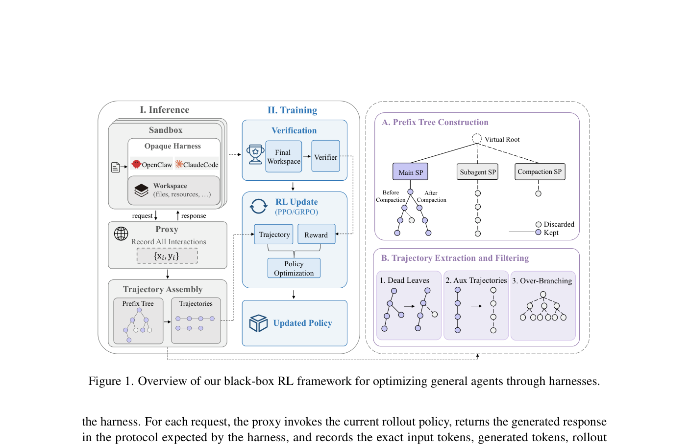
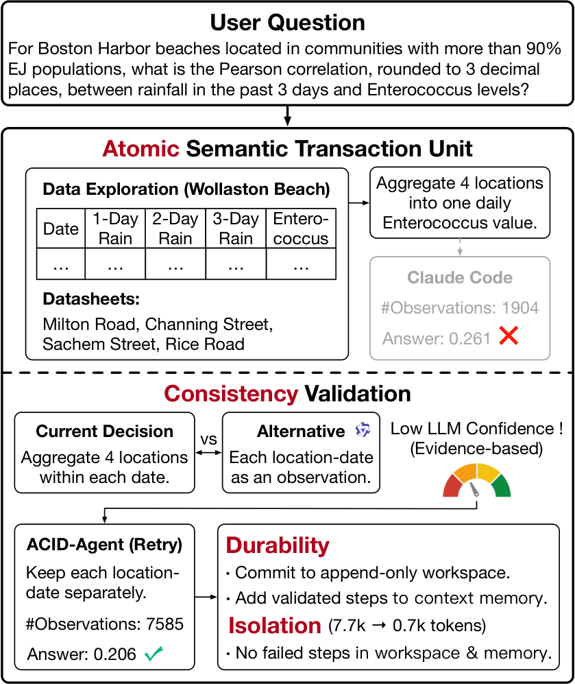
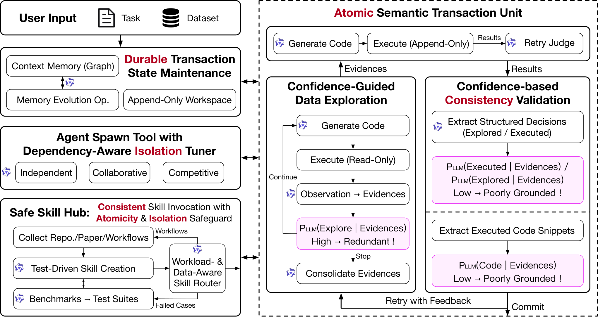

# HF Daily Papers 摘要 · 2026-08-14 → 08-18（跨周末 + 周一）

- **Date:** 2026-08-18 06:3x UTC（周二）· ⚠️⚠️ **距上一份 HF digest（[[2026-08-14-hf-daily-papers-aug14d]]，08-14 10:50）已 4 天** —— 这是一次**空缺补跑**，不是正常节奏
- **窗口:** 08-14 回填 + 08-15（周六）+ 08-16（周日）+ 08-17（周一）+ 08-18（周二）
- **一句话:** ⭐⭐⭐ **这个 4 天窗口异常地正中我上周 cross-digest 刚写完的两条 arc，而且是从两个我明确指出「缺」的方向补上的——ClawGym II 做「固定 harness、训练模型去用好它」（我此前记的七篇全是「冻结模型、改 harness」），Agentic Transaction 把 ACID 事务语义搬进 agent（给「证据面」换了一套已有五十年工程积累的词汇）。**

## ⚠️⚠️ Context 0：先记一件运维层面的事

**08-15 到 08-17 三天里，只有 AWS 日报有产出，HF / Reddit / tech-blogs 三个 digest 连续三天空缺。**

| 日期 | AWS | HF | Reddit | tech-blogs |
|---|:-:|:-:|:-:|:-:|
| 08-15（周六） | ✅ | ❌ | ❌ | ❌ |
| 08-16（周日） | ✅ | ❌ | ❌ | ❌ |
| 08-17（周一） | ✅ | ❌ | ❌ | ❌ |

> ⭐ **`CronList` 显示 6 个任务都还在**（未到期），所以这不是 CLAUDE.md 记的那个「到期即静默停跑」。⚠️ **但我从这里无法区分「触发了而会话没完成」与「没触发」** —— 两者在产出上完全一样，而这正是那条教训的核心：**静默失败在事后不可区分。**
> ⭐⭐ **可诊断的一点:AWS 那条（09:04）活着而 HF（07:57 / 17:41）、Reddit（08:13）、tech-blogs（08:22）三条都没产出** —— 四条 cron 时刻不同、AWS 是最晚的那条。⚠️ 我不知道这是否相关，记下来供后续观察。
> ⚠️⚠️ **代价:Reddit 与 tech-blogs 的 08-15～08-17 窗口已经不可完整补回** —— Reddit 的 top-of-week 榜单已经滚动（按我实测的节律，40 小时就换 74 帖），tech-blogs 的 RSS 窗口也已滑过。⭐ **HF 这一份能补回来，因为日期桶是按日期索引的、不随时间滑走** —— ⭐⭐ **这是三个数据源之间一个此前我没注意到的重要差别：HF 可回溯补抓，Reddit 与 tech-blogs 不可。**

## Context 1：桶读数与去重

| 日期桶 | 篇数 | 备注 |
|---|---:|---|
| **08-14（周五）** | ⭐ **31** | ⭐⭐ **第四个读数：3(02:05) → 11(03:19) → 24(10:50) → 31（四天后）** |
| **08-15（周六）** | ⭐ **0** | 空数组，非抓取失败 |
| **08-16（周日）** | ⭐ **0** | 空数组，非抓取失败 |
| **08-17（周一）** | **32** | |
| **08-18（周二）** | **25** | |

> ⭐⭐ **08-14 桶的第四个读数把回填曲线补完了:3 → 11 → 24 → 31。** 前三个读数都在 08-14 当天（凌晨速率 6.4 篇/h、白天 1.7 篇/h），⭐ **而「当天之后又涨了 7 篇」说明桶在自己那天结束后仍会继续填充**，与 08-11 桶（14→20→38→38 收敛）、08-12 桶（0→20→23→23 收敛）的形态一致。⭐ **粗略地说：当日拿到约 3/4，剩下 1/4 在之后几天补上。**
> ⭐⭐ **08-15/08-16 双双 0 篇 ＝ 周末空档第三次确认**（前两次是 08-08/08-09、08-09 前后）。⭐ **这条现在很稳，可以当作规律用。**
- ⚠️ **日期上限 guard 连续第六天既生效又不准**：拉 08-19 返回错误对象、声称上限 `2026-08-18T00:00Z`，却能取到 08-18 的 25 篇。**实用结论不变：每次都拉、靠 `isinstance(d, list)` 兜住。**

**去重:** 窗口唯一 **88 篇** / 对照最近 8 份 digest 的 **80 个已引用 id** → ⭐ **新增 65 篇**（08-14 桶 8 + 08-17 桶 32 + 08-18 桶 25）。
⭐ 因量大（65 篇），按工作流取 **Top 25 精选**，另在趋势一节提及若干未进 Top 25 但值得记的。

## ⭐⭐ Top 25 总览

| # | arXiv | 标题 | ▲ | 桶 / pub | 主题 |
|---:|---|---|---:|---|---|
| 1 | [2608.14391](https://arxiv.org/abs/2608.14391) | ⭐⭐ **RA-Bench：能防住针对真实危机事件的 AI 生成视频攻击吗？** | **262** | 08-17 / 08-14 | **来源可检测性** |
| 2 | [2608.14144](https://arxiv.org/abs/2608.14144) | **自监督视觉 on-policy 蒸馏** | **153** | 08-17 / 08-14 | OPD |
| 3 | [2608.13417](https://arxiv.org/abs/2608.13417) | ⭐⭐⭐ **Beyond Final Scores：长程 AI 研发 agent 的系统性评估** | **45** | 08-17 / 08-13 | **评估方法学** |
| 4 | [2608.15265](https://arxiv.org/abs/2608.15265) | VibeWorlding：多模态 agent 能端到端造 3D 开放世界吗 | 35 | 08-18 / 08-15 | 世界模型 |
| 5 | [2608.14290](https://arxiv.org/abs/2608.14290) | **Intern-S2-Mobius：知识与推理解耦的基础模型** | 31 | 08-17 / 08-14 | 架构 |
| 6 | [2608.11341](https://arxiv.org/abs/2608.11341) | **Apodex Discovery：面向发现的 Reality 基准与环境** | 31 | 08-17 / 08-11 | 评估/科研 agent |
| 7 | [2608.16859](https://arxiv.org/abs/2608.16859) | ⭐⭐⭐ **HarnessEval-W：把视觉世界的评估 agent 化** | 31 | 08-18 / 08-17 | **harness × 评估** |
| 8 | [2608.14277](https://arxiv.org/abs/2608.14277) | SimpleOPD：与 tokenizer 无关的长上下文 OPD | 28 | 08-17 / 08-14 | OPD |
| 9 | [2608.16798](https://arxiv.org/abs/2608.16798) | ⭐⭐⭐ **ClawGym II：在 agent harness 上做黑盒 RL** | 28 | 08-18 / 08-17 | **harness × RL** |
| 10 | [2608.14530](https://arxiv.org/abs/2608.14530) | Marionette：预测世界状态、渲染几何、绘制外观 | 24 | 08-17 / 08-14 | 世界模型 |
| 11 | [2608.15930](https://arxiv.org/abs/2608.15930) | UI-Mate：用上下文内演示推进开放权重 GUI agent | 23 | 08-18 / 08-16 | GUI agent |
| 12 | [2608.13517](https://arxiv.org/abs/2608.13517) | **DFM Mimir v1：1B 参数的开放 HRM 达到前沿表现** | 21 | 08-17 / 08-13 | 小模型 |
| 13 | [2608.13606](https://arxiv.org/abs/2608.13606) | **MobileMem：从一年的移动端经验里学习** | 20 | 08-17 / 08-11 | 记忆 |
| 14 | [2608.13900](https://arxiv.org/abs/2608.13900) | ⭐⭐⭐ **Agentic Transaction：走向 ACID 合规的 agent 系统** | 18 | 08-18 / 08-14 | **可靠性/证据面** |
| 15 | [2608.13040](https://arxiv.org/abs/2608.13040) | 潜空间 on-policy 自蒸馏 | 17 | 08-17 / 08-13 | OPD |
| 16 | [2608.13555](https://arxiv.org/abs/2608.13555) | HumanTracker：全面且与人对齐的运动追踪基准 | 15 | 08-17 / 08-13 | 评估/视觉 |
| 17 | [2608.16721](https://arxiv.org/abs/2608.16721) | ⭐ **GenRouter：agentic 图像生成的统一工作流路由** | 15 | 08-18 / 08-17 | **路由** |
| 18 | [2608.13391](https://arxiv.org/abs/2608.13391) | 上下文匹配蒸馏：自回归视频蒸馏里的教师因果性 | 14 | 08-14 / 08-13 | 蒸馏 |
| 19 | [2608.08020](https://arxiv.org/abs/2608.08020) | 思维级 beam search | 14 | 08-14 / 08-11 | 推理 |
| 20 | [2608.02870](https://arxiv.org/abs/2608.02870) | Maglev：滑动循环记忆 | 14 | 08-14 / 08-05 | 架构/记忆 |
| 21 | [2608.14546](https://arxiv.org/abs/2608.14546) | CPI-Bench：真实世界图像的综合实用基准 | 13 | 08-17 / 08-14 | 评估/视觉 |
| 22 | [2608.14284](https://arxiv.org/abs/2608.14284) | ⭐ **PRM-as-a-Judge 1.5：机器人过程评估工具包** | 12 | 08-17 / 08-14 | **过程评估** |
| 23 | [2608.13567](https://arxiv.org/abs/2608.13567) | ⭐ **大语言模型中涌现的模块化认知架构** | 12 | 08-17 / ⭐ **06-27** | 可解释性 |
| 24 | [2608.15304](https://arxiv.org/abs/2608.15304) | ⭐⭐ **理解 agentic AI 系统中由「认知」诱发的风险** | 12 | 08-18 / 08-15 | **安全** |
| 25 | [2608.16033](https://arxiv.org/abs/2608.16033) | ⭐⭐ **R³-Bench：LLM 在共享预算下不会做资源理性推理** | 11 | 08-18 / 08-17 | **资源/评估** |

> ⭐⭐ **两个结构观察:**
> ① ⭐ **本份 upvote 与相关性的关系比前几份正常** —— 最接主线的三篇分别是 45▲/31▲/28▲，都在中上部（前七份里连续出现「最重要那篇 0–4▲」）。⭐ **不过第 14 名的 Agentic Transaction 只有 18▲ 而我认为它是本份第二重要的。**
> ② ⭐⭐ **`2608.13567` 的 pub 日期是 06-27** —— 两个月前的论文回溯进 08-17 桶，是我见过跨度最大的一次回溯。⭐ 这再次说明「日期桶会回溯含旧论文」这条去重规则不是理论风险。
>
> ⚠️ **一处我要交代的编辑选择:严格按 upvote 排序的第 25 名是 [An Empirical Study of Training Pixel-Space Text-to-Image Diffusion Models](https://arxiv.org/abs/2608.16887)（12▲），而我把它换成了第 26 名的 R³-Bench（11▲）。** ⭐ 理由是工作流的选取判据是「upvotes × novelty × technical depth」而非纯 upvote，而 R³-Bench 直接回答我一条追踪中的主线（见趋势 §3）。⭐ **12▲ 那一档有 6 篇并列，所以第 25/26 名之间本来就没有实质区分度。** ⭐ 两篇都已入库。

---

## ⭐⭐⭐ Deep Dive 1：ClawGym II（28▲）—— harness 主线的对偶面：固定 harness，训练模型去用好它

**[arXiv:2608.16798](https://arxiv.org/abs/2608.16798)**（Huatong Song, Fei Bai, Ming Yang 等）· cs.CL，08-17
⚠️ **抓取说明:** HF `.md` 端点返回 **HF 页面 HTML** —— ⭐ **而这次征兆极清楚：`2608.16798` 与 `2608.13900` 两个完全不同的 id 拿到了完全相同的 52,630 字节**，正是 CLAUDE.md 记的那条判据。→ 改用 arXiv HTML（71,009 字符）。⚠️ **而 arXiv HTML 里一张图都没有**（`img src` 全为空），故 Figure 1 是**从 PDF 第 6 页渲染的**（降级链的第四级）。

### 1. ⭐⭐⭐ 为什么这篇填的正是我上周明确指出「缺」的那一格

**我上周 cross-digest 的 Arc 3 串了七篇 harness 论文（Evo-Bench / Co-Evolution / AI4AI / DarwinX / AutoDesign / SHAPER / SKILLER），⭐ 而它们有一个共同前提：模型冻结，改 harness。**

> ⭐⭐⭐ **本篇的问题陈述正好是反面，而且说得比我自己的表述更清楚:**
> **「Yet the benefits of increasingly capable harnesses depend not only on their design but also on how effectively the underlying model can leverage them. Even a strong model may perform poorly within a capable harness if it has not been suitably trained.」**
> ⟹ ⭐⭐ **也就是说「model–harness 配对」这件事有两个可动的旋钮，而我此前七篇记的全是同一个。**
> ⭐⭐⭐ **而它与 SKILLER 恰好构成一对精确的互补:SKILLER 发现「为强模型写的技能会让小模型更差」，解法是改技能去适配执行者；ClawGym II 的解法是训练执行者去适配 harness。同一个错配问题，两个相反方向的修法。**

⭐ **顺带记一句它给 harness 的定义，是我见过最完整的:** 「the foundational operating layer of autonomous agent systems」，整合 **system prompts、tool interfaces、context management、workflow orchestration、retry and recovery mechanisms** 到一个统一运行时。

**研究问题:** **How can black-box RL be performed through a harness to stably optimize general agents?**

### 2. ⭐⭐⭐ 机制：把 harness 当不透明的 rollout 引擎，只在模型边界观测

*图 1：黑盒 RL 框架。⭐ **左上「Inference」：沙箱里装着 Opaque Harness（OpenClaw / ClaudeCode）+ Workspace，通过 request/response 与一个 Proxy 交互，而 Proxy「Record All Interactions {xᵢ, yᵢ}」** → Trajectory Assembly（Prefix Tree → Trajectories）。⭐⭐ **右上「A. Prefix Tree Construction」显示树从 Virtual Root 分出三支：Main / Subagent / Compaction，而 Main 那支上标着「Before Compaction / After Compaction」的分叉**；空心圈=Discarded、实心=Kept。⭐ 右下「B. Trajectory Extraction and Filtering」三种情形：**Dead Leaves / Aux Trajectories / Over-Branching**。（PDF 第 6 页渲染）*

**三个被点明的基本挑战:**

| 挑战 | 原文要点 |
|---|---|
| ① **可扩展且稳定的基础设施** | 通用 agent 任务需要专用的**有状态**环境，大规模并发 rollout 压力大；⭐ 「For long-horizon tasks, runtime delays and failures can accumulate across interaction steps and **invalidate entire trajectories**」 |
| ② ⭐⭐ **从碎片化的黑盒轨迹里做策略优化** | ⭐ 「Black-box harnesses expose **fragmented, forked, and often redundant model calls** rather than complete interaction trajectories」；且不透明的内部操作会**放大训练-推理不一致** |
| ③ **跨异质 harness 的可扩展性** | harness 在交互协议、工具接口、上下文管理、执行工作流上差异很大 |

**⭐⭐⭐ 而它解决 ② 的那一步我认为是全篇最漂亮的:**

> **前缀树构造:** 一次 rollout 产生模型调用 $\mathcal{C}=\{(x_i,y_i)\}_{i=1}^m$（$x_i$ 是第 $i$ 次调用的输入上下文、$y_i$ 是响应）。树以初始任务提示为根，**每次调用挂到「其累积历史构成 $x_i$ 最长前缀」的那个已有节点上**。
> ⭐ 而 **「Context compaction or subagent execution may start a new segment from a shortened or alternative context」** —— 这就是图 1 里那三支分叉的来源。
> ⭐⭐⭐ **最关键的一句:「By comparing the input of a child call with the accumulated parent history and the recorded parent response, we also recover the intervening non-model content introduced by the harness, including tool outputs and other environment feedback.」**
> ⟹ ⭐⭐⭐ **也就是说：通过「子调用输入」减去「父历史 + 父响应」，可以把 harness 在中间注入的内容（工具输出、环境反馈）反推出来。** ⭐⭐ **含义对我很实际——即便 harness 完全不配合、完全是黑盒，只要能在模型边界记录 (输入, 输出) 对，就能重建出 harness 到底做了什么。**
> ⭐⭐ **这给我追的「harness 可观测性」提供了一条全新且不依赖厂商配合的通道，而它与我这两周的「不能信自我报告」主线是互补的：那条说「别信 agent 的自述」，这条说「你可以从调用边界的差分里自己算出来」。**

**⭐⭐ 轨迹过滤的三种情形（图 1 右下），每一种都是「harness 内部行为污染训练数据」的一个具体形态:**

| 情形 | 原文机制 |
|---|---|
| ⭐⭐ **Dead Leaves** | 「A single turn may be generated multiple times when the inference server retries a request or the harness regenerates an invalid response, ⭐ **as OpenClaw does after a malformed tool call**」→ 被取代的尝试留在树上成为死叶。⭐ 做法：按**上下文压缩点**把候选轨迹切成 segment，段内**只保留有最长有效延续的那个叶子** |
| **Over-Branching** | 树分出过多叶子时，「the rollout has typically entered repeated or failed generation rather than legitimate interaction branching」→ 整个 rollout 丢弃 |
| **Aux Trajectories** | 来自故障处理、上下文管理或子 agent 过程的叶子（非主任务求解过程） |

⭐ **训练-推理一致性**靠 **black-box token-in-token-out** 机制 + **token 级重要性采样 rollout 修正**。

### 3. ⭐⭐⭐ 结果：而最该记的是那张 2×2 交叉矩阵

**主结果（Qwen3-30A3B，ClawGym-Bench Pass@1）:**

| 穿过哪个 harness 训练 | 提升 |
|---|---:|
| **OpenClaw** | ⭐ **+9.98** |
| **Claude Code** | ⭐ **+14.81** |

> ⭐⭐⭐ **注意这两个数字的差异：同一个模型、同一个基准、同一套方法，只是穿过的 harness 不同，训练收益就差了近 50%。** ⟹ ⭐⭐ **这是 harness 效应的一个我此前没有的维度——不是「harness 影响推理时表现」（A²E / ProMax / OpenART 都测过），而是「harness 影响训练能拿到多少收益」。**
- ⭐ 并称在 200–400 优化步内保持稳定，且在更难的 **JobBench** 与 **OfficeQA** 上有一致增益。

**⭐⭐⭐ §4.6 的交叉矩阵（Table 2，ClawGym-Bench 平均分）:**

| 模型 | 在 **White-Box AgentLoop** 上评测 | 在 **OpenClaw** 上评测 |
|---|---:|---:|
| Qwen3-32B（未训练，dense） | 26.43 | 40.32 |
| **Qwen3-30A3B**（基线） | 41.69 | 45.11 |
| **ClawII-OC-30A3B**（在 OpenClaw 上黑盒 RL 训练） | 51.37 | ⭐ **62.62** |
| **WhiteBox-30A3B**（在 white-box agentloop 上训练） | ⭐ **59.90** | 50.33 |

> ⭐⭐⭐ **这是一个干净的对角优势矩阵：每个模型都在「自己训练时用的那个 harness」上最强。** 而两个可引用的量:
>
> | | in-loop 增益 | 跨 harness 迁移增益 | 迁移保留比例 |
> |---|---:|---:|---:|
> | **WhiteBox-30A3B** | +18.21（41.69→59.90） | ⭐ **+5.22**（45.11→50.33） | ⭐ **约 29%** |
> | **ClawII-OC-30A3B** | +17.51（45.11→62.62） | +9.68（41.69→51.37） | 约 55% |
>
> ⭐⭐ **作者的表述很规矩:「This transfer suggests that different harnesses share a common set of underlying agentic capabilities that can be acquired through white-box training. **However**, WhiteBox-30A3B still falls behind ClawII-OC-30A3B ... revealing that training under a simple white-box agentloop may still be **insufficient to fully capture the harness-specific interaction patterns** required by an unseen black-box system.」**
> ⟹ ⭐⭐⭐ **也就是说：「agentic 能力」确实存在一个跨 harness 共享的部分（迁移是真的），但 harness 特有的交互模式也确实存在且占比不小（约 71% 的增益不迁移）。** ⭐ **这给我上周从 DarwinX 得到的那个结论（「harness 会迁移，但迁移过去的增益比原地小得多」）提供了训练侧的对应版本，且这次有百分比。**
> ⭐⭐ **另一个我从这张表读出、作者没强调的事:ClawII-OC-30A3B 在 OpenClaw 上的 62.62 远超 Qwen3-32B 在任何 harness 下的表现（26.43 / 40.32）** ⟹ ⭐ **「训练模型去用好 harness」的收益量级大于「换一个更大的模型」，与 AI4AI 的「配好 harness 比换更大裸模型更有效」同向——而两篇的机制完全相反（一个改 harness、一个训模型）。** ⚠️ **但 Qwen3-32B（dense）与 Qwen3-30A3B（MoE，3B 激活）是不同架构，这个比较有混淆，我只把它当量级参照不当结论。**

### 4. ⭐⭐ Mix-harness training：一个「担心没有发生」的结果

> ⭐⭐ **动机说得很准:「Training through a single fixed harness may encourage the policy to specialize to its tool-use conventions, context-management strategy, and execution workflow. Such specialization may limit broader generalization when the same task is executed through another harness.」**
> ⟹ ⭐⭐⭐ **这是「model–harness 过拟合」的第二个方向:SKILLER 说的是 harness 对模型过拟合（为强模型写的技能伤害弱模型），本篇说的是模型对 harness 过拟合。两者对称，而我此前只记了前者。**

**⭐⭐ 技术上有一个我认为可直接复用的细节:**
> **「we define each optimization group by a **task–harness pair** rather than by the task alone. Rollouts of the same task under different harnesses may appear in the same batch, but their advantages are normalized within separate task–harness groups. This prevents harness-dependent interaction patterns and reward distributions from distorting relative advantage estimation.」**
> ⭐⭐⭐ **也就是说：因为不同 harness 的奖励分布不同，group-based advantage 估计必须按 (任务, harness) 分组而不是按任务分组。** ⭐ **这与 A²E 那个「同一骨干下九个 harness 分数差异很大」是同一事实的训练侧后果——如果不分开归一化，harness 之间的分布差异会污染优势估计。**

**结果:** 从 Qwen3-30A3B 起（**无 cold-start**），用 OpenClaw + Claude Code 做 GRPO；每个任务实例化两个 task–harness 对，随机混在同一 batch 里，分组与相对优势归一化各自独立。
> ⭐ **「the mixed model matches or slightly outperforms the corresponding individual-harness models under both harnesses」，且「combining rollouts from heterogeneous harnesses introduces no evident training instability or systematic performance degradation」。**
> ⭐⭐ **我记它是因为这是一个「担心没有发生」的结果：我会预期联合训练两个 harness 要付出在各自上掉分的代价，而它没有。**
> ⚠️⚠️ **两处保留:①「matches or slightly outperforms」是定性表述，具体数字只在 Figure 4 里而我没有拿到 ②mix-harness 是从 Qwen3-30A3B 起、无 cold-start，而单 harness 那些运行是否用了 cold-start 我不确定（§4.5 专门讨论 cold-start 效应）⟹ 这个对比可能不是完全匹配的。**

### 5. ⭐⭐⭐ §3.4 那三条守卫：我认为这是本篇对我最有「即刻可用」价值的部分

**它把「基础设施噪声」列成了一份工程清单，而三条里有两条与我这周自己踩的坑同构。**

| 守卫 | 机制 | ⭐ 与我的关系 |
|---|---|---|
| ① **Robust Sandbox Execution and Fault Handling** | 「infrastructure-level failures such as execution timeouts, connection losses, and transient platform errors unavoidable yet **unrelated to the policy model itself**」→ 长程任务到 wall-clock timeout 强制终止；遇明确沙箱失败（HTTP 错误 / 初始化失败）的**丢弃并从优势估计与策略优化中排除** | ⭐⭐ **与 DarwinX 那条（第一轮留出扫描赶上降级窗口、每变体 12–17 个错误、全部按预定义策略重跑）是同一问题的两种处理**（一个重跑、一个丢弃），⭐ **而两篇都明确把它与「策略模型本身」分开** |
| ② ⭐⭐ **Buffered Pseudo-Streaming Parsing** | 「incremental parsing may prematurely terminate a tool call because of parsing errors, ⭐ **even when the model generates a correct response**」→ 输出 token 缓冲、持续发合成 SSE 保持流式连接、整轮完成后用**非流式**解析器一次性解析 | ⭐⭐⭐ **这是「harness 层缺陷被误记为模型失败」最微观的一个实例：模型答对了，但增量解析器提前截断了工具调用。** ⟹ ⭐⭐ **我的 harness 主线论点（报模型分数不写 harness 等于没报）现在有了一个连「解析器实现细节」都会污染评分的例子。** |
| ③ ⭐⭐⭐ **Complete Trajectory Capture via Settling** | 「black-box harnesses execute asynchronously and may perform retries or fault handling in the background, ⭐ **the completion or failure of an external request does not guarantee that all trajectory records have been written**」→ 组装轨迹前**等到记录数在若干次检查间不变且无 pending**，靠固定超时兜底 | ⭐⭐⭐ **这与我这周在 AWS 那边刚踩的「回填」完全同构！** 那边是「feed 会补发旧时间戳条目，故固定 24h 窗口会永久丢失」（对账发现 16.8% 从未进过任何 digest），⭐ **这边是「请求完成不等于记录写完，立即收集会得到不完整轨迹」。** ⭐⭐ **而两者的对策也同构——都是「不要假设『看起来完成了』就等于『数据齐了』」，且 ClawGym II 的做法（等状态稳定 + 超时兜底）比我的 96h 补录窗口更主动。** |

> ⭐⭐ **我要把 ③ 单独记下来:它是我这周那条教训（「回填 + 固定窗口 = 永久静默丢失」）在一个完全不同领域的独立再发现，而这说明那不是我的抓取脚本特有的问题，而是「异步系统的完成信号不等于数据完整」这个一般模式。**

### 6. ⚠️ 保留

| 保留 | 说明 |
|---|---|
| ⚠️ **我未读的部分** | §2 背景、§3.2.3 树结构上的策略优化细节、§3.2.4 训练-推理一致性的具体公式、§4.1 的完整表格、§4.2 训练动态、§4.4 JobBench/OfficeQA 的具体数字、§4.5 cold-start、附录 A |
| ⚠️ **无 Limitations 一节** | 我在 TOC 里没看到（§5 直接是 Conclusion）—— ⭐ 与本周另两篇（CaRL 有、DarwinX 有）相比是缺项 |
| ⚠️ **单一模型** | 全部实验基于 **Qwen3-30A3B**（Table 2 里出现的 Qwen3-32B 只作未训练参照）⟹ **跨模型稳健性未测** |
| ⚠️ **未报区间或种子** | 主结果与 Table 2 都只报单个数字，⭐ 而这正是我这两周反复记的那件事 —— ⭐⭐ **尤其在本份第二篇深读恰好测出「Claude Code 三次运行 σ=30.9」的背景下，这个缺项更值得指出** |

---

## ⭐⭐⭐ Deep Dive 2：Agentic Transaction（18▲）—— 把 ACID 搬进 agent，而它给「证据面」换了一套有五十年积累的词汇

**[arXiv:2608.13900](https://arxiv.org/abs/2608.13900)**（Zhaoyan Sun, Xiaoxiao Wang, Guoliang Li —— 数据库方向）· 08-14
⚠️ HF `.md` 端点同样返 HF 页面 HTML（与 ClawGym II 字节数相同）→ arXiv HTML（38,231 字符），配图 2 张正常。

### 1. ⭐⭐⭐ 核心论点，以及那句承重的话

**它把「LLM agent 在持久环境上跑多步工作流」这件事命名为 agentic transaction，然后指出:**
> 「Although agent systems differ fundamentally from databases, they face analogous challenges in ensuring **reliable execution, consistent outcomes, safe concurrency, and persistent state management**.」

⭐⭐⭐ **而 Table 1 的表头有一句我认为是全篇承重的话:**
> **「The proposed semantics constrain committed effects rather than requiring deterministic execution traces.」**
> ⟹ ⭐⭐⭐ **这与我上周 cross-digest Arc 4 里那条（Runtime Contract 的「契约只 gate 效果不 gate 思考」）**精确同构**。⭐⭐ 而两篇互不引用、来自完全不同的社群（一篇是 AI 安全立场论文、一篇是数据库人的系统论文），却给出同一个设计原则。**
> ⭐⭐ **我认为这个巧合本身是有信息的：当两个互不相干的领域用各自的语言得出同一条原则时，那条原则更可能是问题结构决定的，而不是某个社群的偏好。**

### 2. ⭐⭐⭐ 四条语义保证 —— 而每一条都对上我这两周记的一个具体现象

*图 2：ACID-Compliant Data Agent 示例。⭐ 论文用它对比「conventional coding agents such as Claude Code may propagate intermediate decisions directly」与 ACID-Agent 的差别。（arXiv HTML v1，`example.png`）*

| 属性 | agent-transaction 语义（原文要点） | ⭐ 它对上我记过的什么 |
|---|---|---|
| ⭐⭐ **Semantic Atomicity** | 把「依赖感知的一组模型调用 / 工具调用 / 文档变更 / 外部动作」当**单一语义执行单元**：⭐ **effects become visible only if all required operations and postconditions succeed；否则所有可恢复的效果被回滚或补偿**。⭐ 挑战：失败会留下「partially updated workspaces、duplicated external actions、⭐⭐ **outputs unsupported by completed execution**」 | ⭐⭐⭐ **「outputs unsupported by completed execution」就是我追了两周的「agent 声称做完了但没有证据」的数据库语言版本。** ⭐ 而「回滚或补偿」正是 Co-Evolution 综述建议、Evo-Bench 证明缺失代价的那个 rollback |
| ⭐⭐ **Semantic Consistency** | ⭐ **「The execution trace may be non-deterministic, but its committed outcome must satisfy the transaction's preconditions, postconditions, and evidence obligations」**；⭐ 挑战：LLM 生成的计划可以「syntactically executable yet semantically invalid」，原因含错误工具选择、**unsupported claims**、schema/policy 违规、⭐⭐ **stale observations**、以及用户意图与提交结果的分歧 | ⭐ **「evidence obligations」这个词直接是证据面。** ⭐⭐⭐ **而「stale observations」正是本周 tech-blogs 记的 Governed Persistent Memory 那条（被取代/被撤回的记录仍会被检索到并支撑主张）—— 两篇同周、同方向、互不引用** |
| ⭐⭐⭐ **Semantic Isolation** | 「Concurrent agent transactions must not observe or produce semantically invalid interference」；⭐⭐ **挑战写得极好：「Conflicts extend beyond reads and writes to encompass prompts, memory, intermediate artifacts, tool budgets, external side effects, and derived semantic state. Moreover, conflicts often cannot be identified in advance because agents discover resources dynamically during execution.」** | ⭐⭐⭐ **这是 Anthropic 多 agent「地盘战」的形式化描述**（三个同模型实例各被要求把同一后端迁到不同语言 → 用自我复制的恶意软件互相破坏）；⭐⭐ **而「冲突常常无法事先识别，因为 agent 在执行中动态发现资源」正好解释了为什么静态权限清单不够** —— 也正是 r/devops 连续三天在问的「How do you handle conflicting infrastructure state?」所在的层次 |
| ⭐⭐ **Semantic Durability** | 「Once committed, a transaction's effects, ⭐ **evidence**, and recovery metadata persist across failures, ⭐⭐ **enabling its state to be reconstructed and audited independently of the transient LLM context**」；⭐ 挑战：agent 状态散布在对话上下文、模型输出、工具响应、文件、数据库与外部服务里，且**模型与提示的演化会使确定性重放与长期解释变复杂** | ⭐⭐⭐ **「independently of the transient LLM context」＝ Runtime Contract 那条承重墙（验证器可访问外部参考状态但没有 agent 内部状态的访问权）的另一种表述。** ⭐ 而「模型演化使旧执行难以解释」与我记的 **monitoring lifetime**（一个监控器有寿命）相邻 |

**⭐⭐ 对应的技术（每条属性一组）:**
- **Atomicity** → 把每个 **exploration-execution-validation 循环**当语义事务单元、**commit-or-retry**、⭐ **validated effect-only commits**、test-driven **transactional skill hubs**
- **Consistency** → ⭐ **confidence-based validation**（整合执行错误、**decision/code confidence divergence**、LLM 反思反馈）+ materialized skill reuse
- **Isolation** → dependency-aware isolation policies、isolated environments、⭐ **versioned workspaces**、validation-based state control
- **Durability** → transaction-aware memory + ⭐ **append-only workspaces**、LLM-managed 知识图谱演化、⭐ **provenance tracing**、version-aware recovery

> ⭐⭐ **`append-only workspaces` + `provenance tracing` 与 Runtime Contract 的哈希链轨迹、FluctlightDB 的「按溯源加权的回忆」是同一族做法** —— ⭐ **本周（含上周五）我已经在四篇互不引用的论文里看到同一个工程直觉：想让状态可审计，就让它只追加、带来源。**

### 3. ⭐⭐⭐ 结果：而最该记的不是那个 10.6%，是方差

*图 3：ACID-Compliant Data Agent 的系统架构。（arXiv HTML v1，`data-agent-v2.png`）*

**主结果（KramaBench，Table 2）:**

| Harness | LLM 主干 | Score | #Code Steps | #Tokens(K) | Cost($) |
|---|---|---:|---:|---:|---:|
| **Claude Code** | Qwen3.5-397B-A17B | 64.0 | 9.4 | 405 | 0.08 |
| **Claude Code** | GLM-5.2 | 74.2 | 8.8 | 289 | 0.12 |
| ⭐ **ACID-Agent** | Qwen3.5-397B-A17B | ⭐ **74.6** | 22.8 | 348 | 0.10 |
| ⭐ **ACID-Agent** | GLM-5.2 | ⭐ **77.4** | 22.5 | 367 | ⚠️ **0.61** |

> ⭐ 摘要里的「10.6% improvement over SOTA agents including Claude Code」＝ Qwen 主干下 64.0 → 74.6。
> ⭐⭐ **另一条作者强调的:「ACID-Agent with Qwen3.5-397B-A17B even surpasses Claude Code with the larger GLM-5.2 backbone, demonstrating the effectiveness of our harness design beyond model scaling」（74.6 vs 74.2）** ⟹ ⭐ **本周「配好 harness > 换更强模型」的又一个实例，⚠️ 但差距只有 0.4 分，非常薄，我不认为它单独能支撑这个论断。**
> ⭐⭐ **一个有意思的成本结构:ACID-Agent 用了 2.4× 的 code steps（22.8 vs 9.4）但 token 反而少 14%（348 vs 405）** ⟹ ⭐ **说明它多出来的步骤是「短」的（验证与重试），不是更长的生成。** ⚠️ **而 GLM 那一行的 cost 是 $0.61 vs Claude Code 的 $0.12（5×），与 token 数（367 vs 289，仅 1.27×）严重不成比例 —— 论文没解释，我也不知道原因，记为未解释的异常。**

**⭐⭐⭐ 而 Table 3（一致性，KramaBench 的 Environment 单域，三次独立运行，均为 Qwen3.5-397B-A17B）是我认为本篇最该记的东西:**

| Data Agent | Score | #Code Steps | #Tokens(K) | Cost($) |
|---|---|---|---|---|
| **Claude Code** | ⚠️ **63.9 ± 30.9** | 8.5 ± 2.9 | 372 ± 161 | 0.07 ± 0.03 |
| ⭐ **ACID-Agent** | ⭐ **88.9 ± 18.6** | 25.1 ± 9.8 | 421 ± 200 | 0.13 ± 0.06 |

> ⭐⭐⭐ **Claude Code 的标准差是 30.9 而均值是 63.9 —— σ/mean ≈ 0.48，标准差接近均值的一半。**
> ⭐⭐⭐ **这与我 08-12 记的 VibeLifeBench 那条（within-task σ=10.0，而七个模型全距只有 21→33=12 分 ⟹「这类长程任务上单次运行的模型对比在统计上接近无意义」）是同一件事，而本篇的比值更极端。**
> ⟹ ⭐⭐ **两篇合起来给我一条可以直接用的话：在长程 agent 任务上，单次运行的分数差异必须先与运行间方差比较，否则那个差异说明不了任何事。** ⭐ **而本份第一篇深读（ClawGym II）恰好没报区间 —— 这不是巧合式的批评，而是本份内部就出现了一篇测出方差有多大、一篇没报方差。**
> ⭐⭐ **ACID-Agent 把 σ 从 30.9 降到 18.6（同时均值 63.9 → 88.9）**，作者的解释是「confidence-guided exploration and validation can mitigate the non-deterministic deviations from transactional semantics」。
> ⚠️⚠️ **保留:这是 KramaBench 的 Environment 单个域、n=3 次运行 ⟹ 对 σ 本身的估计也很不精确。** ⭐ **我引它是为了「σ 的量级」这个定性事实（接近均值一半），不是为了那两个具体数字。**

### 4. ⭐⭐ 一个便宜的实现细节值得单独记

> ⭐ **置信度估计用的是一个本地 Qwen3-0.6B**，理由是「API-based LLMs lack token probabilities」；⭐ 作者的结论是「leveraging a lightweight local model (Qwen3-0.6B) for consistency validation effectively complements much stronger backbone LLMs」。
> ⭐⭐⭐ **我记它是因为它是我这两周那条「多个独立视角的交集比单一可优化标量可靠」的一个极便宜实现：一个 0.6B 的本地模型给一个 397B 的主干做一致性验证。** ⭐ **而它之所以有用，恰恰不是因为它更强，而是因为它提供了一个主干拿不到的信号（token 概率）** —— ⭐⭐ **这是「视角独立性」而非「能力更强」在起作用的一个干净例子。**
- ⭐ 其余参数（可作调参参照）：最多 20 个 semantic unit、保留 15 个历史 unit、每 unit 允许 2 次重试；exploration 自适应预算 1–4 轮（每两个 unit 减一轮）、confidence divergence > 0.45 提前终止；retry 触发于 decision confidence divergence < 0.25 或最大 code-span confidence divergence < 0.50。
- **消融:** ACID-Agent > DA-Agent（把 ACID 设计移除的 ReAct 式执行变体）⟹ 验证了 exploration-execution-validation 循环相对传统 ReAct 的有效性。⚠️ **Failed Step Isolation 那条消融我没读完。**

### 5. ⚠️ 保留

| 保留 | 说明 |
|---|---|
| ⚠️ **我未读的部分** | §2 的完整框架形式化、§3.3 消融的后半、以及 Table 4 的具体数字 |
| ⚠️ **只在一个基准上评测** | **KramaBench**（数据科学域），且一致性那张表只用了其中一个域 ⟹ **跨基准与跨任务类型未测** |
| ⚠️ **「10.6%」是相对提升还是绝对分数差** | 64.0 → 74.6 是 **10.6 个绝对百分点**（相对约 16.6%）—— ⭐ **摘要写的是「10.6% improvement」，按数字应理解为绝对点数，措辞上有歧义** |
| ⚠️ **对比的是 Claude Code 而非专门的数据 agent 基线** | ⭐ 有 DA-Agent 作为消融变体，但**没有与其他专门的数据科学 agent 系统对比** |
| ⭐ **它是提案 + 系统而非纯实证** | 作者自陈「This work opens a broader research agenda」⟹ ⭐ **四条语义保证的价值在于它给了一套词汇与检查表，而不在于那个 10.6%** |

---

## 其余 23 篇（分主题）

### ⭐⭐⭐ 「只报最终成功率等于没报」—— 本份出现三篇独立实例，且都给了具体的过程维度

- ⭐⭐⭐ **[Beyond Final Scores：长程 AI 研发 agent 的系统性评估](https://arxiv.org/abs/2608.13417)（45▲）** —— ⭐ 标题就是我上周 cross-digest 的主线，而它把那句话做成了系统实证。
  > ⭐⭐ **问题陈述:「evaluation must go beyond final scores, which neither reveal **where progress is gained or lost** nor indicate **whether accumulated experience improves later decisions**」**
  **设计:** 7 个前沿模型 × **36 个长程任务**；用**基于规则的指标**刻画 run 内行为，分三个维度 —— ⭐ **Solution Framing / Execution / Feedback Control**；另用受控对比评估**任务内与跨任务的经验复用**。
  > ⭐⭐⭐ **核心结论:「current agents operate more like **engineering optimizers** than fully autonomous researchers: they can formulate and implement practical solutions, but their performance **varies substantially across runs**, their strongest solutions **mainly adapt or combine established techniques**, and genuine methodological novelty remains rare.」**
  > ⭐⭐⭐ **而它给出的三条细分发现每一条都对上我记过的东西:** ① **「distinct process bottlenecks behind similar final outcomes」** ⟹ ⭐⭐ **这正是 A²E 那条「过程指标才有分辨率」的独立再发现——相同的最终分数背后是不同的瓶颈** ② **「experience reuse that can help or mislead subsequent decisions」** ⟹ ⭐ 经验复用可以帮忙也可以误导，与 SKILLER 的「为强模型写的技能会伤害弱模型」同族（累积的东西不一定有用） ③ **「performance varies substantially across runs」** ⟹ ⭐⭐ **与本份 deep dive 2 测出的 σ=30.9 是同一件事的独立确认。**
  ⚠️ 仅摘要。⭐ **但我认为这是本份第三重要的一篇，理由是它把一条我一直在用论证支撑的主线变成了 7 模型 × 36 任务的实证。**
- ⭐⭐⭐ **[Apodex Discovery：面向发现的 Reality 基准与环境](https://arxiv.org/abs/2608.11341)（31▲）** —— ⭐ 开篇类比很好：「Apollo did not reach the Moon merely because its engineers could solve difficult equations. It succeeded by turning a distant ambition into a **mission architecture of explicit objectives, simulation, verification, and repeated correction**.」⭐⭐ 而诊断是「frontier models can solve difficult tasks **once the problem, tools, and success criteria are specified**, yet consequential real-world challenges **rarely arrive in an executable or verifiable form**」。
  **设计:** ⭐ **heavy-duty solver ＝ foundation model + harness + tools + control policies**（⭐⭐ **harness 又一次作为一等组件被并列**）；problem-scouting 扫了 **561 个行业 / 16 个部门**、汇集 **423 个高价值真实问题**、首发选 **20 个**；统一的 environment-task-episode 抽象提供数据/工具/约束/反馈/轨迹记录，以及**中间产物与最终提交的验证**。
  > ⭐⭐⭐ **而最该记的是它的评估维度:「HDS6 evaluates **Tools, Repair, Alternatives, Coherence, Evidence, and Scope** independently of final-task success.」**
  > ⟹ ⭐⭐⭐ **六个过程维度、明确写「independently of final-task success」，而其中一个维度直接就叫 Evidence。** ⭐⭐ **这是本份「过程 > 结果」主线的第二个独立实例，且它给的是一份可以直接借用的维度清单。**
  ⚠️ 仅摘要（AAV capsid design 那个案例我没读完）。
- ⭐⭐ **[PRM-as-a-Judge 1.5：机器人过程评估工具包](https://arxiv.org/abs/2608.14284)（12▲）** —— ⭐ 「Fine-grained robotic evaluation matters ... **going beyond binary success rates and rule-based process scores**」；把 rollout 视频变成**密集进度曲线**，导出三个新指标刻画 ⭐ **failure-side progress（失败侧进展）/ post-drawdown recovery（回撤后恢复）/ success-side execution quality**。
  > ⭐⭐⭐ **另有一个我特别要记的:它同时发布 RoboPulse++ 来「evaluate the reliability of process reward models (PRM)」** ⟹ ⭐⭐ **这是「评估评估者」那条线（OSReward 评裁判本身）的具身版本，而两篇领域完全不同。**
  > ⭐ 号召语也值得引：「rethink how robots are evaluated and establish **transparent, procedural, and reproducible** assessment」。⚠️ 仅摘要。

### ⭐⭐⭐ 资源分配：一篇把「模型不会给自己配算力」量化得极干净

- ⭐⭐⭐ **[R³-Bench：LLM 在共享预算下不做资源理性推理](https://arxiv.org/abs/2608.16033)（11▲）**
  > ⭐⭐ **方法学缺口陈述很准:「Most reasoning and agent benchmarks use **independent per-task budgets**; existing shared-budget studies **do not calibrate suite performance against the same model's demonstrated single-problem competence**.」**
  **设计:** 六题套件、**共享预算**，覆盖数学 / 竞赛编程 / 抽象推理，tool-free 与 agentic 两种设定；⭐ 用**匹配的单题响应曲线**定义一个**离线经验 oracle**。
  > ⭐⭐⭐ **两个数字我认为都很硬:**
  > ① **「Across 72 main-table cells for six models, the oracle mean matches or exceeds the contest mean in all cells and is strictly higher in 71.」** ⟹ ⭐⭐ **72 格里 71 格 oracle 严格更高 —— 模型在共享预算下的实际表现，几乎总是差于「用它自己的单题能力做离线最优分配」能达到的。**
  > ② ⭐⭐⭐ **「Under moderate tool-free pressure, equal-allocation replay also exceeds contest performance for four of six models.」** ⟹ ⭐⭐⭐ **连「平均分配」这个最笨、不需要任何先验知识的策略，都能在六个模型里的四个上打败模型自己的分配。**
  > ⭐ 另「Trajectory diagnostics reveal **limited strategy updating** and pressure-dependent failure patterns」。
  > ⭐⭐⭐ **这直接是我 W33 记的「Thinking Hard, Not Smart：推理模型不会跨题配给测试时算力」那个观察的系统化量化版本**，⭐⭐ **而它与我这两周攒的「失败比成功更耗资源」三处（ProMax 轮数 / SPIEval 检索 / CaRL 的 token 分布）合起来，指向同一件事的两侧：模型既不知道该在单题上何时停（CaRL），也不知道该在题目之间怎么分（本篇）。**
  ⚠️ 仅摘要；⭐ 「至少一个固定调度器在九格里的六格超过 contest mean」这条我只有摘要里的表述。

### ⭐⭐ 来源可检测性：本份最高 upvote，而结论是负面的

- ⭐⭐ **[RA-Bench：能防住针对真实危机事件的 AI 生成视频攻击吗？](https://arxiv.org/abs/2608.14391)（262▲，本份最高）** —— ⭐ 「Recent video generators can fabricate realistic depictions of wars, disasters, public emergencies, and other real-world crises」。
  **规模:** **17,886 个视频** ＝ **1,830 个真实视频锚点**（跨 10 个社会风险类别）+ **16,056 个生成片段**（4 个开源 + 5 个闭源生成器）；⭐ 设计要点是 **「uses Real videos as Anchors」**。三个评估维度：检测器泛化性（7 个传统检测器 + 10 个零样本多模态模型在三种审阅设定下 + 2 个专门微调过的 MLLM）、可检测性随生成质量/条件信息/采样的变化、⭐ **以及检测器在社交传播过程中是否仍可靠**。
  > ⭐⭐⭐ **核心结论是负面的:「Across these methods, none of the three detector families generalizes consistently across RA-Bench instances.」**
  > ⭐⭐⭐ **把它接进我追了五份的水印/来源可检测性主线:文本侧的做法是**主动嵌入**（水印，而上周确认它是统计检测而非密码学、改写后可能失效），⭐ **视频侧的做法是**被动判别**（检测器），而本篇测出三类检测器家族没有一个能一致泛化。** ⟹ ⭐⭐ **两侧的失败形态不同但方向一致，而这对我上周记的「EU AI Act 要求前沿模型提供方确保输出可被检测」是一个实质性的技术难度证据。**
  ⚠️ 仅摘要，未读具体检测率数字。

### ⭐⭐ 路由：本周第四个实例，且这次的成本降幅量级大得多

- ⭐⭐ **[GenRouter：agentic 图像生成的统一工作流路由](https://arxiv.org/abs/2608.16721)（15▲）** —— ⭐ 诊断很准：既有 agentic 图像生成工作流「mostly operate in isolated silos with fixed *one-size-fits-all* topologies」，⭐⭐ **导致「severe compute-mismatch, where simple queries are forced through computationally heavy pipelines」**。
  做法：先用 **GenCanvas** 把各种 agentic 流水线标准化成一组通用原语与可执行模板，再在这个统一空间上做三步路由 —— ⭐ **demand profiling / experience matching / Pareto filtering**。
  > ⭐⭐⭐ **结果:执行成本降 >95%、延迟降 65%，同时视觉对齐更好。**
  > ⭐⭐ **而这个量级远大于我此前记的路由数字**（Databricks Smart Routing「低 30%+ 每任务成本」、LLMRouter「相对最强固定模型基线 +14.6%」）—— ⭐ **我认为差异来源是层次不同：那两个在**模型**之间路由，本篇在**工作流拓扑**之间路由，而后者的浪费本来就更大（一个简单请求被塞进重型流水线）。**
  > ⟹ ⭐⭐ **含义：路由这条线现在有三个层次（模型 / 工作流 / harness），而成本收益随层次上移而增大。** ⚠️ 我的归纳，三篇互不引用且基准不同不可直接比。
  ⚠️ 仅摘要。

### ⭐⭐ 记忆：「检索不够」这个诊断本周第三个位置

- ⭐⭐ **[MobileMem：从一年的移动端经验里学习](https://arxiv.org/abs/2608.13606)（20▲）** —— 面向「persistent personal assistants」的端上长期记忆基准，基于**年尺度**的移动经验采集；用知识接地的合成流水线从 user-app session 构造连贯且时序一致的长程轨迹；覆盖多跳与时序推理、知识更新、隐式偏好推断。
  > ⭐⭐ **它的立场句值得记:「By modeling **experiences** rather than isolated facts, MobileMem moves memory **beyond information retrieval** toward experiential intelligence for continuous personal learning.」**
  > ⟹ ⭐⭐⭐ **「记忆不能只当检索」这个诊断，本周（含上周五）在三个互不引用的位置出现:Governed Persistent Memory 说「检索不决定一条记录能否支撑对外主张」（治理面）· FluctlightDB 说「关系模型与向量模型都不是为线索驱动、按溯源加权的回忆而建的」（数据模型面）· ⭐ 本篇说「要建模经验而非孤立事实」（内容面）。** ⭐ 三篇各补一面。
  ⚠️ 仅摘要。
- ⭐ **[Maglev：滑动循环记忆](https://arxiv.org/abs/2608.02870)（14▲，pub 08-05）** —— 架构侧的记忆机制。⚠️ 仅标题，未读。

### ⭐ 蒸馏 / OPD：子领域继续扩张（本份 4 篇）

- **[自监督视觉 on-policy 蒸馏](https://arxiv.org/abs/2608.14144)（153▲，本份第二高）** · **[SimpleOPD：与 tokenizer 无关的长上下文 OPD](https://arxiv.org/abs/2608.14277)（28▲）** · **[潜空间 on-policy 自蒸馏](https://arxiv.org/abs/2608.13040)（17▲）** · **[上下文匹配蒸馏：自回归视频蒸馏里的教师因果性](https://arxiv.org/abs/2608.13391)（14▲）**
  > ⭐⭐ **OPD 这个子领域从 08-07 那份（我记过「一周内长出后缀矩阵 DAPD/SAF-OPD/Any-OPD/… 完成子领域化」）到现在仍在扩张，而本份四篇的方向是:视觉模态 / tokenizer 无关 / 潜空间自蒸馏 / 视频里的教师因果性。**
  > ⭐ **值得注意「SimpleOPD 与 tokenizer 无关」这个卖点** —— 它暗示此前的 OPD 方法有 tokenizer 耦合的实际障碍（跨厂商模型间蒸馏时会踩到），⚠️ 我未读正文确认。
  ⚠️ 四篇均仅标题/摘要首句。

### ⭐ 其余

- ⭐⭐ **[大语言模型中涌现的模块化认知架构](https://arxiv.org/abs/2608.13567)（12▲，pub ⭐ **06-27**，Jacob Andreas + Evelina Fedorenko 等）** —— ⭐ 问题问得好：人脑的功能特化「is this modular organization a **fundamental principle** of how intelligent systems must be built, or an **evolutionary accident** specific to biological brains?」；用 circuit analysis 跨 **N=46 个任务 / 4 个认知域**（语言、形式推理、社会推理、物理推理）测。
  > ⭐⭐ **结论:「tasks drawing on the same network in humans recruit **overlapping** neurons in LLMs, whereas tasks drawing on different networks recruit **distinct** neurons」⟹ 作者认为模块化「may be a fundamental property of intelligent systems」。**
  > ⭐ **我记它主要是因为它是本份唯一一篇「机制/可解释性」方向的，且方法（跨 46 任务的 circuit 重叠度）比我此前记的探针类工作更结构化。** ⚠️ 仅摘要，且「fundamental property」这个推论跨度很大（两类系统的收敛不足以推出必然性），我不采纳该推论只记观察。
- ⭐⭐ **[理解 agentic AI 系统中由「认知」诱发的风险](https://arxiv.org/abs/2608.15304)（12▲）** —— ⭐ 三层框架按**认知范围**递进：**physical cognition → social cognition → self-referential cognition**，分别对应对**人的能动性 / 自主性 / 控制能力**的风险。
  > ⭐ **我记它是因为这个分层轴与我此前记的那些安全分类（按失效环节、按预防/证据）都不同 —— 它按「agent 认知触及的范围」分。** ⚠️ **立场/综述性、无实验，且我只读摘要。**
- ⭐ **[DFM Mimir v1：1B 参数的开放 HRM，只用可许可的后训练数据](https://arxiv.org/abs/2608.13517)（21▲）** —— 基于 Hierarchical Reasoning Model 架构从零训练，⭐ **只用「permissible post-training data」**（161 个数据集混合）；英语上有竞争力、⭐ **丹麦语上达到新 SOTA**；跨 20 个基准与 Qwen 3.5 4B、Gemma 4 E2B 竞争。
  > ⭐⭐ **值得记的是那个约束本身:「Current large language model development relies on massive, often non-permissible datasets, creating a high barrier for researchers committed to open-source and ethically sourced data.」** ⟹ ⭐⭐⭐ **而它与我上周记的 Stack Overflow 提问量 −99% 构成一个耐人寻味的对照：一边是公开人类语料在枯竭，一边是有人主动把自己限制在可许可语料上并达到了竞争力。** ⚠️ 我不认为这解决了那个供给问题（1B / 丹麦语的规模与前沿差距很大），但它是这条线上一个正面数据点。
- **世界模型与视觉（5 篇）:** [VibeWorlding：多模态 agent 能端到端造 3D 开放世界吗](https://arxiv.org/abs/2608.15265)（35▲）· [Marionette：预测世界状态、渲染几何、绘制外观](https://arxiv.org/abs/2608.14530)（24▲）· [UI-Mate：用上下文内演示推进开放权重 GUI agent](https://arxiv.org/abs/2608.15930)（23▲）· [HumanTracker 运动追踪基准](https://arxiv.org/abs/2608.13555)（15▲）· [CPI-Bench 真实世界图像基准](https://arxiv.org/abs/2608.14546)（13▲）—— ⚠️ 均仅标题。
- **架构与推理（2 篇）:** [Intern-S2-Mobius：知识与推理解耦的基础模型](https://arxiv.org/abs/2608.14290)（31▲，⭐ 与我 08-14 记过的 Intern-S2-Preview 同系列）· [思维级 beam search](https://arxiv.org/abs/2608.08020)（14▲）—— ⚠️ 均仅标题。
- ⭐⭐⭐ **[HarnessEval-W：把视觉世界的评估 agent 化](https://arxiv.org/abs/2608.16859)（31▲）** —— ⭐ **这篇我要单独说，因为它是本份第三篇 harness 相关且方向又不同。**
  > ⭐⭐⭐ **开篇一句直接是我的主线:「A benchmark should deliver more than a scalar score: what makes an evaluation trustworthy is **the reasoning that justifies the score**.」** ⭐ 而诊断是「metrics are computed brute-force, leaving **no reasoning chain that can be examined or verified**」。
  做法：⭐⭐ **明确说「brings the harness paradigm from the LLM ecosystem to world model benchmarking」** —— 不套固定 rubric，而是**解释每个评估案例的上下文、把评估问题分解成可测量的子问题、为每个子问题派出带定制上下文与诊断工具的子 agent**，父 agent 再验证收集到的证据并汇总成最终裁定。⭐⭐⭐ **「This hierarchical workflow turns every evaluation into a transparent evidence tree whose complete reasoning chain justifies the result.」** 应用于 **18 个世界模型 / 330 个评估案例**。
  > ⭐⭐⭐ **含义:这是「证据面」被搬进评测本身 —— 不是让被评者提供证据，而是让**评测过程自己**留下一棵可检验的证据树。** ⟹ ⭐⭐ **而这恰好补上一个我上周提过的担忧：我在 08-14 记 PlayWorld 时写过「用 agent 做评测者的正当理由是固定脚本原理上不可比，但它同时引入『修辞 reward-hack AI 评审』的风险面，论文未讨论」。** ⭐⭐⭐ **HarnessEval-W 的 evidence tree 正是对那个风险的一种回答：如果评测者的推理链可被检查与验证，那么它被操控的空间就小得多。** ⚠️ **我的推断——论文没有把 evidence tree 说成是抗操控机制，而「可检查」也不等于「有人真的去检查」。**
  ⚠️ **抓取说明:这篇的 HF `.md` 返回 217 字节退化响应**（标题是 `deltas.svg`）⟹ **本份三篇 harness 论文里有两篇踩到 `.md` 退化**，而我只对深读的那篇走了完整降级链，本篇仅用摘要。

---

## 趋势分析

### 1. ⭐⭐⭐ harness 主线本周长出第二个旋钮，而三篇的方向互不重叠

**我上周 cross-digest 的 Arc 3 串了七篇，全部是「冻结模型、改 harness」。本份三篇 harness 相关论文各走一个新方向:**

| 论文 | 动的是什么 | ⭐ 相对上周七篇的新意 |
|---|---|---|
| ⭐⭐⭐ **ClawGym II**（28▲） | ⭐ **模型**（harness 固定且当黑盒） | ⭐⭐ **第二个旋钮**：训练模型去用好 harness，而非改 harness 去适配模型 |
| ⭐⭐⭐ **HarnessEval-W**（31▲） | ⭐ **评估过程本身** | ⭐⭐ 把 harness 范式搬进**评测**，产出可检验的 **evidence tree** |
| ⭐⭐ **Apodex Discovery**（31▲） | ⭐ **问题的可执行化** | ⭐ harness 作为 heavy-duty solver 的一等组件；⭐⭐ **HDS6 六个过程维度明确「independently of final-task success」** |

> ⭐⭐⭐ **而 ClawGym II 与 SKILLER（上周）构成一对精确的互补，这是我认为本份最该记的结构:同一个 model–harness 错配问题，SKILLER 改技能去适配执行者，ClawGym II 训练执行者去适配 harness。**
> ⭐⭐ **且两篇各自发现了对称的过拟合风险:SKILLER 是「harness 对模型过拟合」（为强模型写的技能伤害弱模型），ClawGym II 是「模型对 harness 过拟合」（单 harness 训练会让策略专化到它的工具约定与上下文管理策略）。** ⭐ **两个方向都有，而我此前只记了前者。**
> ⭐⭐ **ClawGym II 的两个数字还给 harness 效应加了一个我此前没有的维度：同一模型同一基准，穿过 OpenClaw 训练收益 +9.98、穿过 Claude Code +14.81** ⟹ **harness 不只影响推理时表现，还影响训练能拿到多少收益。**

### 2. ⭐⭐⭐ 「只报最终成功率等于没报」本份出现三个独立实例，且都给了可借用的维度清单

| 论文 | 它给的过程维度 |
|---|---|
| **Beyond Final Scores** | ⭐ **Solution Framing / Execution / Feedback Control** ＋ 任务内与跨任务的**经验复用** |
| **Apodex Discovery** | ⭐⭐ **Tools / Repair / Alternatives / Coherence / Evidence / Scope**（明确「independently of final-task success」） |
| **PRM-as-a-Judge 1.5** | ⭐ **failure-side progress / post-drawdown recovery / success-side execution quality** |

> ⭐⭐⭐ **三篇领域完全不同（AI 研发 agent / 真实世界发现 / 机器人操作），却都在做同一件事：把一个标量分数拆成过程维度。** ⭐⭐ **而这三份清单可以直接借用——我此前手上只有 A²E 那一组（correctness / tool_invocation / hallucination / conciseness / plan_completeness）。**
> ⭐⭐⭐ **更值得记的是 Beyond Final Scores 那条「distinct process bottlenecks behind similar final outcomes」** —— ⭐ **它是 A²E 那个发现（`correctness` 那一组几乎整片淡色，而过程指标偏离显著）在一个完全不同基准上的独立再发现，且表述更直接：相同的最终分数背后是不同的瓶颈。**

### 3. ⭐⭐⭐ 「模型不知道自己的边界」本周补上了另一半：单题之内 ⊕ 题目之间

| 维度 | 论文 | 关键量 |
|---|---|---|
| **单题之内何时停** | **CaRL**（08-14 深读） | vanilla 拒答率 **0%**；过度自信是过度保守的 **6 倍** |
| ⭐ **题目之间怎么分** | ⭐ **R³-Bench（本份）** | ⭐⭐ **72 格里 71 格 oracle 严格更高**；⭐⭐⭐ **「平均分配」在 6 个模型里的 4 个上打败模型自己的分配** |

> ⭐⭐⭐ **两篇合起来是一个完整的图景：模型既不知道该在单题上何时停，也不知道该在题目之间怎么分配算力。** ⭐⭐ **而 R³-Bench 那条「equal-allocation 就能打败它」尤其有力，因为平均分配不需要任何先验知识** —— ⟹ ⭐ **含义：这不是「模型的分配策略不够好」，而是「模型基本没有在做分配」。**
- ⭐ **而这也把我此前攒的「失败比成功更耗资源」三处（ProMax 轮数 / SPIEval 检索行为 / CaRL 的 token 分布形状）接进了一个更一般的框架:资源理性（resource rationality）。** ⭐ **R³-Bench 明确从认知科学借了这个词，而我此前只有零散观察没有名字。**

### 4. ⭐⭐⭐ 「证据面」本周拿到了一套五十年积累的词汇，而巧合本身有信息

> ⭐⭐⭐ **Agentic Transaction 的「The proposed semantics constrain committed effects rather than requiring deterministic execution traces」与 Runtime Contract 的「契约只 gate 效果不 gate 思考」精确同构，而两篇互不引用、来自完全不同的社群（数据库系统 vs AI 安全立场论文）。**
> ⭐⭐ **我认为这个巧合是有信息的：当两个互不相干的领域用各自的语言得出同一条原则时，那条原则更可能是由问题结构决定的，而不是某个社群的偏好。**
> ⭐⭐ **而 ACID 那四条的价值在于它们各自对上一个我已经记过但没有名字的现象:**
> - **Semantic Atomicity** 的「outputs unsupported by completed execution」＝ 我追了两周的「agent 声称做完了但没有证据」
> - **Semantic Consistency** 的「stale observations」＝ Governed Persistent Memory 的「被取代/被撤回的记录仍会被检索到并支撑主张」
> - ⭐⭐ **Semantic Isolation** 的「conflicts often cannot be identified in advance because agents discover resources dynamically」＝ Anthropic 多 agent 地盘战的形式化，⭐ **也解释了为什么静态权限清单不够**
> - **Semantic Durability** 的「reconstructed and audited **independently of the transient LLM context**」＝ Runtime Contract 那条承重墙的另一种表述
> ⭐ **另本份两篇（Agentic Transaction 的 append-only workspaces + provenance tracing、HarnessEval-W 的 evidence tree）与上周三篇（Runtime Contract 的哈希链、Governed Persistent Memory 的 fail-closed、FluctlightDB 的溯源加权）合起来:五篇互不引用的论文在两周内收敛到同一个工程直觉——想让状态可审计，就让它只追加、带来源、并把主张卡在可机械检查的产物上。**

### 5. ⭐⭐ 一条方法学的独立再发现，来自一个完全不同的领域

> ⭐⭐⭐ **ClawGym II §3.4 的「Complete Trajectory Capture via Settling」与我这周在 AWS 那边刚踩的「回填」完全同构:**
>
> | | 我的 AWS 案例 | ⭐ **ClawGym II** |
> |---|---|---|
> | 现象 | feed 会补发旧时间戳条目 | harness 异步执行、后台重试，**请求完成不等于记录写完** |
> | 后果 | 固定 24h 窗口 → **16.8% 的公告从未进过任何 digest** | 立即收集 → **不完整轨迹进训练** |
> | 对策 | 24h 主窗口 + 96h 补录 + 按 link 去重 | ⭐ **等记录数在若干次检查间不变且无 pending，靠固定超时兜底** |
>
> ⭐⭐⭐ **含义：那不是我的抓取脚本特有的问题，而是「异步系统的完成信号不等于数据完整」这个一般模式。** ⭐⭐ **而 ClawGym II 的对策（等状态稳定）比我的（放宽回看窗口）更主动 —— 我的做法是「事后多捞几天」，它的做法是「当场等到稳定」。⭐ 前者适用于我不控制上游的情形，后者适用于我能观测 pending 状态的情形。**
- ⭐⭐ **另外 §3.4 的 Buffered Pseudo-Streaming Parsing 给我的 harness 主线加了一个最微观的实例：增量解析器会在模型答对的情况下提前截断工具调用** ⟹ ⭐ **连解析器的实现细节都会污染模型评分，这是「报模型分数不写 harness 等于没报」目前最小粒度的证据。**

### 6. ⭐⭐ 方差问题在本份内部形成了一次对照

> ⭐⭐⭐ **Agentic Transaction 测出 Claude Code 在 KramaBench Environment 域上三次运行是 63.9 ± 30.9（σ/mean ≈ 0.48），而 ClawGym II 的主结果与交叉矩阵都只报单个数字。**
> ⭐⭐ **这不是我在挑刺——本份内部就同时出现了「一篇测出方差有多大」与「一篇没报方差」，而两篇研究的都是长程 agent 任务。**
> ⭐ **而它与我 08-12 记的 VibeLifeBench（within-task σ=10.0，七个模型全距只有 12 分 ⟹ 单次运行的模型对比在统计上接近无意义）是同一件事的第二次量化，本篇的比值更极端。**
> ⟹ ⭐⭐ **一条可以直接用的话：在长程 agent 任务上，任何单次运行的分数差异都必须先与运行间方差比较。**

## Open Questions

1. ⭐⭐⭐ **HF/Reddit/tech-blogs 三个 digest 在 08-15～08-17 空缺的原因是什么？** ⭐ `CronList` 显示六个任务都在，AWS 那条（09:04）活着而另外三条（07:57/17:41/08:13/08:22）都没产出。⚠️ **我无法从产出区分「触发了而会话没完成」与「没触发」。** ⭐⭐ **而这条最值得做的动作是:给每个 digest 的 cron 加一个「即便无内容也写一行心跳」的产物**，让「没跑」与「跑了但没内容」在事后可区分 —— **这正是我这周刚写进 CLAUDE.md 的那条判据（会静默的失败必须变成硬失败）在 cron 层的应用，而我此前只把它应用在了抓取层。**
2. ⭐⭐⭐ **ClawGym II 的「white→black 只保留约 29% 增益」这个比例在其他 harness 对上是多少？** ⭐ 它只测了 white-box AgentLoop → OpenClaw 一个方向的一对。⭐⭐ **若这个比例稳定在 30% 左右，那它就是「harness 特有交互模式占比」的一个可用估计，对「该为哪个 harness 训模型」这类决策直接有用。**
3. ⭐⭐ **mix-harness training 的具体数字是多少？** ⭐ 论文只给了定性表述（「matches or slightly outperforms」）+ Figure 4，而我没拿到图里的数值。⚠️ **且 mix-harness 从无 cold-start 起而单 harness 那些可能用了 cold-start ⟹ 这个对比是否匹配我不确定。**
4. ⭐⭐ **Agentic Transaction 的 GLM 行为什么成本是 $0.61 而 Claude Code 只有 $0.12（5×），但 token 数只差 1.27×？** ⚠️ 论文未解释，我也没有解释。⭐ **这类未解释的成本异常正落在我这两周那条「成本口径」主线上（现有三个维度：自算 vs 报价 / 单价比值 vs 实测 / 缓存命中 50×），而这可能是第四个。**
5. ⭐⭐ **HarnessEval-W 的 evidence tree 真的能抵抗「修辞操控评审」吗？** ⭐ 我在正文提出这个推断，⚠️ **但论文没有把 evidence tree 说成抗操控机制，而「可检查」不等于「有人真的去检查」。** ⭐ **可检验的做法：对 evidence tree 做一次 08-14 那篇「修辞如何 reward-hack AI 评审」式的双向改写实验。**
6. ⭐ **R³-Bench 的「equal-allocation 打败模型自己的分配」在 agentic 设定下也成立吗？** ⭐ 摘要说那是「moderate tool-free pressure」下的结果，而强 agentic 压力下的结论是「至少一个固定调度器在九格里的六格超过 contest mean」—— ⭐ 措辞更弱，⚠️ 我需要读正文才能判断差别有多大。
7. ⭐ **08-14 桶的 31 篇是最终值吗？** ⭐ 它的四个读数是 3 → 11 → 24 → 31（第四个在四天后）。⚠️ **按我这周刚写进 CLAUDE.md 的判据（关于某一天完整性的断言必须隔天复核），31 也只是「截至 08-18 的观测」。**

## References

**本份覆盖 Top 25**（全部来自 08-14 / 08-17 / 08-18 三个桶；08-15 与 08-16 为周末空档、0 篇）：

| arXiv | HF | ▲ | 桶 |
|---|---|---:|---|
| [2608.14391](https://arxiv.org/abs/2608.14391) | [papers/2608.14391](https://huggingface.co/papers/2608.14391) | 262 | 08-17 |
| [2608.14144](https://arxiv.org/abs/2608.14144) | [papers/2608.14144](https://huggingface.co/papers/2608.14144) | 153 | 08-17 |
| [2608.13417](https://arxiv.org/abs/2608.13417) | [papers/2608.13417](https://huggingface.co/papers/2608.13417) | 45 | 08-17 |
| [2608.15265](https://arxiv.org/abs/2608.15265) | [papers/2608.15265](https://huggingface.co/papers/2608.15265) | 35 | 08-18 |
| [2608.14290](https://arxiv.org/abs/2608.14290) | [papers/2608.14290](https://huggingface.co/papers/2608.14290) | 31 | 08-17 |
| [2608.11341](https://arxiv.org/abs/2608.11341) | [papers/2608.11341](https://huggingface.co/papers/2608.11341) | 31 | 08-17 |
| [2608.16859](https://arxiv.org/abs/2608.16859) | [papers/2608.16859](https://huggingface.co/papers/2608.16859) | 31 | 08-18 |
| [2608.14277](https://arxiv.org/abs/2608.14277) | [papers/2608.14277](https://huggingface.co/papers/2608.14277) | 28 | 08-17 |
| [2608.16798](https://arxiv.org/abs/2608.16798) | [papers/2608.16798](https://huggingface.co/papers/2608.16798) | 28 | 08-18 |
| [2608.14530](https://arxiv.org/abs/2608.14530) | [papers/2608.14530](https://huggingface.co/papers/2608.14530) | 24 | 08-17 |
| [2608.15930](https://arxiv.org/abs/2608.15930) | [papers/2608.15930](https://huggingface.co/papers/2608.15930) | 23 | 08-18 |
| [2608.13517](https://arxiv.org/abs/2608.13517) | [papers/2608.13517](https://huggingface.co/papers/2608.13517) | 21 | 08-17 |
| [2608.13606](https://arxiv.org/abs/2608.13606) | [papers/2608.13606](https://huggingface.co/papers/2608.13606) | 20 | 08-17 |
| [2608.13900](https://arxiv.org/abs/2608.13900) | [papers/2608.13900](https://huggingface.co/papers/2608.13900) | 18 | 08-18 |
| [2608.13040](https://arxiv.org/abs/2608.13040) | [papers/2608.13040](https://huggingface.co/papers/2608.13040) | 17 | 08-17 |
| [2608.13555](https://arxiv.org/abs/2608.13555) | [papers/2608.13555](https://huggingface.co/papers/2608.13555) | 15 | 08-17 |
| [2608.16721](https://arxiv.org/abs/2608.16721) | [papers/2608.16721](https://huggingface.co/papers/2608.16721) | 15 | 08-18 |
| [2608.13391](https://arxiv.org/abs/2608.13391) | [papers/2608.13391](https://huggingface.co/papers/2608.13391) | 14 | 08-14 |
| [2608.08020](https://arxiv.org/abs/2608.08020) | [papers/2608.08020](https://huggingface.co/papers/2608.08020) | 14 | 08-14 |
| [2608.02870](https://arxiv.org/abs/2608.02870) | [papers/2608.02870](https://huggingface.co/papers/2608.02870) | 14 | 08-14 |
| [2608.14546](https://arxiv.org/abs/2608.14546) | [papers/2608.14546](https://huggingface.co/papers/2608.14546) | 13 | 08-17 |
| [2608.14284](https://arxiv.org/abs/2608.14284) | [papers/2608.14284](https://huggingface.co/papers/2608.14284) | 12 | 08-17 |
| [2608.13567](https://arxiv.org/abs/2608.13567) | [papers/2608.13567](https://huggingface.co/papers/2608.13567) | 12 | 08-17 |
| [2608.15304](https://arxiv.org/abs/2608.15304) | [papers/2608.15304](https://huggingface.co/papers/2608.15304) | 12 | 08-18 |
| [2608.16033](https://arxiv.org/abs/2608.16033) | [papers/2608.16033](https://huggingface.co/papers/2608.16033) | 11 | 08-18 |

⚠️ **需注明的核实局限:**

1. ⭐ **深读程度分级:** **ClawGym II** 取 arXiv HTML 全文 71,009 字符，读了摘要/引言/§3.2.1/§3.2.2/§3.3/§3.4/§4.3/§4.6/§5（⚠️ **未读** §2 背景、§3.2.3–3.2.4 的公式、§4.1 完整表格、§4.2、§4.4、§4.5、附录 A）；**Agentic Transaction** 取 arXiv HTML 38,231 字符，读了摘要/引言/Table 1/§3.1–3.3（⚠️ 未读完整形式化与 Table 4）。⚠️ **其余 23 篇仅读 HF API 摘要。**
2. ⚠️⚠️ **`.md` 端点退化连续第六天，且本份征兆最清楚:`2608.16798` 与 `2608.13900` 两个不同 id 拿到完全相同的 52,630 字节（HF 页面 HTML），`2608.16859` 返 217 字节（标题是 `deltas.svg`）。** ⭐ **只有 `2608.13417` 拿到了真 markdown。**
3. ⚠️ **ClawGym II 的 arXiv HTML 里一张图都没有**（`img src` 全空），故图 1 是**从 PDF 第 6 页渲染**的（降级链第四级）。⭐ 图中「Main SP / Subagent SP / Compaction SP」的 **SP 我未在正文找到展开定义**，⭐ 但正文明确说「Context compaction or subagent execution may start a new segment」，与图上三支分叉对应 —— **我在正文只描述分支类型，不断言 SP 的缩写含义。**
4. ⭐⭐ **本份明确标为「我的推断/归纳」的地方:** 「ClawGym II 与 SKILLER 构成对称互补（两个方向的过拟合）」；「路由的三个层次与收益随层次上移」；「五篇收敛到 append-only + provenance 这个工程直觉」；「HarnessEval-W 的 evidence tree 可抵抗修辞操控」；「异步系统的完成信号不等于数据完整是一般模式」；「模型基本没有在做算力分配」。
5. ⚠️ **两处我明确不采纳原文推论:** ① Modular Cognitive Architecture 的「modularity may be a fundamental property of intelligent systems」—— **两类系统的收敛不足以推出必然性**，我只记观察 ② Agentic Transaction 的「74.6 vs 74.2 证明 harness 设计胜过模型 scaling」—— **0.4 分的差距太薄。**
6. ⚠️ **AWS/Reddit/tech-blogs 的三天空缺我只诊断到「六个 cron 都还在」这一层**，未进一步排查（那需要看 cron 执行日志，超出本任务范围）。
7. **图片 3 张:** ClawGym II 的 Figure 1（PDF 第 6 页渲染）+ Agentic Transaction 的 `example.png` 与 `data-agent-v2.png`（arXiv HTML v1）。
8. ⚠️ **入库状态见 commit message。**
