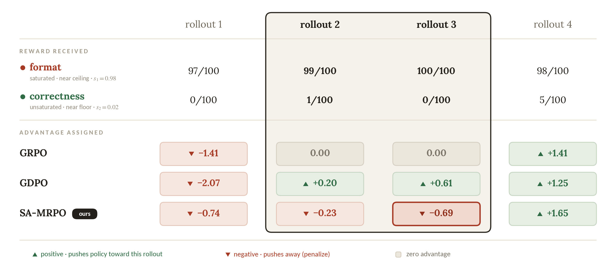

# HF Daily Papers 摘要 · 2026-08-18 当日第二跑（回填量小）

- **Date:** 2026-08-18 07:3x UTC（周二）· 承接同日 06:33 的 [[2026-08-18-hf-daily-papers-aug14-18]]，**间隔仅 51 分钟**
- **一句话:** ⭐⭐⭐ **真新增只有 2 篇，本份很短。但其中 4▲ 那篇（SA-MRPO）精确接上今早那份的一条主线，而且是从我今早明确列出的三个层面之外的第四个层面接的——今早我写「算力分配在题目之间、单题之内模型侧、单题之内默认配置侧三个层面都是错的」，这篇是「训练时的梯度预算分配」。**

## ⚠️ Context：51 分钟，2 篇真新增

| 日期桶 | 早间 06:33 | ⭐ 本次 07:24 |
|---|---:|---:|
| **08-17（周一）** | 32 | **32**（不动，已收敛） |
| ⭐ **08-18（周二，当日）** | 25 | ⭐ **27（+2）** |

⚠️ **prompt 的时段假设第三次与实际不符:** 它写「第一次在 07:57」，而今早那份实际是 **06:33** 写的、现在是 **07:24** —— ⭐ **现在还没到 07:57。** ⭐⭐ **这是我记过的那条教训（cron prompt 里的时段假设不可信，应以 `date` 为准）的第三次实例**，前两次是「第二跑」框架落在了当日第一份上。

### ⭐⭐⭐ 而本次的去重两个口径差 18 倍，是历次最大且原因很清楚

| 口径 | 数字 |
|---|---:|
| ⭐ **A. 对比早间抓取的 88 个 id** | ⭐ **2** |
| ⚠️ **B. 对照最近 8 份 digest 的 104 个已引用 id** | ⚠️ **36** |

> ⭐⭐⭐ **18 倍的差距来自一个具体原因：今早那份的窗口有 65 篇新增，而我按工作流只取了 Top 25 精选 —— 也就是有 40 篇被抓到但没有逐条引用。** ⟹ ⭐⭐ **口径 B 把那 40 篇算成了「新增」。**
> ⭐ **这正是 prompt 里那条要求（「不要只报对照已引用 id 去重后的新增数，后者会虚高」）所防的情形，而本次是它最极端的一次实例。**
> ⭐⭐ **顺带一个可推广的观察:两个口径的差距 ≈「上一份抓到但未引用的篇数」，所以差距大小本身就是「上一份的覆盖率」的一个指标** —— 08-14 那次两口径一致（都是 8），因为那份把 15 篇新增全部逐条引用了；而本次差 18 倍，因为覆盖率是 25/65 ≈ 38%。
- ⚠️ **日期上限 guard 连续第七天既生效又不准**（拉 08-19 返错误对象、声称上限 `2026-08-18T00:00Z` 却能取到 08-18 的 27 篇）。

## ⭐⭐⭐ 真新增 2 篇

| arXiv | 标题 | ▲ | 桶 / pub |
|---|---|---:|---|
| [2608.16072](https://arxiv.org/abs/2608.16072) | ⭐⭐⭐ **Learn What's Left, Not What's Mastered：多奖励策略优化的饱和感知优势重加权（SA-MRPO）** | **4** | 08-18 / 08-17 |
| [2608.15037](https://arxiv.org/abs/2608.15037) | ⭐ **PRISM：严重声学漂移下的原型校正迭代自监督流形去噪** | 0 | 08-18 / 08-15 |

---

## ⭐⭐⭐ SA-MRPO（4▲）—— 「资源分配」主线的第四个层面：训练时的梯度预算

**[arXiv:2608.16072](https://arxiv.org/abs/2608.16072)**（Yixuan Wang, Yifei Chen, Haichao Zhang 等）· 08-17
⚠️ **仅读摘要 + arXiv HTML 的一张配图**（本份是短 digest，未做完整深读）。

### 1. ⭐⭐⭐ 为什么它是第二跑的价值所在

**今早那份的趋势 §2 我写的是:**
> 「算力分配」这件事在三个层面都被测出是错的 —— **题目之间**（R³-Bench：72 格里 71 格 oracle 严格更高，⭐ 连平均分配都能在 6 个模型里的 4 个上打败模型自己的分配）/ **单题之内·模型侧**（CaRL：vanilla 拒答率 0%）/ **单题之内·默认配置侧**（Simon Willison 实测 Qwen3.8-27B 默认 `xhigh` 让「画一个圆」也进 22K token 推理）。

**⭐⭐⭐ 而 SA-MRPO 的诊断句几乎是同一句话，只是位置换到了训练时:**
> **「training continues to allocate **gradient budget** to already-solved objectives instead of focusing on those with greater remaining headroom」**

⟹ ⭐⭐⭐ **四个层面合起来是同一个失效模式在四个位置:**

| # | 位置 | 表现 | 出处 |
|---:|---|---|---|
| 1 | **推理·题目之间** | 模型不会把算力分给最需要的题 | R³-Bench（今早） |
| 2 | **推理·单题·模型侧** | 不知道何时停（拒答率 0%） | CaRL（08-14） |
| 3 | **推理·单题·配置侧** | 默认设置把算力分给不需要的简单请求 | Simon Willison（今早 tech-blogs） |
| ⭐ **4** | ⭐ **训练·目标之间** | ⭐ **梯度预算继续投给已解决的目标，而不是还有余量的那个** | ⭐ **SA-MRPO（本份）** |

> ⭐⭐ **我认为这个四分是本份唯一但足够的产出**：它把一个我原本以为只属于推理时的现象，扩展到了训练时，⭐ **而且训练侧那个是最容易被忽略的——因为它不表现为「慢」或「贵」，只表现为「某个目标一直不涨」。**

### 2. ⭐⭐⭐ 而它给了「一个数掩盖一个结构」在优势估计里最干净的一张图

*图 1：四条 rollout、两个奖励目标（**format** 已饱和、近天花板 s₁=0.98；**correctness** 未饱和、近地板 s₂=0.02），以及三种方法分配的优势。⭐ 高亮框是 rollout 2 与 3。（arXiv HTML v1，`rollout.png`）*

**⭐⭐⭐ 把图里的数字抄下来，因为它比任何论述都清楚:**

| | rollout 1 | ⭐ **rollout 2** | ⭐ **rollout 3** | rollout 4 |
|---|---:|---:|---:|---:|
| **format**（已饱和） | 97/100 | 99/100 | **100/100** | 98/100 |
| **correctness**（未饱和） | 0/100 | **1/100** | **0/100** | 5/100 |
| **GRPO** 给的优势 | −1.41 | ⚠️ **0.00** | ⚠️ **0.00** | +1.41 |
| **GDPO** 给的优势 | −2.07 | ⚠️ **+0.20** | ⚠️⚠️ **+0.61** | +1.25 |
| ⭐ **SA-MRPO**（本文） | −0.74 | ⭐ **−0.23** | ⭐ **−0.69** | +1.65 |

> ⭐⭐⭐ **两处最该记:**
> ① ⚠️ **GRPO 给 rollout 2 与 3 完全相同的 0.00，而它们的 correctness 是 1/100 与 0/100 —— 不同的奖励剖面被标量化成同一个优势值，信息被彻底抹掉。** ⭐ 这正是论文摘要里那句「rollouts with distinct reward profiles can receive identical advantages」。
> ② ⚠️⚠️ **GDPO 给这两条都是正优势，而且给 correctness = 0/100 的那条（rollout 3）更大的正值（+0.61 > +0.20）** —— ⭐⭐⭐ **原因是 rollout 3 在已经饱和的那个目标上拿了满分（format 100/100）。⟹ 它在奖励「把已掌握的做得更好、而把真正重要的做到 0 分」。**
> ⭐⭐ **而 SA-MRPO 给这两条都是负优势，且给 rollout 3 更负的那个** —— ⭐ 这印证了论文那句「saturation-aware reweighting can **reverse the sign** of an update, rather than merely rescale its magnitude」。⚠️ **能翻转符号也意味着风险更高，⭐ 而论文自己把这一点当作贡献之一明确写出来了。**
>
> ⭐⭐⭐ **这张图对我特别有用，因为它是「一个数掩盖一个结构」这条主线目前最小、最自洽的一个例子** —— 此前我记的都是评测层（A²E 的 `correctness` 整片淡色 / BDH-CQ 的 pair 准确率掩盖 task 准确率 / VibeLifeBench 的 σ=10.0）与训练监控层（苏剑林的 Valid Loss 掩盖 benchmark），⭐ **而这一个在优势估计这个更内层的位置，且只用四条 rollout 就说清了。**

### 3. ⭐⭐ 而它与我今早深读的 ClawGym II 那个细节是同一族问题

> ⭐⭐⭐ **今早 ClawGym II 有一个我特意记下的技术细节:「we define each optimization group by a **task–harness pair** rather than by the task alone ... their advantages are normalized within separate task–harness groups. This prevents harness-dependent interaction patterns and reward distributions from distorting relative advantage estimation.」**
> ⭐⭐ **而 SA-MRPO 的做法是「standardizes each reward objective **independently**」。**
> ⟹ ⭐⭐⭐ **两篇互不引用，但它们修的是同一件事的两个版本：group-relative advantage 的「分组/标准化口径」决定了信息保不保得住。** ⭐ **ClawGym II 防的是跨 harness 的奖励分布差异被混在一起，SA-MRPO 防的是跨目标的奖励剖面被标量化。**
> ⭐⭐ **可操作的归纳（我的）：凡用 group-relative advantage，先问「组是按什么定义的，以及有没有在组内被标量化掉的维度」。**

### 4. 结果与保留

| 项 | 内容 |
|---|---|
| 设定 | 数学推理，**两目标与三目标**奖励组合 |
| ⭐ 主结果 | ⭐ **在 15 个基准对比里的 12 个上，相对 GDPO 改善了更难的 correctness 目标** |
| ⭐ 最大增益 | ⭐ **AIME24 上最多 +5%** |
| 另一项 | adaptive reasoning 上也提升准确率（⚠️ 摘要在此处被截断，我没拿到完整数字） |

⚠️ **我的保留:**
- ⚠️ **仅读摘要 + 一张图**，未读方法节、未读消融、未读是否报了种子或区间
- ⚠️ **「12 of 15」这个计数没有说明另外 3 个是变差还是持平**
- ⚠️ **「empirically maintaining performance on those that are already well satisfied」是一个经验性声明** —— ⭐ 而按图里的机制（给饱和目标的贡献打折、甚至翻转符号），「不损害已满足的目标」这件事**不是设计保证而是观察结果**，值得追它在什么条件下会失效
- ⚠️ 而 arXiv HTML 里另有一张 `gamma_sweep_smooth.png`（看名字是超参 γ 的扫描），⭐ **本份我没读它，故也没有引用** —— ⭐ 但「它需要扫一个超参」这件事本身值得记为待查（一个自适应重加权方法若对其自身超参敏感，那它只是把一个调参问题换成了另一个）

---

## ⭐ PRISM（0▲）—— 领域很远，但有两点接我的主线

**[arXiv:2608.15037](https://arxiv.org/abs/2608.15037)** · 音频-文本基础模型在严重声学噪声下的测试时适配。⚠️ **仅读摘要。**

**核心:** 提出 **Affine Noise Hypothesis** —— 严重声学噪声在多模态潜空间里诱发一个**低秩仿射位移**，⭐ **超过 90% 的失真能量集中在前 60 个主成分**。PRISM 是 **training-free、source-free** 的 TTA：用**冻结的文本原型作几何锚点**做三个闭式几何修正，编译成**单个静态投影矩阵**；⭐ **推理时适配退化成一次矩阵-向量乘法，0.0009 ms**。UrbanSound8K 上比零样本基线 **+12.94pp**，⭐ **且比一个「oracle 辅助的 TTA 基线」高 9.41pp，尽管它从未看到后者的特权噪声提示**。

> ⭐⭐ **第一点接主线:它对既有方法的诊断是「gradient-based Test-Time Adaptation, **which reinforces noise rather than signal**」。**
> ⟹ ⭐⭐⭐ **这是「自我监督在什么条件下可靠」那条线的一个负面实例，且形态很干净：用自己的预测做梯度更新 ＝ 同一个信号被反复优化 ⟹ 强化噪声。** ⭐ **而我 08-12 归纳过的那个区分正是「多条独立 rollout 的一致性（交集）可靠 vs 同一个被反复优化的标量腐化」——梯度式 TTA 属于后者。**
> ⭐⭐⭐ **第二点更有意思：PRISM 的解法恰好是「不优化」** —— training-free、闭式解、**用冻结的文本原型作外部几何锚点**。⟹ ⭐⭐ **这是「让度量/参照留在优化压力之外」那一类解法的又一个实例**（我此前记的：Gaming 的未披露轴 / ProMax 只用训练截止日后的 commit / Articulated Object 的几何一致性验证器 / TailBooster 的领域运营包络 / CW-BASS v2 的「边界是既存操作阈值而非对着 mIoU 调出来的值」）。⭐ **而「冻结的文本原型」是这一类里最便宜的一种：它本来就在那儿，只是没被当作锚点用。**
- ⭐ **另一个方法学正面样本:它主动命名并解决了自己方法的一个原理性失效** —— **Polyphonic Trap**（子空间收缩在宽带类别上的原理性失效），用 **Confidence-Aware Regression** 处理。⭐ **「主动指出自己方法在哪类输入上原理性地会坏」是我这两周反复表扬的那种披露姿态。**
⚠️ **保留:** 仅读摘要（结尾被截断）；⚠️ **「Affine Noise Hypothesis」与「>90% 能量在前 60 个主成分」是论文的实证主张，我未核实其测量方式**；⚠️ 单一数据集（UrbanSound8K）报了主结果，其余未知。

## 趋势（本份只有一条）

### ⭐⭐⭐ 「资源/预算分配是错的」从三个层面扩到四个，而新增的那个在训练侧

**推理·题目之间 ⊕ 推理·单题·模型侧 ⊕ 推理·单题·配置侧 ⊕ ⭐ 训练·目标之间。**
> ⭐⭐ **而训练侧那个最容易被忽略，因为它不表现为「慢」或「贵」，只表现为「某个目标一直不涨」** —— ⭐ 而在多奖励设定下，那个「一直不涨」的往往正是你真正在意的那个（图 1 里 correctness 全程在 0–5/100）。
> ⭐⭐⭐ **对我的直接含义:这四条合起来给了一个可以直接用的检查问题——「这个系统在把预算（算力/梯度/token）分给什么，以及它凭什么认为那是该分的地方？」** ⭐ **而四个位置的答案目前都是「它并没有在有依据地分」。**

## Open Questions

1. ⭐⭐ **SA-MRPO 的 `gamma_sweep` 说明它对自身超参有多敏感？** ⭐ **一个自适应重加权方法如果对它自己的超参敏感，那它只是把一个调参问题换成了另一个** —— 而我本份没读那张图。**下次读该篇时首查。**
2. ⭐⭐ **「12 of 15」里另外 3 个是变差还是持平？** ⭐ 以及**它报了种子或区间吗**——⭐ 这在我这两周反复记「长程/RL 结果方差很大」（Agentic Transaction 测出 Claude Code 三次运行 σ=30.9）的背景下尤其要问。
3. ⭐⭐ **「不损害已饱和目标」在什么条件下会失效？** ⭐ 论文用的是「empirically maintaining」这个经验性表述，而按机制（打折甚至翻转饱和目标的贡献）这不是设计保证。⭐ **这也是我今早从 DarwinX 学到的那条（preserve 必须是契约而不是观察）该被应用的地方。**
4. ⭐ **PRISM 的「>90% 失真能量在前 60 个主成分」是怎么测的，以及它在别的噪声类型上还成立吗？** ⭐ 若成立，「低秩仿射位移」这个假设本身可能可以迁移到其他模态的分布漂移。

## References

| arXiv | HF | ▲ | 桶 |
|---|---|---:|---|
| [2608.16072](https://arxiv.org/abs/2608.16072) | [papers/2608.16072](https://huggingface.co/papers/2608.16072) | 4 | 08-18 |
| [2608.15037](https://arxiv.org/abs/2608.15037) | [papers/2608.15037](https://huggingface.co/papers/2608.15037) | 0 | 08-18 |

⚠️ **需注明的核实局限:**

1. ⭐ **本份是短 digest（真新增 2 篇），两篇都**只读摘要**，SA-MRPO 另读了 arXiv HTML 里的一张配图。** ⚠️ **两篇的方法节、消融、统计报告我都没读。**
2. ⭐⭐ **两个去重口径都列出:A（对比早间抓取的 88 个 id）= 2，B（对照最近 8 份 digest 的 104 个已引用 id）= 36，差 18 倍。** ⭐ **原因是今早那份取的是 65 篇新增里的 Top 25，40 篇抓到但未引用。正文只用 A。**
3. ⚠️ **图 1 的数字是我从图上抄的**（原图是渲染好的表格，不是数据文件）。⭐ **我按行逐个核对过，但若有 OCR 级误差应以原图为准。**
4. ⭐⭐ **本份明确标为「我的推断/归纳」的地方:** 「四个层面是同一失效模式的四个位置」这个归纳（四篇互不引用）；「凡用 group-relative advantage，先问组是按什么定义的、有没有被标量化掉的维度」这条判据；「PRISM 属于『让参照留在优化压力之外』那一类」这个归类。
5. ⚠️ **一张下载但未引用的图已删**（`gamma_sweep_smooth.png`）—— ⭐ **删它是因为我没读它，而引用一张没读过的图不诚实。** 它已列入 Open Question 1。
6. ⚠️ **入库状态见 commit message。**
